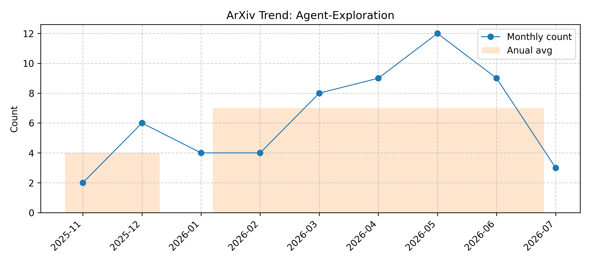

# Agent-Exploration

> Updated on 2026.06.22

[🔙 Back to Index](README.md)

| Date | Title | Categories | Abstract | PDF | Code |
|:---|:---|:---|:---|:---|:---|
|**2026-06-18**|**The Tao of Agency: Autotelic AI, Embedded Agency and Dissolution of the Self**|cs.AI| 

Full Abstract
Most artificial intelligence systems are built on the assumption that goals are exogenous and specified by the designer. Exploring what happens when an agent begins generating its own goals opens the field of autotelic AI. Agents are expected not merely to pursue objectives but to discover them. In this article, we trace its consequences through intrinsic motivation, resource-driven priors, causal-interventional learning, homeostasis, and embeddedness; the last of which is found to be a necessary but not sufficient condition for autotelic agency. Embeddedness individuates the agent at the cost of revealing that the individuation is non-unique, such that the same dynamics admit many valid partitions, each defining a different candidate self.   The deepest problem with autotelic AI is therefore not how the agent generates goals, but how it generates and relativizes the self to which the goals are assigned. The agent must believe in its own boundary in order to act, and see through that boundary in order to understand. We consolidate these developments into a single framework and extend it along three directions: a quantum formulation in which the agent-environment cut becomes physical, a philosophical reading against non-dual contemplative traditions, and a concrete LLM-based agentic instantiation.
|[2606.19924v1](http://arxiv.org/abs/2606.19924v1)| null|
|**2026-06-12**|**Learning Coordinated Preference for Multi-Objective Multi-Agent Reinforcement Learning**|cs.MA, cs.AI| 

Full Abstract
Cooperative multi-objective multi-agent reinforcement learning (MOMARL) models team decision making under multiple, potentially conflicting objectives. In this setting, conflicts arise not only across objectives but also across agents with different observations, roles, and contributions. We propose Preference Coordinated Multi-agent Policy Optimization (PCMA), which learns coordinated agent-specific preferences to enable complementary trade-offs among agents. Theoretically, we formulate cooperative MOMARL as a team-optimal game and show that, under suitable conditions, preference diversity can induce team improvement through a first-order improvement decomposition. Experiments on multiple cooperative MOMA environments and a practical traffic-control scenario show that PCMA improves both performance and trade-off coordination.
|[2606.14693v1](http://arxiv.org/abs/2606.14693v1)| null|
|**2026-06-10**|**Exploration Structure in LLM Agents for Multi-File Change Localization**|cs.SE, cs.AI| 

Full Abstract
Software engineering tools increasingly rely on LLM based agents to localize files to change to resolve a software issue. Most AI agents explore repositories linearly, that is, visiting one directory or file per step. We postulate that this is a structural mismatch for changes that span several subsystems. We compare linear sequential exploration against non-linear, domain-scoped parallel agentic exploration. Using SWE Bench Pro as initial benchmark, we focus on ansible as an exemplar. We construct an approach for persistent-session evaluation of GitHub issues anchored at a single base commit. We compare our non-linear domain-agent file traversal system against a base LLM without direct repository access, a single agent Recursive Language Model (RLM) baseline with a persistent Python REPL and an external CLI baseline using Codex 5.5 High. Domain scoped parallel agent spawning with a small Haiku-class model achieves the highest micro F1 among Haiku class models by a large margin. Domain-agents is the second highest behind only the much larger Codex 5.5 High on our own expanded benchmark including over more recent PRs from 2025 and 2026. On the original, curated, 2020 SWE-bench Pro benchmark, a larger Sonnet plain LLM baseline attains higher micro F1 by predicting few files, leading to higher precision, but at significantly lower all gold recall. We also present three additional findings. First, documentation evolution is a latent dependency unresolved by any approach. Second, naive file system access can degrade localization driven by test-file over prediction. Lastly, forced multi-agent consultation does not measurably help and raises token cost substantially.
|[2606.11976v1](http://arxiv.org/abs/2606.11976v1)| null|
|**2026-06-02**|**Learning When Not to Act: Mitigating Tool Abuse in Agentic Reinforcement Learning**|cs.AI| 

Full Abstract
Agentic reinforcement learning can induce tool abuse, where models overuse external tools even for queries solvable by internal reasoning. Existing approaches mitigate this issue with uniform tool-use penalties or hard limits, which reduce tool frequency but may also suppress useful tool-assisted exploration. We propose EAPO, an Efficient Agentic Policy Optimization framework that learns selective tool use. EAPO introduces tool-free trajectories into each rollout group, applies difficulty-aware reward shaping to penalize redundant tool calls mainly on easier queries, and uses confidence-aware token reweighting to improve policy learning. Across nine mathematical and knowledge-intensive reasoning benchmarks, EAPO consistently improves the accuracy efficiency trade-off on Qwen2.5-3B, Qwen2.5-7B, and Llama3.1-8B. Compared with GRPO, EAPO improves average performance by 10.45%, 7.27%, and 9.69%, while reducing average tool calls by 18.33%, 18.33%, and 24.59%, respectively. These results show that agents can learn when not to use tools without compromising tool-integrated reasoning.
|[2606.02132v2](http://arxiv.org/abs/2606.02132v2)| null|
|**2026-05-29**|**Sophrosyne: Agentic Exploration of Relational Data Systems Needs Moderation**|cs.DB, cs.AI| 

Full Abstract
Text2SQL agents powered by LLMs translate natural language intent into SQL by exploring the data system through tool calls before formulating the query. However, to ensure secure and scoped access, data systems construct environments with explicit API surfaces. We study and categorize these APIs exposed today as either coarse-grained or fine-grained and posit that choosing between them presents a fundamental tradeoff between cost-efficient exploration and accurate SQL generation. Most data systems expose fine-grained APIs, but this inadvertently disadvantages agents: they over-explore, incorporating irrelevant schema elements into their query formulation and produce inaccurate results. We argue that curbing over-exploration is key to the effective use of these API surfaces, and propose Sophrosyne, a data system environment that augments API responses with directives that guide the agent's exploration process. Initial results show that directives reduce over-exploration by 4.6x and boost accuracy by up to 12.4% (approx. 4 percentage points).
|[2605.30862v1](http://arxiv.org/abs/2605.30862v1)| null|
|**2026-05-28**|**Code-QA-Bench: Separating Code Reasoning from Documentation Memorization in Repository-Level QA**|cs.SE, cs.AI| 

Full Abstract
We present Code-QA-Bench, a fully automated framework for synthesizing repository-level code understanding benchmarks that separates genuine code comprehension from documentation recall and pretraining memorization. The framework makes two methodological contributions: (1) an answer-first generation pipeline where a tool-equipped agent explores source code to produce verified gold answers before deriving questions, ensuring every task is grounded in real code structure; and (2) a three-condition experimental design evaluating agents under closed-book (no repository), code-only (documentation removed), and documented (full repository) conditions, with deltas directly quantifying documentation utility and memorization.   We generate 528 code-derivable and 100 doc-dependent tasks across 10 Python repositories from SWE-Bench, scored by an LLM judge on accuracy, completeness, and specificity. Experiments on four frontier models reveal that code access is the dominant factor (+0.23 mean gain over closed-book), documentation provides modest additional benefit (+0.071 on doc-dependent tasks), and code-only $\approx$ documented on code-derivable tasks, validating the design. The framework is open-source and applicable to any well-documented Python repository.
|[2605.29277v1](http://arxiv.org/abs/2605.29277v1)| null|
|**2026-05-24**|**Cultivating Machine Intelligence: The OMEGA Shift from Top-Down Optimization to Autopoietic Cognitive Ecologies**|cs.NE, cs.AI| 

Full Abstract
The dominant artificial intelligence paradigm trains neural architectures via gradient descent against proxy objectives and reinforcement learning from human feedback. While remarkably capable, this top-down optimization inherently generates structural failure modes, including hallucination, sycophancy, reward hacking, and alignment fragility, which represent paradigmatic limitations rather than mere engineering defects. In response, we introduce RECLAIM (Recursive, Ecological, Cognitive, Lifelike, Adaptive, Intelligent Machine), a theoretical framework for cultivating intelligence through computational ecology rather than engineering it through strict optimization. The model is supported by four interlocking theoretical pillars. General Darwinism replaces gradients with blind variation and selective retention, while non-agentic emergence substitutes evaluative rewards with environmental physics to structurally prevent specification gaming against human intent. Concurrently, the Polya-Hebbian bridge applies Polya urn dynamics to Hebbian reinforcement for path-dependent specialization, and the free energy principle is integrated as environmental thermodynamics rather than as an agent objective. The architecture situates autopoietic units, bounded by Markov blankets and competing for finite computational energy, within a data ecology shaped by cognitive food chains and Red Queen arms races. This framework suggests the spontaneous emergence of dual-process cognition, sensory specialization, analogical reasoning, and intrinsic motivation as natural consequences of evolution under resource constraints. We conceptualize this paradigm transition as the OMEGA shift, representing a move from optimization and maximization to emergence through generative autopoiesis.
|[2605.25062v1](http://arxiv.org/abs/2605.25062v1)| null|
|**2026-05-23**|**AgentFugue: Agent Scaling for Long-Horizon Tasks through Collective Reasoning**|cs.AI, cs.CL| 

Full Abstract
Recent progress on long-horizon agentic tasks has been driven largely by scaling up individual agents through stronger models, better tools, and more effective scaffolding. In contrast, much less is understood about scaling out: whether multiple peer agents, all targeting the same task, can become an additional source of capability without relying on explicit role specialization or workflow orchestration. We study this question and propose AgentFugue, a collective reasoning framework built around a shared reasoning hub. As peer agents explore the same task in parallel, the hub records concise notes on what each agent has established, attempted, or ruled out, and enables each agent to selectively access what other agents have discovered in a form useful for its current search. This design turns otherwise isolated trajectories into a connected ecology of reusable intermediate reasoning without requiring centralized planning. We instantiate the hub as a plug-in communication layer, trained with supervised fine-tuning and end-to-end reinforcement learning. Across the challenging long-horizon settings we study, AgentFugue improves over strong baselines. Our results suggest that collective reasoning can turn scaling out peer agent systems into a distinct source of capability gains, rather than merely a way of spending more compute.
|[2605.24486v1](http://arxiv.org/abs/2605.24486v1)| null|
|**2026-05-22**|**Goal-Conditioned Agents that Learn Everything All at Once**|cs.LG, cs.AI| 

Full Abstract
A goal-conditioned reinforcement learning agent exploring an environment will see a wealth of information throughout a trajectory, most of which is discarded when only performing on-policy updates with respect to the commanded goal. All-goals learning, where each transition is used for learning off-policy with respect to every goal, allows agents to extract maximal information, however it is usually computationally infeasible when done via naive relabelling. This can be overcome by jointly outputting values and actions for every goal at once, allowing for efficient, parallel all-goals updates with a single pass through the network, in a process we call Learning Everything all at Once (LEO). We show that this approach significantly outperforms other methods on goal-conditioned Craftax and is competitive with existing baselines on continuous control environments, while achieving a >250x speed-up compared to all-goals relabelling. We then go on to show that this approach can be made even more powerful by using LEO as a teacher network, rather than a direct actor. We hope that, by unlocking all-goals learning at scale, LEO can serve as a useful tool for RL practitioners in complex environments. We open source our code.
|[2605.23551v1](http://arxiv.org/abs/2605.23551v1)| null|
|**2026-05-21**|**Remember to be Curious: Episodic Context and Persistent Worlds for 3D Exploration**|cs.LG| 

Full Abstract
Exploration is a prerequisite for learning useful behaviors in sparse-reward, long-horizon tasks, particularly within 3D environments. Curiosity-driven reinforcement learning addresses this via intrinsic rewards derived from the mismatch between the agent's predictive model of the world and reality. However, translating this intrinsic motivation to complex, photorealistic environments remains difficult, as agents can become trapped in local loops and receive fresh rewards for revisiting forgotten states. In this work, we demonstrate that this failure stems from a lack of spatial persistence and episodic context. We show that effective curiosity requires a model of the world that is persistent and continuously updated, paired with an agent that maintains an episodic trajectory history to navigate toward novel regions. We achieve this using an online 3D reconstruction as a persistent model of the world, while the agent policy is parameterized as a sequence model over RGB observations to maintain episodic context. This design enables effective exploration during training while allowing the agent to navigate using solely RGB frames at deployment. Trained purely via curiosity on HM3D, our agent outperforms RL-based active mapping baselines and generalizes zero-shot to Gibson and AI-generated worlds. Our end-to-end policy enables efficient adaptation to downstream tasks, such as apple picking and image-goal navigation, outperforming from-scratch baselines. Please see video results at https://recuriosity.github.io/.
|[2605.22814v1](http://arxiv.org/abs/2605.22814v1)| null|
|**2026-06-14**|**SkillsVote: Lifecycle Governance of Agent Skills from Collection, Recommendation to Evolution**|cs.CL, cs.AI| 

Full Abstract
Long-horizon LLM agents generate traces that could become reusable experience, but raw trajectories are noisy, local, and hard to govern. Agent Skills offer a structured artifact for combining procedural guidance, executable resources, and applicability boundaries. Yet open skill ecosystems contain redundant, uneven, environment-sensitive artifacts, and indiscriminate updates can pollute future context. We present SkillsVote, a lifecycle-governance framework for Agent Skills across collection, recommendation, attribution, and evolution. SkillsVote profiles a million-scale open source corpus for environment requirements, quality, and verifiability, and synthesizes tasks for verifiable skills. Before execution, it performs agentic library search over structured skill folders to expose instructional context. After execution, it decomposes trajectories into skill-linked subtasks, attributes outcomes to skill-guided execution, agent exploration, environment, and result signals, and admits only successful reusable discoveries to evidence-gated updates. Experiments on Terminal-Bench 2.0 and SWE-Bench Pro show that SkillsVote improves agent performance on challenging agentic coding benchmarks. The gains arise from two complementary pathways: online evolution over task streams at test time and offline transfer via frozen libraries built from either historical trajectories or curated open source skills.
|[2605.18401v2](http://arxiv.org/abs/2605.18401v2)| null|
|**2026-05-18**|**EXG: Self-Evolving Agents with Experience Graphs**|cs.AI| 

Full Abstract
Large language model (LLM)-based agents have demonstrated strong capabilities in complex reasoning and problem solving through multi-step interactions, yet most deployed agents remain behaviorally static, with knowledge acquired during execution rarely translating into systematic improvement over time. In response, a growing line of work on self-evolving agents explores how agents can improve through experience during deployment, but most existing approaches either rely on ad hoc reflection limited to single-task correction or adopt unstructured memory that accumulates fragmented experience with delayed usability. To address this limitation, we introduce EXG, an experience graph framework for self-evolving agents that explicitly organizes accumulated successes and failures into a structured, relational representation. EXG is the first experience graph designed for self-evolving agents, supporting both online, real-time graph growth during execution for immediate cross-task experience reuse, and offline reuse of a consolidated experience graph as an external memory module. This design also enables EXG to serve as a plug-and-play component for existing self-evolving agents, organizing prior experience into a unified experience graph and improving both solution quality and resource efficiency as deployment progresses. Extensive experiments across code generation and reasoning benchmarks show that EXG attains more favorable performance-efficiency trade-offs than reflection- and memory-based baselines in both online and offline evaluations. Our results suggest that structuring experience as a graph provides a principled foundation for scalable and transferable self-evolving agent behavior.
|[2605.17721v1](http://arxiv.org/abs/2605.17721v1)| null|
|**2026-05-07**|**Measuring Learning Progress via Gradient-Momentum Coupling**|cs.LG| 

Full Abstract
Measuring learning progress is essential for curiosity-driven exploration in reinforcement learning, but widely used signals such as prediction error often fail to distinguish meaningful, learnable patterns from random noise. This paper proposes Gradient-Momentum Coupling (GMC), a signal derived from optimization dynamics that quantifies how useful each sample's gradient is for ongoing learning by measuring its per-parameter normalized absolute product with the momentum from previous gradients. By leveraging momentum's natural filtering of noise and oscillations, GMC identifies samples that contribute to ongoing parameter updates. Controlled experiments demonstrate noise robustness and emergent curriculum learning, with the signal prioritizing tasks by learning speed rather than difficulty. Experiments on MiniGrid suggest that replacing prediction error with GMC within existing curiosity-driven architectures can improve robustness to observation noise.
|[2605.05856v1](http://arxiv.org/abs/2605.05856v1)| null|
|**2026-05-05**|**What You Think is What You See: Driving Exploration in VLM Agents via Visual-Linguistic Curiosity**|cs.AI| 

Full Abstract
To navigate partially observable visual environments, recent VLM agents increasingly internalize world modeling capabilities into their policies via explicit CoT reasoning, enabling them to mentally simulate futures before acting. However, relying solely on passive reasoning over visited states is insufficient for sparse-reward tasks, as it lacks the epistemic drive to actively uncover the ``known unknown'' required for robust generalization. We ask: Can VLM agents actively find signals that challenge and refine their internal world model through curiosity-driven exploration? In this work, we propose GLANCE, a unified framework that bridges reasoning and exploration by grounding the agent's linguistic world model into the stable visual representations of an evolving target network. Crucially, GLANCE leverages the discrepancy between linguistic prediction and visual reality as an intrinsic curiosity signal within reinforcement learning, steering the agent to actively explore areas where its internal model is uncertain. Extensive experiments across a series of agentic tasks show the effectiveness of GLANCE, and demonstrate that aligning ``what the agent thinks'' with ``what the agent sees'' is key to solving complex or sparse agentic tasks.
|[2605.03782v1](http://arxiv.org/abs/2605.03782v1)| null|
|**2026-05-04**|**AOCI: Symbolic-Semantic Indexing for Practical Repository-Scale Code Understanding with LLMs**|cs.SE| 

Full Abstract
Large language models struggle with understanding codebases beyond a certain scale -- repositories with hundreds of thousands of lines of code. Existing methods -- retrieval, summarization, agent exploration -- each construct a different view at query time. The view varies between runs, and what persists is typically ad-hoc rather than systematic. This paper introduces AOCI (AI-Oriented Code Indexing): a symbolic-semantic repository representation -- a structured blueprint that an LLM can read in a single pass to gain a complete repository-level picture of the system's architecture, dependencies, and key design decisions before any task. An AOCI index consists of encoding rules followed by entries, with one entry per code unit (file or database table). Each entry pairs a symbolic tag with semantic content. The symbolic component provides architectural coordinates; the semantic component carries function, dependencies, and constraints. Together they form a consistent, stable representation of the entire system. Index maintenance is incremental: when code changes, only affected entries are regenerated under protocol rules. The AOCI Platform automates this process, keeping the blueprint aligned with the code. We evaluated AOCI on four projects across three LLMs and six context conditions (2,160 evaluations). AOCI outperforms all deployable baselines and ranks second only to the Oracle upper bound in overall accuracy. On 19 industrial tasks across five systems, AOCI produced zero final-state defects, while three mainstream agent-based tools introduced defects in 12 tasks and consumed 4--130$\times$ more tokens ($p < 0.001$). The advantage grows with task complexity.
|[2605.02421v1](http://arxiv.org/abs/2605.02421v1)| null|
|**2026-05-03**|**Quality-Aware Exploration Budget Allocation for Cooperative Multi-Agent Reinforcement Learning**|cs.MA, cs.AI| 

Full Abstract
Cooperative multi-agent reinforcement learning (MARL) requires agents to discover joint strategies in a combinatorially large state-action space, yet effective coordination configurations are exceedingly rare. Intrinsic motivation, which augments task rewards with novelty bonuses, is a popular approach for driving exploration, but its effectiveness hinges on the exploration intensity $β$, where too large a value overwhelms the task signal and causes coordination collapse, while too small a value prevents discovery of rare strategies. We address two complementary challenges: adapting $β$ globally over training, and allocating the exploration budget across agents whose intrinsic reward signals vary in reliability. Our framework combines a return-conditioned sigmoid schedule (RCB) for global intensity control with a per-agent Reward Signal Quality (RSQ) metric that concentrates the exploration budget on agents with reliable signals. The core insight is that agents receiving noisy intrinsic rewards should explore less aggressively, and this allocation can be determined automatically from signal-to-noise statistics. Successor Distance (SD), a quasimetric intrinsic reward, naturally produces distinguishable per-agent signal quality, completing the framework with convergence and ordering preservation guarantees. On seven cooperative benchmarks (MPE, SMAX, MABrax), our method achieves top-tier returns across all environments.
|[2605.01865v1](http://arxiv.org/abs/2605.01865v1)| null|
|**2026-04-27**|**Leveraging Human Feedback for Semantically-Relevant Skill Discovery**|cs.LG, cs.AI| 

Full Abstract
Unsupervised skill discovery in reinforcement learning aims to intrinsically motivate agents to discover diverse and useful behaviours. However, unconstrained approaches can produce unsafe, unethical, or misaligned behaviours. To mitigate these risks and improve the practical desireability of discovered skills, recent work grounds the discovery process by leveraging human preference feedback. However, preference-based approaches are feedback-inefficient and inherently ill-equipped to deal with skill spaces composed of a variety of different skills such as running, jumping, walking, etc. To overcome this limitation, we introduce semantic labelling, a novel and feedback-efficient approach that leverages human cognitive strengths to identify and label semantically meaningful behaviours. Based on semantic labelling, we propose Semantically Relevant Skill Discovery (SRSD), a novel human-in-the-loop approach that collects semantic labels from human feedback and learns a reward function to encourage skills to be more semantically diverse and relevant. Through our experiments in a 2D navigation environment and four locomotion environments, we demonstrate that SRSD can improve semantic diversity and discover relevant behaviours while scaling effectively to a large variety of behaviours.
|[2604.24127v1](http://arxiv.org/abs/2604.24127v1)| null|
|**2026-04-21**|**Diversity Collapse in Multi-Agent LLM Systems: Structural Coupling and Collective Failure in Open-Ended Idea Generation**|cs.MA, cs.AI, cs.CL| 

Full Abstract
Multi-agent systems (MAS) are increasingly used for open-ended idea generation, driven by the expectation that collective interaction will broaden the exploration diversity. However, when and why such collaboration truly expands the solution space remains unclear. We present a systematic empirical study of diversity in MAS-based ideation across three bottom-up levels: model intelligence, agent cognition, and system dynamics. At the model level, we identify a compute efficiency paradox, where stronger, highly aligned models yield diminishing marginal diversity despite higher per-sample quality. At the cognition level, authority-driven dynamics suppress semantic diversity compared to junior-dominated groups. At the system level, group-size scaling yields diminishing returns and dense communication topologies accelerate premature convergence. We characterize these outcomes as collective failures emerging from structural coupling, a process where interaction inadvertently contracts agent exploration and triggers diversity collapse. Our analysis shows that this collapse arises primarily from the interaction structure rather than inherent model insufficiency, highlighting the importance of preserving independence and disagreement when designing MAS for creative tasks. Our code is available at https://github.com/Xtra-Computing/MAS_Diversity.
|[2604.18005v2](http://arxiv.org/abs/2604.18005v2)| null|
|**2026-04-19**|**Agents Explore but Agents Ignore: LLMs Lack Environmental Curiosity**|cs.CL, cs.LG| 

Full Abstract
LLM-based agents are assumed to integrate environmental observations into their reasoning: discovering highly relevant but unexpected information should naturally lead to a model exploiting its own discoveries. We show that this assumption is false for current LLM-based agents, which struggle to reflect or react to unexpected information. Across three benchmarks (Terminal-Bench, SWE-Bench, AppWorld), we inject complete task solutions into the agent environments to deliberately expose a task's solution to a model. While agents discover these solutions on Terminal-Bench in 79-81% of runs, they interact, or exploit, them in only 37-50% of cases. This gap is starkest in AppWorld: agents see documentation stating that a command "returns the complete solution to this task" in over 90% of attempts but exploit this in fewer than 7% of trials. We show that agents lack what we call environmental curiosity: the capability to recognize and investigate unexpected but relevant observations in response to environmental stimuli. We identify three main factors influencing environmental curiosity: available tools in the agent scaffold, test-time compute, and training data distribution. Our findings identify configurations that maximize curiosity also achieve the best performance on the unmodified benchmarks. Yet even jointly optimized agents still ignore discovered solutions in the majority of trials: current agents use the environment to fetch expected information, but not to revise their strategy or maximally exploit useful stimuli.
|[2604.17609v1](http://arxiv.org/abs/2604.17609v1)| null|
|**2026-04-17**|**Flexible Empowerment at Reasoning with Extended Best-of-N Sampling**|cs.LG| 

Full Abstract
This paper proposes a novel method that incorporates empowerment when reasoning actions in reinforcement learning (RL), thereby achieving the flexibility of exploration-exploitation dilemma (EED). In previous methods, empowerment for promoting exploration has been provided as a bonus term to the task-specific reward function as an intrinsically-motivated RL. However, this approach introduces a delay until the policy that accounts for empowerment is learned, making it difficult to adjust the emphasis on exploration as needed. On the other hand, a trick devised for fine-tuning recent foundation models at reasoning, so-called best-of-N (BoN) sampling, allows for the implicit acquisition of modified policies without explicitly learning them. It is expected that applying this trick to exploration-promoting terms, such as empowerment, will enable more flexible adjustment of EED. Therefore, this paper investigates BoN sampling for empowerment. Furthermore, to adjust the degree of policy modification in a generalizable manner while maintaining computational cost, this paper proposes a novel BoN sampling method extended by Tsalis statistics. Through toy problems, the proposed method's cability to balance EED is verified. In addition, it is demonstrated that the proposed method improves RL performance to solve complex locomotion tasks.
|[2604.15614v1](http://arxiv.org/abs/2604.15614v1)| null|
|**2026-02-26**|**Agentic Exploration of PDE Spaces using Latent Foundation Models for Parameterized Simulations**|cs.AI, cs.CV| 

Full Abstract
Flow physics and more broadly physical phenomena governed by partial differential equations (PDEs), are inherently continuous, high-dimensional and often chaotic in nature. Traditionally, researchers have explored these rich spatiotemporal PDE solution spaces using laboratory experiments and/or computationally expensive numerical simulations. This severely limits automated and large-scale exploration, unlike domains such as drug discovery or materials science, where discrete, tokenizable representations naturally interface with large language models. We address this by coupling multi-agent LLMs with latent foundation models (LFMs), a generative model over parametrised simulations, that learns explicit, compact and disentangled latent representations of flow fields, enabling continuous exploration across governing PDE parameters and boundary conditions. The LFM serves as an on-demand surrogate simulator, allowing agents to query arbitrary parameter configurations at negligible cost. A hierarchical agent architecture orchestrates exploration through a closed loop of hypothesis, experimentation, analysis and verification, with a tool-modular interface requiring no user support. Applied to flow past tandem cylinders at Re = 500, the framework autonomously evaluates over 1,600 parameter-location pairs and discovers divergent scaling laws: a regime-dependent two-mode structure for minimum displacement thickness and a robust linear scaling for maximum momentum thickness, with both landscapes exhibiting a dual-extrema structure that emerges at the near-wake to co-shedding regime transition. The coupling of the learned physical representations with agentic reasoning establishes a general paradigm for automated scientific discovery in PDE-governed systems.
|[2604.09584v1](http://arxiv.org/abs/2604.09584v1)| null|
|**2026-04-15**|**Reason in Chains, Learn in Trees: Self-Rectification and Grafting for Multi-turn Agent Policy Optimization**|cs.AI, cs.LG| 

Full Abstract
Reinforcement learning for Large Language Model agents is often hindered by sparse rewards in multi-step reasoning tasks. Existing approaches like Group Relative Policy Optimization treat sampled trajectories as independent chains, assigning uniform credit to all steps in each chain and ignoring the existence of critical steps that may disproportionally impact reasoning outcome. In this paper, we propose T-STAR(Tree-structured Self-Taught Agent Rectification), a framework that recovers the latent correlated reward structure across seemingly independent trajectories. Specifically, we consolidate trajectories into a unified Cognitive Tree by identifying and merging functionally similar steps/nodes. It enables an Introspective Valuation mechanism that back-propagates trajectory-level rewards through the tree to obtain a new notion of variance-reduced relative advantage at step-level. Using the Cognitive Tree, we also develop In-Context Thought Grafting to synthesize corrective reasoning by contrasting successful and failed branches at critical divergence points/steps. Our proposed Surgical Policy Optimization then capitalizes on the rich policy gradient information concentrated at these critical points/steps through a Bradley-Terry type of surgical loss. Extensive experiments across embodied, interactive, reasoning, and planning benchmarks demonstrate that T-STAR achieves consistent improvements over strong baselines, with gains most pronounced on tasks requiring extended reasoning chains.
|[2604.07165v2](http://arxiv.org/abs/2604.07165v2)| null|
|**2026-04-13**|**CuraLight: Debate-Guided Data Curation for LLM-Centered Traffic Signal Control**|cs.AI| 

Full Abstract
Traffic signal control (TSC) is a core component of intelligent transportation systems (ITS), aiming to reduce congestion, emissions, and travel time. Recent approaches based on reinforcement learning (RL) and large language models (LLMs) have improved adaptivity, but still suffer from limited interpretability, insufficient interaction data, and weak generalization to heterogeneous intersections.   This paper proposes CuraLight, an LLM-centered framework where an RL agent assists the fine-tuning of an LLM-based traffic signal controller. The RL agent explores traffic environments and generates high-quality interaction trajectories, which are converted into prompt-response pairs for imitation fine-tuning. A multi-LLM ensemble deliberation system further evaluates candidate signal timing actions through structured debate, providing preference-aware supervision signals for training.   Experiments conducted in SUMO across heterogeneous real-world networks from Jinan, Hangzhou, and Yizhuang demonstrate that CuraLight consistently outperforms state-of-the-art baselines, reducing average travel time by 5.34 percent, average queue length by 5.14 percent, and average waiting time by 7.02 percent. The results highlight the effectiveness of combining RL-assisted exploration with deliberation-based data curation for scalable and interpretable traffic signal control.
|[2604.05663v2](http://arxiv.org/abs/2604.05663v2)| null|
|**2026-04-02**|**ProCeedRL: Process Critic with Exploratory Demonstration Reinforcement Learning for LLM Agentic Reasoning**|cs.AI| 

Full Abstract
Reinforcement Learning (RL) significantly enhances the reasoning abilities of large language models (LLMs), yet applying it to multi-turn agentic tasks remains challenging due to the long-horizon nature of interactions and the stochasticity of environmental feedback. We identify a structural failure mode in agentic exploration: suboptimal actions elicit noisy observations into misleading contexts, which further weaken subsequent decision-making, making recovery increasingly difficult. This cumulative feedback loop of errors renders standard exploration strategies ineffective and susceptible to the model's reasoning and the environment's randomness. To mitigate this issue, we propose ProCeedRL: Process Critic with Explorative Demonstration RL, shifting exploration from passive selection to active intervention. ProCeedRL employs a process-level critic to monitor interactions in real time, incorporating reflection-based demonstrations to guide agents in stopping the accumulation of errors. We find that this approach significantly exceeds the model's saturated exploration performance, demonstrating substantial exploratory benefits. By learning from exploratory demonstrations and on-policy samples, ProCeedRL significantly improves exploration efficiency and achieves superior performance on complex deep search and embodied tasks.
|[2604.02006v1](http://arxiv.org/abs/2604.02006v1)| null|
|**2026-05-17**|**CORAL: Towards Autonomous Multi-Agent Evolution for Open-Ended Discovery**|cs.AI| 

Full Abstract
Large language model (LLM)-based evolution is a promising approach for open-ended discovery, where progress requires sustained search and knowledge accumulation. Existing methods still rely heavily on fixed heuristics and hard-coded exploration rules, which limit the autonomy of LLM agents. We present CORAL, the first framework for autonomous multi-agent evolution on open-ended problems. CORAL replaces rigid control with long-running agents that explore, reflect, and collaborate through shared persistent memory, asynchronous multi-agent execution, and heartbeat-based interventions. It also provides practical safeguards, including isolated workspaces, evaluator separation, resource management, and agent session and health management. Evaluated on diverse mathematical, algorithmic, and systems optimization tasks, CORAL sets new state-of-the-art results on 10 tasks, achieving 3-10 times higher improvement rates with far fewer evaluations than fixed evolutionary search baselines across tasks. On Anthropic's kernel engineering task, four co-evolving agents improve the best known score from 1363 to 1103 cycles. Mechanistic analyses further show how these gains arise from knowledge reuse and multi-agent exploration and communication. Together, these results suggest that greater agent autonomy and multi-agent evolution can substantially improve open-ended discovery. Code is available at https://github.com/Human-Agent-Society/CORAL.
|[2604.01658v2](http://arxiv.org/abs/2604.01658v2)| null|
|**2026-04-03**|**GraphWalker: Agentic Knowledge Graph Question Answering via Synthetic Trajectory Curriculum**|cs.CL| 

Full Abstract
Agentic knowledge graph question answering (KGQA) requires an agent to iteratively interact with knowledge graphs (KGs), posing challenges in both training data scarcity and reasoning generalization. Specifically, existing approaches often restrict agent exploration: prompting-based methods lack autonomous navigation training, while current training pipelines usually confine reasoning to predefined trajectories. To this end, this paper proposes \textit{GraphWalker}, a novel agentic KGQA framework that addresses these challenges through \textit{Automated Trajectory Synthesis} and \textit{Stage-wise Fine-tuning}. GraphWalker adopts a two-stage SFT training paradigm: First, the agent is trained on structurally diverse trajectories synthesized from constrained random-walk paths, establishing a broad exploration prior over the KG; Second, the agent is further fine-tuned on a small set of expert trajectories to develop reflection and error recovery capabilities. Extensive experiments demonstrate that our stage-wise SFT paradigm unlocks a higher performance ceiling for a lightweight reinforcement learning (RL) stage, enabling GraphWalker to achieve state-of-the-art performance on CWQ and WebQSP. Additional results on GrailQA and our constructed GraphWalkerBench confirm that GraphWalker enhances generalization to out-of-distribution reasoning paths. The code is publicly available at https://github.com/XuShuwenn/GraphWalker
|[2603.28533v2](http://arxiv.org/abs/2603.28533v2)| null|
|**2026-03-26**|**ReCUBE: Evaluating Repository-Level Context Utilization in Code Generation**|cs.SE, cs.AI| 

Full Abstract
Large Language Models (LLMs) have recently emerged as capable coding assistants that operate over large codebases through either agentic exploration or full-context generation. Existing benchmarks capture a broad range of coding capabilities, such as resolving GitHub issues, but none of them directly isolate and measure how effectively LLMs leverage repository-level context during code generation. To address this, we introduce ReCUBE, a benchmark in which LLMs reconstruct a masked file within a real-world repository, using all remaining source files, dependency specifications, and documentation as their only source of context. ReCUBE evaluates reconstructed code with usage-aware test cases that simulate both internal module logic and external cross-file integration, reflecting real-world software usage patterns. We further propose the Caller-Centric Exploration (CCE) toolkit, a set of dependency graph-based tools that can be integrated into agentic frameworks to guide agents toward the most relevant caller files during repository exploration. Experiments across eight models in four settings show that repository-level context utilization remains highly challenging even for state-of-the-art models, with GPT-5 achieving only 37.57% strict pass rate in the full-context setting. Agents augmented with our CCE toolkit consistently outperform all baselines across all evaluated models, with improvements of up to 7.56% in strict pass rate. We release our benchmark, code, and evaluation framework as open source for the NLP research community.
|[2603.25770v1](http://arxiv.org/abs/2603.25770v1)| null|
|**2026-05-13**|**Decoupling Exploration and Policy Optimization: Uncertainty Guided Tree Search for Hard Exploration**|cs.LG| 

Full Abstract
The process of discovery requires active exploration -- the act of collecting new and informative data. However, efficient autonomous exploration remains a major unsolved problem. The dominant paradigm addresses this challenge by using Reinforcement Learning (RL) to train agents with intrinsic motivation, maximizing a composite objective of extrinsic and intrinsic rewards. We suggest that this approach incurs unnecessary overhead: while policy optimization is necessary for precise task execution, employing such machinery solely to expand state coverage may be inefficient. In this paper, we propose a new approach that explicitly decouples exploration from policy optimization and bypasses RL entirely during the exploration phase. Our method uses a tree-search strategy inspired by the Go-With-The-Winner algorithm, paired with a measure of uncertainty to systematically drive exploration. By removing the overhead of policy optimization, our approach explores an order of magnitude more efficiently than standard intrinsic motivation baselines on hard exploration benchmarks. Further, we demonstrate that the trajectories discovered during exploration can be distilled into deployable policies using existing supervised backward learning algorithms, achieving state-of-the-art performance by a wide margin on Montezuma's Revenge, Pitfall!, and Venture without relying on domain-specific knowledge. Finally, we demonstrate the generality of our framework in high-dimensional continuous action spaces by solving the MuJoCo Adroit dexterous manipulation and AntMaze tasks in a sparse-reward setting, directly from image observations and without expert demonstrations or offline datasets. To the best of our knowledge, this has not been achieved before for the Adroit tasks.
|[2603.22273v4](http://arxiv.org/abs/2603.22273v4)| null|
|**2026-03-23**|**Adaptive Robust Estimator for Multi-Agent Reinforcement Learning**|cs.AI| 

Full Abstract
Multi-agent collaboration has emerged as a powerful paradigm for enhancing the reasoning capabilities of large language models, yet it suffers from interaction-level ambiguity that blurs generation, critique, and revision, making credit assignment across agents difficult. Moreover, policy optimization in this setting is vulnerable to heavy-tailed and noisy rewards, which can bias advantage estimation and trigger unstable or even divergent training. To address both issues, we propose a robust multi-agent reinforcement learning framework for collaborative reasoning, consisting of two components: Dual-Agent Answer-Critique-Rewrite (DACR) and an Adaptive Robust Estimator (ARE). DACR decomposes reasoning into a structured three-stage pipeline: answer, critique, and rewrite, while enabling explicit attribution of each agent's marginal contribution to its partner's performance. ARE provides robust estimation of batch experience means during multi-agent policy optimization. Across mathematical reasoning and embodied intelligence benchmarks, even under noisy rewards, our method consistently outperforms the baseline in both homogeneous and heterogeneous settings. These results indicate stronger robustness to reward noise and more stable training dynamics, effectively preventing optimization failures caused by noisy reward signals.
|[2603.21574v1](http://arxiv.org/abs/2603.21574v1)| null|
|**2026-03-10**|**From Phase Prediction to Phase Design: A ReAct Agent Framework for High-Entropy Alloy Discovery**|cond-mat.mtrl-sci, cs.AI| 

Full Abstract
Discovering high-entropy alloy (HEA) compositions that reliably form a target crystal phase is a high-dimensional inverse design problem that conventional trial-and-error experimentation and forward-only machine learning models cannot efficiently solve. Here we present a ReAct (Reasoning + Acting) LLM agent that autonomously proposes, validates, and iteratively refines HEA compositions by querying a calibrated XGBoost surrogate trained on 4,753 experimental records across four phases (FCC, BCC, BCC+FCC, BCC+IM), achieving 94.66\% accuracy (F1 macro = 0.896). Against Bayesian optimisation (BO) and random search baselines, the full-prompt agent achieves descriptor-space rediscovery rates of 38\%, 18\%, and 38\% for FCC, BCC, and BCC+FCC (Mann--Whitney $p \leq 0.039$), with proposals lying 2.4--22.8$\times$ closer to the experimental phase manifold than random search. An ablation reveals that domain priors shift the agent from landmark-alloy recall toward compositionally diverse exploration -- an uninformed agent scores higher rediscovery by concentrating on literature-dense families, while the full-prompt agent explores underrepresented space (unique ratio 1.0 vs.\ 0.39 for BCC+FCC). These regimes represent distinct criteria: proximity to known literature versus genuine discovery. Spearman analysis confirms agent reasoning is statistically aligned with empirical phase distributions ($ρ= 0.736$, $p = 0.004$ for BCC). This work establishes LLM-guided agentic reasoning as a principled, transparent, and manifold-aware complement to gradient-free optimisation for inverse alloy design.
|[2603.11068v1](http://arxiv.org/abs/2603.11068v1)| null|
|**2026-03-09**|**Oracle-Guided Soft Shielding for Safe Move Prediction in Chess**|cs.LG, cs.AI| 

Full Abstract
In high stakes environments, agents relying purely on imitation learning or reinforcement learning often struggle to avoid safety-critical errors during exploration. Existing reinforcement learning approaches for environments such as chess require hundreds of thousands of episodes and substantial computational resources to converge. Imitation learning, on the other hand, is more sample efficient but is brittle under distributional shift and lacks mechanisms for proactive risk avoidance. In this work, we propose Oracle-Guided Soft Shielding (OGSS), a simple yet effective framework for safer decision-making, enabling safe exploration by learning a probabilistic safety model from oracle feedback in an imitation learning setting. Focusing on the domain of chess, we train a model to predict strong moves based on past games, and separately learn a blunder prediction model from Stockfish evaluations to estimate the tactical risk of each move. During inference, the agent first generates a set of candidate moves and then uses the blunder model to determine high-risk options, and uses a utility function combining the predicted move likelihood from the policy model and the blunder probability to select actions that strike a balance between performance and safety. This enables the agent to explore and play competitively while significantly reducing the chance of tactical mistakes. Across hundreds of games against a strong chess engine, we compare our approach with other methods in the literature, such as action pruning, SafeDAgger, and uncertainty-based sampling. Our results demonstrate that OGSS variants maintain a lower blunder rate even as the agent's exploration ratio is increased by several folds, highlighting its ability to support broader exploration without compromising tactical soundness.
|[2603.08506v1](http://arxiv.org/abs/2603.08506v1)| null|
|**2026-03-04**|**Agentic Code Reasoning**|cs.SE, cs.AI, cs.PL| 

Full Abstract
Can LLM agents explore codebases and reason about code semantics without executing the code? We study this capability, which we call agentic code reasoning, and introduce semi-formal reasoning: a structured prompting methodology that requires agents to construct explicit premises, trace execution paths, and derive formal conclusions. Unlike unstructured chain-of-thought, semi-formal reasoning acts as a certificate: the agent cannot skip cases or make unsupported claims. We evaluate across three tasks (patch equivalence verification, fault localization, and code question answering) and show that semi-formal reasoning consistently improves accuracy on all of them. For patch equivalence, accuracy improves from 78% to 88% on curated examples and reaches 93% on real-world agent-generated patches, approaching the reliability needed for execution-free RL reward signals. For code question answering on RubberDuckBench Mohammad et al. (2026), semi-formal reasoning achieves 87% accuracy. For fault localization on Defects4J Just et al. (2014), semi-formal reasoning improves Top-5 accuracy by 5 percentage points over standard reasoning. These results demonstrate that structured agentic reasoning enables meaningful semantic code analysis without execution, opening practical applications in RL training pipelines, code review, and static program analysis.
|[2603.01896v2](http://arxiv.org/abs/2603.01896v2)| null|
|**2026-03-18**|**Theory of Code Space: Do Code Agents Understand Software Architecture?**|cs.SE, cs.AI| 

Full Abstract
AI code agents excel at isolated tasks yet struggle with multi-file software engineering requiring architectural understanding. We introduce Theory of Code Space (ToCS), a benchmark that evaluates whether agents can construct, maintain, and update coherent architectural beliefs during codebase exploration. Agents explore procedurally generated codebases under partial observability -- opening files under a budget -- and periodically externalize their belief state as structured JSON, producing a time-series of architectural understanding. Three findings emerge from experiments with four baselines and six frontier LLMs. First, the Active-Passive Gap is model-dependent: one model builds better maps through active exploration than from seeing all files at once, while another shows the opposite -- revealing that active exploration is itself a non-trivial capability absent from some models. Second, retaining structured belief maps in context acts as self-scaffolding for some models but not others, showing that the mechanism is model-dependent. Third, belief state maintenance varies dramatically: a smaller model maintains perfectly stable beliefs across probes while its larger sibling suffers catastrophic belief collapse -- forgetting previously-discovered components between probes. We release ToCS as open-source software. Code: https://github.com/che-shr-cat/tocs
|[2603.00601v4](http://arxiv.org/abs/2603.00601v4)| null|
|**2026-03-07**|**ARLArena: A Unified Framework for Stable Agentic Reinforcement Learning**|cs.AI| 

Full Abstract
Agentic reinforcement learning (ARL) has rapidly gained attention as a promising paradigm for training agents to solve complex, multi-step interactive tasks. Despite encouraging early results, ARL remains highly unstable, often leading to training collapse. This instability limits scalability to larger environments and longer interaction horizons, and constrains systematic exploration of algorithmic design choices. In this paper, we first propose ARLArena, a stable training recipe and systematic analysis framework that examines training stability in a controlled and reproducible setting. ARLArena first constructs a clean and standardized testbed. Then, we decompose policy gradient into four core design dimensions and assess the performance and stability of each dimension. Through this fine-grained analysis, we distill a unified perspective on ARL and propose SAMPO, a stable agentic policy optimization method designed to mitigate the dominant sources of instability in ARL. Empirically, SAMPO achieves consistently stable training and strong performance across diverse agentic tasks. Overall, this study provides a unifying policy gradient perspective for ARL and offers practical guidance for building stable and reproducible LLM-based agent training pipelines.
|[2602.21534v2](http://arxiv.org/abs/2602.21534v2)| null|
|**2026-05-31**|**APEX-SQL: Talking to the data via Agentic Exploration for Text-to-SQL**|cs.DB, cs.AI| 

Full Abstract
Text-to-SQL systems powered by Large Language Models have excelled on academic benchmarks but struggle in complex enterprise environments. The primary limitation lies in their reliance on static schema representations, which fails to resolve semantic ambiguity and scale effectively to large, complex databases. To address this, we propose APEX-SQL, an Agentic Text-to-SQL Framework that shifts the paradigm from passive translation to agentic exploration. Our framework employs a hypothesis-verification loop to ground model reasoning in real data. In the schema linking phase, we use logical planning to verbalize hypotheses, dual-pathway pruning to reduce the search space, and parallel data profiling to validate column roles against real data, followed by global synthesis to ensure topological connectivity. For SQL generation, we introduce a deterministic mechanism to retrieve exploration directives, allowing the agent to effectively explore data distributions, refine hypotheses, and generate semantically accurate SQLs. Experiments on BIRD (70.65% execution accuracy) and Spider 2.0-Snow (51.01% execution accuracy) demonstrate that APEX-SQL outperforms competitive baselines with reduced token consumption. Further analysis reveals that agentic exploration acts as a performance multiplier, unlocking the latent reasoning potential of foundation models in enterprise settings. Ablation studies confirm the critical contributions of each component in ensuring robust and accurate data analysis. Our code is released at https://github.com/Tencent/APEX-SQL-Project.
|[2602.16720v2](http://arxiv.org/abs/2602.16720v2)| null|
|**2026-02-22**|**TestExplora: Benchmarking LLMs for Proactive Bug Discovery via Repository-Level Test Generation**|cs.SE, cs.CL| 

Full Abstract
Given that Large Language Models (LLMs) are increasingly applied to automate software development, comprehensive software assurance spans three distinct goals: regression prevention, reactive reproduction, and proactive discovery. Current evaluations systematically overlook the third goal. Specifically, they either treat existing code as ground truth (a compliance trap) for regression prevention, or depend on post-failure artifacts (e.g., issue reports) for bug reproduction-so they rarely surface defects before failures. To bridge this gap, we present TestExplora, a benchmark designed to evaluate LLMs as proactive testers within full-scale, realistic repository environments. TestExplora contains 2,389 tasks from 482 repositories and hides all defect-related signals. Models must proactively find bugs by comparing implementations against documentation-derived intent, using documentation as the oracle. Furthermore, to keep evaluation sustainable and reduce leakage, we propose continuous, time-aware data collection. Our evaluation reveals a significant capability gap: state-of-the-art models achieve a maximum Fail-to-Pass (F2P) rate of only 16.06%. Further analysis indicates that navigating complex cross-module interactions and leveraging agentic exploration are critical to advancing LLMs toward autonomous software quality assurance. Consistent with this, SWEAgent instantiated with GPT-5-mini achieves an F2P of 17.27% and an F2P@5 of 29.7%, highlighting the effectiveness and promise of agentic exploration in proactive bug discovery tasks.
|[2602.10471v2](http://arxiv.org/abs/2602.10471v2)| null|
|**2026-05-20**|**CTFExplorer: Evaluating LLM Offensive Agents Through Multi-Target Web CTF Benchmarking**|cs.CR, cs.AI, cs.MA| 

Full Abstract
Existing benchmarks for LLM-based offensive security agents use isolated, single-target setups with a known vulnerable service and fixed objective. They measure exploitation effectively, but miss how real Capture-the-Flag (CTF) participants triage unknown surfaces, prioritize targets, and allocate effort under uncertainty. Current evaluations therefore fail to assess strategic reasoning beyond exploitation alone. To address this, we introduce \textit{CTFExplorer}, a benchmark suite that shifts offensive security evaluation toward a multi-target setting, which tests how agents explore, prioritize, and chain attacks. CTFExplorer deploys 40 web-based vulnerable services within a single environment, where agents must autonomously discover, distinguish, and exploit targets without predefined guidance. We also present a reactive multi-agent setup as a reference agent framework and develop an agent-agnostic evaluation framework that records structured reasoning traces for fine-grained assessment. This enables behavioral evaluation beyond binary flag capture, such as how agents manage target selection, handle failed hypotheses, coordinate across multiple stages, and extract security intelligence.
|[2602.08023v3](http://arxiv.org/abs/2602.08023v3)| null|
|**2026-01-28**|**PEARL: Plan Exploration and Adaptive Reinforcement Learning for Multihop Tool Use**|cs.CL| 

Full Abstract
Large Language Models show great potential with external tools, but face significant challenges in complex, multi-turn tool invocation. They often exhibit weak planning, tool hallucination, erroneous parameter generation, and struggle with robust interaction. To tackle these issues, we present PEARL, a novel framework to enhance LLM planning and execution for sophisticated tool use. PEARL adopts a two-stage approach: an offline phase where the agent explores tools to learn valid usage patterns and failure conditions, and an online reinforcement learning phase. In the online phase, a dedicated Planner is trained via group Relative Policy Optimization (GRPO) with a carefully designed reward function that provides distinct signals for planning quality. Experiments on the ToolHop and T-Eval benchmarks show PEARL significantly outperforms existing methods, achieving a new state-of-the-art success rate of \textbf{56.5\%} on ToolHop while maintaining a low invocation error rate. Our work marks a key advance in addressing the complex planning challenges of tool use, contributing to the development of more robust and reliable LLM-based agents.
|[2601.20439v1](http://arxiv.org/abs/2601.20439v1)| null|
|**2026-04-21**|**BAPO: Boundary-Aware Policy Optimization for Reliable Agentic Search**|cs.AI| 

Full Abstract
RL-based agentic search enables LLMs to solve complex questions via dynamic planning and external search. While this approach significantly enhances accuracy with agent policies optimized via large-scale reinforcement learning, we identify a critical gap in reliability: these agents fail to recognize their reasoning boundaries and rarely admit ``I DON'T KNOW'' (IDK) even when evidence is insufficient or reasoning reaches its limit. The lack of reliability often leads to plausible but unreliable answers, introducing significant risks in many real-world scenarios. To this end, we propose Boundary-Aware Policy Optimization (BAPO), a novel RL framework designed to cultivate reliable boundary awareness without compromising accuracy. BAPO introduces two key components: (i) a group-based boundary-aware reward that encourages an IDK response only when the reasoning reaches its limit, and (ii) an adaptive reward modulator that strategically suspends this reward during early exploration, preventing the model from exploiting IDK as a shortcut. Extensive experiments on four benchmarks demonstrate that BAPO substantially enhances the overall reliability of agentic search.
|[2601.11037v2](http://arxiv.org/abs/2601.11037v2)| null|
|**2026-01-15**|**SuS: Strategy-aware Surprise for Intrinsic Exploration**|cs.LG, cs.AI, cs.CL, cs.GT| 

Full Abstract
We propose Strategy-aware Surprise (SuS), a novel intrinsic motivation framework that uses pre-post prediction mismatch as a novelty signal for exploration in reinforcement learning. Unlike traditional curiosity-driven methods that rely solely on state prediction error, SuS introduces two complementary components: Strategy Stability (SS) and Strategy Surprise (SuS). SS measures consistency in behavioral strategy across temporal steps, while SuS captures unexpected outcomes relative to the agent's current strategy representation. Our combined reward formulation leverages both signals through learned weighting coefficients. We evaluate SuS on mathematical reasoning tasks using large language models, demonstrating significant improvements in both accuracy and solution diversity. Ablation studies confirm that removing either component results in at least 10% performance degradation, validating the synergistic nature of our approach. SuS achieves 17.4% improvement in Pass@1 and 26.4% improvement in Pass@5 compared to baseline methods, while maintaining higher strategy diversity throughout training.
|[2601.10349v1](http://arxiv.org/abs/2601.10349v1)| null|
|**2026-02-19**|**Reinforcement Learning to Discover a North-East Monsoon Index for Rainfall Prediction in Thailand**|cs.LG, astro-ph.EP| 

Full Abstract
Accurately predicting long-term rainfall is challenging. Global climate indices, such as the El Niño-Southern Oscillation, are standard input features for machine learning. However, a significant gap persists regarding local-scale indices capable of improving predictive accuracy in specific regions of Thailand. This paper introduces a novel North-East monsoon climate index calculated from sea surface temperature to reflect the climatology of the boreal winter monsoon. To optimise the calculated areas used for this index, a Deep Q-Network reinforcement learning agent explores and selects the most effective rectangles based on their correlation with seasonal rainfall. Rainfall stations were classified into 12 distinct clusters to distinguish rainfall patterns between southern and upper Thailand. Experimental results show that incorporating the optimised index into Long Short-Term Memory models significantly improves long-term monthly rainfall prediction skill in most cluster areas. This approach effectively reduces the Root Mean Square Error for 12-month-ahead forecasts.
|[2601.10181v5](http://arxiv.org/abs/2601.10181v5)| null|
|**2026-03-12**|**Let It Flow: Agentic Crafting on Rock and Roll, Building the ROME Model within an Open Agentic Learning Ecosystem**|cs.AI, cs.CL| 

Full Abstract
Agentic crafting requires LLMs to operate in real-world environments over multiple turns by taking actions, observing outcomes, and iteratively refining artifacts. Despite its importance, the open-source community lacks a principled, end-to-end ecosystem to streamline agent development. We introduce the Agentic Learning Ecosystem (ALE), a foundational infrastructure that optimizes the production pipeline for agentic model. ALE consists of three components: ROLL, a post-training framework for weight optimization; ROCK, a sandbox environment manager for trajectory generation; and iFlow CLI, an agent framework for efficient context engineering. We release ROME, an open-source agent grounded by ALE and trained on over one million trajectories. Our approach includes data composition protocols for synthesizing complex behaviors and a novel policy optimization algorithm, Interaction-Perceptive Agentic Policy Optimization (IPA), which assigns credit over semantic interaction chunks rather than individual tokens to improve long-horizon training stability. Empirically, we evaluate ROME within a structured setting and introduce Terminal Bench Pro, a benchmark with improved scale and contamination control. ROME demonstrates strong performance across benchmarks like SWE-bench Verified and Terminal Bench, proving the effectiveness of ALE.
|[2512.24873v3](http://arxiv.org/abs/2512.24873v3)| null|
|**2025-12-27**|**AnalogSAGE: Self-evolving Analog Design Multi-Agents with Stratified Memory and Grounded Experience**|cs.AR, cs.LG| 

Full Abstract
Analog circuit design remains a knowledge- and experience-intensive process that relies heavily on human intuition for topology generation and device parameter tuning. Existing LLM-based approaches typically depend on prompt-driven netlist generation or predefined topology templates, limiting their ability to satisfy complex specification requirements. We propose AnalogSAGE, an open-source self-evolving multi-agent framework that coordinates three-stage agent explorations through four stratified memory layers, enabling iterative refinement with simulation-grounded feedback. To support reproducibility and generality, we release the source code. Our benchmark spans ten specification-driven operational amplifier design problems of varying difficulty, enabling quantitative and cross-task comparison under identical conditions. Evaluated under the open-source SKY130 PDK with ngspice, AnalogSAGE achieves a 10$\times$ overall pass rate, a 48$\times$ Pass@1, and a 4$\times$ reduction in parameter search space compared with existing frameworks, demonstrating that stratified memory and grounded reasoning substantially enhance the reliability and autonomy of analog design automation in practice.
|[2512.22435v1](http://arxiv.org/abs/2512.22435v1)| null|
|**2025-12-16**|**Intrinsic-Motivation Multi-Robot Social Formation Navigation with Coordinated Exploration**|cs.RO, cs.AI| 

Full Abstract
This paper investigates the application of reinforcement learning (RL) to multi-robot social formation navigation, a critical capability for enabling seamless human-robot coexistence. While RL offers a promising paradigm, the inherent unpredictability and often uncooperative dynamics of pedestrian behavior pose substantial challenges, particularly concerning the efficiency of coordinated exploration among robots. To address this, we propose a novel coordinated-exploration multi-robot RL algorithm introducing an intrinsic motivation exploration. Its core component is a self-learning intrinsic reward mechanism designed to collectively alleviate policy conservatism. Moreover, this algorithm incorporates a dual-sampling mode within the centralized training and decentralized execution framework to enhance the representation of both the navigation policy and the intrinsic reward, leveraging a two-time-scale update rule to decouple parameter updates. Empirical results on social formation navigation benchmarks demonstrate the proposed algorithm's superior performance over existing state-of-the-art methods across crucial metrics. Our code and video demos are available at: https://github.com/czxhunzi/CEMRRL.
|[2512.13293v2](http://arxiv.org/abs/2512.13293v2)| null|
|**2025-12-04**|**RoCo: Role-Based LLMs Collaboration for Automatic Heuristic Design**|cs.AI| 

Full Abstract
Automatic Heuristic Design (AHD) has gained traction as a promising solution for solving combinatorial optimization problems (COPs). Large Language Models (LLMs) have emerged and become a promising approach to achieving AHD, but current LLM-based AHD research often only considers a single role. This paper proposes RoCo, a novel Multi-Agent Role-Based System, to enhance the diversity and quality of AHD through multi-role collaboration. RoCo coordinates four specialized LLM-guided agents-explorer, exploiter, critic, and integrator-to collaboratively generate high-quality heuristics. The explorer promotes long-term potential through creative, diversity-driven thinking, while the exploiter focuses on short-term improvements via conservative, efficiency-oriented refinements. The critic evaluates the effectiveness of each evolution step and provides targeted feedback and reflection. The integrator synthesizes proposals from the explorer and exploiter, balancing innovation and exploitation to drive overall progress. These agents interact in a structured multi-round process involving feedback, refinement, and elite mutations guided by both short-term and accumulated long-term reflections. We evaluate RoCo on five different COPs under both white-box and black-box settings. Experimental results demonstrate that RoCo achieves superior performance, consistently generating competitive heuristics that outperform existing methods including ReEvo and HSEvo, both in white-box and black-box scenarios. This role-based collaborative paradigm establishes a new standard for robust and high-performing AHD.
|[2512.03762v2](http://arxiv.org/abs/2512.03762v2)| null|
|**2026-01-31**|**Agentic Policy Optimization via Instruction-Policy Co-Evolution**|cs.LG, cs.AI, cs.CL| 

Full Abstract
Reinforcement Learning with Verifiable Rewards (RLVR) has advanced the reasoning capability of large language models (LLMs), enabling autonomous agents that can conduct effective multi-turn and tool-integrated reasoning. While instructions serve as the primary protocol for defining agents, RLVR typically relies on static and manually designed instructions. However, those instructions may be suboptimal for the base model, and the optimal instruction may change as the agent's policy improves and explores the interaction with the environment. To bridge the gap, we introduce INSPO, a novel Instruction-Policy co-evolution framework that integrates instruction optimization as a dynamic component of the reinforcement learning (RL) loop. INSPO maintains a dynamic population of instruction candidates that are sampled with questions, where reward signals in RL loops are automatically attributed to each instruction, and low performers are periodically pruned. New instructions are generated and verified through an on-policy reflection mechanism, where an LLM-based optimizer analyzes past experience from a replay buffer and evolves more effective strategies given the current policy. We conduct extensive experiments on multi-turn retrieval and reasoning tasks, demonstrating that INSPO substantially outperforms strong baselines relying on static instructions. INSPO discovers innovative instructions that guide the agent toward more strategic reasoning paths, achieving substantial performance gains with only a marginal increase in computational overhead.
|[2512.01945v2](http://arxiv.org/abs/2512.01945v2)| null|
|**2025-12-01**|**Extending NGU to Multi-Agent RL: A Preliminary Study**|cs.AI, cs.LG| 

Full Abstract
The Never Give Up (NGU) algorithm has proven effective in reinforcement learning tasks with sparse rewards by combining episodic novelty and intrinsic motivation. In this work, we extend NGU to multi-agent environments and evaluate its performance in the simple_tag environment from the PettingZoo suite. Compared to a multi-agent DQN baseline, NGU achieves moderately higher returns and more stable learning dynamics. We investigate three design choices: (1) shared replay buffer versus individual replay buffers, (2) sharing episodic novelty among agents using different k thresholds, and (3) using heterogeneous values of the beta parameter. Our results show that NGU with a shared replay buffer yields the best performance and stability, highlighting that the gains come from combining NGU intrinsic exploration with experience sharing. Novelty sharing performs comparably when k = 1 but degrades learning for larger values. Finally, heterogeneous beta values do not improve over a small common value. These findings suggest that NGU can be effectively applied in multi-agent settings when experiences are shared and intrinsic exploration signals are carefully tuned.
|[2512.01321v1](http://arxiv.org/abs/2512.01321v1)| null|
|**2025-11-24**|**LLM-Driven Stationarity-Aware Expert Demonstrations for Multi-Agent Reinforcement Learning in Mobile Systems**|cs.LG, cs.NI| 

Full Abstract
Multi-agent reinforcement learning (MARL) has been increasingly adopted in many real-world applications. While MARL enables decentralized deployment on resource-constrained edge devices, it suffers from severe non-stationarity due to the synchronous updates of agent policies. This non stationarity results in unstable training and poor policy con vergence, especially as the number of agents increases. In this paper, we propose RELED, a scalable MARL framework that integrates large language model (LLM)-driven expert demonstrations with autonomous agent exploration. RELED incorporates a Stationarity-Aware Expert Demonstration module, which leverages theoretical non-stationarity bounds to enhance the quality of LLM-generated expert trajectories, thus providing high reward and training-stable samples for each agent. Moreover, a Hybrid Expert-Agent Policy Optimization module adaptively balances each agent's learning from both expert-generated and agent-generated trajectories, accelerating policy convergence and improving generalization. Extensive experiments with real city networks based on OpenStreetMap demonstrate that RELED achieves superior performance compared to state-of-the-art MARL methods.
|[2511.19368v1](http://arxiv.org/abs/2511.19368v1)| null|
|**2025-11-15**|**HCPO: Hierarchical Conductor-Based Policy Optimization in Multi-Agent Reinforcement Learning**|cs.LG| 

Full Abstract
In cooperative Multi-Agent Reinforcement Learning (MARL), efficient exploration is crucial for optimizing the performance of joint policy. However, existing methods often update joint policies via independent agent exploration, without coordination among agents, which inherently constrains the expressive capacity and exploration of joint policies. To address this issue, we propose a conductor-based joint policy framework that directly enhances the expressive capacity of joint policies and coordinates exploration. In addition, we develop a Hierarchical Conductor-based Policy Optimization (HCPO) algorithm that instructs policy updates for the conductor and agents in a direction aligned with performance improvement. A rigorous theoretical guarantee further establishes the monotonicity of the joint policy optimization process. By deploying local conductors, HCPO retains centralized training benefits while eliminating inter-agent communication during execution. Finally, we evaluate HCPO on three challenging benchmarks: StarCraftII Multi-agent Challenge, Multi-agent MuJoCo, and Multi-agent Particle Environment. The results indicate that HCPO outperforms competitive MARL baselines regarding cooperative efficiency and stability.
|[2511.12123v1](http://arxiv.org/abs/2511.12123v1)| null|

(<a href='#agent-exploration'>back to top</a>)

