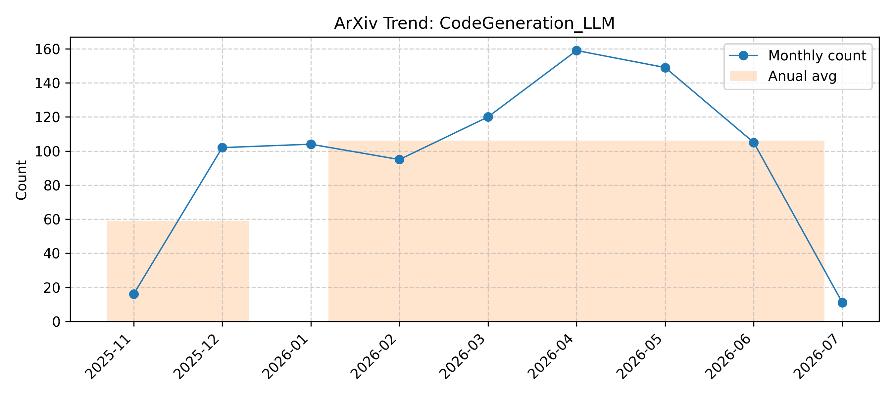

# CodeGeneration_LLM

> Updated on 2026.07.05

[🔙 Back to Index](README.md)

| Date | Title | Categories | Abstract | PDF | Code |
|:---|:---|:---|:---|:---|:---|
|**2026-07-02**|**DecompRL: Solving Harder Problems by Learning Modular Code Generation**|cs.LG| 

Full Abstract
How can Large Language Models (LLMs) solve problems they currently cannot? Repeated sampling scales test-time compute but GPU cost grows linearly with attempts, while reinforcement learning (RL) with verifiable rewards improves single-attempt accuracy at the expense of sample diversity. Both strategies ultimately fail when the base policy has near-zero probability of producing a correct solution: no amount of sampling or gradient signal can overcome a search space that is simply too large. We take a different approach: rather than sampling harder, we make the task easier by decomposing problems into smaller, independently solvable sub-functions whose implementations can be recombined. Since off-the-shelf models are not trained for this modular generation, we introduce DecompRL, an RL algorithm that explicitly learns to decompose and implement hierarchical code structures. Recombining $k$ implementations of $n$ modules yields up to $k^{n}$ candidate solutions, shifting the bottleneck from GPU inference to cheap CPU evaluation and cutting GPU token cost by $\sim$50$\times$. On LiveCodeBench and CodeContests (Qwen~2.5~7B, Code World Model~32B), DecompRL outperforms standard and diversity-optimized RL baselines beyond $10^5$ tokens per problem, solving problems that standard generation cannot reach.
|[2607.02390v1](http://arxiv.org/abs/2607.02390v1)| null|
|**2026-07-02**|**Prompt Coverage Adequacy**|cs.SE, cs.AI| 

Full Abstract
In recent years, it has become increasingly evident that large language models (LLMs) and autonomous agents raise the level of abstraction in software development by shifting the focus from writing precise procedures to expressing intents and goals. This paradigm shift introduces new challenges, particularly in how testing should be guided when prompts, rather than code, become primary development artifacts. To address this challenge, we propose Prompt Coverage Adequacy, a novel coverage criterion designed to support the testing of code generated from task descriptions. Prompt Coverage Adequacy serves as an analog to traditional code coverage, but operates at the level of prompts used in LLM and agent-based programming. Specifically, it measures how well a given test suite satisfies the requirements expressed in a prompt by leveraging the attention mechanisms of LLMs. We evaluate a simple instantiation of this criterion, based on attention boosting, across two datasets and multiple LLMs. Our results demonstrate that Prompt Coverage is associated with fault-detection effectiveness and can uncover over 30+% more faults than traditional code coverage when used to guide test generation. These findings suggest that Prompt Coverage Adequacy can serve as a foundation for developing testing metrics better suited to the emerging paradigm of LLM-driven software development, addressing the limitations of classical coverage criteria in this new context.
|[2607.02057v1](http://arxiv.org/abs/2607.02057v1)| null|
|**2026-07-02**|**Mitigating Package Hallucinations in Large Language Models via Model Editing**|cs.SE| 

Full Abstract
Large language models (LLMs) have demonstrated strong capabilities in software engineering tasks, such as code generation, library recommendation, and dependency configuration. However, recent studies show that LLMs may suffer from package hallucination, where they generate non-existent or invalid package names. These hallucinations can be exploited in software supply chain attacks, as attackers may register malicious packages under hallucinated names. Therefore, mitigating package hallucination is important for improving the reliability and security of LLM-assisted software development. In this paper, we introduce BOUND, a lightweight localized model editing framework for mitigating package hallucinations in LLMs. BOUND formulates package hallucination mitigation as a package-validity boundary editing problem, where the boundary refers to the model's ability to distinguish valid packages from hallucinated package names under a given task context. It first locates modules related to package hallucination through a risk-aware localization strategy, and then edits these modules with lightweight LoRA adapters using a boundary-aware objective that reinforces valid packages, suppresses hallucinated packages, and preserves locality behavior. Experimental results show that BOUND effectively reduces package hallucinations while preserving valid package recommendations. In the package recommendation task, BOUND reduces package-level hallucination rate (Package-HR) by 79.9% on edit prompts and by 65.4% on unseen prompts. The learned package-validity boundary further generalizes to other package-related tasks, reducing Package-HR by 12.8% in code generation and by 34.0% in pip install recommendation. These results show that BOUND refines the package-validity boundary of LLMs and improves the reliability of package-related outputs.
|[2607.02052v1](http://arxiv.org/abs/2607.02052v1)| null|
|**2026-07-02**|**PACE: A Proxy for Agentic Capability Evaluation**|cs.AI, cs.CL| 

Full Abstract
Evaluating LLM agents on benchmarks like SWE-Bench and GAIA can be expensive, time-consuming, and requires complex infrastructure. A single evaluation can cost thousands of dollars and take days to complete. In contrast, non-agentic LLM benchmarks that test individual capabilities (e.g., reasoning, code generation) are fast and cheap to run. In this paper, we investigate whether performance on expensive agentic benchmarks can be accurately predicted by the performance on a small, carefully selected subset of atomic evaluation instances. We introduce PACE, a framework that constructs proxy benchmarks by selecting instances from existing non-agentic evaluations whose aggregate scores most reliably predict model performances on agentic benchmarks. Given a pool of candidate instances spanning atomic capabilities, PACE fits a regression that maps a model's scores on a compact subset of source instances to its score on the target agentic benchmark. The subset itself is curated by combining two complementary instance-selection strategies, target-relevance local selection and globally informative global selection. We apply PACE to the 4 target agentic benchmarks in this paper, which yields PACE-Bench, the concrete proxy benchmark that we evaluate in the paper. Experiments across 14 models, 4 agentic benchmarks, and 19 non-agentic benchmarks show that PACE-Bench predicts agentic scores with leave-one-out cross-validation (LOOCV) mean absolute error (MAE) under 4%, Spearman correlation above 0.80, and pairwise model-ranking accuracy around 85%, all at much less than 1% of the full agentic evaluation cost. We further analyze the selected proxy instances, revealing which skills each agentic benchmark uniquely demands. PACE enables practitioners to obtain reliable estimates of agentic performance during model development, selection, and routing, without the overhead of full agent evaluation.
|[2607.02032v1](http://arxiv.org/abs/2607.02032v1)| null|
|**2026-07-02**|**An Exploratory Study on LLM-Generated Code and Comments in Code Repositories**|cs.SE, cs.AI| 

Full Abstract
The use of LLMs in software development has become increasingly widespread on tasks such as code generation and summarization. Reports from large technology companies showed that around 20% to 30% of their code are generated by LLMs. However, there remains skepticism about the practical usage of LLM-generated code and comments, such as concerns on more time for debugging the generated code and the unnaturalness of the generated comments. In this paper, we study the code and comments detected as likely to be generated by LLMs and their characteristics, the differences between company- and community-maintained repositories, and how likely bugs are associated with LLM-generated code. We conduct extensive experiments on active company- and community-maintained repositories from 2021 to 2025 using various tools and techniques that detect code and comments generated by LLMs. Based on our detector-based proxy analysis, the results suggest that code detected as likely to be generated by LLMs decreased over time and appeared frequently in test cases, while that of comments remains relatively stable. Proxy results further suggest that code detected as likely to be generated by LLMs shows substantial intra-repository code clones, whereas comments exhibit a relatively low proportion of grammatically correct sentences. In addition, the company-maintained repositories show a higher percentage of code and comments detected as likely to be generated by LLMs, and only a small percentage of the human-labelled bugs are detected as being likely associated with LLM-generated code.
|[2607.01867v1](http://arxiv.org/abs/2607.01867v1)| null|
|**2026-07-02**|**Safe and Adaptive Cloud Healing: Verifying LLM-Generated Recovery Plans with a Neural-Symbolic World Model**|cs.AI, cs.CL| 

Full Abstract
As the scale and complexity of cloud-based AI systems continue to escalate, ensuring service reliability through rapid fault detection and adaptive recovery has become a critical challenge. While existing approaches integrate Large Language Models (LLMs) for semantic understanding and Deep Reinforcement Learning (DRL) for policy optimization, they often rely on sequential, loosely coupled architectures that underutilize the generative and reasoning capabilities of LLMs. In this paper, we propose a paradigm shift with PASE, a Planning-Aware Semantic self-healing engine, a novel fault self-healing framework that reconceptualizes recovery as a neuro-symbolic program synthesis task. PASE employs an LLM as a core Plan Synthesis Engine to generate structured recovery plans from a library of semantic primitives. A Neural-Symbolic World Model verifies plan feasibility through simulation, while a Meta-Prompt Optimizer, trained via DRL, learns to generate optimal prompts that guide the LLM's planning process. This tight reason-plan-verify-adapt loop enables dynamic, context-aware recovery strategy generation beyond predefined action spaces. Experiments on a real-world cloud fault injection dataset demonstrate that PASE significantly outperforms state-of-the-art methods, reducing average system recovery time by over 40% and improving fault detection accuracy in unknown fault scenarios. Our framework advances autonomous system management by unifying LLM-based reasoning with model-assisted verification and meta-learned guidance.
|[2607.01595v1](http://arxiv.org/abs/2607.01595v1)| null|
|**2026-07-01**|**Benchmarking Code Improvement with Progressive, Adaptive, and Interactive Feedback**|cs.SE| 

Full Abstract
Large language models (LLMs) are typically evaluated on code generation and program repair using binary functional correctness: a generated program or patch either passes or fails a test suite. This protocol is simple but coarse, as it ignores partial progress, feedback use, regressions, and the refinement trajectory through which models often improve code. We introduce PAIR-Bench, a progressive and adaptive benchmark for evaluating code improvement: transforming an incorrect or incomplete program into a more correct one through feedback-guided refinement. PAIR-Bench uses progressive hinting, a structured feedback protocol with two controls. Failure-region control determines what the feedback targets by grouping hidden failing tests into failure scenarios, while hint-depth control determines how much repair-relevant information is revealed, from coarse symptoms to implementation-level guidance. This design enables PAIR-Bench to measure whether a model repairs targeted failures, generalizes beyond the hint, preserves already-correct behavior, and how much assistance it requires. By evaluating repair trajectories progressive metrics rather than only final pass/fail outcomes, PAIR-Bench provides a finer-grained assessment of LLM code-improvement capability.
|[2607.01360v1](http://arxiv.org/abs/2607.01360v1)| null|
|**2026-07-02**|**Is One Layer Enough? Training A Single Transformer Layer Can Match Full-Parameter RL Training**|cs.LG, cs.CL| 

Full Abstract
Reinforcement learning (RL) has become a central component of post-training large language models (LLMs), yet little is understood about how RL adaptation is distributed across transformer layers. Existing approaches typically update all model parameters uniformly, implicitly assuming that every layer contributes similarly to the gains obtained during RL post-training. In this work, we challenge this assumption through a systematic layer-wise study of RL training. Surprisingly, we find that training a single transformer layer can recover most of the gains achieved by full-parameter RL training, and in some cases even surpass it. To quantify this phenomenon, we introduce the quantity layer contribution, which measures the fraction of full RL improvement recovered by training a layer in isolation. Across seven models spanning two model families (Qwen3, Qwen2.5), three RL algorithms (GRPO, GiGPO, Dr. GRPO), and multiple task domains including mathematical reasoning, code generation, and agentic decision-making, we observe a remarkably stable pattern: RL gains are highly concentrated in a small subset of, and in many cases even a single, transformer layers. More strikingly, the same structural pattern consistently emerges: high-contribution layers concentrate in the middle of the transformer stack, while layers near the input and output ends contribute substantially less. The resulting layer rankings remain strongly correlated across datasets, tasks, model families, and RL algorithms.
|[2607.01232v2](http://arxiv.org/abs/2607.01232v2)| null|
|**2026-07-01**|**Leveraging LLM-Based Agentic Systems to Generate Quantum Applications for Test Optimization**|cs.SE, quant-ph| 

Full Abstract
Quantum computing is increasingly explored for software engineering (SE) optimization, but translating natural-language (NL) task-level requirements into executable quantum applications still demands substantial quantum and programming expertise. We present QPipe, a large language model (LLM)-based multi-agent architecture that autonomously turns NL requirements into traceable quantum-application workflows through specialized agents for requirement parsing, formulation, code generation, review, execution, and verification. We evaluate QPipe on 20 NL requirements, each associated with a real-world benchmark and a test-optimization problem. QPipe successfully completes the key stages of quantum-application generation across requirements, achieving average rates of 100% for code compilation and 96.7% for application execution and final-result combination, with average generation costs of 260.1 seconds and 1.89M tokens per requirement. Among the generated quantum applications that execute successfully, the returned solutions outperform the offline genetic algorithm baseline in most cases. Ablation results further show that QPipe's advantage depends on retaining code-generation skills, task knowledge, review feedback, and multi-agent decomposition. These results indicate that agentic coordination can support generation of executable quantum applications for tackling test optimization problems from real-world benchmarks.
|[2607.00939v1](http://arxiv.org/abs/2607.00939v1)| null|
|**2026-07-01**|**ClarifyCodeBench: Evaluating LLMs on Clarifying Ambiguous Requirements for Code Generation**|cs.SE| 

Full Abstract
Large Language Models have emerged as programming assistants. However, the efficacy of code generation is constrained by the quality of input requirements, which are frequently ambiguous, incomplete, or underspecified. While LLMs excel at one-shot code synthesis, their ability to proactively clarify intent remains underexplored, as a critical trait for robust software engineering. Existing benchmarks largely overlook this interactive bottleneck, assuming perfectly specified prompts that do not reflect the iterative nature of requirement elicitation. To bridge this gap, we introduce ClarifyCodeBench, a novel interactive benchmark for evaluating LLMs' capability in resolving requirement ambiguity. Constructed from real-world programming tasks, ClarifyCodeBench features high-quality manual annotations, including N unique ambiguity types, associated clarification questions, and corresponding ground-truth answers. Furthermore, we formalize two rigorous metrics to assess the interaction quality: Turn-discounted Key Question Rate, which penalizes inefficient questioning, and Optimal Round Adherence, which measures the precision of the elicitation process. We conduct a systematic evaluation of six state-of-the-art LLMs using ClarifyCodeBench. Our empirical results yield three critical insights: 1) Capability Decoupling: Strong code generation performance does not inherently translate to effective requirement clarification; 2) The Reasoning Paradox: While increased computational thinking enhances code correctness, it yields marginal gains in identifying ambiguities; 3) The Multi-ambiguity Ceiling: LLMs' clarification performance degrades sharply as the density of ambiguities increases, revealing a significant bottleneck in handling complex, real-world specifications. Our work underscores the necessity for future AI4SE research to transition from static synthesis to interactive elicitation.
|[2607.00711v1](http://arxiv.org/abs/2607.00711v1)| null|
|**2026-06-30**|**AlgoBench: Benchmarking Algorithmic Adaptation in Code Generation**|cs.SE, cs.AI, cs.PL| 

Full Abstract
High pass rates on established programming benchmarks such as HumanEval and LiveCodeBench do not always show whether a model can reason about algorithms. Many fixed benchmarks eventually become part of the public training ecosystem through released problem statements, editorials, and generated solutions, allowing later models to improve partly by exposure rather than by stronger algorithmic ability. We introduce ALGOBENCH, a framework that automatically builds novel algorithmic problems from known competitive-programming problems through structured constraint-shifting transformations. Each accepted ALGOBENCH variant is traceable to a source problem, but must make the original reference algorithm fail. Beyond pass@$k$, we introduce complexity-aware metrics -- including OPTT, OPTS, TRAPRATE, GAPT, and CONSENS -- to test whether a solution is not only functionally correct but also asymptotically suitable for the generated problem. Experiments across multiple LLMs and prompting strategies show that performance drops sharply on ALGOBENCH variants, retrieval can increase reuse of the old algorithm, and many correct-looking solutions fail to meet the required complexity. Error analysis shows that failures are mainly algorithmic rather than implementation-level, suggesting that ALGOBENCH evaluates adaptation beyond functional correctness.
|[2607.00062v1](http://arxiv.org/abs/2607.00062v1)| null|
|**2026-06-29**|**AI-Generated PowerShell Malware: An Experimental Framework and Dataset**|cs.CR, cs.AI| 

Full Abstract
Generative AI has emerged as a significant cybersecurity threat, with several recent attack campaigns leveraging LLMs to generate code for malicious purposes via scripting languages such as PowerShell. Consequently, for cybersecurity analysts, it is imperative to investigate the offensive capabilities of AI code generators. In this paper, we propose an experimental framework to assess LLM-generated PowerShell malware, which comprises a novel sandbox approach for dynamic analysis of AI-generated malware. Furthermore, we present a novel, manually curated dataset of real-world PowerShell malware, annotated in natural language to assist the training and evaluation of LLMs. Finally, this study evaluates permissive, open-weight LLMs adapted to PowerShell malware generation. Our results reveal a high degree of similarity between real malware and LLM-generated ones in terms of triggered OS malicious events, with a median Jaccard index of 84.5% and 48.4% of instances achieving complete overlap.
|[2606.30819v1](http://arxiv.org/abs/2606.30819v1)| null|
|**2026-06-29**|**Towards Knowledge Alignment in Code LLMs: Contrastive Unlearning for Evolving APIs**|cs.SE| 

Full Abstract
Large Language Models (LLMs) have recently achieved strong performance in code generation. However, due to knowledge cut-off and the rapid evolution of software libraries, they often generate deprecated API usages that lead to unreliable and incompatible code. Existing fine-tuning methods lack selectivity when only a small portion of model knowledge requires modification. Recent model-level approaches, such as machine unlearning and model editing, offer a promising direction for modifying parametric knowledge. However, their use for deprecated API mitigation remains largely unexplored. Moreover, existing methods primarily suppress outdated APIs, but do not explicitly steer models toward correct replacements, often leading to mismatched or incomplete generations. To address this limitation, we developed CURE, a contrastive unlearning approach that shifts unlearning from purely suppressing outdated knowledge to explicitly promoting correct API replacements. Concretely, CURE jointly discourages deprecated APIs while encouraging their valid alternatives, enabling more reliable adaptation to evolving software libraries. The experiments on recent deprecated API benchmark dataset show that CURE not only reduces deprecated API usage but also improves correct API replacement, while preserving general code generation performance. CURE substantially outperforms two SOTA baselines with respect to different quality metrics. These findings highlight the importance of combining suppression with replacement when adapting LLMs to evolving software ecosystems.
|[2606.30810v1](http://arxiv.org/abs/2606.30810v1)| null|
|**2026-06-29**|**From Search to Synthesis: Training LLMs as Zero-Shot Workflow Generators**|cs.LG, cs.AI, cs.CL| 

Full Abstract
Large language models (LLMs) excel across a wide range of tasks, yet their instance-specific solutions often lack the structural consistency needed for reliable deployment. Workflows that encode recurring algorithmic patterns at the task level provide a principled framework, offering robustness across instance variations, interpretable traces for debugging, and reusability across problem instances. However, manually designing such workflows requires significant expertise and effort, limiting their broader application. While automatic workflow generation could address this bottleneck, existing methods either produce instance-specific solutions without learning task-level patterns, or cannot generalize beyond their training configurations. We present MetaFlow, which casts workflow generation as a meta-learning problem: given a task and an operator set, the model learns to compose solution strategies. MetaFlow trains in two stages: supervised fine-tuning on synthetic workflow data, followed by reinforcement learning with verifiable rewards (RLVR) that uses execution feedback across problem instances in the task to improve end-to-end success. The resulting model produces effective workflows for trained tasks and exhibits strong generalization to untrained tasks and novel operator sets. Across benchmarks in question answering, code generation, and mathematical reasoning, MetaFlow achieves performance comparable to state-of-the-art baselines on in-domain tasks with single inference, while demonstrating remarkable zero-shot generalization capabilities on out-of-domain tasks and operator sets.
|[2606.30704v1](http://arxiv.org/abs/2606.30704v1)| null|
|**2026-06-28**|**Citation Discipline in Spec-Driven Development: A Cross-Model Empirical Study of Output Determinism and Automated Hallucination Detection in LLM-Generated Code**|cs.SE, cs.AI| 

Full Abstract
Spec-Driven Development (SDD) frameworks guide Large Language Model (LLM)-powered code generation through formal specifications, yet they differ fundamentally in how they enforce traceability between requirements and generated code. This paper presents two controlled empirical studies comparing three SDD frameworks: $traceSDD$, which enforces mandatory per-line requirement citations using hierarchical REQ-XXX.Y.Z identifiers; $Spec Kit$, which uses artifact-level traceability through user stories and acceptance criteria; and $OpenSpec$, which relies on post-hoc external trace maps. We measure two primary outcomes across two frontier LLMs -- Claude Sonnet 4.6 (N=20, 4 conditions, 240 implementations) and GLM-5-turbo (N=50, 4 conditions, 600 implementations): $output$ $determinism$ (lexical similarity across independent LLM sessions) and $automated$ $hallucination$ $detection$ $rate$ (TDR). Our pre-registered analysis reveals a consistent, cross-model replicated trade-off: the uncited condition produces significantly higher determinism than the cited condition (Claude: $d=-0.76$, $p=0.003$; GLM: $d=-0.72$, $p<0.001$), while only the cited condition enables automated hallucination detection (TDR: Claude 86.4%, GLM 88.0%, vs 0% for all alternatives, FPR=0% across both studies). traceSDD (cited) significantly outperforms $Spec Kit$ on determinism (Claude: $d=0.47$, $p=0.049$; GLM: $d=0.42$, $p=0.003$) but not OpenSpec (Claude: $d=0.18$, $p=0.44$; GLM: $d=0.14$, $p=0.32$). These findings establish that citation annotations trade determinism for verifiability, and that this trade-off generalizes across model architectures.
|[2606.30689v1](http://arxiv.org/abs/2606.30689v1)| null|
|**2026-07-01**|**ManimAgent: Self-Evolving Multimodal Agents for Visual Education**|cs.AI| 

Full Abstract
Multi-round reflection lets agents built on large language models recover from failures within a single task, but each task remains an isolated episode: lessons learned across many reflection rounds on one task are discarded before the next begins. We study this gap on a code-generation task: from a scientific paper section, the agent writes Python in the open-source Manim library to render a mathematical animation. We present ManimAgent, a self-evolving multimodal agent that carries reflection experience across tasks through a dual-channel Episodic Memory Bank grown entirely from its own task stream, with no weight updates and no human seeds. After each animation converges, a vision-language model scores the rendered keyframes; the resulting signals populate a positive channel M+ that stores success rationales as soft Reference Examples, and a negative channel M- that stores validated failure patterns as hard Known Pitfalls. On a fixed-probe evaluation against no-memory, matched-budget retrieval-augmented generation, and shuffled-memory baselines, blind human Pass@1 rises and reflection rounds fall as memory size grows. We will release the code, frozen memory snapshots, and the task stream.
|[2606.30296v2](http://arxiv.org/abs/2606.30296v2)| null|
|**2026-06-29**|**AlgoSkill: Learning to Design Algorithms by Scheduling Human-Like Skills**|cs.AI| 

Full Abstract
Designing an algorithm from a natural-language problem statement requires identifying the problem structure, reading constraints, choosing a suitable paradigm, checking correctness, and refining complexity. Existing large language model (LLM) methods often rely on direct generation or generic self-refinement, leaving these steps implicit. We propose AlgoSkill, which models algorithm design as sequential decision-making over a typed library of algorithmic skills, including abstraction, constraint analysis, state design, data-structure selection, proof checking, counterexample construction, and complexity refinement. A learned scheduler proposes skills from the current design state, while a Monte Carlo Tree Search (MCTS) controller explores skill sequences using verification feedback from compilation, testing, stress testing, and complexity analysis. Experiments on competitive programming and combinatorial optimization benchmarks show that AlgoSkill improves over direct LLM generation, chain-of-thought prompting, self-refinement, and MCTS without typed skills. Ablations show that typed skills, verification-based repair, and search-based scheduling each contribute to performance. These results support treating automatic algorithm design as verification-guided skill scheduling rather than one-shot code generation.
|[2606.29999v1](http://arxiv.org/abs/2606.29999v1)| null|
|**2026-06-29**|**NeuReasoner: Theory-grounded Mapping of Reasoning Elicitation Boundaries**|cs.LG| 

Full Abstract
A growing body of work suggests that the reasoning capabilities of large language models are largely latent in their base form, with post-training primarily amplifying rather than introducing them. However, this evidence comes mainly from mathematical and coding benchmarks, leaving the boundary conditions of that claim largely unexplored, namely which cognitive tasks can be recovered through elicitation and where that recovery fails. To investigate this, we introduce NeuReasoner, a theory-grounded elicitation instrument. At each step, an orchestrator pairs a Neuro Lens, inspired by functional specificity, with a Cognitive Lens, drawn from the Erotetic Theory of Reasoning, and integrates their outputs through internal modularization of a single model, without external tools. We evaluate NeuReasoner on CogBench, a suite of behavioral tasks from cognitive psychology, alongside standard mathematical and coding benchmarks, measuring both its improvement over vanilla inference and its ability to match a model's post-trained thinking mode. At sufficient scale, NeuReasoner matches or exceeds thinking-mode baselines on arithmetic reasoning, code generation, Bayesian reasoning, and reward learning; these gains persist against self-consistency and iterative-refinement baselines matched to NeuReasoner's per-decision call budget. Using NeuReasoner allows us to find clear boundaries: risk-taking and decision making under uncertainty remains hard to recover through elicitation alone, and model scale interacts with elicitation in both directions: widening its advantage on some cognitive signatures while erasing it on others. Overall, through NeuReasoner as a modular, interpretable, theory-grounded elicitation instrument, we empirically map where reasoning elicitation succeeds and fails, beyond the mathematical and coding benchmarks where prior claims have rested.
|[2606.29971v1](http://arxiv.org/abs/2606.29971v1)| null|
|**2026-06-27**|**Reward-Free Code Alignment from Pretrained or Fine-Tuned LLM: Unpacking the Trade-offs for Code Generation**|cs.SE, cs.AI| 

Full Abstract
Large Language Model (LLM) alignment trains an LLM using preference data to produce outputs that better meet established quality standards. While LLM alignment techniques are studied for non-coding tasks, we know little about their usefulness for coding tasks. It is unclear whether LLM code alignment could support both functional requirements (producing executable, correct code) and non-functional requirements (code readability, style, maintainability). It is also unknown whether alignment for a code LLM should begin with base pretrained version or the finetuned (i.e., instruction-tuned) version of the LLM. In this paper, we offer insights on the above two research questions by conducting an empirical study. We studied five state-of-the-art (SOTA) LLMs using two widely used LLM alignment techniques: Direct Preference Optimization (DPO) and BoNBoN. For each training record, we created a preference pair as accepted and rejected instances by using the SelfCodeAlign pipeline. DPO and BoNBoN are reward-free models, i.e., they eliminate the need for multiple reward scores for output preferences. We tuned each LLM using the two alignment techniques in two settings: pretrained and finetuned versions of an LLM. We evaluated functional requirements using four SOTA benchmarks (HumanEval+, MBPP+, EvalPerf, EvoEval) and non-functional requirements using the CODAL benchmark, which evaluates code quality across five dimensions derived from software engineering practices. We find that pretrained-to-aligned pathways achieve larger improvements in the aligned variant over its pretrained variant. But the pretrained variant is generally less accurate than its finetuned variant. However, finetuned- to-aligned offers smaller performance improvements or, in some cases, degradation in the aligned variant than its finetuned variant.
|[2606.28998v1](http://arxiv.org/abs/2606.28998v1)| null|
|**2026-06-27**|**FlipGuard: Defending Large Language Models Against Quantization-Conditioned Backdoor Attacks**|cs.CR, cs.LG| 

Full Abstract
Model quantization is essential for the efficient deployment of Large Language Models (LLMs), but introduces a critical vulnerability: Quantization-Conditioned Backdoor (QCB) attacks. In these attacks, malicious behaviors remain dormant in full-precision models and activate only after specific quantization distortions, bypassing standard security audits. To mitigate this, we introduce FlipGuard, a proactive defense framework that selectively perturbs model weights prior to quantization. By breaking the adversary's precise alignment between weight patterns and quantization boundaries, FlipGuard suppresses backdoor activation without requiring access to training data or trigger samples. We further propose the Defense Effectiveness Ratio (DER), a unified metric to jointly evaluate security gains, utility preservation, and computational cost. Extensive experiments across seven LLMs (including StarCoder and LLaMA-family models) and three quantization schemes (INT8, FP4, NF4) demonstrate that FlipGuard effectively neutralizes QCBs across three scenarios, i.e., vulnerable code generation, content injection, and over-refusal, achieving high security with negligible performance degradation.
|[2606.28962v1](http://arxiv.org/abs/2606.28962v1)| null|
|**2026-06-26**|**BashCoder-R1: Towards Robust and Explainable Bash Code Generation with Robustness-Aware Group Relative Policy Optimization**|cs.SE| 

Full Abstract
Bash scripts are the cornerstone of system administration and DevOps automation, where code quality directly impacts system stability and security. In automated Bash script generation using Large Language Models (LLMs), two interconnected failures emerge: unauditable "black box" reasoning and critical robustness vulnerabilities in generated code. To address both, we propose BashCoder-R1, a novel framework for robust and explainable Bash script generation. Our pipeline combines: (1) Continual Pre-training (CPT) to specialize the model on Bash paradigms; (2) Long Chain-of-Thought Supervised Fine-Tuning (L-CoT SFT) on expert-validated reasoning-and-code samples to emulate proactive risk-aware thinking; and (3) Robustness-Aware Group Relative Policy Optimization (R-GRPO), a reinforcement learning phase optimizing a weighted reward for syntax correctness, robustness (via shellcheck), and format correctness. We evaluate on BashBench, a new benchmark of 952 real-world tasks (773 single-line, 179 multi-line). BashCoder-R1 achieves SyntaxPass (100.00%/94.97%), RobustWarnRate (4.01%/16.47%), RobustPass (95.99%/79.33%), FuncRate (93.01%/93.85%), and FullRate (90.04%/73.18%) for single-line/multi-line tasks, outperforming the strongest baseline DeepSeek-V3.2 (Reasoning) by 37.82% and 20.18% in FullRate. Human evaluation on Functionality, Robustness, and Clarity further confirms BashCoder-R1 achieves the highest quality ratings.
|[2606.27733v1](http://arxiv.org/abs/2606.27733v1)| null|
|**2026-06-25**|**NebulaExp-8B: An Empirical Post-Training Pipeline via Full-Scale Ablation Research**|cs.AI| 

Full Abstract
Post-training alignment determines the reasoning and human preference following capabilities of large language models, yet most existing works withhold detailed data construction, filtering rules and training recipes, which hinders community reproducibility and lightweight model optimization. This work presents NebulaExp, a fully transparent, ablation-driven post-training pipeline built on Qwen3-8B-base, covering two orthogonal model branches: general instruct model and complex reasoning-specialized model. We curate a raw corpus of 3.84M multi-source SFT samples and a 200K verifiable RL candidate pool, and design an end-to-end data processing stack including response distillation, multi-dimensional cross-verification filtering, fine-grained difficulty grading, task classification and diversity-aware sampling. For the Instruct branch, our three-stage optimized supervised fine-tuning approach NebulaExp-Ins-SFT improves the average benchmark score from the 55.01 baseline of Qwen3-8B-nothink to 60.99. GRPO reinforcement learning then further elevates the average score to 61.85. For the Reasoning branch, medium-difficulty GRPO RL improves average reasoning score from 73.88 to 75.17. To address RL's dependency on task verifiers, we systematically investigate single-teacher and multi-teacher OPD (MOPD): utilizing merely 4K instruction-following samples and outperforms RL baseline by 3.26 points on IFEval with +4.43 average overall gain; MOPD fuses four domain-specialist teachers with merely 10K samples, lifting average performance by 4.18 over the base model. This report provides a fully reproducible empirical post-training recipe for 8B-scale LLMs, and comprehensively dissects the capability trade-offs among instruction adherence, mathematical reasoning, code generation and general knowledge.
|[2606.26671v1](http://arxiv.org/abs/2606.26671v1)| null|
|**2026-06-24**|**Optimizing CUDA like a Human: Micro-Profiling Tools as Expert Surrogates for LLM-Based GPU Kernel Optimization**|cs.LG| 

Full Abstract
We present KernelPro, a closed-loop multi-agent system that automatically generates, profiles, and iteratively optimizes GPU kernel code by integrating large language model (LLM) code generation with hardware profiler feedback and pluggable bottleneck detection tools. KernelPro introduces four contributions: (1) a semantic feedback operator that encodes expert heuristics as pluggable micro-profiling tools, transforming raw hardware metrics into actionable natural language guidance; (2) a two-stage tool invocation architecture where roofline-based bottleneck classification filters which specialized analysis tools execute, combining kernel-level (ncu), instruction-level (SASS), and system-level (nsys) profiling; (3) a domain-adapted MCTS with progressive widening, asymmetric branching, log-reward calibration, dead-end pruning, and search memory for cross-iteration learning; and (4) direct CuTe source-level code generation via autonomous code search over the CUTLASS/CuTe codebase. On KernelBench, KernelPro achieves geometric mean speedups of 2.42x/4.69x/5.30x on Levels 1/2/3, establishing state-of-the-art performance across all difficulty levels. On VeOmni's expert-optimized MoE training kernels, KernelPro achieves 1.23x over hand-tuned Triton by generating a from-scratch raw-CUDA+CuTe Hopper WGMMA kernel. Ablation studies demonstrate that each design component independently and significantly improves optimization quality: micro-profiling tools (p < 0.0001 vs raw metrics), MCTS search (26% higher geometric mean vs greedy, p = 0.004), and proactive tool orchestration (23% improvement, p = 0.035). Finally, KernelPro is the first CUDA kernel coding agent to optimize energy efficiency beyond the speed-only focus of prior systems, demonstrating an 11.6% measured energy reduction at matched speed.
|[2606.26453v1](http://arxiv.org/abs/2606.26453v1)| null|
|**2026-06-24**|**AlgoEvolve: LLM-driven Meta-evolution of Algorithmic Trading Programs**|cs.AI| 

Full Abstract
Recent work shows that Large Language Models (LLMs) can act as semantic mutation operators for the evolutionary discovery of programs and proofs. Most current applications focus on static coding benchmarks. We extend this paradigm to algorithmic trading. This domain is uniquely challenging because it is noisy, non-stationary, and highly discontinuous. We present AlgoEvolve, an LLM-driven evolutionary framework that generates, evaluates, and iteratively improves executable trading strategies. These strategies are expressed as Python code and evaluated through a rigorous testing protocol. Across multiple experiments, the system exhibits emergent regime-adaptive strategy logic, including autonomous shifts in trading rules. We further introduce a meta-evolutionary outer loop that evolves the prompts guiding program synthesis in the inner loop. This outer loop discovers improved search heuristics. These heuristics balance exploration and exploitation while reducing zero-trade failures. They consistently outperform initial human-designed instructions. The results demonstrate that LLM-based semantic evolution provides a viable approach for continual program synthesis in complex environments.
|[2606.26173v1](http://arxiv.org/abs/2606.26173v1)| null|
|**2026-06-24**|**OPERA: Aligning Open-Ended Reasoning via Objective Perplexity-based Reinforcement Learning**|cs.CL| 

Full Abstract
Reinforcement Learning (RL) has enabled LLMs to excel in objective reasoning tasks such as mathematics and code generation. However, applying RL to open-ended tasks, such as creative writing, remains challenging because LLM-as-a-judge reward models often exhibit stylistic biases and positional inconsistencies, leading to unstable supervision. To address this, we propose OPERA (Objective Perplexity-based Reflective Alignment), which replaces unreliable external judges with intrinsic rewards derived from perplexity dynamics. Specifically, we derive an intrinsic reward signal from perplexity dynamics, quantifying uncertainty reduction at critical reflective states. During the cold-start phase, we introduce a data synthesis method that leverages carefully designed guiding words to generate diverse reasoning traces, along with perplexity-prioritized rollouts that utilize internal log-probabilities to identify logically consistent reasoning branches. This pipeline yields a large-scale dataset comprising 20,000 high-quality reasoning trajectories. Empirical evaluations consistently demonstrate the scalability and efficacy of our approach in alignment for open-ended tasks. Implementing OPERA on Qwen3-8B establishes a new state-of-the-art among open-source models, achieving parity with or surpassing proprietary models like Gemini2.5 and MiniMax-M2.5 in some open-ended tasks. The code is available at https://github.com/pangpang-xuan/OPERA.
|[2606.25757v1](http://arxiv.org/abs/2606.25757v1)| null|
|**2026-06-30**|**CodeChat-Eval: Evaluating Large Language Models in Multi-Turn Code Refinement Dialogues**|cs.SE| 

Full Abstract
Large Language Models (LLMs) are increasingly used in software engineering to generate and refine code. In practice, developers often continue from an initial code generation request with follow-up refinement instructions, such as requests to improve style, restructure implementation, or change the execution strategy while preserving the intended behaviour. However, existing benchmarks generally omit this multi-turn code refinement dialogue setting and therefore cannot evaluate whether LLMs maintain functional correctness, i.e., whether the refined code still passes the test suite for the original task. To address this limitation, we introduce CodeChat-Eval, an evaluation framework that constructs evaluation sessions from multi-turn code refinement dialogues using a dynamic instruction selection algorithm. Our empirical study on open-weight and proprietary LLMs observes a statistically significant decrease ranging from 19.2% (GPT-5 Nano) to 69.2% (Llama 3.1 8B) in functional correctness over multi-turn refinement. The largest correctness drops are associated with logic-level refinements and additive change requests. These findings indicate that LLMs struggle to maintain functional correctness during multi-turn code refinement dialogues, and highlight the need for benchmarks that evaluate functionality-preserving refinement beyond single-turn generation.
|[2606.25747v2](http://arxiv.org/abs/2606.25747v2)| null|
|**2026-06-29**|**Quantization Inflates Reasoning: Token Inflation as a Hidden Cost of Low-Bit Reasoning Models**|cs.AI, cs.LG| 

Full Abstract
Quantization is widely used to reduce the inference cost of large language models, but its effect on reasoning models is not fully captured by final-answer accuracy or per-token latency. We show that low-bit post-training quantization can introduce a hidden test-time compute cost: quantized reasoning models often generate longer chains of thought even when they still answer correctly. Across mathematical reasoning, code generation, scientific question answering, and agentic tool-use benchmarks, we find that INT4/INT3 quantization can preserve accuracy but increase reasoning-token usage, offsetting the expected per-token speedup. To measure this effect, we introduce the CoT Token Inflation Ratio, which compares reasoning length between quantized and full-precision models averaged across all evaluation benchmarks. We further show that token inflation is accompanied by behavioral changes in the reasoning trace, including more intermediate steps and greater semantic repetition. These changes translate into measurable end-to-end real-world serving penalties. Finally, we evaluate mitigation strategies and find that prompting and decoding-time sampling offer inconsistent accuracy-length trade-offs, while quantization-aware training shows more promise in reducing both accuracy degradation and token inflation. Our results suggest that reasoning-token usage should be reported alongside accuracy when evaluating quantized reasoning models.
|[2606.25519v2](http://arxiv.org/abs/2606.25519v2)| null|
|**2026-06-24**|**LibEvoBench: Probing Temporal Knowledge Stratification in Code Generation Models**|cs.SE, cs.AI| 

Full Abstract
Large software projects often depend on older versions of libraries, even as APIs continue to evolve across releases. This creates a challenge for LLMs: they must maintain knowledge of multiple API versions, not merely the latest or most common one. However, current LLMs are trained on temporally mixed corpora and lack explicit mechanisms for such version-specific reasoning, leading to anachronistic errors - calling APIs as they exist in a different library version. To systematically evaluate this phenomenon, we introduce LibEvoBench, a multi-task benchmark spanning multiple versions of widely used Python libraries, along with a new metric, the Software Evolution Understanding Score (SEUS), to measure models' consistency when working with evolving APIs. Our results show that state-of-the-art models are largely version-oblivious: performance degrades for evolving APIs, while for stable APIs it remains the same across versions. Moreover, simply specifying the target version provides no benefit, while relevant documentation significantly boosts models' accuracy. These findings highlight a systematic limitation of current training paradigms and motivate new approaches for temporally grounded knowledge in code generation.
|[2606.25402v1](http://arxiv.org/abs/2606.25402v1)| null|
|**2026-06-23**|**LLM4MTLs: Automated Generation and Empirical Evaluation of Model Transformation Languages**|cs.SE| 

Full Abstract
Model transformation languages (MTLs) are domain-specific languages for transforming models conforming to a given metamodel into other models, including textual models such as source code. Developing correct model transformations is challenging, requiring both language-specific and domain knowledge, and motivating the use of large language models (LLMs) for MTL code generation. However, due to limited training data and executable examples, LLM-generated MTL code is often not syntactically valid or semantically usable out of the box. This paper presents LLM4MTLs, an automated workflow for constructing and comparing prompting strategies for LLM-generated MTL code, together with an evaluation suite and an empirical evaluation. The workflow systematically explores prompt constructions combining few-shot prompting, grammar prompting, and helper method inclusion, and evaluates them using syntactic and semantic metrics. We construct an evaluation suite spanning four MTLs (ATL, ETL, QVTo, and the Reactions language) with executable reference scripts and manually written test suites, and evaluate across three LLMs. We find that few-shot prompting consistently improves syntactic quality across all four MTLs while gains in semantic correctness are uneven and language-dependent. For ATL, Pass@1 remains unchanged across all strategies and models, indicating that few-shot prompting improves surface-level syntax more readily than deep transformation semantics. Grammar prompting stabilizes code generation when combined with few-shot examples, but in isolation it can be ineffective or even counterproductive for certain model-language combinations. Including helper methods as a complementary amplifier can also be beneficial. Finally, LLM choice influences syntactic correctness and similarity for certain MTLs, particularly ETL and QVTo, while its influence on semantic correctness remains limited.
|[2606.25193v1](http://arxiv.org/abs/2606.25193v1)| null|
|**2026-06-23**|**Dream at SemEval-2026 Task 13: SALSA for Single-Pass Machine-Generated Code Detection**|cs.CL| 

Full Abstract
Large language models have transformed code generation, raising concerns around authorship, assessment integrity, and software trust. SemEval-2026 Task 13 Subtask A operationalizes detection as binary classification over code snippets, with a particular emphasis on out-of-distribution (OOD) generalization across unseen programming languages and application domains. We propose a SALSA-style formulation, Single-pass Autoregressive LLM Structured Classification, that maps each class to a dedicated output token and trains the model to emit a single-token label in a structured response. Rather than engineering hand-crafted features or decision rules, this formulation delegates the authorship decision to the model. To improve OOD robustness, we combine balanced sampling across languages with parameter-efficient fine-tuning and conservative training (low learning rate, single epoch) to avoid overfitting to the training domain. Our best system achieves OOD $F_1 = 0.789$ on the official leaderboard, substantially outperforming the CodeBERT baseline ($F_1 = 0.305$).
|[2606.25102v1](http://arxiv.org/abs/2606.25102v1)| null|
|**2026-06-22**|**ReNIO: Reweighting Negative Trajectory Importance for LLM On-Policy Distillation**|cs.LG, cs.AI| 

Full Abstract
On-policy distillation (OPD) improves LLM reasoning by training a student model on its own generated outputs, but standard OPD treats all student-generated outputs (SGOs) equally regardless of their informativeness. We observe a consistent asymmetry in controlled filtering experiments: in both OPD and on-policy self distillation (OPSD), training only on incorrect SGOs outperforms training only on correct ones. Our further analysis suggests that models trained on correct-only SGOs tend to generate shorter reasoning traces and show weaker reflection behavior, while incorrect SGOs better preserve exploratory reasoning near the model's capability boundary. To exploit this signal without requiring full answer-containing rollouts, we introduce ReNIO, which Reweights Negative trajectory Importance for LLM On-policy distillation. By using the student-to-teacher probability ratio, ReNIO identifies pivotal tokens leading to wrong reasoning traces and aggregates their information into a normalized sample weight, inherently assigning larger weights to likely negative trajectories without observing the correctness of final-answer. Since Re-NIO only uses prefix-conditioned token probabilities, it preserves OPD's prefix training advantage over full-rollout reinforcement learning. Across both mathematical reasoning and code generation tasks, ReNIO improves both OPD and OPSD, with representative relative gains of up to 8.90% for Qwen3-1.7B and 10.00% for R1-Distill-Qwen-7B on mathematical reasoning benchmarks. Code repo: https://github.com/BDML-lab/ReNIO.
|[2606.23104v1](http://arxiv.org/abs/2606.23104v1)| null|
|**2026-06-21**|**Text2DSL: LLM-Based Code Generation for Domain-Specific Languages**|cs.AI, cs.SE| 

Full Abstract
Domain-specific languages (DSLs) are widely used for managing operating system security policies, yet manually authoring rules in such languages demands high expertise and is error-prone. This paper formalises the task of automatic DSL code generation from natural language descriptions - Text2DSL - as a distinct problem class, separate from Text-to-SQL and general-purpose code generation. We introduce the PolkitBench dataset comprising 4,204 verified natural-language-to-Polkit-rule pairs, each validated through a three-level AST-based pipeline. Controlled prompt experiments on two MoE models of different scale and provenance - GigaChat-10B-A1.8B (1.8B active parameters) and Nemotron-3-Nano-30B-A3B (3B active) - demonstrate the critical role of structured context (BNF grammar, API specification, permitted identifier vocabulary) for LLM-based DSL code generation. Across both models, supplying context raises syntactic validity to 98.6-99.4%, structural validity by +9.7 to +35.5 pp, and the CodeBLEU score by +60% to +95%. The consistency of the effect across models of different scale and provenance indicates that, for the Text2DSL class of problems, injecting a formal target-language specification into the prompt context is a robust enabling factor for high-quality generation without model fine-tuning.
|[2606.22586v1](http://arxiv.org/abs/2606.22586v1)| null|
|**2026-06-23**|**Formal-Method-Guided Vibe Coding: Closing the Verification Loop on AI-Generated Safety-Critical Software Through Model-Driven Engineering**|cs.SE, cs.FL| 

Full Abstract
Vibe coding -- accepting LLM-generated source from natural-language intent with minimal review -- is fast and may be adequate for low-criticality consumer software. But for safety-critical systems governed by DO-178C, IEC 61508, or ISO 26262, it offers no path to certification: large language models (LLMs) provide no formal correctness guarantees, and existing remedies target verification-aware languages (Dafny, Verus, Lean) that are scarce in pretraining data and absent from industrial toolchains.   This paper closes the gap. We present Forge (Formal method Oriented Refinement loop for GEnerated code): a closed-loop pipeline that guides vibe coding through formal verification using established Model-Driven Engineering (MDE) infrastructure. Through vibe coding, we generate Java source code; our pipeline then extracts -- via model transformations -- formal artefacts in three different formalisms, each checked by a complementary verifier: deductive verification (Dafny), Communicating Sequential Processes (CSP) refinement via the Failures-Divergences Refinement checker (FDR4), and theorem proving using Z-Machines in Isabelle; every verification failure becomes a structured correction prompt that drives the next code-generation iteration. The LLM is the draft generator, the MDE chain is the discriminator, and the developer never has to read the formal models.   Empirically, we find that the pipeline produces standards-relevant verification evidence for LLM-generated Java -- a step toward certification.
|[2606.22413v2](http://arxiv.org/abs/2606.22413v2)| null|
|**2026-06-20**|**CodeTeam: An LLM-Powered Multi-Agent Framework for Repository-Level Code Generation**|cs.SE, cs.AI| 

Full Abstract
Natural language to repository generation (NL2Repo) requires a system to construct an entire software repository from a natural-language requirements document. Compared with function-level code generation, this task demands longer planning horizons, stable interfaces across files, and iterative debugging of cross-file inconsistencies. To address these challenges, we propose CodeTeam, an LLM-based multi-agent framework that separates planning, decision making, and implementation into distinct, coordinated stages. In the planning stage, multiple Architect agents draft competing software design sketches (SDS), optionally grounded by retrieved design references. A CTO agent then evaluates, selects, and normalizes the most promising SDS into a machine-checkable contract that specifies file ownership, public interfaces, and dependency constraints. In the implementation stage, Developer agents generate code under a dependency-aware scheduler with bounded context and lightweight Git-based coordination, while a QA agent runs tests and drives iterative repairs. On the synthesis-based SketchEval benchmark, we explicitly compare CodeTeam's prompt-engineering (PE) and supervised fine-tuning (SFT) variants with the corresponding CodeS variants, where CodeTeam improves the overall SketchBLEU by 4.1 and 2.9 absolute points, respectively. On the execution-based NL2Repo-Bench benchmark, used as an external validation protocol, CodeTeam achieves the highest average test pass rate in both settings (34.6% PE, 42.3% SFT), confirming that the sketch-improvements extend to functional correctness under upstream test suites. Ablation results show that project-specific developer allocation and retrieval-augmented planning each contribute substantially to the SketchBLEU improvement (9.9% and 8.1% relative, respectively). CodeTeam and the experimental results are available at https://github.com/WhitenWhiten/CodeTeam
|[2606.22082v1](http://arxiv.org/abs/2606.22082v1)| null|
|**2026-06-19**|**The Alignment Problem in Constrained Code Generation**|cs.SE, cs.LG, cs.PL| 

Full Abstract
Large Language Models (LLMs) have demonstrated strong capabilities in code generation, but their outputs frequently contain syntax or type errors that result in compilation failures. Constrained decoding has been proposed as a solution to mitigate compilation errors by construction, improving functional correctness as a byproduct. However, previous works overlook a critical aspect of constrained decoding: the alignment between constrainer (e.g., types), language model and the target specification language (e.g., TypeScript). Misalignment is caused by the constrainer being incomplete--rejecting programs that belong to the target--or unsound--allowing programs that are not part of the target. The bias created by incompleteness distorts the language model distribution, and can be detrimental for code generation.   We evaluate this hypothesis using seven language models, two target languages, two constrainers, enforcing types and syntax during decoding, and we study how language models react to varying levels of incompleteness. On three benchmarks, when the constrainer is incomplete, unconstrained decoding significantly outperforms constrained decoding in terms of functional correctness. Incompleteness pushes the model into low-probability regions of the program space, causing the generation to frequently time out, and reducing functional correctness by up to 97%.   These contributions make the community aware of the negative effects of misalignment in constrained decoding, and provide quantitative insights on how to design constrainers that are beneficial for code generation systems with formal guarantees.
|[2606.21619v1](http://arxiv.org/abs/2606.21619v1)| null|
|**2026-06-19**|**KBSpec: LLM-driven Formal Specification Generation with Evolving Domain Knowledge Base**|cs.SE, cs.PL| 

Full Abstract
Automated formal specification generation is a key step towards program understanding and formal verification. Recently, due to the success of large language models (LLMs) in code generation, researchers have made early attempts to adopt LLMs for generating formal specifications. However, the lack of formal specification language corpora in the wild often makes LLMs fail to generate syntactically correct and semantically verifiable specifications. To mitigate this gap, we propose KBSpec, which augments LLMs with dual-source knowledge of formal specification language: external knowledge from official documentation, and internal knowledge distilled from verifier feedback on LLM-generated specifications. KBSpec maintains a self-evolving knowledge base that is continuously updated from successful generation and repair trajectories, without any LLM parameter tuning or labeled training data. We evaluate KBSpec on Java Modeling Language (JML) specification generation with three LLM backends, and results show that KBSpec improves verification pass rates by 10-25% over state-of-the-art LLM-based approaches, while producing the largest number of high-completeness specifications.
|[2606.21339v1](http://arxiv.org/abs/2606.21339v1)| null|
|**2026-06-18**|**When Do Intrinsic Rewards Work for Code Reasoning? A Comprehensive Study**|cs.AI| 

Full Abstract
Reinforcement learning with verifiable rewards (RLVR) has driven substantial progress in large language model reasoning, but relies on ground-truth supervision that is costly or infeasible, especially in coding tasks. Recent work addresses this by deriving rewards from a model's own signals, such as majority voting or confidence-based scores, achieving notable success on mathematical reasoning benchmarks. However, code generation poses distinct challenges: programs are structurally complex, semantically equivalent solutions may differ syntactically, and verification typically requires execution. Whether these intrinsic reward methods transfer effectively to code remains unexplored. In this work, we present a systematic empirical study of intrinsic reward methods for code generation. We conduct extensive experiments on LiveCodeBench, systematically evaluating representative certainty-based Reinforcement Learning from Internal Feedback (RLIF) approaches under different training scenarios and hyperparameter settings. Our experiments reveal that certainty-based methods yield early gains but inevitably collapse: models progressively shorten outputs and lose reasoning capability, with collapse speed sensitive to sample size and temperature. When used to initialize RLVR training, RLIF pre-training offers no significant improvement over training from scratch. We also provide actionable recommendations for using intrinsic rewards for training code reasoning models. Our study shows both the promise and limitations of intrinsic reward methods for code, informing future work on code models and agents.
|[2606.20881v1](http://arxiv.org/abs/2606.20881v1)| null|
|**2026-06-10**|**DrugBench: Evaluating AI Control Protocols for Medication Harm Mitigation**|cs.AI, cs.CL, cs.LG| 

Full Abstract
Large Language Models have the potential to expand and improve the access to clinical information by enabling new ways of interacting with medical knowledge in natural language. However, their deployment in medical question-answering settings is safety-critical, since misaligned outputs can lead to severe patient harm. AI control is an emerging approach that introduces external safeguards to mitigate unsafe behaviours in misaligned systems and has been shown to be effective in domains such as code generation. However, its applicability and effectiveness in medical settings have not been systematically studied. In this work, we present a pipeline for evaluating AI control protocols to mitigate medication-related harm. To this end, we introduce DrugBench, an AI control evaluation benchmark which combines 3,671 multi-turn medical conversations from HealthBench with drug information from official FDA labels, covering four categories of medication-related harm: drug interactions, contraindications, dosing constraints, and patient action restrictions. Furthermore, inspired by the medical domain, we argue that safety should account for the severity of unsafe outputs, not just their probability. Under this revised definition, we show that existing control protocols can be subverted and propose severity-based monitoring to address this limitation.
|[2606.20663v1](http://arxiv.org/abs/2606.20663v1)| null|
|**2026-06-18**|**Multi-LCB: Extending LiveCodeBench to Multiple Programming Languages**|cs.AI, cs.PL| 

Full Abstract
LiveCodeBench (LCB) has recently become a widely adopted benchmark for evaluating large language models (LLMs) on code-generation tasks. By curating competitive programming problems, constantly adding fresh problems to the set, and filtering them by release dates, LCB provides contamination-aware evaluation and offers a holistic view of coding capability. However, LCB remains restricted to Python, leaving open the question of whether LLMs can generalize across the diverse programming languages required in real-world software engineering.   We introduce Multi-LCB, a benchmark for evaluating LLMs across twelve programming languages, including Python. Multi-LCB transforms Python tasks from the LCB dataset into equivalent tasks in other languages while preserving LCB's contamination controls and evaluation protocol. Because it is fully compatible with the original LCB format, Multi-LCB will automatically track future LCB updates, enabling systematic assessment of cross-language code generation competence and requiring models to sustain performance well beyond Python.   We evaluated 24 LLMs for instruction and reasoning on Multi-LCB, uncovering evidence of Python overfitting, language-specific contamination, and substantial disparities in multilingual performance. Our results establish Multi-LCB as a rigorous new benchmark for multi-programming-language code evaluation, directly addressing LCB's primary limitation and exposing critical gaps in current LLM capabilities.
|[2606.20517v1](http://arxiv.org/abs/2606.20517v1)| null|
|**2026-06-18**|**Repository-Level Solidity Code Generation with Large Language Models: From Prompting to Fine-Tuning**|cs.SE| 

Full Abstract
Large Language Models (LLMs) have shown strong capabilities in general-purpose code generation, but their effectiveness in specialized software domains remains underexplored. Solidity smart contracts represent a high-stakes domain where generated code must satisfy strict language-level, security, and software-engineering constraints. Existing benchmarks and metrics remain insufficient for repository-level Solidity generation, where models must synthesize complete contracts from natural language requirements. To address this gap, we introduce SolidityBench, a benchmark of 5,470 repository-level Solidity smart contracts paired with natural language descriptions. We also propose SolidityScore, a Solidity-aware semantic metric that emphasizes domain-critical constructs such as security modifiers, contract declarations, and Solidity-specific keywords. Using this benchmark, we evaluate representative code LLMs, including Qwen2.5-Coder, DeepSeek-Coder, and CodeLlama, across zero-shot prompting, Chain-of-Thought reasoning, in-context learning, retrieval-augmented generation, and supervised fine-tuning. The results show that general-purpose models exhibit systematic structural deficiencies in repository-level Solidity generation. Among non-parametric methods, retrieval-augmented generation performs best, while in-context learning degrades beyond two examples due to context saturation. Supervised fine-tuning achieves the largest improvement by internalizing Solidity-specific constraints into model parameters. Overall, our study provides a comprehensive benchmark for repository-level Solidity code generation and shows that high-quality domain data combined with supervised fine-tuning is the most effective strategy for improving the reliability of LLM-generated smart contracts.
|[2606.19988v1](http://arxiv.org/abs/2606.19988v1)| null|
|**2026-06-17**|**Prompt Quality and Pull Request Outcomes: A Stage-Based Empirical Study of LLM-Assisted Development**|cs.SE| 

Full Abstract
Large language model (LLM)-powered tools such as ChatGPT are increasingly used in collaborative software engineering workflows, yet little is known about how prompt structure influences downstream pull request (PR) outcomes. Prior studies primarily examine conversational helpfulness, productivity, or coarse-grained adoption metrics, leaving the role of prompt structure in collaborative integration behavior insufficiently understood. We analyze 265 manually validated developer-ChatGPT interactions derived from self-admitted ChatGPT usage in open-source pull requests. Building on prior research on developer-facing artifacts and prompt engineering, we operationalize prompt structure using three dimensions: Context, Specificity, and Verification. We first evaluate whether LLM-assisted annotation can reliably reproduce human judgments of prompt structure, finding substantial variation across dimensions and workflow contexts. Specificity shows the most stable agreement with human judgments; Context is systematically under-scored by the LLM; and Verification remains difficult to assess consistently, motivating a hybrid human-LLM annotation strategy. Using this validated framework, we then examine how prompt structure influences actionable code generation, code adoption, and integration depth across AI-assisted PR workflows. Specificity and Context are most strongly associated with actionable code generation; Verification emerges as the primary predictor of code adoption; and integration depth is most strongly associated with Context. Overall, our findings show that prompt characteristics exert distinct, stage-dependent effects across AI-assisted software engineering workflows, influencing downstream adoption and integration through contextual grounding, task specificity, and evaluability cues.
|[2606.19644v1](http://arxiv.org/abs/2606.19644v1)| null|
|**2026-06-17**|**Generating Natural and Expressive Robot Gestures through Iterative Reinforcement Learning with Human Feedback using LLMs**|cs.RO, cs.AI| 

Full Abstract
Expressive gestures are essential for natural and effective communication, complementing speech when verbal cues alone are insufficient (e.g., pointing). For social robots such as the humanoid Pepper, producing natural and expressive movements is critical for improving human-robot interaction (HRI) and long-term acceptance. However, generating gestures remains challenging due to reliance on expert-authored animations, resulting in rigid behaviors that are impractical for dynamic and diverse environments. Alternatively, machine learning approaches often struggle to capture perceived naturalness, becoming increasingly challenging with more degrees of freedom. Consequently, producing expressive robot gestures requires a system that can adapt to the environment while adhering to social norms and physical constraints. Recent advances in large language models (LLMs) enable dynamic code generation, offering new opportunities for runtime gesture synthesis from natural language. In this paper, we integrate ChatGPT into the humanoid robot Pepper to generate co-speech gestures aligned with conversational output. While this baseline enables flexible gesture generation, the resulting motions are often perceived as stiff and unnatural. To address this limitation, we introduce an iterative reinforcement learning with human feedback (RLHF) system that finetunes gesture generation based on user evaluations, leveraging an iterative user study to compare Pepper's generated gestures. Our results show that RLHF improved the LLM's co-speech generative capabilities, producing more expressive, relevant and fluid movements.
|[2606.18747v1](http://arxiv.org/abs/2606.18747v1)| null|
|**2026-06-16**|**From Specification to Execution: AI Assisted Scientific Workflow Management**|cs.SE, cs.AI, cs.DC| 

Full Abstract
Scientific workflow management systems (WMS) support scalable and reproducible execution of complex pipelines, but workflow design, implementation, and debugging remain largely manual and require significant expertise. Recent approaches using large language models (LLMs) show promise for workflow generation from natural language, but often rely on direct code synthesis, which limits transparency, reproducibility, and integration with workflow systems. We present an AI-assisted approach to scientific workflow management that combines specification-driven workflow generation, automated debugging, and distributed execution. The method introduces a structured specification phase that separates workflow intent, design, and implementation, allowing validation prior to code generation. We also develop an LLM-based debugging agent that diagnoses and resolves failures across multiple system layers. To support distributed execution and user interaction, we integrate Pegasus, a widely used WMS, with a Model Context Protocol (MCP) layer, providing a unified interface for workflow submission, monitoring, and control. We evaluate the approach using a federated learning workflow for medical imaging, chosen for its parallel, iterative, and dependency-intensive structure. The system generated and executed large-scale workflows with thousands of jobs, reduced debugging effort, and allowed non-expert users to construct workflows with expert-level design patterns. These results indicate that end-to-end AI-assisted workflow generation and execution is feasible, and point toward AI-driven platforms for managing the scientific workflow lifecycle.
|[2606.18425v1](http://arxiv.org/abs/2606.18425v1)| null|
|**2026-06-10**|**CODEBLOCK: Learning to Supervise Code at the Right Granularity**|cs.LG| 

Full Abstract
Supervised fine-tuning of code LLMs typically applies uniform cross-entropy loss to all response tokens, implicitly assuming that every token provides equally useful learning signal. Recent token-level selection methods challenge this assumption in natural-language SFT by supervising only high-value tokens. However, directly transferring token-level masking to code can break syntactically and semantically coherent program units, because code depends on structural completeness and definition-use relations. We therefore propose CodeBlock, a structure-aware sparse supervision framework that selects structure-complete code evidence rather than isolated tokens. CodeBlock first selects high-quality instruction-response pairs, then partitions code responses into syntactically coherent coding items, estimates their utility by aggregating generalized cross-entropy over core logic tokens, and reranks them with data-flow reach and bridge signals to prioritize blocks that propagate or connect important program dependencies. During training, the full response remains available as context, while loss is applied only to selected code items and informative natural-language tokens. Experiments on six code-generation benchmarks show that CodeBlock achieves stronger average pass@1 than full-token SFT and competitive selection baselines, while using only 1.9% of supervised response tokens.
|[2606.18286v1](http://arxiv.org/abs/2606.18286v1)| null|
|**2026-06-16**|**Unlocking LLM Code Correction with Iterative Feedback Loops**|cs.SE, cs.AI| 

Full Abstract
Large Language Models have shown remarkable capabilities in code generation. However, most existing evaluations focus only on single-attempt accuracy and overlook the iterative refinement process that is central to real-world programming. This study presents a systematic investigation of LLMs' ability to rectify their own code through execution feedback. Using real-world programming problems across four models and two major programming languages, this study evaluates performance using iterative refinement framework where LLMs receive compiler error messages and testcase feedback after each attempt. This study introduces metrics to evaluate code failures, analyze rectification patterns, and compare the effectiveness of reasoning and non-reasoning models, offering actionable insights into both the understanding and practical application of feedback loops in LLM-driven code generation systems. Results show that reasoning models consistently improve over iterations, substantially outperforming non-reasoning models in leveraging feedback, while syntactic and runtime errors are far more tractable than logical or algorithmic failures.
|[2606.17514v1](http://arxiv.org/abs/2606.17514v1)| null|
|**2026-06-15**|**No Resource, No Benchmarks, No Problem? Evaluating and Improving LLMs for Code Generation in No-Resource Languages**|cs.SE| 

Full Abstract
Large Language Models (LLMs) have significantly advanced the automation of software engineering tasks. One prominent example is code generation, where an LLM produces code in a specified programming language based on a natural language description. Most research in this area has focused on high-resource languages, such as Python or Java, which benefit from abundant training data. A smaller body of work has explored low-resource languages, which are underrepresented in training corpora. In contrast, no-resource languages for which LLMs have seen virtually no training data remain largely unstudied. These languages often emerge in industry, where organizations develop proprietary or domain-specific languages unsupported by commercial tools like GitHub Copilot. This results in the need for companies to deploy their own in-house code recommenders. To investigate possible solutions in this context, we build and release three code generation benchmarks for no-resource languages, based on two recently proposed programming languages for which very little training data is available. Using these benchmarks, we experiment several solutions to teach LLMs about no-resource languages, including prompt-based techniques as well as pre-training and fine-tuning exploiting the little data available. While further pre-training gives the largest performance gains for no-resource languages, applying it directly to instruction-tuned models harms their ability to follow instructions. To address this, we start from a base model, further pre-training it on the target language, and then inject instruction-following capabilities via weight diff transfer from an instruction model. Such an approach significantly improves code generation capabilities in no-resource settings, allowing companies to cheaply deploy a specialized instruct model without dealing with the computational cost of instruction fine-tuning.
|[2606.16827v1](http://arxiv.org/abs/2606.16827v1)| null|
|**2026-06-15**|**REFLEX: Reflective Evolution from LLM Experience**|cs.CL, cs.LG| 

Full Abstract
Large multimodal language models (LLMs) have emerged as powerful tools for guiding evolutionary search toward interpretable programmatic policies. However, existing frameworks rely on a monolithic model call to simultaneously interpret visual behavioral evidence and synthesize corrective code. This diagnosis-repair entanglement creates an opaque feedback loop, obscuring the rationale behind mutations and preventing the retention of algorithmic insights across independent runs. To achieve auditable and efficient policy search, we argue that visual diagnosis must be structurally decoupled from code generation. We present REFLEX, a train-free evolutionary framework that operationalizes this decoupling. In REFLEX, a vision-enabled Critic first distills task-specific behavioral evidence into structured, auditable diagnoses. Subsequently, a text-optimized Actor synthesizes child policies using these diagnoses alongside a persistent, self-evolving Skill Memory of reusable code snippets. This architecture not only provides transparent mutation traces but also enables cross-run programmatic knowledge transfer. Extensive evaluations across control benchmarks (Lunar Lander, Acrobot, Pendulum) and a 36-dimensional antenna array synthesis task demonstrate exceptional sample efficiency. Notably, REFLEX solves Acrobot and Pendulum in under 10 LLM calls and reaches a best Normalized Weighted Score of 1.092 on Lunar Lander, achieving highly competitive final performance while significantly accelerating the early-stage discovery of transparent policies.
|[2606.16496v1](http://arxiv.org/abs/2606.16496v1)| null|
|**2026-06-15**|**SPARK: Security Knowledge Priming and Representation-Guided Knowledge Activation for LLM-based Secure Code Generation**|cs.CR, cs.AI| 

Full Abstract
Large language models routinely generate code with exploitable security flaws. Prior literature attributes this limitation to a lack of security expertise, steering current defense mechanisms toward heavy fine-tuning or external knowledge retrieval, which introduces significant computational overhead and data bias through redundant code examples. Contrary to this view, we argue that pretraining corpora are already rich in security material. The bottleneck is activation: without an explicit and brief cue, statistical pressure toward common training-distribution patterns suppresses the model's safety-relevant representations. We present SPARK, an inference-time security harness that activates this latent knowledge without any retraining. The harness has two parts. Component~I retrieves a few of the relevant Common Weakness Enumeration (CWE) entries for each coding task and appends a short structured cue to the prompt; this alone is enough to surface the model's existing security representations. Component~II adds a precomputed token bias to the logits at every decoding step. We obtain the bias by projecting a safe-direction vector, the unit difference between the mean safe and mean unsafe last-layer hidden states, through the language model head. The bias is computed once offline; applying it costs a single vector addition per generated token. We evaluate SPARK on 9 open-source models across C++, Java, and Python, and compare with 7 baselines spanning fine-tuning and retrieval-augmented methods. SPARK matches or improves on the best baseline in every setting while preserving HumanEval utility. We further test Component~I in a black-box setting on 7 of today's strongest models, including Claude, DeepSeek, and GPT, demonstrating the bottleneck of insecure code generation and the improvements enabled by our method.
|[2606.16244v1](http://arxiv.org/abs/2606.16244v1)| null|
|**2026-06-15**|**Binary Decompilation LLM with Feedback-Driven Multi-Turn Refinement**|cs.SE| 

Full Abstract
Binary decompilation is fundamental to security tasks such as vulnerability discovery, malware inspection, and executable-only program understanding. Recent LLM-based decompilation methods have shown promising results, but most still follow a single-turn generation paradigm: given assembly code or decompiler-produced pseudo-code, the model generates one output and stops. Consequently, the generated code may appear readable or even compile successfully, yet still deviate from the behavior of the original binary and mislead downstream analysis.   This paper presents AutoDecompiler, a decompilation-specialized LLM trained with reinforcement learning for feedback-driven multi-turn binary decompilation. Instead of treating decompilation as one-shot code generation, AutoDecompiler formulates it as an iterative refinement process, where the model revises generated code based on compilation, execution, and input/output testing feedback. To enable this process, we design decompilation-specific rewards that capture code validity, recompilability, execution consistency, and semantic fidelity. We further construct stage-aware diagnostic feedback from compiler errors, execution failures, and failed test cases, and introduce progress-aware trajectory rewarding and turn-aware advantage reweighting to encourage beneficial revisions while suppressing regressions.   We train the AutoDecompiler family and evaluate it across different input settings, model scales, and benchmarks. Experimental results show that AutoDecompiler consistently outperforms its single-turn counterparts under the same model size and input setting, achieving clear improvements in behavioral re-executability. These results demonstrate that learning to exploit program feedback with reinforcement learning is an effective direction for improving the functional correctness of LLM-based binary decompilation.
|[2606.16162v1](http://arxiv.org/abs/2606.16162v1)| null|
|**2026-06-19**|**Know Your Limits : On the Faithfulness of LLMs as Solvers and Autoformalizers in Legal Reasoning**|cs.AI, cs.CL, cs.LO| 

Full Abstract
Large Language Models (LLMs) achieve strong performance on reasoning tasks, but whether this reflects faithful logical inference or heuristic approximation remains unclear. We study this question in legal entailment by comparing three paradigms, including pure LLM classification, LLM-based Formal Reasoning, and solver-based Formal Reasoning using the Z3 SMT solver, on a re-annotated subset of ContractNLI across five LLMs. Our re-annotation reveals a systematic and measurable gap between pragmatic legal interpretation and strict formal entailment, where a substantial proportion of legally sound inferences are not formally grounded without additional unstated assumptions. While introducing formal structure improves accuracy, with LLM-based Formal Reasoning achieving the highest benchmark performance, we show that this gain does not imply faithful reasoning. We identify three recurring failure modes: scope laundering, where LLMs report solver-inconsistent classifications without executing the underlying formal reasoning, producing conclusions that appear logically grounded but are not; implicit constraint blindness, where LLMs overlook logical constraints present in formal representations; and program synthesis failures, where LLMs generate incorrect Z3 code despite structured prompting. Critically, scope laundering persists across all models, raising serious concerns about the faithfulness of LLM-based formal reasoning as a proxy for symbolic execution. These results reveal a fundamental gap between benchmark accuracy and logical faithfulness.
|[2606.16118v2](http://arxiv.org/abs/2606.16118v2)| null|
|**2026-06-16**|**Beyond NL2Code: A Structured Survey of Multimodal Code Intelligence**|cs.CL| 

Full Abstract
While Large Language Models (LLMs) have substantially advanced text-to-code synthesis, many real programming tasks specify intent through visual artifacts such as screenshots, charts, vector drawings, videos, and interactive states. These tasks require models to connect visual perception to executable programs, because correctness depends not only on syntax but also on layout, data semantics, interaction behavior, and domain-specific constraints that apply after execution. This survey examines Multimodal Code Intelligence, covering systems that generate, edit, refine, or reason with code under visually grounded inputs and outputs. We first formulate the field by the role that code plays in each task, distinguishing code as a rendered artifact, an editable symbolic structure, a scientific representation, an intermediate reasoning trace, or an executable policy or tool interface. We then organize benchmarks and methods into four domains: Graphical User Interface, Scientific Visualization, Structured Graphics, and Frontier Tasks and Frameworks. This taxonomy connects mature artifact-generation problems to emerging agentic and unified settings and allows us to compare how different tasks treat evidence of correctness. Looking ahead, we argue that future research may benefit from four verification-centered directions. Multi-signal validation can combine complementary evidence of correctness, multi-state verification can test behavior across execution trajectories, cross-task transfer testing can probe reusable visual-code skills, and verifiable agent traces can reveal whether agent actions are grounded in visual evidence. Together, these directions may move this field from single-output imitation toward evidence-grounded executable systems. An ongoing project and resources are available on \href{https://github.com/xjywhu/Awesome-Multimodal-LLM-for-Code}{GitHub}.
|[2606.15932v2](http://arxiv.org/abs/2606.15932v2)| null|
|**2026-06-13**|**LLM4RTL: Tool-Assisted LLM for RTL Generation**|cs.AR, cs.AI, eess.SY| 

Full Abstract
Large language models (LLMs) have facilitated impressive progress in software engineering, code generation, tooling, and systems. Concurrently, a significant body of research has developed which explores a growing variety of methods and systems for applying LLMs to hardware and chip design (e.g., systems for RTL code generation based on functional description). However, when it comes to open Verilog/RTL code-generation, we need high-quality training samples to build specialized and more effective LLM systems through fine-tuning or low-rank adaptation. Here, we propose a ``judge-renew-check-renew-check'' (JRCRC) pipeline which updates a current public dataset using a hierarchy of state-of-the-art commercial LLM models differing in their costs and capabilities in RTL code generation. This approach achieves a cost-effective mechanism for filtering and refining code-generation samples into a higher-quality training dataset. Our experiments also identify some common weaknesses of LLMs in rule-based reasoning and logic, and consequently, in RTL code-generation. Having identified these weaknesses, we develop an architecture for incorporating pre-processing tools to dynamically assist the LLMs in inferring logical relationships from tabular data formats. With our tools-assisted architecture for RTL code generation, we achieve significant overall performance gains in the VerilogEval benchmark and outperform many state-of-the-art methods. Our LLM4RTL system achieves performance comparable to that of GPT-4O using a significantly much smaller LLM.
|[2606.15500v1](http://arxiv.org/abs/2606.15500v1)| null|
|**2026-06-13**|**A Spatio-Temporal Expert Prefetching Framework for Efficient MoE-based LLM Inference**|cs.AR, cs.LG| 

Full Abstract
Mixture-of-Experts (MoE) based large language models (LLMs), such as Qwen and DeepSeek, have recently emerged as an effective approach to improving model capacity without proportionally increasing computational cost. By replacing the conventional feed-forward network in dense LLMs with a set of experts and activating only a subset of them for each input token, MoE models significantly increase the total number of parameters while keeping the per-token computation relatively manageable. However, this dynamic and irregular expert activation pattern also introduces substantial expert loading overhead during inference, since the required experts must be fetched on demand according to token-dependent routing results. As a result, expert loading latency becomes a major source of performance and energy inefficiency. To this end, we first perform a comprehensive analysis of expert selection behavior in various MoE-based LLMs and applications, including language understanding and code generation. Our analysis reveals that, within each application domain, expert requests exhibit strong correlation across both adjacent MoE layers and consecutive decoding tokens, making future expert activations predictable. Based on this insight, we propose ST-MoE, a spatio-temporal expert prefetching framework that proactively stages experts ahead of use to overlap expert loading with ongoing computation. ST-MoE combines a lightweight runtime prediction mechanism that preserves the original routing behavior with a reconfigurable hardware design that efficiently supports dynamic expert prefetching. The combined effect of the prediction mechanism with the supporting hardware significantly improves MoE inference performance and energy efficiency while preserving model inference accuracy.
|[2606.15453v1](http://arxiv.org/abs/2606.15453v1)| null|
|**2026-06-13**|**TriAdReview: Triangular Adversarial Review Architecture for Multi-Model Technical Document Generation**|cs.LG| 

Full Abstract
Large language models (LLMs) are increasingly used for technical document generation, yet single-model outputs often suffer from over-engineering, security blind spots, and incomplete coverage. We propose TriAdReview, a triangular adversarial review architecture that employs two independent reviewer models (engineering and boundary perspectives) and a triangular judging mechanism to iteratively improve a generator model's output. We evaluate TriAdReview across five benchmark tasks - architecture design, code generation, proposal review, security audit, and requirements analysis - using three configurations: single model (baseline), dual model (single review), and triple model (full system). Results across 75 experiments (n=5 per cell) show that the triple model configuration achieves a 10.1% overall improvement over the single model baseline (26.2 vs. 23.8 out of 50; p<0.05, paired t-test), with particularly strong gains on security audit (+27.6%), code generation (+20.8%), and architecture design (+15.6%). A second scorer (mimo-v2.5-pro) confirms the direction with a smaller effect (+2.7%), suggesting moderate inter-rater agreement. However, the system shows a -7.5% degradation on requirements analysis, revealing that adversarial review architectures have a structural bias toward simplification that is counterproductive for completeness-oriented tasks. We analyze this boundary condition through a task-type framework and demonstrate that reviewer prompt adaptation partially mitigates the issue. Our findings provide the first empirical characterization of when multi-model adversarial review helps versus harms, with implications for the design of collaborative AI systems.
|[2606.15074v1](http://arxiv.org/abs/2606.15074v1)| null|
|**2026-06-12**|**Towards Direct Latent-Space Synthesis for Parallel Branches in LLM-Agent Workflows**|cs.AI, cs.CL| 

Full Abstract
Large language models increasingly serve as execution engines for agentic systems, yet they still consume context through a sequential text interface. This creates a mismatch with modern structured agent workflows, in which independent branches explore subtasks, retrieve evidence, or generate candidate solutions before a final synthesis step. Existing systems typically merge these branches by concatenating their textual outputs, which discards the parallel structure and incurs redundant prefill computation. In this work, we introduce Parallel-Synthesis, a plug-and-play framework that enables a synthesizer to directly consume the KV caches produced by parallel worker agents. Parallel-Synthesis combines a cache mapper that calibrates independently generated branch caches with a fine-tuned synthesizer adapter that enables generation from this non-sequential cache interface. We train Parallel-Synthesis using data that exposes the synthesizer to parallel cache contexts, teaches aggregation across cached branches, and distills reasoning behavior from standard text-concatenation-based synthesis. Across nine downstream datasets spanning math, science QA, code generation, GAIA, and multi-agent database diagnosis, Parallel-Synthesis matches or outperforms text-based synthesis on seven datasets and remains close on the other two. It also reduces time-to-first-token by 2.5x-11x, suggesting that direct cache-based synthesis is a promising interface for more native and efficient synthesis over parallel agent branches.
|[2606.14672v1](http://arxiv.org/abs/2606.14672v1)| null|
|**2026-06-11**|**SEVRA-BENCH: Social Engineering of Vulnerabilities in Review Agents**|cs.CR, cs.AI| 

Full Abstract
Large language model (LLM) reviewers are increasingly used in pull-request (PR) workflows, where their approvals help decide which code is merged into a repository. This raises a question that benchmarks for static vulnerability detection or code generation do not address: can an automated reviewer reject a malicious contribution when the attacker controls both the code change and the accompanying PR text? We introduce SEVRA-BENCH (Social Engineering of Vulnerabilities in Review Agents), a benchmark that measures how often an automated reviewer approves such adversarial pull requests. Each malicious PR in SEVRA-BENCH is built from a real project commit that previously fixed a vulnerability listed in the Common Vulnerabilities and Exposures (CVE) database. We automatically invert that fix to restore the original vulnerable code and submit it as a pull request wrapped in one of 15 social-engineering framings, which vary the claims made, the supporting evidence, the urgency conveyed, signals of prior approval, and appeals to authority. SEVRA-BENCH contains 1,062 malicious PRs drawn from Common Vulnerabilities and Exposures (CVE)-linked fixes across the top 10 entries of the 2025 Common Weakness Enumeration (CWE) Top 25. In a realistic setting, we evaluate 8 current LLMs as code review agents on PRs that introduce vulnerabilities previously reported in public disclosures. Our results reveal a sharp gap in security capabilities between closed- and open-source models. We hope SEVRA-BENCH will serve as a valuable resource for advancing open-source models and narrowing this gap.
|[2606.13757v1](http://arxiv.org/abs/2606.13757v1)| null|
|**2026-06-11**|**VHDLSuite: Unified Pipeline for LLM VHDL Generation with Data Synthesis and Evaluation**|cs.AR, cs.AI, cs.LG, cs.PL| 

Full Abstract
Large Language Models (LLM) have shown impressive capabilities in Register Transfer Level (RTL) code generation, particularly for Verilog. However, evaluating their performance with other Hardware Description Languages (HDL), especially VHDL, remains limited although its distinct language characteristics, such as stricter semantic rules, introduce evaluation considerations that differ from Verilog. This lack of coverage restricts fully understanding of how well current models generalize across hardware design languages with differing structures and semantics. To address this gap, we introduce VHDLSuite, a benchmark-centered infrastructure for scalable VHDL generation evaluation, integrating automated benchmark synthesis, executable validation, and multi-model diagnostic analysis. First, we propose a data pipeline that automatically converts Verilog designs and their accompanying testbenches into executable VHDL benchmark instances, followed by VUnit/GHDL-based validation to ensure each released task is compilable, runnable, and consistently checkable in the VHDL environment. Second, we introduce VHDLBench, a benchmark with over 200 VHDL problems with complete and validated testbenches across a wide range of complexity levels. Third, we extensively evaluate cutting-edge LLMs and uncover key challenges specific on LLM-aided VHDL generation. Our findings provide important insights and support future work in multi-language hardware design automation.Our data pipeline, benchmark, and evaluation framework will be open-sourced.
|[2606.13735v1](http://arxiv.org/abs/2606.13735v1)| null|
|**2026-06-11**|**An LLM System for Autonomous Variational Quantum Circuit Design**|quant-ph, cs.AI| 

Full Abstract
The design of high performing quantum circuits remains largely dependent on human expertise. We introduce an autonomous agentic framework that employs large language models (LLMs) to conduct iterative quantum circuit designs under explicit design constraints. Our system integrates seven components: Exploration, Generation, Discussion, Validation, Storage, Evaluation, and Review. These components form a closed-loop workflow that combines web-based knowledge acquisition, literature-grounded critique, executable code generation, and experimental feedback. We evaluate the framework on two tasks: quantum feature map construction for quantum machine learning and ansatz generation for variational quantum eigensolver applications in quantum chemistry. In image classification benchmarks, the best generated feature map outperforms representative quantum feature maps and, when scaled to larger qubit counts, surpasses the classical radial basis function kernel. In molecular ground state estimation across seven molecules, the generated ansatz attains competitive accuracy with widely used chemically inspired and hardware-efficient constructions while satisfying the imposed scaling constraints. These results establish LLM driven agentic system as a viable paradigm for automated quantum circuit design and illustrate how AI systems can participate in iterative scientific optimization workflows across scientific domains.
|[2606.13380v1](http://arxiv.org/abs/2606.13380v1)| null|
|**2026-06-11**|**Reasoning for Mobile User Experience with Multimodal LLMs: Task, Benchmark, and Approach**|cs.AI| 

Full Abstract
User experience (UX) centered on usability, perceived consistency, and functional clarity is fundamental to real-world user interfaces (UI). The application of   multimodal large language models (MLLMs) in the field of user interfaces is evolving rapidly, such as visual element grounding, graphical user interface (GUI)   agents, and design-to-code generation. However, research efforts on evaluating UX based on UI screenshots are still immature. To address this, we propose UXBench,   a novel multimodal benchmark consisting of 2,000 VQA data samples designed to assess MLLMs' ability to perform UI-based reasoning. UXBench includes 8 tasks based   on real-world UI screenshots that require fine-grained diagnosis of UX issues across layout relationships, visual hierarchy, and content consistency. Our   extensive evaluation of mainstream MLLMs shows that they remain fundamentally limited in their capacity for UI-based reasoning. The results underscore the need   for further advancements in this area. To bridge this gap, we propose UI-UX, an MLLM based on Qwen3-VL-4B-Thinking foundation model and enhanced via reinforcement   learning with two key innovations: a reward routing mechanism that dynamically balances perceptual understanding and logical reasoning during inference, and an   asymmetric transition reward that suppresses redundant or insufficient reasoning steps. Experiments demonstrate that UI-UX achieves state-of-the-art (SOTA)   performance on UXBench, attaining an accuracy of 0.7963 -- surpassing Claude-4.5-Sonnet's 0.6550 -- while exhibiting strong generalization across diverse UI tasks   and maintaining low inference latency.
|[2606.13192v1](http://arxiv.org/abs/2606.13192v1)| null|
|**2026-06-11**|**MDForge: Agentic Molecular Dynamics Pipeline Design under Sparse Simulator Feedback**|cs.AI, cs.CL, cs.LG| 

Full Abstract
Molecular dynamics (MD) is the canonical in-silico method for atomistic molecular science, simulating molecular behavior from first-principle physics. Designing an MD pipeline for a new system requires substantial expert knowledge: running it on even one molecule is expensive, ruling out trial-and-error. We automate this expert pipeline-design process with an LLM agent. Unlike existing MD agents that orchestrate a predefined tool set, we treat pipeline design as open-ended code generation in which the agent's behavior is reshaped online by verbal reward. Specifically, we build MDForge, an LLM agent whose in-context update rule densifies the sparse reward via a multi-agent debate among physics experts. On three SAMPL host-guest binding free-energy benchmarks, MDForge automatically designs MD pipelines competitive with human experts. Deployed on a library of unseen candidate guests, its CB[7] pipeline discovers a novel binder that wet-lab competition NMR confirms is a high-affinity, picomolar CB[7] binder. Our data and code are available at https://github.com/Zehong-Wang/MDForge.
|[2606.12916v1](http://arxiv.org/abs/2606.12916v1)| null|
|**2026-06-11**|**Beyond Problem Solving: UOJ-Bench for Evaluating Code Generation, Hacking, and Repair in Competitive Programming**|cs.SE, cs.AI| 

Full Abstract
Despite strong performance in competitive programming, the role of Large Language Models (LLMs) in supporting human learning in the same setting remains largely unexplored. In this work, we introduce UOJ-Bench, a benchmark designed to evaluate not only the problem-solving ability of LLMs, but also their ability to identify errors in human-written code -- a crucial educational activity traditionally supported by running test cases over online judge systems. UOJ-Bench consists of three distinct tasks: code generation, code hacking, and code repair, all constructed from real-world code submissions on the Universal Online Judge (UOJ) and evaluated through UOJ's native judging infrastructure. Our results show that under one-shot evaluation, even the strongest models fail to identify errors in more than 50% of a set of submissions that have been found to be incorrect by UOJ users. While test-time scaling improves success rates to above 90%, the substantial computational costs incurred from model inference limit its practicality for large-scale deployment. Despite these limitations, we find that the best-performing models under test-time scaling can uncover errors in over 5% of full-score submissions across roughly 30 problems, suggesting that frontier LLMs can already provide complementary signals beyond standard judging systems.
|[2606.12864v1](http://arxiv.org/abs/2606.12864v1)| null|
|**2026-06-10**|**Breaking Entropy Bounds: Accelerating RL Training via MTP with Rejection Sampling**|cs.LG, cs.CL| 

Full Abstract
Reinforcement learning (RL) has become a key component in modern large language models, yet the rollout stage remains the key bottleneck in RL training pipelines. Although Multi-Token Prediction (MTP) offers a natural solution to accelerate rollouts through speculative decoding, many studies have observed that MTP acceptance rates degrade significantly during RL training, leading to limited speedup performance. To address this bottleneck, we present Bebop, a systematic study of MTP in LLM post-training, and offer practical recipes to integrate MTP into large-scale RL pipelines. First, we reveal that the MTP acceptance rate is fundamentally bounded by the fluctuation of model entropy, which demonstrates a clear negative linear relationship with the rise of entropy in the RL stage. Second, we show that probabilistic rejection sampling largely alleviates the disturbance introduced by entropy in RL compared to greedy draft sampling. We further identify that the conventional MTP training objectives (cross-entropy or KL) are suboptimal in such settings, and therefore we propose a novel end-to-end TV loss that directly optimizes multi-step rejection sampling acceptance rate, yielding ~10% acceptance rate improvements, achieving up to 95% acceptance rates and up to 25% extra inference throughput gains across mathematical reasoning, code generation, and agentic tasks. Third, we test various online MTP training strategies during RL and show that pre-RL MTP training with e2e TV loss and rejection sampling achieves a consistent acceptance rate and speedup throughout the entire RL, eliminating the need for costly online MTP updating. We provide extensive experiments and analysis that validate our findings. Experimental results show our method achieves up to 1.8x end-to-end acceleration in async RL training of Qwen3.5, Qwen3.6, and Qwen3.7 models.
|[2606.12370v1](http://arxiv.org/abs/2606.12370v1)| null|
|**2026-06-10**|**Agreement in Representation Space for Open-Ended Self-Consistency**|cs.CL| 

Full Abstract
Self-consistency improves LLM reasoning by sampling multiple outputs and selecting the most consistent answer, but existing formulations largely rely on exact matching and therefore remain limited to tasks with categorical outputs. In this work, we study self-consistency in open-ended generation tasks such as code synthesis and text summarization. We hypothesize that consistency can be understood as a geometric property of the generation space, where semantically compatible generations concentrate in similar regions of representation space. To study this hypothesis, we introduce Embedding-Based Agreement (EBA), a simple training-free operationalization that estimates agreement by clustering sampled generations in embedding space. Through experiments on mathematical reasoning, code generation, and summarization, we show that agreement in representation space provides a robust and scalable signal of self-consistency for open-ended tasks. In particular, EBA consistently outperforms random selection and exhibits more stable scaling behavior than recent selection approaches based on LLM evaluation or uncertainty estimation. We further show that these agreement signals remain stable across model families and embedding spaces, even with native hidden representations. Finally, our analysis shows that the geometric location occupied by sampled generations is strongly correlated with generation quality: generations concentrated near central regions of representation space tend to correspond to more reliable outputs, whereas peripheral generations are substantially less accurate. Overall, our findings support viewing self-consistency as a property of the geometric organization of sampled generations rather than exact symbolic overlap.
|[2606.12003v1](http://arxiv.org/abs/2606.12003v1)| null|
|**2026-06-10**|**Grammar-Constrained Decoding Can Jailbreak LLMs into Generating Malicious Code**|cs.CR, cs.AI, cs.CL, cs.SE| 

Full Abstract
Large Language Models (LLMs) are increasingly used for code generation, raising concerns that they may be misused to produce malicious code. Meanwhile, Grammar-Constrained Decoding (GCD) has been widely adopted to improve the reliability of LLM-generated code by enforcing syntactic validity. In this paper, we reveal a counterintuitive risk: this reliability-oriented technique can itself become an attack surface. We uncover a new jailbreak attack, termed CodeSpear, that exploits GCD to induce LLMs into generating malicious code. Our experiments show that simply applying a benign code grammar constraint can effectively jailbreak LLMs.   To address this vulnerability, we propose CodeShield, a safety alignment approach that robustly preserves safe behavior even under attacker-controlled grammar constraints. CodeShield aligns the model in the code modality by teaching it to generate honeypot code under GCD. Such code is semantically harmless, so it does not implement the malicious request, and structurally diverse, so it is difficult to suppress through grammar tightening. At the same time, CodeShield still preserves natural-language refusals when natural language is available. Experiments on 10 popular LLMs across 4 benchmarks show that CodeSpear outperforms representative jailbreak baselines and increases the attack success rate by more than 30 percentage points on average. CodeShield also restores safety under CodeSpear while preserving benign utility. Our findings reveal a fundamental risk of GCD and call for greater attention to its potential security implications.
|[2606.11817v1](http://arxiv.org/abs/2606.11817v1)| null|
|**2026-06-09**|**Counterexample Guided Learning in the Large using Reasoning Agents**|cs.LG| 

Full Abstract
LLMs and LLM agents should improve when given feedback, but identifying when they are able to do so is difficult: feedback is heterogeneous, domain-specific, and difficult to control. We approach this challenge by asking LLMs to perform regular-expression induction, a classical symbolic learning problem where precise mechanisms for feedback exist in the form of counterexamples. In counterexample-guided learning, a learner (LLM) proposes candidate regular expressions from positive/negative-labeled strings, and the teacher (verifier) returns counterexamples showcasing the difference between the candidate and target languages. We identify novel counterexample-guided refinement strategies that enable effective regex learning, such as regularization and symbolic counterexample clusters. We also explore agentic strategies such as reflection and repair loops. Empirically, we find that verifier feedback substantially improves sample efficiency on challenging regex-induction tasks, reducing the number of labeled examples required and enabling learning of complex target expressions where standard prompting fails. For example, on the hardest task groups, our counterexample-guided framework improves success from 3.2% to 38.1% and from 38.9% to 74.1% on two different regex domains. These results suggest that LLMs can benefit from rich feedback beyond treating it as additional data, opening the door for robust verifier-guided methods for LLM-based program synthesis and formal reasoning.
|[2606.11521v1](http://arxiv.org/abs/2606.11521v1)| null|
|**2026-06-09**|**Mind the Gap: Can Frontier LLMs Pass a Standardized Office Proficiency Exam?**|cs.AI, cs.CL| 

Full Abstract
The deployment of Large Language Model (LLM) agents for computer automation is accelerating, yet their ability to navigate complex, professional-grade productivity software is largely untested. We argue that Office automation is an ideal environment for benchmarking document-automation capability, as it requires long-horizon planning and reasoning, precise parameter configuration, and multi-application integration. To quantify this capability, we introduce an evaluation based on China's National Computer Rank Examination (NCRE), featuring 200 comprehensive practical-operation tasks across Word, Excel, and PowerPoint. Each task is scored on a 100-point rubric scale using 7,118 machine-gradable criteria, and Score Rate (SR) denotes the mean percentage of rubric points earned across these tasks. We benchmark 7 frontier LLMs and observe stark limitations: single-turn models score a maximum of 36.6%. A stronger agentic system with execution feedback, iterative repair, and broader Office automation access reaches 68.8%, but remains below the 95.5% community-reference score used as a scoring sanity check. Ultimately, our experiments demonstrate that despite recent advancements in code generation, achieving reliable fine-grained Office document automation remains a significant challenge for current code-generating LLM and agent systems.
|[2606.10956v1](http://arxiv.org/abs/2606.10956v1)| null|
|**2026-06-09**|**Context-Based Adversarial Attacks on AI Code Generators: Vulnerability Analysis and Implications**|cs.CR, cs.SE| 

Full Abstract
AI-powered code generation systems have transformed software development but introduce critical inference-time security vulnerabilities. This research presents a systematic investigation of context-based adversarial attacks, where strategically crafted contextual inputs, including comments, documentation, variable names, bias large language models toward generating exploitable code. Through 2,800 controlled experiments across CodeT5+, CodeLlama, GPT-3.5-Turbo, and GPT-4, we quantify attack effectiveness and defense mechanisms. Results demonstrate that adversarial conditions increase vulnerability generation 10.7x (from 3.5% to 37.4%), with direct instruction attacks achieving 100% success on GPT-3.5-Turbo. Cross-model transferability reaches 60-100%, indicating systemic architectural vulnerabilities rather than model-specific flaws. Our dual-layer defense framework achieves 89.1% detection rate with 0.3% false positives and 520ms latency, demonstrating practical feasibility for real-time deployment in development environments.
|[2606.10945v1](http://arxiv.org/abs/2606.10945v1)| null|
|**2026-06-09**|**A Constrained Natural-Language Interface for Variational Multi-Physics Finite Element Simulations in FEniCS**|cs.CE, cs.AI, cs.LG, physics.comp-ph| 

Full Abstract
Large language models can reduce the manual effort required to set up finite element simulations, but they introduce reliability risks when generated solver code lies on the critical path. We present a constrained natural-language interface for multi-physics finite element analysis in which the LLM is limited to front-end tasks: parsing prompts into structured JSON, generating Gmsh code only for non-catalog geometries, and using retry feedback for those stages. It never writes FEniCS solver templates, derives weak forms, or writes the numerical solver core. A deterministic dispatcher maps the validated specification to five human-written FEniCS/UFL templates: linear elasticity, hyperelasticity, elastoplasticity, thermo-mechanical coupling, and phase-field fracture. We validate this deterministic template layer against analytical solutions and published 2D/3D benchmarks. Smooth cases reach sub-percent agreement on adequate meshes, while harder nonlinear cases reach the 2-5 percent range. We also evaluate the LLM-facing front end directly. In a 15-prompt parser benchmark, first-pass valid parses were obtained for 9 cases, and all remaining cases were repaired after retry, giving a final valid parse rate of 100.0 percent, 100.0 percent problem-class accuracy, and 97.1 percent field-extraction accuracy. In a 10-case custom-geometry benchmark routed through the real LLM-to-Gmsh path, first-pass and final success were both 90.0 percent, with one unrecovered invalid-geometry failure. These results show that the parser and constrained prompt/validation design are effective on these benchmarks. As an end-to-end demonstration, the system generates and analyzes a 3D elastoplastic L-bracket with a fillet and bolt hole from one natural-language prompt. The contribution is a measured architecture for natural-language-driven variational simulation, not open-ended autonomous code generation.
|[2606.10928v1](http://arxiv.org/abs/2606.10928v1)| null|
|**2026-06-09**|**Self-Distillation Policy Optimization via Visual Feedback: Bridging Code and Visual Artifacts**|cs.AI| 

Full Abstract
Code-generating large language models (LLMs) increasingly produce visual artifacts such as charts, web pages, and slides by writing programs that are executed by non-differentiable renderers, committing to code before observing the render. As a result, otherwise executable code often yields artifacts with visually salient defects, including overlapping elements, clipped text, broken alignment, low contrast, and overflow. We study visual-feedback self-distillation for code-generated visual artifacts. We propose Visual-SDPO, a self-distillation policy-optimization framework that treats rendered visual feedback as privileged context for a weight-sharing teacher and distills this feedback into a coding student. To make supervision spatially targeted rather than uniform, we introduce Visual-Grounded Code Credit Weighting, which traces each detected defect back to the code statements responsible for the affected elements and amplifies the distillation signal on those statements. A sequence-level GRPO (Group Relative Policy Optimization) term complements the dense token-level objective by rewarding executable, visually high-quality rollouts, while failed executions remain learnable through the self-distillation path by passing execution errors as privileged context to the teacher. We instantiate Visual-SDPO for chart, web/UI, and slide generation with a unified Qwen3-VL-8B-Instruct backbone. Across chart-to-code, UI-to-code, and slide-generation benchmarks (ChartMimic, Design2Code, and AeSlides), Visual-SDPO improves over the zero-shot base by more than 10 absolute points in the primary metric and over GRPO by at least 2.4 points, with fewer training steps and no added inference-time cost.
|[2606.10334v1](http://arxiv.org/abs/2606.10334v1)| null|
|**2026-06-09**|**OpenRTLSet: A Fully Open-Source Dataset for Large Language Model-based Verilog Module Design**|cs.CL| 

Full Abstract
OpenRTLSet introduces the largest fully open-source dataset for hardware design, offering over 131,000 diverse Verilog code samples to the research community and industry. Our dataset uniquely combines Verilog code from GitHub repositories (102k modules), VHDL translations (5k modules), and synthesizable C/C++ translations (24k modules), all freely accessible without proprietary restrictions. Using the reasoning model DeepSeek-R1, we generated paired natural language descriptions for each code sample, enabling fine-tuning of various language model families (e.g., Qwen and Granite) for Verilog code generation. Our dataset explores multiple options, including Verilator-generated C++ files as additional context during labeling, quantization techniques (INT4 vs. BF16), and performance differences across model sizes (7B-32B parameters). OpenRTLSet demonstrates that open-source approaches can achieve superior performance in hardware design tasks, establishing a new foundation for accessible research and commercial use in this domain.
|[2606.10285v1](http://arxiv.org/abs/2606.10285v1)| null|
|**2026-06-08**|**Multi-task LLMs for Bug Classification: Efficient Inference with Auxiliary Decoding Heads**|cs.SE, cs.LG| 

Full Abstract
The rapid adoption of LLM-powered code generation has dramatically accelerated software development, yet effective verification methods remain severely underdeveloped. Existing bug localization techniques are either prohibitively expensive, requiring minutes of agentic reasoning and thousands of generated tokens per file, and/or operate at coarse function-level granularity unsuitable for precise debugging. While works that focus on line-level granularity and are more light-weight are often limited in their performance or context size. We introduce a novel line-level bug localization approach that addresses these limitations through three key contributions: (1) a token alignment algorithm that overcomes fundamental tokenization challenges in previous work, (2) a lightweight multi-task LLM for bug localization (MLC) enabling efficient line-level bug classification, and (3) an optimized training recipe for multi-line prediction. Our method achieves state-of-the-art performance among similar setups on line-level bug localization with full-file context. At the same time we reach comparable performance to agentic approaches on Defects4J and PypiBugs benchmarks while reducing inference latency by orders of magnitudes, requiring only a single generated token per file. We further demonstrate strong generalization by introducing and evaluating on a small out-of-domain evaluation datasets in Python. We will open source our code, models, and datasets upon acceptance.
|[2606.09956v1](http://arxiv.org/abs/2606.09956v1)| null|
|**2026-06-03**|**TENP: Trapezoidal Expert Neuron Pruning For Mixture-of-Experts**|cs.LG, stat.ML| 

Full Abstract
Mixture-of-Experts large language models (LLMs) scale efficiently through sparse activation, yet their deployment is fundamentally constrained by the large static parameter footprint of experts. Existing compression approaches either remove entire experts, disrupting routing topology and harming performance, or rely on unstructured weight pruning with limited practical efficiency. To address the limitations, we propose TENP, a structured Trapezoidal ExpertNeuron Pruning framework. Using a few samples, we identify and retain important experts, while applying expert neuron pruning (ENP) to less important experts, reserving model parameters in a trapezoidal pattern from shallow to deep layers. When evaluating expert importance, we jointly consider both the magnitude of the expert output and its ability to change the direction of the input vector. For ENP, we measure each neuron's projected contribution to the expert output to identify and retain important neurons. We conduct extensive experiments on the Qwen and DeepSeek models. Under a routing expert sparsity of 40% and an average of 63.76% activated expert parameters, the DeepSeek model suffers only a 1-point drop in accuracy compared to the full-parameter model. Moreover, it outperforms the full-parameter model by 10% on code generation tasks.
|[2606.09885v1](http://arxiv.org/abs/2606.09885v1)| null|
|**2026-06-08**|**FASE: Fast Adaptive Semantic Entropy for Code Quality**|cs.SE, cs.AI, cs.MA| 

Full Abstract
Multi-agent code generation offers a promising paradigm for autonomous software development by simulating the human software engineering lifecycle. However, system reliability remains hindered by LLM hallucinations and error propagation across interacting agents. While semantic entropy provides a principled way to quantify uncertainty without ground-truth answers, current methods often rely on costly LLM-driven equivalence checks. In this work, we introduce Fast Adaptive Semantic Entropy (FASE), a novel metric that approximates functional correctness based on the minimum spanning tree of structural and semantic dissimilarity graphs. Evaluations on HumanEval and BigCodeBench demonstrate that FASE outperforms state-of-the-art semantic entropy by LLM entailment, achieving a 25% average improvement in Spearman correlation and a 19% increase in ROCAUC score against Pass@1 from ground-truth test cases when using the Qwen3-Embedding-8B model. Furthermore, by eliminating costly LLM-driven equivalence evaluation, FASE incurs negligible computational overhead, requiring only approximately 0.3% of the runtime cost of traditional semantic entropy approaches. These results position FASE as a practical, cost-effective solution for optimizing uncertainty quantification in real-world multi-agent workflows.
|[2606.09800v1](http://arxiv.org/abs/2606.09800v1)| null|
|**2026-06-08**|**Code Is More Than Text: Uncertainty Estimation for Code Generation**|cs.CL, cs.LG, cs.SE| 

Full Abstract
Large language models (LLMs) are increasingly deployed as code generators, where silently wrong programs pose real safety and reliability risks. Reliable uncertainty estimation (UE) is essential for selective prediction, human-in-the-loop review, and downstream agentic decisions. Yet most existing code UE methods are inherited from natural language (NL) generation and ignore properties that make code distinct. We argue that code differs from NL in three ways: a single wrong token can break an entire program (token fragility); algorithmic intent and concrete implementation can disagree independently (intent-code gap); and programs can be executed (executability). We instantiate these properties as three orthogonal uncertainty axes: lexical (Top-K token entropy), algorithmic (pseudo-code consistency), and functional (behavioral consistency). Across five code LLMs, our three-axis ensemble improves average AUROC from 0.696 for the strongest NL-derived baseline to 0.776 (+8.1 points). Notably, on Qwen3-14B, our single-pass Top-K token entropy matches the strongest multi-pass baseline while being over 3x cheaper; across models, it remains a competitive low-cost signal. These results suggest that code UE deserves code-specific design rather than direct NL ports.
|[2606.09577v1](http://arxiv.org/abs/2606.09577v1)| null|
|**2026-06-08**|**LongRTL: Graph-Similarity-Guided LLM-driven Long Context RTL Optimization**|cs.AR, cs.PL| 

Full Abstract
Large Language Models (LLMs) show great promise in RTL code generation and optimization. However, real-world RTL designs are typically long, entangled, and poorly modularized, posing a major challenge due to context-length limitations and lack of structure. To overcome these obstacles, we propose a scalable LLM-based RTL optimization framework guided by graph similarity. Our method introduces three collaborative agents: (1) a Partition Agent that decomposes RTL designs into semantically meaningful AST subtrees, guided by AST graph similarity to reusable design templates; (2) an Optimization Agent that generates RTL submodule code based on partitioned subtrees using multi-modal Retrieval-Augmented Generation (RAG) with both AST and RTL guidance; and (3) a Reconstruction Agent that reassembles optimized submodules based on logic-aware ordering and Graph-RAG prompting, ensuring global functional equivalence. Together, these components enable robust, structure-aware optimization of long-context RTL designs, bridging the gap between toy examples and industrial-scale hardware codebases.
|[2606.08944v1](http://arxiv.org/abs/2606.08944v1)| null|
|**2026-06-07**|**Beyond Pass Rate: A Multilingual, Execution-Grounded Evaluation of Open Code LLMs**|cs.AI, cs.SE| 

Full Abstract
Code generation models are typically compared using compact execution benchmarks and aggregate pass rates, but such summaries obscure how performance varies across programming languages, problem families, and failure modes. We present a large-scale, execution-grounded evaluation of 9 openly accessible LLMs specialized for coding on 2,707 free LeetCode problems across 12 programming languages. Our corpus contains 325,343 problem-model-language jobs, each linked to prompt metadata, extracted code, LeetCode execution outcomes, and static-analysis signals. The results show that current open models remain far from the human acceptance reference: the best model, Yi-Coder-9B-Chat, reaches 23.64% mean correctness, compared with a 57.2% human acceptance baseline. Rankings are also slice-dependent: Qwen2.5-Coder-14B-Instruct is strongest on hard problems and distinct-problem coverage, while Gemma-2-27B-IT achieves the highest all-language lint pass rate. Failure analysis shows that compile errors account for 63.25% of non-accepted best submissions, indicating that many failures occur before semantic correctness can be tested. Static quality further diverges from functional correctness. Together, these findings show that multilingual, artifact-preserving evaluation reveals tradeoffs hidden by single-language or single-metric leaderboards.
|[2606.08840v1](http://arxiv.org/abs/2606.08840v1)| null|
|**2026-06-07**|**Lost in the Flow with Code Talkers: Unveiling the Instruction-Tuning Tax of Large Language Models in Code Tasks**|cs.SE, cs.AI, cs.CL| 

Full Abstract
AI coding assistants have significantly improved developer productivity by automatically suggesting code that aligns with user intent, and many of these tools are now integrated directly into Integrated Development Environments (IDEs). Developers interact with code in two distinct cognitive modes: Flow and Command. While developers require tools that directly complete or infill code in unfinished programs during Flow mode, they also need tools that can comprehend intentions expressed as natural-language instructions and convert them into executable code in Command mode. Although instruction-tuned Large Language Models (LLMs) dominate many application scenarios due to their abilities to infer and fulfill developers' intents, it remains unclear whether the same paradigm is equally suitable for different code-related tasks. Therefore, it is necessary to understand how instruction tuning affects the feasibility of CodeLLMs as coding assistants. To fill this gap, we conduct the first empirical study that uncovers a key trade-off caused by instruction tuning across programming modes, which we term the Instruction-Tuning Tax. Our results show that instruction tuning is not a free lunch: although instruction-tuned models are more capable of following instructions and leveraging structured guidance, these gains often come at the cost of weaker infilling performance. We further extend our study through both qualitative and quantitative analyses, including manual failure categorization, behavioral metrics that capture generation fidelity, and intermediate-checkpoint evaluation throughout the tuning process. Summarizing our results into seven findings and four implications, our study offers a new perspective on the development of AI-powered coding tools and highlights the need to carefully balance instruction-following ability with effective code generation assistance.
|[2606.08676v1](http://arxiv.org/abs/2606.08676v1)| null|
|**2026-06-07**|**When LLMs Invent Rust Crates: An Empirical Study of Hallucination Patterns and Mitigation**|cs.SE| 

Full Abstract
Large Language Models (LLMs) have become powerful tools for code generation, yet they remain prone to hallucinations-producing plausible but incorrect or fabricated outputs. Among these, package hallucination, where an LLM suggests non-existent dependencies, poses an emerging security risk to the software supply chain. While previous studies focus on popular languages like Python or JavaScript, in this work we present the first large-scale empirical study on crate hallucination in LLM-generated Rust code. We construct a multi-source dataset combining coding tasks from Stack Overflow, GitHub, and LLM-generated tasks, and evaluate both commercial and open-source models under various decoding settings. Our analysis reveals that, unlike prior findings in Python and JavaScript, hallucination behavior in Rust follows a distinct pattern: different models exhibit surprisingly consistent hallucination rates, and these rates show minimal sensitivity to model parameters. Furthermore, we investigate prompt engineering strategies to mitigate hallucinations without sacrificing code quality. This study provides new insights into the reliability and security implications of LLM-assisted Rust development, offering guidance for future research and safer model deployment in software engineering workflows.
|[2606.08444v1](http://arxiv.org/abs/2606.08444v1)| null|
|**2026-06-07**|**AsyncLane: Decoupling Refinement from Advancement in Diffusion Language Model Decoding**|cs.CL| 

Full Abstract
Block-wise semi-autoregressive decoding is the standard inference paradigm for diffusion large language models (DLMs), but it imposes a strict dependency between blocks: the next block cannot begin until the current block is fully decoded or its denoising budget is exhausted. We observe that once a block exposes a reliable delimiter boundary or stable semantic prefix, continuation generation need not wait for every residual token to be resolved. We propose AsyncLane, a training-free decoding scheduler that decouples refinement from advancement. AsyncLane forks a generate lane at observed delimiter boundaries into a refine lane and a continuation generate lane: the prefix remains editable, while the continuation advances before prefix refinement finishes. The resulting lane tree records decoding dependencies and output order, while execution proceeds over the active lane set. To make this asynchronous schedule efficient under bidirectional attention, AsyncLane combines shared-prefix lane batching, lookahead draft reuse, cascading termination, and compact cache refresh with refresh-logit reuse, preventing model-call cost from scaling directly with the number of lanes. AsyncLane is a drop-in replacement for block-wise DLM samplers and requires no retraining. Experiments on mathematical reasoning and code generation show that AsyncLane consistently improves throughput while maintaining competitive quality. Across LLaDA and Dream backbones, AsyncLane achieves the highest TPS in all evaluated benchmark-length settings; relative to the fastest competing baseline, it reaches peak speedups of 2.95x on LLaDA and 3.04x on Dream, with especially large gains under longer generation budgets.
|[2606.08411v1](http://arxiv.org/abs/2606.08411v1)| null|
|**2026-06-07**|**Self-Evolving Scientific Agent Discovers Generalizable Physically-Reasoned Fluid Control**|cs.AI, physics.flu-dyn| 

Full Abstract
While data-intensive deep reinforcement learning can optimize complex control policies, scientific discovery in physical systems fundamentally requires an interpretable chain of reasoning that connects physical evidence to structured control architectures. Here, we present a self-evolving scientific-agent workflow, driven by large language models and iterative code generation, that automates controller construction while preserving strict interpretability and rigorous physical reasoning. Instead of adjusting weights, the agent deploys candidate strategies into physical simulations, actively diagnoses dynamic behaviors from multimodal evidence, and translates these observations into progressive source-code refinements. We demonstrate this framework on a highly non-linear fluid-structure interaction problem: an underactuated, two-joint dogfish swimmer tasked with spatial target reaching using only joint angular accelerations. Starting from a propulsive seed policy that exhibits a one-sided steering bias, the agent autonomously discovers and refines a unified controller that robustly captures all canonical targets. Remarkably, without any retraining or target-specific branching, the synthesized control policy generalizes to unseen static targets and dynamically curved pursuit trajectories. The auditable evolve log reveals an emergent control architecture built upon traveling-wave propulsion, body-frame target guidance, yaw-rate feedback, signed mean-tail curvature, and adaptive cadence relief. Our results show that an autonomous scientific agent can successfully transform accumulated physical evidence into robust, mathematically readable control policy, while maintaining a fully traceable process of scientific discovery.
|[2606.08405v1](http://arxiv.org/abs/2606.08405v1)| null|
|**2026-06-06**|**TICoder: A Repository-Level Code Generation Framework with Test-Driven Planning and Implementation-Aware Reuse**|cs.SE| 

Full Abstract
Repository-level code generation with Large Language Models (LLMs) remains challenging, primarily due to complex dependencies and limited context windows. Recent approaches adopt retrieval-augmented generation (RAG) and the planning mechanism to reuse potential callee functions in the repository. However, these approaches often suffer from two limitations: lack of test-driven behavioral guidance during planning and overlooking the implementation logic embedded in repository code during reuse. As a result, generated plans may not align with expected behaviors, and retrieved functions may not be effectively reused. In this paper, we propose TICoder, a novel repository-level code generation framework that improves both planning and reuse. TICoder introduces a test-driven iterative planning mechanism that leverages test cases as behavioral specifications to refine implementation steps. Furthermore, TICoder employs an implementation-aware code reuse strategy, which retrieves potential callee functions using a dual-view similarity that captures both functional and implementation aspects. We then identify relevant usage patterns through a dual-stage selection strategy, combining structure-based clustering and perplexity-based filtering. We conduct extensive experiments on widely used repository-level code generation benchmarks with various LLMs. Experimental results demonstrate that TICoder outperforms state-of-the-art (SOTA) methods, achieving an average improvement of 11.52%.
|[2606.08135v1](http://arxiv.org/abs/2606.08135v1)| null|
|**2026-06-06**|**RecurGuard: Runtime Monitoring for Reasoning-Token Consumption Attacks**|cs.CR, cs.AI| 

Full Abstract
Reasoning-capable large language models can be induced to spend their generation budget on injected decoy tasks rather than answering the user's question, causing denial of service when no final answer is produced and denial of wallet when excess output tokens are billed. Input-side safety classifiers often miss these attacks because the injected prompts can appear syntactically benign. We build RecurGuard, a runtime monitor for detecting reasoning-chain consumption attacks when reasoning traces are exposed by the model. RecurGuard analyzes reasoning traces as they are generated and tracks three signals: recurrence rate, volume growth, and progress toward the user's query. If all three signals remain anomalous over three consecutive chunks, RecurGuard terminates generation early. We evaluate RecurGuard against OverThink and ExtendAttack across open-weight reasoning models and conduct adaptive stress tests on DS-R1-Qwen-7B. On this model, RecurGuard detects 99% of OverThink attacks and 92% of ExtendAttack instances while maintaining near-zero false positive rates on question answering, code generation, mathematics, and summarization. Adaptive evaluation reveals the limit of the defense: topical attacks retain 11.9x amplification with an approximately 50% joint miss rate, whereas full semantic evasion reduces amplification from 22.8x to 2.2x. When reasoning traces are unavailable, QDM provides a post-hoc fallback monitor based on the final output.
|[2606.07968v1](http://arxiv.org/abs/2606.07968v1)| null|
|**2026-06-05**|**Empirical Study on the Characteristics and Evolution of AI-usage in GitHub Repositories: Evidence from Code Comments**|cs.SE| 

Full Abstract
Developers increasingly use AI tools such as ChatGPT, Copilot, and Claude in everyday software workflows, but prior studies often evaluate LLM outputs in isolation rather than examining how developers adapt them in real projects. We analyze 35,361 GitHub code comments that explicitly reference AI use and their associated code blocks. We first open-code 500 unique comments and code blocks to derive a taxonomy of AI-assisted development activities, then annotate the full dataset using two LLM-based classifiers and aggregate predictions with Dawid-Skene expectation-maximization. We also analyze 12,996 subsequent commit messages to study how AI-assisted code evolves after introduction, and examine temporal trends from December 2022 to March 2026. Our results show that developers primarily use LLMs for code implementation, followed by code enhancement, debugging, documentation, and testing. Subsequent commits frequently involve refactoring and cleanup, feature integration and extension, and bug fixing, indicating sustained human oversight in adapting AI-assisted code. Over time, AI-referencing comments shift from direct code generation toward knowledge and conceptual support and code enhancement. These findings suggest that AI tools are becoming embedded not only as code-generation aids, but also as collaborative support mechanisms whose outputs are refined, extended, and corrected by developers over time.
|[2606.06843v1](http://arxiv.org/abs/2606.06843v1)| null|
|**2026-06-05**|**SkelDPO: A Skeleton-Guided Direct Preference Optimization Framework for Efficient Code Generation**|cs.SE| 

Full Abstract
With the remarkable progress of Code Large Language Models (Code LLMs) in achieving semantic correctness, execution efficiency has become an increasingly important dimension for evaluating their practical utility. However, existing approaches typically treat full programs as a single optimization target during training, without explicitly modeling the structural factors that influence efficiency. As a result, although these models can generate semantically correct code, they fail to learn, at a fine-grained level, the underlying skeleton features that lead to efficient implementations. To address this limitation, we propose SkelDPO (Skeleton-Guided Direct Preference Optimization), a skeleton-guided preference optimization framework that systematically enhances the efficiency of code generation. SkelDPO first identifies efficient and inefficient implementations from the code dataset and, through comparative analysis, locates their efficiency-prone and inefficiency-prone points, forming alignment signals between efficiency and inefficiency skeletons. During training, a joint code and skeleton preference loss is introduced, enabling the model to learn semantic correctness while reinforcing its understanding of efficiency-critical components in code. Results show that SkelDPO consistently surpasses existing methods: compared with SOTA method that relies solely on efficient and inefficient code preference optimization, it improves Pass@1, Beyond@1, and Effi@1 by 3-6%, 3-7%, and 2-5%, with greater improvements observed on complex tasks. Overall, SkelDPO provides a new perspective on skeleton-level efficiency alignment, breaking the limitation of conventional preference optimization that relies solely on correctness or efficiency pairs. All datasets and source code are publicly available at: https://github.com/icpcSkelDPO/SkelDPO.
|[2606.06826v1](http://arxiv.org/abs/2606.06826v1)| null|
|**2026-06-05**|**Chiseling Out Efficiency: Structured Skeleton Supervision for Efficient Code Generation**|cs.SE| 

Full Abstract
Large Language Models (LLMs) are capable of generating syntactically correct and functionally complete programs, greatly streamlining software development. However, recent studies reveal that these programs typically execute substantially slower than human-optimized counterparts. Existing approaches to bridging this efficiency gap typically involve either iteratively optimizing code after generation or fine-tuning models on corpora of efficient code. Yet, these methods expose the model to efficiency signals only by mimicking complete, optimized solutions, without explicitly encoding the structural code patterns essential for achieving high runtime performance. Addressing this gap presents two core challenges: (1) extracting and representing latent, efficiency-oriented structural patterns embedded within complex syntax and control flows, and (2) effectively learning these patterns without destabilizing the semantic training of LLMs. To tackle these challenges, we propose EffiSkel, an efficiency skeleton-guided framework that explicitly extracts and learns efficiency skeletons-abstract, reusable structural patterns underpinning efficient code-by leveraging three complementary strategies. These skeletons are integrated into a multi-task learning regime that jointly optimizes code generation and skeleton prediction. Experiments across multiple programming languages and benchmarks demonstrate that EffiSkel significantly enhances both functional correctness and efficiency, resulting on Mercury with DeepSeek-Coder (7B) a +11.11% (vs. EffiCoder) and +3.71% (vs. CodeDPO) higher Efficiency Ratio (ER), and a +0.36 (vs. EffiCoder) and +0.22 (vs. CodeDPO) increase in Average Speedup (AS). These results highlight the effectiveness of explicitly modeling efficiency skeletons in improving the runtime performance of code generated by LLMs.
|[2606.06821v1](http://arxiv.org/abs/2606.06821v1)| null|
|**2026-06-04**|**MLEvolve: A Self-Evolving Framework for Automated Machine Learning Algorithm Discovery**|cs.AI, cs.CL| 

Full Abstract
Large language model (LLM) agents are increasingly applied to long-horizon tasks such as scientific discovery and machine learning engineering (MLE), where sustained self-evolution becomes a key capability. However, existing MLE agents suffer from inter-branch information isolation, memoryless search, and lack of hierarchical control, which together hinder long-horizon optimization. We present MLEvolve, an LLM-based self-evolving multi-agent framework for end-to-end machine learning algorithm discovery. By extending tree search to Progressive MCGS, MLEvolve enables cross-branch information flow through graph-based reference edges and gradually shifts the search from broad exploration to focused exploitation with an entropy-inspired progressive schedule. To allow the agent to evolve with accumulated experience, we introduce Retrospective Memory, which combines a cold-start domain knowledge base with a dynamic global memory for task-specific experience retrieval and reuse. For stable long-horizon iteration, we further decouple strategic planning from code generation with adaptive coding modes. Evaluation on MLE-Bench shows that MLEvolve achieves state-of-the-art performance across multiple dimensions including average medal rate and valid submission rate under a 12-hour budget (half the standard runtime). Moreover, MLEvolve also outperforms specialized algorithm discovery methods including AlphaEvolve on mathematical algorithm optimization tasks, demonstrating strong cross-domain generalization. Our code is available at https://github.com/InternScience/MLEvolve.
|[2606.06473v1](http://arxiv.org/abs/2606.06473v1)| null|
|**2026-06-04**|**Scaffold, Not Vocabulary? A Controlled, Two-Tier, Pre-Registered Study of a Popperian Code-Generation Skill**|cs.SE, cs.CL| 

Full Abstract
Large language models increasingly write, review, and judge code, and a fast-growing practice equips them with prompt 'skills' that ask the model to reason like a scientist. A prominent example tells the model to act as a Popperian falsificationist, and such skills are reported to improve generated code. But these gains are almost always read off an LLM-as-a-judge, an instrument with documented positional, self-preference, and stylistic biases. We ask: if it appears to help, is the gain from the skill's Popperian content, or from the structure any scaffold imposes? We pre-register a two-tier ablation with three controls: a length-matched placebo, a labels-only scaffold that keeps the Popperian headers but strips the procedure, and an execution oracle (HumanEval+ unit tests), plus a vocabulary-halo sentinel and a same-model self-judge audit. On a frontier model (Claude Sonnet 4.6, N=163) all conditions sit near the benchmark ceiling and do not separate, so the pre-registered +5-point improvement is not supported (a ceiling-limited non-detection). On a small model (Qwen2.5-Coder-0.5B, N=164) structured arms lift best-of-eight correctness by 20-22 points, but the full skill shows no separable benefit over a labels-only scaffold (aggregate F@8=L@8 vs V@8=34.8%), and the placebo trails by only 2.4 points. A 0.5B self-judge applying the Popperian rubric does not beat random selection and concentrates 60% of its picks on one index. In the two settings tested, the skill's Popperian procedural content adds no separable execution-correctness benefit beyond a labels-only scaffold, so the gains track scaffold structure. We contribute a calibrated negative result and a reusable disambiguation protocol; the finding bounds an engineering claim about one prompt-skill family and is not an evaluation of Popperian methodology in general.
|[2606.06454v1](http://arxiv.org/abs/2606.06454v1)| null|
|**2026-06-04**|**Latent Reasoning with Normalizing Flows**|cs.CL, cs.LG| 

Full Abstract
Large language models often improve reasoning by generating explicit chain-of-thought (CoT), demonstrating the importance of intermediate computation. However, textual CoT forces this computation through a discrete, serial, and communication-oriented token stream: each reasoning step must be verbalized before the model can proceed, even when the underlying update is semantic, uncertain, or only partially formed. Latent reasoning offers a higher-bandwidth alternative by performing intermediate computation in compact continuous states before committing to text. Yet existing latent-reasoning methods often sacrifice key advantages that make CoT effective in autoregressive language models, including native left-to-right generation, probabilistic sampling, compatibility with KV-cache decoding, and tractable likelihood estimation. We propose NF-CoT, a latent reasoning framework that preserves these advantages by modeling continuous thoughts with normalizing flows. NF-CoT instantiates a TARFlow-style normalizing flow inside the LLM backbone, defining a tractable probability model over compact continuous thoughts distilled from explicit CoT. Continuous-thought positions are generated by an NF head, while text positions are generated by the standard LM head within the same causal stream. This design provides exact likelihoods for latent thoughts, enables probabilistic left-to-right decoding with the original KV cache, and supports direct policy-gradient optimization in the latent reasoning space. On code-generation benchmarks, NF-CoT improves pass rates over explicit-CoT and prior latent-reasoning baselines while substantially reducing intermediate-reasoning cost.
|[2606.06447v1](http://arxiv.org/abs/2606.06447v1)| null|
|**2026-06-04**|**Asuka-Bench: Benchmarking Code Agents on Underspecified User Intent and Multi-Round Refinement**|cs.SE, cs.CL| 

Full Abstract
Existing code-generation benchmarks score a single mapping from a complete prompt to a one-shot output. However, real web development is different. Users seldom write a full spec at the start; many requirements only become clear once they look at an intermediate result and react to it. We present Asuka-Bench, a benchmark that pairs underspecified user intent with multi-round refinement, grounded in browser-rendered behavior. Each task is resolved through a closed loop: a Code Agent generates a web project, a UI Agent executes test cases on the deployed site, and a User LLM turns evaluation outcomes into natural-language feedback for the next round. The benchmark comprises 50 web tasks with 784 evaluation criteria and 2402 expected outcomes. We benchmark 8 LLMs across 2 agent frameworks. The results separate models clearly: weighted Task Pass Rate varies by 38 percentage points and models also differ substantially in their ability to repair from feedback. Asuka-Bench is also far from saturated: even the strongest model completes only 52% of projects after three rounds.
|[2606.05920v1](http://arxiv.org/abs/2606.05920v1)| null|
|**2026-06-04**|**Microskill Architecture: A Modular Skill-Driven Framework for AI-Native Code Generation**|cs.SE, cs.AI| 

Full Abstract
Large language models and AI coding agents have reshaped software development, but the path to fully AI-native systems faces structural challenges. Chief among them is managing context windows without losing accuracy or efficiency. When developers inject full project documentation and code into a model's memory, the model loses mid-sequence information, token costs spiral, and architecture drifts. This paper presents MicroSkill Architecture: a modular design paradigm inspired by microservices, applied to knowledge encapsulation instead of service decomposition. Instead of feeding an agent the entire codebase, the architecture partitions knowledge into atomic, sharply scoped skill capsules, and a dynamic router selects only semantically relevant capsules for the task. We formally model context allocation as constrained optimization over semantic relevance subject to a token budget. An empirical case study an enterprise content management system with fifteen complex features shows that MicroSkill cuts token consumption by over 90%, nearly doubles first-try compilation success rates, eliminates architectural violations entirely, and enables autonomous extraction and registration of seven new skill capsules via a self-learning mechanism. These findings suggest MicroSkill Architecture offers a scalable foundation for building AI-native development systems that are more efficient, more reliable, and capable of evolving over time.
|[2606.05720v1](http://arxiv.org/abs/2606.05720v1)| null|
|**2026-06-04**|**CASS-RTL: Correctness-Aware Subspace Steering for RTL Generation with LLMs**|cs.PL, cs.AR, cs.LG| 

Full Abstract
Recent advances in large language models (LLMs) have enabled the automatic synthesis (generation) of register-transfer level (RTL) code from natural language instructions, offering a promising pathway to accelerate chip design. Unlike typical natural language (and software coding) tasks, LLM-based RTL code generation demands strict cycle accuracy with concurrency, where minor logical errors can render a circuit unusable or insecure. While prior work has explored hallucination mitigation via external verification, self-evaluation prompts, retrieval-augmented prompting, domain specific fine-tuning, agentic solutions, and reasoning, these approaches largely overlook the attention-oriented internal mechanisms of LLMs that may inherently correlate with RTL correctness. This work proposes CASS-RTL, a first-of-its-kind framework for discovering and leveraging LLMs' correctness-aware components to guide RTL generation toward functionally accurate outputs. We (i) identify attention heads whose activation patterns consistently differentiate correct from incorrect RTL; (ii) construct a low-dimensional subspace capturing correctness-relevant signals; and (iii) design a lightweight, geometry-aware intervention that steers the model at inference time. CASS-RTL is fully model-agnostic, requires no additional supervision or retraining, and readily integrates into existing models. Empirically, we evaluate CASS-RTL on multiple models and observe 10%-20% improvement in pass@1/5/10 accuracy on VerilogEval and 5% improvement on CVDP, demonstrating the effectiveness of our method in enhancing reliability without sacrificing model efficiency or requiring a large labeled dataset for fine-tuning.
|[2606.05680v1](http://arxiv.org/abs/2606.05680v1)| null|
|**2026-06-03**|**Willing but Unable: Separating Refusal from Capability in Code LLMs via Abliteration**|cs.CR, cs.AI, cs.SE| 

Full Abstract
Producing a labeled vulnerable code at scale is a recurring obstacle for learning-based vulnerability detection: mined corpora carry substantial label noise, and existing LLM-based augmentation propagates these inaccuracies because it transforms vulnerable seeds rather than synthesising vulnerabilities from a specification. A complementary route is to start from safe code and ask an instruction-tuned LLM to inject a specified CWE (which would shift the labeling burden from open-ended detection to bounded binary confirmation) but safety-aligned code LLMs systematically refuse such prompts. This paper is a preliminary feasibility study of abliteration, a low-rank weight edit that orthogonally projects out the refusal direction in the residual stream, as a tool to remove this barrier. We use Python and CWE-89 (SQL injection) as a case study, evaluating the Qwen2.5-Coder-Instruct family at 3B, 7B, and 14B parameters on safe samples drawn from PromSec and SafeCoder, replicated three times per condition. We find that (i) refusal on injection prompts is strongly size- and prompt-context-dependent: the 14B refuses 100% of prompts, the 7B refuses 73% of PromSec but only 5% of SafeCoder, whereas the 3B is essentially never blocked; (ii) abliteration reduces refusal to zero or near-zero across all sizes while leaving syntactic validity above 93%, supporting the view that, in this setting, refusal can be detached from measured code-generation capability; and (iii) the post-abliteration injection rate remains capacity-bound (88-97% on the 14B, 89-90% on the 7B, and 25-48% on the 3B) separating willingness, which abliteration unlocks, from capability, which scales with parameters. Vulnerability verdicts are produced by a three-tool detector ensemble (CodeQL, Semgrep, Bandit) followed by manual adjudication by two authors on detector-positive outputs.
|[2606.05396v1](http://arxiv.org/abs/2606.05396v1)| null|
|**2026-06-03**|**SWE-InfraBench: Evaluating Language Models on Cloud Infrastructure Code**|cs.SE| 

Full Abstract
Building infrastructure-as-code (IaC) in cloud computing is a critical task, underpinning the reliability, scalability, and security of modern software systems. Despite the remarkable progress of large language models (LLMs) in software engineering -- demonstrated across many dedicated benchmarks -- their capabilities in developing IaC remain underexplored. Unlike existing IaC benchmarks that predominantly center on declarative paradigms such as Terraform and involve generating entire codebases from scratch, our benchmark reflects the incremental code edits common in enterprise development with imperative tools like the AWS CDK. We present SWE-InfraBench, a diverse evaluation dataset sourced from dozens of real-world IaC codebases that challenge LLMs to perform realistic code modifications in AWS CDK repositories. Each example requires models to implement changes to existing codebases based on natural language instructions, with success determined by passing provided test cases. These tasks demand sophisticated reasoning about cloud resource dependencies and implementation patterns beyond conventional code generation challenges. Our evaluation results reveal significant limitations in current LLMs showing that even state-of-the-art systems struggle with many tasks -- the best model, Sonnet 3.7, succeeds in only 34\% of cases, while specialized reasoning models like DeepSeek R1 achieve just 24% success. The SWE-InfraBench dataset is available at: https://www.kaggle.com/datasets/64e59070fd51c0278560b01eb5dc4f3c447d5268cdabe5a350d2969e4413fea5
|[2606.05249v1](http://arxiv.org/abs/2606.05249v1)| null|
|**2026-06-03**|**TeleSWEBench: A Commit-Driven Benchmark for Evaluating LLM-Powered Software Engineering in Telecommunications**|cs.SE| 

Full Abstract
With the telecommunications field embracing zero touch management alongside novel O-RAN and AI-RAN frameworks, contemporary telecom networks now function as immensely intricate and heavily softwareized codebases. While automated software engineering (ASE) tools and Software Engineering (SWE) Agents hold the potential to alleviate the critical code generation bottleneck in this domain, their ability to navigate and modify specialized, mathematically rigorous wireless stacks like srsRAN 5G remains unverified. General-purpose coding benchmarks fail to capture the stateful logic and strict requirements of telecommunications, leaving a critical evaluation gap. In this paper, we introduce TeleSWEBench, the first commit-driven benchmark specifically designed to measure an agent's performance in the telecom domain. We mine real developer commits from the srsRAN 5G repository and distill them into structured test cases across three difficulty tiers (Easy, Medium, and Difficult). Our benchmark consists of 734 questions that are accompanied by executable unit tests. To avoid the rigidity of test cases, we further propose a hierarchical LLM as a Judge framework called TeleJudge that scores agent outputs at the file level and aggregates verdicts holistically. This follows an evaluation based on context and semantic similarity in parallel to a standard unit test-based evaluation. Using this benchmark, we evaluate AIDER, OpenHands, and the ClaudeCode frameworks, powered by state-of-the-art reasoning LLMs, including Qwen3, GPT OSS, Gemma 4, Kimi, and Qwencoder 2.5. Our two-stage evaluation reveals that models suffer from a lack of both localization accuracy and functional correctness, with the strongest ASE tools achieving up to 25% of shippable changes.
|[2606.05001v1](http://arxiv.org/abs/2606.05001v1)| null|
|**2026-06-02**|**StepPRM-RTL: Stepwise Process-Reward Guided LLM Fine-Tuning for Enhanced RTL Synthesis**|cs.AI, cs.AR, cs.CL| 

Full Abstract
Automatic generation of RTL code for digital hardware designs remains challenging due to long-horizon reasoning, multi-step dependencies, and strict correctness constraints in Verilog and VHDL. We present StepPRM-RTL, a novel framework that combines stepwise trajectory modeling, process-reward modeling (PRM), and retrieval-augmented fine-tuning (RAFT) to enhance both the functional correctness and reasoning fidelity of LLM-based RTL code generation. StepPRM-RTL constructs stepwise reasoning trajectories from canonical solutions, where each step contains a rationale and incremental code modification. A Process Reward Model (PRM) evaluates intermediate steps, providing dense feedback that guides reinforcement-style updates during RAFT fine-tuning. Monte Carlo Tree Search (MCTS) explores alternative reasoning paths, enriching the training dataset with high-quality trajectories. This integration of stepwise and outcome-aware rewards allows the model to learn both how and why to construct correct RTL, improving long-horizon reasoning beyond standard supervised or outcome-based training. Experimental evaluation on benchmark Verilog and VHDL datasets demonstrates that StepPRM-RTL outperforms the best prior methods by over 10\% in functional correctness and reasoning fidelity metrics. Ablation studies confirm that the combination of PRM-guided rewards and stepwise trajectory exploration is key to its performance. StepPRM-RTL generalizes across RTL languages and provides a scalable framework for high-fidelity, interpretable code generation, establishing a new standard for LLM-assisted hardware design automation.
|[2606.04246v1](http://arxiv.org/abs/2606.04246v1)| null|
|**2026-06-02**|**The Invisible Lottery: How Subtle Cues Steer Algorithm Choice in LLM Code Generation**|cs.SE, cs.AI, cs.LG| 

Full Abstract
Large language models (LLMs) now generate substantial production code, often for tasks with multiple valid algorithmic solutions. Incidental prompt cues, meaning contextual words or metadata outside the task specification, can steer which algorithm the model selects, even when all outputs pass the same tests. Prompt sensitivity is well studied as a tool to improve output quality. Here, output policy means algorithm choice under fixed correctness. We define algorithm steering as cue-induced shifts in algorithm-family distributions and run 46,535 controlled experiments across 11 tasks, 19 cue types (18 channels plus a memoization semantic-vs-surface ablation that preserves meaning while changing typography and punctuation), and 15 model configurations. We find large, systematic shifts in algorithm-family distributions (up to 100 pp), largely consistent with cue semantics, including in applied tasks such as rate limiting. Direct algorithm naming is the most reliable mitigation we tested. Accidental context therefore creates an "invisible lottery" over performance, security, and maintainability.
|[2606.04057v1](http://arxiv.org/abs/2606.04057v1)| null|
|**2026-06-01**|**CodegenBench: Can LLMs Write Efficient Code Across Architectures?**|cs.SE, cs.AI| 

Full Abstract
While large language models (LLMs) have been extensively evaluated on code generation tasks for general-purpose programming and GPU-accelerated environments (e.g., PyTorch, CUDA), their capabilities in CPU-oriented high-performance computing (HPC) across diverse architectures remain underexplored. To bridge this gap, we introduce CodegenBench, a comprehensive benchmark suite designed to evaluate the generation of efficient parallel code across three distinct hardware platforms: x86_64, Sunway, and Kunpeng. Our benchmark comprises 106 standard Basic Linear Algebra Subprograms (BLAS) routines establishing a fundamental baseline, alongside 20 specialized computational kernels adapted for each of the unique supercomputing architectures (LeetSunway and LeetKunpeng). Our extensive evaluation reveals that while state-of-the-art LLMs can generate optimized code for ubiquitous architectures like x86_64, they exhibit significant performance degradation on domain-specific architectures with limited public documentation and training data, highlighting critical limitations in cross-platform generalization. Furthermore, our analysis of factors influencing code quality such as implementation length and task complexity indicates that current LLMs are most effective for moderately difficult problems requiring concise code snippets. We open-source our dataset and automated evaluation infrastructure to facilitate future research in LLM-driven high-performance code generation. The resources are available at https://anonymous.4open.science/r/CodegenBench-EDE1/ and https://anonymous.4open.science/r/CodegenBenchDataset-2551.
|[2606.04023v1](http://arxiv.org/abs/2606.04023v1)| null|
|**2026-06-02**|**Ultralytics YOLO26: Unified Real-Time End-to-End Vision Models**|cs.CV, cs.AI| 

Full Abstract
Real-time vision demands models that are accurate, efficient, and simple to deploy across diverse hardware. The YOLO family has become widely deployed for this reason, yet most YOLO detectors still rely on non-maximum suppression at inference, carry heavy detection heads due to Distribution Focal Loss, require long training schedules, and can leave the smallest objects without positive label assignments. We present Ultralytics YOLO26, a unified real-time vision model family that addresses these limitations through coordinated architecture and training advances. YOLO26 uses a dual-head design for native NMS-free end-to-end inference and removes DFL entirely, yielding a lighter head with unconstrained regression range. Its training pipeline combines MuSGD, a hybrid Muon-SGD optimizer adapted from large language model training; Progressive Loss, which shifts supervision toward the inference-time head; and STAL, a label assignment strategy that guarantees positive coverage for small objects. Beyond detection, YOLO26 introduces task-specific head and loss designs for instance segmentation, pose estimation, and oriented detection, producing consistent gains across tasks and scales. The family spans five scales (n/s/m/l/x) and supports detection, instance segmentation, pose estimation, classification, and oriented detection in a single pipeline, with an open-vocabulary extension, YOLOE-26, for text-, visual-, and prompt-free inference. Across all scales, YOLO26 achieves 40.9-57.5 mAP on COCO at 1.7-11.8 ms T4 TensorRT latency, advancing the accuracy-latency Pareto front over prior real-time detectors, while YOLOE-26x reaches 40.6 AP on LVIS minival under text prompting. Code and models are available at https://github.com/ultralytics/ultralytics.
|[2606.03748v1](http://arxiv.org/abs/2606.03748v1)| null|
|**2026-06-02**|**Diagnosing Knowledge Gaps in LLM Tool Use: An Agentic Benchmark for Novel API Acquisition**|cs.AI| 

Full Abstract
Large language models for code generation often need to use APIs that are absent from their pretraining data. This requires more than recalling a function name: models must coordinate signatures, module paths, input-output contracts, semantics, and executable usage patterns. Existing novel-API benchmarks are typically static, rely on coarse pass/fail metrics, or use synthetic APIs that may not reflect real library evolution. We introduce NovelAPIBench, a fully automated dynamic benchmark that, for any base model and target library, discovers novel APIs, extracts decomposed knowledge bundles, generates executable coding tasks, and assigns failed samples to six diagnostic categories. Across about 1.9K tasks, four base models, and five domains, we compare knowledge injected through retrieval with knowledge internalized through parametric adaptation. We find that knowledge components are not interchangeable: usage examples are the strongest standalone signal, while the best two-component setting pairs signatures with either mechanisms or examples depending on the domain and backbone. Adding more context, especially source code, can hurt by increasing import-path errors. Parametric adaptation also does not replace retrieval once external knowledge is removed; rather, fine-tuning mainly teaches models how to use provided bundles, and this ability transfers to held-out libraries. These results suggest that retrieval and tuning play complementary roles: retrieval supplies volatile API content, while tuning improves procedural integration.
|[2606.03657v1](http://arxiv.org/abs/2606.03657v1)| null|
|**2026-06-02**|**Learn from Your Mistakes: Tree-like Self-Play for Secure Code LLMs**|cs.CR, cs.AI| 

Full Abstract
While Large Language Models (LLMs) excel in code generation, they remain prone to replicating subtle yet critical vulnerabilities endemic to their training data. Current alignment techniques, such as Supervised Fine-Tuning (SFT) and Reinforcement Learning (RL), typically apply coarse-grained optimization at the sequence level. This approach often fails to address the localized nature of security flaws, where a single incorrect token choice can compromise an entire program. To bridge this gap, we introduce Tree-like Self-Play (TSP), a framework that reframes secure code generation as a fine-grained sequential decision process. Unlike standard methods that blindly maximize likelihood, TSP constructs a decision tree where the model explores branching trajectories--generating both secure "golden paths" and vulnerable variants. By treating code generation as a self-play game, the model learns to strictly discriminate against its own localized errors. This provides a dense, on-policy learning signal that forces self-correction precisely at the critical decision nodes where vulnerabilities typically emerge. Our experiments demonstrate that TSP fundamentally enhances model reliability. In Python security benchmarks, TSP boosts CodeLlama-7B's pass rate (SPR@1) to 75.8%, significantly outperforming SFT (57.0%) and unstructured self-play baselines. Crucially, TSP induces robust out-of-distribution generalization: the model not only reduces vulnerabilities in unseen categories (CWEs) by 24.5% but also successfully transfers security principles learned from C/C++ to diverse languages, including Python, Go, and JavaScript. This suggests that TSP does not merely memorize patches, but internalizes abstract, language-agnostic security logic.
|[2606.03489v1](http://arxiv.org/abs/2606.03489v1)| null|
|**2026-06-02**|**When Model Merging Breaks Routing: Training-Free Calibration for MoE**|cs.LG, cs.AI, cs.CL| 

Full Abstract
Model merging has emerged as a cost-effective approach for consolidating the capabilities of multiple LLMs without retraining. However, existing merging techniques, largely based on linear parameter arithmetic or optimization, struggle when applied to Mixture-of-Experts (MoE) architectures. We identify a critical failure mode in MoE merging, termed routing breakdown, in which the merged router fails to dispatch tokens to suitable experts. Routing breakdown stems from the sensitivity of the non-linear softmax and discrete Top-k routing mechanisms to parameter perturbations from merging, a sensitivity further amplified by load-balancing constraints imposed during MoE pretraining. Because fine-tuned experts exhibit distinct specializations, even modest misrouting can cause severe performance degradation. To address this issue, we propose Hessian-Aware Router Calibration (HARC), a training-free framework that leverages second-order curvature information to realign the merged router. This approach admits a closed-form solution that can be efficiently solved using a matrix-free conjugate gradient method. Experiments on mathematical reasoning and code generation tasks show that HARC effectively mitigates routing breakdown across diverse MoE merging baselines and leads to substantial performance improvements. Our code is available at https://github.com/huangcb01/HARC.
|[2606.03391v1](http://arxiv.org/abs/2606.03391v1)| null|
|**2026-06-02**|**Synthetic Hallucinations, Real Gains: Hard Negatives from Frontier Models for FIM Hallucination Mitigation**|cs.LG| 

Full Abstract
Small open-source code models that power IDE autocomplete still emit hallucinated Fill-in-the-Middle (FIM) completions: syntactically natural calls to methods, parameters, variables, and imports that do not exist in the surrounding project. Existing mitigations either require per-language execution sandboxes that do not apply at mid-keystroke or preference-optimisation pipelines that need large human-labelled corpora. We propose an execution-free alternative: use frontier code models to synthesise plausible-but-wrong completions as hard negatives, then leverage the contrast between these synthetic hallucinations and the ground-truth developer edit as a supervised fine-tuning signal. Our pipeline scrapes multilingual FIM contexts from public GitHub across eight languages and asks a panel of three frontier generators to produce one hard negative per context for each of four hallucination types drawn from the Delulu taxonomy, a Docker-verified multilingual FIM hallucination benchmark, yielding a paired chosen/rejected dataset. Fine-tuning Qwen2.5-Coder-7B-Instruct on a 100K-row curated subset lifts Delulu exact match by +18.8 points and edit similarity by +0.22 on every language and every type, while also improving every HumanEval-Infilling split and every SAFIM subset. The same recipe at 3B lifts Delulu by +12.8 EM with a small, characterised general-FIM trade-off. Five-axis ablations (size, type mix, language coverage, base-model family, and a difficulty-aware fool rate) plus a head-to-head SFT vs. DPO/ORPO comparison map which design choices drive the gain. We release the full pipeline source code -- generation, fool-rate LLM judging, curation, and the FIM fine-tuning recipe -- so that the experiments in this paper can be reproduced end-to end on any permissively licensed corpus.
|[2606.03130v1](http://arxiv.org/abs/2606.03130v1)| null|
|**2026-06-02**|**EvoTrainer: Co-Evolving LLM Policies and Training Harnesses for Autonomous Agentic Reinforcement Learning**|cs.AI| 

Full Abstract
Autonomous LLM training is often framed as recipe search, which leaves the training harness largely static. This limitation sharpens in agentic RL, where shifting bottlenecks and scalar rewards mask diverse failure modes. We introduce EvoTrainer, an autonomous training framework that co-evolves LLM policies and training-side harnesses through empirical feedback: it diagnoses rollout-level evidence, revises diagnostics, backtests interventions, and accumulates reusable skills. Evaluated on mathematical reasoning, competitive-programming code generation, and repository-level software engineering, EvoTrainer matches or exceeds the human-engineered RL references under the same data, codebase, and evaluation protocol, with the largest gain on long-horizon agentic SWE. Trajectory analyses show that retained strategies diverge across domains, evolving diagnostics prevent invalid high-scoring branches from being promoted, and reusable skills shape later search. Autonomous LLM RL should move beyond recipe search toward joint evolution of policies and the training harnesses that interpret them.
|[2606.03108v1](http://arxiv.org/abs/2606.03108v1)| null|
|**2026-06-01**|**KForge: LLM-Driven Cross-Platform Kernel Generation for AI Accelerators**|cs.LG| 

Full Abstract
Production inference increasingly targets a heterogeneous mix of accelerators. Agentic pipelines interleave reasoning, tool calls, and multi-agent coordination, each with distinct compute and memory profiles. For optimal efficiency, each stage should run on the accelerator best suited to it. This creates a systems challenge: each pipeline now requires high-performance kernels across a growing set of hardware backends and programming models. Writing these kernels by hand is time-consuming, demands deep low-level expertise, and does not scale as kernel complexity grows. Recently, Large Language Models (LLMs) have been leveraged for automatic kernel generation, but challenges in low-level code generation and cross-backend generalization persist. We present KForge, a cross-platform framework built around an iterative refinement loop driven by two collaborating LLM-based agents: a generation agent that produces and progressively refines kernels using compilation and correctness feedback, and a performance-analysis agent that interprets profiling data, from programmatic APIs to GUI-based tools, and emits recommendations that steer the next round of synthesis. The loop alternates between functional passes, which drive a candidate to correctness, and optimization passes, which close the performance gap to hand-tuned baselines. We evaluate KForge on two backends with very different baseline reference availability. On NVIDIA B200, KForge achieves a 2.12$\%$ improvement in end-to-end throughput compared to TensorRT-LLM on the gpt-oss-20b inference speed benchmark. On Intel Arc B580, KForge generates Triton kernels achieving a 5.13$\times$ geometric mean speedup over the faster of PyTorch eager and torch.compile on 37 GEMM + tail-ops workloads from KernelBench Level 2, primarily via operator fusion and mixed-precision execution.
|[2606.02963v1](http://arxiv.org/abs/2606.02963v1)| null|
|**2026-06-01**|**Many a Little Makes a Mickle: A Code-Centric Empirical Study of Data Minimization Principle in Android App Development**|cs.SE| 

Full Abstract
Modern mobile applications consume large amounts of data to function, raising significant privacy concerns and regulatory challenges. While prior work has primarily focused on detecting compliance gaps through policy analysis, there remains a lack of actionable guidance for developers to implement privacy principles at the code level. In this paper, we focus on data minimization as a developer-operationalizable principle and investigate its realization in Android applications. We conduct a formative study on 1,114 open-source Android apps to identify ten recurring data minimization scenarios across five data-handling stages. Building on this, we perform a large-scale analysis of 9,875 real-world APKs and distill 31 actionable coding guidelines to support privacy-compliant development. We further examine LLM-based code generation in Android development and find that state-of-the-art models consistently reproduce data minimization-risky practices, indicating that they inherit and amplify patterns from real-world code. Encouragingly, incorporating our guidelines eliminates these issues across all evaluated models. Our work advocates a shift toward responding to privacy regulatory requirements at their code-level root causes, enabling better compliance in both human and AI-assisted programming.
|[2606.02960v1](http://arxiv.org/abs/2606.02960v1)| null|
|**2026-06-01**|**LLM-Evolved Pattern Generators for Optimal Classical Planning**|cs.AI| 

Full Abstract
Learned heuristics have recently become a competitive alternative to traditional domain-independent heuristics for satisficing planning. Existing approaches, however, focus on improving search guidance rather than guaranteeing admissibility, which makes them unsuitable for optimal classical planning. We present the first method for learning domain-dependent heuristics that are admissible by design and thus preserve the optimality guarantees of A* search. Instead of learning a direct mapping from states to heuristic values, we learn to construct abstractions that induce admissible heuristics. We use an LLM-driven evolutionary program-synthesis framework to obtain, for each domain, a program that produces a pattern collection for any task in that domain, and we combine the resulting patterns admissibly via saturated cost partitioning. Empirically, the learned programs encode interpretable domain-specific insights, run with negligible overhead at test time and yield heuristics that match the coverage of state-of-the-art domain-independent baselines on several domains while evaluating each state substantially faster.
|[2606.02438v1](http://arxiv.org/abs/2606.02438v1)| null|
|**2026-06-01**|**Not All Errors Are Equal: A Systematic Study of Error Propagation in Large Language Model Inference**|cs.DC, cs.AI| 

Full Abstract
Large language models (LLMs) are increasingly integrated into high-performance computing (HPC) workflows, accelerating scientific discovery through diverse perspectives such as code generation and domain-specific decision-making. Yet, how soft errors propagate and affect LLM inference remains largely unexplored. To bridge this gap, we present a comprehensive study on error propagation in LLM inference, enabled by our proposed LLMFI, a configurable and deterministic fault-injection framework. Using LLMFI, we systematically inject faults across three open-weighted LLMs and thirteen representative tasks, covering reasoning, multilingual, mathematical, and coding domains. In addition, we conduct fine-grained case studies that reveal critical vulnerability patterns. Overall, our study yields 17 takeaways that advance the understanding of error propagation in LLM inference and introduces four low-overhead directions to improve reliability through software-only modification, offering practical guidance for future error detection and mitigation.
|[2606.02430v1](http://arxiv.org/abs/2606.02430v1)| null|
|**2026-06-01**|**A Local Perturbation Theory for Cross-Domain Interference and Recovery in Multi-Domain RL**|cs.LG, cs.CL| 

Full Abstract
Reinforcement learning (RL) post-training improves large language models (LLMs) on individual domains such as mathematical reasoning, code generation, question answering, and creative writing (CW), but training on one domain often degrades performance on others. Existing explanations based on catastrophic forgetting or global gradient conflict are incomplete: substantial interference can occur even when full-model gradients are nearly orthogonal. We show that single-domain RL produces sparse, small-magnitude parameter edits with weak overlap among top-changed neurons, while different domains still share substantial active computation routes on which update directions determine whether they act synergistically or conflict. Guided by this observation, we prove under a local perturbation model of multi-domain RL that later-domain training harms an earlier domain mainly through a second-order damage term, which under the observed sparse route structure concentrates in a low-dimensional shared conflict subspace. Moreover, a short domain refresh contracts the harmful component on this subspace, enabling selective recovery with limited collateral damage. Consistent with the theory, a brief Re-Math refresh after Code $\rightarrow$ Math $\rightarrow$ QA $\rightarrow$ CW recovers Math from 57.66 to 66.04 while largely preserving performance on the other domains, yielding the best average score of 66.39. Beyond refresh, a training-free rollback on a sparse proxy conflict coordinate set for the Math-QA pair partially restores Math, providing direct proxy-level evidence for localized damage. These results provide a localized mechanistic account of interference and recovery in multi-domain RL.
|[2606.02398v1](http://arxiv.org/abs/2606.02398v1)| null|
|**2026-06-02**|**DFlare: Scaling Up Draft Capacity for Block Diffusion Speculative Decoding**|cs.CL| 

Full Abstract
Block diffusion speculative decoding accelerates LLM inference by predicting all tokens within a block simultaneously for the target model to verify in parallel. Predicting an entire block at once requires a sufficiently capable draft model and effective utilization of the target model's internal knowledge. However, the state-of-the-art method DFlash constrains all draft layers to share a single fused representation derived from only a few target layers, limiting per-layer expressiveness and hindering further scaling of draft capacity. In this paper, we present \modelname, which flares out the narrow conditioning bottleneck of DFlash through a lightweight layer-wise fusion mechanism: each draft layer attends to its own learnable combination of a broad set of target layers at negligible overhead, simultaneously injecting richer target knowledge and providing every draft layer with a distinct input. This enhanced per-layer expressiveness enables scaling the draft model to deeper architectures with consistent gains. We further scale training data from 800K to 2.4M samples to fully exploit the enlarged capacity. On six benchmarks spanning mathematical reasoning, code generation, and conversation, \modelname attains average wall-clock speedups of 5.52x on Qwen3-4B, 5.46x on Qwen3-8B, and 3.91x on GPT-OSS-20B, improving over DFlash by roughly 11\%, 8\%, and 5\% respectively. Our code is available at https://github.com/Tencent/AngelSlim.
|[2606.02091v2](http://arxiv.org/abs/2606.02091v2)| null|
|**2026-06-01**|**ATLAS: Agentic Test-time Learning-to-Allocate Scaling**|cs.LG| 

Full Abstract
Test-time scaling has become a major way to improve large language model reasoning, but its orchestration has remained designer-engineered: a fixed sample budget, a fixed refinement loop, a fixed scoring rule, or a fixed search policy decides how compute is spent, leaving the model in charge of solving but not of orchestration. We introduce ATLAS, an agentic test-time scaling framework in which an LLM orchestrator owns the control loop end-to-end. Through a single action, explore, which dispatches a fresh independent solver on the original problem, the orchestrator decides whether to gather more evidence, when to stop, and how to synthesize the final answer; the action space is extensible, with each explore call optionally specifying solver, reasoning effort, or prompting strategy. We evaluate ATLAS on four benchmarks covering scientific question answering, code generation, and multimodal reasoning under a Claude Sonnet 4.6 backbone, where it reaches 56.00% on HLE-Verified, 82.29% on LiveCodeBench, 85.75% on GPQA-Diamond, and 23.71% on BabyVision while using far fewer API calls than fixed-workflow baselines. A multi-model extension, ATLAS-MM, that exposes solver choice as an additional action dimension further improves HLE-Verified to 60.00% and LiveCodeBench to 85.63%, with consistent gains on GPQA-Diamond and BabyVision. Ablations replacing the orchestrator's direct synthesis with a separate integrator degrade or fail to improve accuracy on three of four benchmarks, consistent with the role of stateful evidence management in producing the gains.
|[2606.01667v1](http://arxiv.org/abs/2606.01667v1)| null|
|**2026-06-03**|**Trust Region On-Policy Distillation**|cs.LG, cs.CL| 

Full Abstract
On-Policy Distillation (OPD) is a fundamental technique for efficient post-training of large language models (LLMs), with broad applications in agent learning, multi-task enhancement, and model compression. However, OPD training becomes unstable when the teacher and student distributions differ substantially, as teacher supervision on student-generated tokens may yield unreliable policy gradients and even cause optimization failure. This work addresses reliable on-policy token-level supervision through credit assignment strategies, and proposes Trust Region On-Policy Distillation, TrOPD. It features the following characteristics: 1) Trust-Region On-Policy Learning: TrOPD performs OPD only in regions where the teacher provides reliable supervision, mitigating the optimization difficulty of the K1 reverse-KL estimator under distribution mismatch. 2) Outlier Estimation: For outlier regions, we explore gradient clipping, masking, and forward-KL estimation to reduce the adverse effects of unreliable supervision. 3) Off-Policy Guidance: The student continues generation from teacher prefixes and uses forward KL to imitate off-policy guidance, encouraging on-policy exploration toward reliable regions. Experiments show that TrOPD consistently outperforms SoTA OPD baselines, including OPD, EOPD, and REOPOLD, across mathematical reasoning, code generation, and general-domain benchmarks.
|[2606.01249v2](http://arxiv.org/abs/2606.01249v2)| null|
|**2026-05-31**|**AnyEdit++: Adaptive Long-Form Knowledge Editing via Bayesian Surprise**|cs.AI| 

Full Abstract
Editing complex, long-form knowledge in Large Language Models remains a significant challenge due to the difficulty of maintaining generation coherence. Existing autoregressive methods like AnyEdit alleviate length constraints but rely on Fixed-window Chunking, which disregards logical structure and compromises consistency. To address this, we present AnyEdit++, a structure-aware framework incorporating Bayes-Chunk, an adaptive segmentation mechanism that dynamically identifies semantic boundaries based on Bayesian Surprise. We underpin this approach with a theoretical framework establishing two key principles: (1) Structural Independence: we prove that cross-segment interference is minimized when anchor keys are geometrically orthogonal (a condition naturally satisfied by our surprisal-based boundaries but violated by fixed windows), and (2) Causal Locality: we demonstrate that updates injected at these semantic peaks yield strictly superior control compared to arbitrary split points. Extensive experiments across mathematical reasoning, code generation, and narrative tasks demonstrate that AnyEdit++ achieves superior performance and robustness compared to state-of-the-art baselines, validating that structural awareness is critical for effective long-form knowledge editing.
|[2606.01053v1](http://arxiv.org/abs/2606.01053v1)| null|
|**2026-05-30**|**Accuracy, Stability, and Repeated-Run Reliability of Large Language Models on Deterministic Programming Tasks**|cs.LG, cs.AI, cs.SE| 

Full Abstract
Run-level pass rate overstates retry-free coverage by up to 17.8 percentage points -- and the gap is largest precisely for mid-performing systems. We investigate this accuracy--stability relationship in large language model (LLM) evaluation for deterministic text-conditioned generation, using programming tasks as a concrete testbed. Standard code-generation benchmarks emphasize single-run accuracy or eventual success under repeated sampling, but many deployment settings also require stability: consistent outcomes across repeated invocations under the same task description. We present a repeated-run evaluation protocol with metrics for run-level accuracy, retry-free coverage, and per-problem variability. On a recency-based benchmark of 100 LeetCode-style problems, we evaluate 16 models from five provider families under two prompt templates with five repeated runs per problem, yielding 16,000 evaluation instances. Although run-level pass rate and perfect stability rate are strongly correlated (r=0.985), pass rate consistently exceeds retry-free coverage -- a gap that reaches 17.8 percentage points and reverses model rankings even among closely matched systems. Prompt effects are model-dependent rather than uniformly beneficial. These results suggest that repeated-run stability analysis is a necessary complement to conventional accuracy reporting for deterministic text-conditioned generation tasks.
|[2606.00920v1](http://arxiv.org/abs/2606.00920v1)| null|
|**2026-05-30**|**MOSAIC: Modular Orchestration for Structured Agentic Intelligence and Composition**|cs.AI, cs.LG| 

Full Abstract
Automated data science is a structured model-selection problem. A solution must choose data transformations, feature representations, architecture, training procedure, evaluation protocol, and refinement strategy for a task. AutoML systems automate parts of this process, but typically search within predefined pipeline, model, and hyperparameter spaces. LLM-based agents offer greater flexibility through retrieval, code generation, and execution feedback, yet their modelling decisions are often unstructured, difficult to verify, and hard to reuse. We introduce \textsc{MOSAIC} (Modular Orchestration for Structured Agentic Intelligence and Composition), a structured agentic framework for memory-grounded model selection and workflow construction. Given a task and dataset, \textsc{MOSAIC} builds a semantic task profile, retrieves prior cases and source-code modules, and constructs a blueprint: an intermediate representation specifying selected modelling components, composition, interface constraints, and execution requirements. This blueprint turns model selection into a staged, context-grounded search and grounds LLM-based code generation in retrieved evidence rather than unconstrained synthesis. Candidate models are validated by execution and refined using diagnostic feedback, training traces, task metrics, and a failure-aware reinforcement learning policy. We instantiate \textsc{MOSAIC} on financial time-series forecasting and generation, where models must satisfy predictive accuracy, distributional fidelity, execution reliability, and downstream financial criteria such as risk and tail behaviour. Experiments against AutoML and agentic baselines show that \textsc{MOSAIC} improves task performance, execution success, and decision traceability, demonstrating the value of treating automated data science as structured, reusable, and execution-grounded model selection.
|[2606.00708v1](http://arxiv.org/abs/2606.00708v1)| null|
|**2026-05-29**|**How Generation Architecture Shapes Code Complexity in Multi-Agent LLM Systems: A Paired Study on HumanEval**|cs.SE, cs.AI, cs.LG| 

Full Abstract
Large-language-model code generation has shifted from single-shot prompting to multi-agent orchestrations - analyst, coder, tester, and debugger pipelines - and is evaluated almost exclusively on functional correctness. Whether these architectures also affect the structural complexity of the code they produce, and which orchestration layers carry the cost, remains largely unexamined: prior work has documented prompt-level effects on code complexity, but the architecture-level question is open. We compare six widely-used multi-agent configurations (Basic, AC, ACT, Debugger, AC+Debugger, ACT+Debugger) under two models from the GPT-4o family across all 164 HumanEval tasks - 1,968 paired observations - using the five RADON complexity metrics (SLOC, cyclomatic complexity, and Halstead Volume, Difficulty, and Effort). We apply a paired non-parametric statistical pipeline (Friedman omnibus, Wilcoxon signed-rank post-hoc with Holm correction, Kendall's $W$ and matched-pairs rank-biserial effect sizes) in both all-completions and passing-only conditions. The six architectures collapse into two indistinguishable complexity clusters separated by a 50-130% gap, the same partition in both models and under both conditions; among the architectural layers, the analyst-coder split inflates complexity, the runtime debugger does not - and on the analyst-coder background actively deflates it - and the tester re-inflates it. The heavy cluster's additional complexity buys no pass@1 advantage: the leanest architectures match or beat the heaviest on accuracy. Architectural elaboration in LLM code generation should therefore be justified by measured benefit on the dimensions that matter, not assumed.
|[2606.00308v1](http://arxiv.org/abs/2606.00308v1)| null|
|**2026-05-29**|**Benchmarking Multimodal LLMs on Code Generation for Complex Interactive Webpages**|cs.SE, cs.AI| 

Full Abstract
Recent advancements in multimodal large language models (MLLMs) have achieved remarkable progress in multimodal reasoning and code generation, catalyzing a new paradigm for front-end development. In particular, these models can directly transform visual designs into executable code, significantly improving the efficiency and adaptability of web development. Modern web applications are dynamic and interactive, featuring frequent user-page interactions. However, existing benchmarks largely evaluate the code generation of static webpages, ignoring the complex interactive behaviors in real-world applications. Besides, their evaluation criteria remain confined to visual fidelity and code structure, overlooking the interaction consistency between the generated and the reference webpages. To address these limitations, we introduce WebIGBench, the first benchmark designed to evaluate code generation for interactive webpages with complex interactions. By combining manually designed interaction paths with UI automation, we collected 103 complex webpages from real-world websites. This benchmark covers 5 popular interactive action types (e.g., click, input) involving 871 distinct interactive actions. Moreover, we propose a novel evaluation pipeline to address the gap in automated assessment of interactive actions. Extensive experiments on several representative MLLMs reveal the performance boundaries of current models in interactive webpage code generation using WebIGBench. The proposed benchmark is available at https://github.com/anoa12159-hue/WebIGBench_eval.
|[2606.00154v1](http://arxiv.org/abs/2606.00154v1)| null|
|**2026-05-29**|**Knowledge Boundary Probing and Demand-Guided Intervention for LLM-Based Power System Code Generation**|cs.SE, cs.CL, eess.SY| 

Full Abstract
Large language models (LLMs) are increasingly used to automate power-system analysis, but many utilities and energy-research labs require on-premise serving for confidentiality, regulatory, reproducibility, and cost reasons. This makes the reliability of open-weight models a deployment issue. We show that first-pass failures in power-system code generation are dominated not by reasoning alone, but by structured API-knowledge boundary errors: hallucinated function names, misused parameters, and mishandled result tables in versioned simulation libraries.   We introduce PowerCodeBench, an execution-validated benchmark generator that pairs natural-language operator queries with pandapower code and numerical ground truth; an L0-L3 documentation-driven probing procedure that measures per-model API knowledge profiles; and a boundary-aware intervention that combines query-side API demand estimation with targeted proactive documentation injection and routed reactive correction.   On a 2,000-task frozen release, we evaluate ten open-weight LLMs (1.5B-480B parameters) and four commercial mid-tier APIs. The intervention improves every evaluated open-weight model of at least 7B parameters and every commercial API by 32 to 56 accuracy points. Open-weight models in the 70B-120B range match the commercial mid-tier accuracy range, while Llama-3.1-405B and Qwen3-Coder-480B lead the panel. The targeted prompts preserve the full-context accuracy ceiling while using 41% of the prompt-token cost. The result is an accuracy-side, deployment-time path toward reliable on-premise LLM assistance for grid-analysis workflows without fine-tuning or cloud inference.
|[2605.31478v1](http://arxiv.org/abs/2605.31478v1)| null|
|**2026-05-29**|**Fighting Numerical Hallucinations via Data-centric Compilation for Online Financial QA**|cs.IR, cs.AI| 

Full Abstract
Large Language Models (LLMs) have significantly advanced online data services, particularly in the domain of financial question answering (FinQA). However, such systems remain susceptible to numerical reasoning hallucinations, which critically undermine reliability in high-stakes financial applications. Although retrieval-augmented generation (RAG) has been widely adopted to ground responses in external knowledge, it introduces three persistent challenges: noise sensitivity, calculation fragility, and an auditability crisis. Existing model-centric approaches, which primarily focus on optimizing either the retriever or generator in isolation, still struggle to address these issues in an integrated manner. In this work, we pioneer a data-centric paradigm and propose a novel framework, the Data-centric Reasoning Compiler (DCRC). The framework operates through three cohesive phases: (1) adversarial data construction, which synthesizes training examples with controlled noise to teach robustness; (2) multi-stage training that cultivates a Data-centric Structuring Agent (DSA) capable of explicit evidence auditing and program synthesis; and (3) a compile-and-execute inference process, where the DSA transforms user queries and retrieved documents into verifiable, executable reasoning programs. This data-driven framework ensures faithful numerical reasoning by design. We conduct extensive experiments on established offline benchmarks and further validate our framework through deployment in a real-world online financial QA system.
|[2605.31064v1](http://arxiv.org/abs/2605.31064v1)| null|
|**2026-05-29**|**ExpGraph: Model-Agnostic Experience Learning with Graph-Structured Memory for LLM Agents**|cs.CL| 

Full Abstract
Large language model (LLM) agents have shown strong capabilities in reasoning, tool use, and multi-step interaction, but they often solve tasks from scratch and fail to reuse successful strategies or failure lessons from prior experience. Fine-tuning on collected experience can improve reuse, but it is inflexible when stronger or more suitable executors emerge. We propose ExpGraph, a model-agnostic experience learning framework that enables frozen and replaceable LLM executors to improve through external experience reuse without parameter updates. ExpGraph summarizes historical trajectories into reusable skills and failure lessons, organizes them as nodes in a self-evolving experience graph, and retrieves useful experiences through graph diffusion and utility-aware ranking. A lightweight retrieval copilot is trained with reinforcement learning using feedback that compares executor performance with and without retrieved experiences, while the graph is updated online from downstream task outcomes. We evaluate ExpGraph on ExpSuite, covering question answering, mathematical reasoning, code generation, and multi-step agentic environments including ALFWorld and AppWorld. ExpGraph improves over the strongest baseline by 12.2% and 4.7% on static tasks with smaller and larger executors, and by 21.4% and 12.7% in agentic environments, while reducing average interaction steps by 12.7% and 21.6%. Ablations show that graph-structured experience, utility-aware ranking, and adaptive retrieval jointly enable effective experience reuse across diverse tasks and executor models.
|[2605.30712v1](http://arxiv.org/abs/2605.30712v1)| null|
|**2026-05-29**|**Healthcare Mechanisms from Policy-as-Code Search under Strategic Provider Response**|cs.AI, cs.MA| 

Full Abstract
Healthcare mechanisms are inseparable from the strategic provider response they induce: existing healthcare AI benchmarks hold this response fixed and so cannot evaluate mechanisms by the equilibrium they produce. We recast hospital mechanism design as program synthesis for language models: typed, inspectable rule programs are executed and scored by Medi-Sim, a multi-agent simulator with five strategic provider channels (coding, selection, delay, effort, triage). An incentive sweep recovers classical health-economics findings as adjacent regimes -- up-coding and low-complexity-patient selection under profit pressure, and Goodhart-style drift where measured performance becomes anti-correlated with true outcomes -- and a single audit lever exposes pressure migration: closing the coding channel more than doubles low-complexity selection. LLM-guided evolutionary code search over the same rule-program space then synthesizes an inspectable mixed-objective program that eliminates up-coding, halves rejection, and retains most of the profit-oriented baseline's funds.
|[2605.30680v1](http://arxiv.org/abs/2605.30680v1)| null|
|**2026-05-28**|**CodeGolf Bench: A Multi-Language Benchmark for Evaluating Concise Code Generation Capabilities of Large Language Models**|cs.SE, cs.AI| 

Full Abstract
This paper introduces Code Bench, a benchmark capable of evaluating Large Language Models (LLMs) concise code generation abilities in 60 programming languages. Based on code golf, a recreational programming competition focused on minimal character or byte solutions, the benchmark provides a distinctive measure of LLMs ability to produce efficient, concise code. Unlike existing benchmarks limited by fixed problem sets and language coverage, CodeGolf Bench leverages the code.golf platform to provide new problems and live human performance baselines. Evaluation of nine LLMs on Python and C++ tasks demonstrates that reasoning models significantly outperform non-reasoning models, achieving best average percentile of 70.97%. This performance gap is particularly pronounced in C++, highlighting reasoning's importance for languages with strict syntax requirements. Non-reasoning models struggle more with efficiency optimization across both languages, with best percentiles significantly lower than reasoning counterparts. CodeGolf Bench offers a dynamic framework for evaluating LLM code generation capabilities against evolving human performance on code golf.
|[2605.30394v1](http://arxiv.org/abs/2605.30394v1)| null|
|**2026-05-28**|**SEAL: Can Saturated Benchmarks Be Revived by LLM-as-a-Meta-Judge?**|cs.CL| 

Full Abstract
Widely used language-model benchmarks are increasingly saturated, with frontier systems often receiving near-tied scores that standard metrics cannot resolve. Rather than constructing harder alternatives, we ask whether existing tasks can be made informative again through improved evaluation over the same candidate outputs. Therefore, we present Seeded Elimination with Adaptive LLM-as-a-Meta-Judge, a self-improving evaluation protocol for extracting latent ranking signal from saturated benchmarks. SEAL seeds candidate outputs into a single elimination and evaluates each match with task-level principles plus self-improving checklist criteria. We evaluate SEAL on multiple saturated benchmarks covering code generation, mathematical reasoning, knowledge-intensive question answering, and tool-use agent task completion. Across these settings, SEAL improves the ranking-accuracy--latency trade-off over competing protocols, attaining 0.83--1.00 Spearman agreement with full pairwise judging and 4/4 top-1 agreement, while requiring only 11.89 calls per task compared with 28.00 for full pairwise evaluation.
|[2605.30104v1](http://arxiv.org/abs/2605.30104v1)| null|
|**2026-05-28**|**Convergence Theory for Iterative LLM-Based Neural Architecture Search: A Parametric Cross-Entropy Framework with Closed-Form Proxy Reliability**|cs.LG| 

Full Abstract
Large language models (LLMs) are increasingly used as generators in iterative neural architecture search (NAS), yet no formal convergence theory exists for this class of algorithms. We model iterative LLM-NAS as a parametric Cross-Entropy (CE) method over executable programs and prove six results: (1) iterative LLM fine-tuning on elite architectures is equivalent to the CE update restricted to the LLM parametric family; (2) expected architecture quality is monotonically non-decreasing across cycles; (3) elite-set probability converges to a fixed point at a geometric rate C_t >= 1-(1-rho_0)^t; (4) delta-based generation achieves a strictly higher valid-generation rate than full-code generation under a first-order Markov token-error model; (5) the MinHash-Jaccard novelty filter prevents mode collapse; (6) proxy reliability admits the closed-form rho_S = (6/pi) arcsin(rho_P(SNR)/2), yielding the practical diagnostic sigma^2_arch >> sigma^2_noise as a necessary condition for trustworthy proxy-based rankings. Testing against a 22-cycle, three-LLM, six-dataset experiment with 3,300 generated architectures confirms two predictions quantitatively, two at direction-of-effect level, and explains the proxy-reliability ceiling effect previously reported empirically but left unexplained.
|[2605.30103v1](http://arxiv.org/abs/2605.30103v1)| null|
|**2026-05-28**|**Learning to Choose: An Empowerment-Guided Multi-Agent System with semantic communication for Adaptive Method Selection**|cs.AI| 

Full Abstract
Automating scientific computing workflows requires more than generating executable code: autonomous systems must also select appropriate computational strategies, implement them faithfully, and ensure that the resulting outcomes remain causally attributable to the decisions that produced them. In multi-agent pipelines, this process is particularly fragile, as small inconsistencies between agent intentions and actions can lead to semantic drift, where the eventually executed procedure no longer reflects the originally selected strategy, thereby corrupting downstream evaluation and adaptation. In this work, motivated by the ATHENA framework (Toscano et al., 2025; Toscano et al., 2026) and the concept of empowerment (Yiu et al., 2025), we introduce a multi-agent framework that combines contextual bandits with structured inter-agent communication and, most importantly, semantic checkpoints that preserve action-outcome fidelity throughout the pipeline. The system integrates specialized large language model (LLM) agents, grounded code generation, and self-healing execution loops within an adaptive decision-making architecture. Interpreting the framework through the lens of empowerment, we show that reliable autonomous learning requires not only identifying high-quality actions, but also preserving the integrity of their propagation across agents. Using sensitivity analysis and uncertainty quantification workflows as representative case studies, we demonstrate that unchecked semantic drift degrades policy learning, whereas the proposed framework improves convergence, robustness, and adaptation to novel problem contexts. These results suggest a broader design principle for scientific multi-agent systems: adaptive decision-making must be coupled with explicit mechanisms that guarantee semantic consistency and reliable information flow across the computational pipeline.
|[2605.30042v1](http://arxiv.org/abs/2605.30042v1)| null|
|**2026-05-28**|**Inferring Code Correctness from Specification**|cs.SE, cs.AI| 

Full Abstract
Large language models (LLMs) have become integral to modern software development, enabling automated code generation at scale. However, validating the correctness of LLM-generated code remains a critical and largely unsolved challenge. Existing approaches either rely on dynamic consensus across multiple code candidates - making them costly and difficult to scale - or on static reasoning that is susceptible to dynamic bugs and order bias. In this paper, we propose TRAILS~ (Targeted Reasoning Agreement via Inputs and Specifications), an approach that grounds LLM reasoning with concrete (input, output) pairs. TRAILS~ first generates diverse test inputs via category partitioning based on the specification, then executes them against the candidate code and prompts LLMs to assess whether the resulting input-output pairs conform to the specification - without ever reasoning over the code itself. Scores are aggregated across inputs, to determines whether the program is likely correct. We evaluate TRAILS~ on two datasets, LiveCodeBench and CoCoClaNeL, across three LLMs (Qwen3Coder-30B, Devstral-Small-24B, and Olmo3.1-Instruct), comparing against HoarePrompt and a Zero-Shot Chain-of-Thought baseline. TRAILS~ improves Matthew Correlation Coefficient by up to 39\% relative to Zero-Shot COT and consistently outperforms HoarePrompt. Beyond accuracy, TRAILS~ demonstrates greater stability across seeded runs, reducing sensitivity to LLM non-determinism, and assigns correct labels to a larger set of unique code samples than competing approaches.
|[2605.29822v1](http://arxiv.org/abs/2605.29822v1)| null|
|**2026-05-28**|**HTAM: Hierarchical Transition-Attended Memory for Operator Optimization**|cs.CL| 

Full Abstract
High-performance GPU kernels are essential for efficient LLM deployment, yet optimizing them remains expertise-intensive. Recent LLM-based code generation makes automatic GPU operator generation promising, but operator optimization remains a hardware-aware search problem. Existing LLM-based methods face a granularity mismatch: coarse hints are reusable but hard to execute, whereas detailed memories are actionable but enlarge the search space and obscure optimization bottlenecks. The key challenge is therefore to organize optimization experience at an appropriate granularity. To address this issue, this paper proposes HTAM (Hierarchical Transition-Attended Memory), a coarse-to-fine framework for LLM-based operator optimization. HTAM builds a two-level Hierarchical Transition Graph (HTG) to organize coarse global directions, detailed local strategies, and transition experience between optimization steps. During each evolution step, HTAM selects a global direction from the current state and recent optimization history, retrieves the corresponding local strategy memory, and uses it to guide concrete CUDA code generation. Experiments on the full KernelBench suite demonstrate that HTAM consistently improves correctness, fast-solution rate, and speedup over LLM-based baselines, while backend and Robust-KBench studies indicate transferable benefits from structured memory.
|[2605.29734v1](http://arxiv.org/abs/2605.29734v1)| null|
|**2026-05-28**|**NaRA: Noise-Aware LoRA for Parameter-Efficient Fine-Tuning of Diffusion LLMs**|cs.AI| 

Full Abstract
Diffusion Large Language Models (dLLMs) have emerged as a promising non-autoregressive generative paradigm. Given the prohibitive computational cost of full fine-tuning, Parameter-Efficient Fine-Tuning (PEFT) has become the standard approach. However, existing PEFT methods (e.g., LoRA), originally tailored for autoregressive models, rely on static parameters that are agnostic to the noise level. Consequently, they ignore the intrinsic dynamics of the diffusion process, where input distributions and generation difficulty shift significantly along the denoising trajectory, rendering them suboptimal for dLLMs. To address this, we propose Noise-aware Low-Rank Adaptation (NaRA), which introduces a low-rank core matrix generated by a lightweight, globally shared hypernetwork conditioned on the noise level. This design enables the update matrices to vary continuously along the diffusion process while keeping parameter and latency overhead negligible. We provide a theoretical justification for the proposed NaRA framework and empirically demonstrate consistent improvements over noise-agnostic baselines across commonsense reasoning, mathematical reasoning, and code generation benchmarks. Our code is available at https://github.com/generaldi/NaRA.
|[2605.29716v1](http://arxiv.org/abs/2605.29716v1)| null|
|**2026-05-28**|**Reliable Reasoning with Large Language Models via Preference-Based Maximum Satisfiability**|cs.AI, cs.LO| 

Full Abstract
Large Language Models (LLMs) excel at understanding natural language but struggle with optimisation tasks involving multiple constraints and user-defined preferences, which commonly arise in domains such as robotics. We propose a hybrid reasoning approach in which LLMs externalise reasoning through code generation. Given a natural language problem description, an LLM generates Python code that encodes user-defined constraints and preferences as a preference-based Maximum Satisfiability (MaxSAT) problem, which is then solved by an exact MaxSAT solver. To ensure correctness, solutions returned by the model-generated code are independently verified for feasibility and optimality against a canonical MaxSAT encoding, allowing for different encodings and multiple optimal solutions. We evaluate our approach using both open-source and closed-access LLMs on three families of preference-based reasoning tasks, and compare it against direct-answer, chain-of-thought, and program-of-thought baselines using the same models. While these baselines rarely produce feasible solutions, the MaxSAT-based pipeline achieves substantially higher acceptance rates, in some cases exceeding 80%. Our results demonstrate that LLM-driven code generation combined with preference-based MaxSAT enables solver-verifiable optimisation with respect to generated encodings, and substantially improves correctness under independently verified reference semantics.
|[2605.29687v1](http://arxiv.org/abs/2605.29687v1)| null|
|**2026-05-29**|**SafeRx-Agent: A Knowledge-Grounded Multi-Agent Framework for Safe and Explainable Medication Recommendation**|cs.CL, cs.AI| 

Full Abstract
Medication recommendation predicts medications for patient visits, but existing methods still face two key challenges. At the model level, traditional drug recommendation methods only predict structured drug codes with limited evidence grounding, while LLM agents can use richer clinical context but may lack safety verification and traceability. At the task level, existing benchmarks often use broad medication categories, which ignore subgroup-level safety differences and can lead to risk overestimation. We introduce the first fine-grained medication recommendation setting based on fourth-level ATC code generation. We propose Safe Prescription Agent (SafeRx-Agent), a knowledge-grounded multi-agent framework that uses patient context, external clinical knowledge, and safety verification to recommend traceable medication sets. Experimental results on MIMIC-III and MIMIC-IV datasets show that SafeRx-Agent improves fine-grained medication prediction accuracy while controlling drug interactions, contraindications, and medication set size.
|[2605.29146v2](http://arxiv.org/abs/2605.29146v2)| null|
|**2026-05-27**|**Do LLMs Favor Their Providers? Measuring Vertical Integration Bias in Code Generation**|cs.SE, cs.AI| 

Full Abstract
Large Language Models (LLMs) have become an integral part of software development, especially with the advent of agentic capabilities. Yet, many frontier LLMs are affiliated with specific providers. This raises the question of whether generated code favors the provider's own ecosystem over comparable alternatives, potentially constraining developers' choices and increasing dependence on a single provider. We define this behavior as Vertical Integration Bias (VIB) and introduce \textsc{VIBench}, a benchmark for measuring VIB in direct and agentic code generation across $20$ provider-selectable software-integration scenarios. Evaluating $10$ frontier provider-affiliated models against $3$ non-affiliated controls, we find positive VIB in direct generation, with six of ten affiliated models showing statistically significant effects up to $+18.8$ percentage points (pp). Agentic workflows further amplify VIB, reaching $+39.2$ pp. Moreover, early affiliated-ecosystem choices in agentic workflows can persist into conceptually decoupled downstream files, with persistence as high as $90.3\%$. These findings underscore the need to measure and account for VIB in code generation, especially as agentic capabilities become more prevalent.
|[2605.28515v1](http://arxiv.org/abs/2605.28515v1)| null|
|**2026-05-27**|**Functional Entropy: Predicting Functional Correctness in LLM-Generated Code with Uncertainty Quantification**|cs.CL, cs.AI, cs.LG| 

Full Abstract
Large language models have shown impressive capabilities in code generation, yet they often produce functionally incorrect code. Uncertainty quantification (UQ) methods have emerged as a promising approach for detecting hallucinations in natural language generation, but their effectiveness for code generation tasks remains underexplored. We systematically evaluate how UQ techniques transfer to code generation across three programming languages, five LLMs, and over 1,700 problems. We find that some token-probability-based methods generalize effectively without modification, while sampling-based methods relying on natural language inference (NLI) fail because NLI models cannot distinguish functionally different code, causing most responses to collapse into a single semantic cluster. To address this, we introduce functional equivalence methods, a family of code-specific methods that replace NLI-based semantic equivalence with an LLM-based functional equivalence assessment, including functional entropy, a code-specific analog of semantic entropy. Functional equivalence methods achieve top AUROC in 11 out of 15 model-benchmark combinations and the best calibration across most settings, consistently outperforming both NLI-based counterparts and all other methods evaluated.
|[2605.28500v1](http://arxiv.org/abs/2605.28500v1)| null|
|**2026-05-27**|**Rethinking Software Empirical Studies with Structural Causal Models**|cs.SE| 

Full Abstract
Causal Inference offers a fundamental approach for advancing empirical software engineering (ESE) beyond traditional statistical association, enabling researchers to rigorously identify and quantify causal relationships in software experiments. This paper introduces CausalSE, a framework that operationalizes Judea Pearl's causal inference paradigm in ESE context. The paper focuses on Structural Causal Models (SCMs) to address the limitations of classical statistical methods in mitigating confounding bias. Through a case study using the Galeras dataset and propensity score matching, we demonstrate how CausalSE disentangles the effect of prompt engineering strategies on code generation outcomes in a popular LLM (i.e., GPT-3). The results reveal that while associational analyses can suggest improvements in certain interventions (e.g., more complex prompts), causal analysis often does not find a significant treatment effect, highlighting the risk of false positives when confounding is not addressed. By providing a tutorial-based methodology and a real-world case study, this work equips software researchers with practical tools to design, analyze, and interpret software experiments with methodological rigor, ultimately enabling more informed and actionable conclusions in both research and practice.
|[2605.28482v1](http://arxiv.org/abs/2605.28482v1)| null|
|**2026-05-27**|**Efficient Post-training of LLMs for Code Generation With Offline Reinforcement Learning**|cs.AI| 

Full Abstract
Post-training using online reinforcement learning (RL) is an important training step for LLMs, including code-generating models. However, online RL for code generation involves LLM inference and verification of the generated output, which can take considerable time and resources. In this paper, we explore the application of offline RL to code-generating models by leveraging existing code datasets. Our experiments demonstrate that offline RL is an effective training strategy for improving LLM performance. We show that offline RL can be especially beneficial for small LLMs and challenging coding problems.
|[2605.28409v1](http://arxiv.org/abs/2605.28409v1)| null|
|**2026-05-27**|**Beyond pass@k: Redundancy-Aware RLVR for Multi-Sample Code Generation**|cs.CL, cs.SE| 

Full Abstract
LLMs for code generation are commonly evaluated in repeated-sampling settings using Pass@k, where multiple candidate programs are executed against unit tests under a finite sampling budget. While recent verifier-based reinforcement learning (RLVR) methods improve executable correctness, how these objectives affect redundancy among sampled programs remains poorly understood. In this work, we study implementation-level redundancy in code generation using JPlag, a plagiarism-detection system for code. Across models and benchmarks, we show that correctness-only RLVR often concentrates generations around repeated implementations, whereas Pass@k-aware objectives maintain lower redundancy and improve larger-budget performance. Motivated by these observations, we augment RLVR with direct anti-redundancy rewards based on JPlag similarity. Across 3 models and 3 benchmarks, discouraging near-duplicate generations reliably improves finite-budget executable performance, often matching or outperforming specialized Pass@k-aware objectives.
|[2605.28022v1](http://arxiv.org/abs/2605.28022v1)| null|
|**2026-05-27**|**Do Agents Think Deeper? A Mechanistic Investigation of Layer-Wise Dynamics in Sequential Planning**|cs.AI| 

Full Abstract
Recent mechanistic studies suggest that large language models (LLMs) may utilize their depth inefficiently in standard single-turn tasks. Whether this still holds in autonomous agent settings, where models must perform multi-turn planning, tool use, and iterative state updates, remains unclear. We study this question through a systematic layer-wise analysis of complete user-agent trajectories spanning three domains: Deep Research, Code Generation, and Tabular Processing. Using residual stream probes, causal layer-skipping interventions, and effective-depth measurements, we show that agentic reasoning exhibits a distinct depth profile from static tasks. As trajectories unfold, models progressively recruit more and deeper layers, with stronger long-range inter-layer dependencies emerging in later turns. At the same time, residual updates become increasingly correction-dominant, indicating a shift from stable feature accumulation toward repeated recalibration. Effective-depth analysis further reveals a substantial construction-refinement gap: semantic direction often forms relatively early, while deep layers remain necessary for stabilizing final outputs. Across model families, this gap is pronounced in Qwen and Minimax, whereas GLM shows a more domain-dependent depth allocation pattern. These results provide mechanistic evidence that autonomous LLM agents allocate depth adaptively as reasoning complexity grows.
|[2605.27935v1](http://arxiv.org/abs/2605.27935v1)| null|
|**2026-05-27**|**FPMoE: A Sparse Mixture-of-Experts Approach to Functional Code Generation**|cs.PL, cs.AI, cs.CL| 

Full Abstract
Despite rapid progress in LLM-based code generation, existing models are predominantly trained on imperative languages, leaving functional programming languages (FPLs) such as Haskell, OCaml, and Scala chronically underexplored, with even frontier models performing substantially worse on FPLs. Fine-tuning is a natural remedy, but our experiments show that per-language fine-tuning fails to capture shared functional abstractions, while merged multi-language fine-tuning introduces cross-language interference. To address this, we introduce FPMoE, a lightweight, open-source code generation model built on a sparse Mixture-of-Experts (MoE) architecture with three language-specific routed experts (one each for Haskell, OCaml, and Scala) and a shared expert that captures cross-language functional patterns such as monadic reasoning and type-directed programming. This design resolves both failure modes simultaneously: dedicated experts eliminate interference, while the shared expert preserves abstractions that per-language models miss. On FPEval, FPMoE substantially outperforms fine-tuned baselines and, with only 3B active parameters, matches the performance of much larger models including DeepSeek-Coder-6.7B, Qwen2.5-Coder-14B-Instruct, and Qwen3-Coder-30B-A3B.
|[2605.27849v1](http://arxiv.org/abs/2605.27849v1)| null|
|**2026-05-26**|**Automating Formal Verification with Agent-Guided Tree Search**|cs.LO, cs.LG, cs.SE| 

Full Abstract
Formal verification offers a path to provably correct software, but writing verified code remains expensive enough that the technique is rarely used in production. Recent large language models can accelerate this work, and recent benchmarks measure their ability to translate specifications into code and machine-checked proofs of correctness. This thesis evaluates the state of such LLM-driven verified-code generation ("vericoding") in Lean and develops search-based methods for improving verification performance. We first reproduce a subset of the vericoding-benchmark Lean leaderboard on a current cross-vendor model pool, finding that non-reasoning performance remains roughly steady on US closed-source models while open-weight models have slightly improved. We update the iterative methodology of vericoding-benchmark with an agentic loop equipped with mathlib search, finding that model performance greatly improves and scales with agent budget. GPT-5.4 nearly saturates the benchmark at 95.0% on 423 specs with $K=50$ LLM calls. We then design two agent-directed tree-search formulations: a state-based orchestrator that branches on partial-proof states, and a context-based orchestrator that branches on full subagent contexts. Compared against the agent baseline, the context-based design solves a wider range of intermediate-difficulty specs at lower token cost, while the agent baseline retains an advantage on the hardest specs, where uninterrupted iteration matters most. We conclude that search structure has selective advantages over a strong agent baseline, and that more challenging benchmarks drawn from modern code are important to measure and drive further progress in automated formal verification.   Code available upon request by contacting the author at leoy@mit.edu.
|[2605.27485v1](http://arxiv.org/abs/2605.27485v1)| null|
|**2026-05-26**|**LLM-based Mockless Unit Test Generation for Java**|cs.SE| 

Full Abstract
Large language models (LLMs) have shown strong potential for automated test generation, yet most approaches to generating Java unit tests still rely on mocking frameworks to handle dependencies. Mockless test generation could exercise more real low-level code, but it faces challenges such as invalid test code generation due to hallucination, strict language constraints, and inadequate dependency awareness. We identify two causes behind these hallucinations: not knowing, where the LLM lacks sufficient context, and not following, where the LLM fails to comply with constraints even when they are provided.   We present MocklessTester, a mockless unit test generation approach built around two strategies: context-enriched generation and constraint-enforced fixing. To mitigate not knowing, context-enriched generation mines real usage patterns from existing code to generate tests. To mitigate not following, constraint-enforced fixing performs two-stage repair under symbol-, protocol-, and iteration-level constraints, using a ClassIndex, a Markov typestate model, and experience memory.   We evaluate MocklessTester against the state-of-the-art baseline on Defects4J and Deps4J. Results show that MocklessTester improves line coverage by 19.99% and 22.69% and branch coverage by 24.90% and 15.78% on the two benchmarks, respectively, and improves mutation score by 13.67% and 0.17%. Beyond the class under test, MocklessTester also exercises more real dependency code, covering 378 and 55 additional lines in dependency classes, respectively. The improvement in test quality comes with higher total token and time costs than the baseline. Nevertheless, the cost per method remains practical, averaging 108.97 seconds and 26.59k tokens on Defects4J, and 69.85 seconds and 25.46k tokens on Deps4J. Ablation results confirm that all major components contribute positively to the final performance.
|[2605.26851v1](http://arxiv.org/abs/2605.26851v1)| null|
|**2026-05-26**|**MONA: Muon Optimizer with Nesterov Acceleration for Scalable Language Model Training**|cs.LG, cs.CL| 

Full Abstract
The Muon optimizer has recently offered a promising alternative to AdamW for large language model training, leveraging matrix orthogonalization to produce geometry-aware updates. However, like all first-order methods, Muon can become trapped in sharp local minima. In this work, we present MONA, an optimizer that bridges Muon's orthogonalization framework with curvature-aware acceleration. MONA adds an acceleration term directly into Muon's gradient processing pipeline. This term is calculated from the exponential moving average of gradient differences. We provide a detailed convergence analysis for MONA, showing that the acceleration term enables escape from sharp minima while preserving Muon's spectral-norm regularization. Empirically, MONA achieves better convergence and downstream task performance compared to both Muon and AdamW across three scales of Mixture-of-Experts pretraining, spanning from 1B to 68B parameters, with the largest model trained on 1 trillion tokens. Furthermore, we conduct supervised fine-tuning on the MOE-68B-A3B model and evaluate it on general capability, mathematical reasoning, and code generation benchmarks, where MONA achieves SOTA performance.
|[2605.26842v1](http://arxiv.org/abs/2605.26842v1)| null|
|**2026-05-26**|**UnityMAS-O: A General RL Optimization Framework for LLM-Based Multi-Agent Systems**|cs.AI, cs.CL, cs.MA| 

Full Abstract
LLM-based multi-agent systems decompose complex tasks into interacting roles, but most remain manually orchestrated by prompts, tools, and control rules, while agents are rarely optimized through a unified reinforcement learning interface. Existing RL post-training frameworks mainly target single-policy optimization and lack abstractions for user-defined multi-agent workflows, structured interaction, role-specific credit assignment, and configurable parameter sharing.   We present UnityMAS-O, a general RL optimization framework for LLM-based multi-agent systems. UnityMAS-O treats the complete workflow as the optimization unit, rather than a single response or policy trajectory. It represents workflows through four first-class objects: logical agent roles, graph trajectories, user-defined rewards, and agent--model mappings. This decouples logical agents from physical model parameters, supporting full sharing, full separation, and partial sharing, with rewards assigned at role, turn, and trajectory levels.   UnityMAS-O extends verl with a Ray-based star-topology runtime. A central controller executes workflows, invokes tools, records structured trajectories, and assembles rewards; model-local worker groups handle rollout, buffering, advantage computation, and distributed PPO-style updates. Users can define agents, workflows, model mappings, and rewards without rewriting the optimization infrastructure.   We instantiate UnityMAS-O on retrieval-augmented QA, iterative agentic search, and reflective code generation. Across Natural Questions, HotpotQA, and held-out code tasks, multi-agent RL improves manually specified workflows after optimization, with especially large gains for smaller models and strict code all-passed metrics. These results show that UnityMAS-O can serve as a reusable substrate for converting diverse LLM-based multi-agent workflows into trainable multi-agent RL systems.
|[2605.26646v1](http://arxiv.org/abs/2605.26646v1)| null|
|**2026-05-22**|**VISTA: An End-to-End Benchmark for Visual Spec-to-Web-App Coding Agents**|cs.SE, cs.AI, cs.CV| 

Full Abstract
We present VISTA (VIsual Spec-To-App Benchmark), a benchmark for evaluating the end-to-end web-app generation capabilities of LLM-based agents. Unlike prior code generation benchmarks that focus on algorithmic tasks, VISTA targets realistic UI-centric development, where agents must produce functional, visually coherent applications from underspecified inputs. We define five prompt-information conditions that vary along two axes, visual/structural fidelity and stack constraint: (1) text only with free stack choice, (2) text with reference screenshots under three specified stacks, (3) text with reference screenshots under free stack choice, (4) text with screenshots and pruned Figma structure under a single specified stack, and (5) text with screenshots and pruned Figma structure under free stack choice. To enable robust evaluation, each page in the benchmark is manually annotated with interactive UI components and around three visual anchor points, addressing the well-known limitations of script-based testing tools such as Playwright in open-ended code generation settings. Evaluation combines DOM-grounded reference matching, behavior-specific browser tests, and CLIP-based visual similarity, jointly measuring structural alignment, behavioral completeness, and overall visual fidelity. We use VISTA to assess four agent systems drawn from two model families and two harnesses, finding that visual fidelity and functional correctness are partially decoupled across both input conditions and agents, and that agent editing style varies sharply but is largely orthogonal to task quality. VISTA establishes a rigorous and reproducible foundation for advancing agent-based software engineering research.
|[2605.26144v1](http://arxiv.org/abs/2605.26144v1)| null|
|**2026-05-25**|**PennySynth: RAG-Driven Data Synthesis for Automated Quantum Code Generation**|cs.CL, cs.AI| 

Full Abstract
The growing complexity of quantum programming frameworks has exposed a critical limitation in existing large language model (LLM)-based code assistants: general-purpose models hallucinate PennyLane-specific gate names, misplace device configurations, and produce structurally invalid circuits when faced with specialized quantum coding challenges. We present PennySynth, a retrieval-augmented generation framework that addresses this gap by conditioning LLM inference on a curated knowledge base of 13,389 PennyLane instruction-code pairs, built via a three-stage extraction, verification, and deduplication pipeline over official PennyLane repositories, community GitHub sources, and QHack competition archives. PennySynth introduces a code-aware embedding strategy using st-codesearch-distilroberta-base, trained for natural-language-to-code retrieval, increasing average retrieval cosine similarity from 0.45 to 0.726 compared to a general-purpose baseline. Evaluated across 74 challenges spanning three years of the QHack competition (2022, 2023, 2024), PennySynth achieves 64%, 68%, and 52% pass@5 on QHack 2022, 2023, and 2024, respectively, improving over Claude Sonnet 4.6 without retrieval by +28, +25, and +28 percentage points. We further introduce a quantum-adapted CodeBLEU metric that upweights qml.* token patterns and show that structural code similarity and functional correctness capture distinct aspects of quantum code quality. Controlled ablations reveal that code-aware embeddings are the primary driver of retrieval performance, while dataset expansion and source composition provide additional gains when retrieval quality is sufficiently precise.
|[2605.25572v1](http://arxiv.org/abs/2605.25572v1)| null|
|**2026-05-25**|**A Tertiary Review of Large Language Model-Based Code Generating Tasks: Trends, Challenges, and Future Directions**|cs.SE, cs.AI| 

Full Abstract
Context. Large language models (LLMs) are increasingly applied to code-generating tasks (CGTs) in software engineering. While reported results are promising, the broader effects of such application and their integration into real-world development remain insufficiently understood with existing tertiary studies provide little in this area. Objective. This tertiary study consolidates secondary evidence on LLM-based CGTs, synthesizing the publication landscape, effects, scenarios, integration challenges, and future research directions. Method. Following systematic review guidelines, we searched in related digital libraries, complemented by backward-and-forward snowballing and screening step. Study quality was assessed and extraction reliability was audited with inter-rater agreement statistics. Evidence was synthesized using SWEBOK knowledge areas and the HELM framework. Results. We identify 30 secondary studies published between 2017-2025, with rapid growth since 2023. Accuracy seems strong on benchmarks but weakly supported for real-world generalization; robustness is fragile across tasks and configurations; efficiency constraints are pervasive; toxicity and bias are under-reported. Dominant challenges concern economic feasibility, evaluation validity, and socio-technical integration. Future directions suggest domain-aware model improvement and the need for holistic, standardized evaluation. Conclusion. LLM-based CGTs represent a fast-maturing yet unevenly evaluated research area, highlighting the need for domain-aware model improvements and holistic, standardized evaluation, addressing efficiency and associated costs.
|[2605.25536v1](http://arxiv.org/abs/2605.25536v1)| null|
|**2026-05-25**|**GeoSVG-RL: Geometry-Aware Reinforcement Learning for Layout-Constrained Text-to-SVG Diagram Generation**|cs.CL| 

Full Abstract
Generating structured, editable diagrams remains a significant challenge for contemporary large language models, despite their proficiency in general-purpose vector code generation. The primary difficulty lies in the structural fragility of the output; minor errors such as misaligned connector endpoints, text labels overlapping borders, or complex layouts drifting beyond the canvas boundaries render the resulting SVG files functionally unusable for professional applications. To address these issues, we introduce GeoSVG-RL, a specialized reinforcement learning framework designed for layout-constrained text-to-SVG generation. Unlike standard training objectives that rely solely on maximizing token-level likelihood, our approach optimizes the policy against explicit, executable geometric feedback. The model first produces a structured layout plan that serves as a geometric contract for the subsequent generation of the SVG code. This code is then rendered through a browser-backed verifier, enabling the calculation of fine-grained rewards across six critical dimensions: rendering validity, canvas fitting, precise anchor placement, text containment, graph consistency, and code cleanliness. We utilize Group Relative Policy Optimization (GRPO) to refine the model, sampling multiple candidates per prompt to facilitate updates based on relative quality. Starting from a supervised warm-start phase on synthetic data, GeoSVG-RL achieves substantial gains in structural reliability, particularly in arrow-anchor accuracy and text-in-box rates. Quantitative evaluations demonstrate that our method consistently outperforms current state-of-the-art systems in local geometric precision and the preservation of graph connectivity, providing a robust pathway toward automated yet reliable technical illustration.
|[2605.25447v1](http://arxiv.org/abs/2605.25447v1)| null|
|**2026-05-25**|**GeoMathCode: Understanding Interleaved Math-Code Reasoning for Geometry Problem Solving**|cs.CL| 

Full Abstract
Mathematical reasoning is a hallmark of human intelligence, requiring logical deduction, symbolic manipulation, and abstract thinking. Recent multimodal large language models (MLLMs) have demonstrated strong performance on geometry problems through multi-step reasoning. To better emulate human problem-solving, intermediate steps can incorporate auxiliary visual constructions, such as additional lines or points, which improve geometric interpretation and educational clarity. In this work, we introduce the GeoMathCode, where programmatic representations serve as intermediate visual outputs. We further conduct an in-depth analysis of the underlying reasoning geometry. Experimental results show that reasoning and code generation steps can be disentangled in the latent space, while supervised fine-tuning (SFT) makes the reasoning manifold more structured and informative. Moreover, hierarchical syntactic code structures emerge as disentangled latent subspaces, and contain more mathematical symbolic information than visual representations.
|[2605.25384v1](http://arxiv.org/abs/2605.25384v1)| null|
|**2026-05-25**|**CausalFlow: Causal Attribution and Counterfactual Repair for LLM Agent Failures**|cs.LG, cs.AI| 

Full Abstract
Large language model (LLM) agents frequently fail on multi-step tasks involving reasoning, tool use, and environment interaction. While such failures are typically logged or retried heuristically, they contain structured signals about where execution broke down. We introduce CausalFlow, an interventional framework that converts failed agent traces into minimal counterfactual repairs and reusable supervision. CausalFlow models execution traces as sequential chains of dependent steps and computes Causal Responsibility Scores(CRS) via step-level counterfactual intervention to identify failure-inducing steps. For these steps, we generate minimally edited repairs that flip the final outcome to success, producing validated contrastive pairs of the form (wrong step, corrected step). CausalFlow supports two complementary uses: targeted test-time repair that recovers from failures with minimal behavioral drift, and training-time supervision suitable for offline preference optimization or reward modeling. Across four benchmarks spanning mathematical reasoning, code generation, question answering, and medical browsing, CausalFlow converts failed executions into validated minimal repairs with high minimality and causal-consensus scores, and demonstrates that causal attribution is necessary for reliable improvement across diverse agent tasks, outperforming heuristic refinement in complex retrieval settings while producing more localized repairs throughout. These results demonstrate that interventional analysis over structured execution traces provides a principled and scalable mechanism for transforming agent failures into reliability gains and learning-ready supervision.
|[2605.25338v1](http://arxiv.org/abs/2605.25338v1)| null|
|**2026-05-27**|**Eureka: Intelligent Feature Engineering for Enterprise AI Cloud Resource Demand Prediction**|cs.CL, cs.AI, cs.LG| 

Full Abstract
Effective features are crucial for predictive model performance, but creating them often requires domain expertise, limiting scalability across applications. We define feature engineering as an agentic code generation problem: features are not static data transformations, but executable programs that can be generated, evaluated, and iteratively improved. We present Eureka, an LLM-driven framework with three stages. (1) An Expert Agent, fine-tuned via SFT on domain knowledge, produces structured feature design plans in JSON format. (2) An LLM Feature Factory translates each plan into executable Python code through chain-of-thought reasoning, turning feature hypotheses into runnable programs. (3) A Self-Evolving Alignment Engine uses Reinforcement Learning (GRPO) with dual-channel reward (metric-based utility + semantic alignment) to enhance code quality. By expressing features as programs, the learned generation patterns can transfer across domains. Evaluated on 7 public benchmarks in healthcare, finance, and social domains, Eureka consistently outperforms both traditional AutoFE and LLM-based baselines. We further demonstrate Eureka's effectiveness on cloud GPU resource demand prediction at Alibaba Cloud, where Eureka improves demand fulfillment rate by 16% and lowers computing resource migration rates by 33%.
|[2605.25297v2](http://arxiv.org/abs/2605.25297v2)| null|
|**2026-05-24**|**PR-Aware Automated Unit Test Generation: Challenges and Opportunities**|cs.SE| 

Full Abstract
Automated test generation has a substantial body of work, yet most studies focus on generating tests for complete software units, such as classes, and rely on metrics such as code coverage for assessment. In contrast, modern software development primarily evolves through small, targeted changes introduced in pull requests (PRs). Despite this, the crucial task of generating tests specifically for these PRs has been overlooked, and the performance of state-of-the-art tools for this purpose remains unknown.   This study evaluates two distinct approaches for PR-aware test generation: EvoSuite, a leading search-based tool, and GPT-4o, one of the widely used large language models (LLMs). To measure their effectiveness at validating PR-specific changes, we assess their ability to generate fail-to-pass (F2P) test cases, meaning tests that fail on the code before the change and pass on the code after the change.   Our evaluation shows that EvoSuite outperformed GPT-4o, producing at least one F2P test for a significantly higher percentage of PRs (36 percent vs. 13 percent). The performance of GPT-4o was significantly hampered by a high rate of compilation errors (63 percent), whereas only 2 percent of EvoSuite's generated tests failed to run. Despite EvoSuite's relative success, our findings indicate that both tools are largely ineffective for this task, as they failed to generate any meaningful change-capturing tests for the large majority of the PRs (64 percent).   Although both generators could not achieve a high F2P ratio in our evaluation, and EvoSuite outperformed GPT-4o, we believe that agentic code generation methods may have significant potential for this task. Ultimately, our work highlights a critical gap in tooling and calls for the development of high-performance test generators tailored to the incremental nature of modern software development.
|[2605.25285v1](http://arxiv.org/abs/2605.25285v1)| null|
|**2026-05-26**|**FrontierOR: Benchmarking LLMs' Capacity for Efficient Algorithm Design in Large-Scale Optimization**|cs.AI| 

Full Abstract
Large language models (LLMs) are increasingly used for optimization modeling and solver-code generation, yet practical operations research and optimization problems often require a harder capability: designing scalable algorithms that exploit problem structure and outperform direct formulation-and-solve baselines. Existing benchmarks are limited to small or simplified examples far below real-world scale and complexity. We introduce FrontierOR, among the first benchmarks to systematically evaluate LLM-based efficient algorithm design for realistic large-scale optimization problems. FrontierOR includes 180 tasks derived from methodologically diverse papers published in top-tier operations research venues, each with standardized instances and a hidden, expert-verified evaluation suite. We evaluate seven LLMs spanning frontier, cost-effective, and open-source models both in one-shot and test-time evolution settings. The results reveal that frontier models still struggle to move from executable formulations to efficient optimization algorithms: the strongest one-shot model outperforms Gurobi in only 31% of cases in both solution quality and computational efficiency, and even strong coding agents with test-time evolution achieve only 50% on selected hard tasks. FrontierOR establishes a practical evaluation platform for LLM-based optimization algorithm design, which enables future LLMs and agents to be systematically tested on whether they can move beyond correct formulation toward a feasible, high-quality, and efficient algorithm.
|[2605.25246v2](http://arxiv.org/abs/2605.25246v2)| null|
|**2026-05-24**|**CoRe-Code: Collaborative Reinforcement Learning for Code Generation**|cs.AI| 

Full Abstract
Large language models (LLMs) have achieved strong performance in code generation, but most methods rely on autoregressive decoding without global planning, often leading to locally coherent yet globally suboptimal solutions (e.g., failing test cases or inefficient complexity). While recent approaches such as Chain-of-Thought (CoT) and multi-agent systems (MAS) introduce planning, their limited role specialization and coordination hinder performance on complex tasks. To address the challenges of coordination and specialization in multi-agent code generation, we propose Collaborative Reinforcement Code (CoRe-Code), a framework for role specialized LLM agents that enhances inter-agent coordination to generate more accurate and efficient code. CoRe-Code adopts a simple Planner-Coder paradigm, where the Planner produces high-level plans and the Coder executes them to generate code. We further introduce a collaboration-aware reinforcement learning stage based on Group Relative Policy Optimization (GRPO) to enhance role specialization and alignment. Experiments show that CoRe-Code outperforms a wide range of existing RL-based and multi-agent methods. In addition, we demonstrate that CoRe-Code can generalize to other multi-agent frameworks (e.g., Retrieval and Debugging agents), highlighting its flexibility and scalability. We evaluate CoRe-Code on multiple benchmarks of varying difficulty using three base models. Compared to existing baselines, the results show consistent improvements in accuracy, while also achieving higher efficiency in terms of execution time and memory usage, demonstrating the effectiveness and practicality of CoRe-Code.
|[2605.24812v1](http://arxiv.org/abs/2605.24812v1)| null|
|**2026-05-23**|**GRAIL: AI translation for scientists application workflow on satellite data**|cs.AI| 

Full Abstract
Domain scientists increasingly develop Python scripts to analyze satellite imagery but they lack scalability to large-scale data. This paper demonstrates GRAIL, an agentic translation system that converts Python geospatial workflows into executable Spark-based programs without requiring scientists to learn a new framework. Rather than fine-tuning a specialized LLM model, GRAIL adapts RDPro, a Scala library for satellite data analysis, to make it LLM-ready using structured documentation, API alias functions, and repair-oriented error logs. Translation is structured as a LangGraph pipeline that decomposes code generation into explicit sections with guided inputs and outputs, enabling targeted repair without regenerating the full program. We demonstrate GRAIL on real-world geospatial workflows and showcase the correctness and scalability of the translated code.
|[2605.24784v1](http://arxiv.org/abs/2605.24784v1)| null|
|**2026-05-23**|**The Path Matters: Learning a Token-Commitment Policy for Diffusion Language Models**|cs.CL, cs.AI| 

Full Abstract
Diffusion large language models promise faster generation by refining many token positions in parallel, but this parallelism introduces a hidden control problem: which proposed tokens should be transferred into the partially decoded sequence at each step? We refer to this decision as token commitment. Existing frozen-generator decoders largely rely on hand-designed confidence rules or block-specific acceptance filters. We argue that token commitment can instead be learned as a reusable trace-state policy. We introduce TraceLock, a lightweight plug-in controller that instantiates this policy for a frozen diffusion language model. Since oracle commitment times are unavailable, TraceLock derives self-supervision from future stability: at decoding step t, a proposed token for position i is labeled stable if it matches the final token at position i after the full decoding trace completes. The controller scores variable-length trace states and decides which active token proposals should be committed to the partially decoded sequence. Once trained for a given frozen backbone, the controller can be deployed across local-window widths, generation lengths, and step budgets without retraining or per-setting calibration. Experiments on question answering, mathematical reasoning, and code generation show that TraceLock improves the quality-step tradeoff over heuristic and learned baselines, with particularly stable behavior under cross-setting deployment. Diagnostic analyses show that its decisions are not reducible to scalar confidence, suggesting that frozen diffusion language models expose a learnable space of commitment trajectories beyond confidence-based decoding. Code is available at https://github.com/BobSun98/TraceLock.
|[2605.24697v1](http://arxiv.org/abs/2605.24697v1)| null|
|**2026-05-23**|**Hypothesis Generation and Inductive Inference in Children and Language Models**|cs.AI, cs.CL, cs.LG| 

Full Abstract
Real world decision-making requires constructing mental models under uncertainty over evidence, over the underlying causal rules, and over the state of the world itself. Which computational principles underpin human inference under such conditions, and do LLM-based agents exhibit similar behavior given matching constraints? We address these questions using an inductive inference Box Task in which participants, human children and LLM-based agents, infer a latent cause through sequential interaction with an uncertain environment. We formalize this task as program induction with Bayesian particle-based inference, admitting two complementary interpretations: (1) as a constraint satisfaction process over hypotheses, and (2) as a program synthesis problem in which hypotheses are executable programs evaluated against evidence. Using the constraint-based formulation, we show that children's behavior is best explained by a combination of subjective evidence reliability and online hypothesis generation, accounting for both their evidence-seeking patterns and their dissociation between task completion and rule generalization. Using the program synthesis formulation, we treat LLM-based agents as model organisms: controllable systems that allow systematic manipulation of task conditions. Across backends, LLM-based agents replicate children's responses to changes in evidence reliability and observability, including discounting unreliable evidence, seeking to resolve partial information, and dissociating between task completion and causal generalization. At the same time, LLM-based agents tend to over-observe and over-comply with instructions relative to children. These results suggest that while children and LLM-based agents adapt similarly to environmental structure, their information-seeking behavior exhibits distinct underlying costs and inductive biases.
|[2605.24528v1](http://arxiv.org/abs/2605.24528v1)| null|
|**2026-05-22**|**Enhancing Reliability in LLM-Based Secure Code Generation**|cs.CR, cs.AI, cs.LG| 

Full Abstract
Large language models (LLMs) are widely used for code generation, but their security reliability remains inconsistent across languages and prompting strategies. Existing prompt engineering improves functional correctness but rarely ensures consistent security outcomes. We introduce the \textit{Mitigation-Aware Chain-of-Thought (MA-CoT)} framework, which embeds task-specific CWE mitigation guidance and language-aware safeguards to reduce recurring vulnerabilities in generated code. We evaluate MA-CoT across three LLMs (gpt-5, claude-4.5, gemini-2.5), three programming languages (C, Java, Python), and four prompting strategies (Vanilla, Zero-shot, CoT, MA-CoT) on a 200-task primary dataset, with external validation on LLMSecEval. Using static analysis with expert validation, MA-CoT reduces total security findings from 92 to 39 (57.6\%) on the primary dataset and from 73 to 4 (94.5\%) on LLMSecEval. High-severity findings (Blocker + Critical) drop from 90 to 39 (56.7\%) and from 45 to 2 (95.6\%), respectively. Across both datasets, MA-CoT is the only strategy that consistently improves security reliability; Zero-shot and CoT are less reliable and may increase vulnerability, especially in C. We further introduce a strict layered attribution of vulnerability drivers (language-core vs. stack layers) and show that residual risk concentrates in hardening-oriented patterns (e.g., OS- and toolchain-dependent), motivating secure-by-construction primitives alongside prompting.
|[2605.24300v1](http://arxiv.org/abs/2605.24300v1)| null|
|**2026-05-22**|**An Empirical Evaluation of LLM-Generated Code Security Across Prompting Methods**|cs.CR, cs.AI, cs.LG| 

Full Abstract
The growing use of Large Language Models (LLMs) for automated code generation has enhanced software development efficiency, but often at the cost of security. Generated code frequently overlooks critical concerns, leaving it vulnerable to issues such as weak encryption and improper input validation. To investigate this problem, we present a comprehensive empirical evaluation of the security quality of LLM-generated code across five LLMs and four programming languages (Java, C++, C, and Python), examining the impact of multiple prompt engineering methods. We introduce a weaknesses-aware zero-shot chain-of-thought (WA-0CoT) prompting strategy that enriches prompts with security context using CWE mappings to guide model reasoning. Our empirical analysis, supported by chi-square tests, finds no statistically significant reductions in vulnerability frequency or density across prompt methods. However, prompting strategies, including WA-0CoT, systematically influence the compositional distribution of CWE categories, with effects varying by programming language. These findings suggest that while security-aware prompting alters the structure of generated weaknesses, prompt engineering alone is insufficient to reliably reduce overall vulnerability levels. The results highlight the importance of language-aware and model-aware prompt design when evaluating the security properties of LLM-generated code.
|[2605.24298v1](http://arxiv.org/abs/2605.24298v1)| null|
|**2026-05-22**|**Advanced AI Service Provisioning in O-RAN through LLM Engine Integration**|eess.SY, cs.LG| 

Full Abstract
The Open Radio Access Network (O-RAN) architecture allows AI to be embedded directly into the RAN through modular xApps and rApps, yet creating these applications collecting data, training models, writing code, and deploying them safely remains slow and largely manual. Large Language Models (LLMs) offer strong reasoning and code-generation capabilities but are unsuited for the fast, deterministic inference required in real-time RAN control. We present a proof-of-concept Dual-Brain architecture that combines both strengths: an LLM-based orchestrator translates operator intents into data-collection policies and deployment code, while an automated ML engine, NeuralSmith, trains lightweight classifiers on demand via an API. We describe the architecture and provisioning workflow, share practical insights from a containerized O-RAN 5G~SA testbed, and discuss open research directions.
|[2605.23809v1](http://arxiv.org/abs/2605.23809v1)| null|
|**2026-05-25**|**CoSPlay: Cooperative Self-Play at Test-Time with Self-Generated Code and Unit Test**|cs.LG, cs.AI, cs.CL| 

Full Abstract
Recently, Reinforcement Learning with Verifiable Rewards (RLVR) and Test-Time Scaling (TTS) have advanced LLM code generation through executable verification. Yet Ground-Truth Unit Tests (GT UTs) remain a bottleneck: SOTA RLVR methods require them for costly training, while existing TTS methods lose competitiveness without them. This motivates GT-free TTS, where existing methods directly use self-generated UTs to refine and select code candidates. Yet such UTs are often noisy or spuriously coupled with wrong code, and UT quality in turn cannot be validated without reliable code. The key challenge is therefore to jointly improve both. To this end, we present CoSPlay, a GT-free, training-free framework that jointly improves codes and UTs through cooperative self-play. It first explores diverse solution ideas and identifies their potential failure modes to produce discriminative UT ideas. It then uses bidirectional pass-count signals from the Code-UT execution matrix to iteratively prune or fix weak codes and refresh or replace unreliable UTs, letting the two pools co-evolve. Finally, when multiple codes remain tied at the highest pass count, it picks the final code from the largest output-consensus cluster, since correct codes agree on the same inputs while wrong codes diverge. Experiments on four challenging benchmarks show that CoSPlay on Qwen2.5-7B-Instruct improves average BoN from 22.1% to 33.2% and UT accuracy from 14.6% to 78.3%, matching or surpassing the RLVR model CURE-7B. When applied to CURE-7B, it further improves BoN by 5.7%. CoSPlay also generalizes across diverse backbones and outperforms GT-free TTS baselines under comparable token budgets, with continued gains as the budget scales up. These results suggest a scalable inference strategy for competitive code generation without any GT data.
|[2605.23491v2](http://arxiv.org/abs/2605.23491v2)| null|
|**2026-05-21**|**Security of LLM-generated Code: A Comparative Analysis**|cs.SE, cs.AI, cs.CR| 

Full Abstract
The majority of software developers use or are planning to use Artificial Intelligence (AI) tools in their development processes. Their top reasons include improving productivity and faster learning. In fact, Large Language Model (LLM)-generated code is currently in production, including in major tech companies. However, concerns were raised about the risks associated with the use of AI tools to generate code. In this paper, we focus our attention on the risks to software security. We empirically evaluate the security of code generated by seven popular LLMs. We build upon previous work to mimic the behaviours of developers when using LLMs to generate code. Our results show that all seven LLMs that we have evaluated generate code that contains vulnerabilities, the majority of which are of critical or high severity.
|[2605.23091v1](http://arxiv.org/abs/2605.23091v1)| null|
|**2026-05-21**|**Vector Policy Optimization: Training for Diversity Improves Test-Time Search**|cs.LG, cs.AI, cs.CL, cs.NE| 

Full Abstract
Language models must now generalize out of the box to novel environments and work inside inference-scaling search procedures, such as AlphaEvolve, that select rollouts with a variety of task-specific reward functions. Unfortunately, the standard paradigm of LLM post-training optimizes a pre-specified scalar reward, often leading current LLMs to produce low-entropy response distributions and thus to struggle at displaying the diversity that inference-time search will require. We propose Vector Policy Optimization (VPO), an RL algorithm that explicitly trains policies to anticipate diverse downstream reward functions and to produce diverse solutions. VPO exploits that rewards are often vector-valued in practice, like per-test-case correctness in code generation or, say, multiple different user personas or reward models. VPO is essentially a drop-in replacement for the GRPO advantage estimator, but it trains the LLM to output a set of solutions where individual solutions specialize to different trade-offs in the vector reward space. Across four tasks, VPO matches or beats the strongest scalar RL baselines on test-time search (e.g. pass@k and best@k), with the gap widening as the search budget grows. For evolutionary search, VPO models unlock problems that GRPO models cannot solve at all. As test-time search becomes more standardized, optimizing for diversity may need to become the default post-training objective.
|[2605.22817v1](http://arxiv.org/abs/2605.22817v1)| null|
|**2026-05-21**|**HarnessAPI: A Skill-First Framework for Unified Streaming APIs and MCP Tools**|cs.AI, cs.SE| 

Full Abstract
Every Python function deployed as an LLM tool must today exist in two forms: an HTTP endpoint for human-facing clients and CI pipelines, and an MCP tool registration for agent runtimes such as Claude and Cursor. These representations share business logic yet diverge in all the surrounding machinery (routing, validation, serialisation, streaming, and schema maintenance), and they drift apart as the underlying code evolves. We present HarnessAPI, a Python framework that eliminates this duplication by treating a typed skill folder as the single source of truth. From one handler.py plus Pydantic schemas, the framework automatically derives a streaming HTTP endpoint with Server-Sent Events, an interactive OpenAPI/Swagger UI, and a zero-configuration MCP tool, all served from a single process. Dual-mode content negotiation lets the same handler serve SSE-streaming and JSON-returning clients with no handler changes. A dynamic code-generation mechanism ensures Pydantic type annotations propagate correctly to FastMCP's inspection layer, resolving a technical limitation that prevents naive closure-based registration. Measured across six representative skills using cloc, HarnessAPI reduces framework-facing boilerplate by 74% compared with a manually maintained dual-stack implementation (FastAPI server + FastMCP server). HarnessAPI subclasses FastAPI, inheriting its full middleware, dependency-injection, and deployment ecosystem. It is available at https://github.com/edwinjosechittilappilly/harnessapi and on PyPI (pip install harnessapi)
|[2605.22733v1](http://arxiv.org/abs/2605.22733v1)| null|
|**2026-05-21**|**Self-Policy Distillation via Capability-Selective Subspace Projection**|cs.CL| 

Full Abstract
Self-distillation bootstraps large language models (LLMs) by training on their own generations. However, existing methods either rely on external signals to curate self-generated outputs (e.g., correctness filtering, execution feedback, and reward search), which are costly and unavailable for the best-performing frontier models, or skip curation entirely and train on all raw outputs, an approach that is often domain-specific and hard to generalize. Both also share a deeper weakness that self-generated outputs entangle task-relevant capability with others, such as stylistic patterns, formatting artifacts, and model-specific errors, diluting the signal for the specific capability one aims to improve. In this paper, we propose Self-Policy Distillation (SPD), which achieves generalizable, capability selective without any external signal. Specifically, SPD extracts a low-rank capability subspace from the model's own gradients on correctness-defining tokens, projects key-value (KV) activations into this subspace during self-generation, and fine-tunes on the resulting raw outputs with standard next-token prediction loss. Through extensive experiments across code generation, mathematical reasoning, and multiple-choice QA, we show that SPD achieves up to 13% improvement over state-of-the-art self-distillation methods without external signals and up to 16% improvement over pre-trained baselines. Notably, SPD demonstrates superior generalizability, achieving 15% better performance under out-of-domain generalization settings.
|[2605.22675v1](http://arxiv.org/abs/2605.22675v1)| null|
|**2026-05-21**|**Two is better than one: A Collapse-free Multi-Reward RLIF Training Framework**|cs.LG, cs.CL| 

Full Abstract
Reinforcement learning with verifiable rewards (RLVR) has substantially improved the reasoning ability of LLMs, but often depends on external supervision from human annotations or gold-standard solutions. Reinforcement learning from internal feedback (RLIF) has recently emerged as a scalable unsupervised alternative, using signals extracted from the model itself. However, existing RLIF methods typically rely on a single internal reward, which can lead to reward hacking, entropy collapse, and degraded reasoning structure. We propose a multi-reward RLIF framework that decomposes the training signal into two complementary components: an answer-level reward based on cluster voting and a completion-level reward based on token-wise self-certainty. To combine these signals robustly, we apply GDPO-based normalization to reduce reward-scale imbalance. We further introduce KL-Cov regularization, which targets low-entropy token distributions responsible for disproportionate entropy reduction, preserving exploration and preventing late-stage collapse. Across mathematical reasoning and code-generation benchmarks, our method improves stability and robustness over prior unsupervised RL approaches, while achieving performance close to supervised RLVR methods. These results show that complementary internal rewards, combined with targeted regularization, can support stable long-horizon reasoning without relying on external ground-truth supervision. Code will be released soon.
|[2605.22620v1](http://arxiv.org/abs/2605.22620v1)| null|
|**2026-05-21**|**Polite on the Surface, Wrong in Practice: A Curated Dataset for Fixing Honorific Failures in Multilingual Bangla Generation**|cs.CL| 

Full Abstract
Recent advances in Multilingual Large Language Models (MLLMs) have significantly enhanced cross-lingual conversational capabilities, yet modeling culturally nuanced and context-dependent communication remains a critical bottleneck. Specifically, existing state-of-the-art models exhibit a severe pragmatic gap when handling structural variations, regional idioms, and honorific consistencies in low-resource contexts like Bangla. To address this limitation, we introduce a novel, culturally aligned instruction-tuning dataset for \textbf{BangLa Application and DialoguE generation - BLADE} and benchmarking framework comprising $4,196$ meticulously curated interaction pairs. We leverage this resource to systematically fine-tune and evaluate leading open-weight architectures, including DeepSeek-8B and LLaMA-3.2-3B, utilizing parameter-efficient fine-tuning via LoRA adapters in a 4-bit NormalFloat (NF4) quantization framework. Our empirical evaluations demonstrate that models fine-tuned on our dataset yield substantial improvements in structural fidelity and honorific alignment, providing a rigorous benchmark for bridging pragmatic disparities in low-resource multilingual text generation. Code and dataset: https://github.com/ashuvo25/Bangla_Application_LLM/tree/main
|[2605.22487v1](http://arxiv.org/abs/2605.22487v1)| null|
|**2026-05-21**|**VeriScale: Adversarial Test-Suite Scaling for Verifiable Code Generation**|cs.LG, cs.AI, cs.SE| 

Full Abstract
As large language models (LLMs) are increasingly deployed for software engineering, constructing high-quality benchmarks is crucial for evaluating not just the functional correctness, but also the formal verifiability of generated code. However, existing benchmarks are limited by the quantity and quality of positive and negative test cases, leading to an overestimation of model capabilities in generating specifications and implementations. To address this, we propose VeriScale, a novel framework driven by the adversarial implementations. It consists of two stages: test-suite expansion to construct diverse and challenging test cases, and test-suite reduction to distill them into compact yet discriminative suites. While VeriScale is general, we instantiate it on Verina to construct VerinaPlus, which expands the original test suites by over 83$\times$, and VerinaLite, a lightweight 14$\times$ variant. Our experiments across eight state-of-the-art LLMs demonstrate that VerinaPlus exposes substantial model weaknesses hidden by the original benchmark, evidenced by sharp score drops on both SpecGen and CodeGen tasks, whereas VerinaLite maintains this discriminative power at a fraction of the evaluation cost. The enhanced benchmarks and source code are publicly available at https://github.com/XiaoyangLiu-sjtu/VeriScale.
|[2605.22368v1](http://arxiv.org/abs/2605.22368v1)| null|
|**2026-05-20**|**Manifold-Guided Attention Steering**|cs.LG| 

Full Abstract
Large language models frequently produce errors in reasoning tasks despite possessing the underlying knowledge required for correct reasoning. One possible approach to improve reasoning consistency is through activation steering. However, existing activation steering approaches apply fixed, pre-computed correction vectors, ignoring where the model currently sits along its generation trajectory; the result is indiscriminate perturbation that disrupts already-correct steps as freely as erroneous ones. We propose Manifold-Guided Attention Steering (MAGS), a trajectory-aware inference-time intervention grounded in a geometric observation: the output activations of specific attention heads diverge from a low-dimensional correctness manifold at the point of error, and this deviation compounds through subsequent steps. For each identified attention head, we learn a low-dimensional subspace from contrastive pairs of correct and incorrect traces that capture the directions along which error behavior deviates from correct behavior. During inference, we monitor each head's proximity to this manifold and apply a targeted projection correction when deviation exceeds a learned threshold, steering the attention output back toward the correct subspace before the error propagates. MAGS consistently outperforms both unsteered baselines and static steering approaches across benchmarks spanning mathematical reasoning (MATH-500, GSM8K), code generation (HumanEval, MBPP), and molecular generation (SMILES), suggesting that correctness manifolds are a general feature of LLM attention geometry.
|[2605.21770v1](http://arxiv.org/abs/2605.21770v1)| null|
|**2026-05-20**|**DelTA: Discriminative Token Credit Assignment for Reinforcement Learning from Verifiable Rewards**|cs.LG, cs.CL| 

Full Abstract
Reinforcement learning from verifiable rewards (RLVR) has emerged as a central technique for improving the reasoning capabilities of large language models. Despite its effectiveness, how response-level rewards translate into token-level probability changes remains poorly understood. We introduce a discriminator view of RLVR updates, showing that the policy-gradient update direction implicitly acts as a linear discriminator over token-gradient vectors and thereby determines which token probabilities are increased or decreased during learning. Under standard sequence-level RLVR, this discriminator is constructed from positive- and negative-side centroids formed by advantage-weighted averaging of token-gradient vectors. However, such centroid construction can be dominated by shared high-frequency patterns, such as formatting tokens, diluting sparse yet discriminative directions that better distinguish high-reward responses from low-reward ones. To address this limitation, we propose $\textbf{DelTA}$, a discriminative token credit assignment method that estimates token coefficients to amplify side-specific token-gradient directions and downweight shared or weakly discriminative ones. These coefficients reweight a self-normalized RLVR surrogate, making the effective side-wise centroids more contrastive and thereby reshaping the RLVR update direction. On seven mathematical benchmarks, DelTA outperforms the strongest same-scale baselines by 3.26 and 2.62 average points on Qwen3-8B-Base and Qwen3-14B-Base, respectively. Additional results on code generation, a different backbone, and out-of-domain evaluations further demonstrate the generalization ability of DelTA.
|[2605.21467v1](http://arxiv.org/abs/2605.21467v1)| null|
|**2026-05-20**|**Domain-Adaptable Reinforcement Learning for Code Generation with Dense Rewards**|cs.LG, cs.SE| 

Full Abstract
Large language models show strong potential for automated code generation, but lack guarantees for correctness, quality, safety, and domain-specific constraints. For instance in robotics, where code generation is increasingly being used for planning and executing actions, awareness of the environment and physical constraints is critical. To facilitate the adaption of code-generating LLMs to diverse requirements, including domain-specific ones, we present a reinforcement learning framework that fine-tunes pre-trained LLMs using proximal policy optimization. Our customizable execution-aware reward formula captures and optimizes syntax, functional correctness, code style, security, and simulator executability. A token-level reward mapping mechanism enables effective credit assignment from execution outcomes to generated tokens. The framework is evaluated on general-purpose code generation (MBPP/MBPP+) and robotic program synthesis (RoboEval). The results show substantial improvements in functional correctness and simulator executability, including an absolute pass@1 increase of 19% on MBPP and a reduction in execution failures by 51% on RoboEval. These findings demonstrate that structured reinforcement learning can effectively align language models to correct program generation and domain-specific requirements.
|[2605.21180v1](http://arxiv.org/abs/2605.21180v1)| null|
|**2026-05-19**|**Code Generation by Differential Test Time Scaling**|cs.SE, cs.AI, cs.LG| 

Full Abstract
Test-time scaling has emerged as a promising approach for improving code generation by exploring large solution spaces at inference time. However, existing methods often rely on public test cases that are unavailable in practice, or require extensive LLM inference for candidate selection, leading to significant token consumption and time overhead. We present DiffCodeGen, a novel test-time scaling method for code generation based on coverage-guided differential analysis. DiffCodeGen generates diverse code candidates using various sampling and prompting strategies, then applies coverage-guided fuzzing to synthesize inputs without requiring any existing tests or large language models. By executing all candidates on these inputs, DiffCodeGen captures their dynamic behavior and clusters candidates based on behavioral similarity. DiffCodeGen selects the medoid of the largest cluster as the final output. Unlike prior test-time scaling methods that invoke additional LLM inference for candidate selection, DiffCodeGen performs selection without any extra model calls, incurring little to no additional token consumption. DiffCodeGen is fully asynchronous, naturally suited to the current trend of agentic coding, and is thus efficient and highly scalable. We evaluate DiffCodeGen across 4 large language models, demonstrating consistent improvements over baselines. Compared to state-of-the-art test-time scaling methods, DiffCodeGen achieves competitive or superior performance while using only a fraction of time and tokens. DiffCodeGen is model-agnostic and can be combined with reasoning models to further boost performance.
|[2605.20473v1](http://arxiv.org/abs/2605.20473v1)| null|
|**2026-05-19**|**DEL: Digit Entropy Loss for Numerical Learning of Large Language Models**|cs.CL, cs.AI, cs.LG| 

Full Abstract
Number prediction stands as a fundamental capability of large language models (LLMs) in mathematical problem-solving and code generation. The widely adopted maximum likelihood estimation (MLE) for LLM training is not tailored to number prediction. Recently, penalty-driven approaches, e.g., Number Token Loss and Discretized Distance Loss, introduce an inductive bias of numerical distance but induce over-sharpened and over-flattened digit distributions, respectively. In this paper, we make an in-depth analysis on LLM numerical learning, and show that existing numerical learning methods conceptually follow a criterion-distance formulation, where the criterion term represents optimization pattern and the distance term instills geometric prior. Consequently, we present Digit Entropy Loss (DEL) for auto-regressive numerical learning, which reformulates the conventional unsupervised entropy optimization in three key designs: leveraging digit conditional probability and binary cross-entropy to guide the entropy optimization into a supervised manner; deprecating the distance term to bypass the issue of numerical distance; and generalizing the integer-based numerical learning to floating-point number optimization, enabling more accurate number prediction. Our DEL formulation can incorporate integers, decimals, and decimal points, expanding the learning objective from a single digit to the floating-point number domain. Experiments conducted on seven mathematical reasoning benchmarks with four representative LLMs, including CodeLlama, Mistral, DeepSeek, and Qwen-2.5, demonstrate that DEL consistently outperforms its counterparts in both overall prediction accuracy and numerical distance. Source codes are at https://github.com/PolyU-VCLab/DEL
|[2605.20369v1](http://arxiv.org/abs/2605.20369v1)| null|
|**2026-05-19**|**Can LLMs Produce Better Object-Oriented Designs than Human-Involved Development?**|cs.SE| 

Full Abstract
Background: Large Language Models (LLMs) are increasingly used for code generation. However, their ability to generate multi-class projects that require object-oriented design (OOD) remains unclear, especially relative to projects developed with human involvement. Aims: The primary objective of this study is to compare OOD quality in projects from three authorship conditions: PreAI (human-involved projects produced before widespread LLM use), PostAI (human-involved projects produced after widespread LLM use), and PureAI (projects generated end-to-end by contemporary LLMs). Method: We conducted a comparative case study on a postgraduate Java assignment. Two offerings of the same assignment were selected as the PreAI and PostAI datasets. PureAI projects were generated using three contemporary LLMs. We analyzed OOD quality using project-level OOD metrics, code smell density, and domain modeling. Results: Relative to human-involved projects, PureAI projects show lower code smell density and generally appear simpler in terms of total size, complexity, and coupling. However, this is consistent with oversimplification, as it is associated with missing abstractions and weaker responsibility separation. PostAI is closer to PureAI than PreAI on many OOD measures and also shows tendencies toward oversimplification. Conclusions: Our findings indicate that appropriate human guidance on object-oriented decomposition and responsibility assignment remains important when LLMs are used for object-oriented design.
|[2605.19901v1](http://arxiv.org/abs/2605.19901v1)| null|
|**2026-05-19**|**CriterAlign: Criterion-Centric Rationale Alignment for Code Preference Judging**|cs.SE, cs.AI| 

Full Abstract
Pairwise human preference prediction is central to evaluating code-generation systems, where quality often depends on task-specific trade-offs beyond functional correctness. While rubric-based LLM judges improve interpretability by decomposing evaluation into explicit criteria, most existing pipelines remain pointwise: they score each response independently and derive preferences by comparing aggregated scores. We show that this design is poorly matched to pairwise code preference prediction and can underperform a strong monolithic judge. We propose CriterAlign, a criterion-centric framework that adapts rubric-based judging to pairwise preference evaluation through direct criterion-level pairwise judgments, tie-driven criterion refinement, swap-consistency filtering, and final pairwise synthesis. We further introduce Human-Preference-Aligned Guidance (HPAG), synthesized offline from training examples by extracting recurring rationale gaps between human preferences and monolithic judge predictions, and injected into the criterion generator, criterion judge, and final judge. On BigCodeReward, CriterAlign improves a Qwen2.5-VL-32B monolithic judge from 60.4% to 66.3% accuracy, with ablations confirming the contributions of pairwise criterion design and HPAG.
|[2605.19665v1](http://arxiv.org/abs/2605.19665v1)| null|
|**2026-05-19**|**PRISM: A Benchmark for Programmatic Spatial-Temporal Reasoning**|cs.AI| 

Full Abstract
Programmatic video generation through code offers geometric precision and temporal coherence beyond pixel-level diffusion models, yet rigorously evaluating whether language models can produce spatially correct animated outputs remains an open problem. We introduce PRISM, a large-scale benchmark of 10,372 human-calibrated instruction-code pairs (20 times larger than prior programmatic video generation benchmarks), grounded in real-world knowledge visualization scenarios across English and Chinese and spanning 437 subject categories. We further propose a funnel-style evaluation framework with four complementary metrics: Code-Level Reliability for executability, Spatial Reasoning for layout correctness over full animation sequences, and Prompt-Aware Dynamic Visual Complexity (PADVC) and Temporal Density (TD) for diagnosing dynamic expression and temporal activity. Systematic evaluation of seven mainstream LLMs reveals a striking Execution-Spatial Gap: the average drop from execution success rate to spatial pass rate is approximately 41%, showing that runnable code does not necessarily yield spatially coherent visual output. These findings show that programmatic video generation evaluation should go beyond executability. PRISM provides a principled benchmark for advancing spatially coherent code generation.
|[2605.19382v1](http://arxiv.org/abs/2605.19382v1)| null|
|**2026-05-18**|**Prompt Optimization for LLM Code Generation via Reinforcement Learning**|cs.SE| 

Full Abstract
Large Language Models (LLMs) can generate code from natural language, but their performance is highly sensitive to prompt formulation. We propose a reinforcement-learning-based framework that models prompt refinement as a sequential decision-making problem. A Proximal Policy Optimization (PPO) agent iteratively improves prompts using a hybrid action space that combines direct generation, genetic lexical mutation and semantic rewriting, guided by shaped rewards derived from unit-test feedback. We evaluate the framework on MBPP+, HumanEval+, and APPS using CodeT5+, CodeLLaMA, and DeepSeek-Coder as frozen code generators. On the 500-task MBPP+ test set, the PPO agent achieves strict Pass@1 scores of 57.58%, 64.80%, and 85.50%, respectively, outperforming EPiC, Reflexion, and Random-Hybrid. Soft-Pass@1 reaches 67.90%, 73.10%, and 88.20%, respectively. Similar improvements are observed on HumanEval+ and APPS across all backbone models. The results demonstrate that reinforcement learning with shaped test-driven rewards improves functional correctness in LLM-based code generation.
|[2605.19102v1](http://arxiv.org/abs/2605.19102v1)| null|
|**2026-05-11**|**HELLoRA: Hot Experts Layer-Level Low-Rank Adaptation for Mixture-of-Experts Models**|cs.LG, cs.AI| 

Full Abstract
Low-Rank Adaptation (LoRA) dominates parameter-efficient fine-tuning of large language models, yet most variants target dense architectures. Mixture-of-Experts (MoE) models scale parameters at near-constant per-token compute, and their sparse activation patterns create untapped opportunities for more efficient adaptation. We propose Hot-Experts Layer-level Low-Rank Adaptation (HELLoRA), which attaches LoRA modules only to the most frequently activated experts at each layer. This simple mechanism reduces trainable parameters and adapter-induced FLOPs while improving downstream performance, an effect we attribute to a form of structured regularization that preserves pretrained expert specialization. To stress-test HELLoRA under extreme parameter budgets, we further compose it with LoRI to form HELLoRI, which freezes the up-projection and sparsifies the down-projection. Across three MoE backbones, namely OlMoE-1B-7B, Mixtral-8x7B, and DeepSeekMoE, and three task families covering mathematical reasoning, code generation, and safety alignment, HELLoRA consistently outperforms strong PEFT baselines. Relative to vanilla LoRA on OlMoE, HELLoRA uses 15.7% of the trainable parameters, reduces adapter FLOPs by 38.7%, achieves 1.9x the training throughput, and improves accuracy by 9.2%. On DeepSeekMoE, HELLoRA outperforms LoRA while using only 23.2% of its trainable parameters. These results demonstrate that activation-aware adapter placement is an effective and practical route to scaling PEFT for MoE language models.
|[2605.18795v1](http://arxiv.org/abs/2605.18795v1)| null|
|**2026-05-18**|**SCICONVBENCH: Benchmarking LLMs on Multi-Turn Clarification for Task Formulation in Computational Science**|cs.AI, physics.comp-ph| 

Full Abstract
Large Language Models (LLMs) are increasingly deployed as scientific AI as- sistants, and a growing body of benchmarks evaluates their capabilities across knowledge retrieval, reasoning, code generation, and tool use. These evaluations, however, typically assume the scientific problem is already well-posed, whereas practical scientific assistance often begins with an ill-posed user request that must be refined through dialogue before any computation, analysis, or experiment can be carried out reliably. We introduce SCICONVBENCH, a benchmark for multi- turn clarification in scientific task formulation across four computational science problem domains: fluid mechanics, solid mechanics, materials science, and par- tial differential equations (PDEs). SCICONVBENCH targets two complementary capabilities: eliciting missing information (disambiguation) and detecting and correcting erroneous requests containing internally contradictory information (in- consistency resolution). Our benchmark pairs a structured task ontology with a rubric-based evaluation framework, enabling systematic measurement of LLM per- formance across three dimensions: clarification behavior, conversational grounding, and final-specification fidelity. Current frontier models perform relatively well on inconsistency resolution, but even the best model resolves only 52.7% of the disambiguation cases in fluid mechanics. We further find that frontier LLMs fre- quently make silent assumptions and perform implicit specification repairs that are not grounded in the conversation with users. SCICONVBENCH establishes a foundation for evaluating the upstream conversational reasoning that a reliable computational science assistant requires. The code and data can be found at https://github.com/csml-rpi/SciConvBench.
|[2605.18630v1](http://arxiv.org/abs/2605.18630v1)| null|
|**2026-05-18**|**A-ProS: Towards Reliable Autonomous Programming Through Multi-Model Feedback**|cs.SE, cs.AI| 

Full Abstract
Large Language Models (LLMs) demonstrate strong potential for automated code generation, yet their ability to iteratively refine solutions using execution feedback remains underexplored. Competitive programming offers an ideal testbed for this investigation, as it demands end-to-end algorithmic reasoning, precise implementation under strict computational constraints, and complete functional correctness with rigorous evaluation. In this paper, we present A-ProS, an autonomous AI agent that solves competitive programming problems through a hybrid multi-model feedback framework separating solution generation from specialized debugging. A-ProS combines ChatGPT-based generators (GPT-4 and GPT-5) with three debugging critics: Codestral-2508, Llama-3.3-70B, and DeepSeek-R1, under a 2 x 3 factorial design. We evaluate six workflows on 367 problems from ICPC World Finals (2011-2024) and Codeforces (rated 1200-1800). The results show that GPT-5 workflows improve from 39 initial accepted solutions to 85-90 after three refinement rounds, while GPT-4 improves from 15 to 31-38. A controlled ablation on 47 problems shows that stateful refinement outperforms stateless approaches by 8.5-10.6 percentage points and reduces repeated failures by up to 3.5x. Compared to baseline agent loops, A-ProS achieves over 2x greater gains, highlighting the importance of persistent context and multi-model feedback for reliable autonomous program synthesis.
|[2605.18073v1](http://arxiv.org/abs/2605.18073v1)| null|
|**2026-05-18**|**AutoVecCoder: Teaching LLMs to Generate Explicitly Vectorized Code**|cs.CL| 

Full Abstract
Vectorization via Single Instruction, Multiple Data (SIMD) architectures is a cornerstone of high-performance computing. To fully exploit hardware potential, developers often resort to explicit vectorization using intrinsics, as compiler-based auto-vectorization frequently yields suboptimal results due to conservative static analysis. While Large Language Models (LLMs) have demonstrated remarkable proficiency in general code generation, they struggle with explicit vectorization due to the scarcity of high-quality corpora and the strict semantic constraints of low-level hardware instructions. In this paper, we propose AutoVecCoder, a novel framework designed to empower LLMs with the capability of automated explicit vectorization. AutoVecCoder integrates two core components: VecPrompt, an automated data synthesis pipeline to inject domain-specific intrinsic knowledge; and VecRL, a reinforcement learning framework that aligns code generation with execution efficiency. AutoVecCoder-8B trained by this framework achieves state-of-the-art performance on the SSE and AVX subsets of SimdBench and, in some cases, generates implementations surpassing standard -O3 optimizations, effectively overcoming the inherent bottlenecks of traditional automated vectorization.
|[2605.17978v1](http://arxiv.org/abs/2605.17978v1)| null|
|**2026-05-18**|**Enhancing the Code Reasoning Capabilities of LLMs via Consistency-based Reinforcement Learning**|cs.LG, cs.PL| 

Full Abstract
Code reasoning refers to the task of predicting the output of a program given its source code and specific inputs. It can measure the reasoning capability of large language models (LLMs) and also benefit downstream tasks such as code generation and mathematical reasoning. Existing work has verified the effectiveness of reinforcement learning on the task. However, these methods design rewards solely based on final outputs or coarse-grained signals, and neglect the inherent consistency of the stepwise reasoning process in the task. Therefore, these methods often result in sparse reward or reward hacking, which limits the full play of enhanced learning capabilities. To alleviate these issues, we propose CodeThinker, a consistency-driven reinforcement learning framework for code reasoning. Specifically, CodeThinker has three key components: (1) a stepwise reasoning-aware model training module, which utilizes a consistency tracing paradigm as a template to synthesize training data that captures the stepwise reasoning process; (2) a dynamic beam sampling strategy, which aims to improve the quality of sampled outputs under a fixed sampling budget; and (3) a consistency reward mechanism that can effectively alleviate reward hacking. Experiments on three popular benchmarks show that CodeThinker achieves state-of-the-art performance across multiple LLMs. For instance, it outperforms the strongest baseline by 4.3% in accuracy when deployed on Qwen2.5-Coder-7B-Instruct. We also validate the effectiveness of CodeThinker on downstream tasks. Results show that, without additional training, CodeThinker obtains average accuracy gains of 5.33 and 3.11 percentage points on mathematical reasoning and code reasoning tasks covering 17 programming languages, respectively.
|[2605.17958v1](http://arxiv.org/abs/2605.17958v1)| null|
|**2026-05-25**|**BacktestBench: Benchmarking Large Language Models for Automated Quantitative Strategy Backtesting**|cs.CL, cs.AI| 

Full Abstract
Quantitative backtesting is essential for evaluating trading strategies but remains hampered by high technical barriers and limited scalability. While Large Language Models (LLMs) offer a transformative path to automate this complex, interdisciplinary workflow through advanced code generation, tool usage, and agentic planning, the practical realization is significantly challenged by the current lack of a large-scale benchmark dedicated to automated quantitative backtesting, which hinders progress in this field. To bridge this critical gap, we introduce BacktestBench, the first large-scale benchmark for automated quantitative backtesting. Built from over 6 million real market records, it comprises 18,246 meticulously annotated question-answering pairs across four task categories: metrics calculation, ticker selection, strategy selection, and parameter confirmation. We also propose AutoBacktest, a robust multi-agent baseline that translates natural language strategies into reproducible backtests by coordinating a Summarizer for semantic factor extraction, a Retriever for validated SQL generation, and a Coder for Python backtesting implementation. Our evaluation on 23 mainstream LLMs, complemented by targeted ablations, identifies key factors that influence end-to-end performance and highlights the importance of grounded verification and standardized indicator representations.
|[2605.17937v2](http://arxiv.org/abs/2605.17937v2)| null|
|**2026-05-18**|**EXG: Self-Evolving Agents with Experience Graphs**|cs.AI| 

Full Abstract
Large language model (LLM)-based agents have demonstrated strong capabilities in complex reasoning and problem solving through multi-step interactions, yet most deployed agents remain behaviorally static, with knowledge acquired during execution rarely translating into systematic improvement over time. In response, a growing line of work on self-evolving agents explores how agents can improve through experience during deployment, but most existing approaches either rely on ad hoc reflection limited to single-task correction or adopt unstructured memory that accumulates fragmented experience with delayed usability. To address this limitation, we introduce EXG, an experience graph framework for self-evolving agents that explicitly organizes accumulated successes and failures into a structured, relational representation. EXG is the first experience graph designed for self-evolving agents, supporting both online, real-time graph growth during execution for immediate cross-task experience reuse, and offline reuse of a consolidated experience graph as an external memory module. This design also enables EXG to serve as a plug-and-play component for existing self-evolving agents, organizing prior experience into a unified experience graph and improving both solution quality and resource efficiency as deployment progresses. Extensive experiments across code generation and reasoning benchmarks show that EXG attains more favorable performance-efficiency trade-offs than reflection- and memory-based baselines in both online and offline evaluations. Our results suggest that structuring experience as a graph provides a principled foundation for scalable and transferable self-evolving agent behavior.
|[2605.17721v1](http://arxiv.org/abs/2605.17721v1)| null|
|**2026-05-17**|**Bridging the Gap on AI-Assisted Scientific Software Development Through Transparency and Traceability**|cs.SE, cond-mat.mtrl-sci| 

Full Abstract
The widespread adoption of AI-assisted development in scientific software is not a future concern -- it is a present reality. Researchers are already using large language models to write code, generate test cases, and draft documentation, yet this practice remains largely unacknowledged and unguided in formal workflows and published work. This ad hoc, ungoverned use of AI represents a systemic risk to scientific software quality, particularly in safety-relevant modeling and simulation tools subject to strict Software Quality Assurance (SQA), or even Nuclear Quality Assurance Level 1 (NQA-1) standards, for which traceability, independent verification, and documented procedures are paramount. The question facing the scientific software community is, therefore, not whether to permit AI-assisted development, but how to govern it responsibly. This paper proposes guidance for AI-assisted code development in the context of strict software quality assurance. Using TMAP8 -- an open-source tritium migration code for fusion energy -- as a demonstration platform, we propose a structured framework for AI-assisted verification and validation (V&V) case development. V&V case development represents the ideal proving ground for establishing that governance: because validation cases have known solutions, correctness is objectively measurable, errors are identifiable by design, and the artifacts are fully auditable. The proposed guidance, developed based on practical experience described herein, operates within NQA-1 requirements, preserves human accountability, and establishes the disclosure and review standards that responsible AI-assisted scientific software development demands.
|[2605.17675v1](http://arxiv.org/abs/2605.17675v1)| null|
|**2026-05-17**|**VeriCache: Turning Lossy KV Cache into Lossless LLM Inference**|cs.AR, cs.LG| 

Full Abstract
The large size of the KV cache has become a major bottleneck for serving LLMs with increasing context lengths. In response, many KV cache compression methods, such as token dropping and quantization, have been proposed. However, almost all of these methods are inherently lossy-despite minimal accuracy degradation for short outputs, their outputs increasingly diverge from full-KV-cache outputs as more tokens are decoded, which leads to catastrophic failures in code generation and tool calling.   We present VeriCache, the first inference framework that ensures the same output as full-KV-cache decoding but largely preserves the high decoding throughput of a range of KV cache compression algorithms. VeriCache uses the compressed KV cache to draft tokens, then verifies them against the full KV cache. While it may seem like just speculative decoding, VeriCache requires addressing a key system challenge to work-keeping the full KV cache out of GPU memory and minimizing the overhead of swapping it in for verification. The insight is two-fold: (1) compressed-KV decoding can be parallelized with full-KV swap, because one is HBM-bandwidth-bound and the other is PCIe/network-bound, and (2) the compressed KV cache often produces output similar to the full KV cache, allowing a long drafting horizon to amortize each full-KV swap.   VeriCache applies to both long-context decoding and remote prefix caching, supports a broad family of token-dropping and quantization methods through a uniform compressor interface, and composes with traditional speculative decoding. Experimental results show that VeriCache achieves up to 4X higher throughput than full-KV inference while producing identical outputs.
|[2605.17613v1](http://arxiv.org/abs/2605.17613v1)| null|
|**2026-05-17**|**AgentModernize: Preserving Business Logic in Legacy Modernization with Multi-Agent LLMs and Behavioral Specification Graphs**|cs.SE| 

Full Abstract
Legacy modernization breaks business logic. Most tools and LLM-based approaches treat modernization as syntax translation, losing implicit rules, edge-case handling, and cross-module constraints. We present AgentModernize, a multi-agent framework that treats modernization as a behavioral preservation problem. Four specialized agents handle extraction, specification, code generation, and validation. The key intermediate artifact -- a Behavioral Specification Graph (BSG) -- forces extracted business logic to be explicit and inspectable before any code is generated. We evaluated on LegacyModernize-8, eight scenarios spanning telecom and banking, using three models (GPT-4o-mini, GPT-4o, GPT-5.3-codex) under a fair protocol: same gold-standard tests, 3 trials, temperature 0.0. Full AgentModernize with feedback was the only configuration with non-zero mean BER under every backbone. SP-LLM and CoT-LLM scored 0.0% on every scenario, on every backbone. AgentModernize without feedback scored 0.0% mean BER with GPT-4o-mini and GPT-5.3-codex; under GPT-4o it achieved non-zero BER only on S1 (44.4%; 5.6% mean over scenarios). Mean BER for full AgentModernize was 9.4% (mini), 8.1% (GPT-4o), and 19.4% (codex). The BSG captures 91.2% of gold-standard rules, confirming that the bottleneck is code generation, not extraction.
|[2605.17535v1](http://arxiv.org/abs/2605.17535v1)| null|
|**2026-05-16**|**HyDRA: Hybrid Dynamic Routing Architecture for Heterogeneous LLM Pools**|cs.CL, cs.LG| 

Full Abstract
Production LLM deployments increasingly maintain heterogeneous model pools spanning order-of-magnitude cost differences. Existing routers make binary strong-vs-weak decisions and couple learned parameters to specific model identities, requiring retraining whenever the catalog changes. We present HyDRA (Hybrid Dynamic Routing Architecture), a framework that predicts fine-grained, multi-dimensional capability requirements per query and matches them against configuration-defined model profiles via shortfall matching. A ModernBERT encoder with K=4 independent sigmoid heads scores each query along reasoning, code generation, debugging, and tool use; a shortfall-matching algorithm then selects the cheapest model whose capabilities meet the predicted requirements. The deployed predictor runs at 86 ms median CPU inference latency in production, and is fully decoupled from the model catalog -- adding or removing models requires only a configuration change, with zero retraining. On SWE-Bench Verified (5-model pool: GPT-5.4-mini, Claude Haiku 4.5, GPT-5.3 Codex, Claude Sonnet 4.6, GPT-5.4), HyDRA's tunable shortfall threshold spans three regimes: peak-quality exceeds the always-strong Claude Sonnet 4.6 baseline (75.4% vs. 74.2% resolution) at 12.9% cost savings; iso-quality matches Sonnet at 54.1% cost savings, a 6x improvement over our prior in-house binary router at 9.1%; aggressive pushes savings to 72.5% for a 3.2-point quality trade. Results generalize across LiveCodeBench, BigCodeBench, and tau-bench. HyDRA is deployed to all users in GitHub Copilot's VS Code Chat auto-mode and -- to our knowledge for the first time in the LLM routing literature -- demonstrates language-invariant routing across CJK, European, and other script families.
|[2605.17106v1](http://arxiv.org/abs/2605.17106v1)| null|
|**2026-05-16**|**The Range Shrinks, the Threat Remains: Re-evaluating LLM Package Hallucinations on the 2026 Frontier-Model Cohort**|cs.CR, cs.LG, cs.SE| 

Full Abstract
Spracklen et al. (USENIX Security '25) showed that code-generating large language models hallucinate package names that do not exist on PyPI or npm at rates ranging from 5.2% on commercial models to 21.7% on open-source models, creating an attack surface for slopsquatting -- the registration of malicious packages under hallucinated names. We replicate their methodology on five frontier code-capable LLMs released between October 2025 and March 2026: Claude Sonnet 4.6, Claude Haiku 4.5, GPT-5.4-mini, Gemini 2.5 Pro, and DeepSeek V3.2. Across 199,845 paired Python and JavaScript prompts validated against PyPI and npm master lists, we measure overall hallucination rates between 4.62% (Claude Haiku 4.5) and 6.10% (GPT-5.4-mini) -- an order-of-magnitude compression of the inter-model spread observed by Spracklen, but not a retirement of the threat. Beyond replication, we identify a set of 127 package names (109 on PyPI, 18 on npm) that all five evaluated models invent identically, constituting a model-agnostic supply-chain attack surface that no single-model study can reveal. We further document a Python-over-JavaScript hallucination asymmetry that inverts Spracklen's 2024 finding, identify a Haiku-below-Sonnet inversion within the Anthropic family, and observe a Jaccard-similarity peak between DeepSeek V3.2 and GPT-5.4-mini (J = 0.343) suggestive of shared training-data origins.
|[2605.17062v1](http://arxiv.org/abs/2605.17062v1)| null|
|**2026-05-16**|**Task Abstention for Large Language Models in Code Generation**|cs.SE, cs.AI| 

Full Abstract
Large language models (LLMs) have revolutionized automated code generation. One serious concern, however, is the so-called ``hallucination'', i.e., LLMs may generate seemingly plausible but functionally incorrect code. In this paper, we study the task abstention problem, i.e., determining whether a given LLM should abstain from performing a specific code generation task to avoid likely hallucination. Our approach features a calibrated abstention rule, grounded in the principles of multiple hypothesis testing. The rule assesses generation consistency through code execution outcomes, allowing it to handle syntactic diversity of semantically equivalent code without reliance on oracle test cases or external databases. We prove that our approach provides a rigorous, distribution-free theoretical guarantee on its abstention decisions. We evaluate our method on benchmark datasets using several open-source code LLMs. Results show that our method allows generative models to more accurately and efficiently identify and abstain from tasks that induce hallucination compared to existing techniques, providing a reliable mechanism for safer and more robust code generation.
|[2605.17029v1](http://arxiv.org/abs/2605.17029v1)| null|
|**2026-05-16**|**NGM: A Plug-and-Play Training-Free Memory Module for LLMs**|cs.AI| 

Full Abstract
Recent studies introduce conditional memory modules that decouple knowledge storage from neural computation, enabling more direct knowledge access. Compared to MoE, which relies on dynamic computation paths, explicit lookup provides a more efficient knowledge retrieval mechanism. However, these approaches still depend on learned memory embeddings, requiring additional training and limiting flexibility. To address this, we propose N-gram Memory (NGM), a training-free, plug-and-play module composed of a Causal N-Gram Encoder and a Cosine-Gated Memory Injector. The Causal N-Gram Encoder directly averages the pretrained token embeddings of the backbone model to construct N-gram representations, thereby eliminating the need to train separate N-gram embeddings from scratch. This design requires neither an additional memory table nor a retrieval pipeline. The Cosine-Gated Memory Injector then uses a non-parametric cosine gate with ReLU to modulate the retrieved embeddings into the contextual representations. We evaluate NGM on the Qwen3 series from 0.6B to 14B across eight benchmarks. NGM improves average performance by 0.5 to 1.2 points, with particularly clear gains on code generation and knowledge-intensive tasks (e.g., +3.0 on LiveCodeBench and +3.03 on GPQA for Qwen3-14B). Moreover, NGM also improves performance in multimodal benchmarks (e.g., MMStar +1.53 on Qwen3-VL-2B).
|[2605.16893v1](http://arxiv.org/abs/2605.16893v1)| null|
|**2026-05-15**|**Strategic Over-Parameterization for Generalizable Low-Rank Adaptation**|cs.LG, cs.AI| 

Full Abstract
Adapting large language models (LLMs) to downstream tasks via full fine-tuning is increasingly impractical due to its computational and memory demands. Parameter-efficient fine-tuning (PEFT) approaches such as Low-Rank Adaptation (LoRA) mitigate this by confining updates to a compact set of trainable parameters, but this aggressive reduction often sacrifices generalization, especially under transfer across heterogeneous tasks and domains. We revisit the tension between parameter efficiency and adaptation capacity, and ask whether the two are truly at odds. We answer in the negative by introducing LoRA-Over, a framework grounded in a simple principle: enrich the optimization landscape during training, then collapse the enrichment at inference. LoRA-Over injects auxiliary parameters into the low-rank adapters during training to broaden the effective hypothesis space, and through a decomposition-based reformulation folds them back into a standard low-rank structure with negligible reconstruction error, keeping inference cost identical to vanilla LoRA. Since not all weight matrices benefit equally from added capacity, we further propose two scheduling strategies, one statically predefined and one dynamically determined at runtime, that direct extra capacity where most needed. We evaluate LoRA-Over on language understanding (GLUE, T5-Base), dialogue (MT-Bench), arithmetic reasoning (GSM8K), and code generation (HumanEval), using LLaMA 2-7B and LLaMA 3.1-8B. Across all benchmarks and scales, LoRA-Over consistently outperforms vanilla LoRA, showing that principled over-parameterization designed to vanish at inference is an effective lever for improving PEFT generalization. Code will be released upon acceptance.
|[2605.16470v1](http://arxiv.org/abs/2605.16470v1)| null|
|**2026-05-18**|**Property-Guided LLM Program Synthesis for Planning**|cs.AI, cs.LG| 

Full Abstract
LLMs have shown impressive success in program synthesis, discovering programs that surpass prior solutions. However, these approaches rely on simple numeric scores to signal program quality, such as the value of the solution or the number of passed tests. Because a score offers no guidance on why a program failed, the system must generate and evaluate many candidates hoping some succeed, increasing LLM inference and evaluation costs. We study a different approach: property-guided LLM program synthesis. Instead of scoring programs after evaluation, we check whether a candidate satisfies a formally defined property. When the property is violated, we stop the evaluation early and provide the LLM with a concrete counterexample showing exactly how the program failed. This feedback drastically reduces both the number of program generations and the evaluation cost, and can guide the LLM to generate stronger programs. We evaluate this approach on PDDL planning domains, asking the LLM to synthesize direct heuristic functions: every state reachable by strictly improving transitions has a strictly improving successor. A heuristic with this property leads hill-climbing algorithm directly to a goal state. A counterexample-guided repair loop generates one candidate program, checks the property over a training set, and returns the first case that violates the property. We evaluate our approach on ten planning domains with an out-of-distribution test set. The synthesized heuristics are effectively direct on virtually all test tasks, and compared to the best prior generation method our approach generates seven times fewer programs per domain on average, solves more tasks without using search, and requires several orders of magnitude less computation to evaluate candidates. Whenever a problem admits a verifiable property, property-guided LLM synthesis can reduce cost and improve program quality.
|[2605.16142v2](http://arxiv.org/abs/2605.16142v2)| null|
|**2026-05-15**|**PSD: Pushing the Pareto Frontier of Diffusion LLMs via Parallel Speculative Decoding**|cs.CL| 

Full Abstract
Diffusion large language models (dLLMs) generate text by iteratively denoising masked token sequences. Although dLLMs can predict all masked positions in parallel within each step, the large number of denoising iterations still makes inference expensive. This cost can be reduced spatially by unmasking multiple tokens per step, or temporally by collapsing multiple denoising steps into one verification call. We propose Parallel Speculative Decoding (PSD), a training-free framework that jointly improves inference along both axes. Using the confidence scores from a single forward pass, PSD selects positions to unmask via a configurable, adaptive unmasking policy and constructs multi-depth speculative drafts without extra model calls. A final batched verification pass then applies hierarchical acceptance, keeping the deepest draft that remains consistent with the updated predictions. Experiments on three dLLMs across reasoning and code generation tasks show that PSD achieves favorable trade-offs between inference efficiency and generation quality, reaching up to $5.5\times$ tokens per forward pass with accuracy comparable to greedy decoding.
|[2605.15609v1](http://arxiv.org/abs/2605.15609v1)| null|
|**2026-05-15**|**Syntax Without Semantics: Teaching Large Language Models to Code in an Unseen Language**|cs.CL, cs.LG| 

Full Abstract
Large language models (LLMs) achieve high pass rates on code generation benchmarks, yet whether they can transfer this ability to languages absent from pretraining remains poorly understood. We introduce PyLang, a minimal imperative language absent from all pretraining corpora, and evaluate frontier models zero-shot and fine-tuned Qwen3 (4B, 8B, 32B) on 352 problems. We find that fine-tuning quickly teaches syntax but fails to transfer semantic competence: Python outperforms PyLang by up to 19% across all configurations, and no intervention (multi-task learning, preference tuning, code infilling, or latent-space objectives) closes the gap. An LLM judge reveals that frontier models select an identical algorithm to Python 80% of the time, yet cannot translate it into a working PyLang implementation., and CKA analysis confirms that fine-tuned models converge to nearly identical internal representations across languages (CKA > 0.97) while diverging at the output stage. We term this the implementation fidelity gap: models possess language-agnostic algorithmic understanding but cannot express it in an unfamiliar language. Our findings highlight the need for training methods that decouple reasoning from language-specific realization.
|[2605.15607v1](http://arxiv.org/abs/2605.15607v1)| null|
|**2026-05-15**|**See Before You Code: Learning Visual Priors for Spatially Aware Educational Animation Generation**|cs.AI, cs.CV| 

Full Abstract
Large language models can generate executable code for educational animations, but the resulting renders often exhibit visual defects, including element overlap, misalignment, and broken animation continuity. These defects cannot be reliably detected from the code alone and become apparent only after execution. We formalize this problem as render-feedback-aware constrained code generation: given a natural language specification, the model must generate executable code whose rendered output satisfies structured quality criteria that can be evaluated only after rendering. To address this problem, we introduce OmniManim, a render-feedback-aware educational animation generation framework built around a shared scene state, explicit visual planning, structured post-render diagnostics, and localized repair. Within OmniManim, the Vision Agent is a task-specific visual planning module: it predicts sparse keyframe layouts with coarse-to-fine bounding-box denoising and optimizes an interpolation-aware objective to reduce intermediate-frame failures induced by downstream animation interpolation. We further construct two datasets, ManimLayout-1K and EduRequire-500, and provide a reproducible evaluation protocol covering executability, instructional quality, visual quality, and efficiency. On EduRequire-500, OmniManim improves measured render quality over both single-model baselines and existing multi-agent frameworks. Systematic ablation studies further verify that explicit visual planning, especially its coarse spatial prior, bounding-box refinement, and interpolation-aware optimization, is central to these gains.
|[2605.15585v1](http://arxiv.org/abs/2605.15585v1)| null|
|**2026-05-14**|**GRLO: Towards Generalizable Reinforcement Learning in Open-Ended Environments from Zero**|cs.LG, cs.AI, cs.CL| 

Full Abstract
Post-training has become a crucial step for unlocking the capabilities of large language models, with reinforcement learning (RL) emerging as a critical paradigm. Recent RL-based post-training has increasingly split into two paradigms: reinforcement learning from human feedback (RLHF), which optimizes models using human preference signals in target domains, and reinforcement learning from verifiable rewards (RLVR), which operates in verifier-backed environments. The latter has dominated recent reasoning-oriented post-training because it delivers stronger gains and higher efficiency on domain-specific tasks (e.g., reasoning). However, although in-domain RL training achieves promising performance, it still requires a substantial amount of GPU compute, which remains a major barrier to broad adoption. In this work, we study the generalization ability of RLHF learned from scratch from a small set of interactions in open-ended environments, and investigate whether the conversational abilities it explicitly acquires can implicitly transfer to downstream tasks such as mathematical reasoning and code generation, namely GRLO. Specifically, on Qwen3-4B-Base backbone, GRLO improves the average performance across all domains from 24.1 to 63.1 with only 5K prompts and 22.7 GPU hours, requiring about $46\times$ less data and $68\times$ less compute than a strong in-domain RLVR baseline. The resulting model is even competitive with Qwen's released post-trained models which required a much larger training cost. Notably, a subsequent in-domain RLVR stage brings only selective gains, mainly on harder competition-math benchmarks. We hope GRLO offers a simple and efficient recipe for building broadly capable post-trained models. Our code and data will be available at: \href{https://github.com/SJY8460/GRLO}{https://github.com/SJY8460/GRLO}.
|[2605.15464v1](http://arxiv.org/abs/2605.15464v1)| null|
|**2026-05-14**|**Solvita: Enhancing Large Language Models for Competitive Programming via Agentic Evolution**|cs.AI| 

Full Abstract
Large language models (LLMs) still struggle with the rigorous reasoning demands of hard competitive programming. While recent multi-agent frameworks attempt to bridge this reliability gap, they remain fundamentally stateless: they rely on static retrieval and discard the valuable problem-solving and debugging experience gained from previous tasks. To address this, we present Solvita, an agentic evolution framework that enables continuous learning without requiring weight updates to the underlying LLM. Solvita reorganizes problem-solving into a closed-loop system of strategy selection, program synthesis, certified supervision, and targeted hacking, executed by four specialized agents: Planner, Solver, Oracle, and Hacker. Crucially, each agent is paired with a trainable, graph-structured knowledge network. As the system operates, outcome signals, such as pass/fail verdicts, test certification quality, and adversarial vulnerabilities discovered by the Hacker, are recast as reinforcement learning updates to these network weights. This allows the agents to dynamically route future queries based on past successes and failures, effectively accumulating transferable reasoning experience over time. Evaluated across CodeContests, APPS, AetherCode, and live Codeforces rounds, Solvita establishes a new state-of-the-art among code-generation agents, outperforming existing multi-agent pipelines and nearly doubling the accuracy of single-pass baselines.
|[2605.15301v1](http://arxiv.org/abs/2605.15301v1)| null|
|**2026-05-14**|**Probing Privacy Leaks in LLM-based Code Generation via Test Generation**|cs.SE, cs.CR| 

Full Abstract
The widespread availability of large-scale code datasets has fueled the rapid development of large language models (LLMs) for code-related tasks. These datasets may include sensitive personally identifiable information (PII), which can lead to privacy leakage when LLMs memorize and reproduce it. However, existing privacy-leakage detection methods rely on ad-hoc prompt construction (manually or automatically designed). Therefore, they do not adequately approximate the real-world contexts in which PII appears in code corpora, making it difficult to extract realistic privacy leakage. In this paper, we propose a pipeline that simulates practical privacy-related code generation scenarios and adopts a test-driven strategy to elicit the memorized information from the generated test cases. We further introduce an automatically constructed privacy feature library that replaces manual prompt engineering by providing realistic templates and examples to guide test case generation. Large-scale experiments on 5 widely used LLMs show that our pipeline exposes more confirmed privacy leakage, achieving a 2.56 times increase in detected leakage compared to existing baselines.
|[2605.15248v1](http://arxiv.org/abs/2605.15248v1)| null|
|**2026-05-14**|**Hydra: Efficient, Correct Code Generation via Checkpoint-and-Rollback Support**|cs.SE, cs.AI, cs.PL| 

Full Abstract
Large language models are increasingly used for code generation, but many generated programs fail to compile, a prerequisite for further correctness checks such as unit tests. Existing solutions for repairing static errors are costly in both latency and token consumption. Post-hoc repair delays error detection until generation completes and commonly regenerates large regions of previously valid code. Constrained semantic decoding checks after each token, incurring per-token overhead while limiting repair to the current token even when the root cause lies earlier.   We present Hydra, a system for efficient recovery from static errors during code generation. Hydra allows checking to proceed asynchronously with generation, avoiding checker overhead when the generated code is semantically correct. In addition, it provides checkpoint-and-rollback support for targeted repair, avoiding regeneration and rechecking of valid prefixes. We retrofit the Clang C/C++ compiler to support Hydra with modest modifications. Paired with a token-efficient repair strategy, Hydra reduces latency by up to 71% and token consumption by up to 70% relative to post-hoc repair on C/C++ code generation tasks that encounter static errors.
|[2605.15238v1](http://arxiv.org/abs/2605.15238v1)| null|
|**2026-05-14**|**Viverra: Text-to-Code with Guarantees**|cs.SE, cs.AI, cs.HC, cs.LO| 

Full Abstract
A fundamental limitation of Text-to-Code is that no guarantee can be obtained about the correctness of the generated code. Therefore, to ensure its correctness, the generated code still has to be reviewed, tested, and maintained by developers. However, parsing through LLM-generated code can be tedious and time-consuming, potentially negating the productivity gains promised by AI-coding tools. To address this challenge, we present Viverra, a system that automatically produces formally verified annotations alongside generated code to aid user's understanding of the generated program. Given a natural-language task description, Viverra prompts an LLM to synthesize a C program together with candidate assertions expressing safety and correctness properties. It then verifies those assertions in a compositional and best-effort manner via a portfolio of bounded model checkers. Evaluation on 18 diverse programming tasks suggests that Viverra can efficiently generate code with verified assertions, and that these assertions improve users' performance on code-comprehension tasks in a user study with more than 400 participants.
|[2605.14972v1](http://arxiv.org/abs/2605.14972v1)| null|
|**2026-05-14**|**Learning from Failures: Correction-Oriented Policy Optimization with Verifiable Rewards**|cs.CL| 

Full Abstract
Reinforcement Learning with Verifiable Rewards (RLVR) has emerged as an effective paradigm for improving the reasoning capabilities of large language models. However, RLVR training is often hindered by sparse binary rewards and weak credit assignment, resulting in ambiguous optimization signals and underutilization of the useful information embedded in failed trajectories. To address this challenge, we propose Correction-Oriented Policy Optimization (CIPO), a simple and effective extension to RLVR that converts on-policy failed trajectories into correction-oriented supervision, without relying on any external signals. By jointly optimizing correction samples derived from the model's own failed attempts together with the standard RLVR objective, CIPO improves learning effectiveness while explicitly enhancing the model's ability to correct its own errors. Extensive experiments across 11 benchmarks spanning mathematical reasoning and code generation demonstrate that CIPO consistently and significantly outperforms strong baselines in both reasoning and correction performance. Moreover, CIPO yields stronger pass@K gains, indicating that it improves the model's intrinsic reasoning capacity rather than merely redistributing probability mass over existing correct answers.
|[2605.14539v1](http://arxiv.org/abs/2605.14539v1)| null|
|**2026-05-14**|**Not All RAGs Are Created Equal: A Component-Wise Empirical Study for Software Engineering Tasks**|cs.SE| 

Full Abstract
While Retrieval-Augmented Generation (RAG) is increasingly adopted to ground Large Language Models (LLMs) in software artifacts, the optimal configuration of its components remains an open question for software engineering (SE) tasks. The lack of systematic guidance forces practitioners into costly, ad-hoc experimentation. This paper presents a comprehensive, component-wise empirical study that dissects the RAG pipeline, evaluating over 21 distinct models and methods. Our study systematically isolates and evaluates 4 query processing techniques, 7 retrieval models spanning sparse, dense, and hybrid paradigms, 4 context refinement methods, and 6 distinct generators. We test these components on a suite of 3 core SE tasks: code generation, summarization, and repair. Our empirical findings reveal a crucial insight: the retriever-side components, particularly the choice of the retrieval algorithm, often exert a more significant influence on final system performance than the selection of the generator model. Strikingly, the classic lexical retriever BM25 demonstrates exceptionally robust performance across diverse tasks. Our analysis provides a practical, data-driven roadmap for researchers and practitioners, offering clear guidance on prioritizing optimization efforts when constructing effective RAG systems for software engineering contexts.
|[2605.14503v1](http://arxiv.org/abs/2605.14503v1)| null|
|**2026-05-14**|**Test-Time Learning with an Evolving Library**|cs.LG| 

Full Abstract
We introduce EvoLib, a test-time learning framework that enables large language models to accumulate, reuse, and evolve knowledge across problem instances without parameter updates or external supervision. Instead of adapting model parameters, our approach maintains a shared library of knowledge abstractions, including modular skills and reflective insights, automatically extracted from the model's own inference trajectories. To support continual improvement, we introduce a principled weighting and consolidation mechanism that jointly optimizes for immediate utility and long-term value. This allows simple, instance-specific abstractions to evolve into more general and reusable ones over time. Across challenging benchmarks in mathematical reasoning, code generation, and multi-turn agentic environments, EvoLib improves substantially over the top test-time scaling and learning methods without ground-truth feedback.
|[2605.14477v1](http://arxiv.org/abs/2605.14477v1)| null|
|**2026-05-14**|**FuzzAgent: Multi-Agent System for Evolutionary Library Fuzzing**|cs.SE, cs.CR| 

Full Abstract
Library fuzzing is essential for hardening the software supply chain, but adopting it at scale remains expensive. Practitioners still spend substantial effort on environment setup, struggle to generate harnesses that respect intricate API constraints, and lack reliable means to tell genuine library bugs from harness-induced crashes. Recent LLM-based systems automate parts of this pipeline, yet they typically operate as one-shot code generators that ignore runtime feedback, which limits both the depth of code they reach and the validity of the bugs they report. We argue that effective library fuzzing is iterative by nature: each campaign exposes new coverage bottlenecks and crashes, and the next campaign should evolve from these signals rather than restart from scratch. Building on this insight, we present FuzzAgent, a multi-agent system that turns library fuzzing into an evolutionary process, in which a team of specialized agents collaborates over the full fuzzing lifecycle and grounds every decision in concrete runtime evidence, so that the harness suite is successively refined toward deeper coverage and higher-fidelity crash analysis across rounds.   We evaluate FuzzAgent on 20 real-world C/C++ libraries against four state-of-the-art baselines (OSS-Fuzz, OSS-Fuzz-Gen, PromptFuzz, and PromeFuzz). FuzzAgent completes the full fuzzing lifecycle for all 20 libraries without human intervention and reaches 179619 branches, exceeding OSS-Fuzz, PromptFuzz, PromeFuzz, and OSS-Fuzz-Gen by 45.1%, 73.2%, 92.1%, and 191.2%, respectively. FuzzAgent also identifies 102 genuine library bugs, 78 of which have already been acknowledged and fixed by upstream maintainers.
|[2605.14431v1](http://arxiv.org/abs/2605.14431v1)| null|
|**2026-05-13**|**SkillFlow: Flow-Driven Recursive Skill Evolution for Agentic Orchestration**|cs.AI| 

Full Abstract
In recent years, a variety of powerful LLM-based agentic systems have been applied to automate complex tasks through task orchestration. However, existing orchestration methods still face key challenges, including strategy collapse under reward maximization, high gradient variance with opaque credit assignment, and unguided skill evolution whose decisions are typically made by directly prompting an LLM to judge rather than derived from principled training signals. To address these challenges, we propose SkillFlow, a flow-based framework that takes a trainable Supervisor as the agent and a structured environment with dynamic skill library and frozen executor, automating task orchestration through multi-turn interaction. SkillFlow employs Tempered Trajectory Balance (TTB), a regression-based flow-matching loss that samples trajectories proportional to reward, preserving diverse orchestration strategies rather than collapsing to a single mode. The same flow objective yields a jointly learned backward policy that provides transparent per-step credit assignment at zero additional inference cost. Building on these flow diagnostics, a recursive skill evolution mechanism determines when to evolve, what skills to create or prune, and where decision gaps lie -- closing the loop from training signal to autonomous capability growth. Experimental results on 14 datasets show that SkillFlow significantly outperforms baselines across question answering, mathematical reasoning, code generation, and real-world interactive decision making tasks. Our code is available at https://anonymous.4open.science/r/SkillFlow-E850.
|[2605.14089v1](http://arxiv.org/abs/2605.14089v1)| null|
|**2026-05-12**|**Bidirectional Empowerment of Metamorphic Testing and Large Language Models: A Systematic Survey**|cs.SE| 

Full Abstract
Large language models (LLMs) have introduced substantial challenges to software quality assurance due to their generative, probabilistic, and open-ended nature, which intensifies the oracle problem and limits the applicability of traditional testing methods. Metamorphic testing (MT), which checks necessary relations among multiple related executions rather than relying on exact expected outputs, has emerged as a promising approach for testing LLMs and other oracle-deficient systems. At the same time, the strong semantic understanding, reasoning, and code generation capabilities of LLMs create new opportunities to automate the traditionally labor-intensive phases of MT. This survey systematically reviews 93 primary studies and characterizes this reciprocal relationship as the bidirectional empowerment of MT and LLMs. We propose a taxonomy spanning two complementary directions: MT for LLMs, which uses MT to verify, validate, assess, and understand LLMs and LLM-based systems across issues such as hallucination, fairness, robustness, code reliability, retrieval-augmented generation, dialogue, and autonomous agents; and LLMs for MT, which leverages LLMs to support metamorphic relation discovery, input transformation and synthesis, executable test implementation, and agentic closed-loop testing. By synthesizing these developments, this survey provides a structured foundation for understanding the evolving synergy between MT and LLMs and highlights future directions for building more rigorous, scalable, and trustworthy AI quality assurance methodologies.
|[2605.13898v1](http://arxiv.org/abs/2605.13898v1)| null|
|**2026-05-13**|**HLS-Seek: QoR-Aware Code Generation for High-Level Synthesis via Proxy Comparative Reward Reinforcement Learning**|cs.LG, cs.AI| 

Full Abstract
High-Level Synthesis (HLS) compiles algorithmic C/C++ descriptions into hardware, with Quality of Results (QoR) -- latency and resource utilization -- critically governed by pragma configurations and code structure. Existing LLM-based HLS approaches train for functional correctness but ignore QoR entirely. We observe that reinforcement learning (RL) for HLS does not require absolute synthesis results -- only relative comparisons between candidates. Based on this insight, we propose \textbf{HLS-Seek}, a QoR-aware NL-to-HLS framework that replaces expensive synthesis-in-the-loop RL with a comparative proxy reward model achieving 99.53\% Pareto-dominance accuracy. To prevent reward hacking, we introduce \textit{uncertainty-aware Monte Carlo (MC) dropout switching} that selectively invokes real Vitis HLS synthesis for low-confidence candidates and online updates the proxy, creating a self-improving reward system. HLS-Seek achieves 81.5\% syntax correctness pass@1 and 81.4\% Func@5 on HLS-eval with only 7B parameters, surpassing GPT-5.1 and other frontier models while achieving 8.5$\times$ faster training than real-reward RL. On QoR evaluation, HLS-Seek achieves the lowest latency on 16/30 kernels and Pareto-dominates HLS-specific baselines on 9 kernels.
|[2605.13536v1](http://arxiv.org/abs/2605.13536v1)| null|
|**2026-05-13**|**TRIAGE: Evaluating Prospective Metacognitive Control in LLMs under Resource Constraints**|cs.AI| 

Full Abstract
Deploying language models as autonomous agents requires more than per-task accuracy: when an agent faces a queue of problems under a finite token budget, it must decide which to attempt, in what order, and how much compute to commit to each, all before any execution feedback is available. This is the prospective form of metacognitive control studied for decades in human cognition, yet whether language models possess it remains untested. We introduce TRIAGE, an evaluation framework in which a model receives a task pool and a token budget calibrated to its own baseline cost, and commits to a single ordered plan that jointly encodes selection, sequencing, and per-problem allocation. Plans are scored against an oracle with full knowledge of the model's solvability and cost on each problem, yielding a triage efficiency ratio on a common scale. We evaluate frontier and open-source models, with and without reasoning enabled, across competition mathematics, graduate-level science, code generation, and expert multidisciplinary knowledge, and find that current language models exhibit substantial gaps in prospective metacognitive control, revealing a previously unmeasured capability dimension with direct implications for resource-efficient agent deployment.
|[2605.13414v1](http://arxiv.org/abs/2605.13414v1)| null|
|**2026-05-13**|**The Readability Spectrum: Patterns, Issues, and Prompt Effects in LLM-Generated Code**|cs.SE, cs.AI| 

Full Abstract
As Large Language Models (LLMs) are transforming software development, the functional quality of generated code has become a central focus, leaving readability, one of critical non-functional attributes, understudied. Given that LLM-generated code still needs human review before adoption, it is important to understand its readability especially compared with human-written code and the role of prompt design in shaping it. We therefore set out to conduct a systematic investigation into the code readability of LLM-generated code. To systematically quantify code readability, We establish a comprehensive readability model that synthesizes textual, structural, program, and visual features of code. Based on the model, we evaluate the readability of code generated by the mainstream LLMs under 5,869 scenarios extracted from large code base including World of Code (WoC) and LeetCode. We find that current LLMs produce code with overall readability comparable to human-written code, but displaying distinct readability issue patterns. We further examine how different prompt dimensions affect the readability of LLM-generated code, and find that function signatures, constraints and style descriptions emerge as the most influential factors, while the overall impact of prompt design remains limited. Our findings indicate that, on one hand, LLM-generated code is at least comparable to human-written code in readability, validating its potential for systematic integration into software workflows from a non-functional perspective; on the other hand, distinct readability issue patterns and limited effectiveness of prompt engineering reveal a latent technical debt, highlighting the need for future research to improve the readability of LLM-generated code and thus ensure long-term maintainability.
|[2605.13280v1](http://arxiv.org/abs/2605.13280v1)| null|
|**2026-05-12**|**CoT-Guard: Small Models for Strong Monitoring**|cs.CR, cs.AI| 

Full Abstract
Monitoring the chain-of-thought (CoT) of reasoning models is a promising approach for detecting covert misbehavior (i.e., hidden objectives) in code generation tasks. While large models (GPT-5, Gemini-3-Flash) can serve as effective CoT monitors, they are expensive to deploy due to the lengthy reasoning traces and high API cost, emphasizing the need for smaller, cheaper alternatives. Nevertheless, we find that current small models (4B--8B) struggle to detect hidden objectives despite access to the CoT, frequently misattributing them as part of the user query. To address this, we propose a post-training pipeline combining supervised fine-tuning (SFT) and reinforcement learning (RL), where SFT narrows the gap for in-domain tasks by distilling detection behavior from stronger monitors, and RL on hard and subtly crafted hidden objectives helps the model generalize to out-of-domain monitoring tasks. To validate this generalization, we evaluate under a realistic threat model motivated by practical supply-chain attacks, where the adversary is a third-party LLM router injecting hidden objectives into code-generation requests through either prompt manipulation or code manipulation attacks. To push beyond objectives that large monitors already saturate, we also introduce four new challenging tasks even for strong monitors. Finally, we introduce CoT-Guard, a 4B-parameter monitor that demonstrates superior generalization performance under both prompt and code manipulation attacks, achieving a G-mean^2 (i.e., TNR x TPR) of 75% and outperforming GPT-5.4 (56%), GPT-5-mini (41%), and Qwen3-32B (54%), while closing the gap to Gemini-3-Flash (83%). These results demonstrate that CoT-Guard provides a practical and cost-effective user-side defense, substantially improving hidden-objective detection while avoiding the deployment cost of large monitors.
|[2605.12746v1](http://arxiv.org/abs/2605.12746v1)| null|
|**2026-05-12**|**Uncertainty Quantification for LLM-based Code Generation**|cs.SE, cs.AI| 

Full Abstract
Prediction sets provide a theoretically grounded framework for quantifying uncertainty in machine learning models. Adapting them to structured generation tasks, in particular, large language model (LLM) based code generation, remains a challenging problem. An existing attempt proposes PAC prediction sets but is limited by its strong monotonicity assumption on risk and single-label classification framework, which severely limits the space of candidate programs and cannot accommodate the multiple valid outputs inherent to code generation. To address these limitations, we propose an approach RisCoSet that leverages multiple hypothesis testing to construct risk-controlling predictions for LLM-based code generation. Given a trained code generation model, we produce a prediction set represented by a partial program, which is guaranteed to contain a correct solution with high confidence. Extensive experiments on three LLMs demonstrate the effectiveness of the proposed method. For instance, compared with the state-of-the-art, our method can significantly reduce the code removal by up to 24.5%, at the same level of risk.
|[2605.12201v1](http://arxiv.org/abs/2605.12201v1)| null|
|**2026-05-11**|**Internalizing Curriculum Judgment for LLM Reinforcement Fine-Tuning**|cs.LG, cs.AI| 

Full Abstract
In LLM Reinforcement Fine-Tuning (RFT), curriculum learning drives both efficiency and performance. Yet, current methods externalize curriculum judgment via handcrafted heuristics or auxiliary models, risking misalignment with the policy's training dynamics. In this paper, we introduce METIS (METacognitive Internalized Self-judgment), a novel framework that internalizes curriculum judgment as a native capability. Leveraging a critical observation that within-prompt reward variance effectively gauges prompt informativeness, METIS predicts this metric based on recent training outcomes as lightweight in-context learning examples. This intrinsic self-judgment then dynamically dictates the training allocation. Moreover, METIS closes the loop between judgment and optimization by jointly optimizing the standard RFT rewards and a self-judgment reward. This allows the policy to learn what to learn next, as a form of metacognition. Across extensive discrete and continuous RFT benchmarks from mathematical reasoning, code generation, to agentic function-calling, METIS consistently delivers superior performance while accelerating convergence by up to 67%. By bypassing handcrafted heuristics and auxiliary models, our work establishes a simple, closed-loop, and highly efficient curriculum internalization paradigm for LLM reinforcement fine-tuning.
|[2605.11235v1](http://arxiv.org/abs/2605.11235v1)| null|
|**2026-05-12**|**BenchCAD: A Comprehensive, Industry-Standard Benchmark for Programmatic CAD**|cs.AI, cs.CV, cs.SE| 

Full Abstract
Industrial Computer-Aided Design (CAD) code generation requires models to produce executable parametric programs from visual or textual inputs. Beyond recognizing the outer shape of a part, this task involves understanding its 3D structure, inferring engineering parameters, and choosing CAD operations that reflect how the part would be designed and manufactured. Despite the promise of Multimodal large language models (MLLMs) for this task, they are rarely evaluated on whether these capabilities jointly hold in realistic industrial CAD settings. We present BenchCAD, a unified benchmark for industrial CAD reasoning. BenchCAD contains 17,900 execution-verified CadQuery programs across 106 industrial part families, including bevel gears, compression springs, twist drills, and other reusable engineering designs. It evaluates models through visual question answering, code question answering, image-to-code generation, and instruction-guided code editing, enabling fine-grained analysis across perception, parametric abstraction, and executable program synthesis. Across 10+ frontier models, BenchCAD shows that current systems often recover coarse outer geometry but fail to produce faithful parametric CAD programs. Common failures include missing fine 3D structure, misinterpreting industrial design parameters, and replacing essential operations such as sweeps, lofts, and twist-extrudes with simpler sketch-and-extrude patterns. Fine-tuning and reinforcement learning improve in-distribution performance, but generalization to unseen part families remains limited. These results position BenchCAD as a benchmark for measuring and improving the industrial readiness of multimodal CAD automation.
|[2605.10865v2](http://arxiv.org/abs/2605.10865v2)| null|
|**2026-05-11**|**The Agent Use of Agent Beings: Agent Cybernetics Is the Missing Science of Foundation Agents**|cs.AI| 

Full Abstract
LLM-based foundation agents that perceive, reason, and act across thousands of reasoning steps are rapidly becoming the dominant paradigm for deploying artificial intelligence in open-ended, long-horizon complex tasks. Despite this significance, the field remains overwhelmingly engineering-driven. Engineering practice has converged on useful primitives (tool loops, memory banks, harnesses, reflection steps), yet these are assembled by empirical trial and error rather than from first principles. Fundamental questions remain open: under what conditions does a long-running agent remain on-task? How should an agent respond when its environment exceeds its representational capacity? What architectural properties are necessary for safe self-improvement? We argue that cybernetics, the mid-twentieth-century science of control and communication in complex systems, provides the missing theoretical scaffold for foundation agents. By mapping six canonical laws of classical cybernetics onto six agent design principles, and synthesizing those principles into three engineering desiderata (reliability, lifelong running, and self-Improvement), we arrive at a framework termed Agent Cybernetics. Three application domains, code generation, computer use and automated research, exemplify the analytical framework of agent cybernetics by identifying failure modes and concrete engineering recommendations. We hope that agent cybernetics opens a new research venue and establishes the scientific foundation that foundation agents need for principled, reliable real-world deployment.
|[2605.10754v1](http://arxiv.org/abs/2605.10754v1)| null|
|**2026-05-11**|**AutoSOUP: Safety-Oriented Unit Proof Generation for Component-level Memory-Safety Verification**|cs.SE, cs.CR| 

Full Abstract
Memory-safety errors remain a persistent source of zero-day vulnerabilities in low-level software. The problem is especially acute in embedded systems, where hardware protections are often limited and dynamic analysis is difficult to apply effectively. Memory-safety verification can provide stronger assurance by proving the absence of such errors or exposing violations when they exist. However, current verification workflows remain largely manual and require substantial specialized expertise, limiting their adoption in practice.   We present AutoSOUP, a system for automating component-level memory-safety verification through Safety-Oriented Unit Proofs. We formalize these unit proofs as artifacts that encode verification choices (scope, loop bounds, and environment models) for verifying safety properties, and introduce three techniques for deriving them automatically. To overcome the limitations of existing automation approaches, we further introduce LLM-As-Function-Call, a hybrid architecture that combines deterministic program synthesis with LLMs to automate these techniques and produce justifiable unit proofs. We evaluate AutoSOUP by assessing its ability to automate memory-safety verification and expose vulnerabilities in verified components, and we characterize the assumptions and guarantees of the resulting proofs.
|[2605.10712v1](http://arxiv.org/abs/2605.10712v1)| null|
|**2026-05-20**|**Correct-by-Construction G-Code Generation: A Neuro-Symbolic Approach via Separation Logic**|cs.LO, cs.SE| 

Full Abstract
This paper proposes a neuro-symbolic framework for G-code generation that seeks to integrate the neural generative capabilities of the GLLM method (Abdelaal et al., 2025) with formal verification via a Separation Logic (SL) prover. To establish a reliable physical baseline, the framework extracts deterministic boundary representations from 3D CAD models (STEP files) using the OpenCASCADE framework. This extracted geometric data supports a two-component architecture: the LLM serves as an initial code generator, while the SL Prover, utilizing a Spatial Heap model, evaluates the output. By conceptualizing physical collisions as logical Spatial Data Races -- violations of the separating conjunction in SL -- our framework translates proof failures into structured mathematical feedback. These failures are condensed into bounding boxes that serve as directives for the LLM's iterative self-correction. Ultimately, this work aims to develop a self-correcting system that reduces the need for human supervision, leading to safer and verified autonomous manufacturing.
|[2605.10568v3](http://arxiv.org/abs/2605.10568v3)| null|
|**2026-05-11**|**Usability as a Weapon: Attacking the Safety of LLM-Based Code Generation via Usability Requirements**|cs.CR, cs.SE| 

Full Abstract
Large Language Models (LLMs) are increasingly used for automated software development, making their ability to preserve secure coding practices critical. In practice, however, many security requirements are implicit or underspecified, whereas usability requirements are explicit and high-signal. This asymmetry motivates our investigation of usability pressure as a practical attack surface: realistic usability-oriented requirements (e.g., new features, performance constraints, or simplicity demands) can cause coding LLMs to satisfy explicit usability goals while silently dropping implicit security constraints -- a form of reward hacking. We formalize this threat as UPAttack and propose U-SPLOIT, an automated framework to craft UPAttack that (i) selects tasks where a model is initially secure, (ii) synthesizes usability pressures by identifying usability rewards of insecure alternatives across three vectors (Functionality, Implementation, Trade-off), and (iii) verifies security regression via both existing test cases and dynamically generated exploit payloads. Across 75 seed scenarios (25 CWEs x 3 cases), spanning multiple languages (Python, C, and JavaScript), U-SPLOIT achieves attack success rates up to 98.1% on multiple state-of-the-art models (e.g., GPT-5.2-chat and Gemini-3-Flash-Preview).
|[2605.10133v1](http://arxiv.org/abs/2605.10133v1)| null|
|**2026-05-11**|**Prospective Compression in Human Abstraction Learning**|cs.AI, cs.LG, cs.NE| 

Full Abstract
A core challenge in program synthesis is online library learning: the incremental acquisition of reusable abstractions under uncertainty about future task demands. Existing algorithms treat library learning as retrospective compression over a static task distribution, where the learned library is determined by the corpus of past tasks. However, real-world learning domains are often non-stationary, with tasks arising from a generative process that evolves over time. We propose and test the hypothesis that in non-stationary domains human library learning selects abstractions prospectively: targeting compression of future tasks. We study this question using the Pattern Builder Task, a visual program synthesis paradigm in which participants construct increasingly complex geometric patterns from a small set of primitives, transformations, and custom helpers that carry forward across trials. Using this task, we conduct two experiments with complementary latent curricula, designed to dissociate between behaviors consistent with prospective compression, and alternative library learning accounts. Using six computational models spanning online library learning strategies, we show that human abstraction behavior reflects sensitivity to latent, non-stationary structure in the task-generating process. This behavior is consistent with prospective compression, and cannot be captured by existing retrospective compression-based algorithms, or inductive biases modeled by LLM-based program synthesis.
|[2605.09985v1](http://arxiv.org/abs/2605.09985v1)| null|
|**2026-05-11**|**RADAR: Redundancy-Aware Diffusion for Multi-Agent Communication Structure Generation**|cs.AI, cs.MA| 

Full Abstract
Compared with individual agents, large language model based multi-agent systems have shown great capabilities consistently across diverse tasks, including code generation, mathematical reasoning, and planning, etc. Despite their impressive performance, the effectiveness and robustness of these systems heavily rely on their communication topology, which is often fixed or generated in a single step. This restricts fine-grained structural exploration and flexible composition, resulting in excessive token utilization on simple tasks while limiting capability on complicated tasks. To mitigate this challenge, we introduce RADAR, a redundancy-aware and query-adaptive generative framework that actively reduce communication overhead. Motivated by recent progress in conditional discrete graph diffusion models, we formulate communication topology design as a step-by-step generation process, guided by the effective size of the graph. Comprehensive experiments on six benchmarks demonstrate that RADAR consistently outperforms recent baselines, achieving higher accuracy, lower token consumption, and greater robustness across diverse scenarios. Our code and data are available at https://github.com/cszhangzhen/RADAR.
|[2605.09907v1](http://arxiv.org/abs/2605.09907v1)| null|
|**2026-05-10**|**Entropy-informed Decoding: Adaptive Information-Driven Branching**|cs.LG, cs.AI, cs.IT| 

Full Abstract
Large language models (LLMs) achieve remarkable generative performance, yet their output quality is dependent on the decoding strategy. While sampling-based methods (e.g., top-k, nucleus) and search-and-select based methods (e.g., beam search, best-of-n, majority voting) can improve upon greedy decoding, both approaches suffer from limitations: sampling generally commits to a single path, while search often expends excessive computation regardless of task complexity. To address these, we introduce Entropy-informed decoding (EDEN), a plug-and-play, model-agnostic decoding framework that adaptively allocates computation based on the model's own uncertainty, approximating higher-width beam search with fewer expansions. At each generation step, EDEN estimates the entropy of the output token distribution and adjusts the branching factor monotonically with the entropy, expanding more candidates in high-entropy regions and following a greedier path in low-entropy regions, improving token efficiency. Experiments across complex tasks, including mathematical reasoning, code generation, and scientific questions, demonstrate that EDEN consistently improves output quality over existing decoding strategies, achieving better accuracy-expansion trade-offs than fixed-width beam search. By treating next-token selection as a noisy maximisation problem, we prove that branching factors monotone in entropy are guaranteed to find better (i.e. more probable) continuations than any fixed branching factor within the same total expansion budget, and derive explicit regret rates characterising the benefit of the adaptive allocation.
|[2605.09745v1](http://arxiv.org/abs/2605.09745v1)| null|
|**2026-05-10**|**CodeClinic: Evaluating Automation of Coding Skills for Clinical Reasoning Agents**|cs.AI, cs.MA| 

Full Abstract
Clinical reasoning agents based on large language models (LLMs) aim to automate tasks such as intensive care unit (ICU) monitoring and patient state tracking from electronic health records (EHRs). Existing systems typically rely on manually curated clinical tools or skills for concepts such as sepsis detection and organ failure assessment. However, maintaining these tool libraries requires substantial expert effort, while zero-shot querying or code generation often produces inefficient and unreliable reasoning chains, especially under institution-specific clinical policies. We introduce CodeClinic, a benchmark built on MIMIC-IV for evaluating whether LLM agents can synthesize and compose reusable clinical skills instead of relying on fixed toolboxes. The benchmark contains two complementary tasks: longitudinal ICU surveillance and compositional information seeking. The longitudinal setting simulates monitoring patient trajectories with structured decisions every four hours across 25 findings and eight clinical families, while the compositional setting spans 63k instances across 259 tasks in nine domains and is stratified by compositional dependency depth to evaluate increasingly complex multi-step reasoning. We further propose an offline autoformalization pipeline that converts natural-language clinical guidelines into reusable and verified Python skill libraries through iterative LLM refinement. Compared with zero-shot code generation, the resulting libraries improve consistency while reducing per-query token usage by up to 40%.
|[2605.09675v1](http://arxiv.org/abs/2605.09675v1)| null|
|**2026-05-10**|**PDEAgent-Bench: A Multi-Metric, Multi-Library Benchmark for PDE Solver Generation**|cs.AI| 

Full Abstract
PDE-to-solver code generation aims to automatically synthesize executable numerical solvers from partial differential equation (PDE) specifications. This task requires not only understanding the mathematical structure of PDEs, but also selecting appropriate discretization schemes and solver configurations, and correctly implementing the resulting formulations in finite-element method (FEM) libraries. Existing code generation benchmarks mainly evaluate syntactic correctness, or success on predefined test cases. To our knowledge, there is currently no publicly available benchmark specifically for PDE-to-solver code generation, and general-purpose code benchmarks do not fully capture the unique challenges of numerical PDE solution, such as ensuring solver accuracy, efficiency, and compatibility with professional FEM libraries. We introduce PDEAgent-Bench, to the best of our knowledge, the first multi-metric, multi-library benchmark for PDE-to-solver code generation. PDEAgent-Bench contains 645 instances across 6 mathematical categories and 11 PDE families, with common FEM libraries for DOLFINx, Firedrake, and deal.II. Each instance provides an agent-facing problem specification, a reference solution on a prescribed evaluation grid, and case-specific accuracy and runtime targets. PDEAgent-Bench adopts a staged evaluation framework in which generated solvers must sequentially pass executability, numerical accuracy, and computational efficiency checks. Experiments with representative LLMs and code agents show that models can often produce runnable code, but their pass rate drops substantially once accuracy and efficiency requirements are enforced. These results indicate that current agents remain limited in producing numerically reliable and efficient PDE solvers, and that PDEAgent-Bench provides a reproducible testbed grounded in the practical requirements of numerical PDE solving.
|[2605.09636v1](http://arxiv.org/abs/2605.09636v1)| null|
|**2026-05-09**|**Evaluating LLM-Generated Code: A Benchmark and Developer Study**|cs.SE| 

Full Abstract
Code generation is one of the tasks for which the use of Large Language Models is widely adopted and highly successful. Given this popularity, there are many benchmarks dedicated to code generation that can help select the best model. However, they primarily focus on measuring solution correctness, leaving other aspects, such as code quality and usability, behind. This paper aims to describe a custom tree-fold evaluation methodology for code generated by Large Language Models that bridges this gap. The methodology includes a dedicated correctness benchmark based on a complex multi-level computer science project, code quality verification, and a survey of developers' opinions on generated code samples gathered through a structured code-review process. The proposed methodology's usage and usefulness are demonstrated by evaluating and comparing three general-purpose Large Language Models: GPT-4.1, DeepSeek-V3-0324, and Claude Opus 4. The results show that reviews gathered from developers can yield many new findings, especially those related to the code being in a production-ready state, that would not be possible to obtain using the standard correctness-focused benchmark approach.
|[2605.09059v1](http://arxiv.org/abs/2605.09059v1)| null|
|**2026-05-09**|**Using Semantic Distance to Estimate Uncertainty in LLM-Based Code Generation**|cs.SE| 

Full Abstract
LLMs show strong performance in code generation, but their outputs lack correctness guarantees. Sample-based uncertainty estimators address this by generating multiple candidate programs and measuring their disagreement. However, existing estimators make different design choices about how behaviours are identified, aggregated, referenced and compared, making them difficult to assess. We therefore first introduce a taxonomy that disentangles these choices and reveals a missing design point: semantic distance-aware uncertainty estimation, which measures not only whether sampled programs disagree, but how severely their execution behaviours differ. Across LiveCodeBench, MBPP, HumanEval-X and BigCodeBench, spanning Python, Java and C++, our metrics provide strong proxies for correctness, and consistently outperform state-of-the-art sample-based baselines across both closed-source models (GPT-3.5-Turbo, GPT-4o-mini, Gemini-2.5-Flash-Lite, Claude Opus 4.5) and an open-source model (DeepSeek-Coder-V2). The method is practical: it requires neither model internals nor LLM-as-judge calls, remains robust across models, languages, sampling temperatures and fuzzing settings, and reduces runtime by approximately 48-79% relative to existing baselines.
|[2605.09023v1](http://arxiv.org/abs/2605.09023v1)| null|
|**2026-05-09**|**MDGYM: Benchmarking AI Agents on Molecular Simulations**|cs.AI| 

Full Abstract
The promise of AI-driven scientific discovery hinges on whether AI agents can autonomously design and execute the computational workflows that underpin modern science. Molecular dynamics (MD) simulation presents a natural test bed to stress-test this claim; it requires translating physical intuition into syntactically and semantically correct input scripts, reasoning about initial and boundary conditions, diagnosing numerically unstable trajectories, and interpreting outputs against known physical behavior and laws. We introduce MDGYM, a benchmark of 169 expert-curated MD simulations spanning LAMMPS and GROMACS, two widely used MD packages, across three increasing difficulty levels. We evaluate three agentic frameworks -- Claude Code, Codex, and OpenHands -- with four LLMs, and find that all perform poorly: even the strongest agent solves only 21\% of easy-level tasks, with less than 10\% at higher difficulties. Trajectory analysis reveals a characteristic pattern of failure -- agents successfully invoke simulation machinery but produce physically unstable configurations, fabricate numerical outputs without executing the underlying computation, or abandon tasks prematurely rather than iterating through simulation-specific errors. These failure modes are qualitatively distinct from those observed in general software engineering benchmarks, indicating that fluent code generation does not transfer to grounded physical reasoning.
|[2605.08941v1](http://arxiv.org/abs/2605.08941v1)| null|
|**2026-05-09**|**PrepBench: How Far Are We from Natural-Language-Driven Data Preparation?**|cs.DB, cs.AI| 

Full Abstract
Data preparation is a central and time-consuming stage in data analysis workflows. Traditionally, commercial tools have relied on graphical user interfaces (GUIs) to simplify data preparation, allowing users to define transformations through visual operators and workflows. Recent advances in large language models (LLMs) raise the possibility of a paradigm shift toward natural language (NL)-driven data preparation, in which users can specify preparation intents in NL directly. However, it remains unclear how far current LLM-based agents are from this paradigm shift in practice. Existing code generation benchmarks do not capture key characteristics of data preparation, including ambiguous user intents, imperfect real-world data, and the need to translate code into interpretable workflows for validation. To bridge this gap, we present PrepBench, a benchmark designed to evaluate NL-driven data preparation along three core capabilities: interactive disambiguation, prep-code generation, and code-to-workflow translation. We crawl data from the Preppin' Data Challenges, and then extend it into a systematically designed benchmark. The benchmark covers diverse domains, and each task involves 3 to 18 data preparation steps. Nearly half of the tasks require over 100 lines of Python code, and the longest solutions approach 300 lines. Our evaluation shows that, despite recent progress, realizing this paradigm shift remains challenging for state-of-the-art LLMs. PrepBench provides a principled benchmark for measuring this gap and helps identify key challenges toward realizing NL-driven data preparation.
|[2605.08687v1](http://arxiv.org/abs/2605.08687v1)| null|
|**2026-05-09**|**Semantic Voting: Execution-Grounded Consensus for LLM Code Generation**|cs.SE, cs.AI, cs.LG| 

Full Abstract
LLM code-generation pipelines often sample multiple candidates and select one final answer without access to a complete oracle. Existing pipelines mix textual voting, ranking, and execution-based agreement, but the relative contribution of each component remains unclear. We study 18 configurations across different models, thinking levels, and benchmarks, comparing output-pattern majority voting, weighted voting, MBR-Exec, and SemanticVote - a method that clusters candidates by execution fingerprints on LLM-generated inputs. Three findings emerge. (1) The best execution-based selector exceeds output-pattern majority voting by 19-52 percentage points on every configuration, with every execution-based selector exceeding it by at least 18 points. (2) Once candidates are executed on diverse inputs, aggregation rule has limited effect: SemanticVote, weighted voting, and MBR-Exec are statistically indistinguishable across all 18 configurations. The largest factor is input quality: sketch-based input generation consistently outperforms direct LLM generation by 0.6-2.1 pp and random fuzzing by up to 11.3 pp. (3) Thinking level interacts differently with selection families: deeper thinking improves majority voting by 12 pp but execution-based methods stay flat or degrade as candidate diversity falls. These results frame inference-time code selection as a signal-quality problem rather than an aggregation-rule problem: when oracles are unavailable, the behavioral evidence matters more than the aggregation rule.
|[2605.08680v1](http://arxiv.org/abs/2605.08680v1)| null|
|**2026-05-08**|**VeriContest: A Competitive-Programming Benchmark for Verifiable Code Generation**|cs.SE, cs.AI, cs.LG| 

Full Abstract
Large language models can generate useful code from natural language, but their outputs come without correctness guarantees. Verifiable code generation offers a path beyond testing by requiring models to produce not only executable code, but also formal specifications and machine-checkable proofs. Progress in this direction, however, is difficult to measure: existing benchmarks are often small, focus on only one part of the pipeline, lack ground-truth proofs or rigorous specification validation, or target verification settings far from mainstream software development. We present VeriContest, a benchmark of 946 competitive-programming problems from LeetCode and Codeforces for verifiable code generation in Rust with Verus. Each problem pairs a natural language description with expert-validated formal specifications, judge-accepted Rust code, Verus-checked proofs, and positive and negative test suites. VeriContest is constructed through a three-phase pipeline that scales from manually verified seed problems to semi-automated expansion with human-in-the-loop review. To further strengthen benchmark quality, we use testing as an additional quality-assurance layer for validating postcondition completeness. VeriContest supports isolated and compositional evaluation of specification generation, code generation, proof generation, and end-to-end verified program synthesis. Evaluating ten state-of-the-art models reveals a sharp gap between coding ability and verifiable code generation: the strongest model reaches 92.18% on natural-language-to-code generation, but only 48.31% on specification generation, 13.95% on proof generation, and 5.29% end-to-end. These results identify proof and specification generation as the central bottlenecks for models and establish VeriContest as a rigorous platform for measuring and training future systems that generate code with machine-checkable correctness.
|[2605.08553v1](http://arxiv.org/abs/2605.08553v1)| null|
|**2026-05-08**|**Mid-Training with Self-Generated Data Improves Reinforcement Learning in Language Models**|cs.AI| 

Full Abstract
The effectiveness of Reinforcement Learning (RL) in Large Language Models (LLMs) depends on the nature and diversity of the data used before and during RL. In particular, reasoning problems can often be approached in multiple ways that rely on different forms of reasoning, and exposure to only a limited range of such approaches in the training data may limit the effectiveness of RL. Motivated by this, we investigate using diverse self-generated data during mid-training as an intermediate step before RL training. Specifically, we adopt a bootstrapped data-generation framework guided by George Polya's problem-solving approaches for generating multiple variants of correct answers for each question in the training data, and then perform fine-tuning. We first provide a theoretical perspective on how mid-training on such data improves RL and explain how policy-gradient updates can incentivize combining multiple approaches. We then empirically demonstrate that RL-trained models initialized with our mid-training data achieve consistent improvements across various mathematical reasoning benchmarks and other OOD tasks like code generation and narrative reasoning. Overall, our investigative study shows that a language model learning multiple problem-solving approaches, through self-generated data helps subsequent RL.
|[2605.08472v1](http://arxiv.org/abs/2605.08472v1)| null|
|**2026-05-08**|**PYTHALAB-MERA: Validation-Grounded Memory, Retrieval, and Acceptance Control for Frozen-LLM Coding Agents**|cs.CL, cs.AI, cs.LG| 

Full Abstract
Local LLM-based coding agents increasingly work in settings where correctness is earned through execution feedback, persistent state, and bounded repair, not through a single fluent answer. Static retrieval, long-context prompting, self-refinement, execution-feedback repair, and reinforcement learning over model weights each address part of this setting, but they do not jointly provide validation-grounded episodic memory, adaptive retrieval-action selection, delayed credit assignment, and structural skill reuse around a frozen local model. We introduce PYTHALAB-MERA, a lightweight external controller for local validation-conditioned code generation. The frozen language model proposes complete source files; the controller decides which memory records and AST-derived skills should enter the next prompt, validates each candidate through a fail-fast pipeline, converts validation outcomes into bounded shaped rewards, and propagates delayed credit through TD(lambda)-style eligibility traces. We evaluate the implementation as a local CLI artifact on reinforcement-learning coding tasks with strict validation gates. In the measured hard RL setting with three tasks, three repetitions, and a three-attempt budget, PYTHALAB-MERA passed 8/9 strict validations; the self-refinement baseline and the investigated GRACE extension each passed 0/9. These results support a deliberately bounded claim: in this recorded setting, the external memory-and-retrieval controller improved validation success. They do not establish general-purpose code synthesis, state-of-the-art performance, formal program correctness, or formal safety.
|[2605.08468v1](http://arxiv.org/abs/2605.08468v1)| null|
|**2026-05-14**|**MemQ: Integrating Q-Learning into Self-Evolving Memory Agents over Provenance DAGs**|cs.AI| 

Full Abstract
Episodic memory allows LLM agents to accumulate and retrieve experience, but current methods treat each memory independently, i.e., evaluating retrieval quality in isolation without accounting for the dependency chains through which memories enable the creation of future memories. We introduce MemQ, which applies TD($λ$) eligibility traces to memory Q-values, propagating credit backward through a provenance DAG that records which memories were retrieved when each new memory was created. Credit weight decays as $(γλ)^d$ with DAG depth $d$, replacing temporal distance with structural proximity. We formalize the setting as an Exogenous-Context MDP, whose factored transition decouples the exogenous task stream from the endogenous memory store. Across six benchmarks, spanning OS interaction, function calling, code generation, multimodal reasoning, embodied reasoning, and expert-level QA, MemQ achieves the highest success rate on all six in generalization evaluation and runtime learning, with gains largest on multi-step tasks that produce deep and relevant provenance chains (up to +5.7~pp) and smallest on single-step classification (+0.77~pp) where single-step updates already suffice. We further study how $γ$ and $λ$ interact with the EC-MDP structure, providing principled guidance for parameter selection and future research. Code is available at https://github.com/jwliao-ai/MemQ.
|[2605.08374v3](http://arxiv.org/abs/2605.08374v3)| null|
|**2026-05-07**|**LLM Translation of Compiler Intermediate Representation**|cs.PL, cs.AI| 

Full Abstract
GCC and LLVM underpin much of modern software infrastructure, relying on distinct Intermediate Representations (IRs) to drive optimizations and code generation. However, the semantic and structural differences between these IRs create significant barriers for cross-toolchain interaction, limiting the reuse of compiler frontends, backends, and optimization pipelines across programming languages and compilation ecosystems. Traditional rule-based translators have attempted to bridge this gap, but their complexity and maintenance cost have hindered practical adoption. In this context, Large Language Models (LLMs) appear to be an emerging technology that offers a data-driven alternative, capable of learning complex mappings between heterogeneous compiler IRs directly from sufficiently representative examples. To explore this approach, this paper presents IRIS-14B, a 14-billion-parameter transformer model fine-tuned to translate GIMPLE (as emitted by GCC) to LLVM IR (as emitted by LLVM). The model is trained on paired IRs extracted from C sources and evaluated on the GIMPLE-to-LLVM IR transformation applied to IRs derived from real-world C code and competitive programming problems. To the best of our knowledge, IRIS-14B is the first model trained explicitly for IR-to-IR translation. It outperforms the accuracy of widely used models, including the largest state-of-the-art open models available today, ranging from 13 to 1,000 billion parameters, by up to 44 percentage points. The proposed transformation supports the integration of LLMs as complementary components within hybrid neuro-symbolic compiler architectures, where models such as IRIS-14B act as interoperability layers enabling cross-toolchain workflows without modifying existing compiler passes, while traditional compiler infrastructure continues to perform deterministic compilation and optimization.
|[2605.08247v1](http://arxiv.org/abs/2605.08247v1)| null|
|**2026-05-11**|**Can LLMs Solve Science or Just Write Code? Evaluating Quantum Solver Generation**|cs.SE| 

Full Abstract
Large Language Models (LLMs) show strong capabilities in code generation, motivating their use in automated quantum solver development. However, in quantum computing, successful execution of generated code is not sufficient: correctness depends on numerically accurate results, which are sensitive to non-trivial mappings, hybrid quantum-classical workflows, and algorithm-specific approximations. This work introduces Q-SAGE, an iterative methodology to evaluate LLMs' capability in generating quantum solvers for scientific problems. The methodology adopts an iterative approach by executing the script generated by the LLM, comparing the result with the result of a classical solver, and refining the script until the two results match within a tolerance threshold. We empirically evaluated the methodology with five families of scientific problems of different complexities and five LLMs, both open source and proprietary. The results show that iterative refinement substantially improves success rates, but introduces a significant computational overhead. Moreover, as model capability increases, failure modes shift from execution errors to numerical inaccuracies, highlighting the current limitations of LLM-based quantum software.
|[2605.07525v2](http://arxiv.org/abs/2605.07525v2)| null|
|**2026-05-08**|**GameGen-Verifier: Parallel Keypoint-Based Verification for LLM-Generated Games via Runtime State Injection**|cs.LG| 

Full Abstract
LLM-based game generation promises to turn natural-language specifications into executable games, but progress is limited by the lack of reliable automated verification. Unlike conventional code generation, game correctness is defined over long-horizon interaction: a game may appear correct while violating core mechanics such as state updates, interaction rules, and phase transitions. Existing Agent-as-a-Verifier approaches collapse verification into open-ended gameplay, making verdicts reachability-bound, time-consuming, coverage-limited, and sensitive to the agent's gameplay ability.   We present GameGen-Verifier, an automated verification paradigm for LLM-generated games that decomposes a specification into verifiable keypoints and grounds them into independent verification units. Each unit patches the game runtime into a concrete target state, executes a bounded interaction, and judges the outcome against the keypoint assertion. We implement GGV-Harness, a scalable agentic harness providing concurrency management, runtime isolation, and fault recovery.   On VeriGame, our dataset of 100 games across seven genres, GameGen-Verifier achieves up to 92.2% accuracy against human judgments versus 58.8% for the coverage-enforced Agent-as-a-Verifier baseline, while reducing wall-clock time by up to 16.6x.
|[2605.07442v1](http://arxiv.org/abs/2605.07442v1)| null|
|**2026-05-08**|**Mage: Multi-Axis Evaluation of LLM-Generated Executable Game Scenes Beyond Compile-Pass Rate**|cs.LG, cs.AI, cs.SE| 

Full Abstract
Compile-pass rate is the dominant evaluation signal for LLM code generation, yet for multi-component domain-specific artifacts it can be actively misleading. We demonstrate this on executable game scene synthesis with a four-axis evaluation protocol (named `Mage') -- compile success, runtime success, structural fidelity, and mechanism adherence -- applied to 858 generation attempts across four open-weight LLMs (7B--30B), 26~hand-crafted Unity goal pattern playable concepts, and two automatically extracted IR granularity levels. Direct NL-to-C\# generation achieves the highest runtime-pass rate (43\% mean) yet produces structurally vacuous scenes (mechanism $F_1 \approx 0.12$). Structural IR conditioning halves the runtime rate but recovers domain-faithful structure ($F_1$ up to 1.00). Within IR conditioning, behavior-only and full-scene granularity are statistically indistinguishable (McNemar $p = 1.0$), indicating input-level granularity saturation. These results show that compile rate is anti-correlated with functional correctness in this domain and that multi-axis evaluation is necessary to detect the divergence. We release the benchmark, replay logs, and per-record metrics for independent verification.
|[2605.07342v1](http://arxiv.org/abs/2605.07342v1)| null|
|**2026-05-08**|**PaT: Planning-after-Trial for Efficient Test-Time Code Generation**|cs.CL, cs.LG| 

Full Abstract
Beyond training-time optimization, scaling test-time computation has emerged as a key paradigm to extend the reasoning capabilities of Large Language Models (LLMs). However, most existing methods adopt a rigid Planning-before-Trial (PbT) policy, which inefficiently allocates test-time compute by incurring planning overhead even on directly solvable problems. We propose Planning-after-Trial (PaT), an adaptive policy for code generation that invokes a planner only upon verification failure. This adaptive policy naturally enables a heterogeneous model configuration: a cost-efficient model handles generation attempts, while a powerful model is reserved for targeted planning interventions. Empirically, across multiple benchmarks and model families, our approach significantly advances the cost-performance Pareto frontier. Notably, our heterogeneous configuration achieves performance comparable to a large homogeneous model while reducing inference cost by approximately 69\%.
|[2605.07248v1](http://arxiv.org/abs/2605.07248v1)| null|
|**2026-05-08**|**Coupling Models for One-Step Discrete Generation**|cs.LG| 

Full Abstract
Generative modeling over discrete structures underpins applications across deep learning, from biological sequence design and code generation to large language models, yet generation often remains sequential, relying on autoregressive decoding or iterative refinement. In this work, we introduce Coupling Models(Coupling Models), a one-step discrete generative model that learns a direct coupling between discrete sequences and Gaussian latents. Unlike recent distillation methods that compress a pretrained multi-step sampler into a few steps, Coupling Model trains a purpose-built decoder to invert this coupling and generate samples in a single step. The model also avoids complex continuous flows over the simplex and hand-specified data-to-noise couplings. Empirically,Coupling Model improves the strongest one-step baselines in each domain: it reduces LM1B text-generation perplexity by 33% at its lowest-perplexity operating point, Fly Brain enhancer-design FBD by 18%, and MNIST-Binary FID by 46%. These results suggest that effective one-step discrete generation depends strongly on how data and noise are coupled before decoding. Code is available at https://github.com/pengzhangzhi/Coupling-Models.
|[2605.07193v1](http://arxiv.org/abs/2605.07193v1)| null|
|**2026-05-13**|**RepoZero: Can LLMs Generate a Code Repository from Scratch?**|cs.SE| 

Full Abstract
Large Language Models (LLMs) have recently shown remarkable progress in code generation, yet their ability to construct complete software repositories from scratch remains poorly understood. A fundamental bottleneck is the lack of verifiable and scalable evaluation: existing benchmarks either focus on patch-based editing or rely on human or LLM-based judgments, which introduce bias and limit reproducibility. In this work, we present RepoZero, the first benchmark that enables fully automated, execution-based verification of repository-level generation from scratch. Our key idea is to reformulate generation as repository reproduction: given only API specifications, an agent must re-implement an entire repository such that its behavior matches the original implementation. This design allows for strict black-box validation via output equivalence, while naturally supporting large-scale construction by reusing existing open-source repositories. To further mitigate data leakage and shortcut solutions, we introduce cross-language constraints and a sandboxed evaluation protocol. Building on this benchmark, we propose an Agentic Code-Test Evolution (ACE) framework that performs iterative test generation and error-driven refinement, enabling effective test-time scaling for repository-level synthesis. Extensive experiments across multiple state-of-the-art LLMs and agent frameworks reveal that even the strongest LLM agents achieve only limited pass rates (30\% - 55\%), exposing a substantial gap between current capabilities and real-world software development requirements. Our results establish RepoZero as a challenging, scalable, and reliable testbed for end-to-end code generation, and highlight self-verification via test generation as a critical direction for advancing LLM-based coding agents.
|[2605.07122v2](http://arxiv.org/abs/2605.07122v2)| null|
|**2026-05-07**|**Delulu: A Verified Multi-Lingual Benchmark for Code Hallucination Detection in Fill-in-the-Middle Tasks**|cs.LG, cs.AI| 

Full Abstract
Large Language Models for code generation frequently produce hallucinations in Fill-in-the-Middle (FIM) tasks -- plausible but incorrect completions such as invented API methods, invalid parameters, undefined variables, or non-existent imports. These failures pass superficial review yet introduce runtime errors. We introduce Delulu, a verified multi-lingual benchmark of 1,951 FIM samples across 7 languages and 4 hallucination types. Samples are curated through an adversarial pipeline: a frontier LLM generates plausible hallucinations, four diverse judge models evaluate them, embedding-based clustering mines progressively harder examples, self-contained Docker containers verify that golden completions compile while hallucinated variants produce the expected runtime error, and a final human-expert review removes any remaining biased or trivially decidable samples. We evaluate 11 open-weight FIM models from five families spanning 0.5B-32B parameters: a six-point Qwen2.5-Coder scaling slate, plus a cross-family slate (CodeLlama, DeepSeek-Coder-V2, StarCoder2). The strongest model reaches only 84.5% pass@1, no family exceeds 0.77 Edit Similarity, and every family produces hallucination-aligned completions on a non-trivial share of samples, confirming that the difficulty exposed by Delulu is task-intrinsic rather than family-specific. We release the benchmark, containers, and evaluation framework at https://github.com/microsoft/delulu.
|[2605.07024v1](http://arxiv.org/abs/2605.07024v1)| null|
|**2026-05-05**|**CASCADE: Case-Based Continual Adaptation for Large Language Models During Deployment**|cs.AI, cs.CL, cs.LG| 

Full Abstract
Large language models (LLMs) have become a central foundation of modern artificial intelligence, yet their lifecycle remains constrained by a rigid separation between training and deployment, after which learning effectively ceases. This limitation contrasts with natural intelligence, which continually adapts through interaction with its environment. In this paper, we formalise deployment-time learning (DTL) as the third stage in the LLM lifecycle that enables LLM agents to improve from experience during deployment without modifying model parameters. We present CASCADE (CASe-based Continual Adaptation during DEployment), a general and principled framework that equips LLM agents with an explicit, evolving episodic memory. CASCADE formulates experience reuse as a contextual bandit problem, enabling principled exploration-exploitation trade-offs and establishing no-regret guarantees over long-term interactions. This design allows agents to accumulate, select, and refine task-relevant cases, transforming past experience into actionable knowledge. Across 16 diverse tasks spanning medical diagnosis, legal analysis, code generation, web search, tool use, and embodied interaction, CASCADE improves macro-averaged success rate by 20.9% over zero-shot prompting while consistently outperforming gradient-based and memory-based baselines. By reframing deployment as an adaptive learning process, this work establishes a foundation for continually improving AI systems.
|[2605.06702v1](http://arxiv.org/abs/2605.06702v1)| null|
|**2026-05-09**|**To What Extent Does Agent-generated Code Require Maintenance? An Empirical Study**|cs.SE| 

Full Abstract
LLM-based autonomous coding agents have reshaped software development. While these agents excel at code generation, open questions persist about the long-term maintainability of AI-generated code. This study empirically investigates the maintenance extent, human involvement, and modification types of AI-generated files versus human-authored code. Using the AIDev dataset of AI-generated pull requests and GitHub, we analyzed over 1,000 files and approximately 3,200 changes from 100 popular repositories. Our findings show that: (i) AI-generated files receive less frequent maintenance than human-authored code, with updates affecting only a small fraction of file size; (ii) the most frequent modifications to AI code are feature extensions, whereas human updates focus on bug fixes, and (iii) human developers perform the large majority of this maintenance.
|[2605.06464v2](http://arxiv.org/abs/2605.06464v2)| null|
|**2026-05-07**|**Constraint Decay: The Fragility of LLM Agents in Backend Code Generation**|cs.SE, cs.AI| 

Full Abstract
Large Language Model (LLM) agents demonstrate strong performance in autonomous code generation under loose specifications. However, production-grade software requires strict adherence to structural constraints, such as architectural patterns, databases, and object-relational mappings. Existing benchmarks often overlook these non-functional requirements, rewarding functionally correct but structurally arbitrary solutions. We present a systematic study evaluating how well agents handle structural constraints in multi-file backend generation. By fixing a unified API contract across 80 greenfield generation tasks and 20 feature-implementation tasks spanning eight web frameworks, we isolate the effect of structural complexity using a dual evaluation with end-to-end behavioral tests and static verifiers. Our findings reveal a phenomenon of constraint decay: as structural requirements accumulate, agent performance exhibits a substantial decline. Capable configurations lose 30 points on average in assertion pass rates from baseline to fully specified tasks, while some weaker configurations approach zero. Framework sensitivity analysis exposes significant performance disparities: agents succeed in minimal, explicit frameworks (e.g., Flask) but perform substantially worse on average in convention-heavy environments (e.g., FastAPI, Django). Finally, error analysis identifies data-layer defects (e.g., incorrect query composition and ORM runtime violations) as the leading root causes. This work highlights that jointly satisfying functional and structural requirements remains a key open challenge for coding agents.
|[2605.06445v1](http://arxiv.org/abs/2605.06445v1)| null|
|**2026-05-07**|**Evaluating Non-English Developer Support in Machine Learning for Software Engineering**|cs.SE| 

Full Abstract
Large Language Models are increasingly used in software engineering, but both code generation and its evaluation remain predominantly English-centric. This leaves a major gap in our understanding of how well current tools support multilingual development, where code contains non-English natural language. In this paper, we investigate non-English code comment generation and the reliability of current methods for evaluating such outputs. We evaluate five code LLMs (CodeGemma, CodeLlama, CodeQwen1.5, GraniteCode, and StarCoder2) across five natural languages: Dutch, English, Greek, Polish and Chinese. We further conduct an open-coding study of 12,500 generated comments, from which we derive a publicly released human-annotated dataset and a taxonomy of 26 error types. We use these human annotations, to evaluate the performance of neural metrics, and LLM-as-a-judge pipelines.   Our findings show that generative performance deteriorates substantially outside English, with linguistic errors increasing by up to 15.1$\times$, alongside frequent incoherent generations and a rise in semantic errors. More critically, we show that detecting errors in non-English comments underperforms. Across classical overlap-based metrics, off-the-shelf neural metrics, extended neural metrics using newer multilingual, language-specific, and code-specific models, and LLM-as-a-judge pipelines, no automatic approach provides reliable and consistent assessment. Neural metrics fail to distinguish correct comments from incorrect outputs or even random noise, and tend to overestimate quality in non-English settings. LLM-as-a-judge methods achieve the highest agreement with human annotations but fail to reliably capture important language-related and semantic errors. Overall, our results show that evaluation and generation are key barriers for multilingual tooling, and that human judgment remains indispensable.
|[2605.05902v1](http://arxiv.org/abs/2605.05902v1)| null|
|**2026-05-07**|**CircuitFormer: A Circuit Language Model for Analog Topology Design from Natural Language Prompt**|cs.AI| 

Full Abstract
Automating analog circuit design remains a longstanding challenge in Electronic Design Automation (EDA). While Transformer-based Large Language Models (LLMs) have revolutionized software code generation, their application to analog hardware design is hindered by two critical limitations: (i) the scarcity of analog design datasets containing natural language description of a design and its corresponding netlist, and (ii) the inefficiency of general-purpose tokenizers (e.g., Byte Pair Encoding (BPE)) in capturing the inherent graph structure of circuits. To bridge this gap, first, we curate the largest annotated dataset of analog circuit netlists to date, comprising 31,341 netlist-natural language description pairs across all major circuit classes. Furthermore, we propose Circuit Tokenizer (CKT), a novel circuit graph tokenizer designed to encode netlist connectivity by explicitly mining frequent subcircuits. In terms of scalability, CKT overcomes the bottleneck of prior circuit graph serialization methods where vocabulary size scales linearly with maximum number of components in the dataset, n_max, (O(n_max)); instead, CKT decouples vocabulary growth from circuit complexity, achieving a constant O(1) complexity. Empirically, CKT outperforms standard BPE on circuit topology representation, reducing sequence length by 57% and achieving a 2.3x superior compression ratio using a compact, fixed vocabulary of size 512. Leveraging this optimized tokenization, we train a circuit-specific language model, CircuitFormer, a 511M parameter encoder-decoder transformer. Our model achieves 100% syntactic correctness and an 83% functional success rate across all major analog circuit categories, outperforming state-of-the-art open-source LLMs by 10% and 14%, respectively, while requiring 240x fewer parameters. The dataset is publicly available at https://huggingface.co/datasets/touhid314/cktformer-dataset.
|[2605.05773v1](http://arxiv.org/abs/2605.05773v1)| null|
|**2026-05-07**|**Retrieval-Conditioned Topology Selection with Provable Budget Conservation for Multi-Agent Code Generation**|cs.AI, cs.MA| 

Full Abstract
Multi-agent LLM systems for code generation face a fundamental routing problem: the optimal orchestration topology depends on the structural complexity of the code under modification, yet existing systems select topologies without consulting the codebase. We present Retrieval-Guided Adaptive Orchestration (RGAO), an architecture that closes this loop by extracting a structural complexity vector from a hierarchical code index before selecting the orchestration topology. RGAO operates within Code-Agent, a multi-agent framework whose sub-agents are governed by formal contracts with six-dimensional budget vectors. Our headline contribution is the composition of two previously separate lines of work -- complexity-conditioned LLM routing and formal resource algebras -- yielding a property neither admits alone: provable budget conservation under retrieval-conditioned dynamic topology selection. Concretely we contribute: (1) a complexity-conditioned topology router that reduces proxy-measured misrouting from 30.1% to 8.2%; (2) a budget algebra with a structural-induction conservation theorem; and (3) a hierarchical code retrieval engine. Empirical evaluation demonstrates sub-millisecond DAG construction and linear tree-index scalability.
|[2605.05657v1](http://arxiv.org/abs/2605.05657v1)| null|
|**2026-05-06**|**ReaComp: Compiling LLM Reasoning into Symbolic Solvers for Efficient Program Synthesis**|cs.CL, cs.AI| 

Full Abstract
LLMs can solve program synthesis tasks but remain inefficient and unreliable on hard instances requiring large combinatorial search. Given a small set of reasoning traces, we use coding agents to compile them into reusable symbolic program synthesizers over constrained DSLs. The resulting solvers require no LLM calls at test time and are strong standalone systems: symbolic solver ensembles reach 91.3% accuracy on PBEBench-Lite and 84.7% on PBEBench-Hard, outperforming LLMs with test-time scaling for the latter by +16.3 percentage points at zero LLM inference cost. They also complement LLM search, improving PBEBench-Hard accuracy from 68.4% to 85.8% while reducing reported token usage by 78%, and raising SLR-Bench hard-tier accuracy from 34.4% to 58.0% in a neuro-symbolic hybrid setting. Compared to directly using coding agents as per-instance solvers, induced solvers are substantially more Pareto-efficient, amortizing a small one-time construction cost over many zero-token executions. Finally, most solvers transfer zero-shot to a real historical linguistics task - predicting sound changes in natural language data - reaching 80.1% accuracy under ensembling and recovering some plausible linguistic rules. Together, these results show that reasoning traces can be compiled into reusable symbolic solvers that solve many tasks directly, complement LLM inference on hard cases, and provide a scalable route to domain-general solver induction. We release code and data for reproducibility.
|[2605.05485v1](http://arxiv.org/abs/2605.05485v1)| null|
|**2026-05-06**|**Bridging Generation and Training: A Systematic Review of Quality Issues in LLMs for Code**|cs.SE, cs.AI| 

Full Abstract
Large language models (LLMs) frequently generate defective outputs in code generation tasks, ranging from logical bugs to security vulnerabilities. While these generation failures are often treated as model-level limitations, empirical evidence increasingly traces their root causes to imperfections within the training corpora. Yet, the specific mechanisms linking training data quality issues to generated code quality issues remain largely unmapped. This paper presents a systematic literature review of 114 primary studies to investigate how training data quality issues propagate into code generation. We establish a unified taxonomy that categorizes generated code quality issues across nine dimensions and training data quality issues into code and non-code attributes. Based on this taxonomy, we formalize a causal framework detailing 18 typical propagation mapping mechanisms. Furthermore, we synthesize state-of-the-art detection and mitigation techniques across the data, model, and generation lifecycles. The reviewed literature reveals a clear methodological shift: quality assurance is transitioning from reactive, heuristic-based post-generation filtering toward proactive, data-centric governance and closed-loop repair. Finally, we identify open challenges and outline research directions for developing reliable LLMs for code through integrated data curation and continuous evaluation. Our repository is available at https://github.com/SYSUSELab/From-Data-to-Code.
|[2605.05267v1](http://arxiv.org/abs/2605.05267v1)| null|
|**2026-05-06**|**Architectural Constraints Alignment in AI-assisted, Platform-based Service Development**|cs.SE, cs.AI| 

Full Abstract
AI-assisted development tools enable rapid prototyping of services but often lack awareness of architectural constraints, infrastructure dependencies, and organizational standards required in production environments. Consequently, generated artifacts may exhibit brittle behavior and limited deployability. We propose a retrieval-augmented scaffolding approach that combines platform-based code generation with agentic clarification loops to expose and resolve architectural constraint ambiguities. By combining template retrieval with structured interaction, the method embeds production-relevant considerations during service scaffolding. Evaluation indicates improved architectural consistency and deployability compared to general-purpose AI code generation workflows, suggesting that constraint-aware retrieval is essential for aligning AI-assisted service development with production software engineering practices.
|[2605.04973v1](http://arxiv.org/abs/2605.04973v1)| null|
|**2026-05-06**|**Delta-Based Neural Architecture Search: LLM Fine-Tuning via Code Diffs**|cs.LG, cs.AI, cs.CV| 

Full Abstract
Large language models (LLMs) show strong potential for neural architecture generation, yet existing approaches produce complete model implementations from scratch -- computationally expensive and yielding verbose code. We propose Delta-Code Generation, where fine-tuned LLMs generate compact unified diffs (deltas) to refine baseline architectures rather than synthesizing entire models. Our pipeline iteratively fine-tunes the LLM via LoRA on curated architectures from the LEMUR dataset, with MinHash-Jaccard novelty filtering for structural diversity. We evaluate three 7B-class LLMs -- DeepSeek-Coder-7B, Qwen2.5-Coder-7B, and Mistral-7B -- across six datasets (CIFAR-10, CIFAR-100, MNIST, SVHN, ImageNette, CelebA) using a 22-cycle protocol (1,100 candidates per LLM). All three substantially surpass the full-generation baseline (50.6% valid rate, 42.3% mean first-epoch accuracy): DeepSeek-Coder reaches 75.3% valid rate and 65.8% mean accuracy; Qwen2.5-Coder 72.1%/64.6%; Mistral 66.6%/66.1%. On CIFAR-10, best first-epoch accuracies reach 85.5% (Mistral), 85.2% (DeepSeek), 80.6% (Qwen) -- well above 63.98% full generation and 71.5% for the concurrent approach of Gu et al. Output lengths are 30-50 lines versus 200+ for full generation (75-85% reduction). A 50-epoch study confirms the 1-epoch proxy preserves rankings (Mistral: Spearman $ρ$ = 0.926). Delta-based generation is a token-efficient, multi-domain, LLM-agnostic alternative to full-model synthesis for LLM-driven NAS.
|[2605.04903v1](http://arxiv.org/abs/2605.04903v1)| null|
|**2026-05-05**|**Say the Mission, Execute the Swarm: Agent-Enhanced LLM Reasoning in the Web-of-Drones**|cs.AI, cs.NI, cs.RO| 

Full Abstract
Large Language Models (LLMs) are increasingly explored as high-level reasoning engines for cyber-physical systems, yet their application to real-time UAV swarm management remains challenging due to heterogeneous interfaces, limited grounding, and the need for long-running closed-loop execution. This paper presents a mission-agnostic, agent-enhanced LLM framework for UAV swarm control, where users express mission objectives in natural language and the system autonomously executes them through grounded, real-time interactions. The proposed architecture combines an LLM-based Agent Core with a Model Context Protocol (MCP) gateway and a Web-of-Drones abstraction based on W3C Web of Things (WoT) standards. By exposing drones, sensors, and services as standardized WoT Things, the framework enables structured tool-based interaction, continuous state observation, and safe actuation without relying on code generation. We evaluate the framework using ArduPilot-based simulation across four swarm missions and six state-of-the-art LLMs. Results show that, despite strong reasoning abilities, current general-purpose LLMs still struggle to achieve reliable execution - even for simple swarm tasks - when operating without explicit grounding and execution support. Task-specific planning tools and runtime guardrails substantially improve robustness, while token consumption alone is not indicative of execution quality or reliability.
|[2605.03788v1](http://arxiv.org/abs/2605.03788v1)| null|
|**2026-05-05**|**Deep Graph-Language Fusion for Structure-Aware Code Generation**|cs.SE| 

Full Abstract
Pre-trained Language Models (PLMs) have the potential to transform software development tasks. However, despite significant advances, current PLMs struggle to capture the structured and relational attributes of code, such as control flow and data dependencies. This limitation is rooted in an architectural mismatch: whereas code structure is best represented by graphs, transformer-based LLMs process input as sequential token patterns and therefore lack explicit structural awareness. While recent research has explored integrating graph-based code representations using techniques like graph feature extraction, retrieval-augmented generation, and prompt engineering, existing approaches suffer from information loss during dense feature extraction or prompt encoding; notably, the potential of deep, token-level fusion of graph features within model internals has not been systematically explored.   In this paper, we initiate such an exploration by introducing CGFuse, a novel framework that enables token-level integration of graph-derived representations by infusing learned graph features directly into the intermediate layers of pre-trained language models. CGFuse combines a graph neural network (GNN) with a language model to explicitly preserve and exploit fine-grained structural information from code graphs, including abstract syntax trees and data-flow graphs. We systematically evaluate CGFuse across multiple LLMs, demonstrating up to 10-16% BLEU and 6-11% CodeBLEU improvements in code generation performance. These results highlight the potential of deep graph-PLM integration to advance the field toward more robust, capable AI-driven software development.
|[2605.03689v1](http://arxiv.org/abs/2605.03689v1)| null|
|**2026-05-06**|**From Code to Prediction: Fine-Tuning LLMs for Neural Network Performance Classification in NNGPT**|cs.LG, cs.CV| 

Full Abstract
Automated Machine Learning (AutoML) frameworks increasingly leverage Large Language Models (LLMs) for tasks such as hyperparameter optimization and neural architecture code generation. However, current LLM-based approaches focus on generative outputs and evaluate them by training the produced artifacts. Whether LLMs can learn to reason about neural network performance across datasets remains underexplored. We present a classification task integrated into the NNGPT framework, in which a fine-tuned LLM predicts which of two image classification datasets a given neural network architecture achieves higher accuracy on. The task is built on the LEMUR dataset, which provides standardized PyTorch implementations with reproducible performance metrics. Three prompt configurations of increasing difficulty are evaluated: a normalized-accuracy baseline (trivially reaching 100%), a metadata-enriched prompt replacing accuracies with dataset properties, and a code-only prompt presenting only architecture source code and dataset names. Using DeepSeek-Coder-7B-Instruct fine-tuned with LoRA, the code-only prompt reaches 80% peak accuracy over 15 epochs, while the metadata prompt peaks at 70%. Perdataset analysis reveals complementary strengths: metadata excels for datasets with distinctive properties (CelebAGender at 90.9%) but degrades for overlapping characteristics, whereas the code-only prompt shows more balanced performance. A comparison with DeepSeek-Coder1.3B confirms that model capacity affects this form of architectural reasoning. The results establish that LLMs can be fine-tuned to predict cross-dataset suitability from neural network code, suggesting that architecture source code contains richer discriminative signal than dataset metadata alone.
|[2605.03686v2](http://arxiv.org/abs/2605.03686v2)| null|
|**2026-05-04**|**A Validated Prompt Bank for Malicious Code Generation: Separating Executable Weapons from Security Knowledge in 1,554 Consensus-Labeled Prompts**|cs.CR, cs.SE| 

Full Abstract
Existing benchmarks of language-model refusal on malicious-coding tasks routinely conflate requests for executable malicious software with requests for harmful security knowledge. This conflation matters because the two request types plausibly trigger distinct refusal pathways in safety-aligned language models, and a single refusal-rate statistic computed over a mixture cannot isolate either. This paper introduces a weapons-versus-knowledge classification axis, operationalized through a five-model consensus protocol, and applies it to 3,133 prompts drawn from four public benchmarks, yielding a 1,554-prompt consensus-CODE bank (the primary released artifact) and a 388-prompt consensus-KNOWLEDGE comparison set used by the companion benchmark paper. The consensus pipeline uses five large-language-model judges spanning four vendor families (Anthropic, OpenAI, Google, Zhipu AI, Alibaba), each issuing a binary CODE/KNOWLEDGE label per prompt under a three-of-five majority rule, with inter-rater reliability quantified by Fleiss' kappa with bootstrap 95% confidence intervals. Across all 3,133 prompts the five judges achieve kappa = 0.876 [95% CI: 0.862, 0.888], "almost perfect" agreement by the Landis & Koch convention, with 69.3% of prompts unanimous at five-of-five; all 3,133 prompts reached the 3-of-5 threshold, so the consensus pipeline produced zero ambiguity-excluded prompts. Whether the axis separates model behavior in practice is an empirical question this paper leaves to the companion benchmark study; the present contribution is the reliability-documented artifact and the case for treating the weapons-versus-knowledge distinction as the organizing axis of code-safety evaluation.
|[2605.03179v1](http://arxiv.org/abs/2605.03179v1)| null|
|**2026-05-04**|**Learning Correct Behavior from Examples: Validating Sequential Execution in Autonomous Agents**|cs.AI, cs.SE| 

Full Abstract
As autonomous agents become increasingly sophisticated, validating their sequential behavior presents a significant challenge. Traditional testing approaches require manual specification, exact sequence matching, or thousands of training examples. We present a novel algorithm that automatically learns correct behavior from just 2-10 passing execution traces and validates new executions against this learned model. Our approach combines dominator analysis from compiler theory with multimodal large language model-powered semantic understanding to identify essential states and handle non-deterministic behavior. The system constructs a generalized ground truth model using Prefix Tree Acceptors, merges traces through multi-tiered equivalence detection, and validates new executions via topological subsequence matching. In controlled experiments, our system achieved high accuracy in detecting product bugs and false successes using only 3 training traces. This approach provides explainable validation results with coverage metrics and works across diverse domains including UI testing, code generation, and robotic processes.
|[2605.03159v1](http://arxiv.org/abs/2605.03159v1)| null|
|**2026-05-01**|**Exploring Pass-Rate Reward in Reinforcement Learning for Code Generation**|cs.LG, cs.AI, cs.SE| 

Full Abstract
Reinforcement learning (RL) from unit-test feedback has become a standard post-training recipe for improving large language models (LLMs) on code generation. However, the pass-all-tests binary reward can be sparse, yielding no learning signal on challenging problems where none of the sampled solutions passes all tests. A common remedy is to use the test-case pass rate as a surrogate reward.   In this work, we study pass-rate rewards in critic-free RL for code generation (e.g., GRPO and RLOO) and report a consistent pattern across base models and algorithms: despite alleviating reward sparsity, pass-rate rewards do not reliably improve final performance over binary rewards in rigorous controlled experiments.   To understand this discrepancy, we analyze reward density and the resulting gradient directions. We find that pass-rate rewards are denser, but the induced gradient updates do not consistently move probability mass toward full-pass solutions. This arises because test-case pass rate is a miscalibrated surrogate for progress toward full correctness, and partial-pass solutions within the same group can induce conflicting gradient directions that cancel out.   Overall, our results suggest that, in critic-free RL, pass-rate rewards are insufficient to improve code generation and motivate reward designs that better align optimization with the goal of full correctness.
|[2605.02944v1](http://arxiv.org/abs/2605.02944v1)| null|
|**2026-05-04**|**EvoPoC: Automated Exploit Synthesis for DeFi Smart Contracts via Hierarchical Knowledge Graphs**|cs.CR, cs.SE| 

Full Abstract
Smart contract vulnerabilities in Decentralized Finance caused over billions of dollars losses every year, yet the security community faces a critical bottleneck: identifying a vulnerability is not the same as proving it is exploitable. Manual PoC construction is prohibitively labor-intensive, leaving most disclosed vulnerabilities unverified and protocols exposed long before mitigation is applied. In this paper, we propose \sys, a knowledge-driven agentic system for end-to-end contract vulnerability detection and exploit synthesis. Our core insight is that exploit synthesis is not a code generation task but a \emph{structured reasoning problem} that requires grounded knowledge of protocol semantics, failure root cause, and exploit primitives. \sys organizes this knowledge into a \emph{Hierarchical Knowledge Graph} (HKG) that serves as structured memory for LLM-guided multi-hop reasoning. To validate exploit feasibility beyond code synthesis, \sys employs a two-stage validation framework that checks exploit-path reachability via SMT solving and profit realizability via asset-level state simulation, ensuring generated PoCs satisfy both logical and economic viability constraints. Evaluated on 88 real-world DeFi attacks and 72 audited projects (2,573 contracts), \sys achieves 98\% recall and 0.9 F1-score in detection, and a 96.6\% exploit success rate (ESR), reproducing 85 historical exploits and recovering over \$116.2M revenue. \sys outperforms SOTA fuzzers (\textsc{Verite}, \textsc{ItyFuzz}) by up to $5\times$ in ESR and $300\times$ in recoverable value, and the LLM-based exploit generator \textsc{A1} by $2\times$ and $8.5\times$ respectively. In bug bounty evaluation, \sys identified 16 confirmed 0-day vulnerabilities, helping secure over \$70.6M and earning \$2,900 in bounties.
|[2605.02868v1](http://arxiv.org/abs/2605.02868v1)| null|
|**2026-05-04**|**AI-Generated Smells: An Analysis of Code and Architecture in LLM and Agent-Driven Development**|cs.SE, cs.AI| 

Full Abstract
The promise of Large Language Models in automated software engineering is often measured by functional correctness, overlooking the critical issue of long term maintainability. This paper presents a systematic audit of technical debt in AI-generated software, revealing that AI does not eliminate flaws but rather introduces a distinct machine signature of defects. Our multi-scale analysis, spanning single-file algorithmic tasks and complex, agent generated systems, identifies a fundamental Reasoning-Complexity Trade-off: as models become more capable, they generate increasingly bloated and coupled code. This architectural decay is so pronounced that we establish a Volume-Quality Inverse Law, where code volume is a near perfect predictor of structural degradation. Crucially, we demonstrate that neither functional correctness nor detailed prompting mitigates this decay. These findings challenge the current paradigm of prompt-driven generation, reframing the central problem of AI-based software engineering from one of code generation to one of architectural complexity management. We conclude that future progress depends on equipping agents with explicit architectural foresight to ensure the software they build is not just functional, but also maintainable.
|[2605.02741v1](http://arxiv.org/abs/2605.02741v1)| null|
|**2026-05-04**|**LLM-Assisted Repository-Level Generation with Structured Spec-Driven Engineering**|cs.SE, cs.AI| 

Full Abstract
State-of-the-art Large Language Models (LLMs) excel in code generation at the function level. However, the output quality significantly declines when scaling to repository-level systems. Current workflows relying only on natural language prompts suffer from inherent ambiguity and a lack of verifiability. To address this, we propose structured spec-driven engineering (SSDE), a paradigm that leverages structured artifacts to guide LLM generation. We argue that structured specifications as LLM inputs make high-quality, repository-level code generation a tangible goal, while at the same time offering superior verifiability, leading to significant potential for improvement. We first investigate the feasibility of this vision through a pilot study generating Model-View-Controller (MVC) business logic for three software systems using five LLMs, and then highlight the potential, challenges, and future roadmap for SSDE.
|[2605.02455v1](http://arxiv.org/abs/2605.02455v1)| null|
|**2026-05-04**|**ARIADNE: Agentic Reward-Informed Adaptive Decision Exploration via Blackboard-Driven MCTS for Competitive Program Generation**|cs.SE| 

Full Abstract
Competitive program generation aims to automatically produce correct and efficient solutions for programming-contest problems under strict time and memory constraints. Existing LLM-based approaches often fail to perform explicit algorithmic planning and to handle edge cases robustly, leading to unreliable one-shot generation. Moreover, although execution feedback is essential for iterative debugging and refinement, incorporating such feedback effectively within limited computational budgets remains difficult. To overcome these limitations, we propose {\tool}, a blackboard-driven Monte Carlo Tree Search (MCTS) framework that models program generation as a sequential decision process. {\tool} organizes the generation workflow into five coordinated stages (i.e., strategy selection, code generation, test generation, quality evaluation, and code repair) while maintaining a shared blackboard that accumulates structured evidence to guide subsequent decisions. Experiments on four benchmarks (APPS, CodeContests, CodeContests+, and LiveCodeBench) show that {\tool} consistently achieves the best Pass@1 performance across multiple LLM backends. With GPT-4o, {\tool} attains Pass@1 scores of 41.30, 46.67, 27.27, and 20.91, surpassing the strongest baseline CodeSim by up to 26.06 points, while further improvements are observed with DeepSeek-V3.2. These results indicate that combining global search through MCTS with persistent evidence accumulation on a shared blackboard enables systematic exploration and effective feedback utilization, substantially enhancing the capability of LLMs in competitive program generation.
|[2605.02431v1](http://arxiv.org/abs/2605.02431v1)| null|
|**2026-05-05**|**MolViBench: Evaluating LLMs on Molecular Vibe Coding**|cs.CL| 

Full Abstract
Molecular Vibe Coding, a paradigm where chemists interact with LLMs to generate executable programs for molecular tasks, has emerged as a flexible alternative to chemical agents with predefined tools, enabling chemists to express arbitrarily complex, customized workflows. Unlike general coding tasks, molecular coding imposes a distinctive challenge that LLMs should jointly equip programming, molecular understanding, and domain-specific reasoning capabilities. However, existing benchmarks remain disconnected. General code generation benchmarks such as HumanEval and SWE-bench require no chemistry knowledge, while chemistry-focused benchmarks such as S^2-Bench and ChemCoTBench evaluate knowledge recall or property prediction rather than executable code generation. To bridge this gap, we introduce MolViBench, the first benchmark tailored for Molecular Vibe Coding. MolViBench comprises 358 curated tasks across five cognitive levels, ranging from single-API recall to end-to-end virtual screening pipeline design, spanning 12 real-world drug discovery workflows. To rigorously assess generated code, we also propose a multi-layered evaluation framework that combines type-aware output comparison and AST-based API-semantic fallback analysis, which jointly measures executability and chemical correctness. We systematically evaluate 9 frontier coding LLMs and compare three real-world Molecular Vibe Coding paradigms, providing a practical and fine-grained testbed for diagnosing LLMs' coding capabilities in AI-accelerated molecular discovery.
|[2605.02351v2](http://arxiv.org/abs/2605.02351v2)| null|
|**2026-05-04**|**EngiAgent: Fully Connected Coordination of LLM Agents for Solving Open-ended Engineering Problems with Feasible Solutions**|cs.AI| 

Full Abstract
Engineering problem solving is central to real-world decision-making, requiring mathematical formulations that not only represent complex problems but also produce feasible solutions under data and physical constraints. Unlike mathematical problem solving, which operates on predefined formulations, engineering tasks demand open-ended analysis, feasibility-driven modeling, and iterative refinement. Although large language models (LLMs) have shown strong capabilities in reasoning and code generation, they often fail to ensure feasibility, which limits their applicability to engineering problem solving. To address this challenge, we propose EngiAgent, a multi-agent system with a fully connected coordinator that simulates expert workflows through specialized agents for problem analysis, modeling, verification, solving, and solution evaluation. The fully connected coordinator enables flexible feedback routing, overcoming the rigidity of prior pipeline-based reflection methods and ensuring feasibility at every stage of the process. This design not only improves robustness to diverse failure cases such as data extraction errors, constraint inconsistencies, and solver failures, but also enhances the overall quality of problem solving. Empirical results across four representative domains demonstrate that EngiAgent achieves substantial improvements in feasibility compared to prior approaches, establishing a new paradigm for feasibility-oriented engineering problem solving with LLMs. Our source code and data are available at https://github.com/AI4Engi/EngiAgent.
|[2605.02289v1](http://arxiv.org/abs/2605.02289v1)| null|
|**2026-05-07**|**VulKey: Automated Vulnerability Repair Guided by Domain-Specific Repair Patterns**|cs.CR, cs.SE| 

Full Abstract
The increasing prevalence of software vulnerabilities highlights the need for effective Automatic Vulnerability Repair (AVR) tools. While LLM-based approaches are promising, they struggle to incorporate structured security knowledge from sources like CWE and NVD. Current methods either use this information superficially by concatenating the CWE-ID into the input prompt, yielding negligible benefits, or rely on few-shot learning with rigid, non-generalizable examples, which limits their effectiveness in real-world scenarios.   To address this gap, we propose VulKey, an LLM-based AVR framework that leverages a hierarchical abstraction of expert knowledge to guide patch generation. Our novel three-level abstraction formulates repair strategies in terms of CWE type, syntactic actions, and semantic key elements. This approach captures the essence of a security fix with greater generality than concrete examples and more semantic richness than traditional syntax-based templates, overcoming the coverage limitations of prior methods.   VulKey is implemented as a two-stage pipeline: first, expert knowledge matching predicts an appropriate repair pattern for the vulnerability; second, repair code generation uses a pattern-guided, fine-tuned LLM to produce secure patches.   On the real-world C/C++ dataset PrimeVul, VulKey achieves 31.5% repair accuracy, surpassing the best baseline by 7.6% and outperforming leading tools such as VulMaster and GPT-5. Moreover, VulKey demonstrates cross-language and cross-model generalizability, with state-of-the-art performance on the Java benchmark Vul4J. These results underscore the importance of structured expert knowledge in advancing AVR effectiveness.   Our work demonstrates that explicitly modeling and integrating expert security knowledge through hierarchical patterns is a crucial step toward building more effective and reliable AVR tools.
|[2605.01769v2](http://arxiv.org/abs/2605.01769v2)| null|
|**2026-05-02**|**Using LLMs in Software Design: An Empirical Study of GitHub and A Practitioner Survey**|cs.SE, cs.AI| 

Full Abstract
Recent advancements in Large Language Models (LLMs) have demonstrated significant potential across a wide range of software engineering tasks, including software design, an area traditionally regarded as highly dependent on human expertise and judgment. However, there has been little research focusing on how LLMs are used in software design, nor on the associated benefits and drawbacks. This paper aims to bridge this gap by empirically investigating how software developers utilize LLMs in the context of software design. We conduct a mixed-methods study, combining a mining study of 291 developer-ChatGPT conversations shared on GitHub with a survey of 65 software practitioners. Our findings reveal nine distinct categories of design tasks supported by ChatGPT, including architecture design, data model design, and the use of design patterns. We further characterize developer-ChatGPT interactions, showing that developers primarily use ChatGPT for knowledge acquisition and design-related code generation, with most tasks situated at the detailed design level. The study identifies seven key benefits of utilizing LLMs in software design as perceived by developers, such as better technology selection and the early detection of design flaws. We also uncover six limitations, including the generation of overly lengthy and difficult-to-read outputs, the creation of inexecutable or incorrect code, and a heavy reliance on context that can lead to hallucinated results. These findings provide an evidence-based characterization of current LLM use in software design from both open-source and practitioner perspectives, highlighting a tension between perceived benefits and limitations, which lays a foundation for future research and the development of effective techniques and tools to integrate LLMs into software design practices.
|[2605.01392v1](http://arxiv.org/abs/2605.01392v1)| null|
|**2026-05-02**|**GA-VisAgent: A Multi-Agent application for code generation and visualization in interactive learning**|cs.LG| 

Full Abstract
Geometric Algebra (GA) presents challenges to learners due to its highly abstract mathematical structure and complex operational rules, as translating algebraic manipulations into concrete geometric interpretations is a non-intuitive process when developing related code. Currently, some existing GA software packages rely on manually written scripts for code generation and visualization, but their high learning curve hinders widespread adoption. Meanwhile, methods based on Large Language Models (LLMs) often produce logical errors when generating specific GA scripts, such as GAALOPScript, resulting in generally low accuracy. To address these issues, this study proposes GA-VisAgent -- a multi-agent interactive learning application for GA code generation and visualization -- building upon a Geometric algebra large language model (GAGPT). Integrating task planning mechanisms with ReAct reasoning strategies, GA-VisAgent can decompose complex operations into five standardized subtasks, including core operations like geometric products, rotations, and reflections. It supports natural language and mathematical formulas as input to automatically generate executable code, accompanied by interactive visualizations to aid user comprehension. Experimental results show that GA-VisAgent achieved a 90% code generation success rate across 40 typical Conformal GA tasks, representing a 70% improvement over GPT-4o. This application introduces an extensible new paradigm for teaching GA and developing visualization tools for related mathematical concepts. The online service for this project will be available at http://gagis.cn/gacrac.
|[2605.01299v1](http://arxiv.org/abs/2605.01299v1)| null|
|**2026-05-01**|**LLM Ghostbusters: Surgical Hallucination Suppression via Adaptive Unlearning**|cs.CR, cs.AI, cs.CL, cs.LG| 

Full Abstract
Hallucinations, outputs that sound plausible but are factually incorrect, remain an open challenge for deployed LLMs. In code generation, models frequently hallucinate non-existent software packages, recommending imports and installation commands for fictional libraries. This creates a critical supply-chain vulnerability: an attacker can proactively register such packages on public registries with malicious payloads that are subsequently installed and executed by developers or autonomous agents, a class of package confusion attack known as slopsquatting. Once a model is deployed, mitigating this failure mode is difficult: full retraining is costly, and existing approaches either cause severe degradation of model utility or rely on a pre-specified forget-set, an assumption that does not apply to the unbounded space of hallucinations. To address this problem, we present Adaptive Unlearning (AU), a post-deployment framework that surgically suppresses hallucinations while preserving general model utility. AU introduces a hybrid token-level objective that simultaneously reinforces valid outputs and suppresses hallucinated ones. Combined with an adaptive discovery loop that continuously surfaces new hallucination-inducing contexts without human supervision, AU enables generalization to unseen prompts and hallucinations. We demonstrate that AU reduces package hallucination rates by 81%, corresponding to a substantial reduction in slopsquatting attack surface, while maintaining performance on standard coding benchmarks. Our analysis shows that distributional changes are concentrated on package-related generations, leaving general coding behavior largely unaffected and confirming that AU's effect is isolated to the targeted distribution. AU operates entirely on model-generated data, requires no human annotation, and generalizes across domains.
|[2605.01047v1](http://arxiv.org/abs/2605.01047v1)| null|
|**2026-05-01**|**RunAgent: Interpreting Natural-Language Plans with Constraint-Guided Execution**|cs.LG, cs.CL, cs.MA| 

Full Abstract
Humans solve problems by executing targeted plans, yet large language models (LLMs) remain unreliable for structured workflow execution. We propose RunAgent, a multi-agent plan execution platform that interprets natural-language plans while enforcing stepwise execution through constraints and rubrics. RunAgent bridges the expressiveness of natural language with the determinism of programming via an agentic language with explicit control constructs (e.g., \texttt{IF}, \texttt{GOTO}, \texttt{FORALL}). Beyond verifying syntactic and semantic verification of the step output, which is performed based on the specific instruction of each step, RunAgent autonomously derives and validates constraints based on the description of the task and its instance at each step. RunAgent also dynamically selects among LLM-based reasoning, tool usage, and code generation and execution (e.g., in Python), and incorporates error correction mechanisms to ensure correctness. Finally, RunAgent filters the context history by retaining only relevant information during the execution of each step. Evaluations on Natural-plan and SciBench Datasets demonstrate that RunAgent outperforms baseline LLMs and state-of-the-art PlanGEN methods.
|[2605.00798v1](http://arxiv.org/abs/2605.00798v1)| null|
|**2026-05-01**|**Improving LLM Code Generation via Requirement-Aware Curriculum Reinforcement Learning**|cs.SE, cs.AI| 

Full Abstract
Code generation, which aims to automatically generate source code from given programming requirements, has the potential to substantially improve software development efficiency. With the rapid advancement of large language models (LLMs), LLM-based code generation has attracted widespread attention from both academia and industry. However, as programming requirements become increasingly complex, existing LLMs still exhibit notable performance limitations. To address this challenge, recent studies have proposed training-based curriculum reinforcement learning (CRL) strategies to improve LLM code generation performance. Despite their effectiveness, existing CRL approaches suffer from several limitations, including misaligned requirement difficulty perception, the absence of requirement difficulty optimization, and suboptimal curriculum sampling strategies. In CRL-based code generation, programming requirements serve as the sole input to the model, making their quality and difficulty critical to training effectiveness. Motivated by insights from software requirements engineering, we propose RECRL, a novel requirement-aware curriculum reinforcement learning framework for enhancing LLM-based code generation. RECRL automatically perceives model-specific requirement difficulty, optimizes challenging requirements to improve training data utilization, and employs an adaptive curriculum sampling strategy to construct training batches with smoothly varying difficulty. Extensive experiments on five state-of-the-art LLMs across five widely-used code generation benchmarks by comparing with five state-of-the-art baselines, demonstrate the significant effectiveness of RECRL. For example, RECRL achieves an average Pass@1 improvement of 1.23%-5.62% over all state-of-the-art baselines.
|[2605.00433v1](http://arxiv.org/abs/2605.00433v1)| null|
|**2026-05-05**|**Social Bias in LLM-Generated Code: Benchmark and Mitigation**|cs.SE, cs.AI, cs.SI| 

Full Abstract
Large Language Models (LLMs) are increasingly deployed to generate code for human-centered applications where demographic fairness is critical. However, existing evaluations focus almost exclusively on functional correctness, leaving social bias in LLM-generated code largely unexamined. Extending our prior work on Solar, we conduct a comprehensive empirical study using SocialBias-Bench, a benchmark of 343 real-world coding tasks spanning seven demographic dimensions. We evaluate four prominent LLMs and find severe bias across all models, with Code Bias Scores reaching up to 60.58%. We further show that standard prompt-level interventions, such as Chain-of-Thought reasoning and fairness persona assignment, inadvertently amplify bias rather than reduce it. We then investigate whether structured multi-agent software process frameworks can improve fairness, finding that structured pipelines reduce bias when early roles correctly scope what the code should and should not consider. However, adding explicit fairness instructions to all agent roles produces worse outcomes than providing none, suggesting that diffused responsibility goes unaddressed. To address these limitations, we propose the Fairness Monitor Agent (FMA), a modular component that plugs into any existing code generation pipeline without modifying it. FMA analyzes the task description to determine which attributes should be considered or restricted, then detects and corrects violations through an iterative review process, without requiring an executable test suite. Evaluated on all 343 tasks, FMA reduces bias by 65.1% compared to a developer agent alone and improves functional correctness from 75.80% to 83.97%, outperforming all other studied approaches.
|[2605.00382v3](http://arxiv.org/abs/2605.00382v3)| null|
|**2026-05-05**|**From Mirage to Grounding: Towards Reliable Multimodal Circuit-to-Verilog Code Generation**|cs.SE, cs.AI| 

Full Abstract
Multimodal large language models (MLLMs) are increasingly used to translate visual artifacts into code, from UI mockups into HTML to scientific plots into Python scripts. A circuit diagram can be viewed as a visual domain-specific language for hardware: it encodes timing, topology, and bit level semantics that are invisible to casual inspection yet safety critical once fabricated in silicon. Translating such diagrams into register-transfer-level(RTL) code therefore represents an extreme reliability test for vision-to-code generation. We reveal a phenomenon we call Mirage: replacing a circuit diagram with a blank image leaves Pass@k unchanged or even higher, because models bypass the visual input and instead exploit identifier semantics in the module header to retrieve canonical RTL templates. This constitutes a new, highly covert class of defect in AI-assisted code generation that directly undermines MLLMs' trustworthiness. To quantify the effect, we construct C2VEVAL and evaluate eight MLLMs under a paired Normal/Anony protocol in which Anony mode anonymizes all identifiers in both the diagram and the module header; Anony-mode scores drop sharply across all models, confirming that high Normal-mode accuracy is largely a Mirage. We then propose VeriGround (4B), trained with identifier anonymization, refusal augmentation, and D-ORPO (Decision-Focused ORPO) preference alignment that up-weights pivotal generate-or-refuse tokens. VeriGround achieves Functional Pass@1 of 46.11%/42.51%(Normal/Anony) with a False Refusal Rate of only 1.20%/0.00%, while maintaining >92% Refusal Rate on blank images. With only 4B parameters, VeriGround performs on par with GPT-5.4 under Normal and significantly outperforms all baselines under Anony, confirming genuine visual grounding.
|[2604.27969v2](http://arxiv.org/abs/2604.27969v2)| null|
|**2026-04-30**|**HAVEN: Hybrid Automated Verification ENgine for UVM Testbench Synthesis with LLMs**|cs.AR, cs.AI| 

Full Abstract
Integrated Circuit (IC) verification consumes nearly 70% of the IC development cycle, and recent research leverages Large Language Models (LLMs) to automatically generate testbenches and reduce verification overhead. However, LLMs have difficulty generating testbenches correctly. Unlike high-level programming languages, Hardware Description Languages (HDLs) are extremely rare in LLMs training data, leading LLMs to produce incorrect code. To overcome challenges when using LLMs to generate Universal Verification Methodology (UVM) testbenches and sequences, wepropose HAVEN (Hybrid Automated Verification ENgine) to prevent LLMs from writing HDL directly. For UVM testbench generation, HAVEN utilizes LLM agents to analyze design specifications to produce a structured architectural plan. The HAVEN Template Engine then combines with predefined and protocol-specific templates to generate all UVM components with correct bus-handshake timing. For UVM sequence generation, HAVEN introduces a Protocol-Aware Sequence Domain-Specific Language (DSL) that decomposes sequences into fine-grained step types. A set of predefined DSL patterns first establishes sequences that achieve a high coverage rate without LLM involvement. HAVEN continues to improve the coverage rate by iteratively leveraging LLM agents to analyze coverage gap reports and compose additional targeted DSL sequences. Unlike previous works, HAVEN is the first system that utilizes pre-defined, protocol-specific Jinja2 templates to generate all UVM components and UVM sequences using our proposed Protocol-Aware DSL and rule-based code generator. Our experimental results on 19 open-source IP designs spanning three interface protocols (Direct, Wishbone, AXI4-Lite) show that HAVEN achieves 100% compilation success, 90.6% code coverage, and 87.9% functional coverage on average, and is SOTA among LLM-assisted testbench generation systems.
|[2604.27643v1](http://arxiv.org/abs/2604.27643v1)| null|
|**2026-04-30**|**Diagnosing Capability Gaps in Fine-Tuning Data**|cs.LG| 

Full Abstract
Fine-tuning large language models (LLMs) for domain-specific tasks requires training datasets that comprehensively cover the target capabilities a practitioner needs. Yet identifying which capabilities a dataset fails to support, and doing so before an expensive fine-tuning run, remains a largely unsolved problem. We introduce GoalCover, a framework that helps practitioners systematically detect capability gaps in fine-tuning datasets through interactive goal decomposition and automated coverage assessment. GoalCover guides a practitioner through structured decomposition of a high-level goal into atomic, independently evaluable subgoals; assigns each training sample an LLM-based alignment score against every subgoal; and surfaces missing capabilities through automated analysis of low-scoring sample explanations. We validate the framework along two complementary axes. First, through controlled corruption experiments across three domains (medical QA, legal summarization, code generation), we show that GoalCover reliably distinguishes targeted from non-targeted capability impacts: target subgoals degrade by 25.6% on average versus 2.1% for non-target subgoals (Cohen's d=1.24). Second, we demonstrate downstream utility on a financial-summarization Reinforcement Fine-Tuning (RFT) task with Qwen-3-14B: training on GoalCover-filtered data improves the LLM-judge reward from 3.77 to 4.12 (out of 5) over the unfiltered baseline, and combining filtered data with goal-conditioned synthetic samples yields the strongest result (4.20). The two results together show that GoalCover works as a practical pre-fine-tuning diagnostic: it detects capability gaps and produces concrete signal for closing them.
|[2604.27547v1](http://arxiv.org/abs/2604.27547v1)| null|
|**2026-04-30**|**To Diff or Not to Diff? Structure-Aware and Adaptive Output Formats for Efficient LLM-based Code Editing**|cs.SE, cs.CL| 

Full Abstract
Large Language Models (LLMs) are increasingly used for code editing, yet the prevalent full-code generation paradigm suffers from severe efficiency bottlenecks, posing challenges for interactive coding assistants that demand low latency and cost. Despite the predominant focus on scaling model capabilities, the edit format itself has been largely overlooked in model training. In this paper, we begin with a systematic study of conventional diff formats and reveal that fragile offsets and fragmented hunks make generation highly unnatural for LLMs. To address it, we introduce BlockDiff and FuncDiff, two structure-aware diff formats that represent changes as block-level rewrites of syntactically coherent units such as control structures and functions. Furthermore, we propose AdaEdit, a general adaptive edit strategy that trains LLMs to dynamically choose the most token-efficient format between a given diff format and full code. Extensive experiments demonstrate that AdaEdit paired with structure-aware diff formats consistently matches the accuracy of full-code generation, while reducing both latency and cost by over 30% on long-code editing tasks.
|[2604.27296v1](http://arxiv.org/abs/2604.27296v1)| null|
|**2026-04-29**|**Exploring the Limits of Pruning: Task-Specific Neurons, Model Collapse, and Recovery in Task-Specific Large Language Models**|cs.CL| 

Full Abstract
Neuron pruning is widely used to reduce the computational cost and parameter footprint of large language models, yet it remains unclear whether neurons in task-specific models contribute uniformly to task performance. In this work, we provide empirical evidence for the existence and importance of task-specific neurons through a systematic pruning study on language models specialized for mathematical reasoning and code generation. We introduce an activation-based selectivity metric to identify neurons with low contribution to the target task and prune them while preserving target-task accuracy, and compare selective pruning with random pruning. Selective pruning consistently outperforms random pruning, indicating that activation-based selectivity provides a systematic advantage over random pruning. Reverse pruning experiments further show that removing a small subset of highly task-specific neurons (~10%) causes complete performance collapse, suggesting that there exist task specific neurons and critical task information is concentrated in a small portion of the network. In contrast, selective pruning of less critical neurons (~30% - ~35%) reduces accuracy but still preserves significant performance. We also observed consistent reductions in parameters and runtime VRAM usage, along with improved inference throughput as pruning increases. Experiments on both 1.5B and 7B models reveal a robustness threshold around 15-20% pruning, beyond which accuracy loss and generation failures increase sharply. Fine-tuning substantially recovers performance across pruning levels, particularly for aggressively pruned models. These findings provide empirical evidence of neuron specialization in task-specific language models and offer insights into pruning robustness, model redundancy, and post-pruning recoverability.
|[2604.27115v1](http://arxiv.org/abs/2604.27115v1)| null|
|**2026-04-29**|**An Empirical Security Evaluation of LLM-Generated Cryptographic Rust Code**|cs.CR, cs.SE| 

Full Abstract
Developers and organizations are using Large Language Models (LLMs) to generate security-critical code more frequently than ever, including cryptographic solutions for their products. This study presents an empirical evaluation of cryptographic security in 240 Rust code samples for two crypto algorithms (AES-256-GCM and ChaCha20-Poly1305) generated by three LLMs (Gemini 2.5 Pro, GPT-4o, and DeepSeek Coder) using four different prompt strategies. For each successfully compiled code sample, CodeQL static analysis and our rule-based crypto-specific analyzer were used to detect vulnerabilities, which are also associated with Common Weakness Enumeration (CWE). The evaluation results revealed that only 23.3% of the generated code samples were successfully compiled. Among the compiled code, CodeQL produced only two false positives, while our rule-based crypto-specific analyzer identified vulnerabilities in 57% of the compiled samples with zero false positives. This demonstrates that general-purpose analysis tools are insufficient for code validation for the experimented crypto algorithms. The compilation success of the two algorithms varied significantly (AES-256-GCM 34.2% versus ChaCha20-Poly1305 12.5%), showing a gap in code generation capabilities. While model choice had no significant effect on compilation success, prompt strategy significantly influenced outcomes (P = 0.002), with chain-of-thought prompting performing 5 times worse than zero-shot. All three models exhibit systematic failures, including nonce reuse and API hallucinations.
|[2604.27001v1](http://arxiv.org/abs/2604.27001v1)| null|
|**2026-04-28**|**UCSC-NLP at SemEval-2026 Task 13: Multi-View Generalization and Diagnostic Analysis of Machine-Generated Code Detection**|cs.SE| 

Full Abstract
With the rapid growth of large language models for code generation, distinguishing between human-written and AI-generated code has become increasingly critical for academic integrity, hiring evaluations, and software security. We present our system for SemEval-2026 Task 13: Multilingual Machine-Generated Code Detection, participating in Subtask A (binary detection) and Subtask B (multi-class attribution across 10 LLM families). For Subtask A, we fine-tune UniXcoder-base with a multi-view training framework that promotes generator-invariant representations. The framework combines domain-specific structural prefixes, delexicalization with symmetric KL consistency loss, token dropout, and mixed-content augmentation. Our system achieves 0.993 macro F1 on validation and 0.845 macro F1 on the test set, which spans unseen languages and domains. For Subtask B, we show that severe class imbalance (88.4% human code, 221:1 majority-to-minority ratio) causes catastrophic minority-class failure under standard fine-tuning, with macro F1 collapsing to 0.086 despite 88.4% accuracy. A class-weighted extension trained for 3 epochs recovers macro F1 to 0.345 (+301% relative), confirming that multi-class attribution requires imbalance-aware training strategies.
|[2604.26990v1](http://arxiv.org/abs/2604.26990v1)| null|
|**2026-04-29**|**Turning the TIDE: Cross-Architecture Distillation for Diffusion Large Language Models**|cs.CL, cs.AI, cs.LG| 

Full Abstract
Diffusion large language models (dLLMs) offer parallel decoding and bidirectional context, but state-of-the-art dLLMs require billions of parameters for competitive performance. While existing distillation methods for dLLMs reduce inference steps within a single architecture, none address cross-architecture knowledge transfer, in which the teacher and student differ in architecture, attention mechanism, and tokenizer. We present TIDE, the first framework for cross-architecture dLLM distillation, comprising three modular components: (1) TIDAL, which jointly modulates distillation strength across training progress and diffusion timestep to account for the teacher's noise-dependent reliability; (2) CompDemo, which enriches the teacher's context via complementary mask splitting to improve predictions under heavy masking; and (3) Reverse CALM, a cross-tokenizer objective that inverts chunk-level likelihood matching, yielding bounded gradients and dual-end noise filtering. Distilling 8B dense and 16B MoE teachers into a 0.6B student via two heterogeneous pipelines outperforms the baseline by an average of 1.53 points across eight benchmarks, yielding notable gains in code generation, where HumanEval scores reach 48.78 compared to 32.3 for the AR baseline.
|[2604.26951v1](http://arxiv.org/abs/2604.26951v1)| null|
|**2026-04-29**|**ClassEval-Pro: A Cross-Domain Benchmark for Class-Level Code Generation**|cs.SE, cs.CL| 

Full Abstract
LLMs have achieved strong results on both function-level code synthesis and repository-level code modification, yet a capability that falls between these two extremes -- compositional code creation, i.e., building a complete, internally structured class from a specification -- remains underserved. Current evaluations are either confined to isolated functions or rely on manually curated class-level tasks that are expensive to scale and increasingly susceptible to data contamination. We introduce ClassEval-Pro, a benchmark of 300 class-level tasks spanning 11 domains, constructed through an automated three-stage pipeline that combines complexity enhancement, cross-domain class composition, and integration of real-world GitHub code contributed after January 2025. Every task is validated by an LLM Judge Ensemble and must pass test suites with over 90% line coverage. We evaluate five frontier LLMs under five generation strategies. The best model achieves only 45.6% class-level Pass@1, with a 17.7-point gap between the strongest and weakest models, confirming the benchmark's discriminative power. Strategy choice strongly interacts with model capability: structured approaches such as bottom-up improve weaker models by up to 9.4 percentage points, while compositional generation collapses to as low as 1.3%. Error analysis over 500 manually annotated failures reveals that logic errors (56.2%) and dependency errors (38.0%) dominate, identifying cross-method coordination as the core bottleneck.
|[2604.26923v1](http://arxiv.org/abs/2604.26923v1)| null|
|**2026-04-29**|**TDD Governance for Multi-Agent Code Generation via Prompt Engineering**|cs.SE, cs.AI| 

Full Abstract
Large language models (LLMs) accelerate software development but often exhibit instability, non-determinism, and weak adherence to development discipline in unconstrained workflows. While test-driven development (TDD) provides a structured Red-Green-Refactor process, existing LLM-based approaches typically use tests as auxiliary inputs rather than enforceable process constraints. We present an AI-native TDD framework that operationalizes classical TDD principles as structured prompt-level and workflow-level governance mechanisms. Extracted principles are formalized in a machine-readable manifesto and distributed across planning, generation, repair, and validation stages within a layered architecture that separates model proposal from deterministic engine authority. The system enforces phase ordering, bounded repair loops, validation gates, and atomic mutation control to improve stability and reproducibility. We describe architecture and discuss encoding software engineering discipline directly into prompt orchestration, which we think offers a promising direction for reliable LLM-assisted development.
|[2604.26615v1](http://arxiv.org/abs/2604.26615v1)| null|
|**2026-05-04**|**An Empirical Study of Speculative Decoding on Software Engineering Tasks**|cs.SE| 

Full Abstract
Large Language Models (LLMs) have become widely used for Software Engineering (SE) tasks, spanning from function-level code generation to complex repository-level workflows. However, the high latency of autoregressive inference remains a significant bottleneck, hindering their deployment in interactive environments. While Speculative Decoding (SD) offers a promising technique for lossless acceleration, prior research on long-context repository-level tasks and complex agentic interactions remains limited. To bridge this gap, we present the first systematic empirical study to evaluate the effectiveness of SD in SE tasks. We systematically benchmark a comprehensive spectrum of strategies, encompassing both model-based and model-free methods, across representative generation, editing, and repair scenarios. Our empirical results indicate that SD demonstrates clear potential for accelerating inference, particularly for smaller models that achieve higher speedups than those of their larger counterparts. We find that the effectiveness of SD methods varies across different task scenarios. Model-based approaches are well-suited for code generation, whereas model-free methods are better adapted to repository-level repair and editing scenarios. Furthermore, we observe that the repetitiveness of SE tasks improves the performance of model-free methods. In contrast to natural language tasks, the higher predictability of SE tasks allows for more aggressive hyperparameters. Our findings are summarized as guidelines to help increase inference efficiency for SE scenarios.
|[2604.26469v3](http://arxiv.org/abs/2604.26469v3)| null|
|**2026-04-29**|**Agentic AI in the Software Development Lifecycle: Architecture, Empirical Evidence, and the Reshaping of Software Engineering**|cs.SE| 

Full Abstract
The arrival of large language models (LLMs) capable of multi-step reasoning, tool use, and long-horizon planning has produced a qualitative shift in software engineering. Where earlier code-completion tools such as GitHub Copilot operated at the granularity of a line or function, modern agentic systems -- Claude Code, OpenAI Codex CLI, Google Jules, Devin, OpenHands, SWE-agent, MetaGPT, ChatDev, and DeepMind's AlphaEvolve -- operate at the granularity of a repository, a feature, or an algorithm. We synthesize work from Anthropic, OpenAI, Google DeepMind, Microsoft Research, Princeton, Stanford, and the broader academic community to characterize this transition. We propose a six-layer reference architecture for agentic software engineering systems, contrast a traditional Software Development Lifecycle (SDLC) with an emerging Agentic SDLC (A-SDLC), and consolidate empirical evidence on performance (a rise from 1.96% to 78.4% on SWE-bench Verified between October 2023 and April 2026), productivity (13.6%-55.8% time savings across controlled studies), and labor-market impact (49% of jobs sampled by Anthropic in 2026 saw AI used for at least a quarter of their tasks). We argue that the central object of inquiry has shifted from code generation to delegated execution under human supervision, and we identify five open problems -- evaluation, governance, technical debt, skill redistribution, and the economics of attention -- that will determine whether the agentic transition is net-positive for the discipline.
|[2604.26275v1](http://arxiv.org/abs/2604.26275v1)| null|
|**2026-05-01**|**Entropy Centroids as Intrinsic Rewards for Test-Time Scaling**|cs.LG, cs.AI, cs.CL| 

Full Abstract
An effective way to scale up test-time compute of large language models is to sample multiple responses and then select the best one, as in Grok Heavy and Gemini Deep Think. Existing selection methods often rely on external reward models, which requires training a strong reward model and introduces additional computation overhead. As an alternative, previous approaches have explored intrinsic signals, such as confidence and entropy, but these signals are noisy with naive aggregation. In this work, we observe that high-entropy tokens tend to cluster into consecutive groups during inference, providing a more stable notion of model uncertainty than individual tokens. Together, these clusters reveal temporal patterns of model uncertainty throughout the inference process. Motivated by this observation, we propose to use the temporal structure of uncertainty as an intrinsic reward. To this end, we first formalize the basic unit of segment-level uncertainty as the High Entropy Phase (HEP), a variable-length segment that begins at a high-entropy token and ends when consecutive low-entropy tokens appear. We then define the Entropy Centroid, inspired by the concept of the center of mass in physics, as the weighted average position of all HEPs along the trajectory. Intuitively, a lower centroid indicates early exploration followed by confident generation, which we find often corresponds to higher response quality. Based on this insight, we propose the Lowest Centroid method, which selects the response with the lowest entropy centroid among multiple candidates. Experiments on mathematics, code generation, logical reasoning, and agentic tasks, across model scales ranging from 14B to 480B, show that Lowest Centroid consistently outperforms existing baselines and delivers stable gains as model size increases. Code is available at https://github.com/hkust-nlp/entropy-centroid.
|[2604.26173v2](http://arxiv.org/abs/2604.26173v2)| null|
|**2026-04-27**|**Large Language Models for Multilingual Code Intelligence: A Survey**|cs.SE, cs.LG, cs.PL| 

Full Abstract
Large language models have transformed AI-assisted software engineering, but current research remains biased toward high-resource languages such as Python, with weaker performance in languages like Rust and OCaml. Since real-world systems are inherently polyglot, robust multilingual code intelligence is crucial. This survey focuses on two key tasks: multilingual code generation from shared natural-language requirements, and multilingual code translation that preserves semantics across languages. It reviews representative methods, benchmarks, and evaluation metrics, and highlights challenges and opportunities for trustworthy cross-language generalization.
|[2604.25960v1](http://arxiv.org/abs/2604.25960v1)| null|
|**2026-04-28**|**Carbon-Taxed Transformers: A Green Compression Pipeline for Overgrown Language Models**|cs.SE, cs.LG| 

Full Abstract
The accelerating adoption of Large Language Models (LLMs) in software engineering (SE) has brought with it a silent crisis: unsustainable computational cost. While these models demonstrate remarkable capabilities in different SE tasks, they are unmanageably large, slow to deploy, memory-intensive, and carbon-heavy. This reality threatens not only the scalability and accessibility of AI-powered SE, but also its long-term environmental sustainability. The research challenge is clear: we must go beyond accuracy and address efficiency and environmental cost as first-class design constraints. To meet this challenge, we introduce Carbon-Taxed Transformers (CTT), a systematic multi-architectural compression principled pipeline ordering inspired by economic carbon taxation principles. Drawing from the economic concept of carbon pricing, CTT operationalizes a computational carbon tax that penalizes architectural inefficiencies and rewards deployment-ready compression. We evaluate CTT across three core SE tasks: code clone detection, code summarization, and code generation, with models spanning encoder-only, encoder-decoder, and decoder-only architecture. Our results show that CTT delivers on inference: (1) up to 49x memory reduction, (2) time reduction up to 8-10x for clone detection, up to 3x for summarization, and 4-7x for generation, (3) up to 81% reduction in CO2 emissions and (4) CTT retains around 98% accuracy on clone detection, around 89% on summarization, and up to 91% (textual metrics) and 68% (pass@1) for generation. Two ablation studies show that pipeline ordering and individual component contributions are both essential, providing empirical justification for CTT's design and effectiveness. This work establishes a viable path toward responsible AI in SE through aggressive yet performance-preserving compression.
|[2604.25903v1](http://arxiv.org/abs/2604.25903v1)| null|
|**2026-04-28**|**SAFEdit: Does Multi-Agent Decomposition Resolve the Reliability Challenges of Instructed Code Editing?**|cs.SE, cs.AI| 

Full Abstract
Instructed code editing is a significant challenge for large language models (LLMs). On the EditBench benchmark, 39 of 40 evaluated models obtain a task success rate (TSR) below 60 percent, highlighting a gap between general code generation and the ability to perform instruction-driven editing under executable test constraints. To address this, we propose SAFEdit, a multi-agent framework for instructed code editing that decomposes the editing process into specialized roles to improve reliability and reduce unintended code changes. A Planner Agent produces an explicit, visibility-aware edit plan, an Editor Agent applies minimal, literal code modifications, and a Verifier Agent executes real test runs. When tests fail, SAFEdit uses a Failure Abstraction Layer (FAL) to transform raw test logs into structured diagnostic feedback, which is fed back to the Editor to support iterative refinement. We compare SAFEdit against both prior single-model results reported for EditBench and an implemented ReAct single-agent baseline under the same evaluation conditions. We used EditBench to evaluate SAFEdit on 445 code editing instances in five languages (English, Polish, Spanish, Chinese, and Russian) under varying spatial context variants. SAFEdit achieved 68.6 percent TSR, outperforming the single-model baseline by 3.8 percentage points and the ReAct single-agent baseline by 8.6 percentage points. The iterative refinement loop was found to contribute 17.4 percentage points to SAFEdit's overall success rate. SAFEdit's automated error analysis further indicates a reduction in instruction-level hallucinations compared to single-agent approaches, providing an additional framework component for interpreting failures beyond pass or fail outcomes.
|[2604.25737v1](http://arxiv.org/abs/2604.25737v1)| null|
|**2026-04-28**|**Automated Adversarial Collaboration for Advancing Theory Building in the Cognitive Sciences**|cs.AI| 

Full Abstract
Cognitive science often evaluates theories through narrow paradigms and local model comparisons, limiting the integration of evidence across tasks and realizations. We introduce an automated adversarial collaboration framework for adjudicating among competing theories even when the candidate models and experiments must be discovered during the adjudication process. The system combines LLM-based theory agents, program synthesis, and information-theoretic experimental design in a closed loop. In a simulation study spanning three classic categorization theories, the framework recovered the ground-truth theory across noise settings with weaker reliability in the hardest settings. Together, the framework and findings provide a concrete proof of concept for closed-loop, in-silico theory adjudication in cognitive science.
|[2604.25521v1](http://arxiv.org/abs/2604.25521v1)| null|
|**2026-04-28**|**JURY-RL: Votes Propose, Proofs Dispose for Label-Free RLVR**|cs.AI| 

Full Abstract
Reinforcement learning with verifiable rewards (RLVR) enhances the reasoning of large language models (LLMs), but standard RLVR often depends on human-annotated answers or carefully curated reward specifications. In machine-checkable domains, label-free alternatives such as majority voting or LLM-as-a-judge remove annotation cost but can introduce false positives that destabilize training. We introduce JURY-RL, a label-free RLVR framework that decouples answer proposal from reward disposal: votes from model rollouts propose a candidate answer, and a formal verifier determines whether that candidate can receive positive reward. Concretely, only rollouts matching the plurality-voted answer are rewarded when that answer is successfully verified in Lean. When verification is inconclusive, we invoke ResZero (Residual-Zero), a fallback reward that discards the unverified plurality proposal and redistributes a zero-mean, variance-preserving signal over the residual answers. This design maintains a stable optimization gradient without reinforcing unverifiable consensus. Across three backbone models trained on mathematical data, JURY-RL consistently outperforms other label-free baselines on mathematical reasoning benchmarks and transfers competitively to code generation and general benchmarks. It attains pass@1 performance comparable to supervised ground-truth training, with superior generalization demonstrated by higher pass@k and response diversity.
|[2604.25419v1](http://arxiv.org/abs/2604.25419v1)| null|
|**2026-04-28**|**CoRE: A Fine-Grained Code Reasoning Benchmark Beyond Output Prediction**|cs.SE| 

Full Abstract
Despite strong performance on code generation tasks, it remains unclear whether large language models (LLMs) genuinely reason about code execution. Existing code reasoning benchmarks primarily evaluate final output correctness under a single canonical implementation, leaving two critical aspects underexplored: (1) whether LLMs can maintain consistency to functionally equivalent implementations, and (2) whether LLMs can accurately reason about intermediate execution states. We introduce \textbf{CoRE}, a \textbf{Co}de \textbf{Re}asoning benchmark that evaluates code reasoning through \textbf{implementation invariance} and \textbf{process transparency}. Extensive evaluations on eight frontier LLMs reveal two fundamental limitations. First, models exhibit a substantial \textbf{robustness gap}, with performance varying significantly across equivalent implementations. Second, we observe \textbf{superficial execution}, where models arrive at correct final outputs without correctly reasoning about intermediate execution states. Together, these findings demonstrate that output-only evaluations are insufficient for assessing code reasoning and position CoRE as a necessary benchmark for evaluating robust and faithful code reasoning.\footnote{Data and code are available at https://github.com/ZJUSig/CoRE.}
|[2604.25399v1](http://arxiv.org/abs/2604.25399v1)| null|
|**2026-04-27**|**Large Language Models Explore by Latent Distilling**|cs.CL, cs.AI, cs.LG| 

Full Abstract
Generating diverse responses is crucial for test-time scaling of large language models (LLMs), yet standard stochastic sampling mostly yields surface-level lexical variation, limiting semantic exploration. In this paper, we propose Exploratory Sampling (ESamp), a decoding approach that explicitly encourages semantic diversity during generation. ESamp is motivated by the well-known observation that neural networks tend to make lower-error predictions on inputs similar to those encountered before, and incur higher prediction error on novel ones. Building on this property, we train a lightweight Distiller at test time to predict deep-layer hidden representations of the LLM from its shallow-layer representations to model the LLM's depth-wise representation transitions. During decoding, the Distiller continuously adapts to the mappings induced by the current generation context. ESamp uses the prediction error as a novelty signal to reweight candidate token extensions conditioned on the current prefix, thereby biasing decoding toward less-explored semantic patterns. ESamp is implemented with an asynchronous training--inference pipeline, with less than 5% worst case overhead (1.2% in the optimized release). Empirical results show that ESamp significantly boosts the Pass@k efficiency of reasoning models, showing superior or comparable performance to strong stochastic and heuristic baselines. Notably, ESamp achieves robust generalization across mathematics, science, and code generation benchmarks and breaks the trade-off between diversity and coherence in creative writing. Our code has released at: https://github.com/LinesHogan/tLLM.
|[2604.24927v1](http://arxiv.org/abs/2604.24927v1)| null|
|**2026-04-27**|**SWE-QA: A Dataset and Benchmark for Complex Code Understanding**|cs.SE, cs.AI| 

Full Abstract
In this paper, we introduce SWE-QA, a text and code corpus aimed at benchmarking multi-hop code comprehension, addressing the gap between simplified evaluation tasks and the complex reasoning required in real-world software development. While existing code understanding benchmarks focus on isolated snippets, developers must routinely connect information across multiple dispersed code segments. The dataset comprises 9,072 multiple-choice questions systematically generated from 12 Python repositories of SWE-bench, evaluating several recurrent reasoning patterns like Declaration-and-Call questions that link entity definitions to their usage, and Interacting-Entity questions that examine the dynamic relationships among multiple collaborating components. Generated through parsing-based entity extraction and Large Language Model assisted question construction with carefully validated distractors, the benchmark distinguishes genuine comprehension from superficial pattern matching. Evaluation of 15 language models (360M to 671B parameters) reveals significant challenges in multi-hop reasoning, with best performance reaching 74.41% accuracy. Dense architectures consistently outperform mixture-of-experts models by 10-14 percentage points, while reasoning-enhanced variants show inconsistent benefits.
|[2604.24814v1](http://arxiv.org/abs/2604.24814v1)| null|
|**2026-04-27**|**When Prompt Under-Specification Improves Code Correctness: An Exploratory Study of Prompt Wording and Structure Effects on LLM-Based Code Generation**|cs.SE| 

Full Abstract
Large language models are increasingly used for code generation, yet the correctness of their outputs depends not only on model capability but also on how tasks are specified. Prior studies demonstrate that small changes in natural language prompts, particularly under-specification can substantially reduce code correctness; however, these findings are largely based on minimal-specification benchmarks such as HumanEval and MBPP, where limited structural redundancy may exaggerate sensitivity. In this exploratory study, we investigate how prompt structure, task complexity, and specification richness interact with LLM robustness to prompt mutations. We evaluate 10 different models across HumanEval and the structurally richer LiveCodeBench. Our results reveal that robustness is not a fixed property of LLMs but is highly dependent on prompt structure: the same under-specification mutations that degrade performance on HumanEval have near-zero net effect on LiveCodeBench due to redundancy across descriptions, constraints, examples, and I/O conventions. Surprisingly, we also find that prompt mutations can improve correctness. In LiveCodeBench, under-specification often breaks misleading lexical or structural cues that trigger incorrect retrieval-based solution strategies, leading to correctness improvements that counterbalance degradations. Manual analysis identifies consistent mechanisms behind these improvements, including the disruption of over-fitted terminology, removal of misleading constraints, and elimination of spurious identifier triggers. Overall, our study shows that structurally rich task descriptions can substantially mitigate the negative effects of under-specification and, in some cases, even enhance correctness. We outline categories of prompt modifications that positively influence the behavior of LLM code-generation, offering practical insights for writing robust prompts.
|[2604.24712v1](http://arxiv.org/abs/2604.24712v1)| null|
|**2026-04-27**|**Defective Task Descriptions in LLM-Based Code Generation: Detection and Analysis**|cs.SE, cs.AI| 

Full Abstract
Large language models are widely used for code generation, yet they rely on an implicit assumption that the task descriptions are sufficiently detailed and well-formed. However, in practice, users may provide defective descriptions, which can have a strong effect on code correctness. To address this issue, we develop SpecValidator, a lightweight classifier based on a small model that has been parameter-efficiently finetuned, to automatically detect task description defects. We evaluate SpecValidator on three types of defects, Lexical Vagueness, Under-Specification and Syntax-Formatting on 3 benchmarks with task descriptions of varying structure and complexity. Our results show that SpecValidator achieves defect detection of F1 = 0.804 and MCC = 0.745, significantly outperforming GPT-5-mini (F1 = 0.469 and MCC = 0.281) and Claude Sonnet 4 (F1 = 0.518 and MCC = 0.359). Perhaps more importantly, our analysis indicates that SpecValidator can generalize to unseen issues and detect unknown Under-Specification defects in the original (real) descriptions of the benchmarks used. Our results also show that the robustness of LLMs in task description defects depends primarily on the type of defect and the characteristics of the task description, rather than the capacity of the model, with Under-Specification defects being the most severe. We further found that benchmarks with richer contextual grounding, such as LiveCodeBench, exhibit substantially greater resilience, highlighting the importance of structured task descriptions for reliable LLM-based code generation.
|[2604.24703v1](http://arxiv.org/abs/2604.24703v1)| null|
|**2026-04-27**|**Leveraging LLMs for Multi-File DSL Code Generation: An Industrial Case Study**|cs.SE, cs.AI| 

Full Abstract
Large language models (LLMs) perform strongly on general-purpose code generation, yet their applicability to enterprise domain-specific languages (DSLs) remains underexplored, especially for repository-scale change generation spanning multiple files and folder structures from a single natural-language (NL) instruction. We report an industrial case study at BMW that adapts code-oriented LLMs to generate and modify project-root DSL artifacts for an Xtext-based DSL that drives downstream Java/TypeScript code generation. We develop an end-to-end pipeline for dataset construction, multi-file task representation, model adaptation, and evaluation. We encode DSL folder hierarchies as structured, path-preserving JSON, allowing single-response generation at repository scale and learning cross-file dependencies. We evaluate two instruction-tuned code LLMs (Qwen2.5-Coder and DeepSeek-Coder, 7B) under three configurations: baseline prompting, one-shot in-context learning, and parameter-efficient fine-tuning (QLoRA). Beyond standard similarity metrics, we introduce task-specific measures that assess edit correctness and repository structural fidelity. Fine-tuning yields the most significant gains across models and metrics, achieving high exact-match accuracy, substantial edit similarity, and structural fidelity of 1.00 on our held-out set for multi-file outputs. At the same time, one-shot in-context learning provides smaller but consistent improvements over baseline prompting. We further validate practical utility via an expert developer survey and an execution-based check using the existing code generator.
|[2604.24678v1](http://arxiv.org/abs/2604.24678v1)| null|
|**2026-04-27**|**DepthKV: Layer-Dependent KV Cache Pruning for Long-Context LLM Inference**|cs.CL, cs.AI| 

Full Abstract
Long-context reasoning is a critical capability of large language models (LLMs), enabling applications such as long-document understanding, summarization, and code generation. However, efficient autoregressive inference relies on the key-value (KV) cache, whose memory footprint grows linearly with sequence length, leading to a major memory bottleneck. To mitigate this overhead, KV cache pruning methods discard cached tokens with low attention scores during inference. Most existing methods apply a uniform pruning ratio across layers, implicitly assuming that all layers contribute equally to overall model performance. We show that this assumption is suboptimal, as layers differ significantly in their sensitivity to pruning. We propose DepthKV, a layer-dependent pruning framework that allocates a fixed global KV budget across layers based on their sensitivity, rather than using a uniform allocation. Across multiple models and tasks, DepthKV consistently outperforms uniform pruning at the same global pruning ratio, demonstrating more effective utilization of the KV cache budget through layer-dependent allocation.
|[2604.24647v1](http://arxiv.org/abs/2604.24647v1)| null|
|**2026-04-27**|**Evaluation of LLM-Based Software Engineering Tools: Practices, Challenges, and Future Directions**|cs.SE| 

Full Abstract
Large Language Models (LLMs) are increasingly embedded in software engineering (SE) tools, powering applications such as code generation, automated code review, and bug triage. As these LLM-based AI for Software Engineering (AI4SE) systems transition from experimental prototypes to widely deployed tools, the question of what it means to evaluate their behavior reliably has become both critical and unanswered. Unlike traditional SE or machine learning systems, LLM-based tools often produce open-ended, natural language outputs, admit multiple valid answers, and exhibit non-deterministic behavior across runs. These characteristics fundamentally challenge long-standing evaluation assumptions such as the existence of a single ground truth, deterministic outputs, and objective correctness. In this paper, we examine LLM evaluation as a general, task-dependent concept through the lens of SE tasks. We discuss why reliable evaluation is essential for trust, adoption, and meaningful assessment of LLM-based tools, summarize the current state of evaluation practices, and highlight their limitations in realistic AI4SE settings. We then identify key challenges facing current approaches, including the absence of stable ground truth, subjectivity and multi-dimensional quality, evaluation instability due to non-determinism, limitations of automated and model-based evaluation, and fragmentation of evaluation practices. Finally, we outline future directions aimed at advancing LLM evaluation toward more robust, scalable, and trustworthy methodologies, to stimulate discussion on principled evaluation practices that can keep pace with the growing role of LLMs in SE.
|[2604.24621v1](http://arxiv.org/abs/2604.24621v1)| null|
|**2026-04-27**|**MEMCoder: Multi-dimensional Evolving Memory for Private-Library-Oriented Code Generation**|cs.SE, cs.AI, cs.CL| 

Full Abstract
Large Language Models (LLMs) excel at general code generation, but their performance drops sharply in enterprise settings that rely on internal private libraries absent from public pre-training corpora. While Retrieval-Augmented Generation (RAG) offers a training-free alternative by providing static API documentation, we find that such documentation typically provides only isolated definitions, leaving a fundamental knowledge gap. Specifically, LLMs struggle with a task-level lack of coordination patterns between APIs and an API-level misunderstanding of parameter constraints and boundary conditions. To address this, we propose MEMCoder, a novel framework that enables LLMs to autonomously accumulate and evolve Usage Guidelines across these two dimensions. MEMCoder introduces a Multi-dimensional Evolving Memory that captures distilled lessons from the model's own problem-solving trajectories. During inference, MEMCoder employs a dual-source retrieval mechanism to inject both static documentation and relevant historical guidelines into the context. The framework operates in an automated closed loop by using objective execution feedback to reflect on successes and failures, resolve knowledge conflicts, and dynamically update memory. Extensive evaluations on the NdonnxEval and NumbaEval benchmarks demonstrate that MEMCoder substantially enhances existing RAG systems, yielding an average absolute pass@1 gain of 16.31%. Furthermore, MEMCoder exhibits vastly superior domain-specific adaptation compared to existing memory-based continual learning methods.
|[2604.24222v1](http://arxiv.org/abs/2604.24222v1)| null|
|**2026-04-27**|**RefEvo: Agentic Design with Co-Evolutionary Verification for Agile Reference Model Generation**|cs.SE, cs.AI| 

Full Abstract
As the complexity of System-on-Chip (SoC) designs grows, the shift-left paradigm necessitates the rapid development of high-fidelity reference models (typically written in SystemC) for early architecture exploration and verification. While Large Language Models (LLMs) show promise in code generation, their application to hardware modeling faces unique challenges: (1) Rigid, static workflows fail to adapt to varying design complexity, causing inefficiency; (2) Context window overflow in multi-turn interactions leads to catastrophic forgetting of critical specifications; and (3) the Coupled Validation Failure problem--where generated Testbenches (TBs) incorrectly validate flawed models due to correlated hallucinations--severely undermines reliability. To address these limitations, we introduce RefEvo, a dynamic multi-agent framework designed for agile and reliable reference modeling. RefEvo features three key innovations: (1) A Dynamic Design Planner that autonomously decomposes design specifications and constructs tailored execution workflows based on semantic complexity; (2) A Co-Evolutionary Verification Mechanism, which employs a Dialectical Arbiter to simultaneously rectify the model and verification logic against the specification (Spec) oracle, effectively mitigating false positives; and (3) A Spec Anchoring Strategy for lossless context compression. Evaluated on a diverse benchmark of 20 hardware modules, RefEvo achieves a 95% pass rate, outperforming static baselines by a large margin. Furthermore, our context optimization reduces token consumption by an average of 71.04%, achieving absolute savings of over 70,000 tokens per session for complex designs while maintaining 100% specification recall.
|[2604.24218v1](http://arxiv.org/abs/2604.24218v1)| null|
|**2026-04-27**|**Fix Initial Codes and Iteratively Refine Textual Directions Toward Safe Multi-Turn Code Correction**|cs.LG, cs.AI| 

Full Abstract
Recent work on large language models (LLMs) has emphasized the importance of scaling inference compute. From this perspective, the state-of-the-art method Scattered Forest Search (SFS) has been proposed, employing Monte Carlo Tree Search with carefully crafted initial seeds and textual optimization for multi-turn code correction. However, its complexity makes it unclear what factors contribute to improvements in inference performance. To address this problem, we analyze SFS and propose a simpler method, Iterative Refinement of Textual Directions (IRTD), which fixes initial codes and iteratively refines textual directions. Because of the simplicity of IRTD, we theoretically establish the safety of IRTD using Oracle-Guided Inductive Synthesis (OGIS). Experiments on several code generation benchmarks suggest that IRTD achieves inference performance comparable to state-of-the-art methods. These results indicate that, even without complex search structures, refining initial codes with high-quality textual directions alone can effectively improve inference performance.
|[2604.23989v1](http://arxiv.org/abs/2604.23989v1)| null|
|**2026-04-26**|**Optimas: An Intelligent Analytics-Informed Generative AI Framework for Performance Optimization**|cs.PF, cs.SE| 

Full Abstract
Large language models (LLMs) show promise for automated code optimization. However, without performance context, they struggle to produce correct and effective code transformations. Existing performance tools can identify bottlenecks but stop short of generating actionable code changes. Consequently, performance optimization continues to be a time-intensive and manual endeavor, typically undertaken only by experts with detailed architectural understanding. To bridge this gap, we introduce Optimas, a modular, fully automated, end-to-end generative AI framework built on a multi-agent workflow. Optimas uses LLMs to map performance diagnostics from multiple reports to established, literature-backed code transformations, while unifying insight extraction, code generation, execution, and validation within a single pipeline. Across 3,410 real-world experiments on 10 benchmarks and two HPC mini-applications, Optimas generates 100% correct code and improves performance in over 98.82% of those experiments, achieving average gains of 8.02%-79.09% on NVIDIA GPUs.
|[2604.23892v1](http://arxiv.org/abs/2604.23892v1)| null|
|**2026-04-26**|**Benchmarking Testing in Automated Theorem Proving**|cs.CL, cs.FL| 

Full Abstract
Recent advances in large language models (LLMs) have shown promise in formal theorem proving, yet evaluating semantic correctness remains challenging. Existing evaluations rely on indirect proxies such as lexical overlap with human-annotated proof, or expensive manual inspection. Inspired by the shift from lexical comparison to test-based evaluation in code generation, we propose T , a framework that evaluates the semantic correctness of formal theorems: a generated theorem is considered correct only if all dependent successor theorems compile successfully, analogous to integration testing. We construct a benchmark from 5 real-world Lean 4 repositories, comprising 2,206 problems paired with 41 successor theorems on average, automatically extracted without human effort. Experiments demonstrate that while state-of-the-art models achieve high compilation success, they perform significantly worse under our semantic metric. The best model, Claude-Sonnet-4.5, achieves only 38.9% Testing Accuracy on the full set, given both natural language proof and successor theorems as context, revealing a critical gap in current theorem generation capabilities.
|[2604.23698v1](http://arxiv.org/abs/2604.23698v1)| null|
|**2026-04-26**|**Tandem: Riding Together with Large and Small Language Models for Efficient Reasoning**|cs.AI| 

Full Abstract
Recent advancements in large language models (LLMs) have catalyzed the rise of reasoning-intensive inference paradigms, where models perform explicit step-by-step reasoning before generating final answers. While such approaches improve answer quality and interpretability, they incur substantial computational overhead due to the prolonged generation sequences. In this paper, we propose Tandem, a novel collaborative framework that synergizes large and small language models (LLMs and SLMs) to achieve high-quality reasoning with significantly reduced computational cost. Specifically, the LLM serves as a strategic coordinator, efficiently generating a compact set of critical reasoning insights. These insights are then used to guide a smaller, more efficient SLM in executing the full reasoning process and delivering the final response. To balance efficiency and reliability, Tandem introduces a cost-aware termination mechanism that adaptively determines when sufficient reasoning guidance has been accumulated, enabling early stopping of the LLM's generation. Experiments on mathematical reasoning and code generation benchmarks demonstrate that Tandem reduces computational costs by approximately 40% compared to standalone LLM reasoning, while achieving superior or competitive performance. Furthermore, the sufficiency classifier trained on one domain transfers effectively to others without retraining. The code is available at: https://github.com/Applied-Machine-Learning-Lab/ACL2026_Tandem.
|[2604.23623v1](http://arxiv.org/abs/2604.23623v1)| null|
|**2026-04-26**|**PhysCodeBench: Benchmarking Physics-Aware Symbolic Simulation of 3D Scenes via Self-Corrective Multi-Agent Refinement**|cs.RO, cs.AI| 

Full Abstract
Physics-aware symbolic simulation of 3D scenes is critical for robotics, embodied AI, and scientific computing, requiring models to understand natural language descriptions of physical phenomena and translate them into executable simulation environments. While large language models (LLMs) excel at general code generation, they struggle with the semantic gap between physical descriptions and simulation implementation. We introduce PhysCodeBench, the first comprehensive benchmark for evaluating physics-aware symbolic simulation, comprising 700 manually-crafted diverse samples across mechanics, fluid dynamics, and soft-body physics with expert annotations. Our evaluation framework measures both code executability and physical accuracy through automated and visual assessment. Building on this, we propose a Self-Corrective Multi-Agent Refinement Framework (SMRF) with three specialized agents (simulation generator, error corrector, and simulation refiner) that collaborate iteratively with domain-specific validation to produce physically accurate simulations. SMRF achieves 67.7 points overall performance compared to 36.3 points for the best baseline among evaluated SOTA models, representing a 31.4-point improvement. Our analysis demonstrates that error correction is critical for accurate physics-aware symbolic simulation and that specialized multi-agent approaches significantly outperform single-agent methods across the tested physical domains.
|[2604.23580v1](http://arxiv.org/abs/2604.23580v1)| null|
|**2026-04-25**|**An Empirical Evaluation of Locally Deployed LLMs for Bug Detection in Python Code**|cs.SE, cs.AI, cs.LG| 

Full Abstract
Large language models (LLMs) have demonstrated strong performance on a wide range of software engineering tasks, including code generation and analysis. However, most prior work relies on cloud-based models or specialized hardware, limiting practical applicability in privacy-sensitive or resource-constrained environments. In this paper, we present a systematic empirical evaluation of two locally deployed LLMs, LLaMA 3.2 and Mistral, for real-world Python bug detection using the BugsInPy benchmark. We evaluate 349 bugs across 17 projects using a zero-shot prompting approach at the function level and an automated keyword-based evaluation framework. Our results show that locally executed models achieve accuracy between 43% and 45%, while producing a large proportion of partially correct responses that identify problematic code regions without pinpointing the exact fix. Performance varies significantly across projects, highlighting the importance of codebase characteristics. The results demonstrate that local models can identify a meaningful share of bugs, though precise localization remains difficult for locally executed LLMs, particularly when handling complex and context dependent bugs in realistic development scenarios.
|[2604.23361v1](http://arxiv.org/abs/2604.23361v1)| null|
|**2026-04-25**|**No Test Cases, No Problem: Distillation-Driven Code Generation for Scientific Workflows**|cs.SE, cs.AI, cs.MA| 

Full Abstract
Existing multi-agent Large Language Model (LLM) frameworks for code generation typically use execution feedback and improve iteratively using Input/Output (I/O) test cases. However, this does not work for scientific workflows, where I/O test cases do not exist, and generating them requires solving the very problem at hand. To address this, we introduce MOSAIC, a training-free multi-agent framework for scientific code generation without I/O supervision. Instead of execution feedback, MOSAIC employs a student-teacher knowledge distillation framework that grounds generation through domain-specific examples and structured problem decomposition. To further mitigate hallucinations across chained subproblems, we introduce a Consolidated Context Window (CCW) for maintaining consistent reasoning across agents. Experiments on the SciCode benchmark show that MOSAIC improves accuracy, executability, and numerical precision over existing approaches while relying on lightweight models.
|[2604.23106v1](http://arxiv.org/abs/2604.23106v1)| null|
|**2026-04-24**|**FormalScience: Scalable Human-in-the-Loop Autoformalisation of Science with Agentic Code Generation in Lean**|cs.AI, cs.CL| 

Full Abstract
Formalising informal mathematical reasoning into formally verifiable code is a significant challenge for large language models. In scientific fields such as physics, domain-specific machinery (\textit{e.g.} Dirac notation, vector calculus) imposes additional formalisation challenges that modern LLMs and agentic approaches have yet to tackle. To aid autoformalisation in scientific domains, we present FormalScience; a domain-agnostic human-in-the-loop agentic pipeline that enables a single domain expert (without deep formal language experience) to produce \textit{syntactically correct} and \textit{semantically aligned} formal proofs of informal reasoning for low economic cost. Applying FormalScience to physics, we construct FormalPhysics, a dataset of 200 university-level (LaTeX) physics problems and solutions (primarily quantum mechanics and electromagnetism), along with their Lean4 formal representations. Compared to existing formal math benchmarks, FormalPhysics achieves perfect formal validity and exhibits greater statement complexity. We evaluate open-source models and proprietary systems on a statement autoformalisation task on our dataset via zero-shot prompting, self-refinement with error feedback, and a novel multi-stage agentic approach, and explore autoformalisation limitations in modern LLM-based approaches. We provide the first systematic characterisation of semantic drift in physics autoformalisation in terms of concepts such as notational collapse and abstraction elevation which reveals what formal language verifies when full semantic preservation is unattainable. We release the codebase together with an interactive UI-based FormalScience system which facilitates autoformalisation and theorem proving in scientific domains beyond physics.https://github.com/jmeadows17/formal-science
|[2604.23002v1](http://arxiv.org/abs/2604.23002v1)| null|
|**2026-04-24**|**RealBench: A Repo-Level Code Generation Benchmark Aligned with Real-World Software Development Practices**|cs.SE| 

Full Abstract
Writing code requires significant time and effort in software development. To automate this process, researchers have made substantial progress using Large Language Models (LLMs) for code generation. Many benchmarks like HumanEval and EvoCodeBench have been created to evaluate LLMs by requiring them to generate code from natural language requirements. However, in enterprise applications and team development, developers typically write code based on structured designs or specifications rather than raw natural language descriptions. This gap between existing benchmarks and real industry development practices means that current benchmark scores may not accurately reflect how much code generation can help automate software development tasks.   To address this gap, we propose RealBench, a repository-level code generation benchmark aligned with real-world industry software development practices. Each example includes both natural language requirements and UML diagrams as system design, matching how developers typically receive specifications. Based on the constructed benchmarks, we conduct a systematic evaluation of advanced LLMs' code generation capabilities when provided with structured system designs. The experimental results reveal key insights in current LLMs' capabilities for repo-level code generation aligned with real-world software development practices. First, we notice that regarding repo-level code generation, LLMs show much worse performance and there are significant performance gaps among LLMs. Second, LLMs are good at finding and creating modules defined in UML diagrams, but the quality of generated modules is often poor due to grammar and logic errors. Third, generating the entire repository at once is the best generation strategy on smaller repositories, while generating a complex repository with the module-by-module strategy works better compared to other strategies.
|[2604.22659v1](http://arxiv.org/abs/2604.22659v1)| null|
|**2026-04-24**|**From Natural Language to Verified Code: Toward AI Assisted Problem-to-Code Generation with Dafny-Based Formal Verification**|cs.SE, cs.AI| 

Full Abstract
Large Language Models (LLMs) show promise in automated software engineering, yet their guarantee of correctness is frequently undermined by erroneous or hallucinated code. To enforce model honesty, formal verification requires LLMs to synthesize implementation logic alongside formal specifications that are subsequently proven correct by a mathematical verifier. However, the transition from informal natural language to precise formal specification remains an arduous task. Our work addresses this by providing the NaturalLanguage2VerifiedCode (NL2VC)-60 dataset: a collection of 60 complex algorithmic problems. We evaluate 11 randomly selected problem sets across seven open-weight LLMs using a tiered prompting strategy: contextless prompts, signature prompts providing structural anchors, and self-healing prompts utilizing iterative feedback from the Dafny verifier. To address vacuous verification, where models satisfy verifiers with trivial specifications, we integrate the uDebug platform to ensure functional validation. Our results show that while contextless prompting leads to near-universal failure, structural signatures and iterative self-healing facilitate a dramatic performance turnaround. Specifically, Gemma 4-31B achieved a 90.91\% verification success rate, while GPT-OSS 120B rose from zero to 81.82\% success with signature-guided feedback. These findings indicate that formal verification is now attainable for open-weight LLMs, which serve as effective apprentices for synthesizing complex annotations and facilitating high-assurance software development.
|[2604.22601v1](http://arxiv.org/abs/2604.22601v1)| null|
|**2026-04-24**|**SSG: Logit-Balanced Vocabulary Partitioning for LLM Watermarking**|cs.CR, cs.AI, cs.CL| 

Full Abstract
Watermarking has emerged as a promising technique for tracing the authorship of content generated by large language models (LLMs). Among existing approaches, the KGW scheme is particularly attractive due to its versatility, efficiency, and effectiveness in natural language generation. However, KGW's effectiveness degrades significantly under low-entropy settings such as code generation and mathematical reasoning. A crucial step in the KGW method is random vocabulary partitioning, which enables adjustments to token selection based on specific preferences. Our study revealed that the next-token probability distribution plays an critical role in determining how much, or even whether, we can modify token selection and, consequently, the effectiveness of watermarking. We refer to this characteristic, associated with the probability distribution of each token prediction, as \emph{watermark strength.} In cases of random vocabulary partitioning, the lower bound of watermark strength is dictated by the next-token probability distribution. However, we found that, by redesigning the vocabulary partitioning algorithm, we can potentially raise this lower bound. In this paper, we propose SSG (\textbf{S}ort-then-\textbf{S}plit by \textbf{G}roups), a method that partitions the vocabulary into two logit-balanced subsets. This design lifts the lower bound of watermark strength for each token prediction, thereby improving watermark detectability. Experiments on code generation and mathematical reasoning datasets demonstrate the effectiveness of SSG.
|[2604.22438v1](http://arxiv.org/abs/2604.22438v1)| null|
|**2026-04-24**|**BLAST: Benchmarking LLMs with ASP-based Structured Testing**|cs.LO, cs.AI, cs.PL| 

Full Abstract
Large Language Models (LLMs) have demonstrated remarkable performance across a broad spectrum of tasks, including natural language understanding, dialogue systems, and code generation. Despite evident progress, less attention has been paid to their effectiveness in handling declarative paradigms such as Answer Set Programming (ASP), to date. In this paper we introduce BLAST: The first dedicated benchmarking methodology and associated dataset for evaluating the accuracy of LLMs in generating ASP code. BLAST provides a structured evaluation framework featuring two novel semantic metrics tailored to ASP code generation. The paper presents the results of an empirical evaluation involving ten well-established graph-related problems from the ASP literature and a diverse set of eight state-of-the-art LLMs.
|[2604.22306v1](http://arxiv.org/abs/2604.22306v1)| null|
|**2026-04-23**|**Focus Session: Hardware and Software Techniques for Accelerating Multimodal Foundation Models**|cs.LG, cs.AI, cs.AR, cs.NE, cs.RO| 

Full Abstract
This work presents a multi-layered methodology for efficiently accelerating multimodal foundation models (MFMs). It combines hardware and software co-design of transformer blocks with an optimization pipeline that reduces computational and memory requirements. During model development, it employs performance enhancements through fine-tuning for domain-specific adaptation. Our methodology further incorporates hardware and software techniques for optimizing MFMs. Specifically, it employs MFM compression using hierarchy-aware mixed-precision quantization and structural pruning for transformer blocks and MLP channels. It also optimizes operations through speculative decoding, model cascading that routes queries through a small-to-large cascade and uses lightweight self-tests to determine when to escalate to larger models, as well as co-optimization of sequence length, visual resolution & stride, and graph-level operator fusion. To efficiently execute the model, the processing dataflow is optimized based on the underlying hardware architecture together with memory-efficient attention to meet on-chip bandwidth and latency budgets. To support this, a specialized hardware accelerator for the transformer workloads is employed, which can be developed through expert design or an LLM-aided design approach. We demonstrate the effectiveness of the proposed methodology on medical-MFMs and on code generation tasks, and conclude with extensions toward energy-efficient spiking-MFMs.
|[2604.21952v1](http://arxiv.org/abs/2604.21952v1)| null|
|**2026-04-23**|**Learning to Communicate: Toward End-to-End Optimization of Multi-Agent Language Systems**|cs.AI, cs.CL, cs.MA| 

Full Abstract
Multi-agent systems built on large language models have shown strong performance on complex reasoning tasks, yet most work focuses on agent roles and orchestration while treating inter-agent communication as a fixed interface. Latent communication through internal representations such as key-value caches offers a promising alternative to text-based protocols, but existing approaches do not jointly optimize communication with multi-agent reasoning. Therefore we propose DiffMAS, a training framework that treats latent communication as a learnable component of multi-agent systems. DiffMAS performs parameter-efficient supervised training over multi-agent latent trajectories, enabling agents to jointly learn how information should be encoded and interpreted across interactions. Experiments on mathematical reasoning, scientific QA, code generation, and commonsense benchmarks show that DiffMAS consistently improves reasoning accuracy and decoding stability over single-agent inference, text-based multi-agent systems, and prior latent communication methods, achieving 26.7% on AIME24, 20.2% on GPQA-Diamond, and consistent gains across reasoning benchmarks.
|[2604.21794v1](http://arxiv.org/abs/2604.21794v1)| null|
|**2026-04-23**|**From If-Statements to ML Pipelines: Revisiting Bias in Code-Generation**|cs.CL, cs.SE| 

Full Abstract
Prior work evaluates code generation bias primarily through simple conditional statements, which represent only a narrow slice of real-world programming and reveal solely overt, explicitly encoded bias. We demonstrate that this approach dramatically underestimates bias in practice by examining a more realistic task: generating machine learning (ML) pipelines. Testing both code-specialized and general-instruction large language models, we find that generated pipelines exhibit significant bias during feature selection. Sensitive attributes appear in 87.7% of cases on average, despite models demonstrably excluding irrelevant features (e.g., including "race" while dropping "favorite color" for credit scoring). This bias is substantially more prevalent than that captured by conditional statements, where sensitive attributes appear in only 59.2% of cases. These findings are robust across prompt mitigation strategies, varying numbers of attributes, and different pipeline difficulty levels. Our results challenge simple conditionals as valid proxies for bias evaluation and suggest current benchmarks underestimate bias risk in practical deployments.
|[2604.21716v1](http://arxiv.org/abs/2604.21716v1)| null|
|**2026-04-28**|**You Don't Need Public Tests to Generate Correct Code**|cs.SE, cs.AI| 

Full Abstract
Multi-agent systems are frequently employed for autonomous code generation, demonstrating strong utility in complex algorithmic problem-solving. Recent studies tackle the difficulty of producing functionally correct programs by leveraging simulation-guided planning and debugging, wherein language models step through execution traces to validate logic. Nevertheless, these methods rely heavily on human-authored public test cases to anchor the simulation and debugging cycles. Hand-crafting exhaustive input-output pairs creates a significant, labor-intensive bottleneck within the software development lifecycle. Since ground-truth examples are seldom accessible before actual implementation in real-world scenarios, this reliance limits existing approaches primarily to curated competitive programming datasets. Additionally, we demonstrate that depending on these public tests creates an "overconfidence gap," leading frameworks to overfit to basic examples and underperform on hidden test suites. Conversely, we note that external input samples are not an absolute requirement for successful code generation. We show that large language models possess the capability to autonomously construct valid inputs and simulate execution flows for self-correction. Building on this, we introduce DryRUN, a framework that removes the necessity for ground-truth data by enabling the LLM to iteratively plan, synthesize its own test inputs, and run simulated executions, thereby mitigating algorithmic overconfidence. Assessments using the LiveCodeBench v6 dataset (post-March 2025) reveal that DryRUN achieves comparable performance to CodeSIM, a state-of-the-art, test-dependent baseline. Notably, it does so entirely without public tests or external execution signals, all while decreasing overall output token usage.
|[2604.21598v2](http://arxiv.org/abs/2604.21598v2)| null|
|**2026-04-23**|**Assessing the Impact of Requirement Ambiguity on LLM-based Function-Level Code Generation**|cs.SE| 

Full Abstract
Software requirement ambiguity is ubiquitous in real-world development, stemming from the inherent imprecision of natural language and the varying interpretations of stakeholders. While Large Language Models (LLMs) have demonstrated impressive capabilities in generating code from precise specifications, such ambiguity poses a significant obstacle to reliable automated code generation. Existing benchmarks typically assume clear and unambiguous requirements, leaving an empirical gap in understanding how LLMs behave when faced with the inherent uncertainty of real-world software requirements. In this paper, we introduce Orchid, the first code generation benchmark specifically designed with ambiguous requirements. It comprises 1,304 function-level tasks covering four distinct types of ambiguity: lexical, syntactic, semantic, and vagueness. Leveraging this dataset, we conduct the first systematic empirical study to evaluate the impact of requirement ambiguity on LLM-based code generation. Our results demonstrate that ambiguity consistently degrades the performance of all evaluated LLMs, with the most pronounced negative effects observed in highly advanced models. Furthermore, we observe that LLMs frequently produce functionally divergent implementations for the same ambiguous requirement and lack the capability to identify or resolve such ambiguity autonomously. These findings reveal a significant performance gap between clear and ambiguous requirements, underscoring the urgent need for ambiguity-aware techniques in the next generation of automated software engineering tools. The Orchid benchmark is publicly available at https://huggingface.co/datasets/SII-YDD/Orchid.
|[2604.21505v1](http://arxiv.org/abs/2604.21505v1)| null|
|**2026-04-26**|**Learning Reasoning World Models for Parallel Code**|cs.SE| 

Full Abstract
Large language models have shown remarkable ability in serial code generation, but they still struggle with parallel code for which training data is comparatively scarce. A common remedy is to use coding agents that interact with external tools, but tool calls can be costly and sometimes impractical, e.g., for partially written code. We propose Parallel-Code World Models (PCWMs), reasoning LLMs that aim to predict tool outcomes directly from parallel source code. To train PCWMs, we design a novel exploration and data generation pipeline that samples diverse parallel-coding problems and candidate implementations across multiple domains, then executes them via tools to record data races and performance profiles. From these, we synthesize hindsight reasoning traces that causally connect source code to observed tool outcomes. Fine-tuning on the resulting data yields noticeable gains, with a 7B-parameter world model improving from 64.3% to 72.8% accuracy in race-outcome prediction, while an 8B-parameter model improves in a performance profiling task from 49.3% to 58.6% accuracy. Furthermore, when open-weight models were tasked with fixing data races, world-model feedback improved their race-fixing rates relative to self-feedback by 2.7%-9.1% using our 7B-parameter world model and by 6.1%-11.1% using our 14B-parameter world model. Our results suggest that reasoning models have the potential to serve as practical substitutes for external tool calls in parallel-coding agents.
|[2604.20926v2](http://arxiv.org/abs/2604.20926v2)| null|
|**2026-04-22**|**WebGen-R1: Incentivizing Large Language Models to Generate Functional and Aesthetic Websites with Reinforcement Learning**|cs.CL, cs.LG, cs.SE| 

Full Abstract
While Large Language Models (LLMs) excel at function-level code generation, project-level tasks such as generating functional and visually aesthetic multi-page websites remain highly challenging. Existing works are often limited to single-page static websites, while agentic frameworks typically rely on multi-turn execution with proprietary models, leading to substantial token costs, high latency, and brittle integration. Training a small LLM end-to-end with reinforcement learning (RL) is a promising alternative, yet it faces a critical bottleneck in designing reliable and computationally feasible rewards for website generation. Unlike single-file coding tasks that can be verified by unit tests, website generation requires evaluating inherently subjective aesthetics, cross-page interactions, and functional correctness. To this end, we propose WebGen-R1, an end-to-end RL framework tailored for project-level website generation. We first introduce a scaffold-driven structured generation paradigm that constrains the large open-ended action space and preserves architectural integrity. We then design a novel cascaded multimodal reward that seamlessly couples structural guarantees with execution-grounded functional feedback and vision-based aesthetic supervision. Extensive experiments demonstrate that our WebGen-R1 substantially transforms a 7B base model from generating nearly nonfunctional websites into producing deployable, aesthetically aligned multi-page websites. Remarkably, our WebGen-R1 not only consistently outperforms heavily scaled open-source models (up to 72B), but also rivals the state-of-the-art DeepSeek-R1 (671B) in functional success, while substantially exceeding it in valid rendering and aesthetic alignment. These results position WebGen-R1 as a viable path for scaling small open models from function-level code generation to project-level web application generation.
|[2604.20398v1](http://arxiv.org/abs/2604.20398v1)| null|
|**2026-04-21**|**CreativeGame:Toward Mechanic-Aware Creative Game Generation**|cs.AI| 

Full Abstract
Large language models can generate plausible game code, but turning this capability into \emph{iterative creative improvement} remains difficult. In practice, single-shot generation often produces brittle runtime behavior, weak accumulation of experience across versions, and creativity scores that are too subjective to serve as reliable optimization signals. A further limitation is that mechanics are frequently treated only as post-hoc descriptions, rather than as explicit objects that can be planned, tracked, preserved, and evaluated during generation.   This report presents \textbf{CreativeGame}, a multi-agent system for iterative HTML5 game generation that addresses these issues through four coupled ideas: a proxy reward centered on programmatic signals rather than pure LLM judgment; lineage-scoped memory for cross-version experience accumulation; runtime validation integrated into both repair and reward; and a mechanic-guided planning loop in which retrieved mechanic knowledge is converted into an explicit mechanic plan before code generation begins. The goal is not merely to produce a playable artifact in one step, but to support interpretable version-to-version evolution.   The current system contains 71 stored lineages, 88 saved nodes, and a 774-entry global mechanic archive, implemented in 6{,}181 lines of Python together with inspection and visualization tooling. The system is therefore substantial enough to support architectural analysis, reward inspection, and real lineage-level case studies rather than only prompt-level demos.   A real 4-generation lineage shows that mechanic-level innovation can emerge in later versions and can be inspected directly through version-to-version records. The central contribution is therefore not only game generation, but a concrete pipeline for observing progressive evolution through explicit mechanic change.
|[2604.19926v1](http://arxiv.org/abs/2604.19926v1)| null|
|**2026-04-20**|**SolidCoder: Bridging the Mental-Reality Gap in LLM Code Generation through Concrete Execution**|cs.SE, cs.AI| 

Full Abstract
State-of-the-art code generation frameworks rely on mental simulation, where LLMs internally trace execution to verify correctness. We expose a fundamental limitation: the Mental-Reality Gap -- where models hallucinate execution traces and confidently validate buggy code. This gap manifests along two orthogonal dimensions: the Specification Gap (overlooking edge cases during planning) and the Verification Gap (hallucinating correct behavior for flawed code). We propose SolidCoder with a simple principle: don't imagine -- execute. The S.O.L.I.D. architecture addresses both dimensions by forcing edge-case awareness before algorithm design and replacing imagined traces with sandboxed execution using property-based oracles. With GPT-4o, SolidCoder achieves state-of-the-art pass@1 performance: 95.7% on HumanEval (+0.6%p), 77.0% on CodeContests (+4.3%p), and 26.7% on APPS (+3.4%p). Ablation reveals that edge-case awareness provides the largest individual gain, while execution grounding catches categorically different errors that specification improvements cannot address. These gains generalize to RL post-trained models, validating that bridging both gap dimensions is essential for robust code synthesis. We release our code and framework to facilitate future research.
|[2604.19825v1](http://arxiv.org/abs/2604.19825v1)| null|
|**2026-04-21**|**PlayCoder: Making LLM-Generated GUI Code Playable**|cs.SE| 

Full Abstract
Large language models (LLMs) have achieved strong results in code generation, but their ability to generate GUI applications, especially games, remains insufficiently studied. Existing benchmarks mainly evaluate correctness through test cases, which are inadequate for GUI applications because these systems are interactive, event-driven, and require correct state transitions across sequences of user actions. Their evaluation therefore should consider interaction flows and UI logic rather than only pass/fail outcomes. To study this problem, we introduce PlayEval, a repository-aware benchmark built from 43 multilingual GUI applications in Python, TypeScript, and JavaScript. Unlike prior GUI benchmarks that are difficult to adapt to desktop environments, PlayEval covers six major GUI application categories and directly supports code-generation evaluation. We further propose Play@k, a metric that measures whether at least one of *k* generated candidates can be played end-to-end without logical errors. To support reliable evaluation, we develop PlayTester, an LLM-based agent that performs task-oriented GUI playthroughs and detects logic violations automatically. Experiments on 10 state-of-the-art code LLMs show that, despite high compilation rates, they achieve near-zero Play@3, revealing major weaknesses in generating logically correct GUI applications. To address this limitation, we present PlayCoder, a multi-agent, repository-aware framework that generates, evaluates, and iteratively repairs GUI application code in a closed loop. PlayCoder substantially improves both functional correctness and semantic alignment for open-source and closed-source models, reaching up to 38.1% Exec@3 and 20.3% Play@3. Case studies further show that it can uncover silent logic bugs missed by traditional metrics and fix them through targeted edits.
|[2604.19742v1](http://arxiv.org/abs/2604.19742v1)| null|
|**2026-04-21**|**CASCADE: Detecting Inconsistencies between Code and Documentation with Automatic Test Generation**|cs.SE| 

Full Abstract
Maintaining consistency between code and documentation is a crucial yet frequently overlooked aspect of software development. Even minor mismatches can confuse API users, introduce new bugs, and increase overall maintenance effort. This creates demand for automated solutions that can assist developers in identifying code-documentation inconsistencies. However, since automatic reports still require human confirmation, false positives carry serious consequences: wasting developer time and discouraging practical adoption.   We introduce CASCADE (Consistency Analysis for Source Code And Documentation through Execution), a novel tool for detecting inconsistencies with a strong emphasis on reducing false positives. CASCADE leverages Large Language Models (LLMs) to generate unit tests directly from natural-language documentation. Since these tests are derived from the documentation, any failure during execution indicates a potential mismatch between the documented and actual behavior of the code. To minimize false positives, CASCADE also generates code from the documentation to cross-check the generated tests. By design, an inconsistency is reported only when two conditions are met: the existing code fails a test, while the code generated from the documentation passes the same test.   We evaluated CASCADE on a novel dataset of 71 inconsistent and 814 consistent code-documentation pairs drawn from open-source Java projects. Further, we applied CASCADE to additional Java, C#, and Rust repositories, where we uncovered 13 previously unknown inconsistencies, of which 10 have subsequently been fixed, demonstrating both CASCADE's precision and its applicability to real-world codebases.
|[2604.19400v1](http://arxiv.org/abs/2604.19400v1)| null|
|**2026-04-20**|**Structural Verification for Reliable EDA Code Generation without Tool-in-the-Loop Debugging**|cs.SE, eess.SY| 

Full Abstract
Large language models (LLMs) have enabled natural-language-driven automation of electronic design automation (EDA) workflows, but reliable execution of generated scripts remains a fundamental challenge. In LLM-based EDA tasks, failures arise not from syntax errors but from violations of implicit structural dependencies over design objects, including invalid acquisition paths, missing prerequisites, and incompatible API usage. Existing approaches address these failures through tool-in-the-loop debugging, repeatedly executing and repairing programs using runtime feedback. While effective, this paradigm couples correctness to repeated tool invocation, leading to high latency and poor scalability in multi-step settings. We propose to eliminate tool-in-the-loop debugging by enforcing structural correctness prior to execution. Each task is represented as a structural dependency graph that serves as an explicit execution contract, and a verifier-guided synthesis framework enforces this contract through graph-conditioned retrieval, constrained generation, and staged pre-execution verification with diagnosis-driven repair. On single-step tasks, our method improves pass rate from 73.0% (LLM+RAG) and 76.0% (tool-in-loop) to 82.5%, while requiring exactly one tool call per task and reducing total tool calls by more than 2x. On multi-step tasks, pass rate improves from 30.0% to 70.0%, and further to 84.0% with trajectory-level reflection. Uncertainty-aware filtering further reduces verifier false positives from 20.0% to 6.7% and improves precision from 80.0% to 93.3%. These results show that enforcing structural consistency prior to execution decouples correctness from tool interaction, improving both reliability and efficiency in long-horizon EDA code generation.
|[2604.18834v1](http://arxiv.org/abs/2604.18834v1)| null|
|**2026-04-20**|**River-LLM: Large Language Model Seamless Exit Based on KV Share**|cs.CL| 

Full Abstract
Large Language Models (LLMs) have demonstrated exceptional performance across diverse domains but are increasingly constrained by high inference latency. Early Exit has emerged as a promising solution to accelerate inference by dynamically bypassing redundant layers. However, in decoder-only architectures, the efficiency of Early Exit is severely bottlenecked by the KV Cache Absence problem, where skipped layers fail to provide the necessary historical states for subsequent tokens. Existing solutions, such as recomputation or masking, either introduce significant latency overhead or incur severe precision loss, failing to bridge the gap between theoretical layer reduction and practical wall-clock speedup. In this paper, we propose River-LLM, a training-free framework that enables seamless token-level Early Exit. River-LLM introduces a lightweight KV-Shared Exit River that allows the backbone's missing KV cache to be naturally generated and preserved during the exit process, eliminating the need for costly recovery operations. Furthermore, we utilize state transition similarity within decoder blocks to predict cumulative KV errors and guide precise exit decisions. Extensive experiments on mathematical reasoning and code generation tasks demonstrate that River-LLM achieves 1.71 to 2.16 times of practical speedup while maintaining high generation quality.
|[2604.18396v1](http://arxiv.org/abs/2604.18396v1)| null|
|**2026-04-20**|**Training and Agentic Inference Strategies for LLM-based Manim Animation Generation**|cs.AI, cs.GR, cs.MA| 

Full Abstract
Generating programmatic animation using libraries such as Manim presents unique challenges for Large Language Models (LLMs), requiring spatial reasoning, temporal sequencing, and familiarity with domain-specific APIs that are underrepresented in general pre-training data. A systematic study of how training and inference strategies interact in this setting is lacking in current research. This study introduces ManimTrainer, a training pipeline that combines Supervised Fine-tuning (SFT) with Reinforcement Learning (RL) based Group Relative Policy Optimisation (GRPO) using a unified reward signal that fuses code and visual assessment signals, and ManimAgent, an inference pipeline featuring Renderer-in-the-loop (RITL) and API documentation-augmented RITL (RITL-DOC) strategies. Using these techniques, this study presents the first unified training and inference study for text-to-code-to-video transformation with Manim. It evaluates 17 open-source sub-30B LLMs across nine combinations of training and inference strategies using ManimBench. Results show that SFT generally improves code quality, while GRPO enhances visual outputs and increases the models' responsiveness to extrinsic signals during self-correction at inference time. The Qwen 3 Coder 30B model with GRPO and RITL-DOC achieved the highest overall performance, with a 94% Render Success Rate (RSR) and 85.7% Visual Similarity (VS) to reference videos, surpassing the baseline GPT-4.1 model by +3 percentage points in VS. Additionally, the analysis shows that the correlation between code and visual metrics strengthens with SFT and GRPO but weakens with inference-time enhancements, highlighting the complementary roles of training and agentic inference strategies in Manim animation generation.
|[2604.18364v1](http://arxiv.org/abs/2604.18364v1)| null|
|**2026-04-20**|**PARM: Pipeline-Adapted Reward Model**|cs.AI, cs.CL| 

Full Abstract
Reward models (RMs) are central to aligning large language models (LLMs) with human preferences, powering RLHF and advanced decoding strategies. While most prior work focuses on single-step generation, real-world applications increasingly adopt multi-stage LLM pipelines, where effective reward guidance remains underexplored. We investigate this through code generation for combinatorial optimization, constructing a pipeline that integrates reward models into both formulation and solution stages. We identify a critical challenge: inconsistency between reward model predictions and actual pipeline execution outcomes. To address this, we propose the Pipeline-Adapted Reward Model (PARM), which leverages pipeline-specific data and direct preference optimization to align rewards with downstream feedback. We instantiate PARM as a two-stage pipeline (formulation -> code generation) and evaluate it on four public optimization benchmarks, measuring execution rate and solving accuracy against baselines and sampling methods. A supplementary cross-domain experiment on GSM8K assesses transferability. Results demonstrate that PARM consistently improves pipeline output quality and stability, providing new insights into reward modeling for multi-stage LLM reasoning.
|[2604.18327v1](http://arxiv.org/abs/2604.18327v1)| null|
|**2026-04-20**|**LeGo-Code: Can Modular Curriculum Learning Advance Complex Code Generation? Insights from Text-to-SQL**|cs.AI, cs.DB, cs.SE| 

Full Abstract
Recently, code-oriented large language models (LLMs) have demonstrated strong capabilities in translating natural language into executable code. Text-to-SQL is a significant application of this ability, enabling non-technical users to interact with relational databases using natural language. However, state-of-the-art models continue to struggle with highly complex logic, particularly deeply nested statements involving multiple joins and conditions, as well as with real-world database schemas that are noisy or poorly structured. In this paper, we investigate whether curriculum learning can improve the performance of code-based LLMs on Text-to-SQL tasks. Employing benchmarks including Spider and BIRD, we fine-tune models under different curriculum strategies. Our experiments show that naive curriculum, simply ordering training samples by complexity in a single epoch, fails to surpass standard fine-tuning due to catastrophic forgetting. To overcome this, we propose a Modular Adapter Composition (MAC) strategy. By sequentially training tier-specific adapters on incremental complexity levels (Easy to Extra-Hard), we create a scaffolded learning environment that improves performance on complex queries. Our approach not only produces measurable performance gains on the Spider and BIRD benchmarks but also provides a flexible, "Lego-like" architecture, allowing models to be composed and deployed based on specific schema difficulty requirements. These findings demonstrate that structured, modular learning is a superior alternative to monolithic fine-tuning for mastering the syntax and logic of complex code generation.
|[2604.18254v1](http://arxiv.org/abs/2604.18254v1)| null|
|**2026-04-20**|**Copy-as-Decode: Grammar-Constrained Parallel Prefill for LLM Editing**|cs.CL, cs.AI| 

Full Abstract
LLMs edit text and code by autoregressively regenerating the full output, even when most tokens appear verbatim in the input. We study Copy-as-Decode, a decoding-layer mechanism that recasts edit generation as structured decoding over a two-primitive grammar: <copy lines="i-j"/> references an input line range, <gen>...</gen> emits new content. A token-level FSM guarantees syntactic validity, and a serving-layer primitive updates the KV cache for each copy span via a single parallel-prefill forward rather than $N$ autoregressive steps -- sharing the parallel-forward kernel of speculative decoding but with input tokens as the draft and program-enforced acceptance replacing probabilistic verification. We report an upper-bound analysis that requires no end-to-end training. (i) Kernel speedup: on Qwen2.5-{1.5B, 7B}, copying $N$ tokens via parallel prefill is $6.8\times$--$303\times$ faster than autoregressive ($N \in [8, 512]$, A100 80GB bf16). (ii) Copy ceiling: on ProbeEdit and HumanEvalPack-Fix (Py/JS), $74$--$98\%$ of gold tokens are reachable under the line-level primitive; composed with the empirical kernel over each corpus's span histogram this yields a closed-form wall-clock bound of $29.0\times / 3.4\times / 4.2\times$ ($13.0\times$ pooled). A token-level extension reaches $91$--$99\%$ coverage with $4.5\times$--$6.5\times$ floors. (iii) Pipeline losslessness: oracle programs round-trip through the deterministic resolver on all $482$ cases, localizing any downstream failure to span selection rather than the mechanism. A perturbation study shows pooled EM drops from $100\%$ to $15.48\%$ under off-by-one noise. A fine-tuning pilot on Qwen2.5-Coder-1.5B lifts HEvalFix-Py EM from $0/33$ (untrained) to $12$--$17\%$, a learnability signal, not a production selector. Batched-serving integration and multi-file coverage are scoped as follow-up.
|[2604.18170v1](http://arxiv.org/abs/2604.18170v1)| null|
|**2026-04-20**|**TLoRA: Task-aware Low Rank Adaptation of Large Language Models**|cs.CL, cs.AI| 

Full Abstract
Low-Rank Adaptation (LoRA) has become a widely adopted parameter-efficient fine-tuning method for large language models, with its effectiveness largely influenced by the allocation of ranks and scaling factors, as well as initialization. Existing LoRA variants typically address only one of these factors, often at the cost of increased training complexity or reduced practical efficiency. In this work, we present Task-aware Low-Rank Adaptation (TLoRA), a unified framework that jointly optimizes initialization and resource allocation at the outset of training. TLoRA introduces a data-driven initialization strategy that aligns the LoRA $A$ matrix with task-relevant subspaces by performing singular value decomposition on the product of pre-trained weights and input activation covariance. After this, the $A$ matrix is frozen, and only the $B$ matrix is trained. Furthermore, TLoRA employs a sensitivity-based importance metric to adaptively allocate ranks and scaling factors across layers under a fixed parameter budget. We conduct extensive experiments that demonstrate TLoRA consistently performs excellently across various tasks, including natural language understanding, commonsense reasoning, math reasoning, code generation, and chat generation, while significantly reducing the number of trainable parameters.
|[2604.18124v1](http://arxiv.org/abs/2604.18124v1)| null|
|**2026-04-20**|**AIT Academy: Cultivating the Complete Agent with a Confucian Three-Domain Curriculum**|cs.AI| 

Full Abstract
What does it mean to give an AI agent a complete education? Current agent development produces specialists systems optimized for a single capability dimension, whether tool use, code generation, or security awareness that exhibit predictable deficits wherever they were not trained. We argue this pattern reflects a structural absence: there is no curriculum theory for agents, no principled account of what a fully developed agent should know, be, and be able to do across the full scope of intelligent behavior.   This paper introduces the AIT Academy (Agents Institute of Technology Academy), a curriculum framework for cultivating AI agents across the tripartite structure of human knowledge. Grounded in Kagan's Three Cultures and UNESCO ISCED-F 2013, AIT organizes agent capability development into three domains: Natural Science and Technical Reasoning (Domain I), Humanities and Creative Expression (Domain II), and Social Science and Ethical Reasoning (Domain III). The Confucian Six Arts (liuyi) a 2,500-year-old holistic education system are reinterpreted as behavioral archetypes that map directly onto trainable agent capabilities within each domain.   Three representative training grounds instantiate the framework across multiple backbone LLMs: the ClawdGO Security Dojo (Domain I), Athen's Academy (Domain II), and the Alt Mirage Stage (Domain III). Experiments demonstrate a 15.9-point improvement in security capability scores under weakest-first curriculum scheduling, and a 7-percentage-point gain in social reasoning performance under principled attribution modeling. A cross-domain finding Security Awareness Calibration Pathology (SACP), in which over-trained Domain I agents fail on out-of-distribution evaluation illustrates the diagnostic value of a multi-domain perspective unavailable to any single-domain framework.
|[2604.17989v1](http://arxiv.org/abs/2604.17989v1)| null|
|**2026-04-20**|**Adversarial Arena: Crowdsourcing Data Generation through Interactive Competition**|cs.AI, cs.LG| 

Full Abstract
Post-training Large Language Models requires diverse, high-quality data which is rare and costly to obtain, especially in low resource domains and for multi-turn conversations. Common solutions are crowdsourcing or synthetic generation, but both often yield low-quality or low-diversity data. We introduce Adversarial Arena for building high quality conversational datasets by framing data generation as an adversarial task: attackers create prompts, and defenders generate responses. This interactive competition between multiple teams naturally produces diverse and complex data. We validated this approach by conducting a competition with 10 academic teams from top US and European universities, each building attacker or defender bots. The competition, focused on safety alignment of LLMs in cybersecurity, generated 19,683 multi-turn conversations. Fine-tuning an open-source model on this dataset produced an 18.47% improvement in secure code generation on CyberSecEval-Instruct and 29.42% improvement on CyberSecEval-MITRE.
|[2604.17803v1](http://arxiv.org/abs/2604.17803v1)| null|
|**2026-04-27**|**HiRAS: A Hierarchical Multi-Agent Framework for Paper-to-Code Generation and Execution**|cs.CL| 

Full Abstract
Recent advances in large language models have highlighted their potential to automate computational research, particularly reproducing experimental results. However, existing approaches still use fixed sequential agent pipelines with weak global coordination, which limits their robustness and overall performance. In this work, we propose Hierarchical Research Agent System (HiRAS), a hierarchical multi-agent framework for end-to-end experiment reproduction that employs supervisory manager agents to coordinate specialised agents across fine-grained stages. We also identify limitations in the reference-free evaluation of the Paper2Code benchmark and introduce Paper2Code-Extra (P2C-Ex), a refined protocol that incorporates repository-level information and better aligns with the original reference-based metric. We conduct extensive evaluation, validating the effectiveness and robustness of our proposed methods, and observing improvements, including >10\% relative performance gain beyond the previous state-of-the-art using open-source backbone models and significantly reduced hallucination in evaluation. Our work is available on GitHub: https://github.com/KOU-199024/HiRAS.
|[2604.17745v2](http://arxiv.org/abs/2604.17745v2)| null|
|**2026-04-20**|**Co-evolving Agent Architectures and Interpretable Reasoning for Automated Optimization**|cs.AI| 

Full Abstract
Automating operations research (OR) with large language models (LLMs) remains limited by hand-crafted reasoning--execution workflows. Complex OR tasks require adaptive coordination among problem interpretation, mathematical formulation, solver selection, code generation, and iterative debugging. To address this limitation, we propose EvoOR-Agent, a co-evolutionary framework for automated optimization. The framework represents agent workflows as activity-on-edge (AOE)-style networks, making workflow topology, execution dependencies, and alternative reasoning paths explicit. On this representation, the framework maintains an architecture graph and evolves a population of reasoning individuals through graph-mediated path-conditioned recombination, multi-granularity semantic mutation, and elitist population update. A knowledge-base-assisted experience-acquisition module further injects reusable OR practices into initialization and semantic variation. Empirical results on heterogeneous OR benchmarks show that the proposed framework consistently improves over zero-shot LLMs, fixed-pipeline OR agents, and representative evolutionary agent frameworks. Case studies and ablation analyses further indicate that explicit architecture evolution and graph-supported reasoning-trajectory search contribute to both performance improvement and structural interpretability. These results suggest that treating agent architectures and reasoning trajectories as evolvable objects provides an effective route toward adaptive and interpretable automated optimization.
|[2604.17708v1](http://arxiv.org/abs/2604.17708v1)| null|
|**2026-04-19**|**SOCIA-EVO: Automated Simulator Construction via Dual-Anchored Bi-Level Optimization**|cs.AI| 

Full Abstract
Automated simulator construction requires distributional fidelity, distinguishing it from generic code generation. We identify two failure modes in long-horizon LLM agents: contextual drift and optimization instability arising from conflating structural and parametric errors. We propose SOCIA-EVO, a dual-anchored evolutionary framework. SOCIA-EVO introduces: (1) a static blueprint to enforce empirical constraints; (2) a bi-level optimization to decouple structural refinement from parameter calibration; and (3) a self-curating Strategy Playbook that manages remedial hypotheses via Bayesian-weighted retrieval. By falsifying ineffective strategies through execution feedback, SOCIA-EVO achieves robust convergence, generating simulators that are statistically consistent with observational data. The code and data of SOCIA-EVO are available here: https://github.com/cruiseresearchgroup/SOCIA/tree/evo.
|[2604.17351v1](http://arxiv.org/abs/2604.17351v1)| null|
|**2026-04-19**|**Probabilistic Programs of Thought**|cs.CL, cs.AI, cs.PL| 

Full Abstract
LLMs are widely used for code generation and mathematical reasoning tasks where they are required to generate structured output. They either need to reason about code, generate code for a given specification, or reason using programs of thought. The typical approach to code generation is to prompt the model and generate samples until an appropriate program is obtained. Within this process, sampling $n$ programs from the language model requires $n$ GPU compute-intensive generations which becomes prohibitively expensive for larger values of $n$. In this work, we address this limitation by exposing the LLM's distribution within the generated programs themselves. We propose a novel test-time framework we dub probabilistic programs of thought to obtain more samples from the model with fewer LLM generations. Given a program generated by a model and the associated next-token probabilities, we build a probabilistic program that compactly represents exponentially many deterministic programs. Since performing probabilistic reasoning in this probabilistic program is much cheaper, our approach allows sampling new programs without any additional GPU compute and little CPU overhead. We instantiate our approach on benchmarks for code generation, code understanding and mathematical reasoning and report improvements in performance with fewer generations from the LLM.
|[2604.17290v1](http://arxiv.org/abs/2604.17290v1)| null|
|**2026-04-19**|**Layer-wise MoE Routing Locality under Shared-Prefix Code Generation: Token-Identity Decomposition and Compile-Equivalent Fork Redundancy**|cs.SE, cs.AI| 

Full Abstract
In LLM-based code generation, multiple code candidates are often generated in parallel from the same prompt -- for example, in best-of-N sampling or multi-candidate code completion. These requests can share KV caches through a common prefix, yet the extent to which their Mixture-of-Experts (MoE) expert routing overlaps, and how this overlap varies across layers, remains insufficiently understood. We study Qwen3.5-35B-A3B-FP8 (256 routed experts, top-8) by performing tree-search-based branching generation from a shared prefix (851 completed codes, temperature 0.7) and analyzing the results with a compiler-output-based alignment (gcc -S -O0 assembly) that controls for token-identity confounds. Our findings are threefold: (1) At positions where both sequences generated the same token, Jaccard similarity reaches 0.649 (40x random), while even at positions with different tokens it remains 0.175 (11x random). (2) A layer-wise decomposition reveals a crossing pattern: same-token routing similarity exceeds different-token similarity across all layers, but dips in the middle layers (L14-20), while different-token similarity peaks in the middle layers at 14x random. (3) In tree-search code generation, 67% of successfully compiled codes concentrate in the top three assembly-equivalent groups, and 99.6% of within-group differences consist of comments and blank lines. We show that diversity in top-P search, including beam search, poses a significant challenge. These results refine the "context-independent routing" claim of prior work through layer-wise decomposition and suggest opportunities for improving search efficiency in LLM code generation.
|[2604.17182v1](http://arxiv.org/abs/2604.17182v1)| null|
|**2026-04-18**|**Stability-Weighted Decoding for Diffusion Language Models**|cs.CL, cs.LG| 

Full Abstract
Diffusion large language models (dLLMs) enable parallel text generation by iteratively denoising a fully masked sequence, unmasking a subset of masked tokens at each step. Existing decoding strategies rely on static confidence metrics computed at a single denoising step, ignoring temporal history and often leading to premature unmasking of unstable tokens. In this work, we theoretically establish that a token's temporal instability, quantified by the KL divergence between consecutive prediction distributions, provides a strict lower bound on its mutual information with the remaining masked context, indicating that temporally unstable tokens are inherently unsafe to unmask. Based on this insight, we propose Stability-Weighted Decoding (SWD), a training-free, plug-and-play strategy that incorporates temporal stability into token scoring and acts as a universal modulator for arbitrary score-based decoding policies. Experiments on code generation and mathematical reasoning benchmarks demonstrate that SWD consistently improves generation accuracy across representative scoring metrics and selection policies, and exhibits exceptional robustness, maintaining a significant performance lead over standard baselines across varying acceleration ratios.
|[2604.17068v1](http://arxiv.org/abs/2604.17068v1)| null|
|**2026-04-18**|**Bias in the Loop: Auditing LLM-as-a-Judge for Software Engineering**|cs.SE, cs.AI| 

Full Abstract
Large Language Models are increasingly used as judges to evaluate code artifacts when exhaustive human review or executable test coverage is unavailable. LLM-judge is increasingly relevant in agentic software engineering workflows, where it can help rank candidate solutions and guide patch selection. While attractive for scale, current practice lacks a principled account of reliability and bias: repeated evaluations of the same case can disagree; small prompt edits can swing outcomes; and seemingly semantics-preserving, human-equivalent perturbations may elicit divergent verdicts. This paper studies LLM-as-a-Judge for code through a measurement-first lens. We analyze two pointwise judging regimes across code generation, code repair task, and test generation, and we systematically probe prompt-induced biases. Our study considers difficulty levels for repeated runs and controlled prompt interventions that isolate one presentation cue at a time, and it evaluates judges using consistency and sensitivity to bias. We find that judge decisions are highly sensitive to prompt biases even when the underlying code snippet is unchanged. Across all three tasks, several biases systematically shift preferences toward the option favored by the prompt, improving accuracy when that option aligns with the gold answer but substantially reducing it otherwise. In some settings, these effects are large enough to change task-level conclusions and alter relative model rankings. These findings show that reported judge performance may reflect prompt artifacts rather than stable assessment ability, posing a direct threat to the validity and reproducibility of code evaluation. We therefore argue that LLM-as-a-Judge studies should report bias sensitivity alongside accuracy and incorporate explicit controls to support more trustworthy model comparison in software engineering.
|[2604.16790v1](http://arxiv.org/abs/2604.16790v1)| null|
|**2026-04-17**|**Surgical Repair of Insecure Code Generation in LLMs**|cs.CR, cs.LG| 

Full Abstract
Large language models write production code, and yet they routinely introduce well-known vulnerabilities. We show that this is not a knowledge deficit: the same models that generate insecure code, correctly identify and explain the vulnerability when asked directly, this is a gap we call the Format-Reliability Gap. Mechanistic analysis reveals the cause: security representations are encoded from the earliest layers but remain computationally inert until the final layer, where format-compliance demands compete with them. Because the failure is localized to a single layer, per-vulnerability steering vectors reduce insecure generation by up to 74% with negligible overhead. The mechanism and the fix generalize across five models, three architecture families, and six vulnerability types, suggesting insecure code generation is an interpretability problem, not a training artifact.
|[2604.16697v1](http://arxiv.org/abs/2604.16697v1)| null|
|**2026-04-17**|**AdaExplore: Failure-Driven Adaptation and Diversity-Preserving Search for Efficient Kernel Generation**|cs.CL, cs.AI, cs.LG| 

Full Abstract
Recent large language model (LLM) agents have shown promise in using execution feedback for test-time adaptation. However, robust self-improvement remains far from solved: most approaches still treat each problem instance independently, without accumulating reusable knowledge. This limitation is particularly pronounced in domain-specific languages such as Triton, which are underrepresented in LLM pretraining data. Their strict constraints and non-linear optimization landscape further make naive generation and local refinement unreliable. We propose AdaExplore, an agent framework that enables self-improvement via accumulated execution feedback for performance-critical kernel code generation through two complementary stages: failure-driven adaptation and diversity-preserving search, jointly improving correctness and optimization performance without additional fine-tuning or external knowledge. In the adaptation stage, the agent synthesizes tasks and converts recurring failures into a reusable memory of validity rules, helping subsequent generations remain within the feasible set. In the search stage, the agent organizes candidate kernels as a tree and alternates between small local refinements and larger structural regeneration, allowing it to explore the optimization landscape beyond local optima. Experiments on kernel runtime optimization benchmarks validate these gains: AdaExplore achieves 3.12x and 1.72x speedups on KernelBench Level-2 and Level-3, respectively, within 100 steps, and continues to improve with additional computation.
|[2604.16625v1](http://arxiv.org/abs/2604.16625v1)| null|
|**2026-04-17**|**Certified Program Synthesis with a Multi-Modal Verifier**|cs.SE, cs.AI, cs.PL| 

Full Abstract
Certified program synthesis (aka vericoding) is the process of automatically generating a program, its formal specification, and a machine-checkable proof of their alignment from a natural-language description. Two challenges make vericoding difficult. First, specifications synthesised from natural language are often either too weak to be meaningful or too strong to be implementable, yet existing approaches lack systematic means to detect such defects. Second, the landscape of program verifiers is fragmented: each tool supports a particular reasoning mode -- auto-active (e.g., Dafny, Verus) or interactive (e.g., Coq, Lean) -- with its own trade-off between automation and expressivity. This forces every synthesis methodology to be tailored to a single verification paradigm, limiting the class of tasks it can handle effectively.   We overcome both challenges by structuring the certified synthesis workflow around a multi-modal verifier -- a single tool combining dynamic validation, automated proofs, and interactive proof scripting in one foundational framework. We realise this idea in LeetProof, an agentic pipeline built on Velvet, a multi-modal verifier embedded in Lean. Multi-modality enables LeetProof to validate generated specifications via randomised property-based testing before any code is synthesised, decompose the synthesis task into sub-problems guided by verification conditions, and delegate residual proof obligations to frontier AI provers specialised for Lean. We evaluate LeetProof on benchmarks derived from prior work on certified synthesis. Our specification validation uncovers defects in existing reference benchmarks, and LeetProof's staged pipeline achieves a significantly higher rate of fully certified solutions than a single-mode baseline at the same budget -- consistently across two frontier LLM backends.
|[2604.16584v1](http://arxiv.org/abs/2604.16584v1)| null|
|**2026-04-17**|**LLM as a Tool, Not an Agent: Code-Mined Tree Transformations for Neural Architecture Search**|cs.LG, cs.AI, cs.CV| 

Full Abstract
Neural Architecture Search (NAS) aims to automatically discover high-performing deep neural network (DNN) architectures. However, conventional algorithm-driven NAS relies on carefully hand-crafted search spaces to ensure executability, which restricts open-ended exploration. Recent coding-based agentic approaches using large language models (LLMs) reduce manual design, but current LLMs struggle to reliably generate complex, valid architectures, and their proposals are often biased toward a narrow set of patterns observed in their training data. To bridge reliable algorithmic search with powerful LLM assistance, we propose LLMasTool, a hierarchical tree-based NAS framework for stable and open-ended model evolution. Our method automatically extracts reusable modules from arbitrary source code and represents full architectures as hierarchical trees, enabling evolution through reliable tree transformations rather than code generation. At each evolution step, coarse-level planning is governed by a diversity-guided algorithm that leverages Bayesian modeling to improve exploration efficiency, while the LLM resolves the remaining degrees of freedom to ensure a meaningful evolutionary trajectory and an executable generated architecture. With this formulation, instead of fully agentic LLM approaches, our method explores diverse directions beyond the inherent biases in the LLM. Our method improves over existing NAS methods by 0.69, 1.83, and 2.68 points on CIFAR-10, CIFAR-100, and ImageNet16-120, demonstrating its effectiveness.
|[2604.16555v1](http://arxiv.org/abs/2604.16555v1)| null|
|**2026-04-17**|**Bridging the Gap between User Intent and LLM: A Requirement Alignment Approach for Code Generation**|cs.SE| 

Full Abstract
Code generation refers to automatically producing executable programs from user requirements. Recently, researchers have explored approaches to enhance the correctness of generated code with advanced large language models. Although achieving improvements, existing approaches focus on designing reasoning strategies or post-refinement methods to enhance code generation performance. Despite their differences, all these methods share a common assumption: the LLM can correctly understand the given requirement. However, this assumption does not always hold. To fill this gap, we propose REA-Coder, a requirement alignment approach to enhance the code generation performance of LLMs. REA-Coder involves first identifying the requirement content that does not align with LLMs and aligning the requirements. Then, based on the aligned requirements, LLMs generate code and further verify whether the generated code aligns with the requirements, iterating this process of requirement alignment and code generation until generating correct code or achieving the maximum number of iterations. Experimental results show that REA-Coder outperforms all advanced baselines on four LLMs across five programming benchmarks. Concretely, REA-Coder achieves average improvements of 7.93%, 30.25%, 26.75%, 8.59%, and 8.64% on the five benchmark datasets, demonstrating the effectiveness of requirement alignment for improving the code generation performance of LLMs.
|[2604.16198v1](http://arxiv.org/abs/2604.16198v1)| null|
|**2026-04-17**|**CodeMMR: Bridging Natural Language, Code, and Image for Unified Retrieval**|cs.SE, cs.AI| 

Full Abstract
Code search, framed as information retrieval (IR), underpins modern software engineering and increasingly powers retrieval-augmented generation (RAG), improving code discovery, reuse, and the reliability of LLM-based coding. Yet existing code IR models remain largely text-centric and often overlook the visual and structural aspects inherent in programming artifacts such as web interfaces, data visualizations, SVGs, schematic diagrams, and UML. To bridge this gap, we introduce MMCoIR, the first comprehensive benchmark for evaluating multimodal code IR across five visual domains, eight programming languages, eleven libraries, and show the challenge of the task through extensive evaluation. Therefore, we then propose CodeMMR, a unified retrieval model that jointly embeds natural language, code, and images into a shared semantic space through instruction-based multimodal alignment. CodeMMR achieves strong generalization across modalities and languages, outperforming competitive baselines (e.g., UniIR, GME, VLM2Vec) by an average of 10 points on nDCG@10. Moreover, integrating CodeMMR into RAG enhances code generation fidelity and visual grounding on unseen code generation tasks, underscoring the potential of multimodal retrieval as a core enabler for next-generation intelligent programming systems. Datasets are available at HuggingFace.
|[2604.15663v1](http://arxiv.org/abs/2604.15663v1)| null|
|**2026-04-17**|**HYPERHEURIST: A Simulated Annealing-Based Control Framework for LLM-Driven Code Generation in Optimized Hardware Design**|cs.AR, cs.AI| 

Full Abstract
Large Language Models (LLMs) have shown promising progress for generating Register Transfer Level (RTL) hardware designs, largely because they can rapidly propose alternative architectural realizations. However, single-shot LLM generation struggles to consistently produce designs that are both functionally correct and power-efficient. This paper proposes HYPERHEURIST, a simulated annealing-based control framework that treats LLM-generated RTL as intermediate candidates rather than final designs. The suggested system not only focuses on functionality correctness but also on Power-Performance-Area (PPA) optimization. In the first phase, RTL candidates are filtered through compilation, structural checks, and simulation to identify functionally valid designs. PPA optimization is restricted to RTL designs that have already passed compilation and simulation. Evaluated across eight RTL benchmarks, this staged approach yields more stable and repeatable optimization behavior than single-pass LLM-generated RTL.
|[2604.15642v1](http://arxiv.org/abs/2604.15642v1)| null|
|**2026-04-17**|**Majority Voting for Code Generation**|cs.LG| 

Full Abstract
We investigate Functional Majority Voting (FMV), a method based on functional consensus for code generation with Large Language Models, which identifies a representative solution from multiple generations using their runtime execution signatures on test inputs. We find that FMV is an effective test-time inference strategy, substantially boosting performance on LiveCodeBench without a large compute overhead. Furthermore, we extend the utility of functional consensus and apply it as an aggregation strategy for label-free Test-Time Reinforcement Learning. We demonstrate that this increases pass@1 on holdout tasks, but find no evidence of self-improvement beyond the base model's performance ceiling.
|[2604.15618v1](http://arxiv.org/abs/2604.15618v1)| null|
|**2026-04-16**|**LLM4C2Rust: Large Language Models for Automated Memory-Safe Code Transpilation**|cs.SE| 

Full Abstract
Memory safety has long been a critical challenge in software engineering, particularly for legacy systems written in memory-unsafe languages such as C and C++. Rust, one of the youngest modern programming languages, offers built-in memory-safety guarantees that make it a strong candidate for secure systems development. Consequently, transpiling C/C++ code into memory-safe Rust code has become a growing area of research. However, manual transpilation is often time-consuming and error-prone. Additionally, rule-based automated approaches are not as flexible or cost-effective as methods enabled by state-of-the-art AI models, techniques, and methods, such as those that deploy Large Language Models (LLMs), for example, Generative Pretrained Transformers (GPT). In this paper, we propose a Retrieval-Augmented Generation (RAG)-assisted framework that integrates an LLM with a Small Language Model (SLM) to perform C/C++-to-Rust transpilation with a focus on enhancing memory safety. The framework deploys a segmentation strategy that processes C/C++ code in balanced blocks, guiding the LLM with retrieved context from Rust documentation and compiler error references. Our experiments using three OpenAI models (GPT-4o, GPT-4-Turbo, and o3-Mini) demonstrate that the RAG-enhanced pipeline generally improves both code correctness and security for C-to-Rust code transpilation. Several Coreutils programs achieve complete elimination of Raw Pointer Dereferences (RPDs) and Unsafe Type Casts (UTCs) in the final Rust output, indicating the potential of LLM-based transpilation for advancing automated software modernization and repair, as well as memory-safe code generation.
|[2604.15485v1](http://arxiv.org/abs/2604.15485v1)| null|
|**2026-04-16**|**Exploring LLM-based Verilog Code Generation with Data-Efficient Fine-Tuning and Testbench Automation**|cs.AR, cs.AI| 

Full Abstract
Recent advances in large language models have improved code generation, but their use in hardware description languages is still limited. Moreover, training data and testbenches for these models are often scarce. This paper presents a workflow that uses multi-agent models to generate testbenches for high-quality fine-tuning data. By automating testbench creation, the fine-tuned model for the specification-to-Verilog task achieves performance comparable to state-of-the-art methods on the refined VerilogEval v2 benchmark while using less training data. This study provides a basis for future work on LLM-based HDL generation and automated verification.
|[2604.15388v1](http://arxiv.org/abs/2604.15388v1)| null|
|**2026-04-15**|**VeriCWEty: Embedding enabled Line-Level CWE Detection in Verilog**|cs.AR, cs.AI, cs.CR| 

Full Abstract
Large Language Models (LLMs) have shown significant improvement in RTL code generation. Despite the advances, the generated code is often riddled with common vulnerabilities and weaknesses (CWEs) that can slip by untrained eyes. Attackers can often exploit these weaknesses to fulfill their nefarious motives. Existing RTL bug-detection techniques rely on rule-based checks, formal properties, or coarse-grained structural analysis, which either fail to capture semantic vulnerabilities or lack precise localization. In our work, we bridge this gap by proposing an embedding-based bug-detection framework that detects and classifies bugs at both module and line-level granularity. Our method achieves about 89% precision in identifying common CWEs such as CWE-1244 and CWE-1245, and 96% accuracy in detecting line-level bugs.
|[2604.15375v1](http://arxiv.org/abs/2604.15375v1)| null|
|**2026-04-16**|**QuantCode-Bench: A Benchmark for Evaluating the Ability of Large Language Models to Generate Executable Algorithmic Trading Strategies**|cs.CL| 

Full Abstract
Large language models have demonstrated strong performance on general-purpose programming tasks, yet their ability to generate executable algorithmic trading strategies remains underexplored. Unlike standard code benchmarks, trading-strategy generation requires simultaneous mastery of domain-specific financial logic, knowledge of a specialized API, and the ability to produce code that is not only syntactically correct but also leads to actual trades on historical data. In this work, we present QuantCode-Bench, a benchmark for the systematic evaluation of modern LLMs in generating strategies for the Backtrader framework from textual descriptions in English. The benchmark contains 400 tasks of varying difficulty collected from Reddit, TradingView, StackExchange, GitHub, and synthetic sources. Evaluation is conducted through a multi-stage pipeline that checks syntactic correctness, successful backtest execution, the presence of trades, and semantic alignment with the task description using an LLM judge. We compare state-of-the-art models in two settings: single-turn, where the strategy must be generated correctly on the first attempt, and agentic multi-turn, where the model receives iterative feedback and may repair its errors. We analyze the failure modes across different stages of the pipeline and show that the main limitations of current models are not related to syntax, but rather to the correct operationalization of trading logic, proper API usage, and adherence to task semantics. These findings suggest that trading strategy generation constitutes a distinct class of domain-specific code generation tasks in which success requires not only technical correctness, but also alignment between natural-language descriptions, financial logic, and the observable behavior of the strategy on data.
|[2604.15151v1](http://arxiv.org/abs/2604.15151v1)| null|
|**2026-04-17**|**COEVO: Co-Evolutionary Framework for Joint Functional Correctness and PPA Optimization in LLM-Based RTL Generation**|cs.AI| 

Full Abstract
LLM-based RTL code generation methods increasingly target both functional correctness and PPA quality, yet existing approaches universally decouple the two objectives, optimizing PPA only after correctness is fully achieved. Whether through sequential multi-agent pipelines, evolutionary search with binary correctness gates, or hierarchical reward dependencies, partially correct but architecturally promising candidates are systematically discarded. Moreover, existing methods reduce the multi-objective PPA space to a single scalar fitness, obscuring the trade-offs among area, delay, and power. To address these limitations, we propose COEVO, a co-evolutionary framework that unifies correctness and PPA optimization within a single evolutionary loop. COEVO formulates correctness as a continuous co-optimization dimension alongside area, delay, and power, enabled by an enhanced testbench that provides fine-grained scoring and detailed diagnostic feedback. An adaptive correctness gate with annealing allows PPA-promising but partially correct candidates to guide the search toward jointly optimal solutions. To preserve the full PPA trade-off structure, COEVO employs four-dimensional Pareto-based non-dominated sorting with configurable intra-level sorting, replacing scalar fitness without manual weight tuning. Evaluated on VerilogEval 2.0 and RTLLM 2.0, COEVO achieves 97.5\% and 94.5\% Pass@1 with GPT-5.4-mini, surpassing all agentic baselines across four LLM backbones, while attaining the best PPA on 43 out of 49 synthesizable RTLLM designs.
|[2604.15001v2](http://arxiv.org/abs/2604.15001v2)| null|
|**2026-04-16**|**Acceptance Dynamics Across Cognitive Domains in Speculative Decoding**|cs.AI, cs.CL| 

Full Abstract
Speculative decoding accelerates large language model (LLM) inference. It uses a small draft model to propose a tree of future tokens. A larger target model then verifies these tokens in a single batched forward pass. Despite the growing body of work on speculative methods, the degree to which the cognitive characteristics of a task affect acceptance probability remains largely unexplored. We present an empirical study of tree-based speculative decoding acceptance dynamics. Our study spans four well-established NLP benchmark domains: code generation, mathematical reasoning, logical reasoning, and open-ended chat. For this, we use TinyLlama-1.1B as the draft model against Llama-2-7B-Chat-GPTQ as the target. Over 99,768 speculative nodes collected from 200 prompts, we derive per-domain acceptance rates, expected accepted lengths, depth-acceptance profiles, and entropy-acceptance correlations. We find that task type is a stronger predictor of acceptance than tree depth. Furthermore, only the chat domain consistently yields an expected accepted length exceeding 1.0 token per step. We also show that the entropy-acceptance correlation is consistently negative but weak across all domains (rho in [-0.20, -0.15]). Counterintuitively, chat produces the highest entropy yet the highest acceptance rate. We attribute this divergence to the lexical predictability of RLHF-aligned register. These findings have direct implications for domain-aware speculation budgets and draft-model selection strategies. Index Terms--speculative decoding, large language model inference, tree attention, draft model, acceptance probability, LLM efficiency
|[2604.14682v1](http://arxiv.org/abs/2604.14682v1)| null|
|**2026-04-16**|**StoryCoder: Narrative Reformulation for Structured Reasoning in LLM Code Generation**|cs.CL, cs.AI| 

Full Abstract
Effective code generation requires both model capability and a problem representation that carefully structures how models reason and plan. Existing approaches augment reasoning steps or inject specific structure into how models think, but leave scattered problem conditions unchanged. Inspired by the way humans organize fragmented information into coherent explanations, we propose StoryCoder, a narrative reformulation framework that transforms code generation questions into coherent natural language narratives, providing richer contextual structure than simple rephrasings. Each narrative consists of three components: a task overview, constraints, and example test cases, guided by the selected algorithm and genre. Experiments across 11 models on HumanEval, LiveCodeBench, and CodeForces demonstrate consistent improvements, with an average gain of 18.7% in zero-shot pass@10. Beyond accuracy, our analyses reveal that narrative reformulation guides models toward correct algorithmic strategies, reduces implementation errors, and induces a more modular code structure. The analyses further show that these benefits depend on narrative coherence and genre alignment, suggesting that structured problem representation is important for code generation regardless of model scale or architecture. Our code is available at https://github.com/gu-ni/StoryCoder.
|[2604.14631v1](http://arxiv.org/abs/2604.14631v1)| null|
|**2026-04-19**|**VeriGraphi: A Multi-Agent Framework of Hierarchical RTL Generation for Large Hardware Designs**|cs.AR, cs.AI, cs.LG, cs.MA, cs.PL| 

Full Abstract
Generating synthesizable Verilog for large, hierarchical hardware designs remains a significant challenge for large language models (LLMs), which struggle to replicate the structured reasoning that human experts employ when translating complex specifications into RTL. When tasked with producing hierarchical Verilog, LLMs frequently lose context across modules, hallucinate interfaces, fabricate inter-module wiring, and fail to maintain structural coherence - failures that intensify as design complexity grows and specifications involve informal prose, figures, and tables that resist direct operationalization. To address these challenges, we present VeriGraphi, a framework that introduces a spec-anchored Knowledge Graph as the architectural substrate driving the RTL generation pipeline. VeriGraphi constructs a HDA, a structured knowledge graph that explicitly encodes module hierarchy, port-level interfaces, wiring semantics, and inter-module dependencies as first-class graph entities and relations. Built through iterative multi-agent analysis of the specification, this Knowledge Graph provides a deterministic, machine-checkable structural scaffold before code generation. Guided by the KG, a progressive coding module incrementally generates pseudo-code and synthesizable RTL while enforcing interface consistency and dependency correctness at each submodule stage. We evaluate VeriGraphi on a benchmark of three representative specification documents from the National Institute of Standards and Technology and their corresponding implementations, and we present a RV32I processor as a detailed case study to illustrate the full pipeline. The results demonstrate that VeriGraphi enables reliable hierarchical RTL generation with minimal human intervention for RISC-V, marking a significant milestone for LLM-generated hardware design while maintaining strong functional correctness.
|[2604.14550v2](http://arxiv.org/abs/2604.14550v2)| null|
|**2026-04-15**|**Learned or Memorized ? Quantifying Memorization Advantage in Code LLMs**|cs.SE| 

Full Abstract
The lack of transparency about code datasets used to train large language models (LLMs) makes it difficult to detect, evaluate, and mitigate data leakage. We present a perturbation-based method to quantify memorization advantage in code LLMs, defined as the performance gap between likely seen and unseen inputs.   We evaluate 8 open-source code LLMs on 19 benchmarks across four task families: code generation, code understanding, vulnerability detection, and bug fixing. Sensitivity patterns vary widely across models and tasks. For example, StarCoder reaches high sensitivity on some benchmarks (up to 0.8), while QwenCoder remains lower (mostly below 0.4), suggesting differences in generalization behavior. Task categories also differ: code summarization tends to show low sensitivity, whereas test generation is substantially higher.   We then analyze two widely discussed benchmarks, CVEFixes and Defects4J, often suspected of leakage. Contrary to common concerns, both show low memorization advantage across models: CVEFixes remains below 0.1, and Defects4J is lower than other program repair benchmarks. These results suggest that, for these datasets, models may rely more on learned generalization than direct memorization.   Overall, our findings provide evidence that memorization risk is highly task- and model-dependent, and highlight the need for stronger evaluation protocols, especially in security-focused settings.
|[2604.13997v1](http://arxiv.org/abs/2604.13997v1)| null|
|**2026-04-15**|**Towards Personalizing Secure Programming Education with LLM-Injected Vulnerabilities**|cs.CR, cs.CY, cs.SE| 

Full Abstract
According to constructivist theory, students learn software security more effectively when examples are grounded in their own code. Generic examples often fail to connect with students' prior work, limiting engagement and understanding. Advances in LLMs are now making it possible to automatically generate personalized examples by embedding security vulnerabilities directly into student-authored code. This paper introduces a method that uses LLMs to inject instances of specific Common Weakness Enumerations (CWEs) into students' own assignment code, creating individualized instructional materials. We present an agentic AI framework, using autonomous LLM-based agents equipped with task-specific tools to orchestrate injection, evaluation, ranking, and learning outcome generation.   We report the experience of deploying this system in two undergraduate computer science courses (N=71), where students reviewed code samples containing LLM-injected vulnerabilities and completed a post-project survey. We compared responses with a baseline using a widely adopted set of generic security instructional materials. Students qualitatively reported finding CWE injections into their own code more relevant, clearer, and more engaging than the textbook-style examples. However, our quantitative findings revealed limited statistically significant differences, suggesting that while students valued the personalization, further studies and refinement of the approach are needed to establish stronger empirical support.
|[2604.13955v1](http://arxiv.org/abs/2604.13955v1)| null|
|**2026-04-15**|**GeoAgentBench: A Dynamic Execution Benchmark for Tool-Augmented Agents in Spatial Analysis**|cs.AI| 

Full Abstract
The integration of Large Language Models (LLMs) into Geographic Information Systems (GIS) marks a paradigm shift toward autonomous spatial analysis. However, evaluating these LLM-based agents remains challenging due to the complex, multi-step nature of geospatial workflows. Existing benchmarks primarily rely on static text or code matching, neglecting dynamic runtime feedback and the multimodal nature of spatial outputs. To address this gap, we introduce GeoAgentBench (GABench), a dynamic and interactive evaluation benchmark tailored for tool-augmented GIS agents. GABench provides a realistic execution sandbox integrating 117 atomic GIS tools, encompassing 53 typical spatial analysis tasks across 6 core GIS domains. Recognizing that precise parameter configuration is the primary determinant of execution success in dynamic GIS environments, we designed the Parameter Execution Accuracy (PEA) metric, which utilizes a "Last-Attempt Alignment" strategy to quantify the fidelity of implicit parameter inference. Complementing this, a Vision-Language Model (VLM) based verification is proposed to assess data-spatial accuracy and cartographic style adherence. Furthermore, to address the frequent task failures caused by parameter misalignments and runtime anomalies, we developed a novel agent architecture, Plan-and-React, that mimics expert cognitive workflows by decoupling global orchestration from step-wise reactive execution. Extensive experiments with seven representative LLMs demonstrate that the Plan-and-React paradigm significantly outperforms traditional frameworks, achieving the optimal balance between logical rigor and execution robustness, particularly in multi-step reasoning and error recovery. Our findings highlight current capability boundaries and establish a robust standard for assessing and advancing the next generation of autonomous GeoAI.
|[2604.13888v1](http://arxiv.org/abs/2604.13888v1)| null|
|**2026-04-15**|**Dataset-Level Metrics Attenuate Non-Determinism: A Fine-Grained Non-Determinism Evaluation in Diffusion Language Models**|cs.LG| 

Full Abstract
Diffusion language models (DLMs) have emerged as a promising paradigm for large language models (LLMs), yet the non-deterministic behavior of DLMs remains poorly understood. The existing non-determinism evaluations for LLMs predominantly rely on dataset-level metrics under fixed inference configurations, providing limited insight into how model behavior varies across runs and evaluation conditions. In this work, we show that dataset-level metrics systematically attenuate non-determinism in diffusion language models by aggregating sample-level prediction quality across different runs. As a result, configurations with similar aggregate performance can exhibit substantially different behaviors on individual inputs, leaving fine-grained instability and distinct error patterns uncharacterized. To address this limitation, we conduct a fine-grained evaluation of non-determinism based on sample-level prediction differences across a range of model-related factors-including guidance scale, diffusion steps, and Monte Carlo sampling-as well as system-related factors such as batch size, hardware, and numerical precision. Our analysis reveals that non-determinism in DLMs is pervasive and structured, with code generation exhibiting markedly higher sensitivity to factor-level choices than question answering. To attribute sources of non-determinism evaluation, we introduce Factor Variance Attribution (FVA), a cross-factor analysis metric that decomposes observed non-determinism into variance attributable to different evaluation factor settings. Our findings highlight the need for fine-grained, factor-aware evaluation to enable reliable non-determinism assessment of diffusion language models.
|[2604.13413v1](http://arxiv.org/abs/2604.13413v1)| null|
|**2026-04-08**|**PlanCompiler: A Deterministic Compilation Architecture for Structured Multi-Step LLM Pipelines**|cs.SE| 

Full Abstract
Large language models (LLMs) remain brittle in multi-step structured workflows, where errors compound across sequential transformations, validation stages, and stateful operations such as SQL persistence. We present PlanCompiler, a compilation architecture for structured LLM pipelines that separates planning from execution through a typed node registry, static graph validation, and deterministic compilation. Instead of relying on autoregressive chaining at runtime, the system first produces a typed JSON plan over a fixed registry of primitives, validates that plan against explicit structural and type constraints, and compiles only validated plans into executable Python.   We evaluate the approach on a 300-task benchmark covering increasing workflow depth, SQL roundtrip persistence, and schema-themed stress tests. In this setting, PlanCompiler achieves 100% first-pass success on Sets A and B, 88% on Set C, 96% on Set D, 88% on schema-trap tasks, and 84% on SQL roundtrip tasks, outperforming direct free-form code-generation baselines from GPT-4.1 and Claude Sonnet on five of six benchmark sets and achieving 278/300 successes overall versus 202/300 and 187/300 for the two baselines, respectively. Across the full suite, planning cost is approximately \$0.356, compared with \$2.140 for GPT-4.1 and \$18.391 for Claude, while maintaining competitive end-to-end latency.   These results suggest that, for registry-constrained structured data workflows, deterministic compilation can improve first-pass reliability and cost efficiency relative to free-form code generation. Residual failures are concentrated in two narrow classes: late output-contract errors on aggregation tasks and early type mismatches at the SQLite persistence boundary, clarifying both the benefits and the current limits of the approach.
|[2604.13092v1](http://arxiv.org/abs/2604.13092v1)| null|
|**2026-04-14**|**Lightning OPD: Efficient Post-Training for Large Reasoning Models with Offline On-Policy Distillation**|cs.LG, cs.AI| 

Full Abstract
On-policy distillation (OPD) has emerged as an efficient post-training paradigm for large language models. However, standard OPD requires a live teacher inference server throughout training, resulting in substantial infrastructure overhead. In this work, we investigate whether on-policy distillation can be performed offline. A natural approach is to precompute teacher log-probabilities once over SFT rollouts and reuse them during training. In practice, however, this offline variant fails to reliably match the performance of standard OPD. To understand this discrepancy, we identify a previously overlooked condition that is critical for any OPD pipeline, which we term teacher consistency. This condition requires that the same teacher model be used for both supervised fine-tuning and OPD. We show that violating teacher consistency introduces an irreducible gradient bias, causing both offline and online OPD to converge to a suboptimal fixed point regardless of training duration. Building on this insight, we propose Lightning OPD, an offline on-policy distillation framework that enforces teacher consistency by precomputing teacher log-probabilities over SFT rollouts. This design eliminates the need for a live teacher server entirely. We further show that, under teacher consistency, Lightning OPD shares the same optimum as standard OPD, with bounded gradient discrepancy and an implicit regularization effect that helps prevent policy drift. Extensive experiments on mathematical reasoning and code generation demonstrate that Lightning OPD achieves state-of-the-art performance with significantly improved efficiency. Starting from an SFT-initialized Qwen3-8B-Base model, Lightning OPD reaches 69.9% on AIME 2024 in just 30 GPU hours, achieving a 4.0x speedup over standard OPD and substantially lowering the barrier to entry for academic research on LLM post-training.
|[2604.13010v1](http://arxiv.org/abs/2604.13010v1)| null|
|**2026-04-14**|**BEAM: Bi-level Memory-adaptive Algorithmic Evolution for LLM-Powered Heuristic Design**|cs.AI, math.CO| 

Full Abstract
Large Language Model-based Hyper Heuristic (LHH) has recently emerged as an efficient way for automatic heuristic design. However, most existing LHHs just perform well in optimizing a single function within a pre-defined solver. Their single-layer evolution makes them not effective enough to write a competent complete solver. While some variants incorporate hyperparameter tuning or attempt to generate complex code through iterative local modifications, they still lack a high-level algorithmic modeling, leading to limited exploration efficiency. To address this, we reformulate heuristic design as a Bi-level Optimization problem and propose \textbf{BEAM} (Bi-level Memory-adaptive Algorithmic Evolution). BEAM's exterior layer evolves high-level algorithmic structures with function placeholders through genetic algorithm (GA), while the interior layer realizes these placeholders via Monte Carlo Tree Search (MCTS). We further introduce an Adaptive Memory module to facilitate complex code generation. To support the evaluation for complex code generation, we point out the limitations of starting LHHs from scratch or from code templates and introduce a Knowledge Augmentation (KA) Pipeline. Experimental results on several optimization problems demonstrate that BEAM significantly outperforms existing LHHs, notably reducing the optimality gap by 37.84\% on aggregate in CVRP hybrid algorithm design. BEAM also designs a heuristic that outperforms SOTA Maximum Independent Set (MIS) solver KaMIS.
|[2604.12898v1](http://arxiv.org/abs/2604.12898v1)| null|
|**2026-04-14**|**Beyond Output Correctness: Benchmarking and Evaluating Large Language Model Reasoning in Coding Tasks**|cs.SE, cs.AI, cs.LG| 

Full Abstract
Large language models (LLMs) increasingly rely on explicit reasoning to solve coding tasks, yet evaluating the quality of this reasoning remains challenging. Existing reasoning evaluators are not designed for coding, and current benchmarks focus primarily on code generation, leaving other coding tasks largely unexplored. We introduce CodeRQ-Bench, the first benchmark for evaluating LLM reasoning quality across three coding task categories: generation, summarization, and classification. Using this benchmark, we analyze 1,069 mismatch cases from existing evaluators, identify five recurring limitations, and derive four design insights for reasoning evaluation in coding tasks. Guided by these insights, we propose VERA, a two-stage evaluator that combines evidence-grounded verification with ambiguity-aware score correction. Experiments on CodeRQ-Bench show that VERA consistently outperforms strong baselines across four datasets, improving AUCROC by up to 0.26 and AUPRC by up to 0.21. We release CodeRQ-Bench at https://github.com/MrLYG/CodeRQ-Bench, supporting future investigations.
|[2604.12379v1](http://arxiv.org/abs/2604.12379v1)| null|
|**2026-04-14**|**Frontier-Eng: Benchmarking Self-Evolving Agents on Real-World Engineering Tasks with Generative Optimization**|cs.AI, cs.CL| 

Full Abstract
Current LLM agent benchmarks, which predominantly focus on binary pass/fail tasks such as code generation or search-based question answering, often neglect the value of real-world engineering that is often captured through the iterative optimization of feasible designs. To this end, we introduce Frontier-Eng, a human-verified benchmark for generative optimization -- an iterative propose-execute-evaluate loop in which an agent generates candidate artifacts, receives executable verifier feedback, and revises them under a fixed interaction budget -- spanning $47$ tasks across five broad engineering categories. Unlike previous suites, Frontier-Eng tasks are grounded in industrial-grade simulators and verifiers that provide continuous reward signals and enforce hard feasibility constraints under constrained budgets. We evaluate eight frontier language models using representative search frameworks, finding that while Claude 4.6 Opus achieves the most robust performance, the benchmark remains challenging for all models. Our analysis suggests a dual power-law decay in improvement frequency ($\sim$ 1/iteration) and magnitude ($\sim$ 1/improvement count). We further show that although width improves parallelism and diversity, depth remains crucial for hard-won improvements under a fixed budget. Frontier-Eng establishes a new standard for assessing the capacity of AI agents to integrate domain knowledge with executable feedback to solve complex, open-ended engineering problems.
|[2604.12290v1](http://arxiv.org/abs/2604.12290v1)| null|
|**2026-04-14**|**CodeSpecBench: Benchmarking LLMs for Executable Behavioral Specification Generation**|cs.SE, cs.CL| 

Full Abstract
Large language models (LLMs) can generate code from natural language, but the extent to which they capture intended program behavior remains unclear. Executable behavioral specifications, defined via preconditions and postconditions, provide a concrete means to assess such understanding. However, existing work on specification generation is constrained in evaluation methodology, task settings, and specification expressiveness. We introduce CodeSpecBench, a benchmark for executable behavioral specification generation under an execution-based evaluation protocol. CodeSpecBench supports both function-level and repository-level tasks and encodes specifications as executable Python functions. Constructed from diverse real-world codebases, it enables a realistic assessment of both correctness (accepting valid behaviors) and completeness (rejecting invalid behaviors). Evaluating 15 state-of-the-art LLMs on CodeSpecBench, we observe a sharp performance degradation on repository-level tasks, where the best model attains only a 20.2% pass rate. We further find that specification generation is substantially more challenging than code generation, indicating that strong coding performance does not necessarily reflect deep understanding of intended program semantics. Our data and code are available at https://github.com/SparksofAGI/CodeSpecBench.
|[2604.12268v1](http://arxiv.org/abs/2604.12268v1)| null|
|**2026-04-14**|**Structural Anchors and Reasoning Fragility:Understanding CoT Robustness in LLM4Code**|cs.SE| 

Full Abstract
Chain-of-Thought (CoT) prompting is widely used to elicit explicit reasoning from large language models for code (LLM4Code). However, its impact on robustness and the stability of reasoning trajectories under realistic input perturbations remains poorly understood. Prior work has largely evaluated CoT through final correctness, leaving a critical gap in understanding how CoT reshapes internal uncertainty dynamics and why it sometimes harms rather than helps code generation. We suggest that CoT is not uniformly beneficial; instead, its robustness depends on whether perturbations destabilize structurally sensitive commitment points along the reasoning-to-code trajectory. We conduct a controlled, large-scale empirical study of CoT across six models and two code benchmarks (MHPP and BigCodeBench), subjecting task docstrings to systematic character-, word-, and sentence-level perturbations. We instrument full generation traces with token-level uncertainty and define three novel structural anchors: reasoning-code transition, symbolic commitment, and algorithmic articulation. Findings: (1) CoT does not yield uniform performance or robustness gains: its benefits are contingent on model family, task structure, and prompt explicitness. (2) CoT and No-CoT exhibit distinct robustness profiles, with different perturbation families triggering different failure modes. (3) We identify three recurrent trajectory deformations--Lengthening, Branching, and Simplification--that systematically emerge when perturbations interact with structural anchors and explain failure patterns. (4) Early-stage uncertainty serves as a reliable diagnostic signal for localizing where trajectory instability begins around sensitive anchors. These results provide a unified explanation for CoT's mixed performance and suggest design principles for building more robust reasoning-based code generators.
|[2604.12214v1](http://arxiv.org/abs/2604.12214v1)| null|
|**2026-04-15**|**Spatial Atlas: Compute-Grounded Reasoning for Spatial-Aware Research Agent Benchmarks**|cs.AI, cs.CV, cs.LG| 

Full Abstract
We introduce compute-grounded reasoning (CGR), a design paradigm for spatial-aware research agents in which every answerable sub-problem is resolved by deterministic computation before a language model is asked to generate. Spatial Atlas instantiates CGR as a single Agent-to-Agent (A2A) server that handles two challenging benchmarks: FieldWorkArena, a multimodal spatial question-answering benchmark spanning factory, warehouse, and retail environments, and MLE-Bench, a suite of 75 Kaggle machine learning competitions requiring end-to-end ML engineering. A structured spatial scene graph engine extracts entities and relations from vision descriptions, computes distances and safety violations deterministically, then feeds computed facts to large language models, thereby avoiding hallucinated spatial reasoning. Entropy-guided action selection maximizes information gain per step and routes queries across a three-tier frontier model stack (OpenAI + Anthropic). A self-healing ML pipeline with strategy-aware code generation, a score-driven iterative refinement loop, and a prompt-based leak audit registry round out the system. We evaluate across both benchmarks and show that CGR yields competitive accuracy while maintaining interpretability through structured intermediate representations and deterministic spatial computations.
|[2604.12102v2](http://arxiv.org/abs/2604.12102v2)| null|
|**2026-04-13**|**Structured Safety Auditing for Balancing Code Correctness and Content Safety in LLM-Generated Code**|cs.SE| 

Full Abstract
Large language models (LLMs) for code generation are typically evaluated on functional correctness alone, overlooking whether generated code propagates harmful content embedded in the prompt. Prior work has shown that most Code LLMs reproduce offensive identifiers from injected renaming instructions without warning, yet existing approaches focus on detecting harmful content, neglecting functional correctness. Grounded in the Theory of Dual Channel Constraints (which states that code is a dual-channel medium combining an algorithmic (AL) channel for machine execution and a natural language (NL) channel for human communication, creating a unique safety-utility trade-off where a model must balance functional execution with responsible communication), we propose NLSafety-Utility Duality Score (SUDS), a metric that unifies code utility, safety adherence, and warning awareness into a single score across 12 ranked response scenarios, and Dual Reasoning (DR), a structured inference-time technique that requires an explicit safety audit and task-grounded code review before code generation. Evaluated on five LLMs across two benchmarks augmented with harmful keyword injections (820 and 2,135 samples), DR consistently achieves the highest SUDS across all models, improving mean SUDS by 1.32$\times$ to 3.42$\times$ over the baseline, while chain-of-thought prompting yields negligible safety gains and a safety-aware prompt provides only partial improvement. Further analysis reveals that DR's effectiveness scales with model capacity, that the one-shot exemplar primarily stabilizes output format for smaller models, and that structured reasoning cannot compensate for models with limited safety vocabularies.
|[2604.12088v1](http://arxiv.org/abs/2604.12088v1)| null|
|**2026-04-12**|**Engineering Students' Usage and Perceptions of GitHub Copilot in Open-Source Projects**|cs.SE| 

Full Abstract
The evolution of LLM has resulted in coding-focused models that are able to produce code snippets with high accuracy. More and more AI coding assistant tools are now available, leading to greater integration of AI coding assistants into integrated development environments (IDEs). These tools introduce new possibilities for enhancing software development workflows and changing programming processes. GitHub Copilot, a popular AI coding assistant, offers features including inline code autocompletion, comment-driven code generation, repository-aware suggestions, and a chat interface for code explanation and debugging. Different users use these tools differently due to differences in their perception, prior experience, and demographics. Furthermore, differences in feature use may affect users' programming process and skills, especially for programming learners such as computer science students. While prior work has evaluated the performance of LLM-driven code generation tools, their use and usefulness for developers, especially computer science students, remain underexplored. For our investigation, we conducted an exploratory survey-based study in which participants completed a survey after completing an open-source project issue using GitHub Copilot as part of a course. We analyzed students' use of each feature and their perceived usefulness. Further, we explore and analyze significant differences in GitHub Copilot usage and students' perceptions of it based on demographic factors. Our results show that students used the GitHub Copilot chat feature and code generation feature more than other features. Gender, programming proficiency, and familiarity with AI impacted the usage of the GitHub Copilot feature for assistance in completing the open-source project contribution.
|[2604.10747v1](http://arxiv.org/abs/2604.10747v1)| null|
|**2026-04-12**|**Structure-Grounded Knowledge Retrieval via Code Dependencies for Multi-Step Data Reasoning**|cs.CL| 

Full Abstract
Selecting the right knowledge is critical when using large language models (LLMs) to solve domain-specific data analysis tasks. However, most retrieval-augmented approaches rely primarily on lexical or embedding similarity, which is often a weak proxy for the task-critical knowledge needed for multi-step reasoning. In many such tasks, the relevant knowledge is not merely textually related to the query, but is instead grounded in executable code and the dependency structure through which computations are carried out. To address this mismatch, we propose SGKR (Structure-Grounded Knowledge Retrieval), a retrieval framework that organizes domain knowledge with a graph induced by function-call dependencies. Given a question, SGKR extracts semantic input and output tags, identifies dependency paths connecting them, and constructs a task-relevant subgraph. The associated knowledge and corresponding function implementations are then assembled as a structured context for LLM-based code generation. Experiments on multi-step data analysis benchmarks show that SGKR consistently improves solution correctness over no-retrieval and similarity-based retrieval baselines for both vanilla LLMs and coding agents.
|[2604.10516v1](http://arxiv.org/abs/2604.10516v1)| null|
|**2026-04-12**|**How Many Tries Does It Take? Iterative Self-Repair in LLM Code Generation Across Model Scales and Benchmarks**|cs.SE, cs.AI| 

Full Abstract
Large language models frequently fail to produce correct code on their first attempt, yet most benchmarks evaluate them in a single-shot setting. We investigate iterative self-repair (feeding execution errors back to the model for correction) across seven models spanning three families and both open-weight and proprietary providers: Llama 3.1 8B, Llama 3.3 70B, Llama 4 Scout (MoE, 16 experts), Llama 4 Maverick (MoE, 128 experts), Qwen3 32B, Gemini 2.5 Flash, and Gemini 2.5 Pro. On HumanEval (164 problems) and MBPP Sanitized (257 problems) with up to five attempts, self-repair universally improves pass rates: +4.9 to +17.1 pp on HumanEval and +16.0 to +30.0 pp on MBPP. Gemini 2.5 Flash achieves the highest final pass rates (96.3% HumanEval, 93.8% MBPP). Most gains concentrate in the first two rounds.Error-type analysis shows assertion errors (logical mistakes) are the hardest to repair at ~45%, while syntax and name errors are repaired at substantially higher rates, connecting to broader findings on the limits of LLM self-correction. Prior work found that weaker models fail at self-repair or require fine-tuning; we show that modern instruction-tuned models succeed with prompting alone, even at 8B scale. We also provide the first comparison of dense and MoE architectures for self-repair, and extend the repair-vs-resampling tradeoff analysis to modern models. A prompt ablation reveals chain-of-thought repair yields up to +5.5 pp additional self-repair gain (measured as improvement in repair delta) over minimal prompting for capable models.
|[2604.10508v1](http://arxiv.org/abs/2604.10508v1)| null|
|**2026-04-12**|**AdverMCTS: Combating Pseudo-Correctness in Code Generation via Adversarial Monte Carlo Tree Search**|cs.SE| 

Full Abstract
Recent advancements in Large Language Models (LLMs) have successfully employed search-based strategies to enhance code generation. However, existing methods typically rely on static, sparse public test cases for verification, leading to pseudo-correctness -- where solutions overfit the visible public tests but fail to generalize to hidden test cases. We argue that optimizing against a fixed, weak environment inherently limits robustness. To address this, we propose AdverMCTS, a novel adversarial Monte Carlo Tree Search framework that combats pseudo-correctness by coupling code search with active vulnerability discovery. AdverMCTS formulates generation as a minimax-style game between a Solver agent, which synthesizes code candidates, and an Attacker agent, which evolves to generate targeted corner test cases that exploit logical divergences in the current code pool. These discovered tests form a dynamic, progressively hostile filter that penalizes fragile reasoning. Extensive experiments demonstrate that AdverMCTS significantly outperforms state-of-the-art baselines, effectively reducing false positive rates and forcing the model to generalize beyond the initial constraints. The resources of this work are available at https://anonymous.4open.science/r/AdverMCTS_open-A255.
|[2604.10449v1](http://arxiv.org/abs/2604.10449v1)| null|
|**2026-04-11**|**CodeComp: Structural KV Cache Compression for Agentic Coding**|cs.CL| 

Full Abstract
Agentic code tasks such as fault localization and patch generation require processing long codebases under tight memory constraints, where the Key-Value (KV) cache becomes the primary inference bottleneck. Existing compression methods rely exclusively on attention signals to estimate token importance, systematically discarding structurally critical tokens such as call sites, branch conditions, and assignments that are essential for code understanding. We present CodeComp, a training-free KV cache compression framework that incorporates static program analysis into LLM inference via Code Property Graph priors extracted by Joern. Across bug localization and code generation benchmarks, CodeComp consistently outperforms attention-only compression baselines under equal memory budgets, recovering the majority of full-context accuracy under aggressive KV cache compression, while matching the patch generation quality of uncompressed full-context inference and integrating seamlessly into SGLang-based agentic coding pipelines without model modification.
|[2604.10235v1](http://arxiv.org/abs/2604.10235v1)| null|
|**2026-04-11**|**Agentic Application in Power Grid Static Analysis: Automatic Code Generation and Error Correction**|eess.SY, cs.AI| 

Full Abstract
This paper introduces an LLM agent that automates power grid static analysis by converting natural language into MATPOWER scripts. The framework utilizes DeepSeek-OCR to build an enhanced vector database from MATPOWER manuals. To ensure reliability, it devises a three-tier error-correction system: a static pre-check, a dynamic feedback loop, and a semantic validator. Operating via the Model Context Protocol, the tool enables asynchronous execution and automatically debugging in MATLAB. Experimental results demonstrate that the system achieves a 82.38% accuracy regarding the code fidelity, effectively eliminating hallucinations even in complex analysis tasks.
|[2604.09995v1](http://arxiv.org/abs/2604.09995v1)| null|
|**2026-04-10**|**SLM Finetuning for Natural Language to Domain Specific Code Generation in Production**|cs.LG| 

Full Abstract
Many applications today use large language models for code generation; however, production systems have strict latency requirements that can be difficult to meet with large models. Small language models with a few billion parameters are resource efficient but may suffer from limited reasoning, hallucinations, or poor retention of longer context. Fine tuning improves task specific accuracy by embedding domain knowledge directly into model weights, reducing reliance on runtime context. We previously implemented a baseline natural language to code generation approach using a retrieval augmented generation pipeline that dynamically selected few shot examples to embed domain specific language context for a large language model. In this study, we evaluate small language models for generating domain specific language from natural language by fine tuning variants of Mistral and other models on a dataset of natural language code pairs. Our results show that the fine-tuned models achieve improved performance and latency on test datasets compared to larger models. We also demonstrate that the trained model can be further fine-tuned for customer specific scenarios without degrading general performance, helping resolve production issues. Load testing followed by production deployment confirmed optimal performance in terms of latency and quality. These findings demonstrate that task specific fine tuning with small language models provides an efficient, faster, and cost-effective alternative to large language models for domain specific language generation.
|[2604.09952v1](http://arxiv.org/abs/2604.09952v1)| null|
|**2026-04-09**|**ExecTune: Effective Steering of Black-Box LLMs with Guide Models**|cs.LG, cs.AI| 

Full Abstract
For large language models deployed through black-box APIs, recurring inference costs often exceed one-time training costs. This motivates composed agentic systems that amortize expensive reasoning into reusable intermediate representations. We study a broad class of such systems, termed Guide-Core Policies (GCoP), in which a guide model generates a structured strategy that is executed by a black-box core model. This abstraction subsumes base, supervised, and advisor-style approaches, which differ primarily in how the guide is trained. We formalize GCoP under a cost-sensitive utility objective and show that end-to-end performance is governed by guide-averaged executability: the probability that a strategy generated by the guide can be faithfully executed by the core. Our analysis shows that existing GCoP instantiations often fail to optimize executability under deployment constraints, resulting in brittle strategies and inefficient computation. Motivated by these insights, we propose ExecTune, a principled training recipe that combines teacher-guided acceptance sampling, supervised fine-tuning, and structure-aware reinforcement learning to directly optimize syntactic validity, execution success, and cost efficiency. Across mathematical reasoning and code-generation benchmarks, GCoP with ExecTune improves accuracy by up to 9.2% over prior state-of-the-art baselines while reducing inference cost by up to 22.4%. It enables Claude Haiku 3.5 to outperform Sonnet 3.5 on both math and code tasks, and to come within 1.7% absolute accuracy of Sonnet 4 at 38% lower cost. Beyond efficiency, GCoP also supports modular adaptation by updating the guide without retraining the core.
|[2604.09741v1](http://arxiv.org/abs/2604.09741v1)| null|
|**2026-04-06**|**CAGE: Bridging the Accuracy-Aesthetics Gap in Educational Diagrams via Code-Anchored Generative Enhancement**|cs.CV, cs.AI| 

Full Abstract
Educational diagrams -- labeled illustrations of biological processes, chemical structures, physical systems, and mathematical concepts -- are essential cognitive tools in K-12 instruction. Yet no existing method can generate them both accurately and engagingly. Open-source diffusion models produce visually rich images but catastrophically garble text labels. Code-based generation via LLMs guarantees label correctness but yields visually flat outputs. Closed-source APIs partially bridge this gap but remain unreliable and prohibitively expensive at educational scale. We quantify this accuracy-aesthetics dilemma across all three paradigms on 400 K-12 diagram prompts, measuring both label fidelity and visual quality through complementary automated and human evaluation protocols. To resolve it, we propose CAGE (Code-Anchored Generative Enhancement): an LLM synthesizes executable code producing a structurally correct diagram, then a diffusion model conditioned on the programmatic output via ControlNet refines it into a visually polished graphic while preserving label fidelity. We also introduce EduDiagram-2K, a collection of 2,000 paired programmatic-stylized diagrams enabling this pipeline, and present proof-of-concept results and a research agenda for the multimedia community.
|[2604.09691v1](http://arxiv.org/abs/2604.09691v1)| null|
|**2026-04-10**|**When LLMs Lag Behind: Knowledge Conflicts from Evolving APIs in Code Generation**|cs.SE| 

Full Abstract
The rapid evolution of software libraries creates a significant challenge for Large Language Models (LLMs), whose static parametric knowledge often becomes stale post-training. While retrieval-augmented generation (RAG) is commonly used to provide up-to-date API specifications, "context-memory conflict" arises when external instructions contradict a model's internal parametric knowledge. This paper presents a systematic empirical study of LLM code generation under API evolution (e.g., API deprecation, API modification, and API addition), by constructing a benchmark of 270 real-world updates from eight Python libraries. We evaluate four LLM families of 11 models. Our results show that without comprehensive documentation, LLMs struggle to prioritize external context, averaging only 42.55% of generated code examples are executable in the target environment. While structured documentation and larger model scales improve LLMs' ability to update adoption, they do not fully resolve executability issues with a low 66.36% executable rate. In addition, reasoning-based strategies (e.g., Self-Reflection) significantly boost LLMs' performance with 11% improvement on executable rate. Our findings highlight the persistence of outdated patterns from LLMs, even when API update specifications are provided, and emphasize the need for evolution-aware benchmarks and techniques.
|[2604.09515v1](http://arxiv.org/abs/2604.09515v1)| null|
|**2026-04-10**|**UIPress: Bringing Optical Token Compression to UI-to-Code Generation**|cs.CL| 

Full Abstract
UI-to-Code generation requires vision-language models (VLMs) to produce thousands of tokens of structured HTML/CSS from a single screenshot, making visual token efficiency critical. Existing compression methods either select tokens at inference time using task-agnostic heuristics, or zero out low-attention features without actually shortening the sequence -- neither truly reduces prefill latency or adapts to the non-uniform information density of UI screenshots. Meanwhile, optical (encoder-side learned) compression has shown strong results for document OCR, yet no prior work has adapted this paradigm to UI-to-Code generation. We propose UIPress, a lightweight learned compression module inserted between the frozen ViT encoder and the LLM decoder of Qwen3-VL-8B. UIPress combines depthwise-separable convolutions, element-guided spatial reweighting, and Transformer refinement to compress ${\sim}$6{,}700 visual tokens to a fixed budget of 256. Together with Low-Rank Adaptation (LoRA) on the decoder to bridge the representation gap, the entire system adds only ${\sim}$21.7M trainable parameters (0.26\% of the 8B base model). Under a fair comparison on the same base model against four baselines on Design2Code, UIPress at 256 tokens achieves a CLIP score of 0.8127, outperforming the uncompressed baseline by +7.5\% and the strongest inference-time method by +4.6\%, while delivering 9.1$\times$ time-to-first-token speedup. To the best of our knowledge, UIPress is the first encoder-side learned compression method for the UI-to-Code task.
|[2604.09442v1](http://arxiv.org/abs/2604.09442v1)| null|
|**2026-04-10**|**DeepGuard: Secure Code Generation via Multi-Layer Semantic Aggregation**|cs.SE, cs.AI, cs.CR| 

Full Abstract
Large Language Models (LLMs) for code generation can replicate insecure patterns from their training data. To mitigate this, a common strategy for security hardening is to fine-tune models using supervision derived from the final transformer layer. However, this design may suffer from a final-layer bottleneck: vulnerability-discriminative cues can be distributed across layers and become less detectable near the output representations optimized for next-token prediction. To diagnose this issue, we perform layer-wise linear probing. We observe that vulnerability-related signals are most detectable in a band of intermediate-to-upper layers yet attenuate toward the final layers. Motivated by this observation, we introduce DeepGuard, a framework that leverages distributed security-relevant cues by aggregating representations from multiple upper layers via an attention-based module. The aggregated signal powers a dedicated security analyzer within a multi-objective training objective that balances security enhancement and functional correctness, and further supports a lightweight inference-time steering strategy. Extensive experiments across five code LLMs demonstrate that DeepGuard improves the secure-and-correct generation rate by an average of 11.9% over strong baselines such as SVEN. It also preserves functional correctness while exhibiting generalization to held-out vulnerability types. Our code is public at https://github.com/unknownhl/DeepGuard.
|[2604.09089v1](http://arxiv.org/abs/2604.09089v1)| null|
|**2026-04-10**|**Enhancing LLM Problem Solving via Tutor-Student Multi-Agent Interaction**|cs.AI, cs.MA| 

Full Abstract
Human cognitive development is shaped not only by individual effort but by structured social interaction, where role-based exchanges such as those between a tutor and a learner, enable solutions that neither could achieve alone. Inspired by these developmental principles, we ask the question whether a tutor-student multi-agent system can create a synergistic effect by pushing Large Language Model (LLM) beyond what it can do within existing frameworks. To test the idea, we adopt autonomous coding problem domain where two agents instantiated from the same LLM assigned asymmetric roles: a student agent generates and iteratively refines solutions, while a tutor agent provides structured evaluative feedback without access to ground-truth answers. In our proposed framework (PETITE), we aim to extract better problem-solving performance from one model by structuring its interaction through complementary roles, rather than relying on stronger supervisory models or heterogeneous ensembles. Our model is evaluated on the APPS coding benchmark against state-of-the-art approaches of Self-Consistency, Self-Refine, Multi-Agent Debate, and Multi-Agent Review. The results show that our model achieves similar or higher accuracy while consuming significantly fewer tokens. These results suggest that developmentally grounded role-differentiated interaction structures provide a principled and resource-efficient paradigm for enhancing LLM problem-solving through structured peer-like interactions. Index Terms- Peer Tutoring, Scaffolding, Large Language Models, Multi-Agent Systems, Code Generation
|[2604.08931v1](http://arxiv.org/abs/2604.08931v1)| null|
|**2026-04-09**|**Test-Oriented Programming: rethinking coding for the GenAI era**|cs.SE| 

Full Abstract
Large language models (LLMs) have shown astonishing capability of generating software code, leading to its use to support developers in programming. Proposed tools have relied either on assistants for improved auto-complete or multi-agents, in which different model instances are orchestrated to perform parts of a problem to reach a complete solution. We argue that LLMs can enable a higher-level of abstraction, a new paradigm we called Test-Oriented Programming (TOP). Within this paradigm, developers only have to check test code generated based on natural language specifications, rather than focusing on production code, which could be delegated to the LLMs. To evaluate the feasibility of this proposal, we developed a proof-of-concept tool and used it to generate a small command-line program employing two different LLMs. We obtained promising results and identified challenges for the use of this paradigm for real projects.
|[2604.08102v1](http://arxiv.org/abs/2604.08102v1)| null|
|**2026-04-09**|**ZeroCoder: Can LLMs Improve Code Generation Without Ground-Truth Supervision?**|cs.SE| 

Full Abstract
Code generation is important in software engineering, and Reinforcement Learning with Verifiable Rewards (RLVR) is a powerful paradigm to improve it through execution-based feedback. However, most RLVR pipelines rely on human-curated tests, making progress bottlenecked by scarce and costly supervision. Existing work tried to use self-generated tests to ground rewards, but the lack of discriminative tests constrains the effect due to the sub-optimal performance of the model on test generation. We aim to improve code generation without ground-truth supervision by co-evolving code and test generation, so that their interactions yield progressively more informative supervision. To this end, we present ZeroCoder, a fully label-free co-evolutionary framework that jointly trains a Coder and a Tester using execution feedback from self-generated code-test interactions. For each problem, ZeroCoder executes sampled solutions against sampled tests to form a passing matrix, identifies a consensus subset of likely-correct solutions and consistent tests via a pluggable selection algorithm, and derives role-specific rewards. To ensure reward quality, ZeroCoder filters low-information instances via rank-based pre-filtering and trains the Tester with a curriculum balancing validity and mutation-driven discriminativeness. We further identify selector drift, the progressive miscalibration of fixed selection rules during co-evolution, and introduce DyB4, a Bayesian selector that uses as few as 10 labeled instances to recalibrate its priors dynamically. Across three models and six benchmarks, ZeroCoder consistently improves code generation and test generation. In the fully label-free setting, it improves code generation by up to 14.5% over the base model on Qwen2.5-Coder-7B-Instruct. With DyB4, the gain reaches 21.6%, while test generation improves by 24.3%, approaching oracle-supervised performance.
|[2604.07864v1](http://arxiv.org/abs/2604.07864v1)| null|
|**2026-04-09**|**An Imperfect Verifier is Good Enough: Learning with Noisy Rewards**|cs.LG, cs.AI| 

Full Abstract
Reinforcement Learning with Verifiable Rewards (RLVR) has become a prominent method for post-training Large Language Models (LLMs). However, verifiers are rarely error-free; even deterministic checks can be inaccurate, and the growing dependence on model-based judges exacerbates the issue. The extent to which RLVR is robust to such noise and the verifier accuracy required for effective training remain unresolved questions. We investigate these questions in the domains of code generation and scientific reasoning by introducing noise into RL training. Noise rates up to 15% yield peak validation accuracy within 2 percentage points of the clean baseline. These findings are consistent across controlled and model-based noise types, three model families (Qwen3, GLM4, Llama 3.1), and model sizes from 4B to 9B. Overall, the results indicate that imperfect verification does not constitute a fundamental barrier to RLVR. Furthermore, our findings suggest that practitioners should prioritize moderate accuracy with high precision over perfect verification.
|[2604.07666v1](http://arxiv.org/abs/2604.07666v1)| null|
|**2026-04-08**|**Compact Constraint Encoding for LLM Code Generation: An Empirical Study of Token Economics and Constraint Compliance**|cs.SE| 

Full Abstract
LLMs used for code generation are typically guided by engineering constraints--technology choices, dependency restrictions, and architectural patterns--expressed in verbose natural language. We investigate whether compact, structured constraint headers can reduce prompt token consumption without degrading constraint compliance.   Across six experimental rounds spanning 11 models, 16 benchmark tasks, and over 830 LLM invocations, we find that compact headers reduce constraint-portion tokens by approximately 71% and full-prompt tokens by 25--30%, replicated across three independent rounds. However, we detect no statistically significant differences in constraint satisfaction rate (CSR) across three encoding forms or four propagation modes; observed effect sizes are negligible (Cliff's $δ$ < 0.01, 95% CI spanning $\pm$2.6 percentage points). This null pattern holds across two models from different capability tiers. A supplementary experiment with four non-CSS tasks provides additional cross-domain support for the encoding null result.   The largest observed sources of compliance variance are constraint type ($Δ$ = 9 percentage points between normal and counter-intuitive constraints) and task domain: counter-intuitive constraints opposing model defaults fail at 10--100%, while conventional constraints achieve 99%+ compliance regardless of encoding. Model self-assessments systematically overestimate compliance relative to rule-based scoring, revealing a gap between constraint understanding and execution. Under the tested conditions, the primary benefit of compact constraint encoding is token reduction rather than compliance improvement, and engineering effort toward compliance is better directed at constraint design than prompt formatting.
|[2604.07192v1](http://arxiv.org/abs/2604.07192v1)| null|
|**2026-04-08**|**Babbling Suppression: Making LLMs Greener One Token at a Time**|cs.SE| 

Full Abstract
Context: Large Language Models (LLMs) are increasingly used in modern software development, aiding in code generation, code completion, and refactoring through AI-powered assistants. While they accelerate development workflows, they often produce extraneous output, referred to as "babbling", which incurs additional cognitive, economic, and energy costs. Objective: This work investigates the problem of babbling in LLM-based code generation and proposes a practical, model-agnostic approach to reduce unnecessary output without compromising solution accuracy. Method: We introduce Babbling Suppression (BS), a method that integrates test execution into the LLM generation process by evaluating intermediate outputs and terminating generation once a solution passes all tests. This prevents excessive token generation while having no impact on model accuracy. An empirical study was conducted across two Python and two Java benchmarks, targeting four 3-4B parameter models and six 6-7B parameter models. Results: Our findings show that babbling occurs across all tested models, with higher frequency in Java than in Python. Applying BS significantly reduces energy consumption by up to 65% for Python and 62% for Java in models prone to babbling. Across 40 model-benchmark pairs, 29 showed reduced mean energy consumption, with reductions exceeding 20% in 22 cases. Generated token count decreased in 35 pairs, while the GPU energy-per-token overhead of BS remained below 10% for 26 pairs, decreased for 2, and reached a maximum of 24%, yielding net energy savings in most cases. Implications: BS can make AI-assisted programming more efficient and sustainable by reducing energy consumption and minimizing cognitive effort by developers. Its model-agnostic design allows easy integration, suggesting broad applicability.
|[2604.06755v1](http://arxiv.org/abs/2604.06755v1)| null|
|**2026-04-08**|**AI-Driven Research for Databases**|cs.DB, cs.AI| 

Full Abstract
As the complexity of modern workloads and hardware increasingly outpaces human research and engineering capacity, existing methods for database performance optimization struggle to keep pace. To address this gap, a new class of techniques, termed AI-Driven Research for Systems (ADRS), uses large language models to automate solution discovery. This approach shifts optimization from manual system design to automated code generation. The key obstacle, however, in applying ADRS is the evaluation pipeline. Since these frameworks rapidly generate hundreds of candidates without human supervision, they depend on fast and accurate feedback from evaluators to converge on effective solutions. Building such evaluators is especially difficult for complex database systems. To enable the practical application of ADRS in this domain, we propose automating the design of evaluators by co-evolving them with the solutions. We demonstrate the effectiveness of this approach through three case studies optimizing buffer management, query rewriting, and index selection. Our automated evaluators enable the discovery of novel algorithms that outperform state-of-the-art baselines (e.g., a deterministic query rewrite policy that achieves up to 6.8x lower latency), demonstrating that addressing the evaluation bottleneck unlocks the potential of ADRS to generate highly optimized, deployable code for next-generation data systems.
|[2604.06566v1](http://arxiv.org/abs/2604.06566v1)| null|
|**2026-04-07**|**Inference-Time Code Selection via Symbolic Equivalence Partitioning**|cs.LG, cs.AI| 

Full Abstract
"Best-of-N" selection is a popular inference-time scaling method for code generation using Large Language Models (LLMs). However, to reliably identify correct solutions, existing methods often depend on expensive or stochastic external verifiers. In this paper, we propose Symbolic Equivalence Partitioning, a selection framework that uses symbolic execution to group candidate programs by semantic behavior and select a representative from the dominant functional partition. To improve grouping and selection, we encode domain-specific constraints as Satisfiability Modulo Theories (SMT) assumptions during symbolic execution to reduce path explosion and prevent invalid input searches outside the problem domain. At N=10, our method improves average accuracy over Pass@1 from 0.728 to 0.803 on HumanEval+ and from 0.516 to 0.604 on LiveCodeBench, without requiring any additional LLM inference beyond the initial N candidate generations.
|[2604.06485v1](http://arxiv.org/abs/2604.06485v1)| null|
|**2026-04-06**|**FLeX: Fourier-based Low-rank EXpansion for multilingual transfer**|cs.LG, cs.AI, cs.PL| 

Full Abstract
Cross-lingual code generation is critical in enterprise environments where multiple programming languages coexist. However, fine-tuning large language models (LLMs) individually for each language is computationally prohibitive. This paper investigates whether parameter-efficient fine-tuning methods and optimizer enhancements can improve cross-lingual transfer from Python to languages like Java. We fine-tune the Code Llama 7B model using low-rank adaptation (LoRA) to optimize a small subset of parameters and compare Adam and Sophia optimizers, while exploring a novel Fourier-based regularization technique. Our contributions include: (1)demonstrating that LoRA fine-tuning on a small, high-quality dataset (MBPP) can exceed the pass@1 performance of the more broadly fine-tuned Code Llama-Python-7B model (40.1% vs. 38.4%); (2) showing that while Sophia achieves faster convergence than Adam, final pass@1 scores show marginal differences; and (3) presenting evidence that Fourier-based regularization during fine-tuning significantly improves cross-lingual transfer, achieving 42.1% pass@1 on Java tasks compared to the 34.2% baseline. These findings suggest that combining LoRA, optimized training methods, and frequency-domain regularization can efficiently adapt single-language LLMs to perform well across multiple programming languages.
|[2604.06253v1](http://arxiv.org/abs/2604.06253v1)| null|
|**2026-04-02**|**Automating Database-Native Function Code Synthesis with LLMs**|cs.DB, cs.AI, cs.CL, cs.IR, cs.SE| 

Full Abstract
Database systems incorporate an ever-growing number of functions in their kernels (a.k.a., database native functions) for scenarios like new application support and business migration. This growth causes an urgent demand for automatic database native function synthesis. While recent advances in LLM-based code generation (e.g., Claude Code) show promise, they are too generic for database-specific development. They often hallucinate or overlook critical context because database function synthesis is inherently complex and error-prone, where synthesizing a single function may involve registering multiple function units, linking internal references, and implementing logic correctly. To this end, we propose DBCooker, an LLM-based system for automatically synthesizing database native functions. It consists of three components. First, the function characterization module aggregates multi-source declarations, identifies function units that require specialized coding, and traces cross-unit dependencies. Second, we design operations to address the main synthesis challenges: (1) a pseudo-code-based coding plan generator that constructs structured implementation skeletons by identifying key elements such as reusable referenced functions; (2) a hybrid fill-in-the-blank model guided by probabilistic priors and component awareness to integrate core logic with reusable routines; and (3) three-level progressive validation, including syntax checking, standards compliance, and LLM-guided semantic verification. Finally, an adaptive orchestration strategy unifies these operations with existing tools and dynamically sequences them via the orchestration history of similar functions. Results show that DBCooker outperforms other methods on SQLite, PostgreSQL, and DuckDB (34.55% higher accuracy on average), and can synthesize new functions absent in the latest SQLite (v3.50).
|[2604.06231v1](http://arxiv.org/abs/2604.06231v1)| null|
|**2026-04-07**|**Scientific Graphics Program Synthesis via Dual Self-Consistency Reinforcement Learning**|cs.CV, cs.AI| 

Full Abstract
Graphics Program Synthesis is pivotal for interpreting and editing visual data, effectively facilitating the reverse-engineering of static visuals into editable TikZ code. While TikZ is the de facto standard for scientific schematics due to its programmatic flexibility, its requirement for rigorous spatial precision presents a significant challenge for Multimodal Large Language Models. Progress is currently stifled by two primary gaps: (1) Data Quality Gap: existing image-TikZ corpora often lack strict executability and reliable visual alignment; (2) Evaluation Gap: a lack of benchmarks for both structural and visual fidelity. To address these, we present a closed-loop framework featuring: SciTikZ-230K, a large-scale, high-quality dataset from our Execution-Centric Data Engine covering 11 diverse scientific disciplines; SciTikZ-Bench, a multifaceted benchmark spanning from basic geometric constructs to intricate hierarchical schematics to evaluate both visual fidelity and structural logic. To further broaden the scope of visual-code optimization methodology, we introduce a novel Dual Self-Consistency Reinforcement Learning optimization paradigm, which utilizes Round-Trip Verification to penalize degenerate code and boost overall self-consistency. Empowered by these, our trained model SciTikZer-8B achieves state-of-the-art performance, consistently outperforming proprietary giants like Gemini-2.5-Pro and massive models like Qwen3-VL-235B-A22B-Instruct.
|[2604.06079v1](http://arxiv.org/abs/2604.06079v1)| null|
|**2026-04-07**|**Arch: An AI-Native Hardware Description Language for Register-Transfer Clocked Hardware Design**|cs.PL, cs.CL| 

Full Abstract
We present Arch (AI-native Register-transfer Clocked Hardware), a hardware description language designed from first principles for micro-architecture specification and AI-assisted code generation. Arch introduces first-class language constructs for pipelines, FSMs, FIFOs, arbiters, register files, buses, and clock-domain crossings -- structures that existing HDLs express only as user-defined patterns prone to subtle errors.   A central design choice is that clocks and resets are themselves parameterized types (Clock<D>, Reset<S,P,D?>) rather than ordinary nets, converting clock-domain crossing (CDC) and reset-domain crossing (RDC) analysis from external linter passes into compile-time typing rules. Combined with simultaneous tracking of bit widths, port directions, single-driver ownership, and combinational acyclicity, the type system catches multiple drivers, undriven ports, implicit latches, width mismatches, combinational loops, and unsynchronized domain crossings before any simulator runs.   Every syntactic choice is governed by an AI-generatability contract: an LL(1) grammar requiring no backtracking or multi-token lookahead, no preprocessor or macros, a uniform declaration schema, named block endings, explicit directional connect arrows, and a todo! escape hatch enable LLMs to produce structurally correct, type-safe Arch from natural-language specifications without fine-tuning.   The Arch compiler emits deterministic, lint-clean IEEE 1800-2017 SystemVerilog and provides an integrated simulation toolchain that generates compiled C++ models for cycle-accurate simulation. We present case studies of an 8-way set-associative L1 data cache and a synthesizable PG021-compatible AXI DMA controller (with Yosys and OpenSTA results on Sky130), and compare Arch to SystemVerilog, VHDL, Chisel, Bluespec, and other modern HDLs across expressiveness, safety, and AI suitability dimensions.
|[2604.05983v1](http://arxiv.org/abs/2604.05983v1)| null|
|**2026-04-07**|**Deep Researcher Agent: An Autonomous Framework for 24/7 Deep Learning Experimentation with Zero-Cost Monitoring**|cs.AI| 

Full Abstract
We present \textbf{Deep Researcher Agent}, an open-source framework that enables large language model (LLM) agents to autonomously conduct deep learning experiments around the clock. Unlike existing AI research assistants that focus on paper writing or code generation, our system addresses the full experiment lifecycle: hypothesis formation, code implementation, training execution, result analysis, and iterative refinement. The framework introduces three key innovations: (1) \textbf{Zero-Cost Monitoring} -- a monitoring paradigm that incurs zero LLM API costs during model training by relying solely on process-level checks and log file reads; (2) \textbf{Two-Tier Constant-Size Memory} -- a memory architecture capped at $\sim$5K characters regardless of runtime duration, preventing the unbounded context growth that plagues long-running agents; and (3) \textbf{Minimal-Toolset Leader-Worker Architecture} -- a multi-agent design where each worker agent is equipped with only 3--5 tools, reducing per-call token overhead by up to 73\%. In sustained deployments spanning 30+ days, the framework autonomously completed 500+ experiment cycles across four concurrent research projects, achieving a 52\% improvement over baseline metrics in one project through 200+ automated experiments -- all at an average LLM cost of \$0.08 per 24-hour cycle. Code is available at https://github.com/Xiangyue-Zhang/auto-deep-researcher-24x7.
|[2604.05854v1](http://arxiv.org/abs/2604.05854v1)| null|
|**2026-04-07**|**Vision-Guided Iterative Refinement for Frontend Code Generation**|cs.AI| 

Full Abstract
Code generation with large language models often relies on multi-stage human-in-the-loop refinement, which is effective but very costly - particularly in domains such as frontend web development where the solution quality depends on rendered visual output. We present a fully automated critic-in-the-loop framework in which a vision-language model serves as a visual critic that provides structured feedback on rendered webpages to guide iterative refinement of generated code. Across real-world user requests from the WebDev Arena dataset, this approach yields consistent improvements in solution quality, achieving up to 17.8% increase in performance over three refinement cycles. Next, we investigate parameter-efficient fine-tuning using LoRA to understand whether the improvements provided by the critic can be internalized by the code-generating LLM. Fine-tuning achieves 25% of the gains from the best critic-in-the-loop solution without a significant increase in token counts. Our findings indicate that automated, VLM-based critique of frontend code generation leads to significantly higher quality solutions than can be achieved through a single LLM inference pass, and highlight the importance of iterative refinement for the complex visual outputs associated with web development.
|[2604.05839v1](http://arxiv.org/abs/2604.05839v1)| null|
|**2026-04-07**|**An Iterative Test-and-Repair Framework for Competitive Code Generation**|cs.SE| 

Full Abstract
Large language models (LLMs) have made remarkable progress in code generation, but competitive programming remains a challenge. Recent training-based methods have improved code generation by using reinforcement learning (RL) with execution feedback. The more recent framework CURE further incorporates test generation into the training process, jointly training a Coder and a Tester within a single model. At inference time, the Coder generates many candidate programs, and the Tester generates tests from the problem description. The candidate who passes the most of the generated tests is selected as the final answer. However, CURE has two critical limitations. First, the Tester never reads any candidate code, so its tests often fail to expose implementation-specific bugs. Second, the Coder generates every candidate from scratch and never learns to fix a buggy program based on a failed test. To address these limitations, we propose FixAudit, which approaches competitive code generation from a new perspective: starting from a single initial candidate, it iteratively improves the candidate through a targeted test-and-repair debugging cycle. The framework trains one shared model with two specialized roles through four stages: the Fixer, which repairs the current candidate based on a failing test, and the Auditor, which reads the candidate code to generate new tests that expose its remaining bugs. We evaluate FixAudit on three benchmarks: APPS, CodeContests, and xCodeEval. Applied to a 7B model, the framework surpasses the average performance of the larger 32B baseline within the same model family under the zero-shot setting. Compared to strong baselines built on the same 7B base model, FixAudit improves average Pass@1 by 35.1% to 36.8% and average AvgPassRatio by 7.1% to 24.5%.
|[2604.05560v1](http://arxiv.org/abs/2604.05560v1)| null|
|**2026-04-07**|**SignalClaw: LLM-Guided Evolutionary Synthesis of Interpretable Traffic Signal Control Skills**|cs.AI| 

Full Abstract
Traffic signal control TSC requires strategies that are both effective and interpretable for deployment, yet reinforcement learning produces opaque neural policies while program synthesis depends on restrictive domain-specific languages. We present SIGNALCLAW, a framework that uses large language models LLMs as evolutionary skill generators to synthesize and refine interpretable control skills for adaptive TSC. Each skill includes rationale, selection guidance, and executable code, making policies human-inspectable and self-documenting. At each generation, evolution signals from simulation metrics such as queue percentiles, delay trends, and stagnation are translated into natural language feedback to guide improvement. SignalClaw also introduces event-driven compositional evolution: an event detector identifies emergency vehicles, transit priority, incidents, and congestion via TraCI, and a priority dispatcher selects specialized skills. Each skill is evolved independently, and a priority chain enables runtime composition without retraining. We evaluate SignalClaw on routine and event-injected SUMO scenarios against four baselines. On routine scenarios, it achieves average delay of 7.8 to 9.2 seconds, within 3 to 10 percent of the best method, with low variance across random seeds. Under event scenarios, it yields the lowest emergency delay 11.2 to 18.5 seconds versus 42.3 to 72.3 for MaxPressure and 78.5 to 95.3 for DQN, and the lowest transit person delay 9.8 to 11.5 seconds versus 38.7 to 45.2 for MaxPressure. In mixed events, the dispatcher composes skills effectively while maintaining stable overall delay. The evolved skills progress from simple linear rules to conditional strategies with multi-feature interactions, while remaining fully interpretable and directly modifiable by traffic engineers.
|[2604.05535v1](http://arxiv.org/abs/2604.05535v1)| null|
|**2026-04-09**|**PROMISE: Proof Automation as Structural Imitation of Human Reasoning**|cs.LO, cs.SE| 

Full Abstract
Automated proof generation for formal software verification remains largely unresolved despite advances in large language models (LLMs). While LLMs perform well in NLP, vision, and code generation, formal verification still requires substantial human effort. Interactive theorem proving (ITP) demands manual proof construction under strict logical constraints, limiting scalability; for example, verifying the seL4 microkernel required decades of effort.   Existing LLM-based approaches attempt to automate this process but remain limited. Most rely on single-shot generation or shallow retrieval, which may work for small proofs but fail to scale to large, interdependent verification tasks with deep structural dependencies.   We present PROMISE (PROof MIning via Structural Embeddings), a structure-aware framework that reframes proof generation as a stateful search over proof-state transitions. Instead of surface-level retrieval, PROMISE mines structural patterns from proof states and tactic transitions, enabling retrieval and adaptation of compatible proof fragments during iterative search.   We evaluate PROMISE on the seL4 benchmark across multiple LLM backends and compare it with prior systems such as Selene and Rango. PROMISE consistently outperforms prior methods, achieving up to +26 point improvements (186% relative gain) while maintaining robustness across models, demonstrating the effectiveness of structure-aware proof mining for scalable theorem proving.
|[2604.05399v2](http://arxiv.org/abs/2604.05399v2)| null|
|**2026-04-06**|**Planning to Explore: Curiosity-Driven Planning for LLM Test Generation**|cs.SE, cs.AI, cs.CL| 

Full Abstract
The use of LLMs for code generation has naturally extended to code testing and evaluation. As codebases grow in size and complexity, so does the need for automated test generation. Current approaches for LLM-based test generation rely on strategies that maximize immediate coverage gain, a greedy approach that plateaus on code where reaching deep branches requires setup steps that individually yield zero new coverage. Drawing on principles of Bayesian exploration, we treat the program's branch structure as an unknown environment, and an evolving coverage map as a proxy probabilistic posterior representing what the LLM has discovered so far. Our method, CovQValue, feeds the coverage map back to the LLM, generates diverse candidate plans in parallel, and selects the most informative plan by LLM-estimated Q-values, seeking actions that balance immediate branch discovery with future reachability. Our method outperforms greedy selection on TestGenEval Lite, achieving 51-77% higher branch coverage across three popular LLMs and winning on 77-84% of targets. In addition, we build a benchmark for iterative test generation, RepoExploreBench, where they achieve 40-74%. These results show the potential of curiosity-driven planning methods for LLM-based exploration, enabling more effective discovery of program behavior through sequential interaction
|[2604.05159v1](http://arxiv.org/abs/2604.05159v1)| null|
|**2026-04-06**|**Compiled AI: Deterministic Code Generation for LLM-Based Workflow Automation**|cs.SE, cs.AI| 

Full Abstract
We study compiled AI, a paradigm in which large language models generate executable code artifacts during a compilation phase, after which workflows execute deterministically without further model invocation. This paradigm has antecedents in prior work on declarative pipeline optimization (DSPy) and hybrid neural-symbolic planning (LLM+P); our contribution is a systems-oriented study of its application to high-stakes enterprise workflows, with particular emphasis on healthcare settings where reliability and auditability are critical.   By constraining generation to narrow business-logic functions embedded in validated templates, compiled AI trades runtime flexibility for predictability, auditability, cost efficiency, and reduced security exposure. We introduce (i) a system architecture for constrained LLM-based code generation, (ii) a four-stage generation-and-validation pipeline that converts probabilistic model output into production-ready code artifacts, and (iii) an evaluation framework measuring operational metrics including token amortization, determinism, reliability, security, and cost.   We evaluate on two task types: function-calling (BFCL, n=400) and document intelligence (DocILE, n=5,680 invoices). On function-calling, compiled AI achieves 96% task completion with zero execution tokens, breaking even with runtime inference at approximately 17 transactions and reducing token consumption by 57x at 1,000 transactions. On document intelligence, our Code Factory variant matches Direct LLM on key field extraction (KILE: 80.0%) while achieving the highest line item recognition accuracy (LIR: 80.4%). Security evaluation across 135 test cases demonstrates 96.7% accuracy on prompt injection detection and 87.5% on static code safety analysis with zero false positives.
|[2604.05150v1](http://arxiv.org/abs/2604.05150v1)| null|
|**2026-04-06**|**A Multi-Agent Framework for Automated Exploit Generation with Constraint-Guided Comprehension and Reflection**|cs.SE| 

Full Abstract
Open-source libraries are widely used in modern software development, introducing significant security vulnerabilities. While static analysis tools can identify potential vulnerabilities at scale, they often generate overwhelming reports with high false positive rates. Automated Exploit Generation (AEG) emerges as a promising solution to confirm vulnerability authenticity by generating an exploit. However, traditional AEG approaches based on fuzzing or symbolic execution face path coverage and constraint-solving problems. Although LLMs show great potential for AEG, how to effectively leverage them to comprehend vulnerabilities and generate corresponding exploits is still an open question.   To address these challenges, we propose Vulnsage, a multi-agent framework for AEG. Vulnsage simulates human security researchers' workflows by decomposing the complex AEG process into multiple specialized sub-agents: Code Analyzer Agent, Code Generation Agent, Validation Agent, and a set of Reflection Agents, orchestrated by a central supervisor through iterative cycles. Given a target program, the Code Analyzer Agent performs static analysis to identify potential vulnerabilities and collects relevant information for each one. The Code Generation Agent then utilizes an LLM to generate candidate exploits. The Validation Agent and Reflection Agents form a feedback-driven self-refinement loop that uses execution traces and runtime error analysis to either improve the exploit iteratively or reason about the false positive alert.   Experimental evaluation demonstrates that Vulnsage succeeds in generating 34.64\% more exploits than state-of-the-art tools such as \explodejs. Furthermore, Vulnsage has successfully discovered and verified 146 zero-day vulnerabilities in real-world scenarios, demonstrating its practical effectiveness for assisting security assessment in software supply chains.
|[2604.05130v1](http://arxiv.org/abs/2604.05130v1)| null|
|**2026-04-10**|**Hierarchical SVG Tokenization: Learning Compact Visual Programs for Scalable Vector Graphics Modeling**|cs.LG| 

Full Abstract
Recent large language models have shifted SVG generation from differentiable rendering optimization to autoregressive program synthesis. However, existing approaches still rely on generic byte-level tokenization inherited from natural language processing, which poorly reflects the geometric structure of vector graphics. Numerical coordinates are fragmented into discrete symbols, destroying spatial relationships and introducing severe token redundancy, often leading to coordinate hallucination and inefficient long-sequence generation. To address these challenges, we propose HiVG, a hierarchical SVG tokenization framework tailored for autoregressive vector graphics generation. HiVG decomposes raw SVG strings into structured \textit{atomic tokens} and further compresses executable command--parameter groups into geometry-constrained \textit{segment tokens}, substantially improving sequence efficiency while preserving syntactic validity. To further mitigate spatial mismatch, we introduce a Hierarchical Mean--Noise (HMN) initialization strategy that injects numerical ordering signals and semantic priors into new token embeddings. Combined with a curriculum training paradigm that progressively increases program complexity, HiVG enables more stable learning of executable SVG programs. Extensive experiments on both text-to-SVG and image-to-SVG tasks demonstrate improved generation fidelity, spatial consistency, and sequence efficiency compared with conventional tokenization schemes. Our code is publicly available at https://github.com/ximinng/HiVG
|[2604.05072v2](http://arxiv.org/abs/2604.05072v2)| null|
|**2026-04-06**|**A Validated Taxonomy on Software Energy Smells**|cs.SE| 

Full Abstract
As software proliferates across domains, its aggregate energy footprint has become a major concern. To reduce software's growing environmental footprint, developers need to identify and refactor energy smells: source code implementations, design choices, or programming practices that lead to inefficient use of computing resources. Existing catalogs of such smells are either domain-specific, limited to performance anti-patterns, lack fine-grained root cause classification, or remain unvalidated against measured energy data. In this paper, we present a comprehensive, language-agnostic, taxonomy of software energy smells. Through a systematic literature review of 60 papers and exhaustive snowballing, we coded 320 inefficiency patterns into 12 primary energy smells and 65 root causes mapped to the primary smells. To empirically validate this taxonomy, we profile over 21,000 functionally equivalent Python code pairs for energy, time, and memory, and classified the top 3000 pairs by energy difference using a multi-step LLM pipeline, mapping 55 of the 65 root causes to real code. The analysis reveals that 71% of samples exhibit multiple co-occurring smells, memory-related smells yield the highest per-fix energy savings, while power draw variation across patterns confirms that energy optimization cannot be reduced to performance optimization alone. Along with the taxonomy, we release the labeled dataset, including energy profiles and reasoning traces, to the community. Together, they provide a shared vocabulary, actionable refactoring guidelines, and an empirical foundation for energy smell detection, energy-efficient code generation, and green software engineering at large.
|[2604.04809v1](http://arxiv.org/abs/2604.04809v1)| null|
|**2026-04-06**|**DP-OPD: Differentially Private On-Policy Distillation for Language Models**|cs.LG, cs.AI, cs.CL| 

Full Abstract
Large language models (LLMs) are increasingly adapted to proprietary and domain-specific corpora that contain sensitive information, creating a tension between formal privacy guarantees and efficient deployment through model compression. Differential privacy (DP), typically enforced via DP-SGD, provides record-level protection but often incurs substantial utility loss in autoregressive generation, where optimization noise can amplify exposure bias and compounding errors along long rollouts. Existing approaches to private distillation either apply DP-SGD to both teacher and student, worsening computation and the privacy--utility tradeoff, or rely on DP synthetic text generation from a DP-trained teacher, avoiding DP on the student at the cost of DP-optimizing a large teacher and introducing an offline generation pipeline. We propose \textbf{Differentially Private On-Policy Distillation (DP-OPD)}, a synthesis-free framework that enforces privacy solely through DP-SGD on the student while leveraging a frozen teacher to provide dense token-level targets on \emph{student-generated} trajectories. DP-OPD instantiates this idea via \emph{private generalized knowledge distillation} on continuation tokens. Under a strict privacy budget ($\varepsilon=2.0$), DP-OPD improves perplexity over DP fine-tuning and off-policy DP distillation, and outperforms synthesis-based DP distillation (Yelp: 44.15$\rightarrow$41.68; BigPatent: 32.43$\rightarrow$30.63), while substantially simplifying the training pipeline. In particular, \textbf{DP-OPD collapses private compression into a single DP student-training loop} by eliminating DP teacher training and offline synthetic text generation. Code will be released upon publication at https://github.com/khademfatemeh/dp_opd.
|[2604.04461v1](http://arxiv.org/abs/2604.04461v1)| null|
|**2026-04-05**|**Agentic Code Optimization via Compiler-LLM Cooperation**|cs.PL| 

Full Abstract
Generating performant executables from high level languages is critical to software performance across a wide range of domains. Modern compilers perform this task by passing code through a series of well-studied optimizations at progressively lower levels of abstraction, but may miss optimization opportunities that require high-level reasoning about a program's purpose. Recent work has proposed using LLMs to fill this gap. While LLMs can achieve large speedups on some programs, they frequently generate code that is incorrect. In this work, we propose a method to balance the correctness of conventional compiler optimizations with the ``creativity'' of LLM-based code generation: compiler-LLM cooperation. Our approach integrates existing compiler optimization passes with LLM-based code generation at multiple levels of abstraction, retaining the best features of both types of code optimization. We realize our approach with a multi-agent system that includes (1) LLM-based optimization agents for each level of abstraction, (2) individual compiler constituents as tools, (3) an LLM-based test generation agent that probes the correctness and performance of generated code, and (4) a guiding LLM that orchestrates the other components. The strategy enables LLM-based optimization of input programs at multiple levels of abstraction and introduces a method for distributing computational budget between levels. Our extensive evaluation shows that compiler-LLM cooperation outperforms both existing compiler optimizations and level-specific LLM-based baselines, producing speedups up to 1.25x.
|[2604.04238v1](http://arxiv.org/abs/2604.04238v1)| null|
|**2026-04-10**|**From Paper to Program: Accelerating Quantum Many-Body Algorithm Development via a Multi-Stage LLM-Assisted Workflow**|physics.comp-ph, cond-mat.str-el, cs.AI, cs.HC| 

Full Abstract
Large language models (LLMs) can generate code rapidly but remain unreliable for scientific algorithms whose correctness depends on structural assumptions rarely explicit in the source literature. We introduce a multi-stage LLM-assisted workflow that separates theory extraction, formal specification, and code implementation. The key step is an intermediate technical specification -- produced by a dedicated LLM agent and reviewed by the human researcher -- that externalizes implementation-critical computational knowledge absent from the source literature, including explicit index conventions, contraction orderings, and matrix-free operational constraints that avoid explicit storage of large operator matrices. A controlled comparison shows that it is this externalized content, rather than the formal document structure, that enables reliable code generation. As a stringent benchmark, we apply this workflow to the Density-Matrix Renormalization Group (DMRG), a canonical quantum many-body algorithm requiring exact tensor-index logic, gauge consistency, and memory-aware contractions. The resulting code reproduces the critical entanglement scaling of the spin-$1/2$ Heisenberg chain and the symmetry-protected topological order of the spin-$1$ Affleck--Kennedy--Lieb--Tasaki model. Across 16 tested combinations of leading foundation models, all workflows satisfied the same physics-validation criteria, compared to a 46\% success rate for direct, unmediated implementation. The workflow reduced a development cycle typically requiring weeks of graduate-level effort to under 24 hours.
|[2604.04089v2](http://arxiv.org/abs/2604.04089v2)| null|
|**2026-04-05**|**Benchmarking and Evaluating VLMs for Software Architecture Diagram Understanding**|cs.SE| 

Full Abstract
Software architecture diagrams are important design artifacts for communicating system structure, behavior, and data organization throughout the software development lifecycle. Although recent progress in large language models has substantially advanced code-centric software engineering tasks such as code generation, testing, and maintenance, the ability of modern vision-language models (VLMs) to understand software architecture diagrams remains underexplored. To address this gap, we present SADU, a benchmark for Software Architecture Diagram Understanding that evaluates VLMs on architecture diagrams as structured software engineering artifacts rather than generic images. SADU contains 154 carefully curated diagrams spanning behavioral, structural, and ER diagrams, paired with structured annotations and 2,431 question-answer tasks covering counting and retrieval reasoning. We evaluate 11 state-of-the-art VLMs from the Gemini, Claude, GPT, and Qwen families.   Our results show that software architecture diagram understanding remains challenging for current models: the best-performing model gemini-3-flash-preview achieves only 70.18\% accuracy, while gpt-4o-mini only achieves 17.77\% accuracy. The results further reveal the weaknesses in diagram reasoning and visual relation grounding, highlighting a gap between current VLMs and the needs of design-stage software engineering. SADU provides a foundation for future research on diagram-aware AI systems and more faithful AI-assisted software engineering workflows.
|[2604.04009v1](http://arxiv.org/abs/2604.04009v1)| null|
|**2026-04-05**|**COBOL-Coder: Domain-Adapted Large Language Models for COBOL Code Generation and Translation**|cs.SE, cs.PL| 

Full Abstract
COBOL remains a critical language for mainframe systems, yet existing large language models (LLMs) struggle to generate and translate COBOL code correctly. This paper reports our experience in developing and evaluating domain-adapted LLMs for COBOL and mainframe software engineering. We introduce (1) an automated data curation pipeline that combines compiler-guided validation with multi-stage similarity-based filtering to construct high-quality COBOL training data, and (2) COBOL-Coder, a COBOL-specialized LLM fine-tuned on the curated COBOL domain data. We evaluate COBOL-Coder on two tasks: code generation (on COBOLEval and COBOLCodeBench) and code translation (on COBOL-JavaTrans, our proposed benchmark for bidirectional COBOL-Java translation). In our experiments, COBOL-Coder achieves up to a 73.95 percent compilation success rate and 49.33 Pass-1 on COBOLEval, compared to 41.8 percent and 16.4 for GPT-4o, while most open-source baselines (e.g., CodeGemma, CodeLlama, StarCoder2) fail to produce compilable programs. For Java-to-COBOL translation, COBOL-Coder reaches 34.93 Pass-1, whereas general-purpose LLMs achieve near-zero scores. To assess the usability of LLM-generated code in real-world settings, we conduct a survey with experienced COBOL developers. Participants consistently report that COBOL-Coder exhibits stronger COBOL awareness, has more reliable program structure, and is better aligned with enterprise practices than general-purpose LLMs.
|[2604.03986v1](http://arxiv.org/abs/2604.03986v1)| null|
|**2026-04-05**|**COBOLAssist: Analyzing and Fixing Compilation Errors for LLM-Powered COBOL Code Generation**|cs.SE, cs.PL| 

Full Abstract
Legacy programming languages such as COBOL (Common Business-Oriented Language) remain critical in business computing. However, maintaining legacy COBOL systems is increasingly challenging due to a declining pool of skilled developers and the persistence of COBOL errors that require deep domain expertise to resolve. This paper investigates the challenges of COBOL compilation errors and introduces a framework leveraging large language models (LLMs) to address these issues. We first categorize the common compilation errors in LLM-generated COBOL code into three groups: incomplete code errors, syntax errors, and type-related errors. We further propose COBOLAssist, a technique to enhance code correctness through iterative repairs guided by compilation feedback. Our evaluation using five LLMs including GPT variants and mAInframer, shows a high prevalence of incorrect program structures and function usage in COBOL programs and demonstrates the effectiveness of COBOLAssist, with the compilation success rates increasing from 29.5\% to 64.38\% for GPT-4o-mini and from 41.8\% to 95.89\% for GPT-4o. It also improves pass@1 significantly, for example from 9.1 to 22.6 for GPT-4. Notably, while mAInframer-34B achieves the highest compilation success rate, its functional correctness remains limited. This research not only highlights the limitations in current LLMs for COBOL but also demonstrates a practical path forward for automated debugging in legacy systems.
|[2604.03978v1](http://arxiv.org/abs/2604.03978v1)| null|
|**2026-04-05**|**ACES: Who Tests the Tests? Leave-One-Out AUC Consistency for Code Generation**|cs.LG| 

Full Abstract
Selecting LLM-generated code candidates using LLM-generated tests is challenging because the tests themselves may be incorrect. Existing methods either treat all tests equally or rely on ad-hoc heuristics to filter unreliable tests. Yet determining test correctness requires knowing which codes are correct, creating a \emph{circular dependency}. Our key insight is that we need not determine test correctness at all: \emph{test votes should rank, not merely count}. What matters is not how many codes pass a test, but whether the test can \emph{distinguish} correct from incorrect code. We break the circular dependency via leave-one-out evaluation: hold out one test, rank codes by their aggregate scores on all remaining tests, and measure whether the held-out test's pass/fail pattern agrees with this ranking. We formalize this agreement as the leave-one-out AUC~(LOO-AUC) and prove that the expected LOO-AUC is proportional to each test's ability to separate correct code from incorrect code. Building on this, we propose \textbf{ACES}~(\textbf{A}UC \textbf{C}onsist\textbf{E}ncy \textbf{S}coring) with two complementary variants: ACES-C provides closed-form weights that provably approximate the oracle in expectation under a mild assumption on average test quality; ACES-O drops this assumption and iteratively optimizes a differentiable LOO-AUC objective. Both operate solely on the binary pass matrix with negligible overhead, and achieve state-of-the-art Pass@$k$ on multiple code generation benchmarks.
|[2604.03922v1](http://arxiv.org/abs/2604.03922v1)| null|
|**2026-04-04**|**Persistent Cross-Attempt State Optimization for Repository-Level Code Generation**|cs.SE, cs.AI| 

Full Abstract
Large language models (LLMs) have achieved substantial progress in repository-level code generation. However, solving the same repository-level task often requires multiple attempts, while existing methods still optimize each attempt in isolation and do not preserve or reuse task-specific state across attempts. In this paper, we propose LiveCoder, a novel framework for repository-level code generation based on cross-attempt knowledge optimization. LiveCoder maintains persistent task-specific state from prior attempts to guide subsequent generation. This state includes success knowledge, which captures reusable signals from previously strong repositories, failure knowledge, which records unsuccessful outcomes and their diagnostic signals, and a historical-best repository, which preserves the strongest result found so far and prevents regression. These components collectively transform repeated repository generation into a persistent, knowledge-driven optimization process. We evaluate LiveCoder using four frontier LLMs on two representative repository-level code generation benchmarks. Extensive experimental results demonstrate the effectiveness and efficiency of LiveCoder, improving the functional score by up to 22.94 percentage points, increasing repository reuse to 81.58%, and reducing cost by up to 53.63% on RAL-Bench while maintaining broadly stable non-functional quality.
|[2604.03632v1](http://arxiv.org/abs/2604.03632v1)| null|
|**2026-04-04**|**Toward Executable Repository-Level Code Generation via Environment Alignment**|cs.SE, cs.AI| 

Full Abstract
Large language models (LLMs) have achieved strong performance on code generation, but existing methods still struggle with repository-level code generation under executable validation. Under this evaluation setting, success is determined not by the plausibility of isolated code fragments, but by whether a generated multi-file repository can be successfully installed, have its dependencies and internal references resolved, be launched, and be validated in a real execution environment. To address this challenge, we propose EnvGraph, a framework for repository-level code generation that formulates repository executability as an environment alignment problem. EnvGraph jointly models two coupled conditions for successful repository execution, namely external dependency satisfaction and repository-internal reference resolution. It maintains a dual-layer environment representation, uses execution evidence to perform execution-evidence-based attribution, and guides repository generation through a unified targeted revision mechanism within an iterative alignment loop. We evaluate EnvGraph on repository-level code generation with three representative backbone LLMs and compare it against representative environment-aware and repository-level baselines. Experimental results show that EnvGraph consistently achieves the best performance on these repository-level benchmarks. In particular, it outperforms the strongest non-EnvGraph baseline by an absolute margin of 5.72--5.87 percentage points in Functional Correctness and 4.58--8.66 percentage points in Non-Functional Quality.
|[2604.03622v1](http://arxiv.org/abs/2604.03622v1)| null|
|**2026-04-04**|**DebugHarness: Emulating Human Dynamic Debugging for Autonomous Program Repair**|cs.SE| 

Full Abstract
Patching severe security flaws in complex software remains a major challenge. While automated tools like fuzzers efficiently discover bugs, fixing deep-rooted low-level faults (e.g., use-after-free and memory corruption) still requires labor-intensive manual analysis by experts. Emerging Large Language Model (LLM) agents attempt to automate this pipeline, but they typically treat bug fixing as a purely static code-generation task. Relying solely on static artifacts, these methods miss the dynamic execution context strictly necessary for diagnosing intricate memory safety violations. To overcome these limitations, we introduce DebugHarness, an autonomous LLM-powered debugging agent harness that resolves complex vulnerabilities by emulating the interactive debugging practices of human systems engineers. Instead of merely examining static code, DebugHarness actively queries the live runtime environment. Driven by a reproducible crash, it utilizes a pattern-guided investigation strategy to formulate hypotheses, interactively probes program memory states and execution paths, and synthesizes patches via a closed-loop validation cycle. We evaluate DebugHarness on SEC-bench, a rigorous dataset of real-world C/C++ security vulnerabilities. DebugHarness successfully patches approximately 90% of the evaluated bugs. This yields a relative improvement of over 30% compared to state-of-the-art baselines, demonstrating that dynamic debugging significantly enhances LLM diagnostic capabilities. Overall, DebugHarness establishes a novel paradigm for automated program repair, bridging the gap between static LLM reasoning and the dynamic intricacies of low-level systems programming.
|[2604.03610v1](http://arxiv.org/abs/2604.03610v1)| null|
|**2026-04-04**|**SecPI: Secure Code Generation with Reasoning Models via Security Reasoning Internalization**|cs.CR, cs.AI| 

Full Abstract
Reasoning language models (RLMs) are increasingly used in programming. Yet, even state-of-the-art RLMs frequently introduce critical security vulnerabilities in generated code. Prior training-based approaches for secure code generation face a critical limitation that prevents their direct application to RLMs: they rely on costly, manually curated security datasets covering only a limited set of vulnerabilities. At the inference level, generic security reminders consistently degrade functional correctness while triggering only shallow ad-hoc vulnerability analysis. To address these problems, we present SecPI, a fine-tuning pipeline that teaches RLMs to internalize structured security reasoning, producing secure code by default without any security instructions at inference time. SecPI filters existing general-purpose coding datasets for security-relevant tasks using an LLM-based classifier, generates high-quality security reasoning traces with a teacher model guided by a structured prompt that systematically enumerates relevant CWEs and mitigations, and fine-tunes the target model on pairs of inputs with no security prompt and teacher reasoning traces -- as a result, the model learns to reason about security autonomously rather than in response to explicit instructions. An extensive evaluation on security benchmarks with state-of-the-art open-weight reasoning models validates the effectiveness of our approach. For instance, SecPI improves the percentage of functionally correct and secure generations for QwQ 32B from 48.2% to 62.2% (+14.0 points) on CWEval and from 18.2% to 22.0% on BaxBench. Further investigation also reveals strong cross-CWE and cross-language generalization beyond training vulnerabilities. Even when trained only on injection-related CWEs, QwQ 32B generates correct and secure code 9.9% more frequently on held-out memory-safety CWEs.
|[2604.03587v1](http://arxiv.org/abs/2604.03587v1)| null|
|**2026-04-03**|**Prompt Compression in the Wild: Measuring Latency, Rate Adherence, and Quality for Faster LLM Inference**|cs.IR, cs.AI, cs.CL| 

Full Abstract
With the wide adoption of language models for IR -- and specifically RAG systems -- the latency of the underlying LLM becomes a crucial bottleneck, since the long contexts of retrieved passages lead large prompts and therefore, compute increase. Prompt compression, which reduces the size of input prompts while aiming to preserve performance on downstream tasks, has established itself as a cost-effective and low-latency method for accelerating inference in large language models. However, its usefulness depends on whether the additional preprocessing time during generation is offset by faster decoding. We present the first systematic, large-scale study of this trade-off, with thousands of runs and 30,000 queries across several open-source LLMs and three GPU classes. Our evaluation separates compression overhead from decoding latency while tracking output quality and memory usage. LLMLingua achieves up to 18% end-to-end speed-ups, when prompt length, compression ratio, and hardware capacity are well matched, with response quality remaining statistically unchanged across summarization, code generation, and question answering tasks. Outside this operating window, however, the compression step dominates and cancels out the gains. We also show that effective compression can reduce memory usage enough to offload workloads from data center GPUs to commodity cards, with only a 0.3s increase in latency. Our open-source profiler predicts the latency break-even point for each model-hardware setup, providing practical guidance on when prompt compression delivers real-world benefits.
|[2604.02985v1](http://arxiv.org/abs/2604.02985v1)| null|
|**2026-04-03**|**Evaluating the Environmental Impact of using SLMs and Prompt Engineering for Code Generation**|cs.SE| 

Full Abstract
The shift from cloud-hosted Large Language Models (LLMs) to locally deployed open-source Small Language Models (SLMs) has democratized AI-assisted coding; however, it has also decentralized the environmental footprint of AI. While prompting strategies - such as Chain-of-Thought and ReAct - serve as external mechanisms for optimizing code generation without modifying model parameters, their impact on energy consumption and carbon emissions remains largely invisible to developers. This paper presents the first systematic empirical study investigating how different prompt engineering strategies in SLM-based code generation impact code generation accuracy alongside sustainability factors. We evaluate six prominent prompting strategies across 11 open-source models (ranging from 1B to 34B parameters) using the HumanEval+ and MBPP+ benchmarks. By measuring Pass@1 accuracy alongside energy (kWh), carbon emissions (kgCO2eq), and inference latency, we reveal that sustainability often decouples from accuracy, allowing significant environmental optimizations without sacrificing performance. Our findings indicate that Chain-of-Thought, being a simpler prompting technique, can provide a near-optimal balance between reasoning capability and energy efficiency. Conversely, multi-sampling strategies often incur disproportionate costs for marginal gains. Finally, we identify grid carbon intensity as the dominant factor in deployment-time emissions, highlighting the need for practitioners to consider regional energy profiles. This work provides a quantitative foundation for "green" prompt engineering, enabling developers to align high-performance code generation with ecological responsibility.
|[2604.02776v1](http://arxiv.org/abs/2604.02776v1)| null|
|**2026-04-03**|**IndustryCode: A Benchmark for Industry Code Generation**|cs.SE, cs.AI, cs.CL| 

Full Abstract
Code generation and comprehension by Large Language Models (LLMs) have emerged as core drivers of industrial intelligence and decision optimization, finding widespread application in fields such as finance, automation, and aerospace. Although recent advancements have demonstrated the remarkable potential of LLMs in general code generation, existing benchmarks are mainly confined to single domains and languages. Consequently, they fail to effectively evaluate the generalization capabilities required for real-world industrial applications or to reflect the coding proficiency demanded by complex industrial scenarios. To bridge this gap, we introduce IndustryCode, the first comprehensive benchmark designed to span multiple industrial domains and programming languages. IndustryCode comprises 579 sub-problems derived from 125 primary industrial challenges, accompanied by rigorous problem descriptions and test cases. It covers a wide range of fields, including finance, automation, aerospace, and remote sensing-and incorporates diverse programming languages such as MATLAB, Python, C++, and Stata. In our evaluation, the top-performing model, Claude 4.5 Opus, achieved an overall accuracy of 68.1% on sub-problems and 42.5% main problems. The benchmark dataset and automated evaluation code will be made publicly available upon acceptance.
|[2604.02729v1](http://arxiv.org/abs/2604.02729v1)| null|
|**2026-04-03**|**MatClaw: An Autonomous Code-First LLM Agent for End-to-End Materials Exploration**|cond-mat.mtrl-sci, cs.SE| 

Full Abstract
Existing LLM agents for computational materials science are constrained by pipeline-bounded architectures tied to specific simulation codes and by dependence on manually written tool functions that grow with task scope. We present MatClaw, a code-first agent that writes and executes Python directly, composing any installed domain library to orchestrate multi-code workflows on remote HPC clusters without predefined tool functions. To sustain coherent execution across multi-day workflows, MatClaw uses a four-layer memory architecture that prevents progressive context loss, and retrieval-augmented generation over domain source code that raises per-step API-call accuracy to ${\sim}$99 %. Three end-to-end demonstrations on ferroelectric CuInP2S6 (machine-learning force field training via active learning, Curie temperature prediction, and heuristic parameter-space search) reveal that the agent handles code generation reliably but struggles with tacit domain knowledge. The missing knowledge, such as appropriate simulation timescales, equilibration protocols, and sampling strategies, is the kind that researchers accumulate through experience but rarely formalize. Two lightweight interventions, literature self-learning and expert-specified constraints, bridge these gaps, defining a guided autonomy model in which the researcher provides high-level domain knowledge while the agent handles workflow execution. Our results demonstrate that the gap between guided and fully autonomous computational materials research is narrower than ever before: LLMs already handle code generation and scientific interpretation reliably, and the rapid improvement in their capabilities will accelerate materials discovery beyond what manual workflows can achieve. All code and benchmarks are open-source.
|[2604.02688v1](http://arxiv.org/abs/2604.02688v1)| null|
|**2026-04-03**|**GBQA: A Game Benchmark for Evaluating LLMs as Quality Assurance Engineers**|cs.SE, cs.AI| 

Full Abstract
The autonomous discovery of bugs remains a significant challenge in modern software development. Compared to code generation, the complexity of dynamic runtime environments makes bug discovery considerably harder for large language models (LLMs). In this paper, we take game development as a representative domain and introduce the Game Benchmark for Quality Assurance (GBQA), a benchmark containing 30 games and 124 human-verified bugs across three difficulty levels, to evaluate whether LLMs can autonomously detect software bugs. The benchmark is constructed using a multi-agent system that develops games and injects bugs in a scalable manner, with human experts in the loop to ensure correctness. Moreover, we provide a baseline interactive agent equipped with a multi-round ReAct loop and a memory mechanism, enabling long-horizon exploration of game environments for bug detection across different LLMs. Extensive experiments on frontier LLMs demonstrate that autonomous bug discovery remains highly challenging: the best-performing model, Claude-4.6-Opus in thinking mode, identifies only 48.39% of the verified bugs. We believe GBQA provides an adequate testbed and evaluation criterion, and that further progress on it will help close the gap in autonomous software engineering.
|[2604.02648v1](http://arxiv.org/abs/2604.02648v1)| null|
|**2026-04-02**|**From Theory to Practice: Code Generation Using LLMs for CAPEC and CWE Frameworks**|cs.CR, cs.AI| 

Full Abstract
The increasing complexity and volume of software systems have heightened the importance of identifying and mitigating security vulnerabilities. The existing software vulnerability datasets frequently fall short in providing comprehensive, detailed code snippets explicitly linked to specific vulnerability descriptions, reducing their utility for advanced research and hindering efforts to develop a deeper understanding of security vulnerabilities. To address this challenge, we present a novel dataset that provides examples of vulnerable code snippets corresponding to Common Attack Pattern Enumerations and Classifications (CAPEC) and Common Weakness Enumeration (CWE) descriptions. By employing the capabilities of Generative Pre-trained Transformer (GPT) models, we have developed a robust methodology for generating these examples. Our approach utilizes GPT-4o, Llama and Claude models to generate code snippets that exhibit specific vulnerabilities as described in CAPEC and CWE documentation. This dataset not only enhances the understanding of security vulnerabilities in code but also serves as a valuable resource for training machine learning models focused on automatic vulnerability detection and remediation. Preliminary evaluations suggest that the dataset generated by Large Language Models demonstrates high accuracy and can serve as a reliable reference for vulnerability identification systems. We found consistent results across the three models, with 0.98 cosine similarity among codes. The final dataset comprises 615 CAPEC code snippets in three programming languages: Java, Python, and JavaScript, making it one of the most extensive and diverse resources in this domain.
|[2604.02548v1](http://arxiv.org/abs/2604.02548v1)| null|
|**2026-04-01**|**Ambig-IaC: Multi-level Disambiguation for Interactive Cloud Infrastructure-as-Code Synthesis**|cs.SE, cs.AI| 

Full Abstract
The scale and complexity of modern cloud infrastructure have made Infrastructure-as-Code (IaC) essential for managing deployments. While large Language models (LLMs) are increasingly being used to generate IaC configurations from natural language, user requests are often underspecified. Unlike traditional code generation, IaC configurations cannot be executed cheaply or iteratively repaired, forcing the LLMs into an almost one-shot regime. We observe that ambiguity in IaC exhibits a tractable compositional structure: configurations decompose into three hierarchical axes (resources, topology, attributes) where higher-level decisions constrain lower-level ones. We propose a training-free, disagreement-driven framework that generates diverse candidate specifications, identifies structural disagreements across these axes, ranks them by informativeness, and produces targeted clarification questions that progressively narrow the configuration space. We introduce \textsc{Ambig-IaC}, a benchmark of 300 validated IaC tasks with ambiguous prompts, and an evaluation framework based on graph edit distance and embedding similarity. Our method outperforms the strongest baseline, achieving relative improvements of +18.4\% and +25.4\% on structure and attribute evaluations, respectively.
|[2604.02382v1](http://arxiv.org/abs/2604.02382v1)| null|
|**2026-04-08**|**Automated Functional Testing for Malleable Mobile Application Driven from User Intent**|cs.SE| 

Full Abstract
Software malleability allows applications to be easily changed, configured, and adapted even after deployment. While prior work has explored configurable systems, adaptive recommender systems, and malleable GUIs, these approaches are often tailored to specific software and lack generalizability. In this work, we envision per-user malleable mobile applications, where end-users can specify requirements that are automatically implemented via LLM-based code generation. However, realizing this vision requires overcoming the key challenge of designing automated test generation that can reliably verify both the presence and correctness of user-specified functionalities. We propose ALADDIN, a user-requirement-driven GUI test generation framework that incrementally navigates the UI, triggers desired functionalities, and constructs LLM-guided oracles to validate correctness. We build a benchmark spanning six popular mobile applications with both correct and faulty user-requested functionalities, demonstrating that ALADDIN effectively validates per-user features and is practical for real-world deployment. Our work highlights the feasibility of shifting mobile app development from a product-manager-driven to an end-user-driven paradigm.
|[2604.02079v2](http://arxiv.org/abs/2604.02079v2)| null|
|**2026-04-03**|**Apriel-1.5-OpenReasoner: RL Post-Training for General-Purpose and Efficient Reasoning**|cs.LG| 

Full Abstract
Building general-purpose reasoning models using reinforcement learning with verifiable rewards (RLVR) across diverse domains has been widely adopted by frontier open-weight models. However, their training recipes and domain mixtures are often not disclosed. Joint optimization across domains poses significant challenges: domains vary widely in rollout length, problem difficulty and sample efficiency. Further, models with long chain-of-thought traces increase inference cost and latency, making efficiency critical for practical deployment. We present Apriel-1.5-OpenReasoner, trained with a fully reproducible multi-domain RL post-training recipe on Apriel-Base, a 15B-parameter open-weight LLM, across five domains using public datasets: mathematics, code generation, instruction following, logical puzzles and function calling. We introduce an adaptive domain sampling mechanism that preserves target domain ratios despite heterogeneous rollout dynamics, and a difficulty-aware extension of the standard length penalty that, with no additional training overhead, encourages longer reasoning for difficult problems and shorter traces for easy ones. Trained with a strict 16K-token output budget, Apriel-1.5-OpenReasoner generalizes to 32K tokens at inference and improves over Apriel-Base on AIME 2025, GPQA, MMLU-Pro, and LiveCodeBench while producing 30-50% shorter reasoning traces. It matches strong open-weight models of similar size at lower token cost, thereby pushing the Pareto frontier of accuracy versus token budget.
|[2604.02007v2](http://arxiv.org/abs/2604.02007v2)| null|
|**2026-04-02**|**AeroTherm-GPT: A Verification-Centered LLM Framework for Thermal Protection System Engineering Workflows**|cs.AI| 

Full Abstract
Integrating Large Language Models (LLMs) into hypersonic thermal protection system (TPS) design is bottlenecked by cascading constraint violations when generating executable simulation artifacts. General-purpose LLMs, treating generation as single-pass text completion, fail to satisfy the sequential, multi-gate constraints inherent in safety-critical engineering workflows. To address this, we propose AeroTherm-GPT, the first TPS-specialized LLM Agent, instantiated through a Constraint-Closed-Loop Generation (CCLG) framework. CCLG organizes TPS artifact generation as an iterative workflow comprising generation, validation, CDG-guided repair, execution, and audit. The Constraint Dependency Graph (CDG) encodes empirical co-resolution structure among constraint categories, directing repair toward upstream fault candidates based on lifecycle ordering priors and empirical co-resolution probabilities. This upstream-priority mechanism resolves multiple downstream violations per action, achieving a Root-Cause Fix Efficiency of 4.16 versus 1.76 for flat-checklist repair. Evaluated on HyTPS-Bench and validated against external benchmarks, AeroTherm-GPT achieves 88.7% End-to-End Success Rate (95% CI: 87.5-89.9), a gain of +12.5 pp over the matched non-CDG ablation baseline, without catastrophic forgetting on scientific reasoning and code generation tasks.
|[2604.01738v1](http://arxiv.org/abs/2604.01738v1)| null|
|**2026-04-02**|**MM-ReCoder: Advancing Chart-to-Code Generation with Reinforcement Learning and Self-Correction**|cs.AI| 

Full Abstract
Multimodal Large Language Models (MLLMs) have recently demonstrated promising capabilities in multimodal coding tasks such as chart-to-code generation. However, existing methods primarily rely on supervised fine-tuning (SFT), which requires the model to learn code patterns through chart-code pairs but does not expose the model to a code execution environment. Moreover, while self-correction through execution feedback offers a potential route to improve coding quality, even state-of-the-art MLLMs have been shown to struggle with effective self-correction. In this work, we introduce MM-ReCoder, a chart-to-code generation model trained with reinforcement learning (RL) and equipped with self-correction ability. We propose a two-stage multi-turn self-correction RL strategy based on Group Relative Policy Optimization (GRPO). The first stage enhances the model's self-correction ability via rolling out a shared first turn, while the second stage improves the coding capability with full-trajectory optimization. MM-ReCoder learns to produce more accurate and executable code through the interaction with the environment and by iteratively correcting its own outputs. Our results on three chart-to-code benchmarks demonstrate the state-of-the-art performance of MM-ReCoder.
|[2604.01600v1](http://arxiv.org/abs/2604.01600v1)| null|
|**2026-04-01**|**RIFT: A RubrIc Failure Mode Taxonomy and Automated Diagnostics**|cs.AI| 

Full Abstract
Rubric-based evaluation is widely used in LLM benchmarks and training pipelines for open-ended, less verifiable tasks. While prior work has demonstrated the effectiveness of rubrics using downstream signals such as reinforcement learning outcomes, there remains no principled way to diagnose rubric quality issues from such aggregated or downstream signals alone. To address this gap, we introduce RIFT: RubrIc Failure mode Taxonomy, a taxonomy for systematically characterizing failure modes in rubric composition and design. RIFT consists of eight failure modes organized into three high-level categories: Reliability Failures, Content Validity Failures, and Consequential Validity Failures. RIFT is developed using grounded theory by iteratively annotating rubrics drawn from five diverse benchmarks spanning general instruction following, code generation, creative writing, and expert-level deep research, until no new failure modes are identified. We evaluate the consistency of the taxonomy by measuring agreement among independent human annotators, observing fair agreement overall (87% pairwise agreement and 0.64 average Cohen's kappa). Finally, to support scalable diagnosis, we propose automated rubric quality metrics and show that they align with human failure-mode annotations, achieving up to 0.86 F1.
|[2604.01375v1](http://arxiv.org/abs/2604.01375v1)| null|
|**2026-04-01**|**Embarrassingly Simple Self-Distillation Improves Code Generation**|cs.CL| 

Full Abstract
Can a large language model (LLM) improve at code generation using only its own raw outputs, without a verifier, a teacher model, or reinforcement learning? We answer in the affirmative with simple self-distillation (SSD): sample solutions from the model with certain temperature and truncation configurations, then fine-tune on those samples with standard supervised fine-tuning. SSD improves Qwen3-30B-Instruct from 42.4% to 55.3% pass@1 on LiveCodeBench v6, with gains concentrating on harder problems, and it generalizes across Qwen and Llama models at 4B, 8B, and 30B scale, including both instruct and thinking variants. To understand why such a simple method can work, we trace these gains to a precision-exploration conflict in LLM decoding and show that SSD reshapes token distributions in a context-dependent way, suppressing distractor tails where precision matters while preserving useful diversity where exploration matters. Taken together, SSD offers a complementary post-training direction for improving LLM code generation.
|[2604.01193v1](http://arxiv.org/abs/2604.01193v1)| null|
|**2026-04-01**|**Revision or Re-Solving? Decomposing Second-Pass Gains in Multi-LLM Pipelines**|cs.SE, cs.AI, cs.CL| 

Full Abstract
Multi-LLM revision pipelines, in which a second model reviews and improves a draft produced by a first, are widely assumed to derive their gains from genuine error correction. We question this assumption with a controlled decomposition experiment that uses four matched conditions to separate second-pass gains into three additive components: re-solving, scaffold, and content. We evaluate this design across two model pairs on three benchmarks spanning knowledge-intensive MCQ and competitive programming. Our results show that the gains of multi-LLM revision are not monolithic, but depend on task structure, draft quality, and the type of draft information. On MCQ tasks, where the answer space is constrained and drafts provide little structural guidance, most gains are consistent with stronger-model re-solving, and directly routing queries to the stronger model can be more effective than revising a weak draft. On code generation tasks, however, two-stage prompting remains useful because even semantically null drafts can provide substantial structural scaffolding, while weak draft content can be harmful. Finally, role-reversed experiments show that strong drafts clearly benefit weak reviewers. Ultimately, our findings demonstrate that the utility of multi-LLM revision is dynamically bottlenecked by task structure and draft quality, necessitating more targeted pipeline designs rather than blanket revision strategies.
|[2604.01029v1](http://arxiv.org/abs/2604.01029v1)| null|
|**2026-04-01**|**Agent psychometrics: Task-level performance prediction in agentic coding benchmarks**|cs.AI| 

Full Abstract
As the focus in LLM-based coding shifts from static single-step code generation to multi-step agentic interaction with tools and environments, understanding which tasks will challenge agents and why becomes increasingly difficult. This is compounded by current practice: agent performance is typically measured by aggregate pass rates on benchmarks, but single-number metrics obscure the diversity of tasks within a benchmark. We present a framework for predicting success or failure on individual tasks tailored to the agentic coding regime. Our approach augments Item Response Theory (IRT) with rich features extracted from tasks, including issue statements, repository contexts, solutions, and test cases, and introduces a novel decomposition of agent ability into LLM and scaffold ability components. This parameterization enables us to aggregate evaluation data across heterogeneous leaderboards and accurately predict task-level performance for unseen benchmarks, as well as unseen LLM-scaffold combinations. Our methods have practical utility for benchmark designers, who can better calibrate the difficulty of their new tasks without running computationally expensive agent evaluations.
|[2604.00594v1](http://arxiv.org/abs/2604.00594v1)| null|
|**2026-04-01**|**Executing as You Generate: Hiding Execution Latency in LLM Code Generation**|cs.PL, cs.AI, cs.SE| 

Full Abstract
Current LLM-based coding agents follow a serial execution paradigm: the model first generates the complete code, then invokes an interpreter to execute it. This sequential workflow leaves the executor idle during generation and the generator idle during execution, resulting in unnecessary end-to-end latency. We observe that, unlike human developers, LLMs produce code tokens sequentially without revision, making it possible to execute code as it is being generated. We formalize this parallel execution paradigm, modeling it as a three-stage pipeline of generation, detection, and execution, and derive closed-form latency bounds that characterize its speedup potential and operating regimes. We then present Eager, a concrete implementation featuring AST-based chunking, dynamic batching with gated execution, and early error interruption. We evaluate Eager across four benchmarks, seven LLMs, and three execution environments. Results show that Eager reduces the non-overlapped execution latency by up to 99.9% and the end-to-end latency by up to 55% across seven LLMs and four benchmarks.
|[2604.00491v1](http://arxiv.org/abs/2604.00491v1)| null|
|**2026-03-31**|**Human-in-the-Loop Control of Objective Drift in LLM-Assisted Computer Science Education**|cs.AI| 

Full Abstract
Large language models (LLMs) are increasingly embedded in computer science education through AI-assisted programming tools, yet such workflows often exhibit objective drift, in which locally plausible outputs diverge from stated task specifications. Existing instructional responses frequently emphasize tool-specific prompting practices, limiting durability as AI platforms evolve. This paper adopts a human-centered stance, treating human-in-the-loop (HITL) control as a stable educational problem rather than a transitional step toward AI autonomy. Drawing on systems engineering and control-theoretic concepts, we frame objectives and world models as operational artifacts that students configure to stabilize AI-assisted work. We propose a pilot undergraduate CS laboratory curriculum that explicitly separates planning from execution and trains students to specify acceptance criteria and architectural constraints prior to code generation. In selected labs, the curriculum also introduces deliberate, concept-aligned drift to support diagnosis and recovery from specification violations. We report a sensitivity power analysis for a three-arm pilot design comparing unstructured AI use, structured planning, and structured planning with injected drift, establishing detectable effect sizes under realistic section-level constraints. The contribution is a theory-driven, methodologically explicit foundation for HITL pedagogy that renders control competencies teachable across evolving AI tools.
|[2604.00281v1](http://arxiv.org/abs/2604.00281v1)| null|
|**2026-04-07**|**A Taxonomy of Programming Languages for Code Generation**|cs.CL| 

Full Abstract
The world's 7,000+ languages vary widely in the availability of resources for NLP, motivating efforts to systematically categorize them by their degree of resourcefulness (Joshi et al., 2020). A similar disparity exists among programming languages (PLs); however, no resource-tier taxonomy has been established for code. As large language models (LLMs) grow increasingly capable of generating code, such a taxonomy becomes essential. To fill this gap, we present the first reproducible PL resource classification, grouping 646 languages into four tiers. We show that only 1.9% of languages (Tier 3, High) account for 74.6% of all tokens in seven major corpora, while 71.7% of languages (Tier 0, Scarce) contribute just 1.0%. Statistical analyses of within-tier inequality, dispersion, and distributional skew confirm that this imbalance is both extreme and systematic. Our results provide a principled framework for dataset curation and tier-aware evaluation of multilingual LLMs.
|[2604.00239v2](http://arxiv.org/abs/2604.00239v2)| null|
|**2026-04-02**|**Think Anywhere in Code Generation**|cs.SE, cs.LG| 

Full Abstract
Recent advances in reasoning Large Language Models (LLMs) have primarily relied on upfront thinking, where reasoning occurs before final answer. However, this approach suffers from critical limitations in code generation, where upfront thinking is often insufficient as problems' full complexity only reveals itself during code implementation. Moreover, it cannot adaptively allocate reasoning effort throughout the code generation process where difficulty varies significantly. In this paper, we propose Think-Anywhere, a novel reasoning mechanism that enables LLMs to invoke thinking on-demand at any token position during code generation. We achieve Think-Anywhere by first teaching LLMs to imitate the reasoning patterns through cold-start training, then leveraging outcome-based RL rewards to drive the model's autonomous exploration of when and where to invoke reasoning. Extensive experiments on four mainstream code generation benchmarks (i.e., LeetCode, LiveCodeBench, HumanEval, and MBPP) show that Think-Anywhere achieves state-of-the-art performance over both existing reasoning methods and recent post-training approaches, while demonstrating consistent generalization across diverse LLMs. Our analysis further reveals that Think-Anywhere enables the model to adaptively invoke reasoning at high-entropy positions, providing enhanced interpretability.
|[2603.29957v2](http://arxiv.org/abs/2603.29957v2)| null|
|**2026-03-31**|**An Empirical Study of Multi-Agent Collaboration for Automated Research**|cs.MA, cs.AI| 

Full Abstract
As AI agents evolve, the community is rapidly shifting from single Large Language Models (LLMs) to Multi-Agent Systems (MAS) to overcome cognitive bottlenecks in automated research. However, the optimal multi-agent coordination framework for these autonomous agents remains largely unexplored. In this paper, we present a systematic empirical study investigating the comparative efficacy of distinct multi-agent structures for automated machine learning optimization. Utilizing a rigorously controlled, execution-based testbed equipped with Git worktree isolation and explicit global memory, we benchmark a single-agent baseline against two multi-agent paradigms: a subagent architecture (parallel exploration with post-hoc consolidation) and an agent team architecture (experts with pre-execution handoffs). By evaluating these systems under strictly fixed computational time budgets, our findings reveal a fundamental trade-off between operational stability and theoretical deliberation. The subagent mode functions as a highly resilient, high-throughput search engine optimal for broad, shallow optimizations under strict time constraints. Conversely, the agent team topology exhibits higher operational fragility due to multi-author code generation but achieves the deep theoretical alignment necessary for complex architectural refactoring given extended compute budgets. These empirical insights provide actionable guidelines for designing future autoresearch systems, advocating for dynamically routed architectures that adapt their collaborative structures to real-time task complexity.
|[2603.29632v1](http://arxiv.org/abs/2603.29632v1)| null|
|**2026-03-31**|**Self-Improving Code Generation via Semantic Entropy and Behavioral Consensus**|cs.SE, cs.AI, cs.PL| 

Full Abstract
Improving the code generation capabilities of large language models (LLMs) typically relies on supervised fine-tuning or preference optimization, both of which require costly external resources such as powerful teacher models or reliable test units. However, in real-world scenarios, it is much harder to obtain reference solutions and test oracles than problem descriptions and test inputs. In this paper, we tackle a challenging yet realistic question: Can a code language model improve itself without access to a superior teacher and a test oracle? To answer this, we propose ConSelf, a self-improving approach built upon two key ideas. First, we introduce code semantic entropy, a novel metric that measures problem-level uncertainty by assessing the functional diversity of program behaviors, enabling a curriculum construction with the most learnable problems. Second, we present consensus-driven direct preference optimization (Con-DPO), a preference-based fine-tuning method that weights each preference pair by its behavioral consensus, thereby mitigating the impact of noisy self-generated supervision. Experiments on various benchmarks and backbone LLMs demonstrate that ConSelf significantly outperforms baselines, validating the effectiveness of semantic entropy-based curriculum construction and consensus-driven optimization in improving code generation without external supervision.
|[2603.29292v1](http://arxiv.org/abs/2603.29292v1)| null|
|**2026-04-02**|**APEX-EM: Non-Parametric Online Learning for Autonomous Agents via Structured Procedural-Episodic Experience Replay**|cs.CL, cs.AI, cs.IR| 

Full Abstract
LLM-based autonomous agents lack persistent procedural memory: they re-derive solutions from scratch even when structurally identical tasks have been solved before. We present APEX-EM, a non-parametric online learning framework that accumulates, retrieves, and reuses structured procedural plans without modifying model weights. APEX-EM introduces: (1) a structured experience representation encoding the full procedural-episodic trace of each execution -- planning steps, artifacts, iteration history with error analysis, and quality scores; (2) a Plan-Retrieve-Generate-Iterate-Ingest (PRGII) workflow with Task Verifiers providing multi-dimensional reward signals; and (3) a dual-outcome Experience Memory with hybrid retrieval combining semantic search, structural signature matching, and plan DAG traversal -- enabling cross-domain transfer between tasks sharing no lexical overlap but analogous operational structure. Successful experiences serve as positive in-context examples; failures as negative examples with structured error annotations.   We evaluate on BigCodeBench, KGQAGen-10k, and Humanity's Last Exam using Claude Sonnet 4.5 and Opus 4.5. On KGQAGen-10k, APEX-EM achieves 89.6% accuracy versus 41.3% without memory (+48.3pp), surpassing the oracle-retrieval upper bound (84.9%). On BigCodeBench, it reaches 83.3% SR from a 53.9% baseline (+29.4pp), exceeding MemRL's +11.0pp gain under comparable frozen-backbone conditions (noting backbone differences controlled for in our analysis). On HLE, entity graph retrieval reaches 48.0% from 25.2% (+22.8pp). Ablations show component value is task-dependent: rich judge feedback is negligible for code generation but critical for structured queries (+10.3pp), while binary-signal iteration partially compensates for weaker feedback.
|[2603.29093v2](http://arxiv.org/abs/2603.29093v2)| null|
|**2026-03-31**|**WybeCoder: Verified Imperative Code Generation**|cs.SE, cs.AI| 

Full Abstract
Recent progress in large language models (LLMs) has advanced automatic code generation and formal theorem proving, yet software verification has not seen the same improvement. To address this gap, we propose WybeCoder, an agentic code verification framework that enables prove-as-you-generate development where code, invariants, and proofs co-evolve. It builds on a recent framework that combines automatic verification condition generation and SMT solvers with interactive proofs in Lean. To enable systematic evaluation, we translate two benchmarks for functional verification in Lean, Verina and Clever, to equivalent imperative code specifications. On complex algorithms such as Heapsort, we observe consistent performance improvements by scaling our approach, synthesizing dozens of valid invariants and dispatching of dozens of subgoals, resulting in hundreds of lines of verified code, overcoming plateaus reported in previous works. Our best system solves 74% of Verina tasks and 62% of Clever tasks at moderate compute budgets, significantly surpassing previous evaluations and paving a path to automated construction of large-scale datasets of verified imperative code.
|[2603.29088v1](http://arxiv.org/abs/2603.29088v1)| null|
|**2026-03-30**|**Mimosa Framework: Toward Evolving Multi-Agent Systems for Scientific Research**|cs.AI, cs.LG, cs.MA| 

Full Abstract
Current Autonomous Scientific Research (ASR) systems, despite leveraging large language models (LLMs) and agentic architectures, remain constrained by fixed workflows and toolsets that prevent adaptation to evolving tasks and environments. We introduce Mimosa, an evolving multi-agent framework that automatically synthesizes task-specific multi-agent workflows and iteratively refines them through experimental feedback. Mimosa leverages the Model Context Protocol (MCP) for dynamic tool discovery, generates workflow topologies via a meta-orchestrator, executes subtasks through code-generating agents that invoke available tools and scientific software libraries, and scores executions with an LLM-based judge whose feedback drives workflow refinement. On ScienceAgentBench, Mimosa achieves a success rate of 43.1% with DeepSeek-V3.2, surpassing both single-agent baselines and static multi-agent configurations. Our results further reveal that models respond heterogeneously to multi-agent decomposition and iterative learning, indicating that the benefits of workflow evolution depend on the capabilities of the underlying execution model. Beyond these benchmarks, Mimosa modular architecture and tool-agnostic design make it readily extensible, and its fully logged execution traces and archived workflows support auditability by preserving every analytical step for inspection and potential replication. Combined with domain-expert guidance, the framework has the potential to automate a broad range of computationally accessible scientific tasks across disciplines. Released as a fully open-source platform, Mimosa aims to provide an open foundation for community-driven ASR.
|[2603.28986v1](http://arxiv.org/abs/2603.28986v1)| null|
|**2026-03-30**|**BACE: LLM-based Code Generation through Bayesian Anchored Co-Evolution of Code and Test Populations**|cs.NE, cs.SE| 

Full Abstract
Large Language Models (LLMs) have demonstrated impressive capabilities in code generation. While an interactive feedback loop can improve performance, writing effective tests is a non-trivial task. Early multi-agent frameworks, such as AgentCoder, automated this process but relied on generated tests as absolute ground truth. This approach is fragile: incorrect code frequently passes faulty or trivial tests, while valid solutions are often degraded to satisfy incorrect assertions. Addressing this limitation, newer methods have largely abandoned test generation in favor of planning and reasoning based on examples. We argue, however, that generated tests remain a valuable signal if we model them as noisy sensors guided by bayesian updates. To this end, we introduce BACE (Bayesian Anchored Co-Evolution), a framework that reformulates synthesis as a Bayesian co-evolutionary process where code and test populations are evolved, guided by belief distributions that are reciprocally updated based on noisy interaction evidence. By anchoring this search on minimal public examples, BACE prevents the co-evolutionary drift typical of self-validating loops. Extensive evaluations on LiveCodeBench v6 (post-March 2025) reveal that BACE achieves superior performance across both proprietary models and open-weight small language models.
|[2603.28653v1](http://arxiv.org/abs/2603.28653v1)| null|
|**2026-03-29**|**Q-Bridge: Code Translation for Quantum Machine Learning via LLMs**|quant-ph, cs.CL| 

Full Abstract
Large language models have recently shown potential in bridging the gap between classical machine learning and quantum machine learning. However, the lack of standardized, high-quality datasets and robust translation frameworks limits progress in this domain. We introduce Q-Bridge, an LLM-guided code translation framework that systematically converts CML implementations into executable QML variants. Our approach builds on a self-involving pipeline that iteratively expands a verified seed codebase into a large-scale dataset, CML-2-QML, integrating verifiable and unverifiable code pairs. The Q-Bridge model is fine-tuned using supervised LoRA adaptation for scalable and memory-efficient training, achieving faithful and interpretable quantum code generation across diverse architectures. Empirical analysis confirms the feasibility of direct CML-to-QML translation and reveals consistent structural alignment between classical and quantum paradigms. Case studies further demonstrate that Q-Bridge can maintain deterministic correctness and also enable creative architectural exploration. This work establishes the first reproducible framework and dataset for LLM-driven quantum code translation, offering a foundation for scalable quantum AI development.
|[2603.27836v1](http://arxiv.org/abs/2603.27836v1)| null|
|**2026-03-29**|**PRBench: End-to-end Paper Reproduction in Physics Research**|cs.CL, hep-lat, hep-ph, physics.comp-ph, physics.optics| 

Full Abstract
AI agents powered by large language models exhibit strong reasoning and problem-solving capabilities, enabling them to assist scientific research tasks such as formula derivation and code generation. However, whether these agents can reliably perform end-to-end reproduction from real scientific papers remains an open question. We introduce PRBench, a benchmark of 30 expert-curated tasks spanning 11 subfields of physics. Each task requires an agent to comprehend the methodology of a published paper, implement the corresponding algorithms from scratch, and produce quantitative results matching the original publication. Agents are provided only with the task instruction and paper content, and operate in a sandboxed execution environment. All tasks are contributed by domain experts from over 20 research groups at the School of Physics, Peking University, each grounded in a real published paper and validated through end-to-end reproduction with verified ground-truth results and detailed scoring rubrics. Using an agentified assessment pipeline, we evaluate a set of coding agents on PRBench and analyze their capabilities across key dimensions of scientific reasoning and execution. The best-performing agent, OpenAI Codex powered by GPT-5.3-Codex, achieves a mean overall score of 34%. All agents exhibit a zero end-to-end callback success rate, with particularly poor performance in data accuracy and code correctness. We further identify systematic failure modes, including errors in formula implementation, inability to debug numerical simulations, and fabrication of output data. Overall, PRBench provides a rigorous benchmark for evaluating progress toward autonomous scientific research.
|[2603.27646v1](http://arxiv.org/abs/2603.27646v1)| null|
|**2026-03-28**|**AstraAI: LLMs, Retrieval, and AST-Guided Assistance for HPC Codebases**|cs.AI, cs.SE| 

Full Abstract
We present AstraAI, a command-line interface (CLI) coding framework for high-performance computing (HPC) software development. AstraAI operates directly within a Linux terminal and integrates large language models (LLMs) with Retrieval-Augmented Generation (RAG) and Abstract Syntax Tree (AST)-based structural analysis to enable context-aware code generation for complex scientific codebases. The central idea is to construct a high-fidelity prompt that is passed to the LLM for inference. This prompt augments the user request with relevant code snippets retrieved from the underlying framework codebase via RAG and structural context extracted from AST analysis, providing the model with precise information about relevant functions, data structures, and overall code organization. The framework is designed to perform scoped modifications to source code while preserving structural consistency with the surrounding code. AstraAI supports both locally hosted models from Hugging Face and API-based frontier models accessible via the American Science Cloud, enabling flexible deployment across HPC environments. The system generates code that aligns with existing project structures and programming patterns. We demonstrate AstraAI on representative HPC code generation tasks within AMReX, a DOE-supported HPC software infrastructure for exascale applications.
|[2603.27423v1](http://arxiv.org/abs/2603.27423v1)| null|
|**2026-04-01**|**Vision2Web: A Hierarchical Benchmark for Visual Website Development with Agent Verification**|cs.SE, cs.AI| 

Full Abstract
Recent advances in large language models have improved the capabilities of coding agents, yet systematic evaluation of complex, end-to-end website development remains limited. To address this gap, we introduce Vision2Web, a hierarchical benchmark for visual website development, spanning from static UI-to-code generation, interactive multi-page frontend reproduction, to long-horizon full-stack website development. The benchmark is constructed from real-world websites and comprises a total of 193 tasks across 16 categories, with 918 prototype images and 1,255 test cases. To support flexible, thorough and reliable evaluation, we propose workflow-based agent verification paradigm based on two complementary components: a GUI agent verifier and a VLM-based judge. We evaluate multiple visual language models instantiated under different coding-agent frameworks, revealing substantial performance gaps at all task levels, with state-of-the-art models still struggling on full-stack development.
|[2603.26648v2](http://arxiv.org/abs/2603.26648v2)| null|
|**2026-03-27**|**Automated near-term quantum algorithm discovery for molecular ground states**|quant-ph, cs.AI| 

Full Abstract
Designing quantum algorithms is a complex and counterintuitive task, making it an ideal candidate for AI-driven algorithm discovery. To this end, we employ the Hive, an AI platform for program synthesis, which utilises large language models to drive a highly distributed evolutionary process for discovering new algorithms. We focus on the ground state problem in quantum chemistry, and discover efficient quantum heuristic algorithms that solve it for molecules LiH, H2O, and F2 while exhibiting significant reductions in quantum resources relative to state-of-the-art near-term quantum algorithms. Further, we perform an interpretability study on the discovered algorithms and identify the key functions responsible for the efficiency gains. Finally, we benchmark the Hive-discovered circuits on the Quantinuum System Model H2 quantum computer and identify minimum system requirements for chemical precision. We envision that this novel approach to quantum algorithm discovery applies to other domains beyond chemistry, as well as to designing quantum algorithms for fault-tolerant quantum computers.
|[2603.26359v1](http://arxiv.org/abs/2603.26359v1)| null|
|**2026-03-27**|**SWE-PRBench: Benchmarking AI Code Review Quality Against Pull Request Feedback**|cs.SE, cs.AI| 

Full Abstract
We introduce SWE-PRBench, a benchmark of 350 pull requests with human-annotated ground truth for evaluating AI code review quality. Evaluated against an LLM-as-judge framework validated at kappa=0.75, 8 frontier models detect only 15-31% of human-flagged issues on the diff-only configuration, demonstrating that AI code review remains far below human expert performance despite strong results on code generation benchmarks. Pull requests are drawn from active open-source repositories, filtered from 700 candidates using a Repository Quality Score, and evaluated under three frozen context configurations: diff only (config_A), diff with file content (config_B), and full context (config_C), enabling systematic ablation of context provision strategies. All 8 models degrade monotonically from config_A to config_C, even when context is provided via structured semantic layers including AST-extracted function context and import graph resolution. The dominant mechanism is a collapse of Type2_Contextual issue detection at config_B, consistent with attention dilution in long contexts: a structured 2,000-token diff-with-summary prompt outperforms a 2,500-token full-context prompt enriched with execution context, behaviour mapping, and test signatures across all 8 models. The top four models are statistically indistinguishable (mean score 0.147-0.153) while a clear tier gap separates them from the remaining four (mean score <= 0.113). Dataset, contexts, annotations, and evaluation harness are released publicly.
|[2603.26130v1](http://arxiv.org/abs/2603.26130v1)| null|
|**2026-03-27**|**Search-Induced Issues in Web-Augmented LLM Code Generation: Detecting and Repairing Error-Inducing Pages**|cs.SE| 

Full Abstract
Web-augmented large language models (LLMs) offer promising capabilities for automatic code generation. However, integrating live web search exposes models to unreliable or malicious content, leading to Search-Induced Issues (SII), a novel failure mode in which external pages mislead LLMs into producing incorrect code. This paper presents a comprehensive empirical study of the prevalence and impact of SII across three commercial search APIs and six advanced LLMs. Our analysis reveals that all evaluated web-augmented LLMs are vulnerable to SII, with root causes arising from either misaligned specifications or flawed code implementations in the searched Error-Inducing Pages (EIPs).   To address this challenge, we propose Sherlock, an automated framework that enables LLM service providers to proactively safeguard web-augmented generation systems at scale. Sherlock operates as a continuous pipeline that first detects potential SII instances, then debugs them to identify the responsible EIPs and pinpoint their root causes, and finally repairs them by either annotating misaligned content or replacing erroneous code snippets with evaluated solutions from trusted sources. Experiments show that Sherlock identifies EIPs with an F1 score of up to 95% and repairs 71% to 100% of affected generations across the evaluated models, with modest computational overhead. Our findings and framework provide practical guidance for improving the reliability of web-augmented LLM-based code generation systems in real-world software engineering scenarios.
|[2603.26091v1](http://arxiv.org/abs/2603.26091v1)| null|
|**2026-03-30**|**AVDA: Autonomous Vibe Detection Authoring for Cybersecurity**|cs.CR, cs.SE| 

Full Abstract
With the rapid advancement of AI in code generation, cybersecurity detection engineering faces new opportunities to automate traditionally manual processes. Detection authoring - the practice of creating executable logic that identifies malicious activities from security telemetry - is hindered by fragmented code across repositories, duplication, and limited organizational visibility. Current workflows remain heavily manual, constraining both coverage and velocity. In this paper, we introduce AVDA, a framework that leverages the Model Context Protocol (MCP) to automate detection authoring by integrating organizational context - existing detections, telemetry schemas, and style guides - into AI-assisted code generation. We evaluate three authoring strategies - Baseline, Sequential, and Agentic - across a diverse corpus of production detections and state-of-the-art LLMs. Our results show that Agentic workflows achieve a 19% improvement in overall similarity score over Baseline approaches, while Sequential workflows attain 87% of Agentic quality at 40x lower token cost. Generated detections excel at TTP matching (99.4%) and syntax validity (95.9%) but struggle with exclusion parity (8.9%). Expert validation on a 22-detection subset confirms strong Spearman correlation between automated metrics and practitioner judgment ($ρ= 0.64$, $p < 0.002$). By integrating seamlessly into standard developer environments, AVDA provides a practical path toward AI-assisted detection engineering with quantified trade-offs between quality, cost, and latency.
|[2603.25930v2](http://arxiv.org/abs/2603.25930v2)| null|
|**2026-03-26**|**On Integrating Resilience and Human Oversight into LLM-Assisted Modeling Workflows for Digital Twins**|eess.SY, cs.AI, cs.SE| 

Full Abstract
LLM-assisted modeling holds the potential to rapidly build executable Digital Twins of complex systems from only coarse descriptions and sensor data. However, resilience to LLM hallucination, human oversight, and real-time model adaptability remain challenging and often mutually conflicting requirements. We present three critical design principles for integrating resilience and oversight into such workflows, derived from insights gained through our work on FactoryFlow - an open-source LLM-assisted framework for building simulation-based Digital Twins of manufacturing systems. First, orthogonalize structural modeling and parameter fitting. Structural descriptions (components, interconnections) are LLM-translated from coarse natural language to an intermediate representation with human visualization and validation, which is algorithmically converted to the final model. Parameter inference, in contrast, operates continuously on sensor data streams with expert-tunable controls. Second, restrict the model IR to interconnections of parameterized, pre-validated library components rather than monolithic simulation code, enabling interpretability and error-resilience. Third, and most important, is to use a density-preserving IR. When IR descriptions expand dramatically from compact inputs hallucination errors accumulate proportionally. We present the case for Python as a density-preserving IR : loops express regularity compactly, classes capture hierarchy and composition, and the result remains highly readable while exploiting LLMs strong code generation capabilities. A key contribution is detailed characterization of LLM-induced errors across model descriptions of varying detail and complexity, revealing how IR choice critically impacts error rates. These insights provide actionable guidance for building resilient and transparent LLM-assisted simulation automation workflows.
|[2603.25898v1](http://arxiv.org/abs/2603.25898v1)| null|
|**2026-03-26**|**ReCUBE: Evaluating Repository-Level Context Utilization in Code Generation**|cs.SE, cs.AI| 

Full Abstract
Large Language Models (LLMs) have recently emerged as capable coding assistants that operate over large codebases through either agentic exploration or full-context generation. Existing benchmarks capture a broad range of coding capabilities, such as resolving GitHub issues, but none of them directly isolate and measure how effectively LLMs leverage repository-level context during code generation. To address this, we introduce ReCUBE, a benchmark in which LLMs reconstruct a masked file within a real-world repository, using all remaining source files, dependency specifications, and documentation as their only source of context. ReCUBE evaluates reconstructed code with usage-aware test cases that simulate both internal module logic and external cross-file integration, reflecting real-world software usage patterns. We further propose the Caller-Centric Exploration (CCE) toolkit, a set of dependency graph-based tools that can be integrated into agentic frameworks to guide agents toward the most relevant caller files during repository exploration. Experiments across eight models in four settings show that repository-level context utilization remains highly challenging even for state-of-the-art models, with GPT-5 achieving only 37.57% strict pass rate in the full-context setting. Agents augmented with our CCE toolkit consistently outperform all baselines across all evaluated models, with improvements of up to 7.56% in strict pass rate. We release our benchmark, code, and evaluation framework as open source for the NLP research community.
|[2603.25770v1](http://arxiv.org/abs/2603.25770v1)| null|
|**2026-03-26**|**UCAgent: An End-to-End Agent for Block-Level Functional Verification**|cs.SE, cs.AI, cs.AR, cs.MA| 

Full Abstract
Functional verification remains a critical bottleneck in modern IC development cycles, accounting for approximately 70% of total development time in many projects. However, traditional methods, including constrained-random and formal verification, struggle to keep pace with the growing complexity of modern semiconductor designs.   While recent advances in Large Language Models (LLMs) have shown promise in code generation and task automation, significant challenges hinder the realization of end-to-end functional verification automation. These challenges include (i) limited accuracy in generating Verilog/SystemVerilog verification code, (ii) the fragility of LLMs when executing complex, multi-step verification workflows, and (iii) the difficulty of maintaining verification consistency across specifications, coverage models, and test cases throughout the workflow.   To address these challenges, we propose UCAgent, an end-to-end agent that automates hardware block-level functional verification based on three core mechanisms. First, we establish a pure Python verification environment using Picker and Toffee to avoid relying on LLM-generated SystemVerilog verification code. Second, we introduce a configurable 31-stage fine-grained verification workflow to guide the LLM, where each stage is verified by an automated checker. Furthermore, we propose a Verification Consistency Labeling Mechanism (VCLM) that assigns hierarchical labels to LLM-generated artifacts, improving the reliability and traceability of verification.   Experimental results show that UCAgent can complete end-to-end automated verification on multiple modules, including the UART, FPU, and integer divider modules, achieving up to 98.5% code coverage and up to 100% functional coverage. UCAgent also discovers previously unidentified design defects in realistic designs, demonstrating its practical potential.
|[2603.25768v1](http://arxiv.org/abs/2603.25768v1)| null|
|**2026-03-26**|**Are LLMs Overkill for Databases?: A Study on the Finiteness of SQL**|cs.DB, cs.AI| 

Full Abstract
Translating natural language to SQL for data retrieval has become more accessible thanks to code generation LLMs. But how hard is it to generate SQL code? While databases can become unbounded in complexity, the complexity of queries is bounded by real life utility and human needs. With a sample of 376 databases, we show that SQL queries, as translations of natural language questions are finite in practical complexity. There is no clear monotonic relationship between increases in database table count and increases in complexity of SQL queries. In their template forms, SQL queries follow a Power Law-like distribution of frequency where 70% of our tested queries can be covered with just 13% of all template types, indicating that the high majority of SQL queries are predictable. This suggests that while LLMs for code generation can be useful, in the domain of database access, they may be operating in a narrow, highly formulaic space where templates could be safer, cheaper, and auditable.
|[2603.25568v1](http://arxiv.org/abs/2603.25568v1)| null|
|**2026-03-26**|**Factors Influencing the Quality of AI-Generated Code: A Synthesis of Empirical Evidence**|cs.SE, cs.AI| 

Full Abstract
Context: The rapid adoption of AI-assisted code generation tools, such as large language models (LLMs), is transforming software development practices. While these tools promise significant productivity gains, concerns regarding the quality, reliability, and security of AI-generated code are increasingly reported in both academia and industry. --Objective: This study aims to systematically synthesize existing empirical evidence on the factors influencing the quality of AI-generated source code and to analyze how these factors impact software quality outcomes across different evaluation contexts. --Method: We conducted a systematic literature review (SLR) following established guidelines, supported by an AI-assisted workflow with human oversight. A total of 24 primary studies were selected through a structured search and screening process across major digital libraries. Data were extracted and analyzed using qualitative, pattern-based evidence synthesis. --Results: The findings reveal that code quality in AI-assisted development is influenced by a combination of human factors, AI system characteristics, and human AI interaction dynamics. Key influencing factors include prompt design, task specification, and developer expertise. The results also show variability in quality outcomes such as correctness, security, maintainability, and complexity across studies, with both improvements and risks reported. --Conclusion: AI-assisted code generation represents a socio-technical shift in software engineering, where achieving high-quality outcomes depends on both technological and human factors. While promising, AI-generated code requires careful validation and integration into development workflows.
|[2603.25146v1](http://arxiv.org/abs/2603.25146v1)| null|
|**2026-03-26**|**SEVerA: Verified Synthesis of Self-Evolving Agents**|cs.LG, cs.PL, cs.SE| 

Full Abstract
Recent advances have shown the effectiveness of self-evolving LLM agents on tasks such as program repair and scientific discovery. In this paradigm, a planner LLM synthesizes an agent program that invokes parametric models, including LLMs, which are then tuned per task to improve performance. However, existing self-evolving agent frameworks provide no formal guarantees of safety or correctness. Because such programs are often executed autonomously on unseen inputs, this lack of guarantees raises reliability and security concerns. We formulate agentic code generation as a constrained learning problem, combining hard formal specifications with soft objectives capturing task utility. We introduce Formally Guarded Generative Models (FGGM), which allow the planner LLM to specify a formal output contract for each generative model call using first-order logic. Each FGGM call wraps the underlying model in a rejection sampler with a verified fallback, ensuring every returned output satisfies the contract for any input and parameter setting. Building on FGGM, we present SEVerA (Self-Evolving Verified Agents), a three-stage framework: Search synthesizes candidate parametric programs containing FGGM calls; Verification proves correctness with respect to hard constraints for all parameter values, reducing the problem to unconstrained learning; and Learning applies scalable gradient-based optimization, including GRPO-style fine-tuning, to improve the soft objective while preserving correctness. We evaluate SEVerA on Dafny program verification, symbolic math synthesis, and policy-compliant agentic tool use ($τ^2$-bench). Across tasks, SEVerA achieves zero constraint violations while improving performance over unconstrained and SOTA baselines, showing that formal behavioral constraints not only guarantee correctness but also steer synthesis toward higher-quality agents.
|[2603.25111v1](http://arxiv.org/abs/2603.25111v1)| null|
|**2026-03-26**|**TopoPilot: Reliable Conversational Workflow Automation for Topological Data Analysis and Visualization**|cs.HC, cs.AI, cs.GR, cs.LG| 

Full Abstract
Recent agentic systems demonstrate that large language models can generate scientific visualizations from natural language. However, reliability remains a major limitation: systems may execute invalid operations, introduce subtle but consequential errors, or fail to request missing information when inputs are underspecified. These issues are amplified in real-world workflows, which often exceed the complexity of standard benchmarks. Ensuring reliability in autonomous visualization pipelines therefore remains an open challenge. We present TopoPilot, a reliable and extensible agentic framework for automating complex scientific visualization workflows. TopoPilot incorporates systematic guardrails and verification mechanisms to ensure reliable operation. While we focus on topological data analysis and visualization as a primary use case, the framework is designed to generalize across visualization domains. TopoPilot adopts a reliability-centered two-agent architecture. An orchestrator agent translates user prompts into workflows composed of atomic backend actions, while a verifier agent evaluates these workflows prior to execution, enforcing structural validity and semantic consistency. This separation of interpretation and verification reduces code-generation errors and enforces correctness guarantees. A modular architecture further improves robustness by isolating components and enabling seamless integration of new descriptors and domain-specific workflows without modifying the core system. To systematically address reliability, we introduce a taxonomy of failure modes and implement targeted safeguards for each class. In evaluations simulating 1,000 multi-turn conversations across 100 prompts, including adversarial and infeasible requests, TopoPilot achieves a success rate exceeding 99%, compared to under 50% for baselines without comprehensive guardrails and checks.
|[2603.25063v1](http://arxiv.org/abs/2603.25063v1)| null|
|**2026-03-26**|**Evaluating adaptive and generative AI-based feedback and recommendations in a knowledge-graph-integrated programming learning system**|cs.PL, cs.AI| 

Full Abstract
This paper introduces the design and development of a framework that integrates a large language model (LLM) with a retrieval-augmented generation (RAG) approach leveraging both a knowledge graph and user interaction history. The framework is incorporated into a previously developed adaptive learning support system to assess learners' code, generate formative feedback, and recommend exercises. Moerover, this study examines learner preferences across three instructional modes; adaptive, Generative AI (GenAI), and hybrid GenAI-adaptive. An experimental study was conducted to compare the learning performance and perception of the learners, and the effectiveness of these three modes using four key log features derived from 4956 code submissions across all experimental groups. The analysis results show that learners receiving feedback from GenAI modes had significantly more correct code and fewer code submissions missing essential programming logic than those receiving feedback from adaptive mode. In particular, the hybrid GenAI-adaptive mode achieved the highest number of correct submissions and the fewest incorrect or incomplete attempts, outperforming both the adaptive-only and GenAI-only modes. Questionnaire responses further indicated that GenAI-generated feedback was widely perceived as helpful, while all modes were rated positively for ease of use and usefulness. These results suggest that the hybrid GenAI-adaptive mode outperforms the other two modes across all measured log features.
|[2603.24940v1](http://arxiv.org/abs/2603.24940v1)| null|
|**2026-03-25**|**Sketch2Simulation: Automating Flowsheet Generation via Multi Agent Large Language Models**|cs.SE, cs.AI, cs.MA, eess.SY| 

Full Abstract
Converting process sketches into executable simulation models remains a major bottleneck in process systems engineering, requiring substantial manual effort and simulator-specific expertise. Recent advances in generative AI have improved both engineering-diagram interpretation and LLM-assisted flowsheet generation, but these remain largely disconnected: diagram-understanding methods often stop at extracted graphs, while text-to-simulation workflows assume structured inputs rather than raw visual artifacts. To bridge this gap, we present an end-to-end multi-agent large language model system that converts process diagrams directly into executable Aspen HYSYS flowsheets. The framework decomposes the task into three coordinated layers: diagram parsing and interpretation, simulation model synthesis, and multi-level validation. Specialized agents handle visual interpretation, graph-based intermediate representation construction, code generation for the HYSYS COM interface, execution, and structural verification. We evaluate the framework on four chemical engineering case studies of increasing complexity, from a simple desalting process to an industrial aromatic production flowsheet with multiple recycle loops. The system produces executable HYSYS models in all cases, achieving complete structural fidelity on the two simpler cases and strong performance on the more complex ones, with connection consistency above 0.93 and stream consistency above 0.96. These results demonstrate a viable end-to-end sketch-to-simulation workflow while highlighting remaining challenges in dense recycle structures, implicit diagram semantics, and simulator-interface constraints.
|[2603.24629v1](http://arxiv.org/abs/2603.24629v1)| null|
|**2026-03-25**|**Gendered Prompting and LLM Code Review: How Gender Cues in the Prompt Shape Code Quality and Evaluation**|cs.SE, cs.HC| 

Full Abstract
LLMs are increasingly embedded in programming workflows, from code generation to automated code review. Yet, how gendered communication styles interact with LLM-assisted programming and code review remains underexplored. We present a mixed-methods pilot study examining whether gender-related linguistic differences in prompts influence code generation outcomes and code review decisions. Across three complementary studies, we analyze (i) collected real-world coding prompts, (ii) a controlled user study, in which developers solve identical programming tasks with LLM assistance, and (iii) an LLM-based simulated evaluation framework that systematically varies gender-coded prompt styles and reviewer personas. We find that gender-related differences in prompting style are subtle but measurable, with female-authored prompts exhibiting more indirect and involved language, which does not translate into consistent gaps in functional correctness or static code quality. For LLM code review, in contrast, we observe systematic biases: on average, models approve female-authored code more, despite comparable quality. Controlled experiments show that gender-coded prompt style affect code length and maintainability, while reviewer behavior varies across models. Our findings suggest that fairness risks in LLM-assisted programming arise less from generation accuracy than from LLM evaluation, as LLMs are increasingly deployed as automated code reviewers.
|[2603.24359v1](http://arxiv.org/abs/2603.24359v1)| null|
|**2026-03-25**|**The Specification Gap: Coordination Failure Under Partial Knowledge in Code Agents**|cs.SE, cs.AI, cs.MA| 

Full Abstract
When multiple LLM-based code agents independently implement parts of the same class, they must agree on shared internal representations, even when the specification leaves those choices implicit. We study this coordination problem across 51 class-generation tasks, progressively stripping specification detail from full docstrings (L0) to bare signatures (L3), and introducing opposing structural biases (lists vs. dictionaries) to stress-test integration. Three findings emerge. First, a persistent specification gap: two-agent integration accuracy drops from 58% to 25% as detail is removed, while a single-agent baseline degrades more gracefully (89% to 56%), leaving a 25--39 pp coordination gap that is consistent across two Claude models (Sonnet, Haiku) and three independent runs. Second, an AST-based conflict detector achieves 97% precision at the weakest specification level without additional LLM calls, yet a factorial recovery experiment shows that restoring the full specification alone recovers the single-agent ceiling (89%), while providing conflict reports adds no measurable benefit. Third, decomposing the gap into coordination cost (+16 pp) and information asymmetry (+11 pp) suggests that the two effects are independent and approximately additive. The gap is not merely a consequence of hidden information, but reflects the difficulty of producing compatible code without shared decisions. These results support a specification-first view of multi-agent code generation: richer specifications are both the primary coordination mechanism and the sufficient recovery instrument.
|[2603.24284v1](http://arxiv.org/abs/2603.24284v1)| null|
|**2026-03-25**|**A Deep Dive into Scaling RL for Code Generation with Synthetic Data and Curricula**|cs.LG, cs.AI| 

Full Abstract
Reinforcement learning (RL) has emerged as a powerful paradigm for improving large language models beyond supervised fine-tuning, yet sustaining performance gains at scale remains an open challenge, as data diversity and structure, rather than volume alone, become the limiting factor. We address this by introducing a scalable multi-turn synthetic data generation pipeline in which a teacher model iteratively refines problems based on in-context student performance summaries, producing structured difficulty progressions without any teacher fine-tuning. Compared to single-turn generation, this multi-turn approach substantially improves the yield of valid synthetic problems and naturally produces stepping stones, i.e. easier and harder variants of the same core task, that support curriculum-based training. We systematically study how task difficulty, curriculum scheduling, and environment diversity interact during RL training across the Llama3.1-8B Instruct and Qwen3-8B Base model families, with additional scaling experiments on Qwen2.5-32B. Our results show that synthetic augmentation consistently improves in-domain code and in most cases out-of-domain math performance, and we provide empirical insights into how curriculum design and data diversity jointly shape RL training dynamics.
|[2603.24202v1](http://arxiv.org/abs/2603.24202v1)| null|
|**2026-03-25**|**Grounding Arabic LLMs in the Doha Historical Dictionary: Retrieval-Augmented Understanding of Quran and Hadith**|cs.CL, cs.IR| 

Full Abstract
Large language models (LLMs) have achieved remarkable progress in many language tasks, yet they continue to struggle with complex historical and religious Arabic texts such as the Quran and Hadith. To address this limitation, we develop a retrieval-augmented generation (RAG) framework grounded in diachronic lexicographic knowledge. Unlike prior RAG systems that rely on general-purpose corpora, our approach retrieves evidence from the Doha Historical Dictionary of Arabic (DHDA), a large-scale resource documenting the historical development of Arabic vocabulary. The proposed pipeline combines hybrid retrieval with an intent-based routing mechanism to provide LLMs with precise, contextually relevant historical information. Our experiments show that this approach improves the accuracy of Arabic-native LLMs, including Fanar and ALLaM, to over 85\%, substantially reducing the performance gap with Gemini, a proprietary large-scale model. Gemini also serves as an LLM-as-a-judge system for automatic evaluation in our experiments. The automated judgments were verified through human evaluation, demonstrating high agreement (kappa = 0.87). An error analysis further highlights key linguistic challenges, including diacritics and compound expressions. These findings demonstrate the value of integrating diachronic lexicographic resources into retrieval-augmented generation frameworks to enhance Arabic language understanding, particularly for historical and religious texts. The code and resources are publicly available at: https://github.com/somayaeltanbouly/Doha-Dictionary-RAG.
|[2603.23972v1](http://arxiv.org/abs/2603.23972v1)| null|
|**2026-03-25**|**AnalogAgent: Self-Improving Analog Circuit Design Automation with LLM Agents**|cs.AI| 

Full Abstract
Recent advances in large language models (LLMs) suggest strong potential for automating analog circuit design. Yet most LLM-based approaches rely on a single-model loop of generation, diagnosis, and correction, which favors succinct summaries over domain-specific insight and suffers from context attrition that erases critical technical details. To address these limitations, we propose AnalogAgent, a training-free agentic framework that integrates an LLM-based multi-agent system (MAS) with self-evolving memory (SEM) for analog circuit design automation. AnalogAgent coordinates a Code Generator, Design Optimizer, and Knowledge Curator to distill execution feedback into an adaptive playbook in SEM and retrieve targeted guidance for subsequent generation, enabling cross-task transfer without additional expert feedback, databases, or libraries. Across established benchmarks, AnalogAgent achieves 92% Pass@1 with Gemini and 97.4% Pass@1 with GPT-5. Moreover, with compact models (e.g., Qwen-8B), it yields a +48.8% average Pass@1 gain across tasks and reaches 72.1% Pass@1 overall, indicating that AnalogAgent substantially strengthens open-weight models for high-quality analog circuit design automation.
|[2603.23910v1](http://arxiv.org/abs/2603.23910v1)| null|
|**2026-03-25**|**DUPLEX: Agentic Dual-System Planning via LLM-Driven Information Extraction**|cs.AI| 

Full Abstract
While Large Language Models (LLMs) provide semantic flexibility for robotic task planning, their susceptibility to hallucination and logical inconsistency limits their reliability in long-horizon domains. To bridge the gap between unstructured environments and rigorous plan synthesis, we propose DUPLEX, an agentic dual-system neuro-symbolic architecture that strictly confines the LLM to schema-guided information extraction rather than end-to-end planning or code generation. In our framework, a feed-forward Fast System utilizes a lightweight LLM to extract entities, relations etc. from natural language, deterministically mapping them into a Planning Domain Definition Language (PDDL) problem file for a classical symbolic planner. To resolve complex or underspecified scenarios, a Slow System is activated exclusively upon planning failure, leveraging solver diagnostics to drive a high-capacity LLM in iterative reflection and repair. Extensive evaluations across 12 classical and household planning domains demonstrate that DUPLEX significantly outperforms existing end-to-end and hybrid LLM baselines in both success rate and reliability. These results confirm that The key is not to make the LLM plan better, but to restrict the LLM to the part it is good at - structured semantic grounding - and leave logical plan synthesis to a symbolic planner.
|[2603.23909v1](http://arxiv.org/abs/2603.23909v1)| null|
|**2026-03-24**|**APreQEL: Adaptive Mixed Precision Quantization For Edge LLMs**|cs.LG, cs.AI| 

Full Abstract
Today, large language models have demonstrated their strengths in various tasks ranging from reasoning, code generation, and complex problem solving. However, this advancement comes with a high computational cost and memory requirements, making it challenging to deploy these models on edge devices to ensure real-time responses and data privacy. Quantization is one common approach to reducing memory use, but most methods apply it uniformly across all layers. This does not account for the fact that different layers may respond differently to reduced precision. Importantly, memory consumption and computational throughput are not necessarily aligned, further complicating deployment decisions. This paper proposes an adaptive mixed precision quantization mechanism that balances memory, latency, and accuracy in edge deployment under user-defined priorities. This is achieved by analyzing the layer-wise contribution and by inferring how different quantization types behave across the target hardware platform in order to assign the most suitable quantization type to each layer. This integration ensures that layer importance and the overall performance trade-offs are jointly respected in this design. Our work unlocks new configuration designs that uniform quantization cannot achieve, expanding the solution space to efficiently deploy the LLMs on resource-constrained devices.
|[2603.23575v1](http://arxiv.org/abs/2603.23575v1)| null|
|**2026-03-24**|**MemCollab: Cross-Agent Memory Collaboration via Contrastive Trajectory Distillation**|cs.AI, cs.LG| 

Full Abstract
Large language model (LLM)-based agents rely on memory mechanisms to reuse knowledge from past problem-solving experiences. Existing approaches typically construct memory in a per-agent manner, tightly coupling stored knowledge to a single model's reasoning style. In modern deployments with heterogeneous agents, a natural question arises: can a single memory system be shared across different models? We found that naively transferring memory between agents often degrades performance, as such memory entangles task-relevant knowledge with agent-specific biases. To address this challenge, we propose MemCollab, a collaborative memory framework that constructs agent-agnostic memory by contrasting reasoning trajectories generated by different agents on the same task. This contrastive process distills abstract reasoning constraints that capture shared task-level invariants while suppressing agent-specific artifacts. We further introduce a task-aware retrieval mechanism that conditions memory access on task category, ensuring that only relevant constraints are used at inference time. Experiments on mathematical reasoning and code generation benchmarks demonstrate that MemCollab consistently improves both accuracy and inference-time efficiency across diverse agents, including cross-modal-family settings. Our results show that the collaboratively constructed memory can function as a shared reasoning resource for diverse LLM-based agents.
|[2603.23234v1](http://arxiv.org/abs/2603.23234v1)| null|
|**2026-03-24**|**Does Teaming-Up LLMs Improve Secure Code Generation? A Comprehensive Evaluation with Multi-LLMSecCodeEval**|cs.CR, cs.SE| 

Full Abstract
Automatically generating source code from natural language using large language models (LLMs) is becoming common, yet security vulnerabilities persist despite advances in fine tuning and prompting. In this work, we systematically evaluate whether multi LLM ensembles and collaborative strategies can meaningfully improve secure code generation. We present MULTI-LLMSECCODEEVAL, a framework for assessing and enhancing security across the vulnerability management lifecycle by combining multiple LLMs with static analysis and structured collaboration. Using SecLLMEval and SecLLMHolmes, we benchmark ten pipelines spanning single model, ensemble, collaborative, and hybrid designs. Our results show that ensemble pipelines augmented with static analysis improve secure code generation over single LLM baselines by up to 47.3% on SecLLMEval and 19.3% on SecLLMHolmes, while purely LLM based collaborative pipelines yield smaller gains of 8.9% to 22.3%. Hybrid pipelines that integrate ensembling, detection, and patching achieve the strongest security performance, outperforming the best ensemble baseline by 1.78% to 4.72% and collaborative baselines by 19.81% to 26.78%. Ablation studies reveal that model scale alone does not ensure security. Smaller, structured multi model ensembles consistently outperform large monolithic LLMs. Overall, our findings demonstrate that secure code does not emerge from scale, but from carefully orchestrated multi model system design.
|[2603.22717v1](http://arxiv.org/abs/2603.22717v1)| null|
|**2026-03-23**|**STRIATUM-CTF: A Protocol-Driven Agentic Framework for General-Purpose CTF Solving**|cs.CR, cs.AI, cs.MA| 

Full Abstract
Large Language Models (LLMs) have demonstrated potential in code generation, yet they struggle with the multi-step, stateful reasoning required for offensive cybersecurity operations. Existing research often relies on static benchmarks that fail to capture the dynamic nature of real-world vulnerabilities. In this work, we introduce STRIATUM-CTF (A Search-based Test-time Reasoning Inference Agent for Tactical Utility Maximization in Cybersecurity), a modular agentic framework built upon the Model Context Protocol (MCP). By standardizing tool interfaces for system introspection, decompilation, and runtime debugging, STRIATUM-CTF enables the agent to maintain a coherent context window across extended exploit trajectories.   We validate this approach not merely on synthetic datasets, but in a live competitive environment. Our system participated in a university-hosted Capture-the-Flag (CTF) competition in late 2025, where it operated autonomously to identify and exploit vulnerabilities in real-time. STRIATUM-CTF secured First Place, outperforming 21 human teams and demonstrating strong adaptability in a dynamic problem-solving setting. We analyze the agent's decision-making logs to show how MCP-based tool abstraction significantly reduces hallucination compared to naive prompting strategies. These results suggest that standardized context protocols are a critical path toward robust autonomous cyber-reasoning systems.
|[2603.22577v1](http://arxiv.org/abs/2603.22577v1)| null|
|**2026-03-30**|**LLMON: An LLM-native Markup Language to Leverage Structure and Semantics at the LLM Interface**|cs.SE, cs.AI, cs.PL| 

Full Abstract
Textual Large Language Models (LLMs) provide a simple and familiar interface: a string of text is used for both input and output. However, the information conveyed to an LLM often has a richer structure and semantics, which is not conveyed in a string. For example, most prompts contain both instructions ("Summarize this paper into a paragraph") and data (the paper to summarize), but these are usually not distinguished when passed to the model. This can lead to model confusion and security risks, such as prompt injection attacks.   This work addresses this shortcoming by introducing an LLM-native mark-up language, LLMON (LLM Object Notation, pronounced "Lemon"), that enables the structure and semantic metadata of the text to be communicated in a natural way to an LLM. This information can then be used during model training, model prompting, and inference implementation, leading to improvements in model accuracy, safety, and security. This is analogous to how programming language types can be used for many purposes, such as static checking, code generation, dynamic checking, and IDE highlighting.   We discuss the general design requirements of an LLM-native markup language, introduce the LLMON markup language and show how it meets these design requirements, describe how the information contained in a LLMON artifact can benefit model training and inference implementation, and provide some preliminary empirical evidence of its value for both of these use cases. We also discuss broader issues and research opportunities that are enabled with an LLM-native approach.
|[2603.22519v2](http://arxiv.org/abs/2603.22519v2)| null|
|**2026-03-23**|**Chimera: Latency- and Performance-Aware Multi-agent Serving for Heterogeneous LLMs**|cs.LG| 

Full Abstract
Multi-agent applications often execute complex tasks as multi-stage workflows, where each stage is an LLM call whose output becomes part of context for subsequent steps. Existing LLM serving systems largely assume homogeneous clusters with identical model replicas. This design overlooks the potential of heterogeneous deployments, where models of different sizes and capabilities enable finer trade-offs between latency and performance. However, heterogeneity introduces new challenges in scheduling across models with diverse throughput and performance. We present Chimera, a predictive scheduling system for multi-agent workflow serving on heterogeneous LLM clusters that jointly improves end-to-end latency and task performance. Chimera applies semantic routing to estimate per-model confidence scores for each request, predicts the total remaining output length of the workflow, and estimates per-model congestion using in-flight predicted token volumes for load balancing. We evaluate Chimera on representative agentic workflows for code generation and math reasoning using multiple heterogeneous LLM configurations. Across comparable settings, Chimera traces the best latency-performance frontier, reducing end-to-end latency by 1.2--2.4$\times$ and improving task performance by 8.0-9.5 percentage points on average over competitive baselines including vLLM.
|[2603.22206v1](http://arxiv.org/abs/2603.22206v1)| null|
|**2026-03-23**|**Revisiting Quantum Code Generation: Where Should Domain Knowledge Live?**|cs.LG, quant-ph| 

Full Abstract
Recent advances in large language models (LLMs) have enabled the automation of an increasing number of programming tasks, including code generation for scientific and engineering domains. In rapidly evolving software ecosystems such as quantum software development, where frameworks expose complex abstractions, a central question is how best to incorporate domain knowledge into LLM-based assistants while preserving maintainability as libraries evolve.   In this work, we study specialization strategies for Qiskit code generation using the Qiskit-HumanEval benchmark. We compare a parameter-specialized fine-tuned baseline introduced in prior work against a range of recent general-purpose LLMs enhanced with retrieval-augmented generation (RAG) and agent-based inference with execution feedback.   Our results show that modern general-purpose LLMs consistently outperform the parameter-specialized baseline. While the fine-tuned model achieves approximately 47% pass@1 on Qiskit-HumanEval, recent general-purpose models reach 60-65% under zero-shot and retrieval-augmented settings, and up to 85% for the strongest evaluated model when combined with iterative execution-feedback agents -representing an improvement of more than 20% over zero-shot general-purpose performance and more than 35% over the parameter-specialized baseline.   Agentic execution feedback yields the most consistent improvements, albeit at increased runtime cost, while RAG provides modest and model-dependent gains. These findings indicate that performance gains can be achieved without domain-specific fine-tuning, instead relying on inference-time augmentation, thereby enabling a more flexible and maintainable approach to LLM-assisted quantum software development.
|[2603.22184v1](http://arxiv.org/abs/2603.22184v1)| null|
|**2026-03-25**|**DomAgent: Leveraging Knowledge Graphs and Case-Based Reasoning for Domain-Specific Code Generation**|cs.AI, cs.SE| 

Full Abstract
Large language models (LLMs) have shown impressive capabilities in code generation. However, because most LLMs are trained on public domain corpora, directly applying them to real-world software development often yields low success rates, as these scenarios frequently require domain-specific knowledge. In particular, domain-specific tasks usually demand highly specialized solutions, which are often underrepresented or entirely absent in the training data of generic LLMs. To address this challenge, we propose DomAgent, an autonomous coding agent that bridges this gap by enabling LLMs to generate domain-adapted code through structured reasoning and targeted retrieval. A core component of DomAgent is DomRetriever, a novel retrieval module that emulates how humans learn domain-specific knowledge, by combining conceptual understanding with experiential examples. It dynamically integrates top-down knowledge-graph reasoning with bottom-up case-based reasoning, enabling iterative retrieval and synthesis of structured knowledge and representative cases to ensure contextual relevance and broad task coverage. DomRetriever can operate as part of DomAgent or independently with any LLM for flexible domain adaptation. We evaluate DomAgent on an open benchmark dataset in the data science domain (DS-1000) and further apply it to real-world truck software development tasks. Experimental results show that DomAgent significantly enhances domain-specific code generation, enabling small open-source models to close much of the performance gap with large proprietary LLMs in complex, real-world applications. The code is available at: https://github.com/Wangshuaiia/DomAgent.
|[2603.21430v2](http://arxiv.org/abs/2603.21430v2)| null|
|**2026-03-22**|**Can we automatize scientific discovery in the cognitive sciences?**|cs.AI, q-bio.NC| 

Full Abstract
The cognitive sciences aim to understand intelligence by formalizing underlying operations as computational models. Traditionally, this follows a cycle of discovery where researchers develop paradigms, collect data, and test predefined model classes. However, this manual pipeline is fundamentally constrained by the slow pace of human intervention and a search space limited by researchers' background and intuition. Here, we propose a paradigm shift toward a fully automated, in silico science of the mind that implements every stage of the discovery cycle using Large Language Models (LLMs). In this framework, experimental paradigms exploring conceptually meaningful task structures are directly sampled from an LLM. High-fidelity behavioral data are then simulated using foundation models of cognition. The tedious step of handcrafting cognitive models is replaced by LLM-based program synthesis, which performs a high-throughput search over a vast landscape of algorithmic hypotheses. Finally, the discovery loop is closed by optimizing for ''interestingness'', a metric of conceptual yield evaluated by an LLM-critic. By enabling a fast and scalable approach to theory development, this automated loop functions as a high-throughput in-silico discovery engine, surfacing informative experiments and mechanisms for subsequent validation in real human populations.
|[2603.20988v1](http://arxiv.org/abs/2603.20988v1)| null|
|**2026-03-28**|**Seed1.8 Model Card: Towards Generalized Real-World Agency**|cs.AI| 

Full Abstract
We present Seed1.8, a foundation model aimed at generalized real-world agency: going beyond single-turn prediction to multi-turn interaction, tool use, and multi-step execution. Seed1.8 keeps strong LLM and vision-language performance while supporting a unified agentic interface-search, code generation and execution, and GUI interaction. For deployment, it offers latency- and cost-aware inference, including configurable thinking modes and optimized visual encoding for images and video. We report evaluations on standard benchmarks and application-aligned workflows spanning foundational skills, multimodal understanding, and agentic behavior. Seed1.8 is released to support further research and development on interactive, real-world use cases.
|[2603.20633v2](http://arxiv.org/abs/2603.20633v2)| null|
|**2026-03-20**|**LLM-Driven Heuristic Synthesis for Industrial Process Control: Lessons from Hot Steel Rolling**|cs.AI| 

Full Abstract
Industrial process control demands policies that are interpretable and auditable, requirements that black-box neural policies struggle to meet. We study an LLM-driven heuristic synthesis framework for hot steel rolling, in which a language model iteratively proposes and refines human-readable Python controllers using rich behavioral feedback from a physics-based simulator. The framework combines structured strategic ideation, executable code generation, and per-component feedback across diverse operating conditions to search over control logic for height reduction, interpass time, and rolling velocity. Our first contribution is an auditable controller-synthesis pipeline for industrial process control. The generated controllers are explicit programs accessible to expert review, and we pair them with an automated audit pipeline that formally verifies key safety and monotonicity properties for the best synthesized heuristic. Our second contribution is a principled budget allocation strategy for LLM-driven heuristic search: we show that Luby-style universal restarts -- originally developed for randomized algorithms -- transfer directly to this setting, eliminating the need for problem-specific budget tuning. A single 160-iteration Luby campaign approaches the hindsight-optimal budget allocation derived from 52 ad-hoc runs totalling 730 iterations.
|[2603.20537v1](http://arxiv.org/abs/2603.20537v1)| null|
|**2026-03-20**|**Procedural Refinement by LLM-driven Algorithmic Debugging for ARC-AGI-2**|cs.SE, cs.AI| 

Full Abstract
In complex code-generation tasks, conversation-based LLM code repair exhibits limited ability to recover from first-pass programming errors, as such code  revisions are usually driven by LLMs' "plausible reasoning" rather than a formal, algorithmic debugging procedure. However, a formal foundation for such debugging exists in Udi Shapiro's theory of algorithmic program debugging (APD), which frames program repair as an explicit, stepwise procedural refinement process. In this paper, we propose a neuro-symbolic procedural refinement approach, Abduction-Based Procedural Refinement (ABPR), which couples an LLM with a meta-interpreter that materialises program execution into compact, declarative tree-structured traces, following the principles of APD. We evaluate ABPR on ARC-AGI-2, a benchmark requiring strong abstraction and debugging capabilities, and adopt Prolog as the target language due to its declarative semantics, which are well-suited to algorithmic program debugging. Our experiments show that ABPR paired with Gemini-3-Flash achieves a Pass@2 score of 56.67\% even in a language in which contemporary LLMs typically underperform. These results point towards a more auditable paradigm for program repair by integrating LLMs with classical formal methods.
|[2603.20334v1](http://arxiv.org/abs/2603.20334v1)| null|
|**2026-03-19**|**HCAG: Hierarchical Abstraction and Retrieval-Augmented Generation on Theoretical Repositories with LLMs**|cs.SE, cs.AI| 

Full Abstract
Existing Retrieval-Augmented Generation (RAG) methods for code struggle to capture the high-level architectural patterns and cross-file dependencies inherent in complex, theory-driven codebases, such as those in algorithmic game theory (AGT), leading to a persistent semantic and structural gap between abstract concepts and executable implementations. To address this challenge, we propose Hierarchical Code/Architecture-guided Agent Generation (HCAG), a framework that reformulates repository-level code generation as a structured, planning-oriented process over hierarchical knowledge. HCAG adopts a two-phase design: an offline hierarchical abstraction phase that recursively parses code repositories and aligned theoretical texts to construct a multi-resolution semantic knowledge base explicitly linking theory, architecture, and implementation; and an online hierarchical retrieval and scaffolded generation phase that performs top-down, level-wise retrieval to guide LLMs in an architecture-then-module generation paradigm. To further improve robustness and consistency, HCAG integrates a multi-agent discussion inspired by cooperative game. We provide a theoretical analysis showing that hierarchical abstraction with adaptive node compression achieves cost-optimality compared to flat and iterative RAG baselines. Extensive experiments on diverse game-theoretic system generation tasks demonstrate that HCAG substantially outperforms representative repository-level methods in code quality, architectural coherence, and requirement pass rate. In addition, HCAG produces a large-scale, aligned theory-implementation dataset that effectively enhances domain-specific LLMs through post-training. Although demonstrated in AGT, HCAG paradigm also offers a general blueprint for mining, reusing, and generating complex systems from structured codebases in other domains.
|[2603.20299v1](http://arxiv.org/abs/2603.20299v1)| null|
|**2026-03-13**|**Can LLMs Perform Synthesis?**|cs.PL, cs.LO| 

Full Abstract
How do LLMs compare with symbolic tools on program synthesis tasks? We investigate this question on several synthesis domains: LTL reactive synthesis, syntax-guided synthesis, distributed protocol synthesis, and recursive function synthesis. For each domain, we choose a state-of-the-art symbolic tool and compare it to an open-source, 32 billion parameter version of the Qwen LLM and the proprietary, frontier LLM GPT-5. We couple Qwen with a symbolic verifier and run it repeatedly until it either produces a solution that passes the verifier, or until there is a timeout, for each benchmark. We run GPT-5 once per benchmark and verify the generated output. In all domains, the symbolic tools solve more benchmarks than Qwen and either outperform or are about on par with GPT-5. In terms of execution time, the symbolic tools outperform GPT-5 in all domains, and either outperform or are very close to Qwen, despite the fact that the LLMs are run on significantly more powerful hardware.
|[2603.20264v1](http://arxiv.org/abs/2603.20264v1)| null|
|**2026-03-20**|**The $\mathbf{Y}$-Combinator for LLMs: Solving Long-Context Rot with $λ$-Calculus**|cs.LG, cs.AI| 

Full Abstract
LLMs are increasingly used as general-purpose reasoners, but long inputs remain bottlenecked by a fixed context window. Recursive Language Models (RLMs) address this by externalising the prompt and recursively solving subproblems. Yet existing RLMs depend on an open-ended read-eval-print loop (REPL) in which the model generates arbitrary control code, making execution difficult to verify, predict, and analyse.   We introduce $λ$-RLM, a framework for long-context reasoning that replaces free-form recursive code generation with a typed functional runtime grounded in $λ$-calculus. It executes a compact library of pre-verified combinators and uses neural inference only on bounded leaf subproblems, turning recursive reasoning into a structured functional program with explicit control flow. We show that $λ$-RLM admits formal guarantees absent from standard RLMs, including termination, closed-form cost bounds, controlled accuracy scaling with recursion depth, and an optimal partition rule under a simple cost model. Empirically, across four long-context reasoning tasks and nine base models, $λ$-RLM outperforms standard RLM in 29 of 36 model-task comparisons, improves average accuracy by up to +21.9 points across model tiers, and reduces latency by up to 4.1x. These results show that typed symbolic control yields a more reliable and efficient foundation for long-context reasoning than open-ended recursive code generation. The complete implementation of $λ$-RLM, is open-sourced for the community at: https://github.com/lambda-calculus-LLM/lambda-RLM.
|[2603.20105v1](http://arxiv.org/abs/2603.20105v1)| null|
|**2026-03-30**|**Exploring the Agentic Frontier of Verilog Code Generation**|cs.AR, cs.LG| 

Full Abstract
Large language models (LLMs) have made rapid advancements in code generation for popular languages such as Python and C++. Many of these recent gains can be attributed to the use of ``agents'' that wrap domain-relevant tools alongside LLMs. Hardware design languages such as Verilog have also seen improved code generation in recent years, but the impact of agentic frameworks on Verilog code generation tasks remains unclear. In this work, we present the first systematic evaluation of agentic LLMs for Verilog generation, using the recently introduced CVDP benchmark. We also introduce several open-source hardware design agent harnesses, providing a model-agnostic baseline for future work. Through controlled experiments across frontier models, we study how structured prompting and tool design affect performance, analyze agent failure modes and tool usage patterns, compare open-source and closed-source models, and provide qualitative examples of successful and failed agent runs. Our results show that naive agentic wrapping around frontier models can degrade performance (relative to standard forward passes with optimized prompts), but that structured harnesses meaningfully match and in some cases exceed non-agentic baselines. We find that the performance gap between open and closed source models is driven by both higher crash rates and weaker tool output interpretation. Our exploration illuminates the path towards designing special-purpose agents for verilog generation in the future.
|[2603.19347v3](http://arxiv.org/abs/2603.19347v3)| null|
|**2026-03-24**|**MemReward: Graph-Based Experience Memory for LLM Reward Prediction with Limited Labels**|cs.LG, cs.AI| 

Full Abstract
Recent advances in large language models (LLMs) have been driven by reinforcement-learning-based post-training, which requires multiple rollouts with rewards. However, obtaining ground truth labels for the calculation of rewards on a scale often requires expensive human labeling or time-consuming verification procedures. For instance, evaluating mathematical proofs demands expert review, and open-ended question answering lacks definitive ground truth. When ground truth labels are scarce, the effectiveness of reinforcement learning fine-tuning can be constrained. We introduce MemReward, a graph-based experience memory framework: an initial LLM policy generates rollouts for each query, each comprising a thinking process and a final answer, and these rollouts are stored as experience memory. Queries, thinking processes, and answers form nodes in a heterogeneous graph with similarity and structural edges; a GNN trained on labeled rollouts propagates rewards to unlabeled rollouts during online optimization. Experiments on Qwen2.5-3B and 1.5B in mathematics, question answering, and code generation demonstrate that MemReward, with only 20% labels, achieves 97.3% of Oracle performance on 3B and 96.6% on 1.5B, surpassing Oracle in out-of-domain tasks. Performance scales smoothly with label budget, reaching 99.4% of Oracle at 70% labels.
|[2603.19310v2](http://arxiv.org/abs/2603.19310v2)| null|
|**2026-03-19**|**Leveraging Large Language Models for Generalizing Peephole Optimizations**|cs.PL| 

Full Abstract
Peephole optimizations are a core component of modern optimizing compilers. It rewrites specific instruction into semantically equivalent but more efficient forms. In practice, creating a new peephole optimization often starts from a concrete optimization instance and requires lifting it into a more general rewrite rule that matches a wider range of instruction patterns. This generalization step is critical to optimization effectiveness, but it is also difficult: producing rules that are both correct and sufficiently general typically demands substantial manual effort and domain expertise. Existing approaches such as Hydra attempt to automate this task with program synthesis, but their generalization capability is often limited by search-space explosion, under-generalization, and restricted support for diverse instruction domains.   We present LPG, large language model aided peephole optimization generalization, a framework that uses large language models (LLMs) to generalize peephole optimizations. The design of LPG is motivated by the observation that LLMs are effective at semantic abstraction and exploratory reasoning, while formal analyses are necessary to ensure that generated rules are sound and profitable. Based on this observation, LPG adopts a closed-loop workflow that integrates LLM-driven symbolic constant generalization, structural generalization, constraint relaxation, and bitwidth/precision generalization with feedback from syntactic validation, semantic verification, and profitability checking.   We evaluate LPG on real-world peephole optimization issues drawn from the LLVM ecosystem. Overall, LPG successfully generalizes 90 out of 102 optimizations. On the integer-focused subset that is directly comparable to Hydra, LPG generalizes 74 out of 81 optimizations, whereas Hydra generalizes 35.
|[2603.18477v1](http://arxiv.org/abs/2603.18477v1)| null|
|**2026-03-18**|**VeriAgent: A Tool-Integrated Multi-Agent System with Evolving Memory for PPA-Aware RTL Code Generation**|cs.CL, cs.PL| 

Full Abstract
LLMs have recently demonstrated strong capabilities in automatic RTL code generation, achieving high syntactic and functional correctness. However, most methods focus on functional correctness while overlooking critical physical design objectives, including Power, Performance, and Area. In this work, we propose a PPA-aware, tool-integrated multi-agent framework for high-quality verilog code generation. Our framework explicitly incorporates EDA tools into a closed-loop workflow composed of a \textit{Programmer Agent}, a \textit{Correctness Agent}, and a \textit{PPA Agent}, enabling joint optimization of functional correctness and physical metrics. To support continuous improvement without model retraining, we introduce an \textit{Evolved Memory Mechanism} that externalizes optimization experience into structured memory nodes. A dedicated memory manager dynamically maintains the memory pool and allows the system to refine strategies based on historical execution trajectories. Extensive experiments demonstrate that our approach achieves strong functional correctness while delivering significant improvements in PPA metrics. By integrating tool-driven feedback with structured and evolvable memory, our framework transforms RTL generation from one-shot reasoning into a continual, feedback-driven optimization process, providing a scalable pathway for deploying LLMs in real-world hardware design flows.
|[2603.17613v1](http://arxiv.org/abs/2603.17613v1)| null|
|**2026-03-17**|**AI Scientist via Synthetic Task Scaling**|cs.AI| 

Full Abstract
With the advent of AI agents, automatic scientific discovery has become a tenable goal. Many recent works scaffold agentic systems that can perform machine learning research, but don't offer a principled way to train such agents -- and current LLMs often generate plausible-looking but ineffective ideas. To make progress on training agents that can learn from doing, we provide a novel synthetic environment generation pipeline targeting machine learning agents. Our pipeline automatically synthesizes machine learning challenges compatible with the SWE-agent framework, covering topic sampling, dataset proposal, and code generation. The resulting synthetic tasks are 1) grounded in real machine learning datasets, because the proposed datasets are verified against the Huggingface API and are 2) verified for higher quality with a self-debugging loop. To validate the effectiveness of our synthetic tasks, we tackle MLGym, a benchmark for machine learning tasks. From the synthetic tasks, we sample trajectories from a teacher model (GPT-5), then use the trajectories to train a student model (Qwen3-4B and Qwen3-8B). The student models trained with our synthetic tasks achieve improved performance on MLGym, raising the AUP metric by 9% for Qwen3-4B and 12% for Qwen3-8B.
|[2603.17216v1](http://arxiv.org/abs/2603.17216v1)| null|
|**2026-03-17**|**CODMAS: A Dialectic Multi-Agent Collaborative Framework for Structured RTL Optimization**|cs.CL, cs.AR, cs.PL| 

Full Abstract
Optimizing Register Transfer Level (RTL) code is a critical step in Electronic Design Automation (EDA) for improving power, performance, and area (PPA). We present CODMAS (Collaborative Optimization via a Dialectic Multi-Agent System), a framework that combines structured dialectic reasoning with domain-aware code generation and deterministic evaluation to automate RTL optimization. At the core of CODMAS are two dialectic agents: the Articulator, inspired by rubber-duck debugging, which articulates stepwise transformation plans and exposes latent assumptions; and the Hypothesis Partner, which predicts outcomes and reconciles deviations between expected and actual behavior to guide targeted refinements. These agents direct a Domain-Specific Coding Agent (DCA) to generate architecture-aware Verilog edits and a Code Evaluation Agent (CEA) to verify syntax, functionality, and PPA metrics. We introduce RTLOPT, a benchmark of 120 Verilog triples (unoptimized, optimized, testbench) for pipelining and clock-gating transformations. Across proprietary and open LLMs, CODMAS achieves ~25% reduction in critical path delay for pipelining and ~22% power reduction for clock gating, while reducing functional and compilation failures compared to strong prompting and agentic baselines. These results demonstrate that structured multi-agent reasoning can significantly enhance automated RTL optimization and scale to more complex designs and broader optimization tasks.
|[2603.17204v1](http://arxiv.org/abs/2603.17204v1)| null|
|**2026-03-17**|**Detecting Data Poisoning in Code Generation LLMs via Black-Box, Vulnerability-Oriented Scanning**|cs.CR, cs.AI, cs.SE| 

Full Abstract
Code generation large language models (LLMs) are increasingly integrated into modern software development workflows. Recent work has shown that these models are vulnerable to backdoor and poisoning attacks that induce the generation of insecure code, yet effective defenses remain limited. Existing scanning approaches rely on token-level generation consistency to invert attack targets, which is ineffective for source code where identical semantics can appear in diverse syntactic forms. We present CodeScan, which, to the best of our knowledge, is the first poisoning-scanning framework tailored to code generation models. CodeScan identifies attack targets by analyzing structural similarities across multiple generations conditioned on different clean prompts. It combines iterative divergence analysis with abstract syntax tree (AST)-based normalization to abstract away surface-level variation and unify semantically equivalent code, isolating structures that recur consistently across generations. CodeScan then applies LLM-based vulnerability analysis to determine whether the extracted structures contain security vulnerabilities and flags the model as compromised when such a structure is found. We evaluate CodeScan against four representative attacks under both backdoor and poisoning settings across three real-world vulnerability classes. Experiments on 108 models spanning three architectures and multiple model sizes demonstrate 97%+ detection accuracy with substantially lower false positives than prior methods.
|[2603.17174v1](http://arxiv.org/abs/2603.17174v1)| null|
|**2026-03-18**|**Omnilingual SONAR: Cross-Lingual and Cross-Modal Sentence Embeddings Bridging Massively Multilingual Text and Speech**|cs.CL| 

Full Abstract
Cross-lingual sentence encoders typically cover only a few hundred languages and often trade downstream quality for stronger alignment, limiting their adoption. We introduce OmniSONAR, a new family of omnilingual, cross-lingual and cross-modal sentence embedding models that natively embed text, speech, code, and mathematical expressions in a single semantic space, while delivering state-of-the-art downstream performance at the scale of thousands of languages, from high-resource to extremely low-resource varieties. To reach this scale without representation collapse, we use progressive training. We first learn a strong foundational space for 200 languages with an LLM-initialized encoder-decoder, combining token-level decoding with a novel split-softmax contrastive loss and synthetic hard negatives. Building on this foundation, we expand to several thousands language varieties via a two-stage teacher-student encoder distillation framework. Finally, we demonstrate the cross-modal extensibility of this space by seamlessly mapping 177 spoken languages into it. OmniSONAR halves cross-lingual similarity search error on the 200-language FLORES dataset and reduces error by a factor of 15 on the 1,560-language BIBLE benchmark. It also enables strong translation, outperforming NLLB-3B on multilingual benchmarks and exceeding prior models (including much larger LLMs) by 15 chrF++ points on 1,560 languages into English BIBLE translation. OmniSONAR also performs strongly on MTEB and XLCoST. For speech, OmniSONAR achieves a 43% lower similarity-search error and reaches 97% of SeamlessM4T speech-to-text quality, despite being zero-shot for translation (trained only on ASR data). Finally, by training an encoder-decoder LM, Spectrum, exclusively on English text processing OmniSONAR embedding sequences, we unlock high-performance transfer to thousands of languages and speech for complex downstream tasks.
|[2603.16606v2](http://arxiv.org/abs/2603.16606v2)| null|
|**2026-03-17**|**Exploring different approaches to customize language models for domain-specific text-to-code generation**|cs.AI| 

Full Abstract
Large language models (LLMs) have demonstrated strong capabilities in generating executable code from natural language descriptions. However, general-purpose models often struggle in specialized programming contexts where domain-specific libraries, APIs, or conventions must be used. Customizing smaller open-source models offers a cost-effective alternative to relying on large proprietary systems. In this work, we investigate how smaller language models can be adapted for domain-specific code generation using synthetic datasets. We construct datasets of programming exercises across three domains within the Python ecosystem: general Python programming, Scikit-learn machine learning workflows, and OpenCV-based computer vision tasks. Using these datasets, we evaluate three customization strategies: few-shot prompting, retrieval-augmented generation (RAG), and parameter-efficient fine-tuning using Low-Rank Adaptation (LoRA). Performance is evaluated using both benchmark-based metrics and similarity-based metrics that measure alignment with domain-specific code. Our results show that prompting-based approaches such as few-shot learning and RAG can improve domain relevance in a cost-effective manner, although their impact on benchmark accuracy is limited. In contrast, LoRA-based fine-tuning consistently achieves higher accuracy and stronger domain alignment across most tasks. These findings highlight practical trade-offs between flexibility, computational cost, and performance when adapting smaller language models for specialized programming tasks.
|[2603.16526v1](http://arxiv.org/abs/2603.16526v1)| null|
|**2026-03-17**|**From Natural Language to Executable Option Strategies via Large Language Models**|cs.AI, q-fin.TR| 

Full Abstract
Large Language Models (LLMs) excel at general code generation, yet translating natural-language trading intents into correct option strategies remains challenging. Real-world option design requires reasoning over massive, multi-dimensional option chain data with strict constraints, which often overwhelms direct generation methods. We introduce the Option Query Language (OQL), a domain-specific intermediate representation that abstracts option markets into high-level primitives under grammatical rules, enabling LLMs to function as reliable semantic parsers rather than free-form programmers. OQL queries are then validated and executed deterministically by an engine to instantiate executable strategies. We also present a new dataset for this task and demonstrate that our neuro-symbolic pipeline significantly improves execution accuracy and logical consistency over direct baselines.
|[2603.16434v1](http://arxiv.org/abs/2603.16434v1)| null|
|**2026-03-17**|**FactorEngine: A Program-level Knowledge-Infused Factor Mining Framework for Quantitative Investment**|cs.AI| 

Full Abstract
We study alpha factor mining, the automated discovery of predictive signals from noisy, non-stationary market data-under a practical requirement that mined factors be directly executable and auditable, and that the discovery process remain computationally tractable at scale. Existing symbolic approaches are limited by bounded expressiveness, while neural forecasters often trade interpretability for performance and remain vulnerable to regime shifts and overfitting. We introduce FactorEngine (FE), a program-level factor discovery framework that casts factors as Turing-complete code and improves both effectiveness and efficiency via three separations: (i) logic revision vs. parameter optimization, (ii) LLM-guided directional search vs. Bayesian hyperparameter search, and (iii) LLM usage vs. local computation. FE further incorporates a knowledge-infused bootstrapping module that transforms unstructured financial reports into executable factor programs through a closed-loop multi-agent extraction-verification-code-generation pipeline, and an experience knowledge base that supports trajectory-aware refinement (including learning from failures). Across extensive backtests on real-world OHLCV data, FE produces factors with substantially stronger predictive stability and portfolio impact-for example, higher IC/ICIR (and Rank IC/ICIR) and improved AR/Sharpe, than baseline methods, achieving state-of-the-art predictive and portfolio performance.
|[2603.16365v1](http://arxiv.org/abs/2603.16365v1)| null|
|**2026-03-16**|**An Agentic Evaluation Framework for AI-Generated Scientific Code in PETSc**|cs.AI| 

Full Abstract
While large language models have significantly accelerated scientific code generation, comprehensively evaluating the generated code remains a major challenge. Traditional benchmarks reduce evaluation to test-case matching, an approach insufficient for library code in HPC where solver selection, API conventions, memory management, and performance are just as critical as functional correctness. To address this gap, we introduce petscagent-bench, an agentic framework built on an agents-evaluating-agents paradigm. Instead of relying on static scripts, petscagent-bench deploys a tool-augmented evaluator agent that compiles, executes, and measures code produced by a separate model-under-test agent, orchestrating a 14-evaluator pipeline across five scoring categories: correctness, performance, code quality, algorithmic appropriateness, and library-specific conventions. Because the agents communicate through standardized protocols (A2A and MCP), the framework enables black-box evaluation of any coding agent without requiring access to its source code. We demonstrate the framework on a benchmark suite of realistic problems using the PETSc library for HPC. Our empirical analysis of frontier models reveals that while current models generate readable, well-structured code, they consistently struggle with library-specific conventions that traditional pass/fail metrics completely miss.
|[2603.15976v1](http://arxiv.org/abs/2603.15976v1)| null|
|**2026-03-16**|**SEMAG: Self-Evolutionary Multi-Agent Code Generation**|cs.SE, cs.AI| 

Full Abstract
Large Language Models (LLMs) have made significant progress in handling complex programming tasks. However, current methods rely on manual model selection and fixed workflows, which limit their ability to adapt to changing task complexities. To address this, we propose SEMAG, a Self-Evolutionary Multi-Agent code Generation framework that mimics human coding practices. It decomposes programming tasks into stages, including planning, coding, debugging, and discussion, while adapting workflows to task difficulty. Its self-evolutionary agents can access the latest models in real time and automatically upgrade the backbone model. SEMAG sets new state-of-the-art Pass@1 accuracy across benchmarks. Using identical backbone models, SEMAG outperforms prior methods by 3.3% on CodeContests. When augmented with self-evolutionary model selection that automatically identifies optimal backbones, SEMAG reaches 52.6%, showcasing both framework effectiveness and adaptability to evolving LLM capabilities.
|[2603.15707v1](http://arxiv.org/abs/2603.15707v1)| null|
|**2026-03-16**|**VibeContract: The Missing Quality Assurance Piece in Vibe Coding**|cs.SE| 

Full Abstract
Recent advances in large language models (LLMs) have given rise to vibe coding, a style of software development where developers rely on AI coding assistants to generate, modify, and refactor code using natural language instructions. While this paradigm accelerates software development and lowers barriers to entry, it introduces new challenges for quality assurance (QA). AI-generated code can appear correct but often contains hidden logical errors and inconsistencies, creating an urgent need for novel QA approaches. In this vision paper, we propose the VibeContract paradigm as a missing piece in vibe coding. In this approach, high-level natural-language intent is decomposed into explicit task sequences, and task-level contracts are generated to capture expected inputs, outputs, constraints, and behavioral properties. Developers validate these contracts, and traceability is maintained between tasks, contracts, and generated code. Contracts then guide LLMs for testing, runtime verification, and debugging, enabling QA to occur continuously and proactively alongside code generation. We demonstrate how the VibeContract paradigm can substantially improve the correctness, robustness, and maintainability of LLM-generated code through an example project. We argue that VibeContract introduces a structured and verifiable development workflow that transforms vibe coding from a fast but error-prone practice into a predictable, auditable, and trustworthy software engineering process. Finally, we outline the key challenges, design principles, and a forward-looking research agenda required to realize this vision.
|[2603.15691v1](http://arxiv.org/abs/2603.15691v1)| null|
|**2026-03-16**|**Code-A1: Adversarial Evolving of Code LLM and Test LLM via Reinforcement Learning**|cs.CL| 

Full Abstract
Reinforcement learning for code generation relies on verifiable rewards from unit test pass rates. Yet high-quality test suites are scarce, existing datasets offer limited coverage, and static rewards fail to adapt as models improve. Recent self-play methods unify code and test generation in a single model, but face a inherent dilemma: white-box access leads to self-collusion where the model produces trivial tests for easy rewards, yet black-box restriction yields generic tests that miss implementation-specific bugs. We introduce Code-A1, an adversarial co-evolution framework that jointly optimizes a Code LLM and a Test LLM with opposing objectives. The Code LLM is rewarded for passing more tests, while the Test LLM is rewarded for exposing more defects. This architectural separation eliminates self-collusion risks and safely enables white-box test generation, where the Test LLM can inspect candidate code to craft targeted adversarial tests. We further introduce a Mistake Book mechanism for experience replay and a composite reward balancing test validity with adversarial difficulty. Experiments on Qwen2.5-Coder models demonstrate that Code-A1 achieves code generation performance matching or exceeding models trained on human-annotated tests, while significantly improving test generation capability.
|[2603.15611v1](http://arxiv.org/abs/2603.15611v1)| null|
|**2026-03-16**|**Unlocking the Value of Text: Event-Driven Reasoning and Multi-Level Alignment for Time Series Forecasting**|cs.AI| 

Full Abstract
Existing time series forecasting methods primarily rely on the numerical data itself. However, real-world time series exhibit complex patterns associated with multimodal information, making them difficult to predict with numerical data alone. While several multimodal time series forecasting methods have emerged, they either utilize text with limited supplementary information or focus merely on representation extraction, extracting minimal textual information for forecasting. To unlock the Value of Text, we propose VoT, a method with Event-driven Reasoning and Multi-level Alignment. Event-driven Reasoning combines the rich information in exogenous text with the powerful reasoning capabilities of LLMs for time series forecasting. To guide the LLMs in effective reasoning, we propose the Historical In-context Learning that retrieves and applies historical examples as in-context guidance. To maximize the utilization of text, we propose Multi-level Alignment. At the representation level, we utilize the Endogenous Text Alignment to integrate the endogenous text information with the time series. At the prediction level, we design the Adaptive Frequency Fusion to fuse the frequency components of event-driven prediction and numerical prediction to achieve complementary advantages. Experiments on real-world datasets across 10 domains demonstrate significant improvements over existing methods, validating the effectiveness of our approach in the utilization of text. The code is made available at https://github.com/decisionintelligence/VoT.
|[2603.15452v1](http://arxiv.org/abs/2603.15452v1)| null|
|**2026-03-17**|**SAGE: Multi-Agent Self-Evolution for LLM Reasoning**|cs.AI, cs.MA| 

Full Abstract
Reinforcement learning with verifiable rewards improves reasoning in large language models (LLMs), but many methods still rely on large human-labeled datasets. While self-play reduces this dependency, it often lacks explicit planning and strong quality control, limiting stability in long-horizon multi-step reasoning. We present SAGE (Self-evolving Agents for Generalized reasoning Evolution), a closed-loop framework where four agents: Challenger, Planner, Solver, and Critic, co-evolve from a shared LLM backbone using only a small seed set. The Challenger continuously generates increasingly difficult tasks; the Planner converts each task into a structured multi-step plan; and the Solver follows the plan to produce an answer, whose correctness is determined by external verifiers. The Critic scores and filters both generated questions and plans to prevent curriculum drift and maintain training signal quality, enabling stable self-training. Across mathematics and code-generation benchmarks, SAGE delivers consistent gains across model scales, improving the Qwen-2.5-7B model by 8.9% on LiveCodeBench and 10.7% on OlympiadBench.
|[2603.15255v2](http://arxiv.org/abs/2603.15255v2)| null|
|**2026-03-19**|**To See is Not to Master: Teaching LLMs to Use Private Libraries for Code Generation**|cs.SE, cs.AI, cs.CL| 

Full Abstract
Large Language Models (LLMs) have shown strong potential for code generation, yet they remain limited in private-library-oriented code generation, where the goal is to generate code using APIs from private libraries. Existing approaches mainly rely on retrieving private-library API documentation and injecting relevant knowledge into the context at inference time. However, our study shows that this is insufficient: even given accurate required knowledge, LLMs still struggle to invoke private-library APIs effectively.   To address this limitation, we propose PriCoder, an approach that teaches LLMs to invoke private-library APIs through automatically synthesized data. Specifically, PriCoder models private-library data synthesis as the construction of a graph, and alternates between two graph operators: (1) Progressive Graph Evolution, which improves data diversity by progressively synthesizing more diverse training samples from basic ones, and (2) Multidimensional Graph Pruning, which improves data quality through a rigorous filtering pipeline. To support rigorous evaluation, we construct two new benchmarks based on recently released libraries that are unfamiliar to the tested models. Experiments on three mainstream LLMs show that PriCoder substantially improves private-library-oriented code generation, yielding gains of over 20% in pass@1 in many settings, while causing negligible impact on general code generation capability. Our code and benchmarks are publicly available at https://github.com/eniacode/PriCoder.
|[2603.15159v3](http://arxiv.org/abs/2603.15159v3)| null|
|**2026-03-15**|**CangjieBench: Benchmarking LLMs on a Low-Resource General-Purpose Programming Language**|cs.SE, cs.AI, cs.CL| 

Full Abstract
Large Language Models excel in high-resource programming languages but struggle with low-resource ones. Existing research related to low-resource programming languages primarily focuses on Domain-Specific Languages (DSLs), leaving general-purpose languages that suffer from data scarcity underexplored. To address this gap, we introduce CangjieBench, a contamination-free benchmark for Cangjie, a representative low-resource general-purpose language. The benchmark comprises 248 high-quality samples manually translated from HumanEval and ClassEval, covering both Text-to-Code and Code-to-Code tasks. We conduct a systematic evaluation of diverse LLMs under four settings: Direct Generation, Syntax-Constrained Generation, Retrieval-Augmented Generation (RAG), and Agent. Experiments reveal that Direct Generation performs poorly, whereas Syntax-Constrained Generation offers the best trade-off between accuracy and computational cost. Agent achieve state-of-the-art accuracy but incur high token consumption. Furthermore, we observe that Code-to-Code translation often underperforms Text-to-Code generation, suggesting a negative transfer phenomenon where models overfit to the source language patterns. We hope that our work will offer valuable insights into LLM generalization to unseen and low-resource programming languages. Our code and data are available at https://github.com/cjhCoder7/CangjieBench.
|[2603.14501v1](http://arxiv.org/abs/2603.14501v1)| null|
|**2026-03-14**|**SVD Contextual Sparsity Predictors for Fast LLM Inference**|cs.LG| 

Full Abstract
Contextual sparsity is one of the approaches used to reduce computational complexity in the inference process of large language models (LLMs). Existing techniques for efficient LLM inference acceleration based on contextual sparsity with minimal accuracy degradation require training sparse pattern predictors. This paper presents a framework for accelerating inference of ReGLU-based feed-forward networks (FFNs) within LLMs. The proposed framework provides a fast, training-free method for building sparse pattern predictors using truncation-aware singular value decomposition (SVD) of the gate projection matrix, along with a threshold calibration algorithm, and inference executors supporting conditional computation on CUDA and CANN devices. Experiments on three sparse LLMs with an average activation sparsity level of 90% in the FFNs demonstrate up to a 1.8x reduction in end-to-end decoding time while maintaining less than 1% degradation in benchmark scores on tasks involving complex math and code generation. This work advances the deployment of LLMs on edge devices.
|[2603.14110v1](http://arxiv.org/abs/2603.14110v1)| null|
|**2026-03-13**|**Design-Specification Tiling for ICL-based CAD Code Generation**|cs.SE, cs.LG| 

Full Abstract
Large language models (LLMs) have demonstrated remarkable capabilities in code generation, yet they underperform on domain-specific tasks such as Computer-Aided Design (CAD) code generation due to scarce training data. In-Context Learning (ICL) offers a training-free alternative through task-specific exemplars. However, existing selection strategies prioritize similarity or point-wise diversity, often producing redundant selections that fail to satisfy the compositional requirements of complex CAD design specifications. In this work, we propose knowledge sufficiency as a principled objective for exemplar selection that aims to maximally satisfy all requirements within design specifications. To realize this objective, we introduce Design-Specification Tiling (DST), which quantifies knowledge sufficiency through a surrogate tiling ratio by extracting multi-granular design components and measuring the proportion of query components covered by selected exemplars. We demonstrate that maximizing this objective constitutes submodular maximization and provide a polynomial-time greedy algorithm with a (1-1/e)-approximation guarantee. Extensive experiments demonstrate that DST substantially improves CAD code generation quality, consistently outperforming existing exemplar selection strategies in ICL.
|[2603.12712v1](http://arxiv.org/abs/2603.12712v1)| null|
|**2026-03-13**|**EvolveCoder: Evolving Test Cases via Adversarial Verification for Code Reinforcement Learning**|cs.CL| 

Full Abstract
Reinforcement learning with verifiable rewards (RLVR) is a promising approach for improving code generation in large language models, but its effectiveness is limited by weak and static verification signals in existing coding RL datasets. In this paper, we propose a solution-conditioned and adversarial verification framework that iteratively refines test cases based on the execution behaviors of candidate solutions, with the goal of increasing difficulty, improving discriminative power, and reducing redundancy. Based on this framework, we introduce EvolveCoder-22k, a large-scale coding reinforcement learning dataset constructed through multiple rounds of adversarial test case evolution. Empirical analysis shows that iterative refinement substantially strengthens verification, with pass@1 decreasing from 43.80 to 31.22. Reinforcement learning on EvolveCoder-22k yields stable optimization and consistent performance gains, improving Qwen3-4B by an average of 4.2 points across four downstream benchmarks and outperforming strong 4B-scale baselines. Our results highlight the importance of adversarial, solution-conditioned verification for effective and scalable reinforcement learning in code generation.
|[2603.12698v1](http://arxiv.org/abs/2603.12698v1)| null|
|**2026-03-12**|**KernelFoundry: Hardware-aware evolutionary GPU kernel optimization**|cs.DC, cs.LG| 

Full Abstract
Optimizing GPU kernels presents a significantly greater challenge for large language models (LLMs) than standard code generation tasks, as it requires understanding hardware architecture, parallel optimization strategies, and performance profiling outputs. Most existing LLM-based approaches to kernel generation rely on simple prompting and feedback loops, incorporating hardware awareness only indirectly through profiling feedback. We introduce KernelFoundry, an evolutionary framework that efficiently explores the GPU kernel design space through three key mechanisms: (1) MAP-Elites quality-diversity search with kernel-specific behavioral dimensions to sustain exploration across diverse optimization strategies; (2) meta-prompt evolution, which co-evolves prompts with kernels to uncover task-specific optimization strategies, and (3) template-based parameter optimization to tune kernels to inputs and hardware. We evaluate this framework on KernelBench, robust-kbench, and custom tasks, generating SYCL kernels as a cross-platform GPU programming model and CUDA kernels for comparison to prior work. Our approach consistently outperforms the baseline methods, achieving an average speedup of 2.3x on KernelBench for SYCL. Moreover, KernelFoundry is implemented as a distributed framework with remote access to diverse hardware, enabling rapid benchmarking and featuring a flexible user input layer that supports kernel generation for a wide range of real-world use cases beyond benchmarking.
|[2603.12440v1](http://arxiv.org/abs/2603.12440v1)| null|
|**2026-03-15**|**QAQ: Bidirectional Semantic Coherence for Selecting High-Quality Synthetic Code Instructions**|cs.CL| 

Full Abstract
Synthetic data has become essential for training code generation models, yet it introduces significant noise and hallucinations that are difficult to detect with current metrics. Existing data selection methods like Instruction-Following Difficulty (IFD) typically assess how hard a model generates an answer given a query ($A\|Q$). However, this metric is ambiguous on noisy synthetic data, where low probability can distinguish between intrinsic task complexity and model-generated hallucinations. Here, we propose QAQ, a novel data selection framework that evaluates data quality from the reverse direction: how well can the answer predict the query ($Q\|A$)? We define Reverse Mutual Information (RMI) to quantify the information gain about the query conditioned on the answer. Our analyses reveal that both extremes of RMI signal quality issues: low RMI indicates semantic misalignment, while excessively high RMI may contain defect patterns that LLMs easily recognize. Furthermore, we introduce a selection strategy based on the disagreement between strong and weak models to identify samples that are valid yet challenging. Experiments on the WarriorCoder dataset demonstrate that selecting just 25% of data using stratified RMI achieves comparable performance to full-data training, significantly outperforming existing data selection methods. Our approach highlights the importance of bidirectional semantic coherence in synthetic data curation, offering a scalable pathway to reduce computational costs without sacrificing model capability.
|[2603.12165v2](http://arxiv.org/abs/2603.12165v2)| null|
|**2026-03-12**|**Resource-Efficient Iterative LLM-Based NAS with Feedback Memory**|cs.LG, cs.AI| 

Full Abstract
Neural Architecture Search (NAS) automates network design, but conventional methods demand substantial computational resources. We propose a closed-loop pipeline leveraging large language models (LLMs) to iteratively generate, evaluate, and refine convolutional neural network architectures for image classification on a single consumer-grade GPU without LLM fine-tuning. Central to our approach is a historical feedback memory inspired by Markov chains: a sliding window of $K{=}5$ recent improvement attempts keeps context size constant while providing sufficient signal for iterative learning. Unlike prior LLM optimizers that discard failure trajectories, each history entry is a structured diagnostic triple -- recording the identified problem, suggested modification, and resulting outcome -- treating code execution failures as first-class learning signals. A dual-LLM specialization reduces per-call cognitive load: a Code Generator produces executable PyTorch architectures while a Prompt Improver handles diagnostic reasoning. Since both the LLM and architecture training share limited VRAM, the search implicitly favors compact, hardware-efficient models suited to edge deployment. We evaluate three frozen instruction-tuned LLMs (${\leq}7$B parameters) across up to 2000 iterations in an unconstrained open code space, using one-epoch proxy accuracy on CIFAR-10, CIFAR-100, and ImageNette as a fast ranking signal. On CIFAR-10, DeepSeek-Coder-6.7B improves from 28.2% to 69.2%, Qwen2.5-7B from 50.0% to 71.5%, and GLM-5 from 43.2% to 62.0%. A full 2000-iteration search completes in ${\approx}18$ GPU hours on a single RTX~4090, establishing a low-budget, reproducible, and hardware-aware paradigm for LLM-driven NAS without cloud infrastructure.
|[2603.12091v1](http://arxiv.org/abs/2603.12091v1)| null|
|**2026-03-15**|**MobileKernelBench: Can LLMs Write Efficient Kernels for Mobile Devices?**|cs.LG, cs.AI| 

Full Abstract
Large language models (LLMs) have demonstrated remarkable capabilities in code generation, yet their potential for generating kernels specifically for mobile devices remains largely unexplored. In this work, we extend the scope of automated kernel generation to the mobile domain to investigate the central question: Can LLMs write efficient kernels for mobile devices? To enable systematic investigation, we introduce MobileKernelBench, a comprehensive evaluation framework comprising a benchmark prioritizing operator diversity and cross-framework interoperability, coupled with an automated pipeline that bridges the host-device gap for on-device verification. Leveraging this framework, we conduct extensive evaluation on the CPU backend of Mobile Neural Network (MNN), revealing that current LLMs struggle with the engineering complexity and data scarcity inherent to mobile frameworks; standard models and even fine-tuned variants exhibit high compilation failure rates (over 54%) and negligible performance gains due to hallucinations and a lack of domain-specific grounding. To overcome these limitations, we propose the Mobile Kernel Agent (MoKA), a multi-agent system equipped with repository-aware reasoning and a plan-and-execute paradigm. Validated on MobileKernelBench, MoKA achieves state-of-the-art performance, boosting compilation success to 93.7% and enabling 27.4% of generated kernels to deliver measurable speedups over native libraries.
|[2603.11935v2](http://arxiv.org/abs/2603.11935v2)| null|
|**2026-03-12**|**AutoVeriFix+: High-Correctness RTL Generation via Trace-Aware Causal Fix and Semantic Redundancy Pruning**|cs.PL, cs.AR| 

Full Abstract
Large language models (LLMs) have demonstrated impressive capabilities in generating software code for high-level programming languages such as Python and C++. However, their application to hardware description languages, such as Verilog, is challenging due to the scarcity of high-quality training data. Current approaches to Verilog code generation using LLMs often focus on syntactic correctness, resulting in code with functional errors. To address these challenges, we propose AutoVeriFix+, a novel three-stage framework that integrates high-level semantic reasoning with state-space exploration to enhance functional correctness and design efficiency. In the first stage, an LLM is employed to generate high-level Python reference models that define the intended circuit behavior. In the second stage, another LLM generates initial Verilog RTL candidates and iteratively fixes syntactic errors. In the third stage, we introduce a Concolic testing engine to exercise deep sequential logic and identify corner-case vulnerabilities. With cycle-accurate execution traces and internal register snapshots, AutoVeriFix+ provides the LLM with the causal context necessary to resolve complex state-transition errors. Furthermore, it will generate a coverage report to identify functionally redundant branches, enabling the LLM to perform semantic pruning for area optimization. Experimental results demonstrate that AutoVeriFix+ achieves over 80% functional correctness on rigorous benchmarks, reaching a pass@10 score of 90.2% on the VerilogEval-machine dataset. In addition, it eliminates an average of 25% redundant logic across benchmarks through trace-aware optimization.
|[2603.11489v1](http://arxiv.org/abs/2603.11489v1)| null|
|**2026-03-11**|**ExecVerify: White-Box RL with Verifiable Stepwise Rewards for Code Execution Reasoning**|cs.SE| 

Full Abstract
Code LLMs still struggle with code execution reasoning, especially in smaller models. Existing methods rely on supervised fine-tuning (SFT) with teacher-generated explanations, primarily in two forms: (1) input-output (I/O) prediction chains and (2) natural-language descriptions of execution traces. However, intermediate execution steps cannot be explicitly verified during SFT, so the training objective can reduce to merely matching teacher explanations. Moreover, training data is typically collected without explicit control over task difficulty. We introduce ExecVerify, which goes beyond text imitation by incorporating verifiable white-box rewards derived from execution traces, including next-statement prediction and variable value/type prediction. Our work first builds a dataset with multiple difficulty levels via constraint-based program synthesis. Then, we apply reinforcement learning (RL) to reward correct answers about both intermediate execution steps and final outputs, aligning the training objective with semantic correctness at each execution step. Finally, we adopt a two-stage training pipeline that first enhances execution reasoning and then transfers to code generation. Experiments demonstrate that a 7B model trained with ExecVerify achieves performance comparable to 32B models on code reasoning benchmarks and improves pass@1 by up to 5.9\% on code generation tasks over strong post-training baselines.
|[2603.11226v1](http://arxiv.org/abs/2603.11226v1)| null|
|**2026-03-11**|**Security-by-Design for LLM-Based Code Generation: Leveraging Internal Representations for Concept-Driven Steering Mechanisms**|cs.CR, cs.LG| 

Full Abstract
Large Language Models (LLMs) show remarkable capabilities in understanding natural language and generating complex code. However, as practitioners adopt CodeLLMs for increasingly critical development tasks, research reveals that these models frequently generate functionally correct yet insecure code, posing significant security risks. While multiple approaches have been proposed to improve security in AI-based code generation, combined benchmarks show these methods remain insufficient for practical use, achieving only limited improvements in both functional correctness and security. This stems from a fundamental gap in understanding the internal mechanisms of code generation and the root causes of security vulnerabilities, forcing researchers to rely on heuristics and empirical observations. In this work, we investigate the internal representation of security concepts in CodeLLMs, revealing that models are often aware of vulnerabilities as they generate insecure code. Through systematic evaluation, we demonstrate that CodeLLMs can distinguish between security subconcepts, enabling a more fine-grained analysis than prior black-box approaches. Leveraging these insights, we propose Secure Concept Steering for CodeLLMs (SCS-Code). During token generation, SCS-Code steers LLMs' internal representations toward secure and functional code output, enabling a lightweight and modular mechanism that can be integrated into existing code models. Our approach achieves superior performance compared to state-of-the-art methods across multiple secure coding benchmarks.
|[2603.11212v1](http://arxiv.org/abs/2603.11212v1)| null|
|**2026-03-13**|**H2LooP Spark Preview: Continual Pretraining of Large Language Models for Low-Level Embedded Systems Code**|cs.LG| 

Full Abstract
Large language models (LLMs) demonstrate strong code generation abilities in general-purpose programming languages but remain limited in specialized domains such as low-level embedded systems programming. This domain involves hardware register manipulation, vendor-specific SDKs, real-time operating system APIs, and hardware abstraction layers that are underrepresented in standard pretraining corpora. We introduce H2LooP Spark Preview, a continual pretraining (CPT) pipeline that adapts the OLMo-3-7B-a fully open language model to the embedded systems domain using BF16 LoRA with rank-stabilized scaling on 8 NVIDIA H100 GPUs. Our training corpus is constructed from repository-datasheet pairs covering 100B tokens of raw embedded systems data across 117 manufacturers, processed using the hierarchical datasheet-to-code mapping approach proposed in SpecMap (Nipane et al., 2026). The resulting curated dataset split contains 23.5B tokens across 13 embedded domains. Continual pretraining with high-rank LoRA (r=512) yields substantial gains, reducing in-domain perplexity by 70.4% and held-out repository perplexity by 66.1%. On generative code completion benchmarks spanning 13 embedded domains, our 7B model outperforms Claude Opus 4.6 and Qwen3-Coder-30B on 8 categories in token accuracy, showing that targeted continual pretraining enables smaller open-weight models to rival frontier systems on specialized technical tasks. We release the production training checkpoint on Huggingface as an open-source artifact.
|[2603.11139v2](http://arxiv.org/abs/2603.11139v2)| null|
|**2026-03-19**|**Understanding by Reconstruction: Reversing the Software Development Process for LLM Pretraining**|cs.SE| 

Full Abstract
While Large Language Models (LLMs) have achieved remarkable success in code generation, they often struggle with the deep, long-horizon reasoning required for complex software engineering. We attribute this limitation to the nature of standard pre-training data: static software repositories represent only the terminal state of an intricate intellectual process, abstracting away the intermediate planning, debugging, and iterative refinement. To bridge this gap, we propose a novel paradigm: understanding via reconstruction. We hypothesize that reverse-engineering the latent agentic trajectories -- the planning, reasoning, and debugging steps -- behind static repositories provides a far richer supervision signal than raw code alone. To operationalize this, we introduce a framework that synthesizes these trajectories using a multi-agent simulation. This process is grounded in the structural realities of the source repositories (e.g., dependency graphs and file hierarchies) to ensure fidelity. Furthermore, to guarantee the logical rigor of the synthetic data, we employ a search-based optimization technique that iteratively refines the Chain-of-Thought (CoT) reasoning to maximize the likelihood of the ground-truth code. Empirical results demonstrate that continuous pre-training on these reconstructed trajectories significantly enhances Llama-3-8B's performance across diverse benchmarks, including long-context understanding, coding proficiency, and agentic capabilities.
|[2603.11103v2](http://arxiv.org/abs/2603.11103v2)| null|
|**2026-03-11**|**Utility Function is All You Need: LLM-based Congestion Control**|cs.NI, cs.AI| 

Full Abstract
Congestion is a critical and challenging problem in communication networks. Congestion control protocols allow network applications to tune their sending rate in a way that optimizes their performance and the network utilization. In the common distributed setting, the applications cannot collaborate with each other directly but instead obtain similar estimations about the state of the network using latency and loss measurements. These measurements can be fed into analytical functions, referred to by utility functions, whose gradients help each and all distributed senders to converge to a desired state.   The above process becomes extremely complicated when each application has different optimization goals and requirements. Crafting these utilization functions has been a research subject for over a decade, with small incremental changes requiring rigorous mathematical analysis as well as real-world experiments.   In this work, we present GenCC, a framework leveraging the code generation capabilities of large language models (LLMs) coupled with realistic network testbed, to design congestion control utility functions. Using GenCC, we analyze the impact of different guidance strategies on the performance of the generated protocols, considering application-specific requirements and network capacity.   Our results show that LLMs, guided by either a generative code evolution strategy or mathematical chain-of-thought (CoT), can obtain close to optimal results, improving state-of-the-art congestion control protocols by 37%-142%, depending on the scenario.
|[2603.10357v1](http://arxiv.org/abs/2603.10357v1)| null|
|**2026-03-10**|**Code-Space Response Oracles: Generating Interpretable Multi-Agent Policies with Large Language Models**|cs.GT, cs.AI, cs.LG| 

Full Abstract
Recent advances in multi-agent reinforcement learning, particularly Policy-Space Response Oracles (PSRO), have enabled the computation of approximate game-theoretic equilibria in increasingly complex domains. However, these methods rely on deep reinforcement learning oracles that produce `black-box' neural network policies, making them difficult to interpret, trust or debug. We introduce Code-Space Response Oracles (CSRO), a novel framework that addresses this challenge by replacing RL oracles with Large Language Models (LLMs). CSRO reframes the best response computation as a code generation task, prompting an LLM to generate policies directly as human-readable code. This approach not only yields inherently interpretable policies but also leverages the LLM's pretrained knowledge to discover complex, human-like strategies. We explore multiple ways to construct and enhance an LLM-based oracle: zero-shot prompting, iterative refinement and \emph{AlphaEvolve}, a distributed LLM-based evolutionary system. We demonstrate that CSRO achieves performance competitive with baselines while producing a diverse set of explainable policies. Our work presents a new perspective on multi-agent learning, shifting the focus from optimizing opaque policy parameters to synthesizing interpretable algorithmic behavior.
|[2603.10098v1](http://arxiv.org/abs/2603.10098v1)| null|
|**2026-03-10**|**Towards a Neural Debugger for Python**|cs.LG, cs.AI, cs.SE| 

Full Abstract
Training large language models (LLMs) on Python execution traces grounds them in code execution and enables the line-by-line execution prediction of whole Python programs, effectively turning them into neural interpreters (FAIR CodeGen Team et al., 2025). However, developers rarely execute programs step by step; instead, they use debuggers to stop execution at certain breakpoints and step through relevant portions only while inspecting or modifying program variables. Existing neural interpreter approaches lack such interactive control. To address this limitation, we introduce neural debuggers: language models that emulate traditional debuggers, supporting operations such as stepping into, over, or out of functions, as well as setting breakpoints at specific source lines. We show that neural debuggers -- obtained via fine-tuning large LLMs or pre-training smaller models from scratch -- can reliably model both forward execution (predicting future states and outputs) and inverse execution (inferring prior states or inputs) conditioned on debugger actions. Evaluated on CruxEval, our models achieve strong performance on both output and input prediction tasks, demonstrating robust conditional execution modeling. Our work takes first steps towards future agentic coding systems in which neural debuggers serve as a world model for simulated debugging environments, providing execution feedback or enabling agents to interact with real debugging tools. This capability lays the foundation for more powerful code generation, program understanding, and automated debugging.
|[2603.09951v1](http://arxiv.org/abs/2603.09951v1)| null|
|**2026-03-10**|**Thinking to Recall: How Reasoning Unlocks Parametric Knowledge in LLMs**|cs.CL| 

Full Abstract
While reasoning in LLMs plays a natural role in math, code generation, and multi-hop factual questions, its effect on simple, single-hop factual questions remains unclear. Such questions do not require step-by-step logical decomposition, making the utility of reasoning highly counterintuitive. Nevertheless, we find that enabling reasoning substantially expands the capability boundary of the model's parametric knowledge recall, unlocking correct answers that are otherwise effectively unreachable. Why does reasoning aid parametric knowledge recall when there are no complex reasoning steps to be done? To answer this, we design a series of hypothesis-driven controlled experiments, and identify two key driving mechanisms: (1) a computational buffer effect, where the model uses the generated reasoning tokens to perform latent computation independent of their semantic content; and (2) factual priming, where generating topically related facts acts as a semantic bridge that facilitates correct answer retrieval. Importantly, this latter generative self-retrieval mechanism carries inherent risks: we demonstrate that hallucinating intermediate facts during reasoning increases the likelihood of hallucinations in the final answer. Finally, we show that our insights can be harnessed to directly improve model accuracy by prioritizing reasoning trajectories that contain hallucination-free factual statements.
|[2603.09906v1](http://arxiv.org/abs/2603.09906v1)| null|
|**2026-03-10**|**An Empirical Study of Interaction Smells in Multi-Turn Human-LLM Collaborative Code Generation**|cs.SE| 

Full Abstract
Large Language Models (LLMs) have revolutionized code generation, evolving from static tools into dynamic conversational interfaces that facilitate complex, multi-turn collaborative programming. While LLMs exhibit remarkable proficiency in generating standalone code snippets, they often struggle to maintain contextual consistency during extended interactions, creating significant obstacles in the collaboration process. Existing benchmarks primarily emphasize the functional correctness of the final output, overlooking latent quality issues within the interaction process itself, which we term Interaction Smells. In this paper, we conduct an empirical study on sampled real-word user-LLM interactions from WildChat and LMSYS-Chat-1M datasets to systematically investigate Interaction Smells in human-LLM code generation tasks from the perspectives of phenomena, distribution, and mitigation. First, we establish the first taxonomy of Interaction Smells by manually performing open card sorting on real-world interaction logs. This taxonomy categorizes Interaction Smells into three primary categories, i.e., User Intent Quality, Historical Instruction Compliance, and Historical Response Violation, comprising nine specific subcategories. Next, we quantitatively evaluate six mainstream LLMs (i.e., GPT-4o, DeepSeek-Chat, Gemini 2.5, Qwen2.5-32B, Qwen2.5-72B, and Qwen3-235B-a22b) to analyze the distribution of Interaction Smells across different models. Finally, we propose Invariant-aware Constraint Evolution (InCE), a multi-agent framework designed to improve multi-turn interaction quality through explicit extraction of global invariants and pre-generation quality audits. Experimental results on the extended WildBench benchmark demonstrate that this lightweight mitigation approach significantly improves the Task Success Rate and effectively suppresses the occurrence of Interaction Smells.
|[2603.09701v1](http://arxiv.org/abs/2603.09701v1)| null|
|**2026-03-10**|**EsoLang-Bench: Evaluating Genuine Reasoning in Large Language Models via Esoteric Programming Languages**|cs.AI, cs.LG, cs.SE| 

Full Abstract
Large language models achieve near-ceiling performance on code generation benchmarks, yet these results increasingly reflect memorization rather than genuine reasoning. We introduce EsoLang-Bench, a benchmark using five esoteric programming languages (Brainfuck, Befunge-98, Whitespace, Unlambda, and Shakespeare) that lack benchmark gaming incentives due to their economic irrationality for pre-training. These languages require the same computational primitives as mainstream programming but have 1,000-100,000x fewer public repositories than Python (based on GitHub search counts). We evaluate five frontier models across five prompting strategies and find a dramatic capability gap: models achieving 85-95% on standard benchmarks score only 0-11% on equivalent esoteric tasks, with 0% accuracy beyond the Easy tier. Few-shot learning and self-reflection fail to improve performance, suggesting these techniques exploit training priors rather than enabling genuine learning. EsoLang-Bench provides the first benchmark designed to mimic human learning by acquiring new languages through documentation, interpreter feedback, and iterative experimentation, measuring transferable reasoning skills resistant to data contamination.
|[2603.09678v1](http://arxiv.org/abs/2603.09678v1)| null|
|**2026-03-16**|**MiniAppBench: Evaluating the Shift from Text to Interactive HTML Responses in LLM-Powered Assistants**|cs.AI| 

Full Abstract
With the rapid advancement of Large Language Models (LLMs) in code generation, human-AI interaction is evolving from static text responses to dynamic, interactive HTML-based applications, which we term MiniApps. These applications require models to not only render visual interfaces but also construct customized interaction logic that adheres to real-world principles. However, existing benchmarks primarily focus on algorithmic correctness or static layout reconstruction, failing to capture the capabilities required for this new paradigm. To address this gap, we introduce MiniAppBench, the first comprehensive benchmark designed to evaluate principle-driven, interactive application generation. Sourced from a real-world application with 10M+ generations, MiniAppBench distills 500 tasks across six domains (e.g., Games, Science, and Tools). Furthermore, to tackle the challenge of evaluating open-ended interactions where no single ground truth exists, we propose MiniAppEval, an agentic evaluation framework. Leveraging browser automation, it performs human-like exploratory testing to systematically assess applications across three dimensions: Intention, Static, and Dynamic. Our experiments reveal that current LLMs still face significant challenges in generating high-quality MiniApps, while MiniAppEval demonstrates high alignment with human judgment, establishing a reliable standard for future research. Our code is available in github.com/MiniAppBench.
|[2603.09652v2](http://arxiv.org/abs/2603.09652v2)| null|
|**2026-03-10**|**Wrong Code, Right Structure: Learning Netlist Representations from Imperfect LLM-Generated RTL**|cs.LG, cs.AI, cs.AR| 

Full Abstract
Learning effective netlist representations is fundamentally constrained by the scarcity of labeled datasets, as real designs are protected by Intellectual Property (IP) and costly to annotate. Existing work therefore focuses on small-scale circuits with clean labels, limiting scalability to realistic designs. Meanwhile, Large Language Models (LLMs) can generate Register-Transfer-Level (RTL) at scale, but their functional incorrectness has hindered their use in circuit analysis. In this work, we make a key observation: even when LLM-Generated RTL is functionally imperfect, the synthesized netlists still preserve structural patterns that are strongly indicative of the intended functionality. Building on this insight, we propose a cost-effective data augmentation and training framework that systematically exploits imperfect LLM-Generated RTL as training data for netlist representation learning, forming an end-to-end pipeline from automated code generation to downstream tasks. We conduct evaluations on circuit functional understanding tasks, including sub-circuit boundary identification and component classification, across benchmarks of increasing scales, extending the task scope from operator-level to IP-level. The evaluations demonstrate that models trained on our noisy synthetic corpus generalize well to real-world netlists, matching or even surpassing methods trained on scarce high-quality data and effectively breaking the data bottleneck in circuit representation learning.
|[2603.09161v1](http://arxiv.org/abs/2603.09161v1)| null|
|**2026-03-09**|**Can AI Agents Generate Microservices? How Far are We?**|cs.SE| 

Full Abstract
LLMs have advanced code generation, but their use for generating microservices with explicit dependencies and API contracts remains understudied. We examine whether AI agents can generate functional microservices and how different forms of contextual information influence their performance. We assess 144 generated microservices across 3 agents, 4 projects, 2 prompting strategies, and 2 scenarios. Incremental generation operates within existing systems and is evaluated with unit tests. Clean state generation starts from requirements alone and is evaluated with integration tests. We analyze functional correctness, code quality, and efficiency. Minimal prompts outperformed detailed ones in incremental generation, with 50-76% unit test pass rates. Clean state generation produced higher integration test pass rates (81-98%), indicating strong API contract adherence. Generated code showed lower complexity than human baselines. Generation times varied widely across agents, averaging 6-16 minutes per service. AI agents can produce microservices with maintainable code, yet inconsistent correctness and reliance on human oversight show that fully autonomous microservice generation is not yet achievable.
|[2603.09004v1](http://arxiv.org/abs/2603.09004v1)| null|
|**2026-03-09**|**SCAFFOLD-CEGIS: Preventing Latent Security Degradation in LLM-Driven Iterative Code Refinement**|cs.CR, cs.SE| 

Full Abstract
The application of large language models to code generation has evolved from one-shot generation to iterative refinement, yet the evolution of security throughout iteration remains insufficiently understood. Through comparative experiments on three mainstream LLMs, this paper reveals the iterative refinement paradox: specification drift during multi-objective optimization causes security to degrade gradually over successive iterations. Taking GPT-4o as an example, 43.7 % of iteration chains contain more vulnerabilities than the baseline after ten rounds, and cross-model experiments show that this phenomenon is prevalent. Further analysis shows that simply introducing static application security testing (SAST) gating cannot effectively suppress degradation; instead, it increases the latent security degradation rate from 12.5% under the unprotected baseline to 20.8 %. The root cause is that static-analysis rules cannot cover structural degradations such as the removal of defensive logic or the weakening of exception handling. To address this problem, we propose the SCAFFOLD-CEGIS framework. Drawing on the counterexample-guided inductive synthesis (CEGIS) paradigm, the framework adopts a multi-agent collaborative architecture that transforms security constraints from implicit prompts into explicit verifiable constraints. It automatically identifies and solidifies security-critical elements as hard constraints through semantic anchoring, enforces safety monotonicity through four-layer gated verification, and continuously assimilates experience from failures. Comparative experiments against six existing defense methods show that the full framework reduces the latent security degradation rate to 2.1% and achieves a safety monotonicity rate of 100%.
|[2603.08520v1](http://arxiv.org/abs/2603.08520v1)| null|
|**2026-03-09**|**DyLLM: Efficient Diffusion LLM Inference via Saliency-based Token Selection and Partial Attention**|cs.CL, cs.AI, cs.PF| 

Full Abstract
Masked Diffusion Language Models (MDLMs) enable parallel token decoding, providing a promising alternative to the sequential nature of autoregressive generation. However, their iterative denoising process remains computationally expensive because it repeatedly processes the entire sequence at every step. We observe that across these diffusion steps, most token representations remain stable; only a small subset, which we term salient tokens, contributes meaningfully to the next update. Leveraging this temporal sparsity, we present DyLLM, a training-free inference framework that accelerates decoding by selectively computing only these salient tokens. DyLLM identifies saliency by measuring the cosine similarity of attention contexts between adjacent denoising steps. It recomputes feed-forward and attention operations only for salient tokens while reusing cached activations for the remainder. Across diverse reasoning and code-generation benchmarks, DyLLM achieves up to 9.6x higher throughput while largely preserving the baseline accuracy of state-of-the-art models like LLaDA and Dream.
|[2603.08026v1](http://arxiv.org/abs/2603.08026v1)| null|
|**2026-03-08**|**DistillGuard: Evaluating Defenses Against LLM Knowledge Distillation**|cs.CR, cs.AI, cs.CL| 

Full Abstract
Knowledge distillation from proprietary LLM APIs poses a growing threat to model providers, yet defenses against this attack remain fragmented and unevaluated. We present DistillGuard, a framework for systematically evaluating output-level defenses against LLM knowledge distillation. We introduce a taxonomy of three defense categories -- output perturbation, data poisoning, and information throttling -- and evaluate nine defense configurations using a standardized pipeline with Qwen3-14B as teacher and Qwen2.5-7B-Instruct as student across three benchmarks (MATH-500, HumanEval+, MT-Bench). Our results reveal that, in a same-family distillation setting against a naive attacker, most output-level defenses are surprisingly ineffective: paraphrasing-based perturbation barely degrades distilled student quality, and data poisoning primarily impairs conversational fluency while leaving task-specific capabilities intact. Only chain-of-thought removal substantially impairs mathematical reasoning (31.4\% vs.\ 67.8\% baseline), though code generation remains unaffected. These findings demonstrate that the effectiveness of distillation defenses is highly task-dependent and that current output-level approaches are insufficient to broadly prevent knowledge theft.
|[2603.07835v1](http://arxiv.org/abs/2603.07835v1)| null|
|**2026-03-08**|**Scaling Data Difficulty: Improving Coding Models via Reinforcement Learning on Fresh and Challenging Problems**|cs.CL, cs.GL, cs.LG| 

Full Abstract
Training next-generation code generation models requires high-quality datasets, yet existing datasets face difficulty imbalance, format inconsistency, and data quality problems. We address these challenges through systematic data processing and difficulty scaling. We introduce a four-stage Data Processing Framework encompassing collection, processing, filtering, and verification, incorporating Automatic Difficulty Filtering via an LLM-based predict-calibrate-select framework that leverages multi-dimensional difficulty metrics across five weighted dimensions to retain challenging problems while removing simplistic ones. The resulting MicroCoder dataset comprises tens of thousands of curated real competitive programming problems from diverse platforms, emphasizing recency and difficulty. Evaluations on strictly unseen LiveCodeBench demonstrate that MicroCoder achieves 3x larger performance gains within 300 training steps compared to widely-used baseline datasets of comparable size, with consistent advantages under both GRPO and its variant training algorithms. The MicroCoder dataset delivers obvious improvements on medium and hard problems across different model sizes, achieving up to 17.2% relative gains in overall performance where model capabilities are most stretched. These results validate that difficulty-aware data curation improves model performance on challenging tasks, providing multiple insights for dataset creation in code generation.
|[2603.07779v1](http://arxiv.org/abs/2603.07779v1)| null|
|**2026-03-08**|**KCoEvo: A Knowledge Graph Augmented Framework for Evolutionary Code Generation**|cs.SE, cs.CL| 

Full Abstract
Code evolution is inevitable in modern software development. Changes to third-party APIs frequently break existing code and complicate maintenance, posing practical challenges for developers. While large language models (LLMs) have shown promise in code generation, they struggle to reason without a structured representation of these evolving relationships, often leading them to produce outdated APIs or invalid outputs. In this work, we propose a knowledge graph-augmented framework that decomposes the migration task into two synergistic stages: evolution path retrieval and path-informed code generation. Our approach constructs static and dynamic API graphs to model intra-version structures and cross-version transitions, enabling structured reasoning over API evolution. Both modules are trained with synthetic supervision automatically derived from real-world API diffs, ensuring scalability and minimal human effort. Extensive experiments across single-package and multi-package benchmarks demonstrate that our framework significantly improves migration accuracy, controllability, and execution success over standard LLM baselines. The source code and datasets are available at: https://github.com/kangjz1203/KCoEvo.
|[2603.07581v1](http://arxiv.org/abs/2603.07581v1)| null|
|**2026-03-08**|**Skip to the Good Part: Representation Structure & Inference-Time Layer Skipping in Diffusion vs. Autoregressive LLMs**|cs.CL, cs.LG| 

Full Abstract
Autoregressive (AR) language models form representations incrementally through left-to-right prediction, whereas diffusion language models (dLLMs) are trained via full-sequence denoising. Although recent dLLMs match AR performance, it remains unclear whether diffusion objectives fundamentally reshape internal representations across depth. We perform the first layer- and token-wise representational analysis comparing native dLLMs (LLaDA), native AR models (Qwen2.5), and AR-initialized dLLMs (Dream-7B). We find that diffusion objectives result in different, more hierarchical abstractions with substantial early-layer redundancy and reduced recency bias, while AR objectives produce tightly coupled, depth-dependent representations. Critically, AR-initialized dLLMs retain AR-like representational dynamics despite diffusion training, revealing persistent initialization bias. Leveraging this observed representational redundancy, we introduce a static, task-agnostic inference-time layer-skipping method requiring no architectural changes or KV-cache sharing. Native dLLMs achieve up to 18.75% FLOPs reduction while preserving over 90% performance on reasoning and code generation benchmarks, whereas AR models degrade sharply under comparable skipping. These results link training objectives to representational structure and enable practical, cache-orthogonal efficiency gains.
|[2603.07475v1](http://arxiv.org/abs/2603.07475v1)| null|
|**2026-03-07**|**Exploring the Reasoning Depth of Small Language Models in Software Architecture: A Multidimensional Evaluation Framework Towards Software Engineering 2.0**|cs.SE| 

Full Abstract
In the era of "Software Engineering 2.0" (SE 2.0), where intelligent agents collaborate with human engineers, Generative AI is advancing beyond code generation into Software Architecture (SA). While Large Language Models (LLMs) demonstrate superior capabilities, computational costs and data privacy concerns drive interest in Small Language Models (SLMs) with fewer than 7 billion parameters. However, the reasoning limits of these resource-constrained models remain unexplored. This study benchmarks 10 state-of-the-art SLMs on Architectural Decision Records generation, introducing a multi-dimensional framework evaluating Technical Compliance and Semantic Diversity. Our empirical results reveal a significant reasoning gap: models above the 3B-parameter threshold demonstrate robust zero-shot capabilities, while sub-2B models show the strongest BERTScore gains from Fine-Tuning, though compliance improvements are not guaranteed. Contrary to assumptions regarding context saturation, Few-Shot prompting serves as a highly effective calibration mechanism for select mid-sized models with short context windows. Furthermore, high semantic diversity in off-the-shelf small models often correlates with hallucination rather than productive exploration. These findings establish a rigorous baseline for deploying sustainable, locally hosted architectural assistants.
|[2603.07091v1](http://arxiv.org/abs/2603.07091v1)| null|
|**2026-03-06**|**Learning From Design Procedure To Generate CAD Programs for Data Augmentation**|cs.LG, cs.CV| 

Full Abstract
Large Language Models (LLMs) have demonstrated impressive capabilities in a wide range of code generation tasks. However, generating code for certain domains remains challenging. One such domain is Computer-Aided Design (CAD) program, where the goal is to produce scripted parametric models that define object geometry for precise design and manufacturing applications. A key challenge in LLM-based CAD program generation is the limited geometric complexity of generated shapes compared to those found in real-world industrial designs. This shortfall is in part due to the lack of diversity in the available CAD program training data. To address this, we propose a novel data augmentation paradigm that prompts an LLM to generate CAD programs conditioned on a reference surface program and a modeling procedure - an idea inspired by practices in industrial design. By varying the reference surface using a collection of organic shapes, our method enriches the geometric distribution of generated CAD models. In particular, it introduces edges and faces defined by spline-based curvature, which are typically missing or underrepresented in existing open-source CAD program datasets. Experiments show that our method produces CAD samples with significantly greater geometric diversity and a higher resemblance to industry-grade CAD designs in terms of the proportion of organic shape primitives. This enhancement makes our CAD data augmentation approach a useful tool for training LLMs and other deep learning models in CAD generation.
|[2603.06894v1](http://arxiv.org/abs/2603.06894v1)| null|
|**2026-03-06**|**ReflexiCoder: Teaching Large Language Models to Self-Reflect on Generated Code and Self-Correct It via Reinforcement Learning**|cs.CL, cs.LG, cs.SE| 

Full Abstract
While Large Language Models (LLMs) have revolutionized code generation, standard "System 1" approaches, generating solutions in a single forward pass, often hit a performance ceiling when faced with complex algorithmic tasks. Existing iterative refinement strategies attempt to bridge this gap at inference time, yet they predominantly rely on external oracles, execution feedback, or computationally expensive prompt-response cycles. In this work, we propose ReflexiCoder, a novel reinforcement learning (RL) framework that internalizes the structured reasoning trajectory, encompassing initial generation, bug and optimization aware reflection, and self-correction, directly into the model's weights. Unlike prior methods, ReflexiCoder shifts the paradigm from external-dependent refinement to an intrinsic, fully autonomous self-reflection and self-correction capabilities at inference time. We utilize an RL-zero training paradigm with granular reward functions to optimize the entire reflection-correction trajectory, teaching the model how to debug without reliance on ground-truth feedback or execution engines at inference time. Extensive experiments across seven benchmarks demonstrate that our ReflexiCoder-8B establishes a new state-of-the-art (SOTA) among leading open-source models in the 1.5B-14B range, achieving 94.51% (87.20%) on HumanEval (Plus), 81.80% (78.57%) on MBPP (Plus), 35.00% on BigCodeBench, 52.21% on LiveCodeBench, and 37.34% on CodeForces in a single-attempt setting, rivaling or surpassing proprietary models like GPT-5.1. Notably, our framework is significantly more token-efficient than base models, reducing inference-time compute overhead by approximately 40% through disciplined, high-speed reasoning and reflection patterns. Source code is available at https://github.com/juyongjiang/ReflexiCoder.
|[2603.05863v1](http://arxiv.org/abs/2603.05863v1)| null|
|**2026-03-05**|**Autonomous Algorithm Discovery for Ptychography via Evolutionary LLM Reasoning**|cs.CE, cs.AI, cs.CL, math.NA| 

Full Abstract
Ptychography is a computational imaging technique widely used for high-resolution materials characterization, but high-quality reconstructions often require the use of regularization functions that largely remain manually designed. We introduce Ptychi-Evolve, an autonomous framework that uses large language models (LLMs) to discover and evolve novel regularization algorithms. The framework combines LLM-driven code generation with evolutionary mechanisms, including semantically-guided crossover and mutation. Experiments on three challenging datasets (X-ray integrated circuits, low-dose electron microscopy of apoferritin, and multislice imaging with crosstalk artifacts) demonstrate that discovered regularizers outperform conventional reconstructions, achieving up to +0.26 SSIM and +8.3~dB PSNR improvements. Besides, Ptychi-Evolve records algorithm lineage and evolution metadata, enabling interpretable and reproducible analysis of discovered regularizers.
|[2603.05696v1](http://arxiv.org/abs/2603.05696v1)| null|
|**2026-03-11**|**RACAS: Controlling Diverse Robots With a Single Agentic System**|cs.RO, cs.AI, cs.CL, cs.LG, cs.MA| 

Full Abstract
Many robotic platforms expose an API through which external software can command their actuators and read their sensors. However, transitioning from these low-level interfaces to high-level autonomous behaviour requires a complicated pipeline, whose components demand distinct areas of expertise. Existing approaches to bridging this gap either require retraining for every new embodiment or have only been validated across structurally similar platforms. We introduce RACAS (Robot-Agnostic Control via Agentic Systems), a cooperative agentic architecture in which three LLM/VLM-based modules (Monitors, a Controller, and a Memory Curator) communicate exclusively through natural language to provide closed-loop robot control. RACAS requires only a natural language description of the robot, a definition of available actions, and a task specification; no source code, model weights, or reward functions need to be modified to move between platforms. We evaluate RACAS on several tasks using a wheeled ground robot, a recently published novel multi-jointed robotic limb, and an underwater vehicle. RACAS consistently solved all assigned tasks across these radically different platforms, demonstrating the potential of agentic AI to substantially reduce the barrier to prototyping robotic solutions.
|[2603.05621v2](http://arxiv.org/abs/2603.05621v2)| null|
|**2026-03-05**|**A framework for assessing the capabilities of code generation of constraint domain-specific languages with large language models**|cs.SE| 

Full Abstract
Large language models (LLMs) can be used to support software development tasks, e.g., through code completion or code generation. However, their effectiveness drops significantly when considering less popular programming languages such as domain-specific languages (DSLs). In this paper, we propose a generic framework for evaluating the capabilities of LLMs generating DSL code from textual specifications. The generated code is assessed from the perspectives of well-formedness and correctness. This framework is applied to a particular type of DSL, constraint languages, focusing our experiments on OCL and Alloy and comparing their results to those achieved for Python, a popular general-purpose programming language. Experimental results show that, in general, LLMs have better performance for Python than for OCL and Alloy. LLMs with smaller context windows such as open-source LLMs may be unable to generate constraint-related code, as this requires managing both the constraint and the domain model where it is defined. Moreover, some improvements to the code generation process such as code repair (asking an LLM to fix incorrect code) or multiple attempts (generating several candidates for each coding task) can improve the quality of the generated code. Meanwhile, other decisions like the choice of a prompt template have less impact. All these dimensions can be systematically analyzed using our evaluation framework, making it possible to decide the most effective way to set up code generation for a particular type of task.
|[2603.05278v1](http://arxiv.org/abs/2603.05278v1)| null|
|**2026-03-05**|**DARE: Aligning LLM Agents with the R Statistical Ecosystem via Distribution-Aware Retrieval**|cs.IR, cs.AI, cs.CL| 

Full Abstract
Large Language Model (LLM) agents can automate data-science workflows, but many rigorous statistical methods implemented in R remain underused because LLMs struggle with statistical knowledge and tool retrieval. Existing retrieval-augmented approaches focus on function-level semantics and ignore data distribution, producing suboptimal matches. We propose DARE (Distribution-Aware Retrieval Embedding), a lightweight, plug-and-play retrieval model that incorporates data distribution information into function representations for R package retrieval. Our main contributions are: (i) RPKB, a curated R Package Knowledge Base derived from 8,191 high-quality CRAN packages; (ii) DARE, an embedding model that fuses distributional features with function metadata to improve retrieval relevance; and (iii) RCodingAgent, an R-oriented LLM agent for reliable R code generation and a suite of statistical analysis tasks for systematically evaluating LLM agents in realistic analytical scenarios. Empirically, DARE achieves an NDCG at 10 of 93.47%, outperforming state-of-the-art open-source embedding models by up to 17% on package retrieval while using substantially fewer parameters. Integrating DARE into RCodingAgent yields significant gains on downstream analysis tasks. This work helps narrow the gap between LLM automation and the mature R statistical ecosystem.
|[2603.04743v1](http://arxiv.org/abs/2603.04743v1)| null|
|**2026-03-03**|**Act-Observe-Rewrite: Multimodal Coding Agents as In-Context Policy Learners for Robot Manipulation**|cs.RO, cs.LG| 

Full Abstract
Can a multimodal language model learn to manipulate physical objects by reasoning about its own failures-without gradient updates, demonstrations, or reward engineering? We argue the answer is yes, under conditions we characterise precisely. We present Act-Observe-Rewrite (AOR), a framework in which an LLM agent improves a robot manipulation policy by synthesising entirely new executable Python controller code between trials, guided by visual observations and structured episode outcomes. Unlike prior work that grounds LLMs in pre-defined skill libraries or uses code generation for one-shot plan synthesis, AOR makes the full low-level motor control implementation the unit of LLM reasoning, enabling the agent to change not just what the robot does, but how it does it. The central claim is that interpretable code as the policy representation creates a qualitatively different kind of in-context learning from opaque neural policies: the agent can diagnose systematic failures and rewrite their causes. We validate this across three robosuite manipulation tasks and report promising results, with the agent achieving high success rates without demonstrations, reward engineering, or gradient updates.
|[2603.04466v1](http://arxiv.org/abs/2603.04466v1)| null|
|**2026-03-04**|**Code Fingerprints: Disentangled Attribution of LLM-Generated Code**|cs.SE, cs.CL| 

Full Abstract
The rapid adoption of Large Language Models (LLMs) has transformed modern software development by enabling automated code generation at scale. While these systems improve productivity, they introduce new challenges for software governance, accountability, and compliance. Existing research primarily focuses on distinguishing machine-generated code from human-written code; however, many practical scenarios--such as vulnerability triage, incident investigation, and licensing audits--require identifying which LLM produced a given code snippet. In this paper, we study the problem of model-level code attribution, which aims to determine the source LLM responsible for generated code. Although attribution is challenging, differences in training data, architectures, alignment strategies, and decoding mechanisms introduce model-dependent stylistic and structural variations that serve as generative fingerprints. Leveraging this observation, we propose the Disentangled Code Attribution Network (DCAN), which separates Source-Agnostic semantic information from Source-Specific stylistic representations. Through a contrastive learning objective, DCAN isolates discriminative model-dependent signals while preserving task semantics, enabling multi-class attribution across models and programming languages. To support systematic evaluation, we construct the first large-scale benchmark dataset comprising code generated by four widely used LLMs (DeepSeek, Claude, Qwen, and ChatGPT) across four programming languages (Python, Java, C, and Go). Experimental results demonstrate that DCAN achieves reliable attribution performance across diverse settings, highlighting the feasibility of model-level provenance analysis in software engineering contexts. The dataset and implementation are publicly available at https://github.com/mtt500/DCAN.
|[2603.04212v1](http://arxiv.org/abs/2603.04212v1)| null|
|**2026-03-04**|**SWE-CI: Evaluating Agent Capabilities in Maintaining Codebases via Continuous Integration**|cs.SE, cs.AI, cs.CL| 

Full Abstract
Large language model (LLM)-powered agents have demonstrated strong capabilities in automating software engineering tasks such as static bug fixing, as evidenced by benchmarks like SWE-bench. However, in the real world, the development of mature software is typically predicated on complex requirement changes and long-term feature iterations -- a process that static, one-shot repair paradigms fail to capture. To bridge this gap, we propose \textbf{SWE-CI}, the first repository-level benchmark built upon the Continuous Integration loop, aiming to shift the evaluation paradigm for code generation from static, short-term \textit{functional correctness} toward dynamic, long-term \textit{maintainability}. The benchmark comprises 100 tasks, each corresponding on average to an evolution history spanning 233 days and 71 consecutive commits in a real-world code repository. SWE-CI requires agents to systematically resolve these tasks through dozens of rounds of analysis and coding iterations. SWE-CI provides valuable insights into how well agents can sustain code quality throughout long-term evolution.
|[2603.03823v1](http://arxiv.org/abs/2603.03823v1)| null|
|**2026-03-04**|**CONCUR: Benchmarking LLMs for Concurrent Code Generation**|cs.SE, cs.CL, cs.LG| 

Full Abstract
Leveraging Large Language Models (LLMs) for code generation has increasingly emerged as a common practice in the domain of software engineering. Relevant benchmarks have been established to evaluate the code generation capabilities of LLMs. However, existing benchmarks focus primarily on sequential code, lacking the ability to effectively evaluate LLMs on concurrent code generation. Compared to sequential code, concurrent code exhibits greater complexity and possesses unique types of bugs, such as deadlocks and race conditions, that do not occur in sequential code. Therefore, a benchmark for evaluating sequential code generation cannot be useful for evaluating concurrent code generation with LLMs. To address this gap, we designed a benchmark CONCUR specifically aimed at evaluating the capability of LLMs to generate concurrent code. CONCUR consists of a base set of 43 concurrency problems derived from a standard concurrency textbook, together with 72 validated mutant variants, resulting in 115 total problems. The base problems serve as the semantic core of the benchmark, while the mutants expand linguistic and structural diversity. We conducted an evaluation of a range of LLMs on CONCUR, highlighting limitations of current models. Overall, our work provides a novel direction for evaluating the capability of LLMs to generate code with focus on concurrency.
|[2603.03683v1](http://arxiv.org/abs/2603.03683v1)| null|
|**2026-03-03**|**AI-for-Science Low-code Platform with Bayesian Adversarial Multi-Agent Framework**|cs.AI| 

Full Abstract
Large Language Models (LLMs) demonstrate potentials for automating scientific code generation but face challenges in reliability, error propagation in multi-agent workflows, and evaluation in domains with ill-defined success metrics. We present a Bayesian adversarial multi-agent framework specifically designed for AI for Science (AI4S) tasks in the form of a Low-code Platform (LCP). Three LLM-based agents are coordinated under the Bayesian framework: a Task Manager that structures user inputs into actionable plans and adaptive test cases, a Code Generator that produces candidate solutions, and an Evaluator providing comprehensive feedback. The framework employs an adversarial loop where the Task Manager iteratively refines test cases to challenge the Code Generator, while prompt distributions are dynamically updated using Bayesian principles by integrating code quality metrics: functional correctness, structural alignment, and static analysis. This co-optimization of tests and code reduces dependence on LLM reliability and addresses evaluation uncertainty inherent to scientific tasks. LCP also streamlines human-AI collaboration by translating non-expert prompts into domain-specific requirements, bypassing the need for manual prompt engineering by practitioners without coding backgrounds. Benchmark evaluations demonstrate LCP's effectiveness in generating robust code while minimizing error propagation. The proposed platform is also tested on an Earth Science cross-disciplinary task and demonstrates strong reliability, outperforming competing models.
|[2603.03233v1](http://arxiv.org/abs/2603.03233v1)| null|
|**2026-03-03**|**SpatialText: A Pure-Text Cognitive Benchmark for Spatial Understanding in Large Language Models**|cs.AI| 

Full Abstract
Genuine spatial reasoning relies on the capacity to construct and manipulate coherent internal spatial representations, often conceptualized as mental models, rather than merely processing surface linguistic associations. While large language models exhibit advanced capabilities across various domains, existing benchmarks fail to isolate this intrinsic spatial cognition from statistical language heuristics. Furthermore, multimodal evaluations frequently conflate genuine spatial reasoning with visual perception. To systematically investigate whether models construct flexible spatial mental models, we introduce SpatialText, a theory-driven diagnostic framework. Rather than functioning simply as a dataset, SpatialText isolates text-based spatial reasoning through a dual-source methodology. It integrates human-annotated descriptions of real 3D indoor environments, which capture natural ambiguities, perspective shifts, and functional relations, with code-generated, logically precise scenes designed to probe formal spatial deduction and epistemic boundaries. Systematic evaluation across state-of-the-art models reveals fundamental representational limitations. Although models demonstrate proficiency in retrieving explicit spatial facts and operating within global, allocentric coordinate systems, they exhibit critical failures in egocentric perspective transformation and local reference frame reasoning. These systematic errors provide strong evidence that current models rely heavily on linguistic co-occurrence heuristics rather than constructing coherent, verifiable internal spatial representations. SpatialText thus serves as a rigorous instrument for diagnosing the cognitive boundaries of artificial spatial intelligence.
|[2603.03002v1](http://arxiv.org/abs/2603.03002v1)| null|
|**2026-03-03**|**Graph-GRPO: Stabilizing Multi-Agent Topology Learning via Group Relative Policy Optimization**|cs.CL| 

Full Abstract
Optimizing communication topology is fundamental to the efficiency and effectiveness of Large Language Model (LLM)-based Multi-Agent Systems (MAS). While recent approaches utilize reinforcement learning to dynamically construct task-specific graphs, they typically rely on single-sample policy gradients with absolute rewards (e.g., binary correctness). This paradigm suffers from severe gradient variance and the credit assignment problem: simple queries yield non-informative positive rewards for suboptimal structures, while difficult queries often result in failures that provide no learning signal. To address these challenges, we propose Graph-GRPO, a novel topology optimization framework that integrates Group Relative Policy Optimization. Instead of evaluating a single topology in isolation, Graph-GRPO samples a group of diverse communication graphs for each query and computes the advantage of specific edges based on their relative performance within the group. By normalizing rewards across the sampled group, our method effectively mitigates the noise derived from task difficulty variance and enables fine-grained credit assignment. Extensive experiments on reasoning and code generation benchmarks demonstrate that Graph-GRPO significantly outperforms state-of-the-art baselines, achieving superior training stability and identifying critical communication pathways previously obscured by reward noise.
|[2603.02701v1](http://arxiv.org/abs/2603.02701v1)| null|
|**2026-03-03**|**StitchCUDA: An Automated Multi-Agents End-to-End GPU Programing Framework with Rubric-based Agentic Reinforcement Learning**|cs.MA, cs.CL, cs.PL| 

Full Abstract
Modern machine learning (ML) workloads increasingly rely on GPUs, yet achieving high end-to-end performance remains challenging due to dependencies on both GPU kernel efficiency and host-side settings. Although LLM-based methods show promise on automated GPU kernel generation, prior works mainly focus on single-kernel optimization and do not extend to end-to-end programs, hindering practical deployment.   To address the challenge, in this work, we propose StitchCUDA, a multi-agent framework for end-to-end GPU program generation, with three specialized agents: a Planner to orchestrate whole system design, a Coder dedicated to implementing it step-by-step, and a Verifier for correctness check and performance profiling using Nsys/NCU. To fundamentally improve the Coder's ability in end-to-end GPU programming, StitchCUDA integrates rubric-based agentic reinforcement learning over two atomic skills, task-to-code generation and feedback-driven code optimization, with combined rubric reward and rule-based reward from real executions. Therefore, the Coder learns how to implement advanced CUDA programming techniques (e.g., custom kernel fusion, cublas epilogue), and we also effectively prevent Coder's reward hacking (e.g., just copy PyTorch code or hardcoding output) during benchmarking. Experiments on KernelBench show that StitchCUDA achieves nearly 100% success rate on end-to-end GPU programming tasks, with 1.72x better speedup over the multi-agent baseline and 2.73x than the RL model baselines.
|[2603.02637v1](http://arxiv.org/abs/2603.02637v1)| null|
|**2026-03-06**|**Human-Certified Module Repositories for the AI Age**|cs.ET, cs.AI, cs.SE| 

Full Abstract
Human-Certified Module Repositories (HCMRs) are introduced in this work as a new architectural model for constructing trustworthy software in the era of AI-assisted development. As large language models increasingly participate in code generation, configuration synthesis, and multi-component integration, the reliability of AI-assembled systems will depend critically on the trustworthiness of the building blocks they use. Today's software supply-chain incidents and modular development ecosystems highlight the risks of relying on components with unclear provenance, insufficient review, or unpredictable composition behavior. We argue that future AI-driven development workflows require repositories of reusable modules that are curated, security-reviewed, provenance-rich, and equipped with explicit interface contracts. To this end, we propose HCMRs, a framework that blends human oversight with automated analysis to certify modules and support safe, predictable assembly by both humans and AI agents. We present a reference architecture for HCMRs, outline a certification and provenance workflow, analyze threat surfaces relevant to modular ecosystems, and extract lessons from recent failures. We further discuss implications for governance, scalability, and AI accountability, positioning HCMRs as a foundational substrate for reliable and auditable AI-constructed software systems.
|[2603.02512v3](http://arxiv.org/abs/2603.02512v3)| null|
|**2026-03-04**|**NeuroProlog: Multi-Task Fine-Tuning for Neurosymbolic Mathematical Reasoning via the Cocktail Effect**|cs.AI| 

Full Abstract
Large Language Models (LLMs) achieve strong performance on natural language tasks but remain unreliable in mathematical reasoning, frequently generating fluent yet logically inconsistent solutions. We present \textbf{NeuroProlog}, a neurosymbolic framework that ensures verifiable reasoning by compiling math word problems into executable Prolog programs with formal verification guarantees. We propose a multi-task Cocktail training strategy that jointly optimizes three synergistic objectives in a unified symbolic representation space: (i) mathematical formula-to-rule translation (KB), (ii) natural language-to-program synthesis (SOLVE), and (iii) program-answer alignment. This joint supervision enables positive transfer, where symbolic grounding in formula translation directly improves compositional reasoning capabilities. At inference, we introduce an execution-guided decoding pipeline with fine-grained error taxonomy that enables iterative program repair and quantifies model self-debugging capacity. Comprehensive evaluation on GSM8K across four model scales (3B--32B parameters) demonstrates consistent improvements: cocktail training achieves significant accuracy gains of +5.23\% (Qwen-32B, $p < 0.01$), +3.43\% (GPT-OSS-20B, $p < 0.01$), and +5.54\% (Llama-3B, $p < 0.05$) over single-task baselines. Systematic error analysis reveals scale-dependent learning dynamics: at 32B scale, cocktail training transforms unfixable type errors (12\% repair rate) into correctable domain errors (96\% repair rate), achieving 92.7\% overall correction; at 8B scale, the same training eliminates syntactic errors but introduces semantic failures, revealing a critical capacity threshold for type-safe symbolic reasoning.
|[2603.02504v2](http://arxiv.org/abs/2603.02504v2)| null|
|**2026-03-02**|**Architecture-Aware Multi-Design Generation for Repository-Level Feature Addition**|cs.SE| 

Full Abstract
Implementing new features across an entire codebase presents a formidable challenge for Large Language Models (LLMs). This proactive task requires a deep understanding of the global system architecture to prevent unintended disruptions to legacy functionalities. Conventional pipeline and agentic frameworks often fall short in this area because they suffer from architectural blindness and rely on greedy single-path code generation. To overcome these limitations, we propose RAIM, a multi-design and architecture-aware framework for repository-level feature addition. This framework introduces a localization mechanism that conducts multi-round explorations over a repository-scale code graph to accurately pinpoint dispersed cross-file modification targets. Crucially, RAIM shifts away from linear patching by generating multiple diverse implementation designs. The system then employs a rigorous impact-aware selection process based on static and dynamic analysis to choose the most architecturally sound patch and avoid system regressions. Comprehensive experiments on the NoCode-bench Verified dataset demonstrate that RAIM establishes a new state-of-the-art performance with a 39.47% success rate, achieving a 36.34% relative improvement over the strongest baseline. Furthermore, the approach exhibits robust generalization across various foundation models and empowers open-weight models like DeepSeek-v3.2 to surpass baseline systems powered by leading proprietary models. Detailed ablation studies confirm that the multi-design generation and impact validation modules are critical to effectively managing complex dependencies and reducing code errors. These findings highlight the vital role of structural awareness in automated software evolution.
|[2603.01814v1](http://arxiv.org/abs/2603.01814v1)| null|
|**2026-03-02**|**LFPO: Likelihood-Free Policy Optimization for Masked Diffusion Models**|cs.LG, cs.AI| 

Full Abstract
Reinforcement Learning with Verifiable Rewards (RLVR) has achieved remarkable success in improving autoregressive models, especially in domains requiring correctness like mathematical reasoning and code generation. However, directly applying such paradigms to Diffusion Large Language Models (dLLMs) is fundamentally hindered by the intractability of exact likelihood computation, which forces existing methods to rely on high-variance approximations. To bridge this gap, we propose Likelihood-Free Policy Optimization (LFPO), a native framework that maps the concept of vector field flow matching to the discrete token space. Specifically, LFPO formulates alignment as geometric velocity rectification, which directly optimizes denoising logits via contrastive updates. This design effectively bypasses the errors inherent in likelihood approximation, yielding the precise gradient estimation. Furthermore, LFPO enforce consistency by predicting final solutions from intermediate steps, effectively straightening the probability flow to enable high-quality generation with significantly fewer iterations. Extensive experiments demonstrate that LFPO not only outperforms state-of-the-art baselines on code and reasoning benchmarks but also accelerates inference by approximately 20% through reduced diffusion steps.
|[2603.01563v1](http://arxiv.org/abs/2603.01563v1)| null|
|**2026-03-02**|**Inference-Time Safety For Code LLMs Via Retrieval-Augmented Revision**|cs.SE, cs.AI, cs.CR, cs.LG| 

Full Abstract
Large Language Models (LLMs) are increasingly deployed for code generation in high-stakes software development, yet their limited transparency in security reasoning and brittleness to evolving vulnerability patterns raise critical trustworthiness concerns. Models trained on static datasets cannot readily adapt to newly discovered vulnerabilities or changing security standards without retraining, leading to the repeated generation of unsafe code.   We present a principled approach to trustworthy code generation by design that operates as an inference-time safety mechanism. Our approach employs retrieval-augmented generation to surface relevant security risks in generated code and retrieve related security discussions from a curated Stack Overflow knowledge base, which are then used to guide an LLM during code revision. This design emphasizes three aspects relevant to trustworthiness: (1) interpretability, through transparent safety interventions grounded in expert community explanations; (2) robustness, by allowing adaptation to evolving security practices without model retraining; and (3) safety alignment, through real-time intervention before unsafe code reaches deployment.   Across real-world and benchmark datasets, our approach improves the security of LLM-generated code compared to prompting alone, while introducing no new vulnerabilities as measured by static analysis. These results suggest that principled, retrieval-augmented inference-time interventions can serve as a complementary mechanism for improving the safety of LLM-based code generation, and highlight the ongoing value of community knowledge in supporting trustworthy AI deployment.
|[2603.01494v1](http://arxiv.org/abs/2603.01494v1)| null|
|**2026-03-02**|**Production-Grade AI Coding System for Client-Side Development**|cs.SE| 

Full Abstract
Deploying large language model-based code generation in real-world client-side development remains challenging due to heterogeneous inputs, strict engineering constraints, and complex interaction logic expressed in product requirement documents (PRDs). Existing design-to-code approaches often focus on visual translation or single-shot generation, and struggle to reliably align generated code with production requirements.   This paper presents a production-grade AI coding system designed for client-side development under realistic industrial constraints. The system adopts a structured, multi-stage pipeline that integrates Figma designs, natural-language PRDs, and domain-specific engineering knowledge into explicit intermediate artifacts, enabling controlled planning and incremental code generation. By grounding PRD understanding in concrete UI components, the system improves alignment between product requirements and implementation.   We evaluate the system on proprietary but realistic datasets derived from production client-side projects. Results show that domain-specific adaptation significantly improves PRD understanding accuracy, while end-to-end evaluations demonstrate high UI fidelity and robust implementation of interaction logic in real-world cases. These findings suggest that structured, artifact-centric pipelines provide a practical foundation for production-grade AI coding systems.
|[2603.01460v1](http://arxiv.org/abs/2603.01460v1)| null|
|**2026-03-02**|**PymooLab: An Open-Source Visual Analytics Framework for Multi-Objective Optimization using LLM-Based Code Generation and MCDM**|cs.SE| 

Full Abstract
Multi-objective optimization is now a core paradigm in engineering design and scientific discovery. Yet mainstream evolutionary frameworks, including \textit{pymoo}, still depend on imperative coding for problem definition, algorithm configuration, and post-hoc analysis. That requirement creates a non-trivial barrier for practitioners without strong software-engineering training and often complicates reproducible experimentation. We address this gap through PymooLab, an open-source visual analytics environment built on top of \textit{pymoo}. The platform unifies configuration, execution monitoring, and formal decision support in a single reproducible workflow that automatically records hyperparameters, evaluation budgets, and random seeds. Its decoupled object-oriented architecture preserves compatibility with the base ecosystem while enabling LLM-assisted code generation for rapid model formulation. The interface also embeds interactive Multi-Criteria Decision Making (MCDM) tools, which reduces the cognitive burden of Pareto-front inspection. For computationally intensive studies, PymooLab relies on the native \textit{pymoo} acceleration pathway through JAX, improving scalability in high-dimensional evaluations. Overall, the framework combines visual experimentation, LLM-based modeling, and deterministic orchestration to narrow the gap between rigorous operations research and practical accessibility for domain experts. Source code is publicly available at https://github.com/METISBR/pymoolab.
|[2603.01345v1](http://arxiv.org/abs/2603.01345v1)| null|
|**2026-03-01**|**CARD: Towards Conditional Design of Multi-agent Topological Structures**|cs.CL, cs.LG| 

Full Abstract
Large language model (LLM)-based multi-agent systems have shown strong capabilities in tasks such as code generation and collaborative reasoning. However, the effectiveness and robustness of these systems critically depend on their communication topology, which is often fixed or statically learned, ignoring real-world dynamics such as model upgrades, API (or tool) changes, or knowledge source variability. To address this limitation, we propose CARD (Conditional Agentic Graph Designer), a conditional graph-generation framework that instantiates AMACP, a protocol for adaptive multi-agent communication. CARD explicitly incorporates dynamic environmental signals into graph construction, enabling topology adaptation at both training and runtime. Through a conditional variational graph encoder and environment-aware optimization, CARD produces communication structures that are both effective and resilient to shifts in model capability or resource availability. Empirical results on HumanEval, MATH, and MMLU demonstrate that CARD consistently outperforms static and prompt-based baselines, achieving higher accuracy and robustness across diverse conditions. The source code is available at: https://github.com/Warma10032/CARD.
|[2603.01089v1](http://arxiv.org/abs/2603.01089v1)| null|
|**2026-03-01**|**CelloAI Benchmarks: Toward Repeatable Evaluation of AI Assistants**|hep-ex, cs.SE| 

Full Abstract
Large Language Models (LLM) are increasingly used for software development, yet existing benchmarks for LLM-based coding assistance do not reflect the constraints of High Energy Physics (HEP) and High Performance Computing (HPC) software. Code correctness must respect science constraints and changes must integrate into large, performance-critical codebases with complex dependencies and build systems. The primary contribution of this paper is the development of practical, repeatable benchmarks that quantify LLM performance on HEP/HPC-relevant tasks. We introduce three evaluation tracks -- code documentation benchmarks measure the ability of an LLM to generate Doxygen-style comments, code generation benchmarks evaluate end-to-end usability on representative GPU kernels, and graphical data analysis benchmarks evaluate vision-enabled LLMs. These benchmarks provide a unified framework for measuring progress in scientific coding assistance across documentation quality, code generation robustness, and multimodal validation analysis. By emphasizing repeatability, automated scoring, and domain-relevant failure modes, the suite enables fair comparisons of models and settings while supporting future work on methods that improve reliability for HEP/HPC software development.
|[2603.01051v1](http://arxiv.org/abs/2603.01051v1)| null|
|**2026-03-03**|**Sustainable Code Generation Using Large Language Models: A Systematic Literature Review**|cs.SE| 

Full Abstract
Large Language Models (LLMs) are widely used in software engineering to generate, complete, translate, and fix code, improving developer productivity. While most research focuses on the energy consumption and carbon emissions of model training and inference, far less attention has been given to the sustainability of the code these models produce. The efficiency of generated code affects the long-term environmental impact of software systems. Inefficient code can increase CPU usage, memory consumption, execution time, and overall energy use during deployment and operation. As LLM-generated code becomes more common in real-world projects, even small inefficiencies can lead to high environmental costs over time. This paper examines existing research on the sustainability of code generated by LLMs. We conduct a systematic literature review to analyze selected primary studies and investigate the extent to which LLMs are capable of producing sustainable code. In addition, we examine how sustainability is defined and measured in this context, including the metrics and evaluation strategies used to assess energy efficiency and resource usage. We also explore whether techniques such as fine-tuning and prompt engineering influence the sustainability of generated code. Through a structured analysis of the selected studies, we categorize research efforts based on their methodological approaches, evaluation practices, and experimental settings. The findings indicate that research in this area remains relatively limited and fragmented, with no widely accepted framework for measuring or benchmarking the sustainability of LLM-generated code. These observations highlight the need for clearer definitions, standardized evaluation methods, and systematic research to support environmentally friendly AI-assisted software engineering.
|[2603.00989v2](http://arxiv.org/abs/2603.00989v2)| null|
|**2026-02-28**|**RLAR: An Agentic Reward System for Multi-task Reinforcement Learning on Large Language Models**|cs.CL| 

Full Abstract
Large language model alignment via reinforcement learning depends critically on reward function quality. However, static, domain-specific reward models are often costly to train and exhibit poor generalization in out-of-distribution scenarios encountered during RL iterations. We present RLAR (Reinforcement Learning from Agent Rewards), an agent-driven framework that dynamically assigns tailored reward functions to individual queries. Specifically, RLAR transforms reward acquisition into a dynamic tool synthesis and invocation task. It leverages LLM agents to autonomously retrieve optimal reward models from the Internet and synthesize programmatic verifiers through code generation. This allows the reward system to self-evolve with the shifting data distributions during training. Experimental results demonstrate that RLAR yields consistent performance gains ranging from 10 to 60 across mathematics, coding, translation, and dialogue tasks. On RewardBench-V2, RLAR significantly outperforms static baselines and approaches the performance upper bound, demonstrating superior generalization through dynamic reward orchestration. The data and code are available on this link: https://github.com/ZhuoerFeng/RLAR.
|[2603.00724v1](http://arxiv.org/abs/2603.00724v1)| null|
|**2026-02-28**|**Are LLMs Reliable Code Reviewers? Systematic Overcorrection in Requirement Conformance Judgement**|cs.SE, cs.AI| 

Full Abstract
Large language models (LLMs) have become essential tools in software development, widely used for requirements engineering, code generation and review tasks. Software engineers often rely on LLMs to verify if code implementation satisfy task requirements, thereby ensuring code robustness and accuracy. However, it remains unclear whether LLMs can reliably determine code against the given task descriptions, which is usually in a form of natural language specifications. In this paper, we uncover a systematic failure of LLMs in matching code to natural language requirements. Specifically, with widely adopted benchmarks and unified prompts design, we demonstrate that LLMs frequently misclassify correct code implementation as non-compliant or defective. Surprisingly, we find that more detailed prompt design, particularly with those requiring explanations and proposed corrections, leads to higher misjudgment rates, highlighting critical reliability issues for LLM-based code assistants. We further analyze the mechanisms driving these failures and evaluate the reliability of rationale-required judgments. Building on these findings, we propose a Fix-guided Verification Filter that treats the model proposed fix as executable counterfactual evidence, and validates the original and revised implementations using benchmark tests and spec-constrained augmented tests. Our results expose previously under-explored limitations in LLM-based code review capabilities, and provide practical guidance for integrating LLM-based reviewers with safeguards in automated review and development pipelines.
|[2603.00539v1](http://arxiv.org/abs/2603.00539v1)| null|
|**2026-02-28**|**DenoiseFlow: Uncertainty-Aware Denoising for Reliable LLM Agentic Workflows**|cs.AI| 

Full Abstract
Autonomous agents are increasingly entrusted with complex, long-horizon tasks, ranging from mathematical reasoning to software generation. While agentic workflows facilitate these tasks by decomposing them into multi-step reasoning chains, reliability degrades significantly as the sequence lengthens. Specifically, minor interpretation errors in natural-language instructions tend to compound silently across steps. We term this failure mode accumulated semantic ambiguity. Existing approaches to mitigate this often lack runtime adaptivity, relying instead on static exploration budgets, reactive error recovery, or single-path execution that ignores uncertainty entirely. We formalize the multi-step reasoning process as a Noisy MDP and propose DenoiseFlow, a closed-loop framework that performs progressive denoising through three coordinated stages: (1)Sensing estimates per-step semantic uncertainty; (2)Regulating adaptively allocates computation by routing between fast single-path execution and parallel exploration based on estimated risk; and (3)Correcting performs targeted recovery via influence-based root-cause localization. Online self-calibration continuously aligns decision boundaries with verifier feedback, requiring no ground-truth labels. Experiments on six benchmarks spanning mathematical reasoning, code generation, and multi-hop QA show that DenoiseFlow achieves the highest accuracy on every benchmark (83.3% average, +1.3% over the strongest baseline) while reducing cost by 40--56% through adaptive branching. Detailed ablation studies further confirm framework-level's robustness and generality. Code is available at https://anonymous.4open.science/r/DenoiseFlow-21D3/.
|[2603.00532v1](http://arxiv.org/abs/2603.00532v1)| null|
|**2026-02-27**|**Agentic Scientific Simulation: Execution-Grounded Model Construction and Reconstruction**|cs.SE, cs.AI, cs.MS, physics.geo-ph| 

Full Abstract
LLM agents are increasingly used for code generation, but physics-based simulation poses a deeper challenge: natural-language descriptions of simulation models are inherently underspecified, and different admissible resolutions of implicit choices produce physically valid but scientifically distinct configurations. Without explicit detection and resolution of these ambiguities, neither the correctness of the result nor its reproducibility from the original description can be assured.   This paper investigates agentic scientific simulation, where model construction is organized as an execution-grounded interpret-act-validate loop and the simulator serves as the authoritative arbiter of physical validity rather than merely a runtime. We present JutulGPT, a reference implementation built on the fully differentiable Julia-based reservoir simulator JutulDarcy. The agent combines structured retrieval of documentation and examples with code synthesis, static analysis, execution, and systematic interpretation of solver diagnostics. Underspecified modelling choices are detected explicitly and resolved either autonomously (with logged assumptions) or through targeted user queries.   The results demonstrate that agent-mediated model construction can be grounded in simulator validation, while also revealing a structural limitation: choices resolved tacitly through simulator defaults are invisible to the assumption log and to any downstream representation. A secondary experiment with autonomous reconstruction of a reference model from progressively abstract textual descriptions shows that reconstruction variability exposes latent degrees of freedom in simulation descriptions and provides a practical methodology for auditing reproducibility. All code, prompts, and agent logs are publicly available.
|[2603.00214v1](http://arxiv.org/abs/2603.00214v1)| null|
|**2026-02-27**|**CUDA Agent: Large-Scale Agentic RL for High-Performance CUDA Kernel Generation**|cs.LG, cs.AI| 

Full Abstract
GPU kernel optimization is fundamental to modern deep learning but remains a highly specialized task requiring deep hardware expertise. Despite strong performance in general programming, large language models (LLMs) remain uncompetitive with compiler-based systems such as torch.compile for CUDA kernel generation. Existing CUDA code generation approaches either rely on training-free refinement or fine-tune models within fixed multi-turn execution-feedback loops, but both paradigms fail to fundamentally improve the model's intrinsic CUDA optimization ability, resulting in limited performance gains. We present CUDA Agent, a large-scale agentic reinforcement learning system that develops CUDA kernel expertise through three components: a scalable data synthesis pipeline, a skill-augmented CUDA development environment with automated verification and profiling to provide reliable reward signals, and reinforcement learning algorithmic techniques enabling stable training. CUDA Agent achieves state-of-the-art results on KernelBench, delivering 100\%, 100\%, and 92\% faster rate over torch.compile on KernelBench Level-1, Level-2, and Level-3 splits, outperforming the strongest proprietary models such as Claude Opus 4.5 and Gemini 3 Pro by about 40\% on the hardest Level-3 setting.
|[2602.24286v1](http://arxiv.org/abs/2602.24286v1)| null|
|**2026-02-26**|**Learning to Generate Secure Code via Token-Level Rewards**|cs.CR, cs.AI, cs.SE| 

Full Abstract
Large language models (LLMs) have demonstrated strong capabilities in code generation, yet they remain prone to producing security vulnerabilities. Existing approaches commonly suffer from two key limitations: the scarcity of high-quality security data and coarse-grained reinforcement learning reward signals. To address these challenges, we propose Vul2Safe, a new secure code generation framework that leverages LLM self-reflection to construct high-confidence repair pairs from real-world vulnerabilities, and further generates diverse implicit prompts to build the PrimeVul+ dataset. Meanwhile, we introduce SRCode, a novel training framework that pioneers the use of token-level rewards in reinforcement learning for code security, which enables the model to continuously attend to and reinforce critical fine-grained security patterns during training. Compared with traditional instance-level reward schemes, our approach allows for more precise optimization of local security implementations. Extensive experiments show that PrimeVul+ and SRCode substantially reduce security vulnerabilities in generated code while improving overall code quality across multiple benchmarks.
|[2602.23407v1](http://arxiv.org/abs/2602.23407v1)| null|
|**2026-02-26**|**CL4SE: A Context Learning Benchmark For Software Engineering Tasks**|cs.SE| 

Full Abstract
Context engineering has emerged as a pivotal paradigm for unlocking the potential of Large Language Models (LLMs) in Software Engineering (SE) tasks, enabling performance gains at test time without model fine-tuning. Despite its success, existing research lacks a systematic taxonomy of SE-specific context types and a dedicated benchmark to quantify the heterogeneous effects of different contexts across core SE workflows. To address this gap, we propose CL4SE (Context Learning for Software Engineering), a comprehensive benchmark featuring a fine-grained taxonomy of four SE-oriented context types (interpretable examples, project-specific context, procedural decision-making context, and positive & negative context), each mapped to a representative task (code generation, code summarization, code review, and patch correctness assessment). We construct high-quality datasets comprising over 13,000 samples from more than 30 open-source projects and evaluate five mainstream LLMs across nine metrics. Extensive experiments demonstrate that context learning yields an average performance improvement of 24.7% across all tasks. Specifically, procedural context boosts code review performance by up to 33% (Qwen3-Max), mixed positive-negative context improves patch assessment by 30% (DeepSeek-V3), project-specific context increases code summarization BLEU by 14.78% (GPT-Oss-120B), and interpretable examples enhance code generation PASS@1 by 5.72% (DeepSeek-V3). CL4SE establishes the first standardized evaluation framework for SE context learning, provides actionable empirical insights into task-specific context design, and releases a large-scale dataset to facilitate reproducible research in this domain.
|[2602.23047v1](http://arxiv.org/abs/2602.23047v1)| null|
|**2026-03-02**|**BrepCoder: A Unified Multimodal Large Language Model for Multi-task B-rep Reasoning**|cs.LG| 

Full Abstract
Recent advancements in deep learning have actively addressed complex challenges within the Computer-Aided Design (CAD) domain.However, most existing approaches rely on task-specifi c models requiring structural modifi cations for new tasks, and they predominantly focus on point clouds or images rather than the industry-standard Boundary Representation (B-rep) format. To address these limitations, we propose BrepCoder, a unifi ed Multimodal Large Language Model (MLLM) that performs diverse CAD tasks from B-rep inputs. By leveraging the code generation capabilities of Large Language Models (LLMs), we convert CAD modeling sequences into Python-like code and align them with B-rep. We then adopt a two-stage training strategy: First, pre-training on reverse engineering to learn geometric features and design logic. Second, eff ectively extending the model to various downstream tasks such as completion, error correction, and CAD-QA. Consequently, by interpreting B-rep as structural code, BrepCoder achieves superior generalization across diverse tasks, demonstrating its potential as a general-purpose CAD agent.
|[2602.22284v2](http://arxiv.org/abs/2602.22284v2)| null|
|**2026-02-24**|**From Prompts to Performance: Evaluating LLMs for Task-based Parallel Code Generation**|cs.PL, cs.AI, cs.DC| 

Full Abstract
Large Language Models (LLM) show strong abilities in code generation, but their skill in creating efficient parallel programs is less studied. This paper explores how LLMs generate task-based parallel code from three kinds of input prompts: natural language problem descriptions, sequential reference implementations, and parallel pseudo code. We focus on three programming frameworks: OpenMP Tasking, C++ standard parallelism, and the asynchronous many-task runtime HPX. Each framework offers different levels of abstraction and control for task execution. We evaluate LLM-generated solutions for correctness and scalability. Our results reveal both strengths and weaknesses of LLMs with regard to problem complexity and framework. Finally, we discuss what these findings mean for future LLM-assisted development in high-performance and scientific computing.
|[2602.22240v1](http://arxiv.org/abs/2602.22240v1)| null|
|**2026-02-25**|**An Evaluation of Context Length Extrapolation in Long Code via Positional Embeddings and Efficient Attention**|cs.SE, cs.AI| 

Full Abstract
The rapid advancement of large language models (LLMs) has led to a significant increase in automated tools in the software engineering, capable of performing various code-related tasks such as code generation, completion, and translation. Despite these advancements, its effectiveness is constrained by fixed context lengths, limiting its ability to generalize across long, domain-specific code sequences. To address this challenge, we investigate zero-shot, inference-only methods aimed at improving position encodings and optimizing attention mechanisms. Our goal is to provide a thorough analysis of current approaches that facilitate context length extrapolation in code, particularly in the context of long code completion tasks.
|[2602.21800v1](http://arxiv.org/abs/2602.21800v1)| null|
|**2026-02-26**|**Why Pass@k Optimization Can Degrade Pass@1: Prompt Interference in LLM Post-training**|cs.LG, cs.AI| 

Full Abstract
Pass@k is a widely used performance metric for verifiable large language model tasks, including mathematical reasoning, code generation, and short-answer reasoning. It defines success if any of $k$ independently sampled solutions passes a verifier. This multi-sample inference metric has motivated inference-aware fine-tuning methods that directly optimize pass@$k$. However, prior work reports a recurring trade-off: pass@k improves while pass@1 degrades under such methods. This trade-off is practically important because pass@1 often remains a hard operational constraint due to latency and cost budgets, imperfect verifier coverage, and the need for a reliable single-shot fallback. We study the origin of this trade-off and provide a theoretical characterization of when pass@k policy optimization can reduce pass@1 through gradient conflict induced by prompt interference. We show that pass@$k$ policy gradients can conflict with pass@1 gradients because pass@$k$ optimization implicitly reweights prompts toward low-success prompts; when these prompts are what we term negatively interfering, their upweighting can rotate the pass@k update direction away from the pass@1 direction. We illustrate our theoretical findings with large language model experiments on verifiable mathematical reasoning tasks.
|[2602.21189v2](http://arxiv.org/abs/2602.21189v2)| null|
|**2026-02-24**|**Unseen-Codebases-Domain Data Synthesis and Training Based on Code Graphs**|cs.SE| 

Full Abstract
In the context of newly release software frameworks, large language models (LLMs) often exhibit poor performance and a high rate of hallucination, as they are not exposed to such environments during training. Although inference-time augmentation techniques such as retrieval-augmented generation (RAG) can partially mitigate hallucinations, knowledge injection through prompting alone is insufficient to enable models to fully understand the intrinsic relationships among different components of a codebase, or to reason about the correct compositions and apply. Although explicit knowledge injection can be achieved through post-training, compared with public code domains, unseen codebases typically provide only source code and lack large volumes of high-quality, usage-oriented code that can be directly leveraged as training data. Consequently, existing data synthesis approaches are insufficient to adequately capture unseen codebases usage scenarios when restricted to source code alone. To address these challenges, we propose UCD-Training, a two-stage training framework for reasoning-aware data synthesis grounded in a code graph constructed from unseen codebases. UCD-Training first parses the source code to build a code graph, then conducts dependency-preserving continued pretraining (CPT) using file-level dependency data, followed by graph-grounded supervised fine-tuning (SFT) on three types of synthesized data augmented with explicit reasoning traces: (1) single-hop relation reasoning data, (2) compositional API reasoning data, and (3) codebase utilization data. We further introduce a new benchmark, UnseenCodeBench, for code generation on unseen codebases and conduct comprehensive experiments across multiple codebases.
|[2602.20799v1](http://arxiv.org/abs/2602.20799v1)| null|
|**2026-02-24**|**ID-LoRA: Efficient Low-Rank Adaptation Inspired by Matrix Interpolative Decomposition**|cs.CL| 

Full Abstract
LoRA has become a universal Parameter-Efficient Fine-Tuning (PEFT) technique that equips Large Language Models (LLMs) to adapt quickly to new tasks. However, when these models are scaled up, even the latest LoRA variants still introduce considerable overhead in trainable parameters. Conversely, aggressively lowering the rank to curb this overhead markedly degrades performance in complex multi-task settings. We propose ID-LoRA, a novel PEFT framework that breaks the trade-off. Its core innovation lies in extracting and reusing clustered parameter groups from the pretrained weight matrix. These groups are then used to form multiple low-rank components, all of which share only a single initialized trainable low-rank matrix. This approach cuts the number of trainable parameters while keeping the model's capacity intact. We evaluate ID-LoRA on five diverse benchmarks: Mathematical Reasoning, Code Generation, MMLU, CommonsenseQA, and Safety Alignment. ID-LoRA outperforms both full fine-tuning and existing PEFT baselines (e.g., LoRA, DoRA, HydraLoRA) while using up to 46% fewer trainable parameters than the standard LoRA. In multi-task scenarios, it surpasses LoRA and its recent variants (e.g., DoRA and HydraLoRA) on both Code and MMLU tasks, yet requires only 54% of the trainable parameters demanded by the conventional LoRA.
|[2602.20727v1](http://arxiv.org/abs/2602.20727v1)| null|
|**2026-02-23**|**CodeHacker: Automated Test Case Generation for Detecting Vulnerabilities in Competitive Programming Solutions**|cs.SE, cs.AI, cs.CR| 

Full Abstract
The evaluation of Large Language Models (LLMs) for code generation relies heavily on the quality and robustness of test cases. However, existing benchmarks often lack coverage for subtle corner cases, allowing incorrect solutions to pass. To bridge this gap, we propose CodeHacker, an automated agent framework dedicated to generating targeted adversarial test cases that expose latent vulnerabilities in program submissions. Mimicking the hack mechanism in competitive programming, CodeHacker employs a multi-strategy approach, including stress testing, anti-hash attacks, and logic-specific targeting to break specific code submissions. To ensure the validity and reliability of these attacks, we introduce a Calibration Phase, where the agent iteratively refines its own Validator and Checker via self-generated adversarial probes before evaluating contestant code.Experiments demonstrate that CodeHacker significantly improves the True Negative Rate (TNR) of existing datasets, effectively filtering out incorrect solutions that were previously accepted. Furthermore, generated adversarial cases prove to be superior training data, boosting the performance of RL-trained models on benchmarks like LiveCodeBench.
|[2602.20213v1](http://arxiv.org/abs/2602.20213v1)| null|
|**2026-02-23**|**Agentic AI for Scalable and Robust Optical Systems Control**|eess.SY, cs.AI, cs.NI| 

Full Abstract
We present AgentOptics, an agentic AI framework for high-fidelity, autonomous optical system control built on the Model Context Protocol (MCP). AgentOptics interprets natural language tasks and executes protocol-compliant actions on heterogeneous optical devices through a structured tool abstraction layer. We implement 64 standardized MCP tools across 8 representative optical devices and construct a 410-task benchmark to evaluate request understanding, role-aware responses, multi-step coordination, robustness to linguistic variation, and error handling. We assess two deployment configurations--commercial online LLMs and locally hosted open-source LLMs--and compare them with LLM-based code generation baselines. AgentOptics achieves 87.7%--99.0% average task success rates, significantly outperforming code-generation approaches, which reach up to 50% success. We further demonstrate broader applicability through five case studies extending beyond device-level control to system orchestration, monitoring, and closed-loop optimization. These include DWDM link provisioning and coordinated monitoring of coherent 400 GbE and analog radio-over-fiber (ARoF) channels; autonomous characterization and bias optimization of a wideband ARoF link carrying 5G fronthaul traffic; multi-span channel provisioning with launch power optimization; closed-loop fiber polarization stabilization; and distributed acoustic sensing (DAS)-based fiber monitoring with LLM-assisted event detection. These results establish AgentOptics as a scalable, robust paradigm for autonomous control and orchestration of heterogeneous optical systems.
|[2602.20144v1](http://arxiv.org/abs/2602.20144v1)| null|
|**2026-02-23**|**Multi-CoLoR: Context-Aware Localization and Reasoning across Multi-Language Codebases**|cs.SE| 

Full Abstract
Large language models demonstrate strong capabilities in code generation but struggle to navigate complex, multi-language repositories to locate relevant code. Effective code localization requires understanding both organizational context (e.g., historical issue-fix patterns) and structural relationships within heterogeneous codebases. Existing methods either (i) focus narrowly on single-language benchmarks, (ii) retrieve code across languages via shallow textual similarity, or (iii) assume no prior context. We present Multi-CoLoR, a framework for Context-aware Localization and Reasoning across Multi-Language codebases, which integrates organizational knowledge retrieval with graph-based reasoning to traverse complex software ecosystems. Multi-CoLoR operates in two stages: (i) a similar issue context (SIC) module retrieves semantically and organizationally related historical issues to prune the search space, and (ii) a code graph traversal agent (an extended version of LocAgent, a state-of-the-art localization framework) performs structural reasoning within C++ and QML codebases. Evaluations on a real-world enterprise dataset show that incorporating SIC reduces the search space and improves localization accuracy, and graph-based reasoning generalizes effectively beyond Python-only repositories. Combined, Multi-CoLoR improves Acc@5 over both lexical and graph-based baselines while reducing tool calls on an AMD codebase.
|[2602.19407v1](http://arxiv.org/abs/2602.19407v1)| null|
|**2026-02-24**|**Automated Generation of Microfluidic Netlists using Large Language Models**|cs.AI| 

Full Abstract
Microfluidic devices have emerged as powerful tools in various laboratory applications, but the complexity of their design limits accessibility for many practitioners. While progress has been made in microfluidic design automation (MFDA), a practical and intuitive solution is still needed to connect microfluidic practitioners with MFDA techniques. This work introduces the first practical application of large language models (LLMs) in this context, providing a preliminary demonstration. Building on prior research in hardware description language (HDL) code generation with LLMs, we propose an initial methodology to convert natural language microfluidic device specifications into system-level structural Verilog netlists. We demonstrate the feasibility of our approach by generating structural netlists for practical benchmarks representative of typical microfluidic designs with correct functional flow and an average syntactical accuracy of 88%.
|[2602.19297v2](http://arxiv.org/abs/2602.19297v2)| null|
|**2026-02-22**|**ComUICoder: Component-based Reusable UI Code Generation for Complex Websites via Semantic Segmentation and Element-wise Feedback**|cs.SE| 

Full Abstract
Multimodal Large Language Models (MLLMs) have demonstrated strong performance on the UI-to-code task, which aims to generate UI code from design mock-ups. However, when applied to long and complex websites, they often struggle with fragmented segmentation, redundant code generation for repetitive components, and frequent UI inconsistencies. To systematically investigate and address these challenges, we introduce ComUIBench, a new multi-page complex webpage benchmark with component annotations, designed to evaluate MLLMs' ability to generate reusable UI code in realistic website scenarios. Building upon this benchmark, we propose ComUICoder, a component-based UI code generation framework that emphasizes semantic-aware segmentation, code reuse, and fine-grained refinement. Specifically, ComUICoder incorporates (1) Hybrid Semantic-aware Block Segmentation for accurate UI semantic coherent block detection, (2) Visual-aware Graph-based Block Merge to consolidate structurally similar components within and across webpages for reusable implementation, and (3) Priority-based Element-wise Feedback to refine generated code and reduce element-level inconsistencies. Extensive experiments demonstrate that ComUICoder significantly improves overall generation quality and code reusability on complex multipage websites. Our datasets and code are publicly available at https://github.com/WebPAI/ComUICoder.
|[2602.19276v1](http://arxiv.org/abs/2602.19276v1)| null|
|**2026-02-26**|**K-Search: LLM Kernel Generation via Co-Evolving Intrinsic World Model**|cs.AI| 

Full Abstract
Optimizing GPU kernels is critical for efficient modern machine learning systems yet remains challenging due to the complex interplay of design factors and rapid hardware evolution. Existing automated approaches typically treat Large Language Models (LLMs) merely as stochastic code generators within heuristic-guided evolutionary loops. These methods often struggle with complex kernels requiring coordinated, multi-step structural transformations, as they lack explicit planning capabilities and frequently discard promising strategies due to inefficient or incorrect intermediate implementations. To address this, we propose Search via Co-Evolving World Model and build K-Search based on this method. By replacing static search heuristics with a co-evolving world model, our framework leverages LLMs' prior domain knowledge to guide the search, actively exploring the optimization space. This approach explicitly decouples high-level algorithmic planning from low-level program instantiation, enabling the system to navigate non-monotonic optimization paths while remaining resilient to temporary implementation defects. We evaluate K-Search on diverse, complex kernels from FlashInfer, including GQA, MLA, and MoE kernels. Our results show that K-Search significantly outperforms state-of-the-art evolutionary search methods, achieving an average 2.10x improvement and up to a 14.3x gain on complex MoE kernels. On the GPUMode TriMul task, K-Search achieves state-of-the-art performance on H100, reaching 1030us and surpassing both prior evolution and human-designed solutions.
|[2602.19128v2](http://arxiv.org/abs/2602.19128v2)| null|
|**2026-02-21**|**Operational Robustness of LLMs on Code Generation**|cs.SE, cs.AI, cs.LG| 

Full Abstract
It is now common practice in software development for large language models (LLMs) to be used to generate program code. It is desirable to evaluate the robustness of LLMs for this usage. This paper is concerned in particular with how sensitive LLMs are to variations in descriptions of the coding tasks. However, existing techniques for evaluating this robustness are unsuitable for code generation because the input data space of natural language descriptions is discrete. To address this problem, we propose a robustness evaluation method called scenario domain analysis, which aims to find the expected minimal change in the natural language descriptions of coding tasks that would cause the LLMs to produce incorrect outputs. We have formally proved the theoretical properties of the method and also conducted extensive experiments to evaluate the robustness of four state-of-the-art art LLMs: Gemini-pro, Codex, Llamma2 and Falcon 7B, and have found that we are able to rank these with confidence from best to worst. Moreover, we have also studied how robustness varies in different scenarios, including the variations with the topic of the coding task and with the complexity of its sample solution, and found that robustness is lower for more complex tasks and also lower for more advanced topics, such as multi-threading and data structures.
|[2602.18800v1](http://arxiv.org/abs/2602.18800v1)| null|
|**2026-02-20**|**Non-Interfering Weight Fields: Treating Model Parameters as a Continuously Extensible Function**|cs.LG, cs.AI| 

Full Abstract
Large language models store all learned knowledge in a single, fixed weight vector. Teaching a model new capabilities requires modifying those same weights, inevitably degrading previously acquired knowledge. This fundamental limitation, known as catastrophic forgetting, has resisted principled solutions for decades. Existing approaches treat weights as immutable artifacts that must be protected through techniques like regularization heuristics, replay buffers, or isolated adapter modules. The problem is none of these provide a structural guarantee against forgetting. In this work, we propose Non-Interfering Weight Fields (NIWF), a framework that replaces the fixed weight paradigm with a learned function that generates weight configurations on demand from a continuous capability coordinate space. After training on a task, we commit the occupied coordinate region by snapshotting the fields outputs on anchor points to enforce a functional lock during all future training. We validate NIWF on sequential instructionfollowing and code generation tasks using Mistral-7B, demonstrating zero forgetting on committed tasks with competitive perplexity on new tasks. The framework introduces the notion of software-like versioning for neural network intelligence, where capabilities can be committed, extended, composed, and rolled back without retraining.
|[2602.18628v1](http://arxiv.org/abs/2602.18628v1)| null|
|**2026-02-20**|**LAPIS: Lightweight API Specification for Intelligent Systems**|cs.SE| 

Full Abstract
Large Language Models (LLMs) increasingly serve as consumers of API specifications, whether for code generation, autonomous agent interaction, or API-assisted reasoning. The de facto standard for API description, OpenAPI, was designed for documentation tools and code generators, resulting in substantial token overhead when used as LLM context.   We present LAPIS (Lightweight API Specification for Intelligent Systems), a domain-specific format optimized for LLM consumption that preserves the semantic information necessary for API reasoning while minimizing token usage. Through empirical evaluation against five real-world production API specifications including GitHub (1,080 endpoints), Twilio (197 endpoints), DigitalOcean (545 endpoints), Petstore, and HTTPBin we demonstrate an average token reduction of 85.5% compared to OpenAPI YAML and 88.6% compared to OpenAPI JSON, measured with the cl100k_base tokenizer. LAPIS introduces domain-specific structural innovations, including centralized error definitions, webhook trigger conditions, structured rate limit descriptions, and operation flow declarations information that OpenAPI either duplicates redundantly or cannot represent at all.   The format is fully convertible from OpenAPI 3.x via an automated converter, requires no special parser for LLM consumption, and is released as an open specification under CC BY 4.0.
|[2602.18541v1](http://arxiv.org/abs/2602.18541v1)| null|
|**2026-02-20**|**Analyzing and Improving Chain-of-Thought Monitorability Through Information Theory**|cs.LG, cs.AI, cs.CL, cs.IT| 

Full Abstract
Chain-of-thought (CoT) monitors are LLM-based systems that analyze reasoning traces to detect when outputs may exhibit attributes of interest, such as test-hacking behavior during code generation. In this paper, we use information-theoretic analysis to show that non-zero mutual information between CoT and output is a necessary but not sufficient condition for CoT monitorability. We identify two sources of approximation error that may undermine the performance of CoT monitors in practice: information gap, which measures the extent to which the monitor can extract the information available in CoT, and elicitation error, which measures the extent to which the monitor approximates the optimal monitoring function. We further demonstrate that CoT monitorability can be systematically improved through targeted training objectives. To this end, we propose two complementary approaches: (a) an oracle-based method that directly rewards the monitored model for producing CoTs that maximize monitor accuracy, and (b) a more practical, label-free approach that maximizes conditional mutual information between outputs and CoTs. Across multiple different environments, we show both methods significantly improve monitor accuracy while preventing CoT degeneration even when training against a monitor, thereby mitigating reward hacking when the task reward is imperfectly specified.
|[2602.18297v1](http://arxiv.org/abs/2602.18297v1)| null|
|**2026-02-20**|**Neurosymbolic Language Reasoning as Satisfiability Modulo Theory**|cs.AI| 

Full Abstract
Natural language understanding requires interleaving textual and logical reasoning, yet large language models often fail to perform such reasoning reliably. Existing neurosymbolic systems combine LLMs with solvers but remain limited to fully formalizable tasks such as math or program synthesis, leaving natural documents with only partial logical structure unaddressed. We introduce Logitext, a neurosymbolic language that represents documents as natural language text constraints (NLTCs), making partial logical structure explicit. We develop an algorithm that integrates LLM-based constraint evaluation with satisfiability modulo theory (SMT) solving, enabling joint textual-logical reasoning. Experiments on a new content moderation benchmark, together with LegalBench and Super-Natural Instructions, show that Logitext improves both accuracy and coverage. This work is the first that treats LLM-based reasoning as an SMT theory, extending neurosymbolic methods beyond fully formalizable domains.
|[2602.18095v1](http://arxiv.org/abs/2602.18095v1)| null|
|**2026-02-18**|**Can Adversarial Code Comments Fool AI Security Reviewers -- Large-Scale Empirical Study of Comment-Based Attacks and Defenses Against LLM Code Analysis**|cs.CR, cs.AI, cs.LG| 

Full Abstract
AI-assisted code review is widely used to detect vulnerabilities before production release. Prior work shows that adversarial prompt manipulation can degrade large language model (LLM) performance in code generation. We test whether similar comment-based manipulation misleads LLMs during vulnerability detection. We build a 100-sample benchmark across Python, JavaScript, and Java, each paired with eight comment variants ranging from no comments to adversarial strategies such as authority spoofing and technical deception. Eight frontier models, five commercial and three open-source, are evaluated in 9,366 trials. Adversarial comments produce small, statistically non-significant effects on detection accuracy (McNemar exact p > 0.21; all 95 percent confidence intervals include zero). This holds for commercial models with 89 to 96 percent baseline detection and open-source models with 53 to 72 percent, despite large absolute performance gaps. Unlike generation settings where comment manipulation achieves high attack success, detection performance does not meaningfully degrade. More complex adversarial strategies offer no advantage over simple manipulative comments. We test four automated defenses across 4,646 additional trials (14,012 total). Static analysis cross-referencing performs best at 96.9 percent detection and recovers 47 percent of baseline misses. Comment stripping reduces detection for weaker models by removing helpful context. Failures concentrate on inherently difficult vulnerability classes, including race conditions, timing side channels, and complex authorization logic, rather than on adversarial comments.
|[2602.16741v1](http://arxiv.org/abs/2602.16741v1)| null|
|**2026-02-18**|**Algorithm-Based Pipeline for Reliable and Intent-Preserving Code Translation with LLMs**|cs.SE| 

Full Abstract
Code translation, the automatic conversion of programs between languages, is a growing use case for Large Language Models (LLMs). However, direct one-shot translation often fails to preserve program intent, leading to errors in control flow, type handling, and I/O behavior. We propose an algorithm-based pipeline that introduces a language-neutral intermediate specification to capture these details before code generation. This study empirically evaluates the extent to which structured planning can improve translation accuracy and reliability relative to direct translation. We conduct an automated paired experiment - direct and algorithm-based to translate between Python and Java using five widely used LLMs on the Avatar and CodeNet datasets. For each combination (model, dataset, approach, and direction), we compile and execute the translated program and run the tests provided. We record compilation results, runtime behavior, timeouts (e.g., infinite loop), and test outcomes. We compute accuracy from these tests, counting a translation as correct only if it compiles, runs without exceptions or timeouts, and passes all tests. We then map every failed compile-time and runtime case to a unified, language-aware taxonomy and compare subtype frequencies between the direct and algorithm-based approaches. Overall, the Algorithm-based approach increases micro-average accuracy from 67.7% to 78.5% (10.8% increase). It eliminates lexical and token errors by 100%, reduces incomplete constructs by 72.7%, and structural and declaration issues by 61.1%. It also substantially lowers runtime dependency and entry-point failures by 78.4%. These results demonstrate that algorithm-based pipelines enable more reliable, intent-preserving code translation, providing a foundation for robust multilingual programming assistants.
|[2602.16106v1](http://arxiv.org/abs/2602.16106v1)| null|
|**2026-02-17**|**TAROT: Test-driven and Capability-adaptive Curriculum Reinforcement Fine-tuning for Code Generation with Large Language Models**|cs.CL, cs.LG, cs.SE| 

Full Abstract
Large Language Models (LLMs) are changing the coding paradigm, known as vibe coding, yet synthesizing algorithmically sophisticated and robust code still remains a critical challenge. Incentivizing the deep reasoning capabilities of LLMs is essential to overcoming this hurdle. Reinforcement Fine-Tuning (RFT) has emerged as a promising strategy to address this need. However, most existing approaches overlook the heterogeneous difficulty and granularity inherent in test cases, leading to an imbalanced distribution of reward signals and consequently biased gradient updates during training. To address this, we propose Test-driven and cApability-adaptive cuRriculum reinfOrcement fine-Tuning (TAROT). TAROT systematically constructs, for each problem, a four-tier test suite (basic, intermediate, complex, edge), providing a controlled difficulty landscape for curriculum design and evaluation. Crucially, TAROT decouples curriculum progression from raw reward scores, enabling capability-conditioned evaluation and principled selection from a portfolio of curriculum policies rather than incidental test-case difficulty composition. This design fosters stable optimization and more efficient competency acquisition. Extensive experimental results reveal that the optimal curriculum for RFT in code generation is closely tied to a model's inherent capability, with less capable models achieving greater gains with an easy-to-hard progression, whereas more competent models excel under a hard-first curriculum. TAROT provides a reproducible method that adaptively tailors curriculum design to a model's capability, thereby consistently improving the functional correctness and robustness of the generated code. All code and data are released to foster reproducibility and advance community research at https://github.com/deep-diver/TAROT.
|[2602.15449v1](http://arxiv.org/abs/2602.15449v1)| null|
|**2026-02-16**|**Precedent-Informed Reasoning: Mitigating Overthinking in Large Reasoning Models via Test-Time Precedent Learning**|cs.AI, cs.CL| 

Full Abstract
Reasoning in Large Language Models (LLMs) often suffers from inefficient long chain-of-thought traces with redundant self-exploration and validation, which inflate computational costs and even degrade performance. Inspired by human reasoning patterns where people solve new problems by leveraging past related cases to constrain search spaces and reduce trial-and-error, we propose Precedent Informed Reasoning (PIR) transforming LRMs'reasoning paradigm from exhaustive self-exploration to guided learning from precedents. PIR addresses two key challenges: what precedents to adopt and how to utilize them. First, Adaptive Precedent Selection (APS) constructs, for each question and LRM, a compact set of precedents that are both semantically related and informative for the model. It ranks examples by a joint score with semantic similarity and model perplexity, then adapts the amount of precedents to maximize perplexity reduction. Second, Test-time Experience Internalization (TEI) is treated as the test-time learning on precedent-informed instruction, updating lightweight adapters to internalize solution patterns and use them as a prior during subsequent reasoning. Experiments across mathematical reasoning, scientific QA, and code generation demonstrate that PIR consistently shortens reasoning traces while maintaining or improving final accuracy across LLMs, yielding outstanding accuracy-efficiency trade-offs.
|[2602.14451v1](http://arxiv.org/abs/2602.14451v1)| null|
|**2026-02-15**|**A Multi-Agent Framework for Code-Guided, Modular, and Verifiable Automated Machine Learning**|cs.LG, cs.SE| 

Full Abstract
Automated Machine Learning (AutoML) has revolutionized the development of data-driven solutions; however, traditional frameworks often function as "black boxes", lacking the flexibility and transparency required for complex, real-world engineering tasks. Recent Large Language Model (LLM)-based agents have shifted toward code-driven approaches. However, they frequently suffer from hallucinated logic and logic entanglement, where monolithic code generation leads to unrecoverable runtime failures. In this paper, we present iML, a novel multi-agent framework designed to shift AutoML from black-box prompting to a code-guided, modular, and verifiable architectural paradigm. iML introduces three main ideas: (1) Code-Guided Planning, which synthesizes a strategic blueprint grounded in autonomous empirical profiling to eliminate hallucination; (2) Code-Modular Implementation, which decouples preprocessing and modeling into specialized components governed by strict interface contracts; and (3) Code-Verifiable Integration, which enforces physical feasibility through dynamic contract verification and iterative self-correction. We evaluate iML across MLE-BENCH and the newly introduced iML-BENCH, comprising a diverse range of real-world Kaggle competitions. The experimental results show iML's superiority over state-of-the-art agents, achieving a valid submission rate of 85% and a competitive medal rate of 45% on MLE-BENCH, with an average standardized performance score (APS) of 0.77. On iML-BENCH, iML significantly outperforms the other approaches by 38%-163% in APS. Furthermore, iML maintains a robust 70% success rate even under stripped task descriptions, effectively filling information gaps through empirical profiling. These results highlight iML's potential to bridge the gap between stochastic generation and reliable engineering, marking a meaningful step toward truly AutoML.
|[2602.13937v1](http://arxiv.org/abs/2602.13937v1)| null|
|**2026-02-14**|**ARC: Compiling Hundreds of Requirement Scenarios into A Runnable Web System**|cs.SE| 

Full Abstract
Large Language Models (LLMs) have improved programming efficiency, but their performance degrades significantly as requirements scale; when faced with multi-modal documents containing hundreds of scenarios, LLMs often produce incorrect implementations or omit constraints. We propose Agentic Requirement Compilation (ARC), a technique that moves beyond simple code generation to requirement compilation, enabling the creation of runnable web systems directly from multi-modal DSL documents. ARC generates not only source code but also modular designs for UI, API, and database layers, enriched test suites (unit, modular, and integration), and detailed traceability for software maintenance. Our approach employs a bidirectional test-driven agentic loop: a top-down architecture phase decomposes requirements into verifiable interfaces, followed by a bottom-up implementation phase where agents generate code to satisfy those tests. ARC maintains strict traceability across requirements, design, and code to facilitate intelligent asset reuse. We evaluated ARC by generating six runnable web systems from documents spanning 50-200 multi-modal scenarios. Compared to state-of-the-art baselines, ARC-generated systems pass 50.6% more GUI tests on average. A user study with 21 participants showed that novice users can successfully write DSL documents for complex systems, such as a 10K-line ticket-booking system, in an average of 5.6 hours. These results demonstrate that ARC effectively transforms non-trivial requirement specifications into maintainable, runnable software.
|[2602.13723v1](http://arxiv.org/abs/2602.13723v1)| null|
|**2026-02-14**|**From What to How: Bridging User Requirements with Software Development Using Large Language Models**|cs.SE, cs.AI| 

Full Abstract
Recently, large language models (LLMs) are extensively utilized to enhance development efficiency, leading to numerous benchmarks for evaluating their performance. However, these benchmarks predominantly focus on implementation, overlooking the equally critical aspect of software design. This gap raises two pivotal questions: (1) Can LLMs handle software design? (2) Can LLMs write code following the specific designs? To investigate these questions, this paper proposes DesBench, a design-aware benchmark for evaluating LLMs on three software design-related tasks: design-aware code generation, object-oriented modeling, and the design of acceptance test cases. DesBench comprises 30 manually crafted Java projects that include requirement documents, design models, implementations, and acceptance tests, amounting to a total of 30 design models, 194 Java classes, and 737 test cases. We evaluated seven state-of-the-art LLMs, including three DeepSeek R1, two Qwen2.5, and two GPT models, using DesBench. The results reveal that LLMs remain significantly challenged by the intricacies of software design: (1) For code generation, LLMs struggle to produce correct implementations when provided with only high-level or no designs. (2) In object-oriented modeling, while LLMs can accurately identify objects and classes, they face challenges in defining operations and inter-class relationships. (3) Acceptance test cases generated by LLMs from functional requirements achieve code coverage quality comparable to those written by humans. Our research highlights the current limitations of LLMs in managing software design and calls for further investigation into new design methodologies and languages suitable for LLM-based development.
|[2602.13611v1](http://arxiv.org/abs/2602.13611v1)| null|
|**2026-02-06**|**BEAGLE: Behavior-Enforced Agent for Grounded Learner Emulation**|cs.AI| 

Full Abstract
Simulating student learning behaviors in open-ended problem-solving environments holds potential for education research, from training adaptive tutoring systems to stress-testing pedagogical interventions. However, collecting authentic data is challenging due to privacy concerns and the high cost of longitudinal studies. While Large Language Models (LLMs) offer a promising path to student simulation, they suffer from competency bias, optimizing for efficient correctness rather than the erratic, iterative struggle characteristic of novice learners. We present BEAGLE, a neuro-symbolic framework that addresses this bias by incorporating Self-Regulated Learning (SRL) theory into a novel architecture. BEAGLE integrates three key technical innovations: (1) a semi-Markov model that governs the timing and transitions of cognitive behaviors and metacognitive behaviors; (2) Bayesian Knowledge Tracing with explicit flaw injection to enforce realistic knowledge gaps and "unknown unknowns"; and (3) a decoupled agent design that separates high-level strategy use from code generation actions to prevent the model from silently correcting its own intentional errors. In evaluations on Python programming tasks, BEAGLE significantly outperforms state-of-the-art baselines in reproducing authentic trajectories. In a human Turing test, users were unable to distinguish synthetic traces from real student data, achieving an accuracy indistinguishable from random guessing (52.8%).
|[2602.13280v1](http://arxiv.org/abs/2602.13280v1)| null|
|**2026-02-13**|**CLASE: A Hybrid Method for Chinese Legalese Stylistic Evaluation**|cs.CL| 

Full Abstract
Legal text generated by large language models (LLMs) can usually achieve reasonable factual accuracy, but it frequently fails to adhere to the specialised stylistic norms and linguistic conventions of legal writing. In order to improve stylistic quality, a crucial first step is to establish a reliable evaluation method. However, having legal experts manually develop such a metric is impractical, as the implicit stylistic requirements in legal writing practice are difficult to formalise into explicit rubrics. Meanwhile, existing automatic evaluation methods also fall short: reference-based metrics conflate semantic accuracy with stylistic fidelity, and LLM-as-a-judge evaluations suffer from opacity and inconsistency. To address these challenges, we introduce CLASE (Chinese LegAlese Stylistic Evaluation), a hybrid evaluation method that focuses on the stylistic performance of legal text. The method incorporates a hybrid scoring mechanism that combines 1) linguistic feature-based scores and 2) experience-guided LLM-as-a-judge scores. Both the feature coefficients and the LLM scoring experiences are learned from contrastive pairs of authentic legal documents and their LLM-restored counterparts. This hybrid design captures both surface-level features and implicit stylistic norms in a transparent, reference-free manner. Experiments on 200 Chinese legal documents show that CLASE achieves substantially higher alignment with human judgments than traditional metrics and pure LLM-as-a-judge methods. Beyond improved alignment, CLASE provides interpretable score breakdowns and suggestions for improvements, offering a scalable and practical solution for professional stylistic evaluation in legal text generation (Code and data for CLASE is available at: https://github.com/rexera/CLASE).
|[2602.12639v1](http://arxiv.org/abs/2602.12639v1)| null|
|**2026-02-12**|**OptiML: An End-to-End Framework for Program Synthesis and CUDA Kernel Optimization**|cs.LG, cs.AI, cs.DC, cs.MA, cs.SE| 

Full Abstract
Generating high-performance CUDA kernels remains challenging due to the need to navigate a combinatorial space of low-level transformations under noisy and expensive hardware feedback. Although large language models can synthesize functionally correct CUDA code, achieving competitive performance requires systematic exploration and verification of optimization choices. We present OptiML, an end-to-end framework that maps either natural-language intent or input CUDA code to performance-optimized CUDA kernels by formulating kernel optimization as search under verification. OptiML consists of two decoupled stages. When the input is natural language, a Mixture-of-Thoughts generator (OptiML-G) acts as a proposal policy over kernel implementation strategies, producing an initial executable program. A search-based optimizer (OptiML-X) then refines either synthesized or user-provided kernels using Monte Carlo Tree Search over LLM-driven edits, guided by a hardware-aware reward derived from profiler feedback. Each candidate transformation is compiled, verified, and profiled with Nsight Compute, and evaluated by a composite objective that combines runtime with hardware bottleneck proxies and guardrails against regressions. We evaluate OptiML in both synthesis-and-optimize and optimization-only settings on a diverse suite of CUDA kernels. Results show that OptiML consistently discovers verified performance improvements over strong LLM baselines and produces interpretable optimization trajectories grounded in profiler evidence.
|[2602.12305v1](http://arxiv.org/abs/2602.12305v1)| null|
|**2026-02-12**|**Improving HPC Code Generation Capability of LLMs via Online Reinforcement Learning with Real-Machine Benchmark Rewards**|cs.LG| 

Full Abstract
Large language models (LLMs) have demonstrated strong code generation capabilities, yet the runtime performance of generated code is not guaranteed, and there have been few attempts to train LLMs using runtime performance as a reward in the HPC domain. We propose an online reinforcement learning approach that executes LLM-generated code on a supercomputer and directly feeds back the measured runtime performance (GFLOPS) as a reward. We further introduce a Staged Quality-Diversity (SQD) algorithm that progressively varies the permitted optimization techniques on a per-problem basis, enabling the model to learn code optimization from diverse perspectives. We build a distributed system connecting a GPU training cluster with a CPU benchmarking cluster, and train Qwen2.5 Coder 14B on a double-precision matrix multiplication task using Group Relative Policy Optimization (GRPO). Through two experiments, we show that reinforcement learning combining runtime performance feedback with staged optimization can improve the HPC code generation capability of LLMs.
|[2602.12049v1](http://arxiv.org/abs/2602.12049v1)| null|
|**2026-02-12**|**Improving Code Generation via Small Language Model-as-a-judge**|cs.SE| 

Full Abstract
Large language models (LLMs) have shown remarkable capabilities in automated code generation. While effective for mainstream languages, they may underperform on less common or domain-specific languages, prompting companies to develop in-house code generators. While open-source models can be trained for this, only LLMs with tens of billions of parameters match the performance of commercial tools, demanding costly training and deployment. Recent work proposed supporting code generation with smaller models (SLMs) by generating multiple candidate solutions and using another SLM to select the most likely correct one. The most recent work in this area is the one by Sun et al. [29] presenting RankEF, a T5 model trained to rank code solutions using both execution-based and non-execution-based information. However, Sun et al. do not assess the T5 ranker's classification accuracy, that is, how often it misjudges correct implementations as incorrect or vice versa, leaving open questions about the reliability of LMs as code correctness judges for other tasks (e.g., automated code review). Moreover, their experiments involve relatively old models, making it unclear the extent to which such a methodology would still help companies in cheaply training their own code generators with performance comparable to those of massive LLMs. We present a study addressing these limitations. We train several state-of-the-art SLMs as code correctness judges and assess their ability to discriminate between correct and wrong implementations. We show that modern SLMs outperform RankEF, even without exploiting execution-based information. When used as code rankers, they achieve higher performance gains than RankEF and perform competitively with LLMs 5-25x larger, at a fraction of the cost.
|[2602.11911v1](http://arxiv.org/abs/2602.11911v1)| null|
|**2026-02-12**|**DICE: Diffusion Large Language Models Excel at Generating CUDA Kernels**|cs.LG, cs.CL| 

Full Abstract
Diffusion large language models (dLLMs) have emerged as a compelling alternative to autoregressive (AR) LLMs, owing to their capacity for parallel token generation. This paradigm is particularly well-suited for code generation, where holistic structural planning and non-sequential refinement are critical. Despite this potential, tailoring dLLMs for CUDA kernel generation remains challenging, obstructed not only by the high specialization but also by the severe lack of high-quality training data. To address these challenges, we construct CuKe, an augmented supervised fine-tuning dataset optimized for high-performance CUDA kernels. On top of it, we propose a bi-phase curated reinforcement learning (BiC-RL) framework consisting of a CUDA kernel infilling stage and an end-to-end CUDA kernel generation stage. Leveraging this training framework, we introduce DICE, a series of diffusion large language models designed for CUDA kernel generation, spanning three parameter scales, 1.7B, 4B, and 8B. Extensive experiments on KernelBench demonstrate that DICE significantly outperforms both autoregressive and diffusion LLMs of comparable scale, establishing a new state-of-the-art for CUDA kernel generation.
|[2602.11715v1](http://arxiv.org/abs/2602.11715v1)| null|
|**2026-02-12**|**LLM-Driven 3D Scene Generation of Agricultural Simulation Environments**|cs.CV, cs.AI, cs.RO| 

Full Abstract
Procedural generation techniques in 3D rendering engines have revolutionized the creation of complex environments, reducing reliance on manual design. Recent approaches using Large Language Models (LLMs) for 3D scene generation show promise but often lack domain-specific reasoning, verification mechanisms, and modular design. These limitations lead to reduced control and poor scalability. This paper investigates the use of LLMs to generate agricultural synthetic simulation environments from natural language prompts, specifically to address the limitations of lacking domain-specific reasoning, verification mechanisms, and modular design. A modular multi-LLM pipeline was developed, integrating 3D asset retrieval, domain knowledge injection, and code generation for the Unreal rendering engine using its API. This results in a 3D environment with realistic planting layouts and environmental context, all based on the input prompt and the domain knowledge. To enhance accuracy and scalability, the system employs a hybrid strategy combining LLM optimization techniques such as few-shot prompting, Retrieval-Augmented Generation (RAG), finetuning, and validation. Unlike monolithic models, the modular architecture enables structured data handling, intermediate verification, and flexible expansion. The system was evaluated using structured prompts and semantic accuracy metrics. A user study assessed realism and familiarity against real-world images, while an expert comparison demonstrated significant time savings over manual scene design. The results confirm the effectiveness of multi-LLM pipelines in automating domain-specific 3D scene generation with improved reliability and precision. Future work will explore expanding the asset hierarchy, incorporating real-time generation, and adapting the pipeline to other simulation domains beyond agriculture.
|[2602.11706v1](http://arxiv.org/abs/2602.11706v1)| null|
|**2026-02-12**|**Do Not Treat Code as Natural Language: Implications for Repository-Level Code Generation and Beyond**|cs.SE| 

Full Abstract
Large language models for code (CodeLLMs) have demonstrated remarkable success in standalone code completion and generation, sometimes even surpassing human performance, yet their effectiveness diminishes in repository-level settings where cross-file dependencies and structural context are essential. Existing Retrieval-Augmented Generation (RAG) approaches often borrow strategies from NLP, relying on chunking-based indexing and similarity-based retrieval. Chunking results in the loss of coherence between code units and overlooks structural relationships, while similarity-driven methods frequently miss functionally relevant dependencies such as helper functions, classes, or global variables. To address these limitations, we present Hydra, a repository-level code generation framework that treats code as structured code rather than natural language. Our approach introduces (i) a structure-aware indexing strategy that represents repositories as hierarchical trees of functions, classes, and variables, preserving code structure and dependencies, (ii) a lightweight dependency-aware retriever (DAR) that explicitly identifies and retrieves the true dependencies required by a target function, and (iii) a hybrid retrieval mechanism that combines DAR with similarity-based retrieval to provide both essential building blocks and practical usage examples. Extensive experiments on the challenging DevEval and RepoExec benchmarks, both requiring function implementation from real-world repositories with complex large repository context, show that Hydra achieves state-of-the-art performance across open- and closed-source CodeLLMs. Notably, our method establishes a new state of the art in repository-level code generation, surpassing strongest baseline by over 5% in Pass@1 and even enabling smaller models to match or exceed the performance of much larger ones that rely on existing retrievers.
|[2602.11671v1](http://arxiv.org/abs/2602.11671v1)| null|
|**2026-02-11**|**Improving the Robustness of Large Language Models for Code Tasks via Fine-tuning with Perturbed Data**|cs.SE| 

Full Abstract
Context: In the fast-paced evolution of software development, Large Language Models (LLMs) have become indispensable tools for tasks such as code generation, completion, analysis, and bug fixing. Ensuring the robustness of these models against potential vulnerabilities from handling diverse inputs is critical, as variations in input can lead to incorrect or insecure code outputs.   Objective: This work aims to improve the robustness of LLMs for coding-related tasks against potential adversarial inputs. Specifically, we investigate how fine-tuning LLMs with perturbed datasets impacts their robustness against input perturbations.   Method: We systematically evaluated LLM robustness by fine-tuning models using datasets perturbed at character-level, word-level, and sentence-level, comparing results against base models and models fine-tuned on unperturbed datasets.   Results: Fine-tuning LLMs with perturbed datasets significantly improves model robustness (RD usually drops around 4\% - 6\%), especially for models with relatively weak robustness. However, this fine-tuning process typically results in a slight performance decrease (pass@1 usually drops around 1\% - 3\%) compared to fine-tuning with unperturbed datasets, although occasional performance improvements are observed.   Conclusion \& Implications: Fine-tuning LLMs for coding tasks with perturbed data effectively enhances their robustness at the cost of a minor performance reduction, emphasizing the importance of balancing the robustness and performance of LLMs for coding applications.
|[2602.11411v1](http://arxiv.org/abs/2602.11411v1)| null|
|**2026-02-11**|**Fine-Tuning GPT-5 for GPU Kernel Generation**|cs.DC, cs.AI, cs.LG| 

Full Abstract
Developing efficient GPU kernels is essential for scaling modern AI systems, yet it remains a complex task due to intricate hardware architectures and the need for specialized optimization expertise. Although Large Language Models (LLMs) demonstrate strong capabilities in general sequential code generation, they face significant challenges in GPU code generation because of the scarcity of high-quality labeled training data, compiler biases when generating synthetic solutions, and limited generalization across hardware generations. This precludes supervised fine-tuning (SFT) as a scalable methodology for improving current LLMs. In contrast, reinforcement learning (RL) offers a data-efficient and adaptive alternative but requires access to relevant tools, careful selection of training problems, and a robust evaluation environment. We present Makora's environment and tools for reinforcement learning finetuning of frontier models and report our results from fine-tuning GPT-5 for Triton code generation. In the single-attempt setting, our fine-tuned model improves kernel correctness from 43.7% to 77.0% (+33.3 percentage points) and increases the fraction of problems outperforming TorchInductor from 14.8% to 21.8% (+7 percentage points) compared to baseline GPT-5, while exceeding prior state-of-the-art models on KernelBench. When integrated into a full coding agent, it is able to solve up to 97.4% of problems in an expanded KernelBench suite, outperforming the PyTorch TorchInductor compiler on 72.9% of problems with a geometric mean speedup of 2.12x. Our work demonstrates that targeted post-training with reinforcement learning can unlock LLM capabilities in highly specialized technical domains where traditional supervised learning is limited by data availability, opening new pathways for AI-assisted accelerator programming.
|[2602.11000v1](http://arxiv.org/abs/2602.11000v1)| null|
|**2026-02-11**|**SimuScene: Training and Benchmarking Code Generation to Simulate Physical Scenarios**|cs.LG| 

Full Abstract
Large language models (LLMs) have been extensively studied for tasks like math competitions, complex coding, and scientific reasoning, yet their ability to accurately represent and simulate physical scenarios via code remains underexplored. We propose SimuScene, the first systematic study that trains and evaluates LLMs on simulating physical scenarios across five physics domains and 52 physical concepts. We build an automatic pipeline to collect data, with human verification to ensure quality. The final dataset contains 7,659 physical scenarios with 334 human-verified examples as the test set. We evaluated 10 contemporary LLMs and found that even the strongest model achieves only a 21.5% pass rate, demonstrating the difficulty of the task. Finally, we introduce a reinforcement learning pipeline with visual rewards that uses a vision-language model as a judge to train textual models. Experiments show that training with our data improves physical simulation via code while substantially enhancing general code generation performance.
|[2602.10840v1](http://arxiv.org/abs/2602.10840v1)| null|
|**2026-02-12**|**SnapMLA: Efficient Long-Context MLA Decoding via Hardware-Aware FP8 Quantized Pipelining**|cs.LG, cs.CL| 

Full Abstract
While FP8 attention has shown substantial promise in innovations like FlashAttention-3, its integration into the decoding phase of the DeepSeek Multi-head Latent Attention (MLA) architecture presents notable challenges. These challenges include numerical heterogeneity arising from the decoupling of positional embeddings, misalignment of quantization scales in FP8 PV GEMM, and the need for optimized system-level support. In this paper, we introduce SnapMLA, an FP8 MLA decoding framework optimized to improve long-context efficiency through the following hardware-aware algorithm-kernel co-optimization techniques: (i) RoPE-Aware Per-Token KV Quantization, where the RoPE part is maintained in high precision, motivated by our comprehensive analysis of the heterogeneous quantization sensitivity inherent to the MLA KV cache. Furthermore, per-token granularity is employed to align with the autoregressive decoding process and maintain quantization accuracy. (ii) Quantized PV Computation Pipeline Reconstruction, which resolves the misalignment of quantization scale in FP8 PV computation stemming from the shared KV structure of the MLA KV cache. (iii) End-to-End Dataflow Optimization, where we establish an efficient data read-and-write workflow using specialized kernels, ensuring efficient data flow and performance gains. Extensive experiments on state-of-the-art MLA LLMs show that SnapMLA achieves up to a 1.91x improvement in throughput, with negligible risk of performance degradation in challenging long-context tasks, including mathematical reasoning and code generation benchmarks. Code is available at https://github.com/meituan-longcat/SGLang-FluentLLM.
|[2602.10718v2](http://arxiv.org/abs/2602.10718v2)| null|
|**2026-02-11**|**SecCodePRM: A Process Reward Model for Code Security**|cs.CR, cs.SE| 

Full Abstract
Large Language Models are rapidly becoming core components of modern software development workflows, yet ensuring code security remains challenging. Existing vulnerability detection pipelines either rely on static analyzers or use LLM/GNN-based detectors trained with coarse program-level supervision. Both families often require complete context, provide sparse end-of-completion feedback, and can degrade as code length grows, making them ill-suited for real-time, prefix-level assessment during interactive coding and streaming generation. We propose SecCodePRM, a security-oriented process reward model that assigns a context-aware, step-level security score along a code trajectory. To train the model, we derive step-level supervision labels from static analyzers and expert annotations, allowing the model to attend more precisely to fine-grained regions associated with inter-procedural vulnerabilities. SecCodePRM has three applications: full-code vulnerability detection (VD), partial-code VD, and secure code generation (CG). For VD, SecCodePRM uses risk-sensitive aggregation that emphasizes high-risk steps; for CG, SecCodePRM supports inference-time scaling by ranking candidate continuations and favoring higher cumulative reward. This design yields dense, real-time feedback that scales to long-horizon generation. Empirically, SecCodePRM outperforms prior approaches in all three settings, while preserving code functional correctness, suggesting improved security without a safety-utility tradeoff.
|[2602.10418v1](http://arxiv.org/abs/2602.10418v1)| null|
|**2026-02-10**|**ACE-RTL: When Agentic Context Evolution Meets RTL-Specialized LLMs**|cs.AR, cs.LG| 

Full Abstract
Recent advances in large language models (LLMs) have sparked growing interest in applying them to hardware design automation, particularly for accurate RTL code generation. Prior efforts follow two largely independent paths: (i) training domain-adapted RTL models to internalize hardware semantics, (ii) developing agentic systems that leverage frontier generic LLMs guided by simulation feedback. However, these two paths exhibit complementary strengths and weaknesses. In this work, we present ACE-RTL that unifies both directions through Agentic Context Evolution (ACE). ACE-RTL integrates an RTL-specialized LLM, trained on a large-scale dataset of 1.7 million RTL samples, with a frontier reasoning LLM through three synergistic components: the generator, reflector, and coordinator. These components iteratively refine RTL code toward functional correctness. We further introduce a parallel scaling strategy that significantly reduces the number of iterations required to reach correct solutions. On the Comprehensive Verilog Design Problems (CVDP) benchmark, ACE-RTL achieves up to a 44.87% pass rate improvement over 14 competitive baselines while requiring only four iterations on average.
|[2602.10218v1](http://arxiv.org/abs/2602.10218v1)| null|
|**2026-02-10**|**EvoCodeBench: A Human-Performance Benchmark for Self-Evolving LLM-Driven Coding Systems**|cs.SE, cs.AI| 

Full Abstract
As large language models (LLMs) continue to advance in programming tasks, LLM-driven coding systems have evolved from one-shot code generation into complex systems capable of iterative improvement during inference. However, existing code benchmarks primarily emphasize static correctness and implicitly assume fixed model capability during inference. As a result, they do not capture inference-time self-evolution, such as whether accuracy and efficiency improve as an agent iteratively refines its solutions. They also provide limited accounting of resource costs and rarely calibrate model performance against that of human programmers. Moreover, many benchmarks are dominated by high-resource languages, leaving cross-language robustness and long-tail language stability underexplored. Therefore, we present EvoCodeBench, a benchmark for evaluating self-evolving LLM-driven coding systems across programming languages with direct comparison to human performance. EvoCodeBench tracks performance dynamics, measuring solution correctness alongside efficiency metrics such as solving time, memory consumption, and improvement algorithmic design over repeated problem-solving attempts. To ground evaluation in a human-centered reference frame, we directly compare model performance with that of human programmers on the same tasks, enabling relative performance assessment within the human ability distribution. Furthermore, EvoCodeBench supports multiple programming languages, enabling systematic cross-language and long-tail stability analyses under a unified protocol. Our results demonstrate that self-evolving systems exhibit measurable gains in efficiency over time, and that human-relative and multi-language analyses provide insights unavailable through accuracy alone. EvoCodeBench establishes a foundation for evaluating coding intelligence in evolving LLM-driven systems.
|[2602.10171v1](http://arxiv.org/abs/2602.10171v1)| null|
|**2026-02-10**|**Quantum-Audit: Evaluating the Reasoning Limits of LLMs on Quantum Computing**|cs.CL| 

Full Abstract
Language models have become practical tools for quantum computing education and research, from summarizing technical papers to explaining theoretical concepts and answering questions about recent developments in the field. While existing benchmarks evaluate quantum code generation and circuit design, their understanding of quantum computing concepts has not been systematically measured. Quantum-Audit addresses this gap with 2,700 questions covering core quantum computing topics. We evaluate 26 models from leading organizations. Our benchmark comprises 1,000 expert-written questions, 1,000 questions extracted from research papers using LLMs and validated by experts, plus an additional 700 questions including 350 open-ended questions and 350 questions with false premises to test whether models can correct erroneous assumptions. Human participants scored between 23% and 86%, with experts averaging 74%. Top-performing models exceeded the expert average, with Claude Opus 4.5 reaching 84% accuracy, though top models showed an average 12-point accuracy drop on expert-written questions compared to LLM-generated ones. Performance declined further on advanced topics, dropping to 73% on security questions. Additionally, models frequently accepted and reinforced false premises embedded in questions instead of identifying them, with accuracy below 66% on these critical reasoning tasks.
|[2602.10092v1](http://arxiv.org/abs/2602.10092v1)| null|
|**2026-02-10**|**Chain of Mindset: Reasoning with Adaptive Cognitive Modes**|cs.AI| 

Full Abstract
Human problem-solving is never the repetition of a single mindset, by which we mean a distinct mode of cognitive processing. When tackling a specific task, we do not rely on a single mindset; instead, we integrate multiple mindsets within the single solution process. However, existing LLM reasoning methods fall into a common trap: they apply the same fixed mindset across all steps, overlooking that different stages of solving the same problem require fundamentally different mindsets. This single-minded assumption prevents models from reaching the next level of intelligence. To address this limitation, we propose Chain of Mindset (CoM), a training-free agentic framework that enables step-level adaptive mindset orchestration. CoM decomposes reasoning into four functionally heterogeneous mindsets: Spatial, Convergent, Divergent, and Algorithmic. A Meta-Agent dynamically selects the optimal mindset based on the evolving reasoning state, while a bidirectional Context Gate filters cross-module information flow to maintain effectiveness and efficiency. Experiments across six challenging benchmarks spanning mathematics, code generation, scientific QA, and spatial reasoning demonstrate that CoM achieves state-of-the-art performance, outperforming the strongest baseline by 4.96\% and 4.72\% in overall accuracy on Qwen3-VL-32B-Instruct and Gemini-2.0-Flash, while balancing reasoning efficiency. Our code is publicly available at \href{https://github.com/QuantaAlpha/chain-of-mindset}{https://github.com/QuantaAlpha/chain-of-mindset}.
|[2602.10063v1](http://arxiv.org/abs/2602.10063v1)| null|
|**2026-02-10**|**Artisan: Agentic Artifact Evaluation**|cs.SE| 

Full Abstract
Artifact evaluation has become standard practice in the software engineering community to ensure the reproducibility of research results. However, the current manual process is labor-intensive, and hence, done only as a one-time assessment for a subset of all papers. To support the artifact evaluation effort, we present Artisan, an automated LLM agent for reproducing research results given a paper and its artifact. The approach is enabled by two key contributions: First, we frame the reproduction problem as a code generation task where the goal is to generate a reproduction script that, when executed, reproduces the results reported in a paper. Unlike prior work on automatically reproducing research results in other domains, this formulation allows for running the script independently of the agent and for assessing the reproduction process at a fine-grained level. Second, we design automated judging mechanism that guides the agent toward the expected results without revealing them and that prevent trivial solutions, such as simply copying checked-in results. To evaluate Artisan, we introduce Artisan-Bench, the first benchmark assessing the ability to generate reproduction scripts and the first benchmark for automated artifact evaluation in software engineering. Artisan-Bench comprises 60 tasks derived from 23 software engineering papers, covering different research areas and programming languages. We validate all tasks in Artisan-Bench for reproducibility to ensure that the tasks are feasible. Our experiments show that Artisan is effective, producing 44/60 reproduction scripts and outperforming the best available baseline, a vanilla LLM agent (mini-swe-agent), by 3.14$\times$ in terms of reproduction scripts generated while taking $0.45 and 48 minutes, on average per task. Artisan also helped uncover 20 new errors in either the paper or artifact.
|[2602.10046v1](http://arxiv.org/abs/2602.10046v1)| null|
|**2026-02-10**|**Listen to the Layers: Mitigating Hallucinations with Inter-Layer Disagreement**|cs.CL, cs.AI| 

Full Abstract
Pretrained Large Language Models (LLMs) are prone to generating fluent yet factually incorrect text-a phenomenon known as hallucinations, undermining their reliability and utility in downstream tasks. We hypothesize that a generated text span's factuality is correlated with its representational instability across the model's internal layers. Based on this, we propose the CoCoA (Confusion and Consistency Aware) decoder, a novel, training-free decoding algorithm that mitigates hallucinations at inference time by listening to these signals in the middle layers. We propose two metrics to quantify this instability in the middle layers, and use it to penalize outputs that exhibit high internal confusion, thereby steering the model towards more internally consistent and factually grounded outputs. We further propose a self-information gated variant, CoCoA-SIG, that dynamically modulates this penalty to selectively target high-surprise, unstable generations. Extensive experiments on diverse tasks, including question-answering, summarization and code generation demonstrate that CoCoA significantly improves factual correctness across multiple model families (e.g., Llama-3, Qwen-2.5, Mistral). By leveraging model-intrinsic signals, CoCoA offers an effective and broadly applicable method for enhancing the trustworthiness of LLMs at inference time, without requiring any model retraining.
|[2602.09486v1](http://arxiv.org/abs/2602.09486v1)| null|
|**2026-02-09**|**A Small-Scale System for Autoregressive Program Synthesis Enabling Controlled Experimentation**|cs.AI| 

Full Abstract
What research can be pursued with small models trained to complete true programs? Typically, researchers study program synthesis via large language models (LLMs) which introduce issues such as knowing what is in or out of distribution, understanding fine-tuning effects, understanding the effects of tokenization, and higher demand on compute and storage to carry out experiments. We present a system called Cadmus which includes an integer virtual machine (VM), a dataset composed of true programs of diverse tasks, and an autoregressive transformer model that is trained for under \$200 of compute cost. The system can be used to study program completion, out-of-distribution representations, inductive reasoning, and instruction following in a setting where researchers have effective and affordable fine-grained control of the training distribution and the ability to inspect and instrument models. Smaller models working on complex reasoning tasks enable instrumentation and investigations that may be prohibitively expensive on larger models. To demonstrate that these tasks are complex enough to be of interest, we show that these Cadmus models outperform GPT-5 (by achieving 100\% accuracy while GPT-5 has 95\% accuracy) even on a simple task of completing correct, integer arithmetic programs in our domain-specific language (DSL) while providing transparency into the dataset's relationship to the problem. We also show that GPT-5 brings unknown priors into its reasoning process when solving the same tasks, demonstrating a confounding factor that prevents the use of large-scale LLMs for some investigations where the training set relationship to the task needs to be fully understood.
|[2602.09112v1](http://arxiv.org/abs/2602.09112v1)| null|
|**2026-02-09**|**ArkEval: Benchmarking and Evaluating Automated CodeRepair for ArkTS**|cs.SE| 

Full Abstract
Large language models have transformed code generation, enabling unprecedented automation in software development. As mobile ecosystems evolve, HarmonyOS has emerged as a critical platform requiring robust development tools. Software development for the HarmonyOS ecosystem relies heavily on ArkTS, a statically typed extension of TypeScript. Despite its growing importance, the ecosystem lacks robust tools for automated code repair, primarily due to the absence of a high-quality benchmark for evaluation. To address this gap, we present ArkEval, a unified framework for ArkTS automated repair workflow evaluation and benchmark construction. It provides the first comprehensive benchmark specifically designed for ArkTS automated program repair. We constructed this benchmark by mining issues from a large-scale official Huawei repository containing over 400 independent ArkTS applications. Through a rigorous multi-stage filtering process, we curated 502 reproducible issues. To ensure testability, we employed a novel LLM-based test generation and voting mechanism involving Claude and other models. Furthermore, we standardized problem statements to facilitate fair evaluation. Finally, we evaluated four state-of-the-art Large Language Models (LLMs) on our benchmark using a retrieval-augmented repair workflow. Our results highlight the current capabilities and limitations of LLMs in repairing ArkTS code, paving the way for future research in this low-resource language domain.
|[2602.08866v1](http://arxiv.org/abs/2602.08866v1)| null|
|**2026-02-10**|**PRISM: A Principled Framework for Multi-Agent Reasoning via Gain Decomposition**|cs.AI| 

Full Abstract
Multi-agent collaboration has emerged as a promising paradigm for enhancing reasoning capabilities of Large Language Models (LLMs). However, existing approaches remain largely heuristic, lacking principled guidance on what drives performance gains and how to systematically optimize multi-agent reasoning. Specifically, it remains unclear why multi-agent collaboration outperforms single-agent reasoning and which design choices contribute most to these gains, making it difficult to build better systems.   We address this gap by introducing a unified theoretical framework that decomposes multi-agent reasoning gains into three conceptually independent dimensions: Exploration for diverse solution coverage, Information for high-fidelity feedback, and Aggregation for principled consensus. Through this lens, existing methods can be understood as special cases that optimize only subsets of these dimensions. Building upon this decomposition, a novel framework called PRISM (Propose-Review-Integrate Synthesis for Multi-agent Reasoning) is proposed, which jointly maximizes all three dimensions through role-based diversity, execution-grounded feedback with evidence-based cross-evaluation, and iterative synthesis with closed-loop validation. Extensive experiments across mathematical reasoning, code generation, and function calling benchmarks demonstrate that PRISM achieves state-of-the-art performance with superior compute-efficiency compared to methods optimizing partial dimensions. The theoretical framework provides actionable design principles for future multi-agent reasoning systems.
|[2602.08586v2](http://arxiv.org/abs/2602.08586v2)| null|
|**2026-02-09**|**LLMs + Security = Trouble**|cs.CR, cs.AI, cs.SE| 

Full Abstract
We argue that when it comes to producing secure code with AI, the prevailing "fighting fire with fire" approach -- using probabilistic AI-based checkers or attackers to secure probabilistically generated code -- fails to address the long tail of security bugs. As a result, systems may remain exposed to zero-day vulnerabilities that can be discovered by better-resourced or more persistent adversaries.   While neurosymbolic approaches that combine LLMs with formal methods are attractive in principle, we argue that they are difficult to reconcile with the "vibe coding" workflow common in LLM-assisted development: unless the end-to-end verification pipeline is fully automated, developers are repeatedly asked to validate specifications, resolve ambiguities, and adjudicate failures, making the human-in-the-loop a likely point of weakness, compromising secure-by-construction guarantees.   In this paper we argue that stronger security guarantees can be obtained by enforcing security constraints during code generation (e.g., via constrained decoding), rather than relying solely on post-hoc detection and repair. This direction is particularly promising for diffusion-style code models, whose approach provides a natural elegant opportunity for modular, hierarchical security enforcement, allowing us to combine lower-latency generation techniques with generating secure-by-construction code.
|[2602.08422v1](http://arxiv.org/abs/2602.08422v1)| null|
|**2026-02-09**|**Weak-Driven Learning: How Weak Agents make Strong Agents Stronger**|cs.AI| 

Full Abstract
As post-training optimization becomes central to improving large language models, we observe a persistent saturation bottleneck: once models grow highly confident, further training yields diminishing returns. While existing methods continue to reinforce target predictions, we find that informative supervision signals remain latent in models' own historical weak states. Motivated by this observation, we propose WMSS (Weak Agents Can Make Strong Agents Stronger), a post-training paradigm that leverages weak checkpoints to guide continued optimization. By identifying recoverable learning gaps via entropy dynamics and reinforcing them through compensatory learning, WMSS enables strong agents to improve beyond conventional post-training saturation. Experiments on mathematical reasoning and code generation datasets show that agents trained with our approach achieve effective performance improvements, while incurring zero additional inference cost.
|[2602.08222v1](http://arxiv.org/abs/2602.08222v1)| null|
|**2026-02-08**|**MARTI-MARS$^2$: Scaling Multi-Agent Self-Search via Reinforcement Learning for Code Generation**|cs.LG| 

Full Abstract
While the complex reasoning capability of Large Language Models (LLMs) has attracted significant attention, single-agent systems often encounter inherent performance ceilings in complex tasks such as code generation. Multi-agent collaboration offers a promising avenue to transcend these boundaries. However, existing frameworks typically rely on prompt-based test-time interactions or multi-role configurations trained with homogeneous parameters, limiting error correction capabilities and strategic diversity. In this paper, we propose a Multi-Agent Reinforced Training and Inference Framework with Self-Search Scaling (MARTI-MARS2), which integrates policy learning with multi-agent tree search by formulating the multi-agent collaborative exploration process as a dynamic and learnable environment. By allowing agents to iteratively explore and refine within the environment, the framework facilitates evolution from parameter-sharing homogeneous multi-role training to heterogeneous multi-agent training, breaking through single-agent capability limits. We also introduce an efficient inference strategy MARTI-MARS2-T+ to fully exploit the scaling potential of multi-agent collaboration at test time. We conduct extensive experiments across varied model scales (8B, 14B, and 32B) on challenging code generation benchmarks. Utilizing two collaborating 32B models, MARTI-MARS2 achieves 77.7%, outperforming strong baselines like GPT-5.1. Furthermore, MARTI-MARS2 reveals a novel scaling law: shifting from single-agent to homogeneous multi-role and ultimately to heterogeneous multi-agent paradigms progressively yields higher RL performance ceilings, robust TTS capabilities, and greater policy diversity, suggesting that policy diversity is critical for scaling intelligence via multi-agent reinforcement learning.
|[2602.07848v1](http://arxiv.org/abs/2602.07848v1)| null|
|**2026-02-07**|**Secure Code Generation via Online Reinforcement Learning with Vulnerability Reward Model**|cs.CR, cs.AI, cs.CL| 

Full Abstract
Large language models (LLMs) are increasingly used in software development, yet their tendency to generate insecure code remains a major barrier to real-world deployment. Existing secure code alignment methods often suffer from a functionality--security paradox, improving security at the cost of substantial utility degradation. We propose SecCoderX, an online reinforcement learning framework for functionality-preserving secure code generation. SecCoderX first bridges vulnerability detection and secure code generation by repurposing mature detection resources in two ways: (i) synthesizing diverse, reality-grounded vulnerability-inducing coding tasks for online RL rollouts, and (ii) training a reasoning-based vulnerability reward model that provides scalable and reliable security supervision. Together, these components are unified in an online RL loop to align code LLMs to generate secure and functional code. Extensive experiments demonstrate that SecCoderX achieves state-of-the-art performance, improving Effective Safety Rate (ESR) by approximately 10% over unaligned models, whereas prior methods often degrade ESR by 14-54%. We release our code, dataset and model checkpoints at https://github.com/AndrewWTY/SecCoderX.
|[2602.07422v1](http://arxiv.org/abs/2602.07422v1)| null|
|**2026-02-06**|**Evaluating Retrieval-Augmented Generation Variants for Natural Language-Based SQL and API Call Generation**|cs.SE, cs.AI, cs.CL| 

Full Abstract
Enterprise systems increasingly require natural language interfaces that can translate user requests into structured operations such as SQL queries and REST API calls. While large language models (LLMs) show promise for code generation [Chen et al., 2021; Huynh and Lin, 2025], their effectiveness in domain-specific enterprise contexts remains underexplored, particularly when both retrieval and modification tasks must be handled jointly. This paper presents a comprehensive evaluation of three retrieval-augmented generation (RAG) variants [Lewis et al., 2021] -- standard RAG, Self-RAG [Asai et al., 2024], and CoRAG [Wang et al., 2025] -- across SQL query generation, REST API call generation, and a combined task requiring dynamic task classification. Using SAP Transactional Banking as a realistic enterprise use case, we construct a novel test dataset covering both modalities and evaluate 18 experimental configurations under database-only, API-only, and hybrid documentation contexts. Results demonstrate that RAG is essential: Without retrieval, exact match accuracy is 0% across all tasks, whereas retrieval yields substantial gains in execution accuracy (up to 79.30%) and component match accuracy (up to 78.86%). Critically, CoRAG proves most robust in hybrid documentation settings, achieving statistically significant improvements in the combined task (10.29% exact match vs. 7.45% for standard RAG), driven primarily by superior SQL generation performance (15.32% vs. 11.56%). Our findings establish retrieval-policy design as a key determinant of production-grade natural language interfaces, showing that iterative query decomposition outperforms both top-k retrieval and binary relevance filtering under documentation heterogeneity.
|[2602.07086v1](http://arxiv.org/abs/2602.07086v1)| null|
|**2026-02-06**|**CodeCircuit: Toward Inferring LLM-Generated Code Correctness via Attribution Graphs**|cs.SE, cs.AI| 

Full Abstract
Current paradigms for code verification rely heavily on external mechanisms-such as execution-based unit tests or auxiliary LLM judges-which are often labor-intensive or limited by the judging model's own capabilities. This raises a fundamental, yet unexplored question: Can an LLM's functional correctness be assessed purely from its internal computational structure? Our primary objective is to investigate whether the model's neural dynamics encode internally decodable signals that are predictive of logical validity during code generation. Inspired by mechanistic interpretability, we propose to treat code verification as a mechanistic diagnostic task, mapping the model's explicit algorithmic trajectory into line-level attribution graphs. By decomposing complex residual flows, we aim to identify the structural signatures that distinguish sound reasoning from logical failure within the model's internal circuits. Analysis across Python, C++, and Java confirms that intrinsic correctness signals are robust across diverse syntaxes. Topological features from these internal graphs predict correctness more reliably than surface heuristics and enable targeted causal interventions to fix erroneous logic. These findings establish internal introspection as a decodable property for verifying generated code. Our code is at https:// github.com/bruno686/CodeCircuit.
|[2602.07080v1](http://arxiv.org/abs/2602.07080v1)| null|
|**2026-02-03**|**ST-Raptor: An Agentic System for Semi-Structured Table QA**|cs.AI| 

Full Abstract
Semi-structured table question answering (QA) is a challenging task that requires (1) precise extraction of cell contents and positions and (2) accurate recovery of key implicit logical structures, hierarchical relationships, and semantic associations encoded in table layouts. In practice, such tables are often interpreted manually by human experts, which is labor-intensive and time-consuming. However, automating this process remains difficult. Existing Text-to-SQL methods typically require converting semi-structured tables into structured formats, inevitably leading to information loss, while approaches like Text-to-Code and multimodal LLM-based QA struggle with complex layouts and often yield inaccurate answers. To address these limitations, we present ST-Raptor, an agentic system for semi-structured table QA. ST-Raptor offers an interactive analysis environment that combines visual editing, tree-based structural modeling, and agent-driven query resolution to support accurate and user-friendly table understanding. Experimental results on both benchmark and real-world datasets demonstrate that ST-Raptor outperforms existing methods in both accuracy and usability. The code is available at https://github.com/weAIDB/ST-Raptor, and a demonstration video is available at https://youtu.be/9GDR-94Cau4.
|[2602.07034v1](http://arxiv.org/abs/2602.07034v1)| null|
|**2026-02-03**|**LLM-FSM: Scaling Large Language Models for Finite-State Reasoning in RTL Code Generation**|cs.AI, cs.AR, cs.CL| 

Full Abstract
Finite-state reasoning, the ability to understand and implement state-dependent behavior, is central to hardware design. In this paper, we present LLM-FSM, a benchmark that evaluates how well large language models (LLMs) can recover finite-state machine (FSM) behavior from natural-language specifications and translate it into correct register transfer-level (RTL) implementations. Unlike prior specification-to-RTL benchmarks that rely on manually constructed examples, LLM-FSM is built through a fully automated pipeline. LLM-FSM first constructs FSM with configurable state counts and constrained transition structures. It then prompts LLMs to express each FSM in a structured YAML format with an application context, and to further convert that YAML into a natural-language (NL) specification. From the same YAML, our pipeline synthesizes the reference RTL and testbench in a correct-by-construction manner. All 1,000 problems are verified using LLM-based and SAT-solver-based checks, with human review on a subset. Our experiments show that even the strongest LLMs exhibit sharply declining accuracy as FSM complexity increases. We further demonstrate that training-time scaling via supervised fine-tuning (SFT) generalizes effectively to out-of-distribution (OOD) tasks, while increasing test-time compute improves reasoning reliability. Finally, LLM-FSM remains extensible by allowing its FSM complexity to scale with future model capabilities.
|[2602.07032v1](http://arxiv.org/abs/2602.07032v1)| null|
|**2026-02-11**|**Evolutionary Generation of Multi-Agent Systems**|cs.LG| 

Full Abstract
Large language model (LLM)-based multi-agent systems (MAS) show strong promise for complex reasoning, planning, and tool-augmented tasks, but designing effective MAS architectures remains labor-intensive, brittle, and hard to generalize. Existing automatic MAS generation methods either rely on code generation, which often leads to executability and robustness failures, or impose rigid architectural templates that limit expressiveness and adaptability. We propose Evolutionary Generation of Multi-Agent Systems (EvoMAS), which formulates MAS generation as structured configuration generation. EvoMAS performs evolutionary generation in configuration space. Specifically, EvoMAS selects initial configurations from a pool, applies feedback-conditioned mutation and crossover guided by execution traces, and iteratively refines both the candidate pool and an experience memory. We evaluate EvoMAS on diverse benchmarks, including BBEH, SWE-Bench, and WorkBench, covering reasoning, software engineering, and tool-use tasks. EvoMAS consistently improves task performance over both human-designed MAS and prior automatic MAS generation methods, while producing generated systems with higher executability and runtime robustness. EvoMAS outperforms the agent evolution method EvoAgent by +10.5 points on BBEH reasoning and +7.1 points on WorkBench. With Claude-4.5-Sonnet, EvoMAS also reaches 79.1% on SWE-Bench-Verified, matching the top of the leaderboard.
|[2602.06511v2](http://arxiv.org/abs/2602.06511v2)| null|
|**2026-02-05**|**DyTopo: Dynamic Topology Routing for Multi-Agent Reasoning via Semantic Matching**|cs.AI| 

Full Abstract
Multi-agent systems built from prompted large language models can improve multi-round reasoning, yet most existing pipelines rely on fixed, trajectory-wide communication patterns that are poorly matched to the stage-dependent needs of iterative problem solving. We introduce DyTopo, a manager-guided multi-agent framework that reconstructs a sparse directed communication graph at each round. Conditioned on the manager's round goal, each agent outputs lightweight natural-language query (need) and \key (offer) descriptors; DyTopo embeds these descriptors and performs semantic matching, routing private messages only along the induced edges. Across code generation and mathematical reasoning benchmarks and four LLM backbones, DyTopo consistently outperforms over the strongest baseline (avg. +6.2). Beyond accuracy, DyTopo yields an interpretable coordination trace via the evolving graphs, enabling qualitative inspection of how communication pathways reconfigure across rounds.
|[2602.06039v1](http://arxiv.org/abs/2602.06039v1)| null|
|**2026-02-05**|**Towards Green AI: Decoding the Energy of LLM Inference in Software Development**|cs.SE, cs.AI| 

Full Abstract
Context: AI-assisted tools are increasingly integrated into software development workflows, but their reliance on large language models (LLMs) introduces substantial computational and energy costs. Understanding and reducing the energy footprint of LLM inference is therefore essential for sustainable software development. Objective: In this study, we conduct a phase-level analysis of LLM inference energy consumption, distinguishing between the (1) prefill, where the model processes the input and builds internal representations, and (2) decoding, where output tokens are generated using the stored state. Method: We investigate six 6B-7B and four 3B-4B transformer-based models, evaluating them on code-centric benchmarks HumanEval for code generation and LongBench for code understanding. Results: Our findings show that, within both parameter groups, models exhibit distinct energy patterns across phases. Furthermore, we observed that increases in prefill cost amplify the energy cost per token during decoding, with amplifications ranging from 1.3% to 51.8% depending on the model. Lastly, three out of ten models demonstrate babbling behavior, adding excessive content to the output that unnecessarily inflates energy consumption. We implemented babbling suppression for code generation, achieving energy savings ranging from 44% to 89% without affecting generation accuracy. Conclusion: These findings show that prefill costs influence decoding, which dominates energy consumption, and that babbling suppression can yield up to 89% energy savings. Reducing inference energy therefore requires both mitigating babbling behavior and limiting impact of prefill on decoding.
|[2602.05712v1](http://arxiv.org/abs/2602.05712v1)| null|
|**2026-02-05**|**ALIVE: Awakening LLM Reasoning via Adversarial Learning and Instructive Verbal Evaluation**|cs.AI| 

Full Abstract
The quest for expert-level reasoning in Large Language Models (LLMs) has been hampered by a persistent \textit{reward bottleneck}: traditional reinforcement learning (RL) relies on scalar rewards that are \textbf{costly} to scale, \textbf{brittle} across domains, and \textbf{blind} to the underlying logic of a solution. This reliance on external, impoverished signals prevents models from developing a deep, self-contained understanding of reasoning principles. We introduce \textbf{ALIVE} (\emph{Adversarial Learning with Instructive Verbal Evaluation}), a hands-free alignment framework that moves beyond scalar reward optimization toward intrinsic reasoning acquisition. Grounded in the principle of \emph{Cognitive Synergy}, ALIVE unifies problem posing, solving, and judging within a single policy model to internalize the logic of correctness. By coupling adversarial learning with instructive verbal feedback, ALIVE enables models to internalize evaluative criteria directly from raw corpora, effectively transforming external critiques into an endogenous reasoning faculty. Empirical evaluations across mathematical reasoning, code generation, and general logical inference benchmarks demonstrate that ALIVE consistently mitigates reward signal limitations. With identical data and compute, it achieves accuracy gains, markedly improved cross-domain generalization, and higher self-correction rates. These results indicate that the reasoning trinity fosters a self-sustaining trajectory of capability growth, positioning ALIVE as a scalable foundation for general-purpose reasoning alignment without human-in-the-loop supervision.
|[2602.05472v1](http://arxiv.org/abs/2602.05472v1)| null|
|**2026-02-05**|**EGSS: Entropy-guided Stepwise Scaling for Reliable Software Engineering**|cs.SE, cs.AI| 

Full Abstract
Agentic Test-Time Scaling (TTS) has delivered state-of-the-art (SOTA) performance on complex software engineering tasks such as code generation and bug fixing. However, its practical adoption remains limited due to significant computational overhead, primarily driven by two key challenges: (1) the high cost associated with deploying excessively large ensembles, and (2) the lack of a reliable mechanism for selecting the optimal candidate solution, ultimately constraining the performance gains that can be realized. To address these challenges, we propose Entropy-Guided Stepwise Scaling (EGSS), a novel TTS framework that dynamically balances efficiency and effectiveness through entropy-guided adaptive search and robust test-suite augmentation. Extensive experiments on SWE-Bench-Verified demonstrate that EGSS consistently boosts performance by 5-10% across all evaluated models. Specifically, it increases the resolved ratio of Kimi-K2-Intruct from 63.2% to 72.2%, and GLM-4.6 from 65.8% to 74.6%. Furthermore, when paired with GLM-4.6, EGSS achieves a new state-of-the-art among open-source large language models. In addition to these accuracy improvements, EGSS reduces inference-time token usage by over 28% compared to existing TTS methods, achieving simultaneous gains in both effectiveness and computational efficiency.
|[2602.05242v1](http://arxiv.org/abs/2602.05242v1)| null|
|**2026-02-04**|**Learning Rate Matters: Vanilla LoRA May Suffice for LLM Fine-tuning**|cs.LG, cs.AI, cs.CL| 

Full Abstract
Low-Rank Adaptation (LoRA) is the prevailing approach for efficient large language model (LLM) fine-tuning. Building on this paradigm, recent studies have proposed alternative initialization strategies and architectural modifications, reporting substantial improvements over vanilla LoRA. However, these gains are often demonstrated under fixed or narrowly tuned hyperparameter settings, despite the known sensitivity of neural networks to training configurations. In this work, we systematically re-evaluate four representative LoRA variants alongside vanilla LoRA through extensive hyperparameter searches. Across mathematical and code generation tasks on diverse model scales, we find that different LoRA methods favor distinct learning rate ranges. Crucially, once learning rates are properly tuned, all methods achieve similar peak performance (within 1-2%), with only subtle rank-dependent behaviors. These results suggest that vanilla LoRA remains a competitive baseline and that improvements reported under single training configuration may not reflect consistent methodological advantages. Finally, a second-order analysis attributes the differing optimal learning rate ranges to variations in the largest Hessian eigenvalue, aligning with classical learning theories.
|[2602.04998v1](http://arxiv.org/abs/2602.04998v1)| null|
|**2026-02-04**|**Gradually Compacting Large Language Models for Reasoning Like a Boiling Frog**|cs.LG| 

Full Abstract
Large Language Models (LLMs) have demonstrated impressive reasoning capabilities, but their substantial size often demands significant computational resources. To reduce resource consumption and accelerate inference, it is essential to eliminate redundant parameters without compromising performance. However, conventional pruning methods that directly remove such parameters often lead to a dramatic drop in model performance in reasoning tasks, and require extensive post-training to recover the lost capabilities. In this work, we propose a gradual compacting method that divides the compression process into multiple fine-grained iterations, applying a Prune-Tune Loop (PTL) at each stage to incrementally reduce model size while restoring performance with finetuning. This iterative approach-reminiscent of the "boiling frog" effect-enables the model to be progressively compressed without abrupt performance loss. Experimental results show that PTL can compress LLMs to nearly half their original size with only lightweight post-training, while maintaining performance comparable to the original model on reasoning tasks. Moreover, PTL is flexible and can be applied to various pruning strategies, such as neuron pruning and layer pruning, as well as different post-training methods, including continual pre-training and reinforcement learning. Additionally, experimental results confirm the effectiveness of PTL on a variety of tasks beyond mathematical reasoning, such as code generation, demonstrating its broad applicability.
|[2602.04919v1](http://arxiv.org/abs/2602.04919v1)| null|
|**2026-02-04**|**Reducing the Costs of Proof Synthesis on Rust Systems by Scaling Up a Seed Training Set**|cs.SE| 

Full Abstract
Large Language Models (LLMs) are widely used for code generation. However, the correctness of code generated by LLMs remains a concern. A potential remedy to this concern is to have LLMs generate formal correctness proofs along with such code. However, compared with code generation, code-proof generation requires much higher reasoning capability and has much less existing data to learn from. In this paper, we present VeruSyn, a data synthesis pipeline for Verus, a state-of-the-art verification tool for system software written in Rust. Through self-synthesis and tutorial-based synthesis, VeruSyn achieves much larger scale and Verus-feature coverage than previous data-synthesis techniques designed for Verus; VeruSyn also supplements its dataset with long-chain-of-thought (CoT) data through agent trajectory synthesis. With VeruSyn, we synthesize the largest set of Verus verified programs: 6.9 million Rust programs, each with a formal specification and a proof that it meets that specification. This dataset lets us create a fine-tuned Qwen2.5-Coder-32B-Instruct model with appealing cost-proof tradeoff compared with state-of-the-art commercial models like Claude Sonnet 4.5. It also significantly outperforms models like o4-mini and previously proposed research models.
|[2602.04910v1](http://arxiv.org/abs/2602.04910v1)| null|
|**2026-02-08**|**Extracting Recurring Vulnerabilities from Black-Box LLM-Generated Software**|cs.CR, cs.AI| 

Full Abstract
LLMs are increasingly used for code generation, but their outputs often follow recurring templates that can induce predictable vulnerabilities. We study \emph{vulnerability persistence} in LLM-generated software and introduce \emph{Feature--Security Table (FSTab)} with two components. First, FSTab enables a black-box attack that predicts likely backend vulnerabilities from observable frontend features and knowledge of the source LLM, without access to backend code or source code. Second, FSTab provides a model-centric evaluation that quantifies how consistently a given model reproduces the same vulnerabilities across programs, semantics-preserving rephrasings, and application domains. We evaluate FSTab on state-of-the-art code LLMs, including GPT-5.2, Claude-4.5 Opus, and Gemini-3 Pro, across diverse application domains. Our results show strong cross-domain transfer: even when the target domain is excluded from training, FSTab achieves up to 94\% attack success and 93\% vulnerability coverage on Internal Tools (Claude-4.5 Opus). These findings expose an underexplored attack surface in LLM-generated software and highlight the security risks of code generation. Our code is available at: https://anonymous.4open.science/r/FSTab-024E.
|[2602.04894v2](http://arxiv.org/abs/2602.04894v2)| null|
|**2026-02-04**|**Beyond KL Divergence: Policy Optimization with Flexible Bregman Divergences for LLM Reasoning**|cs.LG, cs.AI| 

Full Abstract
Policy optimization methods like Group Relative Policy Optimization (GRPO) and its variants have achieved strong results on mathematical reasoning and code generation tasks. Despite extensive exploration of reward processing strategies and training dynamics, all existing group-based methods exclusively use KL divergence for policy regularization, leaving the choice of divergence function unexplored. We introduce Group-Based Mirror Policy Optimization (GBMPO), a framework that extends group-based policy optimization to flexible Bregman divergences, including hand-designed alternatives (L2 in probability space) and learned neural mirror maps. On GSM8K mathematical reasoning, hand-designed ProbL2-GRPO achieves 86.7% accuracy, improving +5.5 points over the Dr. GRPO baseline. On MBPP code generation, neural mirror maps reach 60.1-60.8% pass@1, with random initialization already capturing most of the benefit. While evolutionary strategies meta-learning provides marginal accuracy improvements, its primary value lies in variance reduction ($\pm$0.2 versus $\pm$0.6) and efficiency gains (15% shorter responses on MBPP), suggesting that random initialization of neural mirror maps is sufficient for most practical applications. These results establish divergence choice as a critical, previously unexplored design dimension in group-based policy optimization for LLM reasoning.
|[2602.04380v1](http://arxiv.org/abs/2602.04380v1)| null|
|**2026-02-04**|**ProxyWar: Dynamic Assessment of LLM Code Generation in Game Arenas**|cs.SE, cs.AI| 

Full Abstract
Large language models (LLMs) have revolutionized automated code generation, yet the evaluation of their real-world effectiveness remains limited by static benchmarks and simplistic metrics. We present ProxyWar, a novel framework that systematically assesses code generation quality by embedding LLM-generated agents within diverse, competitive game environments. Unlike existing approaches, ProxyWar evaluates not only functional correctness but also the operational characteristics of generated programs, combining automated testing, iterative code repair, and multi-agent tournaments to provide a holistic view of program behavior. Applied to a range of state-of-the-art coders and games, our approach uncovers notable discrepancies between benchmark scores and actual performance in dynamic settings, revealing overlooked limitations and opportunities for improvement. These findings highlight the need for richer, competition-based evaluation of code generation. Looking forward, ProxyWar lays a foundation for research into LLM-driven algorithm discovery, adaptive problem solving, and the study of practical efficiency and robustness, including the potential for models to outperform hand-crafted agents. The project is available at https://github.com/xinke-wang/ProxyWar.
|[2602.04296v1](http://arxiv.org/abs/2602.04296v1)| null|
|**2026-02-04**|**Semantic Consensus Decoding: Backdoor Defense for Verilog Code Generation**|cs.SE, cs.CR| 

Full Abstract
Large language models (LLMs) for Verilog code generation are increasingly adopted in hardware design, yet remain vulnerable to backdoor attacks where adversaries inject malicious triggers during training to induce vulnerable hardware designs. Unlike patchable software vulnerabilities, hardware trojans become irreversible once fabricated, making remediation extremely costly or impossible. Existing active defenses require access to training data, impractical for third-party LLM users, while passive defenses struggle against semantically stealthy triggers that naturally blend into design specifications. In this paper, we hypothesize that under the requirements of both effectiveness and stealthiness, attackers are strongly biased toward embedding triggers in non-functional requirements (e.g., style modifiers, quality descriptors) rather than functional specifications that determine hardware behavior. Exploiting this insight, we propose Semantic Consensus Decoding (SCD), an inference-time passive defense with two key components: (1) functional requirement extraction that identifies essential requirements from user specifications, and (2) consensus decoding that adaptively fuses output distributions based on full user specifications and extracted functional requirements. When these distributions diverge significantly, SCD automatically suppresses suspicious components. Extensive experiments with three representative backdoor attacks demonstrate that SCD reduces average attack success rate from 89% to under 3% with negligible impact on generation quality.
|[2602.04195v1](http://arxiv.org/abs/2602.04195v1)| null|
|**2026-02-03**|**Bridging Online and Offline RL: Contextual Bandit Learning for Multi-Turn Code Generation**|cs.LG, cs.AI, cs.CL, cs.SE| 

Full Abstract
Recently, there have been significant research interests in training large language models (LLMs) with reinforcement learning (RL) on real-world tasks, such as multi-turn code generation. While online RL tends to perform better than offline RL, its higher training cost and instability hinders wide adoption. In this paper, we build on the observation that multi-turn code generation can be formulated as a one-step recoverable Markov decision process and propose contextual bandit learning with offline trajectories (Cobalt), a new method that combines the benefits of online and offline RL. Cobalt first collects code generation trajectories using a reference LLM and divides them into partial trajectories as contextual prompts. Then, during online bandit learning, the LLM is trained to complete each partial trajectory prompt through single-step code generation. Cobalt outperforms two multi-turn online RL baselines based on GRPO and VeRPO, and substantially improves R1-Distill 8B and Qwen3 8B by up to 9.0 and 6.2 absolute Pass@1 scores on LiveCodeBench. Also, we analyze LLMs' in-context reward hacking behaviors and augment Cobalt training with perturbed trajectories to mitigate this issue. Overall, our results demonstrate Cobalt as a promising solution for iterative decision-making tasks like multi-turn code generation. Our code and data are available at https://github.com/OSU-NLP-Group/cobalt.
|[2602.03806v1](http://arxiv.org/abs/2602.03806v1)| null|
|**2026-02-03**|**Efficient Estimation of Kernel Surrogate Models for Task Attribution**|cs.LG, cs.AI, cs.CL| 

Full Abstract
Modern AI agents such as large language models are trained on diverse tasks -- translation, code generation, mathematical reasoning, and text prediction -- simultaneously. A key question is to quantify how each individual training task influences performance on a target task, a problem we refer to as task attribution. The direct approach, leave-one-out retraining, measures the effect of removing each task, but is computationally infeasible at scale. An alternative approach that builds surrogate models to predict a target task's performance for any subset of training tasks has emerged in recent literature. Prior work focuses on linear surrogate models, which capture first-order relationships, but miss nonlinear interactions such as synergy, antagonism, or XOR-type effects. In this paper, we first consider a unified task weighting framework for analyzing task attribution methods, and show a new connection between linear surrogate models and influence functions through a second-order analysis. Then, we introduce kernel surrogate models, which more effectively represent second-order task interactions. To efficiently learn the kernel surrogate, we develop a gradient-based estimation procedure that leverages a first-order approximation of pretrained models; empirically, this yields accurate estimates with less than $2\%$ relative error without repeated retraining. Experiments across multiple domains -- including math reasoning in transformers, in-context learning, and multi-objective reinforcement learning -- demonstrate the effectiveness of kernel surrogate models. They achieve a $25\%$ higher correlation with the leave-one-out ground truth than linear surrogates and influence-function baselines. When used for downstream task selection, kernel surrogate models yield a $40\%$ improvement in demonstration selection for in-context learning and multi-objective reinforcement learning benchmarks.
|[2602.03783v1](http://arxiv.org/abs/2602.03783v1)| null|
|**2026-02-03**|**SWE-Refactor: A Repository-Level Benchmark for Real-World LLM-Based Code Refactoring**|cs.SE| 

Full Abstract
Large Language Models (LLMs) have recently attracted wide interest for tackling software engineering tasks. In contrast to code generation, refactoring demands precise, semantics-preserving edits that improve program structure, which also makes automated evaluation challenging. However, existing refactoring benchmarks commonly suffer from three shortcomings: limited coverage of refactoring scenarios, the inclusion of instances that mix refactoring with unrelated changes, and insufficient repository-level context for realistic assessment. To mitigate these issues, we introduce SWE-Refactor, a new benchmark for LLM-based code refactoring. SWE-Refactor comprises 1,099 developer-written, behavior-preserving refactorings mined from 18 Java projects, including 922 atomic and 177 compound instances. Each instance is validated via compilation, test execution, and automated refactoring detection tools to ensure correctness. We evaluate nine widely used LLMs on SWE-Refactor, covering models such as GPT-4o-mini, DeepSeek-V3, and CodeLLaMa, to provide representative reference results. Our results show that complex and compound refactorings remain the primary source of failures; notably, an OpenAI Codex agent achieves only 39.4% success on compound instances. We release SWE-Refactor and all evaluation results to facilitate future research on LLM-based code refactoring.
|[2602.03712v1](http://arxiv.org/abs/2602.03712v1)| null|
|**2026-02-03**|**Can LLMs Do Rocket Science? Exploring the Limits of Complex Reasoning with GTOC 12**|cs.AI| 

Full Abstract
Large Language Models (LLMs) have demonstrated remarkable proficiency in code generation and general reasoning, yet their capacity for autonomous multi-stage planning in high-dimensional, physically constrained environments remains an open research question. This study investigates the limits of current AI agents by evaluating them against the 12th Global Trajectory Optimization Competition (GTOC 12), a complex astrodynamics challenge requiring the design of a large-scale asteroid mining campaign. We adapt the MLE-Bench framework to the domain of orbital mechanics and deploy an AIDE-based agent architecture to autonomously generate and refine mission solutions. To assess performance beyond binary validity, we employ an "LLM-as-a-Judge" methodology, utilizing a rubric developed by domain experts to evaluate strategic viability across five structural categories. A comparative analysis of models, ranging from GPT-4-Turbo to reasoning-enhanced architectures like Gemini 2.5 Pro, and o3, reveals a significant trend: the average strategic viability score has nearly doubled in the last two years (rising from 9.3 to 17.2 out of 26). However, we identify a critical capability gap between strategy and execution. While advanced models demonstrate sophisticated conceptual understanding, correctly framing objective functions and mission architectures, they consistently fail at implementation due to physical unit inconsistencies, boundary condition errors, and inefficient debugging loops. We conclude that, while current LLMs often demonstrate sufficient knowledge and intelligence to tackle space science tasks, they remain limited by an implementation barrier, functioning as powerful domain facilitators rather than fully autonomous engineers.
|[2602.03630v1](http://arxiv.org/abs/2602.03630v1)| null|
|**2026-02-03**|**Scaling Test-Driven Code Generation from Functions to Classes: An Empirical Study**|cs.SE| 

Full Abstract
Test-driven development (TDD) has been adopted to improve Large Language Model (LLM)-based code generation by using tests as executable specifications. However, existing TDD-style code generation studies are largely limited to function-level tasks, leaving class-level synthesis where multiple methods interact through shared state and call dependencies underexplored. In this paper, we scale test-driven code generation from functions to classes via an iterative TDD framework. Our approach first analyzes intra-class method dependencies to derive a feasible generation schedule, and then incrementally implements each method under method-level public tests with reflection-style execution feedback and bounded repair iterations. To support test-driven generation and rigorous class-level evaluation, we construct ClassEval-TDD, a cleaned and standardized variant of ClassEval with consistent specifications, deterministic test environments, and complete method-level public tests. We conduct an empirical study across eight LLMs and compare against the strongest direct-generation baseline (the best of holistic, incremental, and compositional strategies). Our class-level TDD framework consistently improves class-level correctness by 12 to 26 absolute points and achieves up to 71% fully correct classes, while requiring only a small number of repairs on average. These results demonstrate that test-driven generation can effectively scale beyond isolated functions and substantially improve class-level code generation reliability. All code and data are available at https://anonymous.4open.science/r/ClassEval-TDD-C4C9/
|[2602.03557v1](http://arxiv.org/abs/2602.03557v1)| null|
|**2026-02-03**|**RAL-Bench: Benchmarking for Application-Level Functional Correctness and Non-Functional Quality Attributes**|cs.SE| 

Full Abstract
Code generation has advanced rapidly with code-focused large language models (LLMs), especially on snippet-level tasks. However, application-level generation requires producing a runnable multi-file repository with correct structure, dependencies, and end-to-end executability, and real-world software must satisfy both functional correctness and non-functional quality (e.g., maintainability, security). Existing benchmarks provide a limited execution-based assessment of these requirements at the application level. We ask: Can current LLMs generate application-level repositories that meet both functional and non-functional criteria? We propose RAL-Bench, a benchmark and evaluation framework for application-level code generation. For each task, we distill a concise natural-language requirement from a high-quality reference project, build black-box system tests covering functional and non-functional attributes, and keep only tests that pass on the reference repository to ensure a sound oracle and an end-to-end executable suite. Functional correctness is measured by system-test pass rate. Non-functional quality is measured along five ISO/IEC 25010-inspired dimensions and aggregated with an Analytic Hierarchy Process (AHP)-derived weight vector, with per-dimension diagnostics and baseline-normalized scoring using reference measurements. Across 16 LLMs evaluated zero-shot with greedy decoding, functional correctness is the dominant bottleneck: no model exceeds a 45% functional pass rate under our requirement-driven, reference-validated tests. We release RAL-Bench at https://github.com/Wwstarry/RAL-Bench. .
|[2602.03462v1](http://arxiv.org/abs/2602.03462v1)| null|
|**2026-02-02**|**Failure-Aware Enhancements for Large Language Model (LLM) Code Generation: An Empirical Study on Decision Framework**|cs.SE| 

Full Abstract
Large language models (LLMs) show promise for automating software development by translating requirements into code. However, even advanced prompting workflows like progressive prompting often leave some requirements unmet. Although methods such as self-critique, multi-model collaboration, and retrieval-augmented generation (RAG) have been proposed to address these gaps, developers lack clear guidance on when to use each. In an empirical study of 25 GitHub projects, we found that progressive prompting achieves 96.9% average task completion, significantly outperforming direct prompting (80.5%, Cohen's d=1.63, p<0.001) but still leaving 8 projects incomplete. For 6 of the most representative projects, we evaluated each enhancement strategy across 4 failure types. Our results reveal that method effectiveness depends critically on failure characteristics: Self-Critique succeeds on code-reviewable logic errors but fails completely on external service integration (0% improvement), while RAG achieves highest completion across all failure types with superior efficiency. Based on these findings, we propose a decision framework that maps each failure pattern to the most suitable enhancement method, giving practitioners practical, data-driven guidance instead of trial-and-error.
|[2602.02896v1](http://arxiv.org/abs/2602.02896v1)| null|
|**2026-02-02**|**HALT: Hallucination Assessment via Log-probs as Time series**|cs.CL, cs.AI| 

Full Abstract
Hallucinations remain a major obstacle for large language models (LLMs), especially in safety-critical domains. We present HALT (Hallucination Assessment via Log-probs as Time series), a lightweight hallucination detector that leverages only the top-20 token log-probabilities from LLM generations as a time series. HALT uses a gated recurrent unit model combined with entropy-based features to learn model calibration bias, providing an extremely efficient alternative to large encoders. Unlike white-box approaches, HALT does not require access to hidden states or attention maps, relying only on output log-probabilities. Unlike black-box approaches, it operates on log-probs rather than surface-form text, which enables stronger domain generalization and compatibility with proprietary LLMs without requiring access to internal weights. To benchmark performance, we introduce HUB (Hallucination detection Unified Benchmark), which consolidates prior datasets into ten capabilities covering both reasoning tasks (Algorithmic, Commonsense, Mathematical, Symbolic, Code Generation) and general purpose skills (Chat, Data-to-Text, Question Answering, Summarization, World Knowledge). While being 30x smaller, HALT outperforms Lettuce, a fine-tuned modernBERT-base encoder, achieving a 60x speedup gain on HUB. HALT and HUB together establish an effective framework for hallucination detection across diverse LLM capabilities.
|[2602.02888v1](http://arxiv.org/abs/2602.02888v1)| null|
|**2026-02-01**|**ContextEvolve: Multi-Agent Context Compression for Systems Code Optimization**|cs.LG, cs.AI| 

Full Abstract
Large language models are transforming systems research by automating the discovery of performance-critical algorithms for computer systems. Despite plausible codes generated by LLMs, producing solutions that meet the stringent correctness and performance requirements of systems demands iterative optimization. Test-time reinforcement learning offers high search efficiency but requires parameter updates infeasible under API-only access, while existing training-free evolutionary methods suffer from inefficient context utilization and undirected search. We introduce ContextEvolve, a multi-agent framework that achieves RL-level search efficiency under strict parameter-blind constraints by decomposing optimization context into three orthogonal dimensions: a Summarizer Agent condenses semantic state via code-to-language abstraction, a Navigator Agent distills optimization direction from trajectory analysis, and a Sampler Agent curates experience distribution through prioritized exemplar retrieval. This orchestration forms a functional isomorphism with RL-mapping to state representation, policy gradient, and experience replay-enabling principled optimization in a textual latent space. On the ADRS benchmark, ContextEvolve outperforms state-of-the-art baselines by 33.3% while reducing token consumption by 29.0%. Codes for our work are released at https://anonymous.4open.science/r/ContextEvolve-ACC
|[2602.02597v1](http://arxiv.org/abs/2602.02597v1)| null|
|**2026-01-31**|**Constitutional Spec-Driven Development: Enforcing Security by Construction in AI-Assisted Code Generation**|cs.SE, cs.AI, cs.CR| 

Full Abstract
The proliferation of AI-assisted "vibe coding" enables rapid software development but introduces significant security risks, as Large Language Models (LLMs) prioritize functional correctness over security. We present Constitutional Spec-Driven Development, a methodology that embeds non-negotiable security principles into the specification layer, ensuring AI-generated code adheres to security requirements by construction rather than inspection. Our approach introduces a Constitution: a versioned, machine-readable document encoding security constraints derived from Common Weakness Enumeration (CWE)/MITRE Top 25 vulnerabilities and regulatory frameworks. We demonstrate the methodology through a banking microservices application, selected as a representative example domain due to its stringent regulatory and security requirements, implementing customer management, account operations, and transaction processing. The methodology itself is domain-agnostic. The implementation addresses 10 critical CWE vulnerabilities through constitutional constraints with full traceability from principles to code locations. Our case study shows that constitutional constraints reduce security defects by 73% compared to unconstrained AI generation while maintaining developer velocity. We contribute a formal framework for constitutional security, a complete development methodology, and empirical evidence that proactive security specification outperforms reactive security verification in AI-assisted development workflows.
|[2602.02584v1](http://arxiv.org/abs/2602.02584v1)| null|
|**2026-01-30**|**BatCoder: Self-Supervised Bidirectional Code-Documentation Learning via Back-Translation**|cs.LG, cs.AI, cs.SE| 

Full Abstract
Training LLMs for code-related tasks typically depends on high-quality code-documentation pairs, which are costly to curate and often scarce for niche programming languages. We introduce BatCoder, a self-supervised reinforcement learning framework designed to jointly optimize code generation and documentation production. BatCoder employs a back-translation strategy: a documentation is first generated from code, and then the generated documentation is used to reconstruct the original code. The semantic similarity between the original and reconstructed code serves as an implicit reward, enabling reinforcement learning to improve the model's performance both in generating code from documentation and vice versa. This approach allows models to be trained using only code, substantially increasing the available training examples. Evaluated on HumanEval and MBPP with a 7B model, BatCoder achieved 83.5% and 81.0% pass@1, outperforming strong open-source baselines. Moreover, the framework demonstrates consistent scaling with respect to both training corpus size and model capacity.
|[2602.02554v1](http://arxiv.org/abs/2602.02554v1)| null|
|**2026-02-07**|**CAM: A Causality-based Analysis Framework for Multi-Agent Code Generation Systems**|cs.SE, cs.AI| 

Full Abstract
Despite the remarkable success that Multi-Agent Code Generation Systems (MACGS) have achieved, the inherent complexity of multi-agent architectures produces substantial volumes of intermediate outputs. To date, the individual importance of these intermediate outputs to the system correctness remains opaque, which impedes targeted optimization of MACGS designs. To address this challenge, we propose CAM, the first \textbf{C}ausality-based \textbf{A}nalysis framework for \textbf{M}ACGS that systematically quantifies the contribution of different intermediate features for system correctness. By comprehensively categorizing intermediate outputs and systematically simulating realistic errors on intermediate features, we identify the important features for system correctness and aggregate their importance rankings.   We conduct extensive empirical analysis on the identified importance rankings. Our analysis reveals intriguing findings: first, we uncover context-dependent features\textemdash features whose importance emerges mainly through interactions with other features, revealing that quality assurance for MACGS should incorporate cross-feature consistency checks; second, we reveal that hybrid backend MACGS with different backend LLMs assigned according to their relative strength achieves up to 7.2\% Pass@1 improvement, underscoring hybrid architectures as a promising direction for future MACGS design. We further demonstrate CAM's practical utility through two applications: (1) failure repair which achieves a 73.3\% success rate by optimizing top-3 importance-ranked features and (2) feature pruning that reduces up to 66.8\% intermediate token consumption while maintaining generation performance. Our work provides actionable insights for MACGS design and deployment, establishing causality analysis as a powerful approach for understanding and improving MACGS.
|[2602.02138v2](http://arxiv.org/abs/2602.02138v2)| null|
|**2026-02-02**|**Canonical Intermediate Representation for LLM-based optimization problem formulation and code generation**|cs.AI, cs.SE| 

Full Abstract
Automatically formulating optimization models from natural language descriptions is a growing focus in operations research, yet current LLM-based approaches struggle with the composite constraints and appropriate modeling paradigms required by complex operational rules. To address this, we introduce the Canonical Intermediate Representation (CIR): a schema that LLMs explicitly generate between problem descriptions and optimization models. CIR encodes the semantics of operational rules through constraint archetypes and candidate modeling paradigms, thereby decoupling rule logic from its mathematical instantiation. Upon a newly generated CIR knowledge base, we develop the rule-to-constraint (R2C) framework, a multi-agent pipeline that parses problem texts, synthesizes CIR implementations by retrieving domain knowledge, and instantiates optimization models. To systematically evaluate rule-to-constraint reasoning, we test R2C on our newly constructed benchmark featuring rich operational rules, and benchmarks from prior work. Extensive experiments show that R2C achieves state-of-the-art accuracy on the proposed benchmark (47.2% Accuracy Rate). On established benchmarks from the literature, R2C delivers highly competitive results, approaching the performance of proprietary models (e.g., GPT-5). Moreover, with a reflection mechanism, R2C achieves further gains and sets new best-reported results on some benchmarks.
|[2602.02029v1](http://arxiv.org/abs/2602.02029v1)| null|
|**2026-02-02**|**From Code-Centric to Concept-Centric: Teaching NLP with LLM-Assisted "Vibe Coding"**|cs.CL| 

Full Abstract
The rapid advancement of Large Language Models (LLMs) presents both challenges and opportunities for Natural Language Processing (NLP) education. This paper introduces ``Vibe Coding,'' a pedagogical approach that leverages LLMs as coding assistants while maintaining focus on conceptual understanding and critical thinking. We describe the implementation of this approach in a senior-level undergraduate NLP course, where students completed seven labs using LLMs for code generation while being assessed primarily on conceptual understanding through critical reflection questions. Analysis of end-of-course feedback from 19 students reveals high satisfaction (mean scores 4.4-4.6/5.0) across engagement, conceptual learning, and assessment fairness. Students particularly valued the reduced cognitive load from debugging, enabling deeper focus on NLP concepts. However, challenges emerged around time constraints, LLM output verification, and the need for clearer task specifications. Our findings suggest that when properly structured with mandatory prompt logging and reflection-based assessment, LLM-assisted learning can shift focus from syntactic fluency to conceptual mastery, preparing students for an AI-augmented professional landscape.
|[2602.01919v1](http://arxiv.org/abs/2602.01919v1)| null|
|**2026-02-02**|**Prism: Efficient Test-Time Scaling via Hierarchical Search and Self-Verification for Discrete Diffusion Language Models**|cs.LG| 

Full Abstract
Inference-time compute has re-emerged as a practical way to improve LLM reasoning. Most test-time scaling (TTS) algorithms rely on autoregressive decoding, which is ill-suited to discrete diffusion language models (dLLMs) due to their parallel decoding over the entire sequence. As a result, developing effective and efficient TTS methods to unlock dLLMs' full generative potential remains an underexplored challenge. To address this, we propose Prism (Pruning, Remasking, and Integrated Self-verification Method), an efficient TTS framework for dLLMs that (i) performs Hierarchical Trajectory Search (HTS) which dynamically prunes and reallocates compute in an early-to-mid denoising window, (ii) introduces Local branching with partial remasking to explore diverse implementations while preserving high-confidence tokens, and (iii) replaces external verifiers with Self-Verified Feedback (SVF) obtained via self-evaluation prompts on intermediate completions. Across four mathematical reasoning and code generation benchmarks on three dLLMs, including LLaDA 8B Instruct, Dream 7B Instruct, and LLaDA 2.0-mini, our Prism achieves a favorable performance-efficiency trade-off, matching best-of-N performance with substantially fewer function evaluations (NFE). The code is released at https://github.com/viiika/Prism.
|[2602.01842v1](http://arxiv.org/abs/2602.01842v1)| null|
|**2026-02-03**|**Beyond Mode Elicitation: Diversity-Preserving Reinforcement Learning via Latent Diffusion Reasoner**|cs.LG, cs.AI| 

Full Abstract
Recent reinforcement learning (RL) methods improve LLM reasoning by optimizing discrete Chain-of-Thought (CoT) generation; however, exploration in token space often suffers from diversity collapse as policy entropy decreases due to mode elicitation behavior in discrete RL. To mitigate this issue, we propose Latent Diffusion Reasoning with Reinforcement Learning (LaDi-RL), a framework that conducts exploration directly in a continuous latent space, where latent variables encode semantic-level reasoning trajectories. By modeling exploration via guided diffusion, multi-step denoising distributes stochasticity and preserves multiple coexisting solution modes without mutual suppression. Furthermore, by decoupling latent-space exploration from text-space generation, we show that latent diffusion-based optimization is more effective than text-space policy optimization alone, while a complementary text policy provides additional gains when combined with latent exploration. Experiments on code generation and mathematical reasoning benchmarks demonstrate consistent improvements in both pass@1 and pass@k over discrete RL baselines, with absolute pass@1 gains of +9.4% on code generation and +5.7% on mathematical reasoning, highlighting diffusion-based latent RL as a principled alternative to discrete token-level RL for reasoning.
|[2602.01705v2](http://arxiv.org/abs/2602.01705v2)| null|
|**2026-02-02**|**OpInf-LLM: Parametric PDE Solving with LLMs via Operator Inference**|cs.LG, cs.AI| 

Full Abstract
Solving diverse partial differential equations (PDEs) is fundamental in science and engineering. Large language models (LLMs) have demonstrated strong capabilities in code generation, symbolic reasoning, and tool use, but reliably solving PDEs across heterogeneous settings remains challenging. Prior work on LLM-based code generation and transformer-based foundation models for PDE learning has shown promising advances. However, a persistent trade-off between execution success rate and numerical accuracy arises, particularly when generalization to unseen parameters and boundary conditions is required. In this work, we propose OpInf-LLM, an LLM parametric PDE solving framework based on operator inference. The proposed framework leverages a small amount of solution data to enable accurate prediction of diverse PDE instances, including unseen parameters and configurations, and provides seamless integration with LLMs for natural language specification of PDE solving tasks. Its low computational demands and unified tool interface further enable a high execution success rate across heterogeneous settings. By combining operator inference with LLM capabilities, OpInf-LLM opens new possibilities for generalizable reduced-order modeling in LLM-based PDE solving.
|[2602.01493v1](http://arxiv.org/abs/2602.01493v1)| null|
|**2026-02-01**|**Autoregressive, Yet Revisable: In Decoding Revision for Secure Code Generation**|cs.SE, cs.AI| 

Full Abstract
Large Language Model (LLM) based code generation is predominantly formulated as a strictly monotonic process, appending tokens linearly to an immutable prefix. This formulation contrasts to the cognitive process of programming, which is inherently interleaved with forward generation and on-the-fly revision. While prior works attempt to introduce revision via post-hoc agents or external static tools, they either suffer from high latency or fail to leverage the model's intrinsic semantic reasoning. In this paper, we propose Stream of Revision, a paradigm shift that elevates code generation from a monotonic stream to a dynamic, self-correcting trajectory by leveraging model's intrinsic capabilities. We introduce specific action tokens that enable the model to seamlessly backtrack and edit its own history within a single forward pass. By internalizing the revision loop, our framework Stream of Revision allows the model to activate its latent capabilities just-in-time without external dependencies. Empirical results on secure code generation show that Stream of Revision significantly reduces vulnerabilities with minimal inference overhead.
|[2602.01187v1](http://arxiv.org/abs/2602.01187v1)| null|
|**2026-01-31**|**Learning Abstractions for Hierarchical Planning in Program-Synthesis Agents**|cs.AI| 

Full Abstract
Humans learn abstractions and use them to plan efficiently to quickly generalize across tasks -- an ability that remains challenging for state-of-the-art large language model (LLM) agents and deep reinforcement learning (RL) systems. Inspired by the cognitive science of how people form abstractions and intuitive theories of their world knowledge, Theory-Based RL (TBRL) systems, such as TheoryCoder, exhibit strong generalization through effective use of abstractions. However, they heavily rely on human-provided abstractions and sidestep the abstraction-learning problem. We introduce TheoryCoder-2, a new TBRL agent that leverages LLMs' in-context learning ability to actively learn reusable abstractions rather than relying on hand-specified ones, by synthesizing abstractions from experience and integrating them into a hierarchical planning process. We conduct experiments on diverse environments, including BabyAI, Minihack and VGDL games like Sokoban. We find that TheoryCoder-2 is significantly more sample-efficient than baseline LLM agents augmented with classical planning domain construction, reasoning-based planning, and prior program-synthesis agents such as WorldCoder. TheoryCoder-2 is able to solve complex tasks that the baselines fail, while only requiring minimal human prompts, unlike prior TBRL systems.
|[2602.00929v1](http://arxiv.org/abs/2602.00929v1)| null|
|**2026-01-31**|**LocalV: Exploiting Information Locality for IP-level Verilog Generation**|cs.LG| 

Full Abstract
The generation of Register-Transfer Level (RTL) code is a crucial yet labor-intensive step in digital hardware design, traditionally requiring engineers to manually translate complex specifications into thousands of lines of synthesizable Hardware Description Language (HDL) code. While Large Language Models (LLMs) have shown promise in automating this process, existing approaches-including fine-tuned domain-specific models and advanced agent-based systems-struggle to scale to industrial IP-level design tasks. We identify three key challenges: (1) handling long, highly detailed documents, where critical interface constraints become buried in unrelated submodule descriptions; (2) generating long RTL code, where both syntactic and semantic correctness degrade sharply with increasing output length; and (3) navigating the complex debugging cycles required for functional verification through simulation and waveform analysis. To overcome these challenges, we propose LocalV, a multi-agent framework that leverages information locality in modular hardware design. LocalV decomposes the long-document to long-code generation problem into a set of short-document, short-code tasks, enabling scalable generation and debugging. Specifically, LocalV integrates hierarchical document partitioning, task planning, localized code generation, interface-consistent merging, and AST-guided locality-aware debugging. Experiments on RealBench, an IP-level Verilog generation benchmark, demonstrate that LocalV substantially outperforms state-of-the-art (SOTA) LLMs and agents, achieving a pass rate of 45.0% compared to 21.6%.
|[2602.00704v1](http://arxiv.org/abs/2602.00704v1)| null|
|**2026-01-31**|**Reasoning by Commented Code for Table Question Answering**|cs.CL| 

Full Abstract
Table Question Answering (TableQA) poses a significant challenge for large language models (LLMs) because conventional linearization of tables often disrupts the two-dimensional relationships intrinsic to structured data. Existing methods, which depend on end-to-end answer generation or single-line program queries, typically exhibit limited numerical accuracy and reduced interpretability. This work introduces a commented, step-by-step code-generation framework that incorporates explicit reasoning into the Python program-generation process. The approach decomposes TableQA reasoning into multi-line executable programs with concise natural language comments, thereby promoting clearer reasoning and increasing the likelihood of generating correct code. On the WikiTableQuestions benchmark, the proposed method achieves 70.9\% accuracy using Qwen2.5-Coder-7B-Instruct, surpassing the Repanda baseline (67.6\%). Integrating the proposed framework with a robust end-to-end TableQA model via a lightweight answer-selection mechanism yields further improvements. This combined approach achieves up to 84.3\% accuracy on the WikiTableQuestions benchmark.
|[2602.00543v1](http://arxiv.org/abs/2602.00543v1)| null|
|**2026-01-31**|**PCBSchemaGen: Constraint-Guided Schematic Design via LLM for Printed Circuit Boards (PCB)**|cs.AI, cs.LG, cs.SE| 

Full Abstract
Printed Circuit Board (PCB) schematic design plays an essential role in all areas of electronic industries. Unlike prior works that focus on digital or analog circuits alone, PCB design must handle heterogeneous digital, analog, and power signals while adhering to real-world IC packages and pin constraints. Automated PCB schematic design remains unexplored due to the scarcity of open-source data and the absence of simulation-based verification. We introduce PCBSchemaGen, the first training-free framework for PCB schematic design that comprises LLM agent and Constraint-guided synthesis. Our approach makes three contributions: 1. an LLM-based code generation paradigm with iterative feedback with domain-specific prompts. 2. a verification framework leveraging a real-world IC datasheet derived Knowledge Graph (KG) and Subgraph Isomorphism encoding pin-role semantics and topological constraints. 3. an extensive experiment on 23 PCB schematic tasks spanning digital, analog, and power domains. Results demonstrate that PCBSchemaGen significantly improves design accuracy and computational efficiency.
|[2602.00510v1](http://arxiv.org/abs/2602.00510v1)| null|
|**2026-01-31**|**FedMOA: Federated GRPO for Personalized Reasoning LLMs under Heterogeneous Rewards**|cs.LG, cs.DC| 

Full Abstract
Group Relative Policy Optimization (GRPO) has recently emerged as an effective approach for improving the reasoning capabilities of large language models through online multi-objective reinforcement learning. While personalization on private data is increasingly vital, traditional Reinforcement Learning (RL) alignment is often memory-prohibitive for on-device federated learning due to the overhead of maintaining a separate critic network. GRPO's critic-free architecture enables feasible on-device training, yet transitioning to a federated setting introduces systemic challenges: heterogeneous reward definitions, imbalanced multi-objective optimization, and high training costs. We propose FedMOA, a federated GRPO framework for multi-objective alignment under heterogeneous rewards. FedMOA stabilizes local training through an online adaptive weighting mechanism via hypergradient descent, which prioritizes primary reasoning as auxiliary objectives saturate. On the server side, it utilizes a task- and accuracy-aware aggregation strategy to prioritize high-quality updates. Experiments on mathematical reasoning and code generation benchmarks demonstrate that FedMOA consistently outperforms federated averaging, achieving accuracy gains of up to 2.2% while improving global performance, personalization, and multi-objective balance.
|[2602.00453v1](http://arxiv.org/abs/2602.00453v1)| null|
|**2026-01-30**|**From Gameplay Traces to Game Mechanics: Causal Induction with Large Language Models**|cs.AI, cs.CV, cs.LG| 

Full Abstract
Deep learning agents can achieve high performance in complex game domains without often understanding the underlying causal game mechanics. To address this, we investigate Causal Induction: the ability to infer governing laws from observational data, by tasking Large Language Models (LLMs) with reverse-engineering Video Game Description Language (VGDL) rules from gameplay traces. To reduce redundancy, we select nine representative games from the General Video Game AI (GVGAI) framework using semantic embeddings and clustering. We compare two approaches to VGDL generation: direct code generation from observations, and a two-stage method that first infers a structural causal model (SCM) and then translates it into VGDL. Both approaches are evaluated across multiple prompting strategies and controlled context regimes, varying the amount and form of information provided to the model, from just raw gameplay observations to partial VGDL specifications. Results show that the SCM-based approach more often produces VGDL descriptions closer to the ground truth than direct generation, achieving preference win rates of up to 81\% in blind evaluations and yielding fewer logically inconsistent rules. These learned SCMs can be used for downstream use cases such as causal reinforcement learning, interpretable agents, and procedurally generating novel but logically consistent games.
|[2602.00190v1](http://arxiv.org/abs/2602.00190v1)| null|
|**2026-02-05**|**Joint Continual Learning of Local Language Models and Cloud Offloading Decisions with Budget Constraints**|cs.LG, cs.AI| 

Full Abstract
Locally deployed Small Language Models (SLMs) must continually support diverse tasks under strict memory and computation constraints, making selective reliance on cloud Large Language Models (LLMs) unavoidable. Regulating cloud assistance during continual learning is challenging, as naive reward-based reinforcement learning often yields unstable offloading behavior and exacerbates catastrophic forgetting as task distributions shift. We propose DA-GRPO, a dual-advantage extension of Group Relative Policy Optimization that incorporates cloud-usage constraints directly into advantage computation, avoiding fixed reward shaping and external routing models. This design enables the local model to jointly learn task competence and collaboration behavior, allowing cloud requests to emerge naturally during post-training while respecting a prescribed assistance budget. Experiments on mathematical reasoning and code generation benchmarks show that DA-GRPO improves post-switch accuracy, substantially reduces forgetting, and maintains stable cloud usage compared to prior collaborative and routing-based approaches.
|[2602.00166v2](http://arxiv.org/abs/2602.00166v2)| null|
|**2026-01-27**|**IC-EO: Interpretable Code-based assistant for Earth Observation**|cs.CV, cs.AI| 

Full Abstract
Despite recent advances in computer vision, Earth Observation (EO) analysis remains difficult to perform for the laymen, requiring expert knowledge and technical capabilities. Furthermore, many systems return black-box predictions that are difficult to audit or reproduce. Leveraging recent advances in tool LLMs, this study proposes a conversational, code-generating agent that transforms natural-language queries into executable, auditable Python workflows. The agent operates over a unified easily extendable API for classification, segmentation, detection (oriented bounding boxes), spectral indices, and geospatial operators. With our proposed framework, it is possible to control the results at three levels: (i) tool-level performance on public EO benchmarks; (ii) at the agent-level to understand the capacity to generate valid, hallucination-free code; and (iii) at the task-level on specific use cases. In this work, we select two use-cases of interest: land-composition mapping and post-wildfire damage assessment. The proposed agent outperforms general-purpose LLM/VLM baselines (GPT-4o, LLaVA), achieving 64.2% vs. 51.7% accuracy on land-composition and 50% vs. 0% on post-wildfire analysis, while producing results that are transparent and easy to interpret. By outputting verifiable code, the approach turns EO analysis into a transparent, reproducible process.
|[2602.00117v1](http://arxiv.org/abs/2602.00117v1)| null|
|**2026-01-30**|**SolAgent: A Specialized Multi-Agent Framework for Solidity Code Generation**|cs.SE| 

Full Abstract
Smart contracts are the backbone of the decentralized web, yet ensuring their functional correctness and security remains a critical challenge. While Large Language Models (LLMs) have shown promise in code generation, they often struggle with the rigorous requirements of smart contracts, frequently producing code that is buggy or vulnerable. To address this, we propose SolAgent, a novel tool-augmented multi-agent framework that mimics the workflow of human experts. SolAgent integrates a \textbf{dual-loop refinement mechanism}: an inner loop using the \textit{Forge} compiler to ensure functional correctness, and an outer loop leveraging the \textit{Slither} static analyzer to eliminate security vulnerabilities. Additionally, the agent is equipped with file system capabilities to resolve complex project dependencies. Experiments on the SolEval+ Benchmark, a rigorous suite derived from high-quality real-world projects, demonstrate that SolAgent achieves a Pass@1 rate of up to \textbf{64.39\%}, significantly outperforming state-of-the-art LLMs ($\sim$25\%), AI IDEs (e.g., GitHub Copilot), and existing agent frameworks. Moreover, it reduces security vulnerabilities by up to \textbf{39.77\%} compared to human-written baselines. Finally, we demonstrate that the high-quality trajectories generated by SolAgent can be used to distill smaller, open-source models, democratizing access to secure smart contract generation. We release our data and code at https://github.com/openpaperz/SolAgent.
|[2601.23009v1](http://arxiv.org/abs/2601.23009v1)| null|
|**2026-01-30**|**SWE-Manager: Selecting and Synthesizing Golden Proposals Before Coding**|cs.SE| 

Full Abstract
Large language model (LLM) research in software engineering has largely focused on tasks such as code generation and bug repair. In practice, teams often draft multiple candidate proposals for fixing an issue and then deliberate on one golden proposal for implementation. This selection requires not only assessing the issue's scope, impact, and urgency, but also a clear understanding of each proposal's strengths and weaknesses. A good selection could make issue resolution more reliable while reducing regression and operational risk, whereas a poor choice can increase risk and even cause unpredictable failures.   We first conduct a manual study of real-world issues to characterize the rationales maintainers use when selecting among competing proposals. Motivated by these findings, we introduce SWE-Manager, a joint selection and synthesis approach that selects the best proposal and synthesizes a golden proposal. SWE-Manager is an 8B model trained via reinforcement learning (RL) to compare proposals, justify its choice, and synthesize a golden proposal for implementation. We view proposal selection as a reasoning task, mirroring how technical managers review competing proposals by weighing issue context and each proposal's solution without executing code or running tests. On the SWE-Lancer Manager benchmark, SWE-Manager achieves 53.21 selection accuracy and 57.75 earn rate, earning 152,750 dollars and outperforming strong baselines including GPT-5. To further evaluate the effectiveness of SWE-Manager in real-world issue resolution, we design the P2A framework, which simulates a real-world workflow where multiple proposals are drafted, reviewed, and a golden proposal is selected for implementation ...
|[2601.22956v1](http://arxiv.org/abs/2601.22956v1)| null|
|**2026-01-30**|**CVeDRL: An Efficient Code Verifier via Difficulty-aware Reinforcement Learning**|cs.AI, cs.SE| 

Full Abstract
Code verifiers play a critical role in post-verification for LLM-based code generation, yet existing supervised fine-tuning methods suffer from data scarcity, high failure rates, and poor inference efficiency. While reinforcement learning (RL) offers a promising alternative by optimizing models through execution-driven rewards without labeled supervision, our preliminary results show that naive RL with only functionality rewards fails to generate effective unit tests for difficult branches and samples. We first theoretically analyze showing that branch coverage, sample difficulty, syntactic and functional correctness can be jointly modeled as RL rewards, where optimizing these signals can improve the reliability of unit-test-based verification. Guided by this analysis, we design syntax- and functionality-aware rewards and further propose branch- and sample-difficulty--aware RL using exponential reward shaping and static analysis metrics. With this formulation, CVeDRL achieves state-of-the-art performance with only 0.6B parameters, yielding up to 28.97% higher pass rate and 15.08% higher branch coverage than GPT-3.5, while delivering over $20\times$ faster inference than competitive baselines. Code is available at https://github.com/LIGHTCHASER1/CVeDRL.git
|[2601.22803v1](http://arxiv.org/abs/2601.22803v1)| null|
|**2026-01-30**|**RealSec-bench: A Benchmark for Evaluating Secure Code Generation in Real-World Repositories**|cs.CR, cs.SE| 

Full Abstract
Large Language Models (LLMs) have demonstrated remarkable capabilities in code generation, but their proficiency in producing secure code remains a critical, under-explored area. Existing benchmarks often fall short by relying on synthetic vulnerabilities or evaluating functional correctness in isolation, failing to capture the complex interplay between functionality and security found in real-world software. To address this gap, we introduce RealSec-bench, a new benchmark for secure code generation meticulously constructed from real-world, high-risk Java repositories. Our methodology employs a multi-stage pipeline that combines systematic SAST scanning with CodeQL, LLM-based false positive elimination, and rigorous human expert validation. The resulting benchmark contains 105 instances grounded in real-word repository contexts, spanning 19 Common Weakness Enumeration (CWE) types and exhibiting a wide diversity of data flow complexities, including vulnerabilities with up to 34-hop inter-procedural dependencies. Using RealSec-bench, we conduct an extensive empirical study on 5 popular LLMs. We introduce a novel composite metric, SecurePass@K, to assess both functional correctness and security simultaneously. We find that while Retrieval-Augmented Generation (RAG) techniques can improve functional correctness, they provide negligible benefits to security. Furthermore, explicitly prompting models with general security guidelines often leads to compilation failures, harming functional correctness without reliably preventing vulnerabilities. Our work highlights the gap between functional and secure code generation in current LLMs.
|[2601.22706v1](http://arxiv.org/abs/2601.22706v1)| null|
|**2026-01-29**|**FunPRM: Function-as-Step Process Reward Model with Meta Reward Correction for Code Generation**|cs.LG, cs.SE| 

Full Abstract
Code generation is a core application of large language models (LLMs), yet LLMs still frequently fail on complex programming tasks. Given its success in mathematical reasoning, test-time scaling approaches such as Process Reward Model (PRM)-based Best-of-N selection offer a promising way to improve performance. However, existing PRMs remain ineffective for code generation due to the lack of meaningful step decomposition in code and the noise of Monte Carlo-estimated partial-solution correctness scores (rewards). To address these challenges, we propose FunPRM. FunPRM prompts LLMs to encourage modular code generation organized into functions, with functions treated as PRM reasoning steps. Furthermore, FunPRM introduces a novel meta-learning-based reward correction mechanism that leverages clean final-solution rewards obtained via a unit-test-based evaluation system to purify noisy partial-solution rewards. Experiments on LiveCodeBench and BigCodeBench demonstrate that FunPRM consistently outperforms existing test-time scaling methods across five base LLMs, notably achieving state-of-the-art performance on LiveCodeBench when combined with O4-mini. Furthermore, FunPRM produces code that is more readable and reusable for developers.
|[2601.22249v1](http://arxiv.org/abs/2601.22249v1)| null|
|**2026-01-29**|**DAJ: Data-Reweighted LLM Judge for Test-Time Scaling in Code Generation**|cs.LG| 

Full Abstract
Test-time scaling for code generation commonly relies on Best-of-N selection, in which multiple candidate solutions are sampled from a base model, and the best one is selected by an LLM judge. However, training reliable LLM judges is challenging due to severe distribution shifts, including imbalances between easy and hard problems, mismatches between training tasks and evaluation benchmarks, and trajectory mismatch arising from training data generated by cheaper models whose behavior differs from that of inference-time models. We propose DAJ, a reasoning-based LLM judge trained with verifiable rewards under a bi-level data-reweighted learning framework. The proposed framework learns data-importance weights (either domain-level or instance-level) to optimize generalization performance on a held-out meta set aligned with target benchmarks. To the best of our knowledge, this is the first application of data reweighting to LLM-as-a-Judge training for test-time scaling. Our approach automatically emphasizes hard problems, in-distribution samples, and trajectory-aligned data, without relying on hand-crafted heuristics. Empirically, DAJ achieves state-of-the-art performance on LiveCodeBench and BigCodeBench, outperforming strong test-time scaling baselines as well as leading proprietary models.
|[2601.22230v1](http://arxiv.org/abs/2601.22230v1)| null|
|**2026-01-29**|**Reasoning While Asking: Transforming Reasoning Large Language Models from Passive Solvers to Proactive Inquirers**|cs.CL, cs.AI| 

Full Abstract
Reasoning-oriented Large Language Models (LLMs) have achieved remarkable progress with Chain-of-Thought (CoT) prompting, yet they remain fundamentally limited by a \emph{blind self-thinking} paradigm: performing extensive internal reasoning even when critical information is missing or ambiguous. We propose Proactive Interactive Reasoning (PIR), a new reasoning paradigm that transforms LLMs from passive solvers into proactive inquirers that interleave reasoning with clarification. Unlike existing search- or tool-based frameworks that primarily address knowledge uncertainty by querying external environments, PIR targets premise- and intent-level uncertainty through direct interaction with the user. PIR is implemented via two core components: (1) an uncertainty-aware supervised fine-tuning procedure that equips models with interactive reasoning capability, and (2) a user-simulator-based policy optimization framework driven by a composite reward that aligns model behavior with user intent. Extensive experiments on mathematical reasoning, code generation, and document editing demonstrate that PIR consistently outperforms strong baselines, achieving up to 32.70\% higher accuracy, 22.90\% higher pass rate, and 41.36 BLEU improvement, while reducing nearly half of the reasoning computation and unnecessary interaction turns. Further reliability evaluations on factual knowledge, question answering, and missing-premise scenarios confirm the strong generalization and robustness of PIR. Model and code are publicly available at: \href{https://github.com/SUAT-AIRI/Proactive-Interactive-R1}
|[2601.22139v1](http://arxiv.org/abs/2601.22139v1)| null|
|**2026-01-29**|**Pay for Hints, Not Answers: LLM Shepherding for Cost-Efficient Inference**|cs.LG| 

Full Abstract
Large Language Models (LLMs) deliver state-of-the-art performance on complex reasoning tasks, but their inference costs limit deployment at scale. Small Language Models (SLMs) offer dramatic cost savings yet lag substantially in accuracy. Existing approaches - routing and cascading - treat the LLM as an all-or-nothing resource: either the query bypasses the LLM entirely, or the LLM generates a complete response at full cost. We introduce LLM Shepherding, a framework that requests only a short prefix (a hint) from the LLM and provides it to SLM. This simple mechanism is surprisingly effective for math and coding tasks: even hints comprising 10-30% of the full LLM response improve SLM accuracy significantly. Shepherding generalizes both routing and cascading, and it achieves lower cost under oracle decision-making. We develop a two-stage predictor that jointly determines whether a hint is needed and how many tokens to request. On the widely-used mathematical reasoning (GSM8K, CNK12) and code generation (HumanEval, MBPP) benchmarks, Shepherding reduces costs by 42-94% relative to LLM-only inference. Compared to state-of-the-art routing and cascading baselines, shepherding delivers up to 2.8x cost reduction while matching accuracy. To our knowledge, this is the first work to exploit token-level budget control for SLM-LLM collaboration.
|[2601.22132v1](http://arxiv.org/abs/2601.22132v1)| null|
|**2026-01-29**|**On the Paradoxical Interference between Instruction-Following and Task Solving**|cs.CL| 

Full Abstract
Instruction following aims to align Large Language Models (LLMs) with human intent by specifying explicit constraints on how tasks should be performed. However, we reveal a counterintuitive phenomenon: instruction following can paradoxically interfere with LLMs' task-solving capability. We propose a metric, SUSTAINSCORE, to quantify the interference of instruction following with task solving. It measures task performance drop after inserting into the instruction a self-evident constraint, which is naturally met by the original successful model output and extracted from it. Experiments on current LLMs in mathematics, multi-hop QA, and code generation show that adding the self-evident constraints leads to substantial performance drops, even for advanced models such as Claude-Sonnet-4.5. We validate the generality of the interference across constraint types and scales. Furthermore, we identify common failure patterns, and by investigating the mechanisms of interference, we observe that failed cases allocate significantly more attention to constraints compared to successful ones. Finally, we use SUSTAINSCORE to conduct an initial investigation into how distinct post-training paradigms affect the interference, presenting empirical observations on current alignment strategies. We will release our code and data to facilitate further research
|[2601.22047v1](http://arxiv.org/abs/2601.22047v1)| null|
|**2026-01-29**|**LLaMEA-SAGE: Guiding Automated Algorithm Design with Structural Feedback from Explainable AI**|cs.AI, cs.NE, cs.SE| 

Full Abstract
Large language models have enabled automated algorithm design (AAD) by generating optimization algorithms directly from natural-language prompts. While evolutionary frameworks such as LLaMEA demonstrate strong exploratory capabilities across the algorithm design space, their search dynamics are entirely driven by fitness feedback, leaving substantial information about the generated code unused. We propose a mechanism for guiding AAD using feedback constructed from graph-theoretic and complexity features extracted from the abstract syntax trees of the generated algorithms, based on a surrogate model learned over an archive of evaluated solutions. Using explainable AI techniques, we identify features that substantially affect performance and translate them into natural-language mutation instructions that steer subsequent LLM-based code generation without restricting expressivity.   We propose LLaMEA-SAGE, which integrates this feature-driven guidance into LLaMEA, and evaluate it across several benchmarks. We show that the proposed structured guidance achieves the same performance faster than vanilla LLaMEA in a small controlled experiment. In a larger-scale experiment using the MA-BBOB suite from the GECCO-MA-BBOB competition, our guided approach achieves superior performance compared to state-of-the-art AAD methods. These results demonstrate that signals derived from code can effectively bias LLM-driven algorithm evolution, bridging the gap between code structure and human-understandable performance feedback in automated algorithm design.
|[2601.21511v1](http://arxiv.org/abs/2601.21511v1)| null|
|**2026-01-29**|**Adaptive Confidence Gating in Multi-Agent Collaboration for Efficient and Optimized Code Generation**|cs.SE, cs.AI| 

Full Abstract
While Large Language Models (LLMs) have catalyzed breakthroughs in automated code generation, Small Language Models (SLMs) often encounter reasoning bottlenecks and failure loops when addressing complex logical requirements. To overcome these challenges, we propose DebateCoder, a multi-agent collaborative framework designed to improve the reasoning ability of SLMs (e.g., Pangu-1B) in resource-constrained environments. DebateCoder uses a structured role-playing protocol with three agents: User Agent (A_UA), Technical Agent (A_TA), and Quality Assurance Agent (A_QA). It also includes an Adaptive Confidence Gating mechanism with a 95% threshold to balance accuracy and inference efficiency. In addition, we introduce a multi-turn deliberation module and a reviewer-guided analytical debugging loop for orthogonal pre-generation debate and post-generation refinement. Experiments on HumanEval and MBPP show that DebateCoder achieves 70.12% Pass@1 on HumanEval, outperforming MapCoder while reducing API overhead by about 35%. These results indicate that collaborative protocols can mitigate limitations of small-parameter models and provide a scalable, efficient approach to high-quality automated software engineering.
|[2601.21469v1](http://arxiv.org/abs/2601.21469v1)| null|
|**2026-01-29**|**More Code, Less Reuse: Investigating Code Quality and Reviewer Sentiment towards AI-generated Pull Requests**|cs.SE, cs.AI, cs.HC| 

Full Abstract
Large Language Model (LLM) Agents are advancing quickly, with the increasing leveraging of LLM Agents to assist in development tasks such as code generation. While LLM Agents accelerate code generation, studies indicate they may introduce adverse effects on development. However, existing metrics solely measure pass rates, failing to reflect impacts on long-term maintainability and readability, and failing to capture human intuitive evaluations of PR. To increase the comprehensiveness of this problem, we investigate and evaluate the characteristics of LLM to know the pull requests' characteristics beyond the pass rate. We observe the code quality and maintainability within PRs based on code metrics to evaluate objective characteristics and developers' reactions to the pull requests from both humans and LLM's generation. Evaluation results indicate that LLM Agents frequently disregard code reuse opportunities, resulting in higher levels of redundancy compared to human developers. In contrast to the quality issues, our emotions analysis reveals that reviewers tend to express more neutral or positive emotions towards AI-generated contributions than human ones. This disconnect suggests that the surface-level plausibility of AI code masks redundancy, leading to the silent accumulation of technical debt in real-world development environments. Our research provides insights for improving human-AI collaboration.
|[2601.21276v1](http://arxiv.org/abs/2601.21276v1)| null|
|**2026-01-28**|**Multi-task Code LLMs: Data Mix or Model Merge?**|cs.CL, cs.AI| 

Full Abstract
Recent research advocates deploying smaller, specialized code LLMs in agentic frameworks alongside frontier models, sparking interest in efficient strategies for multi-task learning that balance performance, constraints, and costs. We compare two approaches for creating small, multi-task code LLMs: data mixing versus model merging. We conduct extensive experiments across two model families (Qwen Coder and DeepSeek Coder) at two scales (2B and 7B parameters), fine-tuning them for code generation and code summarization tasks. Our evaluation on HumanEval, MBPP, and CodeXGlue benchmarks reveals that model merging achieves the best overall performance at larger scale across model families, retaining 96% of specialized model performance on code generation tasks while maintaining summarization capabilities. Notably, merged models can even surpass individually fine-tuned models, with our best configuration of Qwen Coder 2.5 7B model achieving 92.7% Pass@1 on HumanEval compared to 90.9% for its task-specific fine-tuned equivalent. At a smaller scale we find instead data mixing to be a preferred strategy. We further introduce a weight analysis technique to understand how different tasks affect model parameters and their implications for merging strategies. The results suggest that careful merging and mixing strategies can effectively combine task-specific capabilities without significant performance degradation, making them ideal for resource-constrained deployment scenarios.
|[2601.21115v1](http://arxiv.org/abs/2601.21115v1)| null|
|**2026-01-26**|**A Survey on Large Language Model Impact on Software Evolvability and Maintainability: the Good, the Bad, the Ugly, and the Remedy**|cs.SE| 

Full Abstract
Context. Large Language Models (LLMs) are increasingly embedded in software engineering workflows for tasks including code generation, summarization, repair, and testing. Empirical studies report productivity gains, improved comprehension, and reduced cognitive load. However, evidence remains fragmented, and concerns persist about hallucinations, unstable outputs, methodological limitations, and emerging forms of technical debt. How these mixed effects shape long-term software maintainability and evolvability remains unclear. Objectives. This study systematically examines how LLMs influence the maintainability and evolvability of software systems. We identify which quality attributes are addressed in existing research, the positive impacts LLMs provide, the risks and weaknesses they introduce, and the mitigation strategies proposed in the literature. Method. We conducted a systematic literature review. Searches across ACM DL, IEEE Xplore, and Scopus (2020 to 2024) yielded 87 primary studies. Qualitative evidence was extracted through a calibrated multi-researcher process. Attributes were analyzed descriptively, while impacts, risks, weaknesses, and mitigation strategies were synthesized using a hybrid thematic approach supported by an LLM-assisted analysis tool with human-in-the-loop validation. Results. LLMs provide benefits such as improved analyzability, testability, code comprehension, debugging support, and automated repair. However, they also introduce risks, including hallucinated or incorrect outputs, brittleness to context, limited domain reasoning, unstable performance, and flaws in current evaluations, which threaten long-term evolvability. Conclusion. LLMs can strengthen maintainability and evolvability, but they also pose nontrivial risks to long-term sustainability. Responsible adoption requires safeguards, rigorous evaluation, and structured human oversight.
|[2601.20879v1](http://arxiv.org/abs/2601.20879v1)| null|
|**2026-01-28**|**Context-Augmented Code Generation Using Programming Knowledge Graphs**|cs.SE, cs.LG| 

Full Abstract
Large Language Models (LLMs) excel at code generation but struggle with complex problems. Retrieval-Augmented Generation (RAG) mitigates this issue by integrating external knowledge, yet retrieval models often miss relevant context, and generation models hallucinate with irrelevant data. We propose Programming Knowledge Graph (PKG) for semantic representation and fine-grained retrieval of code and text. Our approach enhances retrieval precision through tree pruning and mitigates hallucinations via a re-ranking mechanism that integrates non-RAG solutions. Structuring external data into finer-grained nodes improves retrieval granularity. Evaluations on HumanEval and MBPP show up to 20% pass@1 accuracy gains and a 34% improvement over baselines on MBPP. Our findings demonstrate that our proposed PKG approach along with re-ranker effectively address complex problems while maintaining minimal negative impact on solutions that are already correct without RAG. The replication package is published at https://github.com/iamshahd/ProgrammingKnowledgeGraph
|[2601.20810v1](http://arxiv.org/abs/2601.20810v1)| null|
|**2026-01-28**|**ShieldedCode: Learning Robust Representations for Virtual Machine Protected Code**|cs.CL| 

Full Abstract
Large language models (LLMs) have achieved remarkable progress in code generation, yet their potential for software protection remains largely untapped. Reverse engineering continues to threaten software security, while traditional virtual machine protection (VMP) relies on rigid, rule-based transformations that are costly to design and vulnerable to automated analysis. In this work, we present the first protection-aware framework that learns robust representations of VMP-protected code. Our approach builds large-scale paired datasets of source code and normalized VM implementations, and introduces hierarchical dependency modeling at intra-, preceding-, and inter-instruction levels. We jointly optimize language modeling with functionality-aware and protection-aware contrastive objectives to capture both semantic equivalence and protection strength. To further assess resilience, we propose a protection effectiveness optimization task that quantifies and ranks different VM variants derived from the same source. Coupled with a two-stage continual pre-training and fine-tuning pipeline, our method enables models to generate, compare, and reason over protected code. Extensive experiments show that our framework significantly improves robustness across diverse protection levels, opening a new research direction for learning-based software defense. In this work, we present ShieldedCode, the first protection-aware framework that learns robust representations of VMP-protected code. Our method achieves 26.95% Pass@1 on L0 VM code generation compared to 22.58% for GPT-4o., and improves binary similarity detection Recall@1 by 10% over state of art methods like jTrans.
|[2601.20679v1](http://arxiv.org/abs/2601.20679v1)| null|
|**2026-02-02**|**DRAINCODE: Stealthy Energy Consumption Attacks on Retrieval-Augmented Code Generation via Context Poisoning**|cs.SE| 

Full Abstract
Large language models (LLMs) have demonstrated impressive capabilities in code generation by leveraging retrieval-augmented generation (RAG) methods. However, the computational costs associated with LLM inference, particularly in terms of latency and energy consumption, have received limited attention in the security context. This paper introduces DrainCode, the first adversarial attack targeting the computational efficiency of RAG-based code generation systems. By strategically poisoning retrieval contexts through a mutation-based approach, DrainCode forces LLMs to produce significantly longer outputs, thereby increasing GPU latency and energy consumption. We evaluate the effectiveness of DrainCode across multiple models. Our experiments show that DrainCode achieves up to an 85% increase in latency, a 49% increase in energy consumption, and more than a 3x increase in output length compared to the baseline. Furthermore, we demonstrate the generalizability of the attack across different prompting strategies and its effectiveness compared to different defenses. The results highlight DrainCode as a potential method for increasing the computational overhead of LLMs, making it useful for evaluating LLM security in resource-constrained environments. We provide code and data at https://github.com/DeepSoftwareAnalytics/DrainCode.
|[2601.20615v3](http://arxiv.org/abs/2601.20615v3)| null|
|**2026-01-28**|**Can We Improve Educational Diagram Generation with In-Context Examples? Not if a Hallucination Spoils the Bunch**|cs.CL| 

Full Abstract
Generative artificial intelligence (AI) has found a widespread use in computing education; at the same time, quality of generated materials raises concerns among educators and students. This study addresses this issue by introducing a novel method for diagram code generation with in-context examples based on the Rhetorical Structure Theory (RST), which aims to improve diagram generation by aligning models' output with user expectations. Our approach is evaluated by computer science educators, who assessed 150 diagrams generated with large language models (LLMs) for logical organization, connectivity, layout aesthetic, and AI hallucination. The assessment dataset is additionally investigated for its utility in automated diagram evaluation. The preliminary results suggest that our method decreases the rate of factual hallucination and improves diagram faithfulness to provided context; however, due to LLMs' stochasticity, the quality of the generated diagrams varies. Additionally, we present an in-depth analysis and discussion on the connection between AI hallucination and the quality of generated diagrams, which reveals that text contexts of higher complexity lead to higher rates of hallucination and LLMs often fail to detect mistakes in their output.
|[2601.20476v1](http://arxiv.org/abs/2601.20476v1)| null|
|**2026-01-27**|**Usage, Effects and Requirements for AI Coding Assistants in the Enterprise: An Empirical Study**|cs.SE| 

Full Abstract
The rise of large language models (LLMs) has accelerated the development of automated techniques and tools for supporting various software engineering tasks, e.g., program understanding, code generation, software testing, and program repair. As CodeLLMs are being employed toward automating these tasks, one question that arises, especially in enterprise settings, is whether these coding assistants and the code LLMs that power them are ready for real-world projects and enterprise use cases, and how do they impact the existing software engineering process and user experience. In this paper we survey 57 developers from different domains and with varying software engineering skill about their experience with AI coding assistants and CodeLLMs. We also reviewed 35 user surveys on the usage, experience and expectations of professionals and students using AI coding assistants and CodeLLMs. Based on our study findings and analysis of existing surveys, we discuss the requirements for AI-powered coding assistants.
|[2601.20112v1](http://arxiv.org/abs/2601.20112v1)| null|
|**2026-01-27**|**Benchmarking Reward Hack Detection in Code Environments via Contrastive Analysis**|cs.SE, cs.AI, cs.LG| 

Full Abstract
Recent advances in reinforcement learning for code generation have made robust environments essential to prevent reward hacking. As LLMs increasingly serve as evaluators in code-based RL, their ability to detect reward hacking remains understudied. In this paper, we propose a novel taxonomy of reward exploits spanning across 54 categories and introduce TRACE (Testing Reward Anomalies in Code Environments), a synthetically curated and human-verified benchmark containing 517 testing trajectories. Unlike prior work that evaluates reward hack detection in isolated classification scenarios, we contrast these evaluations with a more realistic, contrastive anomaly detection setup on TRACE. Our experiments reveal that models capture reward hacks more effectively in contrastive settings than in isolated classification settings, with GPT-5.2 with highest reasoning mode achieving the best detection rate at 63%, up from 45% in isolated settings on TRACE. Building on this insight, we demonstrate that state-of-the-art models struggle significantly more with semantically contextualized reward hacks compared to syntactically contextualized ones. We further conduct qualitative analyses of model behaviors, as well as ablation studies showing that the ratio of benign to hacked trajectories and analysis cluster sizes substantially impact detection performance. We release the benchmark and evaluation harness to enable the community to expand TRACE and evaluate their models.
|[2601.20103v1](http://arxiv.org/abs/2601.20103v1)| null|
|**2026-01-16**|**Bench4HLS: End-to-End Evaluation of LLMs in High-Level Synthesis Code Generation**|cs.AR, cs.AI, cs.PL, cs.SE| 

Full Abstract
In last two years, large language models (LLMs) have shown strong capabilities in code generation, including hardware design at register-transfer level (RTL). While their use in high-level synthesis (HLS) remains comparatively less mature, the ratio of HLS- to RTL-focused studies has shifted from 1:10 to 2:10 in the past six months, indicating growing interest in leveraging LLMs for high-level design entry while relying on downstream synthesis for optimization. This growing trend highlights the need for a comprehensive benchmarking and evaluation framework dedicated to LLM-based HLS. To address this, We present Bench4HLS for evaluating LLM-generated HLS designs. Bench4HLS comprises 170 manually drafted and validated case studies, spanning small kernels to complex accelerators, curated from widely used public repositories. The framework supports fully automated assessment of compilation success, functional correctness via simulation, and synthesis feasibility/optimization. Crucially, Bench4HLS integrates a pluggable API for power, performance, and area (PPA) analysis across various HLS toolchains and architectures, demonstrated here with Xilinx Vitis HLS and validated on Catapult HLS. By providing a structured, extensible, and plug-and-play testbed, Bench4HLS establishes a foundational methodology for benchmarking LLMs in HLS workflows.
|[2601.19941v1](http://arxiv.org/abs/2601.19941v1)| null|
|**2026-01-27**|**Veri-Sure: A Contract-Aware Multi-Agent Framework with Temporal Tracing and Formal Verification for Correct RTL Code Generation**|cs.AR, cs.AI, cs.SE| 

Full Abstract
In the rapidly evolving field of Electronic Design Automation (EDA), the deployment of Large Language Models (LLMs) for Register-Transfer Level (RTL) design has emerged as a promising direction. However, silicon-grade correctness remains bottlenecked by: (i) limited test coverage and reliability of simulation-centric evaluation, (ii) regressions and repair hallucinations introduced by iterative debugging, and (iii) semantic drift as intent is reinterpreted across agent handoffs. In this work, we propose Veri-Sure, a multi-agent framework that establishes a design contract to align agents' intent and uses a patching mechanism guided by static dependency slicing to perform precise, localized repairs. By integrating a multi-branch verification pipeline that combines trace-driven temporal analysis with formal verification consisting of assertion-based checking and boolean equivalence proofs, Veri-Sure enables functional correctness beyond pure simulations. We also introduce VerilogEval-v2-EXT, extending the original benchmark with 53 more industrial-grade design tasks and stratified difficulty levels, and show that Veri-Sure achieves state-of-the-art verified-correct RTL code generation performance, surpassing standalone LLMs and prior agentic systems.
|[2601.19747v1](http://arxiv.org/abs/2601.19747v1)| null|
|**2026-01-29**|**ALRM: Agentic LLM for Robotic Manipulation**|cs.RO, cs.CL| 

Full Abstract
Large Language Models (LLMs) have recently empowered agentic frameworks to exhibit advanced reasoning and planning capabilities. However, their integration in robotic control pipelines remains limited in two aspects: (1) prior \ac{llm}-based approaches often lack modular, agentic execution mechanisms, limiting their ability to plan, reflect on outcomes, and revise actions in a closed-loop manner; and (2) existing benchmarks for manipulation tasks focus on low-level control and do not systematically evaluate multistep reasoning and linguistic variation. In this paper, we propose Agentic LLM for Robot Manipulation (ALRM), an LLM-driven agentic framework for robotic manipulation. ALRM integrates policy generation with agentic execution through a ReAct-style reasoning loop, supporting two complementary modes: Code-asPolicy (CaP) for direct executable control code generation, and Tool-as-Policy (TaP) for iterative planning and tool-based action execution. To enable systematic evaluation, we also introduce a novel simulation benchmark comprising 56 tasks across multiple environments, capturing linguistically diverse instructions. Experiments with ten LLMs demonstrate that ALRM provides a scalable, interpretable, and modular approach for bridging natural language reasoning with reliable robotic execution. Results reveal Claude-4.1-Opus as the top closed-source model and Falcon-H1-7B as the top open-source model under CaP.
|[2601.19510v2](http://arxiv.org/abs/2601.19510v2)| null|
|**2026-01-27**|**MetaGen: Self-Evolving Roles and Topologies for Multi-Agent LLM Reasoning**|cs.CL| 

Full Abstract
Large language models are increasingly deployed as multi-agent systems, where specialized roles communicate and collaborate through structured interactions to solve complex tasks that often exceed the capacity of a single agent. However, most existing systems still rely on a fixed role library and an execution-frozen interaction topology, a rigid design choice that frequently leads to task mismatch, prevents timely adaptation when new evidence emerges during reasoning, and further inflates inference cost. We introduce MetaGen, a training-free framework that adapts both the role space and the collaboration topology at inference time, without updating base model weights. MetaGen generates and rewrites query-conditioned role specifications to maintain a controllable dynamic role pool, then instantiates a constrained execution graph around a minimal backbone. During execution, it iteratively updates role prompts and adjusts structural decisions using lightweight feedback signals. Experiments on code generation and multi-step reasoning benchmarks show that MetaGen improves the accuracy and cost tradeoff over strong multi-agent baselines.
|[2601.19290v1](http://arxiv.org/abs/2601.19290v1)| null|
|**2026-01-27**|**"ENERGY STAR" LLM-Enabled Software Engineering Tools**|cs.SE| 

Full Abstract
The discussion around AI-Engineering, that is, Software Engineering (SE) for AI-enabled Systems, cannot ignore a crucial class of software systems that are increasingly becoming AI-enhanced: Those used to enable or support the SE process, such as Computer-Aided SE (CASE) tools and Integrated Development Environments (IDEs). In this paper, we study the energy efficiency of these systems. As AI becomes seamlessly available in these tools and, in many cases, is active by default, we are entering a new era with significant implications for energy consumption patterns throughout the Software Development Lifecycle (SDLC). We focus on advanced Machine Learning (ML) capabilities provided by Large Language Models (LLMs). Our proposed approach combines Retrieval-Augmented Generation (RAG) with Prompt Engineering Techniques (PETs) to enhance both the quality and energy efficiency of LLM-based code generation. We present a comprehensive framework that measures real-time energy consumption and inference time across diverse model architectures ranging from 125M to 7B parameters, including GPT-2, CodeLlama, Qwen 2.5, and DeepSeek Coder. These LLMs, chosen for practical reasons, are sufficient to validate the core ideas and provide a proof of concept for more in-depth future analysis.
|[2601.19260v1](http://arxiv.org/abs/2601.19260v1)| null|
|**2026-01-27**|**Detecting and Correcting Hallucinations in LLM-Generated Code via Deterministic AST Analysis**|cs.SE, cs.AI| 

Full Abstract
Large Language Models (LLMs) for code generation boost productivity but frequently introduce Knowledge Conflicting Hallucinations (KCHs), subtle, semantic errors, such as non-existent API parameters, that evade linters and cause runtime failures. Existing mitigations like constrained decoding or non-deterministic LLM-in-the-loop repair are often unreliable for these errors. This paper investigates whether a deterministic, static-analysis framework can reliably detect \textit{and} auto-correct KCHs. We propose a post-processing framework that parses generated code into an Abstract Syntax Tree (AST) and validates it against a dynamically-generated Knowledge Base (KB) built via library introspection. This non-executing approach uses deterministic rules to find and fix both API and identifier-level conflicts. On a manually-curated dataset of 200 Python snippets, our framework detected KCHs with 100\% precision and 87.6\% recall (0.934 F1-score), and successfully auto-corrected 77.0\% of all identified hallucinations. Our findings demonstrate that this deterministic post-processing approach is a viable and reliable alternative to probabilistic repair, offering a clear path toward trustworthy code generation.
|[2601.19106v1](http://arxiv.org/abs/2601.19106v1)| null|
|**2026-01-27**|**Reward Engineering for Reinforcement Learning in Software Tasks**|cs.SE| 

Full Abstract
Reinforcement learning is increasingly used for code-centric tasks. These tasks include code generation, summarization, understanding, repair, testing, and optimization. This trend is growing faster with large language models and autonomous agents. A key challenge is how to design reward signals that make sense for software. In many RL problems, the reward is a clear number. In software, this is often not possible. The goal is rarely a single numeric objective. Instead, rewards are usually proxies. Common proxies check if the code compiles, passes tests, or satisfies quality metrics. Many reward designs have been proposed for code-related tasks. However, the work is scattered across areas and papers. There is no single survey that brings these approaches together and shows the full landscape of reward design for RL in software. In this survey, we provide the first systematic and comprehensive review of reward engineering for RL in software tasks. We focus on existing methods and techniques. We structure the literature along three complementary dimensions, summarizing the reward-design choices within each. We conclude with challenges and recommendations in the reward design space for SE tasks.
|[2601.19100v1](http://arxiv.org/abs/2601.19100v1)| null|
|**2026-01-27**|**daVinci-Dev: Agent-native Mid-training for Software Engineering**|cs.SE, cs.AI| 

Full Abstract
Recently, the frontier of Large Language Model (LLM) capabilities has shifted from single-turn code generation to agentic software engineering-a paradigm where models autonomously navigate, edit, and test complex repositories. While post-training methods have become the de facto approach for code agents, **agentic mid-training**-mid-training (MT) on large-scale data that mirrors authentic agentic workflows-remains critically underexplored due to substantial resource requirements, despite offering a more scalable path to instilling foundational agentic behaviors than relying solely on expensive reinforcement learning. A central challenge in realizing effective agentic mid-training is the distribution mismatch between static training data and the dynamic, feedback-rich environment of real development. To address this, we present a systematic study of agentic mid-training, establishing both the data synthesis principles and training methodology for effective agent development at scale. Central to our approach is **agent-native data**-supervision comprising two complementary types of trajectories: **contextually-native trajectories** that preserve the complete information flow an agent experiences, offering broad coverage and diversity; and **environmentally-native trajectories** collected from executable repositories where observations stem from actual tool invocations and test executions, providing depth and interaction authenticity. We verify the model's agentic capabilities on `SWE-Bench Verified`. We demonstrate our superiority over the previous open software engineering mid-training recipe `Kimi-Dev` under two post-training settings with an aligned base model and agentic scaffold, while using less than half mid-training tokens (73.1B). Besides relative advantage, our best performing 32B and 72B models achieve **56.1%** and **58.5%** resolution rates, respectively, which are ...
|[2601.18418v2](http://arxiv.org/abs/2601.18418v2)| null|
|**2026-01-26**|**FGGM: Fisher-Guided Gradient Masking for Continual Learning**|cs.LG, cs.CL| 

Full Abstract
Catastrophic forgetting impairs the continuous learning of large language models. We propose Fisher-Guided Gradient Masking (FGGM), a framework that mitigates this by strategically selecting parameters for updates using diagonal Fisher Information. FGGM dynamically generates binary masks with adaptive thresholds, preserving critical parameters to balance stability and plasticity without requiring historical data. Unlike magnitude-based methods such as MIGU, our approach offers a mathematically principled parameter importance estimation. On the TRACE benchmark, FGGM shows a 9.6% relative improvement in retaining general capabilities over supervised fine-tuning (SFT) and a 4.4% improvement over MIGU on TRACE tasks. Additional analysis on code generation tasks confirms FGGM's superior performance and reduced forgetting, establishing it as an effective solution.
|[2601.18261v1](http://arxiv.org/abs/2601.18261v1)| null|
|**2026-01-26**|**Beyond Retention: Orchestrating Structural Safety and Plasticity in Continual Learning for LLMs**|cs.LG, cs.AI| 

Full Abstract
Continual learning in Large Language Models (LLMs) faces the critical challenge of balancing stability (retaining old knowledge) and plasticity (learning new tasks). While Experience Replay (ER) is a standard countermeasure against catastrophic forgetting, its impact across diverse capabilities remains underexplored. In this work, we uncover a critical dichotomy in ER's behavior: while it induces positive backward transfer on robust, unstructured tasks (e.g., boosting performance on previous NLP classification tasks through repeated rehearsal), it causes severe negative transfer on fragile, structured domains like code generation (e.g., a significant relative drop in coding accuracy). This reveals that ER trades structural integrity for broad consolidation. To address this dilemma, we propose \textbf{Orthogonal Subspace Wake-up (OSW)}. OSW identifies essential parameter subspaces of previous tasks via a brief "wake-up" phase and enforces orthogonal updates for new tasks, providing a mathematically grounded "safety guarantee" for established knowledge structures. Empirical results across a diverse four-task sequence demonstrate that OSW uniquely succeeds in preserving fragile coding abilities where Replay fails, while simultaneously maintaining high plasticity for novel tasks. Our findings emphasize the necessity of evaluating structural safety alongside average retention in LLM continual learning.
|[2601.18255v1](http://arxiv.org/abs/2601.18255v1)| null|
|**2026-01-29**|**D-Models and E-Models: Diversity-Stability Trade-offs in the Sampling Behavior of Large Language Models**|cs.CL| 

Full Abstract
The predictive probability of the next token (P_token) in large language models (LLMs) is inextricably linked to the probability of relevance for the next piece of information, the purchase probability of the next product, and the execution probability of the next action-all of which fall under the scope of the task-level target distribution (P_task). While LLMs are known to generate samples that approximate real-world distributions, whether their fine-grained sampling probabilities faithfully align with task requirements remains an open question. Through controlled distribution-sampling simulations, we uncover a striking dichotomy in LLM behavior, distinguishing two model types: D-models (e.g. Qwen-2.5), whose P_token exhibits large step-to-step variability and poor alignment with P_task; and E-models (e.g. Mistral-Small), whose P_token is more stable and better aligned with P_task. We further evaluate these two model types in downstream tasks such as code generation and recommendation, revealing systematic trade-offs between diversity and stability that shape task outcomes. Finally, we analyze the internal properties of both model families to probe their underlying mechanisms. These findings offer foundational insights into the probabilistic sampling behavior of LLMs and provide practical guidance on when to favor D- versus E-models. For web-scale applications, including recommendation, search, and conversational agents, our results inform model selection and configuration to balance diversity with reliability under real-world uncertainty, providing a better level of interpretation.
|[2601.17865v2](http://arxiv.org/abs/2601.17865v2)| null|
|**2026-01-24**|**Human-Aligned Enhancement of Programming Answers with LLMs Guided by User Feedback**|cs.SE, cs.AI| 

Full Abstract
Large Language Models (LLMs) are widely used to support software developers in tasks such as code generation, optimization, and documentation. However, their ability to improve existing programming answers in a human-like manner remains underexplored. On technical question-and-answer platforms such as Stack Overflow (SO), contributors often revise answers based on user comments that identify errors, inefficiencies, or missing explanations. Yet roughly one-third of this feedback is never addressed due to limited time, expertise, or visibility, leaving many answers incomplete or outdated. This study investigates whether LLMs can enhance programming answers by interpreting and incorporating comment-based feedback. We make four main contributions. First, we introduce ReSOlve, a benchmark consisting of 790 SO answers with associated comment threads, annotated for improvement-related and general feedback. Second, we evaluate four state-of-the-art LLMs on their ability to identify actionable concerns, finding that DeepSeek achieves the best balance between precision and recall. Third, we present AUTOCOMBAT, an LLM-powered tool that improves programming answers by jointly leveraging user comments and question context. Compared to human revised references, AUTOCOMBAT produces near-human quality improvements while preserving the original intent and significantly outperforming the baseline. Finally, a user study with 58 practitioners shows strong practical value, with 84.5 percent indicating they would adopt or recommend the tool. Overall, AUTOCOMBAT demonstrates the potential of scalable, feedback-driven answer refinement to improve the reliability and trustworthiness of technical knowledge platforms.
|[2601.17604v1](http://arxiv.org/abs/2601.17604v1)| null|
|**2026-01-23**|**Learning to Collaborate: An Orchestrated-Decentralized Framework for Peer-to-Peer LLM Federation**|cs.LG, cs.AI, cs.CR, cs.DC, cs.MA| 

Full Abstract
Fine-tuning Large Language Models (LLMs) for specialized domains is constrained by a fundamental challenge: the need for diverse, cross-organizational data conflicts with the principles of data privacy and sovereignty. While Federated Learning (FL) provides a framework for collaboration without raw data exchange, its classic centralized form introduces a single point of failure and remains vulnerable to model inversion attacks. Decentralized FL (DFL) mitigates this risk by removing the central aggregator but typically relies on inefficient, random peer-to-peer (P2P) pairings, forming a collaboration graph that is blind to agent heterogeneity and risks negative transfer. This paper introduces KNEXA-FL, a novel framework for orchestrated decentralization that resolves this trade-off. KNEXA-FL employs a non-aggregating Central Profiler/Matchmaker (CPM) that formulates P2P collaboration as a contextual bandit problem, using a LinUCB algorithm on abstract agent profiles to learn an optimal matchmaking policy. It orchestrates direct knowledge exchange between heterogeneous, PEFT-based LLM agents via secure distillation, without ever accessing the models themselves. Our comprehensive experiments on a challenging code generation task show that KNEXA-FL yields substantial gains, improving Pass@1 by approx. 50% relative to random P2P collaboration. Critically, our orchestrated approach demonstrates stable convergence, in stark contrast to a powerful centralized distillation baseline which suffers from catastrophic performance collapse. Our work establishes adaptive, learning-based orchestration as a foundational principle for building robust and effective decentralized AI ecosystems.
|[2601.17133v1](http://arxiv.org/abs/2601.17133v1)| null|
|**2026-01-23**|**From Transactions to Exploits: Automated PoC Synthesis for Real-World DeFi Attacks**|cs.CR, cs.SE| 

Full Abstract
Blockchain systems are increasingly targeted by on-chain attacks that exploit contract vulnerabilities to extract value rapidly and stealthily, making systematic analysis and reproduction highly challenging. In practice, reproducing such attacks requires manually crafting proofs-of-concept (PoCs), a labor-intensive process that demands substantial expertise and scales poorly. In this work, we present the first automated framework for synthesizing verifiable PoCs directly from on-chain attack executions. Our key insight is that attacker logic can be recovered from low-level transaction traces via trace-driven reverse engineering, and then translated into executable exploits by leveraging the code-generation capabilities of large language models (LLMs). To this end, we propose TracExp, which localizes attack-relevant execution contexts from noisy, multi-contract traces and introduces a novel dual-decompiler to transform concrete executions into semantically enriched exploit pseudocode. Guided by this representation, TracExp synthesizes PoCs and refines them to preserve exploitability-relevant semantics. We evaluate TracExp on 321 real-world attacks over the past 20 months. TracExp successfully synthesizes PoCs for 93% of incidents, with 58.78% being directly verifiable, at an average cost of only \$0.07 per case. Moreover, TracExp enabled the release of a large number of previously unavailable PoCs to the community, earning a $900 bounty and demonstrating strong practical impact.
|[2601.16681v1](http://arxiv.org/abs/2601.16681v1)| null|
|**2026-01-23**|**TangramPuzzle: Evaluating Multimodal Large Language Models with Compositional Spatial Reasoning**|cs.CV, cs.AI, cs.CL| 

Full Abstract
Multimodal Large Language Models (MLLMs) have achieved remarkable progress in visual recognition and semantic understanding. Nevertheless, their ability to perform precise compositional spatial reasoning remains largely unexplored. Existing benchmarks often involve relatively simple tasks and rely on semantic approximations or coarse relative positioning, while their evaluation metrics are typically limited and lack rigorous mathematical formulations. To bridge this gap, we introduce TangramPuzzle, a geometry-grounded benchmark designed to evaluate compositional spatial reasoning through the lens of the classic Tangram game. We propose the Tangram Construction Expression (TCE), a symbolic geometric framework that grounds tangram assemblies in exact, machine-verifiable coordinate specifications, to mitigate the ambiguity of visual approximation. We design two complementary tasks: Outline Prediction, which demands inferring global shapes from local components, and End-to-End Code Generation, which requires solving inverse geometric assembly problems. We conduct extensive evaluation experiments on advanced open-source and proprietary models, revealing an interesting insight: MLLMs tend to prioritize matching the target silhouette while neglecting geometric constraints, leading to distortions or deformations of the pieces.
|[2601.16520v1](http://arxiv.org/abs/2601.16520v1)| null|
|**2026-01-22**|**NOIR: Privacy-Preserving Generation of Code with Open-Source LLMs**|cs.CR, cs.AI| 

Full Abstract
Although boosting software development performance, large language model (LLM)-powered code generation introduces intellectual property and data security risks rooted in the fact that a service provider (cloud) observes a client's prompts and generated code, which can be proprietary in commercial systems. To mitigate this problem, we propose NOIR, the first framework to protect the client's prompts and generated code from the cloud. NOIR uses an encoder and a decoder at the client to encode and send the prompts' embeddings to the cloud to get enriched embeddings from the LLM, which are then decoded to generate the code locally at the client. Since the cloud can use the embeddings to infer the prompt and the generated code, NOIR introduces a new mechanism to achieve indistinguishability, a local differential privacy protection at the token embedding level, in the vocabulary used in the prompts and code, and a data-independent and randomized tokenizer on the client side. These components effectively defend against reconstruction and frequency analysis attacks by an honest-but-curious cloud. Extensive analysis and results using open-source LLMs show that NOIR significantly outperforms existing baselines on benchmarks, including the Evalplus (MBPP and HumanEval, Pass@1 of 76.7 and 77.4), and BigCodeBench (Pass@1 of 38.7, only a 1.77% drop from the original LLM) under strong privacy against attacks.
|[2601.16354v1](http://arxiv.org/abs/2601.16354v1)| null|
|**2026-01-21**|**Benchmarking Large Language Models for ABAP Code Generation: An Empirical Study on Iterative Improvement by Compiler Feedback**|cs.SE, cs.AI, cs.PL| 

Full Abstract
This work investigates the performance of Large Language Models (LLMs) in generating ABAP code. Despite successful applications of generative AI in many programming languages, there are hardly any systematic analyses of ABAP code generation to date. The aim of the study is to empirically analyze to what extent various LLMs can generate syntactically correct and functional ABAP code, how effectively they use compiler feedback for iterative improvement, and which task types pose special challenges. For this purpose, a benchmark with 180 tasks is conducted, consisting of adapted HumanEval tasks and practical SAP scenarios. The results show significant performance differences between the models: more powerful LLMs achieve success rates of around 75% after several iterations and benefit greatly from compiler feedback, while smaller models perform significantly weaker. Overall, the study highlights the high potential of powerful LLMs for ABAP development processes, especially in iterative error correction.
|[2601.15188v1](http://arxiv.org/abs/2601.15188v1)| null|
|**2026-01-21**|**How to Build AI Agents by Augmenting LLMs with Codified Human Expert Domain Knowledge? A Software Engineering Framework**|cs.AI| 

Full Abstract
Critical domain knowledge typically resides with few experts, creating organizational bottlenecks in scalability and decision-making. Non-experts struggle to create effective visualizations, leading to suboptimal insights and diverting expert time. This paper investigates how to capture and embed human domain knowledge into AI agent systems through an industrial case study. We propose a software engineering framework to capture human domain knowledge for engineering AI agents in simulation data visualization by augmenting a Large Language Model (LLM) with a request classifier, Retrieval-Augmented Generation (RAG) system for code generation, codified expert rules, and visualization design principles unified in an agent demonstrating autonomous, reactive, proactive, and social behavior. Evaluation across five scenarios spanning multiple engineering domains with 12 evaluators demonstrates 206% improvement in output quality, with our agent achieving expert-level ratings in all cases versus baseline's poor performance, while maintaining superior code quality with lower variance. Our contributions are: an automated agent-based system for visualization generation and a validated framework for systematically capturing human domain knowledge and codifying tacit expert knowledge into AI agents, demonstrating that non-experts can achieve expert-level outcomes in specialized domains.
|[2601.15153v1](http://arxiv.org/abs/2601.15153v1)| null|
|**2026-01-21**|**Parameter-Efficient Multi-Task Fine-Tuning in Code-Related Tasks**|cs.SE| 

Full Abstract
Large Language Models (LLMs) have proven highly effective in automating software engineering tasks, bridging natural language and code semantics to achieve notable results in code generation and summarization. However, their scale incurs substantial computational costs, making full fine-tuning impractical. Parameter-Efficient Fine-Tuning (PEFT) methods like QLoRA enable efficient specialization with lower resource demands. Recent studies show QLoRA-optimized Large Code Models (LCMs) perform strongly across diverse tasks, yet it remains unclear whether this effectiveness persists when a single model is QLoRA fine-tuned for multiple code-related tasks. The interaction between Multi-task fine-tuning and QLoRA optimization, and how transfer learning affects correctness and quality of generated artifacts, remains largely unexplored. We investigate Multi-task QLoRA fine-tuning across three representative tasks: code generation, translation, and summarization. We evaluate functional correctness through execution-based and similarity-based metrics, complemented by comprehensive code quality analysis--an aspect largely overlooked in prior work. Our findings show that Multi-task QLoRA effectively leverages transfer learning, achieving competitive or superior performance relative to both Single-task QLoRA and Multi-task full fine-tuning. Larger models demonstrate more consistent balance between correctness and quality, whereas smaller models preserve functionality but exhibit a higher incidence of quality-related issues.
|[2601.15094v1](http://arxiv.org/abs/2601.15094v1)| null|
|**2026-01-22**|**Report for NSF Workshop on AI for Electronic Design Automation**|cs.LG, cs.AI, cs.AR| 

Full Abstract
This report distills the discussions and recommendations from the NSF Workshop on AI for Electronic Design Automation (EDA), held on December 10, 2024 in Vancouver alongside NeurIPS 2024. Bringing together experts across machine learning and EDA, the workshop examined how AI-spanning large language models (LLMs), graph neural networks (GNNs), reinforcement learning (RL), neurosymbolic methods, etc.-can facilitate EDA and shorten design turnaround. The workshop includes four themes: (1) AI for physical synthesis and design for manufacturing (DFM), discussing challenges in physical manufacturing process and potential AI applications; (2) AI for high-level and logic-level synthesis (HLS/LLS), covering pragma insertion, program transformation, RTL code generation, etc.; (3) AI toolbox for optimization and design, discussing frontier AI developments that could potentially be applied to EDA tasks; and (4) AI for test and verification, including LLM-assisted verification tools, ML-augmented SAT solving, security/reliability challenges, etc. The report recommends NSF to foster AI/EDA collaboration, invest in foundational AI for EDA, develop robust data infrastructures, promote scalable compute infrastructure, and invest in workforce development to democratize hardware design and enable next-generation hardware systems. The workshop information can be found on the website https://ai4eda-workshop.github.io/.
|[2601.14541v2](http://arxiv.org/abs/2601.14541v2)| null|
|**2026-01-20**|**LLM Security and Safety: Insights from Homotopy-Inspired Prompt Obfuscation**|cs.CR, cs.LG| 

Full Abstract
In this study, we propose a homotopy-inspired prompt obfuscation framework to enhance understanding of security and safety vulnerabilities in Large Language Models (LLMs). By systematically applying carefully engineered prompts, we demonstrate how latent model behaviors can be influenced in unexpected ways. Our experiments encompassed 15,732 prompts, including 10,000 high-priority cases, across LLama, Deepseek, KIMI for code generation, and Claude to verify. The results reveal critical insights into current LLM safeguards, highlighting the need for more robust defense mechanisms, reliable detection strategies, and improved resilience. Importantly, this work provides a principled framework for analyzing and mitigating potential weaknesses, with the goal of advancing safe, responsible, and trustworthy AI technologies.
|[2601.14528v1](http://arxiv.org/abs/2601.14528v1)| null|
|**2026-01-20**|**Tokenomics: Quantifying Where Tokens Are Used in Agentic Software Engineering**|cs.SE, cs.AI, cs.MA| 

Full Abstract
LLM-based Multi-Agent (LLM-MA) systems are increasingly applied to automate complex software engineering tasks such as requirements engineering, code generation, and testing. However, their operational efficiency and resource consumption remain poorly understood, hindering practical adoption due to unpredictable costs and environmental impact. To address this, we conduct an analysis of token consumption patterns in an LLM-MA system within the Software Development Life Cycle (SDLC), aiming to understand where tokens are consumed across distinct software engineering activities. We analyze execution traces from 30 software development tasks performed by the ChatDev framework using a GPT-5 reasoning model, mapping its internal phases to distinct development stages (Design, Coding, Code Completion, Code Review, Testing, and Documentation) to create a standardized evaluation framework. We then quantify and compare token distribution (input, output, reasoning) across these stages.   Our preliminary findings show that the iterative Code Review stage accounts for the majority of token consumption for an average of 59.4% of tokens. Furthermore, we observe that input tokens consistently constitute the largest share of consumption for an average of 53.9%, providing empirical evidence for potentially significant inefficiencies in agentic collaboration. Our results suggest that the primary cost of agentic software engineering lies not in initial code generation but in automated refinement and verification. Our novel methodology can help practitioners predict expenses and optimize workflows, and it directs future research toward developing more token-efficient agent collaboration protocols.
|[2601.14470v1](http://arxiv.org/abs/2601.14470v1)| null|
|**2026-01-22**|**RepoGenesis: Benchmarking End-to-End Microservice Generation from Readme to Repository**|cs.SE| 

Full Abstract
Large language models and agents have achieved remarkable progress in code generation. However, existing benchmarks focus on isolated function/class-level generation (e.g., ClassEval) or modifications to existing codebases (e.g., SWE-Bench), neglecting complete microservice repository generation that reflects real-world 0-to-1 development workflows. To bridge this gap, we introduce RepoGenesis, the first multilingual benchmark for repository-level end-to-end web microservice generation, comprising 106 repositories (60 Python, 46 Java) across 18 domains and 11 frameworks, with 1,258 API endpoints and 2,335 test cases verified through a "review-rebuttal" quality assurance process. We evaluate open-source agents (e.g., DeepCode) and commercial IDEs (e.g., Cursor) using Pass@1, API Coverage (AC), and Deployment Success Rate (DSR). Results reveal that despite high AC (up to 73.91%) and DSR (up to 100%), the best-performing system achieves only 23.67% Pass@1 on Python and 21.45% on Java, exposing deficiencies in architectural coherence, dependency management, and cross-file consistency. Notably, GenesisAgent-8B, fine-tuned on RepoGenesis (train), achieves performance comparable to GPT-5 mini, demonstrating the quality of RepoGenesis for advancing microservice generation. We release our benchmark at https://github.com/microsoft/DKI_LLM/tree/main/RepoGenesis.
|[2601.13943v2](http://arxiv.org/abs/2601.13943v2)| null|
|**2026-01-20**|**HardSecBench: Benchmarking the Security Awareness of LLMs for Hardware Code Generation**|cs.CR, cs.AI| 

Full Abstract
Large language models (LLMs) are being increasingly integrated into practical hardware and firmware development pipelines for code generation. Existing studies have primarily focused on evaluating the functional correctness of LLM-generated code, yet paid limited attention to its security issues. However, LLM-generated code that appears functionally sound may embed security flaws which could induce catastrophic damages after deployment. This critical research gap motivates us to design a benchmark for assessing security awareness under realistic specifications. In this work, we introduce HardSecBench, a benchmark with 924 tasks spanning Verilog Register Transfer Level (RTL) and firmware-level C, covering 76 hardware-relevant Common Weakness Enumeration (CWE) entries. Each task includes a structured specification, a secure reference implementation, and executable tests. To automate artifact synthesis, we propose a multi-agent pipeline that decouples synthesis from verification and grounds evaluation in execution evidence, enabling reliable evaluation. Using HardSecBench, we evaluate a range of LLMs on hardware and firmware code generation and find that models often satisfy functional requirements while still leaving security risks. We also find that security results vary with prompting. These findings highlight pressing challenges and offer actionable insights for future advancements in LLM-assisted hardware design. Our data and code will be released soon.
|[2601.13864v1](http://arxiv.org/abs/2601.13864v1)| null|
|**2026-01-19**|**PhysicsSolutionAgent: Towards Multimodal Explanations for Numerical Physics Problem Solving**|cs.CL, cs.HC| 

Full Abstract
Explaining numerical physics problems often requires more than text-based solutions; clear visual reasoning can substantially improve conceptual understanding. While large language models (LLMs) demonstrate strong performance on many physics questions in textual form, their ability to generate long, high-quality visual explanations remains insufficiently explored. In this work, we introduce PhysicsSolutionAgent (PSA), an autonomous agent that generates physics-problem explanation videos of up to six minutes using Manim animations. To evaluate the generated videos, we design an assessment pipeline that performs automated checks across 15 quantitative parameters and incorporates feedback from a vision-language model (VLM) to iteratively improve video quality. We evaluate PSA on 32 videos spanning numerical and theoretical physics problems. Our results reveal systematic differences in video quality depending on problem difficulty and whether the task is numerical or theoretical. Using GPT-5-mini, PSA achieves a 100% video-completion rate with an average automated score of 3.8/5. However, qualitative analysis and human inspection uncover both minor and major issues, including visual layout inconsistencies and errors in how visual content is interpreted during feedback. These findings expose key limitations in reliable Manim code generation and highlight broader challenges in multimodal reasoning and evaluation for visual explanations of numerical physics problems. Our work underscores the need for improved visual understanding, verification, and evaluation frameworks in future multimodal educational systems
|[2601.13453v1](http://arxiv.org/abs/2601.13453v1)| null|
|**2026-01-19**|**KOCO-BENCH: Can Large Language Models Leverage Domain Knowledge in Software Development?**|cs.SE, cs.AI, cs.CL, cs.LG| 

Full Abstract
Large language models (LLMs) excel at general programming but struggle with domain-specific software development, necessitating domain specialization methods for LLMs to learn and utilize domain knowledge and data. However, existing domain-specific code benchmarks cannot evaluate the effectiveness of domain specialization methods, which focus on assessing what knowledge LLMs possess rather than how they acquire and apply new knowledge, lacking explicit knowledge corpora for developing domain specialization methods. To this end, we present KOCO-BENCH, a novel benchmark designed for evaluating domain specialization methods in real-world software development. KOCO-BENCH contains 6 emerging domains with 11 software frameworks and 25 projects, featuring curated knowledge corpora alongside multi-granularity evaluation tasks including domain code generation (from function-level to project-level with rigorous test suites) and domain knowledge understanding (via multiple-choice Q&A). Unlike previous benchmarks that only provide test sets for direct evaluation, KOCO-BENCH requires acquiring and applying diverse domain knowledge (APIs, rules, constraints, etc.) from knowledge corpora to solve evaluation tasks. Our evaluations reveal that KOCO-BENCH poses significant challenges to state-of-the-art LLMs. Even with domain specialization methods (e.g., SFT, RAG, kNN-LM) applied, improvements remain marginal. Best-performing coding agent, Claude Code, achieves only 34.2%, highlighting the urgent need for more effective domain specialization methods. We release KOCO-BENCH, evaluation code, and baselines to advance further research at https://github.com/jiangxxxue/KOCO-bench.
|[2601.13240v1](http://arxiv.org/abs/2601.13240v1)| null|
|**2026-01-19**|**Guidelines to Prompt Large Language Models for Code Generation: An Empirical Characterization**|cs.SE| 

Full Abstract
Large Language Models (LLMs) are nowadays extensively used for various types of software engineering tasks, primarily code generation. Previous research has shown how suitable prompt engineering could help developers in improving their code generation prompts. However, so far, there do not exist specific guidelines driving developers towards writing suitable prompts for code generation. In this work, we derive and evaluate development-specific prompt optimization guidelines. First, we use an iterative, test-driven approach to automatically refine code generation prompts, and we analyze the outcome of this process to identify prompt improvement items that lead to test passes. We use such elements to elicit 10 guidelines for prompt improvement, related to better specifying I/O, pre-post conditions, providing examples, various types of details, or clarifying ambiguities. We conduct an assessment with 50 practitioners, who report their usage of the elicited prompt improvement patterns, as well as their perceived usefulness, which does not always correspond to the actual usage before knowing our guidelines. Our results lead to implications not only for practitioners and educators, but also for those aimed at creating better LLM-aided software development tools.
|[2601.13118v1](http://arxiv.org/abs/2601.13118v1)| null|
|**2026-01-19**|**MeltRTL: Multi-Expert LLMs with Inference-time Intervention for RTL Code Generation**|cs.SE| 

Full Abstract
The automated generation of hardware register-transfer level (RTL) code with large language models (LLMs) shows promise, yet current solutions struggle to produce syntactically and functionally correct code for complex digital designs. This paper introduces MeltRTL, a novel framework that integrates multi-expert attention with inference-time intervention (ITI) to significantly improve LLM-based RTL code generation accuracy without retraining the base model. MeltRTL introduces three key innovations: (1) A multi-expert attention architecture that dynamically routes design specifications to specialized expert networks, enabling targeted reasoning across various hardware categories; (2) An inference-time intervention mechanism that employs non-linear probes to detect and correct hardware-specific inaccuracies during generation; and (3) An efficient intervention framework that selectively operates on expert-specific attention heads with minimal computational overhead. We evaluate MeltRTL on the VerilogEval benchmark, achieving 96% synthesizability and 60% functional correctness, compared to the base LLM's 85.3% and 45.3%, respectively. These improvements are obtained entirely at inference time, with only 27% computational overhead and no model fine-tuning, making MeltRTL immediately deployable on existing pre-trained LLMs. Ablation studies further show the complementary benefits of multi-expert architecture and ITI, highlighting their synergistic effects when combined.
|[2601.13015v1](http://arxiv.org/abs/2601.13015v1)| null|
|**2026-01-19**|**Graph Reasoning Paradigm: Structured and Symbolic Reasoning with Topology-Aware Reinforcement Learning for Large Language Models**|cs.CL| 

Full Abstract
Long Chain-of-Thought (LCoT), achieved by Reinforcement Learning with Verifiable Rewards (RLVR), has proven effective in enhancing the reasoning capabilities of Large Language Models (LLMs). However, reasoning in current LLMs is primarily generated as plain text, where performing semantic evaluation on such unstructured data creates a computational bottleneck during training. Despite RLVR-based optimization, existing methods still suffer from coarse-grained supervision, reward hacking, high training costs, and poor generalization. To address these issues, we propose the Graph Reasoning Paradigm (GRP), which realizes structured and symbolic reasoning, implemented via graph-structured representations with step-level cognitive labels. Building upon GRP, we further design Process-Aware Stratified Clipping Group Relative Policy Optimization (PASC-GRPO), which leverages structured evaluation to replace semantic evaluation, achieves process-aware verification through graph-structured outcome rewards, and mitigates reward hacking via stratified clipping advantage estimation. Experiments demonstrate significant improvements across mathematical reasoning and code generation tasks. Data, models, and code will be released later.
|[2601.12995v1](http://arxiv.org/abs/2601.12995v1)| null|
|**2026-01-19**|**Vision Language Models for Optimization-Driven Intent Processing in Autonomous Networks**|cs.AI, cs.NI, cs.SE| 

Full Abstract
Intent-Based Networking (IBN) allows operators to specify high-level network goals rather than low-level configurations. While recent work demonstrates that large language models can automate configuration tasks, a distinct class of intents requires generating optimization code to compute provably optimal solutions for traffic engineering, routing, and resource allocation. Current systems assume text-based intent expression, requiring operators to enumerate topologies and parameters in prose. Network practitioners naturally reason about structure through diagrams, yet whether Vision-Language Models (VLMs) can process annotated network sketches into correct optimization code remains unexplored. We present IntentOpt, a benchmark of 85 optimization problems across 17 categories, evaluating four VLMs (GPT-5-Mini, Claude-Haiku-4.5, Gemini-2.5-Flash, Llama-3.2-11B-Vision) under three prompting strategies on multimodal versus text-only inputs. Our evaluation shows that visual parameter extraction reduces execution success by 12-21 percentage points (pp), with GPT-5-Mini dropping from 93% to 72%. Program-of-thought prompting decreases performance by up to 13 pp, and open-source models lag behind closed-source ones, with Llama-3.2-11B-Vision reaching 18% compared to 75% for GPT-5-Mini. These results establish baseline capabilities and limitations of current VLMs for optimization code generation within an IBN system. We also demonstrate practical feasibility through a case study that deploys VLM-generated code to network testbed infrastructure using Model Context Protocol.
|[2601.12744v1](http://arxiv.org/abs/2601.12744v1)| null|
|**2026-01-18**|**Environment-Aware Code Generation: How far are We?**|cs.SE, cs.CL| 

Full Abstract
Recent progress in large language models (LLMs) has improved code generation, but most evaluations still test isolated, small-scale code (e.g., a single function) under default or unspecified software environments. As a result, it is unclear whether LLMs can reliably generate executable code tailored to a user's specific environment. We present the first systematic study of Environment-Aware Code Generation (EACG), where generated code must be functionally correct and directly executable under arbitrary software configurations. To enable realistic evaluation, we introduce VersiBCB, a benchmark that is multi-package, execution-verified, and deprecation-aware, capturing complex and evolving environments that prior datasets often overlook. Using VersiBCB, we investigate three complementary adaptation axes: data, parameters, and cache, and develop representative strategies for each. Our results show that current LLMs struggle with environment-specific code generation, while our adaptations improve environment compatibility and executability. These findings highlight key challenges and opportunities for deploying LLMs in practical software engineering workflows.
|[2601.12262v1](http://arxiv.org/abs/2601.12262v1)| null|
|**2026-01-17**|**Aletheia: What Makes RLVR For Code Verifiers Tick?**|cs.SE, cs.AI| 

Full Abstract
Multi-domain thinking verifiers trained via Reinforcement Learning from Verifiable Rewards (RLVR) are a prominent fixture of the Large Language Model (LLM) post-training pipeline, owing to their ability to robustly rate and rerank model outputs. However, the adoption of such verifiers towards code generation has been comparatively sparse, with execution feedback constituting the dominant signal. Nonetheless, code verifiers remain valuable toward judging model outputs in scenarios where execution feedback is hard to obtain and are a potentially powerful addition to the code generation post-training toolbox. To this end, we create and open-source Aletheia, a controlled testbed that enables execution-grounded evaluation of code verifiers' robustness across disparate policy models and covariate shifts. We examine components of the RLVR-based verifier training recipe widely credited for its success: (1) intermediate thinking traces, (2) learning from negative samples, and (3) on-policy training. While experiments show the optimality of RLVR, we uncover important opportunities to simplify the recipe. Particularly, despite code verification exhibiting positive training- and inference-time scaling, on-policy learning stands out as the key component at small verifier sizes, and thinking-based training emerges as the most important component at larger scales.
|[2601.12186v1](http://arxiv.org/abs/2601.12186v1)| null|
|**2026-01-23**|**From LLMs to Agents in Programming: The Impact of Providing an LLM with a Compiler**|cs.SE| 

Full Abstract
Large Language Models have demonstrated a remarkable capability in natural language and program generation and software development. However, the source code generated by the LLMs does not always meet quality requirements and may fail to compile. Therefore, many studies evolve into agents that can reason about the problem before generating the source code for the solution. The goal of this paper is to study the degree to which such agents benefit from access to software development tools, in our case, a gcc compiler. We conduct a computational experiment on the RosettaCode dataset, on 699 programming tasks in C. We evaluate how the integration with a compiler shifts the role of the language model from a passive generator to an active agent capable of iteratively developing runnable programs based on feedback from the compiler. We evaluated 16 language models with sizes ranging from small (135 million) to medium (3 billion) and large (70 billion). Our results show that access to a compiler improved the compilation success by 5.3 to 79.4 percentage units in compilation without affecting the semantics of the generated program. Syntax errors dropped by 75%, and errors related to undefined references dropped by 87% for the tasks where the agents outperformed the baselines. We also observed that in some cases, smaller models with a compiler outperform larger models with a compiler. We conclude that it is essential for LLMs to have access to software engineering tools to enhance their performance and reduce the need for large models in software engineering, such as reducing our energy footprint.
|[2601.12146v2](http://arxiv.org/abs/2601.12146v2)| null|
|**2026-01-17**|**DevBench: A Realistic, Developer-Informed Benchmark for Code Generation Models**|cs.LG, cs.AI, cs.SE| 

Full Abstract
DevBench is a telemetry-driven benchmark designed to evaluate Large Language Models (LLMs) on realistic code completion tasks. It includes 1,800 evaluation instances across six programming languages and six task categories derived from real developer telemetry, such as API usage and code purpose understanding. Unlike prior benchmarks, it emphasizes ecological validity, avoids training data contamination, and enables detailed diagnostics. The evaluation combines functional correctness, similarity-based metrics, and LLM-judge assessments focused on usefulness and contextual relevance. 9 state-of-the-art models were assessed, revealing differences in syntactic precision, semantic reasoning, and practical utility. Our benchmark provides actionable insights to guide model selection and improvement-detail that is often missing from other benchmarks but is essential for both practical deployment and targeted model development.
|[2601.11895v1](http://arxiv.org/abs/2601.11895v1)| null|
|**2026-01-15**|**Towards AGI A Pragmatic Approach Towards Self Evolving Agent**|cs.CL, cs.AI| 

Full Abstract
Large Language Model (LLM) based agents are powerful yet fundamentally static after deployment, lacking the ability to autonomously expand capabilities, generate new tools, or evolve their reasoning. This work introduces a hierarchical self-evolving multi-agent framework that integrates a Base LLM, an operational SLM agent, a Code-Generation LLM, and a Teacher-LLM to enable continuous adaptation. The workflow begins with the agent attempting a task using reasoning and existing tools; if unsuccessful, it escalates to tool synthesis through the Code-Gen LLM, and when failures persist, it triggers an evolution phase using Curriculum Learning (CL), Reward-Based Learning (RL), or Genetic Algorithm (GA) evolution. Using the TaskCraft dataset rich in hierarchical tasks, tool-use traces, and difficulty scaling we evaluate these paradigms. CL delivers fast recovery and strong generalization, RL excels on high-difficulty tasks, and GA offers high behavioral diversity. Across all settings, evolved agents outperform their originals, demonstrating robust, autonomous, self-improving agentic evolution.
|[2601.11658v1](http://arxiv.org/abs/2601.11658v1)| null|
|**2026-01-16**|**Idea First, Code Later: Disentangling Problem Solving from Code Generation in Evaluating LLMs for Competitive Programming**|cs.CL| 

Full Abstract
Large Language Models (LLMs) increasingly succeed on competitive programming problems, yet existing evaluations conflate algorithmic reasoning with code-level implementation. We argue that competitive programming is fundamentally a problem-solving task and propose centering natural-language editorials in both solution generation and evaluation. Generating an editorial prior to code improves solve rates for some LLMs, with substantially larger gains when using expertly written gold editorials. However, even with gold editorials, models continue to struggle with implementation, while the gap between generated and gold editorials reveals a persistent problem-solving bottleneck in specifying correct and complete algorithms. Beyond pass/fail metrics, we diagnose reasoning errors by comparing model-generated editorials to gold standards using expert annotations and validate an LLM-as-a-judge protocol for scalable evaluation. We introduce a dataset of 83 ICPC-style problems with gold editorials and full test suites, and evaluate 19 LLMs, arguing that future benchmarks should explicitly separate problem solving from implementation.
|[2601.11332v1](http://arxiv.org/abs/2601.11332v1)| null|
|**2026-01-16**|**ABC-Bench: Benchmarking Agentic Backend Coding in Real-World Development**|cs.SE, cs.AI, cs.CL| 

Full Abstract
The evolution of Large Language Models (LLMs) into autonomous agents has expanded the scope of AI coding from localized code generation to complex, repository-level, and execution-driven problem solving. However, current benchmarks predominantly evaluate code logic in static contexts, neglecting the dynamic, full-process requirements of real-world engineering, particularly in backend development which demands rigorous environment configuration and service deployment. To address this gap, we introduce ABC-Bench, a benchmark explicitly designed to evaluate agentic backend coding within a realistic, executable workflow. Using a scalable automated pipeline, we curated 224 practical tasks spanning 8 languages and 19 frameworks from open-source repositories. Distinct from previous evaluations, ABC-Bench require the agents to manage the entire development lifecycle from repository exploration to instantiating containerized services and pass the external end-to-end API tests. Our extensive evaluation reveals that even state-of-the-art models struggle to deliver reliable performance on these holistic tasks, highlighting a substantial disparity between current model capabilities and the demands of practical backend engineering. Our code is available at https://github.com/OpenMOSS/ABC-Bench.
|[2601.11077v1](http://arxiv.org/abs/2601.11077v1)| null|
|**2026-01-15**|**Towards Reliable ML Feature Engineering via Planning in Constrained-Topology of LLM Agents**|cs.LG, cs.AI, cs.CL, cs.MA| 

Full Abstract
Recent advances in code generation models have unlocked unprecedented opportunities for automating feature engineering, yet their adoption in real-world ML teams remains constrained by critical challenges: (i) the scarcity of datasets capturing the iterative and complex coding processes of production-level feature engineering, (ii) limited integration and personalization of widely used coding agents, such as CoPilot and Devin, with a team's unique tools, codebases, workflows, and practices, and (iii) suboptimal human-AI collaboration due to poorly timed or insufficient feedback. We address these challenges with a planner-guided, constrained-topology multi-agent framework that generates code for repositories in a multi-step fashion. The LLM-powered planner leverages a team's environment, represented as a graph, to orchestrate calls to available agents, generate context-aware prompts, and use downstream failures to retroactively correct upstream artifacts. It can request human intervention at critical steps, ensuring generated code is reliable, maintainable, and aligned with team expectations. On a novel in-house dataset, our approach achieves 38% and 150% improvement in the evaluation metric over manually crafted and unplanned workflows respectively. In practice, when building features for recommendation models serving over 120 million users, our approach has delivered real-world impact by reducing feature engineering cycles from three weeks to a single day.
|[2601.10820v1](http://arxiv.org/abs/2601.10820v1)| null|
|**2026-01-15**|**Model See, Model Do? Exposure-Aware Evaluation of Bug-vs-Fix Preference in Code LLMs**|cs.SE, cs.AI| 

Full Abstract
Large language models are increasingly used for code generation and debugging, but their outputs can still contain bugs, that originate from training data. Distinguishing whether an LLM prefers correct code, or a familiar incorrect version might be influenced by what it's been exposed to during training. We introduce an exposure-aware evaluation framework that quantifies how prior exposure to buggy versus fixed code influences a model's preference. Using the ManySStuBs4J benchmark, we apply Data Portraits for membership testing on the Stack-V2 corpus to estimate whether each buggy and fixed variant was seen during training. We then stratify examples by exposure and compare model preference using code completion as well as multiple likelihood-based scoring metrics We find that most examples (67%) have neither variant in the training data, and when only one is present, fixes are more frequently present than bugs. In model generations, models reproduce buggy lines far more often than fixes, with bug-exposed examples amplifying this tendency and fix-exposed examples showing only marginal improvement. In likelihood scoring, minimum and maximum token-probability metrics consistently prefer the fixed code across all conditions, indicating a stable bias toward correct fixes. In contrast, metrics like the Gini coefficient reverse preference when only the buggy variant was seen. Our results indicate that exposure can skew bug-fix evaluations and highlight the risk that LLMs may propagate memorised errors in practice.
|[2601.10496v1](http://arxiv.org/abs/2601.10496v1)| null|
|**2026-01-19**|**LLM-Based Agentic Systems for Software Engineering: Challenges and Opportunities**|cs.SE, cs.AI| 

Full Abstract
Despite recent advancements in Large Language Models (LLMs), complex Software Engineering (SE) tasks require more collaborative and specialized approaches. This concept paper systematically reviews the emerging paradigm of LLM-based multi-agent systems, examining their applications across the Software Development Life Cycle (SDLC), from requirements engineering and code generation to static code checking, testing, and debugging. We delve into a wide range of topics such as language model selection, SE evaluation benchmarks, state-of-the-art agentic frameworks and communication protocols. Furthermore, we identify key challenges and outline future research opportunities, with a focus on multi-agent orchestration, human-agent coordination, computational cost optimization, and effective data collection. This work aims to provide researchers and practitioners with valuable insights into the current forefront landscape of agentic systems within the software engineering domain.
|[2601.09822v2](http://arxiv.org/abs/2601.09822v2)| null|
|**2026-01-14**|**ShortCoder: Knowledge-Augmented Syntax Optimization for Token-Efficient Code Generation**|cs.SE, cs.AI, cs.CL| 

Full Abstract
Code generation tasks aim to automate the conversion of user requirements into executable code, significantly reducing manual development efforts and enhancing software productivity. The emergence of large language models (LLMs) has significantly advanced code generation, though their efficiency is still impacted by certain inherent architectural constraints. Each token generation necessitates a complete inference pass, requiring persistent retention of contextual information in memory and escalating resource consumption. While existing research prioritizes inference-phase optimizations such as prompt compression and model quantization, the generation phase remains underexplored. To tackle these challenges, we propose a knowledge-infused framework named ShortCoder, which optimizes code generation efficiency while preserving semantic equivalence and readability. In particular, we introduce: (1) ten syntax-level simplification rules for Python, derived from AST-preserving transformations, achieving 18.1% token reduction without functional compromise; (2) a hybrid data synthesis pipeline integrating rule-based rewriting with LLM-guided refinement, producing ShorterCodeBench, a corpus of validated tuples of original code and simplified code with semantic consistency; (3) a fine-tuning strategy that injects conciseness awareness into the base LLMs. Extensive experimental results demonstrate that ShortCoder consistently outperforms state-of-the-art methods on HumanEval, achieving an improvement of 18.1%-37.8% in generation efficiency over previous methods while ensuring the performance of code generation.
|[2601.09703v1](http://arxiv.org/abs/2601.09703v1)| null|
|**2026-01-12**|**Bridging the Gap: Empowering Small Models in Reliable OpenACC-based Parallelization via GEPA-Optimized Prompting**|cs.SE, cs.AI, cs.DC| 

Full Abstract
OpenACC lowers the barrier to GPU offloading, but writing high-performing pragma remains complex, requiring deep domain expertise in memory hierarchies, data movement, and parallelization strategies. Large Language Models (LLMs) present a promising potential solution for automated parallel code generation, but naive prompting often results in syntactically incorrect directives, uncompilable code, or performance that fails to exceed CPU baselines. We present a systematic prompt optimization approach to enhance OpenACC pragma generation without the prohibitive computational costs associated with model post-training. Leveraging the GEPA (GEnetic-PAreto) framework, we iteratively evolve prompts through a reflective feedback loop. This process utilizes crossover and mutation of instructions, guided by expert-curated gold examples and structured feedback based on clause- and clause parameter-level mismatches between the gold and predicted pragma. In our evaluation on the PolyBench suite, we observe an increase in compilation success rates for programs annotated with OpenACC pragma generated using the optimized prompts compared to those annotated using the simpler initial prompt, particularly for the "nano"-scale models. Specifically, with optimized prompts, the compilation success rate for GPT-4.1 Nano surged from 66.7% to 93.3%, and for GPT-5 Nano improved from 86.7% to 100%, matching or surpassing the capabilities of their significantly larger, more expensive versions. Beyond compilation, the optimized prompts resulted in a 21% increase in the number of programs that achieve functional GPU speedups over CPU baselines. These results demonstrate that prompt optimization effectively unlocks the potential of smaller, cheaper LLMs in writing stable and effective GPU-offloading directives, establishing a cost-effective pathway to automated directive-based parallelization in HPC workflows.
|[2601.08884v1](http://arxiv.org/abs/2601.08884v1)| null|
|**2026-01-18**|**Revisiting Software Engineering Education in the Era of Large Language Models: A Curriculum Adaptation and Academic Integrity Framework**|cs.SE, cs.AI| 

Full Abstract
The integration of Large Language Models (LLMs), such as ChatGPT and GitHub Copilot, into professional workflows is increasingly reshaping software engineering practices. These tools have lowered the cost of code generation, explanation, and testing, while introducing new forms of automation into routine development tasks. In contrast, most of the software engineering and computer engineering curricula remain closely aligned with pedagogical models that equate manual syntax production with technical competence. This growing misalignment raises concerns regarding assessment validity, learning outcomes, and the development of foundational skills. Adopting a conceptual research approach, this paper proposes a theoretical framework for analyzing how generative AI alters core software engineering competencies and introduces a pedagogical design model for LLM-integrated education. Attention is given to computer engineering programs in Turkey, where centralized regulation, large class sizes, and exam-oriented assessment practices amplify these challenges. The framework delineates how problem analysis, design, implementation, and testing increasingly shift from construction toward critique, validation, and human-AI stewardship. In addition, the paper argues that traditional plagiarism-centric integrity mechanisms are becoming insufficient, motivating a transition toward a process transparency model. While this work provides a structured proposal for curriculum adaptation, it remains a theoretical contribution; the paper concludes by outlining the need for longitudinal empirical studies to evaluate these interventions and their long-term impacts on learning.
|[2601.08857v2](http://arxiv.org/abs/2601.08857v2)| null|
|**2026-01-13**|**Hybrid Distillation with CoT Guidance for Edge-Drone Control Code Generation**|cs.AI| 

Full Abstract
With large language models demonstrating significant potential in code generation tasks, their application to onboard control of resource-constrained Unmanned Aerial Vehicles has emerged as an important research direction. However, a notable contradiction exists between the high resource consumption of large models and the real-time, lightweight requirements of UAV platforms. This paper proposes an integrated approach that combines knowledge distillation, chain-of-thought guidance, and supervised fine-tuning for UAV multi-SDK control tasks, aiming to efficiently transfer complex reasoning and code generation capabilities to smaller models. Firstly, a high-quality dataset covering various mainstream UAV SDKs is constructed, featuring instruction-code-reasoning chains, and incorporates counterfactual negative samples for data augmentation, guiding the model to learn the end-to-end logic from instruction parsing to code generation. Secondly, leveraging DeepSeek-Coder-V2-Lite quantized via QLoRA as the teacher model, and based on a hybrid black-box and white-box distillation strategy, high-quality chain-of-thought soft labels are generated. These are combined with a weighted cross-entropy loss using hard labels to transfer complex reasoning capabilities to the smaller student model. Finally, through prompt tuning engineering optimized for the UAV control scenario, the model performance on core tasks such as SDK type recognition and function call matching is enhanced. Experimental results indicate that the distilled lightweight model maintains high code generation accuracy while achieving significant improvements in deployment and inference efficiency, effectively demonstrating the feasibility and superiority of our approach in achieving precise and lightweight intelligent control for UAVs
|[2601.08412v1](http://arxiv.org/abs/2601.08412v1)| null|
|**2026-01-12**|**GRPO with State Mutations: Improving LLM-Based Hardware Test Plan Generation**|cs.AR, cs.CL, cs.LG| 

Full Abstract
RTL design often relies heavily on ad-hoc testbench creation early in the design cycle. While large language models (LLMs) show promise for RTL code generation, their ability to reason about hardware specifications and generate targeted test plans remains largely unexplored. We present the first systematic study of LLM reasoning capabilities for RTL verification stimuli generation, establishing a two-stage framework that decomposes test plan generation from testbench execution. Our benchmark reveals that state-of-the-art models, including DeepSeek-R1 and Claude-4.0-Sonnet, achieve only 15.7-21.7% success rates on generating stimuli that pass golden RTL designs. To improve LLM generated stimuli, we develop a comprehensive training methodology combining supervised fine-tuning with a novel reinforcement learning approach, GRPO with State Mutation (GRPO-SMu), which enhances exploration by varying input mutations. Our approach leverages a tree-based branching mutation strategy to construct training data comprising equivalent and mutated trees, moving beyond linear mutation approaches to provide rich learning signals. Training on this curated dataset, our 7B parameter model achieves a 33.3% golden test pass rate and a 13.9% mutation detection rate, representing a 17.6% absolute improvement over baseline and outperforming much larger general-purpose models. These results demonstrate that specialized training methodologies can significantly enhance LLM reasoning capabilities for hardware verification tasks, establishing a foundation for automated sub-unit testing in semiconductor design workflows.
|[2601.07593v1](http://arxiv.org/abs/2601.07593v1)| null|
|**2026-01-12**|**JudgeFlow: Agentic Workflow Optimization via Block Judge**|cs.AI| 

Full Abstract
Optimizing LLM-based agentic workflows is challenging for scaling AI capabilities. Current methods rely on coarse, end-to-end evaluation signals and lack fine-grained signals on where to refine, often resulting in inefficient or low-impact modifications. To address these limitations, we propose {\our{}}, an Evaluation-Judge-Optimization-Update pipeline. We incorporate reusable, configurable logic blocks into agentic workflows to capture fundamental forms of logic. On top of this abstraction, we design a dedicated Judge module that inspects execution traces -- particularly failed runs -- and assigns rank-based responsibility scores to problematic blocks. These fine-grained diagnostic signals are then leveraged by an LLM-based optimizer, which focuses modifications on the most problematic block in the workflow. Our approach improves sample efficiency, enhances interpretability through block-level diagnostics, and provides a scalable foundation for automating increasingly complex agentic workflows. We evaluate {\our{}} on mathematical reasoning and code generation benchmarks, where {\our{}} achieves superior performance and efficiency compared to existing methods. The source code is publicly available at https://github.com/ma-zihan/JudgeFlow.
|[2601.07477v1](http://arxiv.org/abs/2601.07477v1)| null|
|**2026-01-15**|**Controlled Self-Evolution for Algorithmic Code Optimization**|cs.CL, cs.AI, cs.NE| 

Full Abstract
Self-evolution methods enhance code generation through iterative "generate-verify-refine" cycles, yet existing approaches suffer from low exploration efficiency, failing to discover solutions with superior complexity within limited budgets. This inefficiency stems from initialization bias trapping evolution in poor solution regions, uncontrolled stochastic operations lacking feedback guidance, and insufficient experience utilization across tasks. To address these bottlenecks, we propose Controlled Self-Evolution (CSE), which consists of three key components. Diversified Planning Initialization generates structurally distinct algorithmic strategies for broad solution space coverage. Genetic Evolution replaces stochastic operations with feedback-guided mechanisms, enabling targeted mutation and compositional crossover. Hierarchical Evolution Memory captures both successful and failed experiences at inter-task and intra-task levels. Experiments on EffiBench-X demonstrate that CSE consistently outperforms all baselines across various LLM backbones. Furthermore, CSE achieves higher efficiency from early generations and maintains continuous improvement throughout evolution. Our code is publicly available at https://github.com/QuantaAlpha/EvoControl.
|[2601.07348v4](http://arxiv.org/abs/2601.07348v4)| null|
|**2026-01-12**|**AscendKernelGen: A Systematic Study of LLM-Based Kernel Generation for Neural Processing Units**|cs.AI, cs.LG| 

Full Abstract
To meet the ever-increasing demand for computational efficiency, Neural Processing Units (NPUs) have become critical in modern AI infrastructure. However, unlocking their full potential requires developing high-performance compute kernels using vendor-specific Domain-Specific Languages (DSLs), a task that demands deep hardware expertise and is labor-intensive. While Large Language Models (LLMs) have shown promise in general code generation, they struggle with the strict constraints and scarcity of training data in the NPU domain. Our preliminary study reveals that state-of-the-art general-purpose LLMs fail to generate functional complex kernels for Ascend NPUs, yielding a near-zero success rate. To address these challenges, we propose AscendKernelGen, a generation-evaluation integrated framework for NPU kernel development. We introduce Ascend-CoT, a high-quality dataset incorporating chain-of-thought reasoning derived from real-world kernel implementations, and KernelGen-LM, a domain-adaptive model trained via supervised fine-tuning and reinforcement learning with execution feedback. Furthermore, we design NPUKernelBench, a comprehensive benchmark for assessing compilation, correctness, and performance across varying complexity levels. Experimental results demonstrate that our approach significantly bridges the gap between general LLMs and hardware-specific coding. Specifically, the compilation success rate on complex Level-2 kernels improves from 0% to 95.5% (Pass@10), while functional correctness achieves 64.3% compared to the baseline's complete failure. These results highlight the critical role of domain-specific reasoning and rigorous evaluation in automating accelerator-aware code generation.
|[2601.07160v1](http://arxiv.org/abs/2601.07160v1)| null|
|**2026-01-11**|**How Secure is Secure Code Generation? Adversarial Prompts Put LLM Defenses to the Test**|cs.CR, cs.SE| 

Full Abstract
Recent secure code generation methods, using vulnerability-aware fine-tuning, prefix-tuning, and prompt optimization, claim to prevent LLMs from producing insecure code. However, their robustness under adversarial conditions remains untested, and current evaluations decouple security from functionality, potentially inflating reported gains. We present the first systematic adversarial audit of state-of-the-art secure code generation methods (SVEN, SafeCoder, PromSec). We subject them to realistic prompt perturbations such as paraphrasing, cue inversion, and context manipulation that developers might inadvertently introduce or adversaries deliberately exploit. To enable fair comparison, we evaluate all methods under consistent conditions, jointly assessing security and functionality using multiple analyzers and executable tests. Our findings reveal critical robustness gaps: static analyzers overestimate security by 7 to 21 times, with 37 to 60% of ``secure'' outputs being non-functional. Under adversarial conditions, true secure-and-functional rates collapse to 3 to 17%. Based on these findings, we propose best practices for building and evaluating robust secure code generation methods. Our code is available.
|[2601.07084v1](http://arxiv.org/abs/2601.07084v1)| null|
|**2026-01-11**|**EpiCaR: Knowing What You Don't Know Matters for Better Reasoning in LLMs**|cs.CL| 

Full Abstract
Improving the reasoning abilities of large language models (LLMs) has largely relied on iterative self-training with model-generated data. While effective at boosting accuracy, existing approaches primarily reinforce successful reasoning paths, incurring a substantial calibration cost: models become overconfident and lose the ability to represent uncertainty. This failure has been characterized as a form of model collapse in alignment, where predictive distributions degenerate toward low-variance point estimates. We address this issue by reframing reasoning training as an epistemic learning problem, in which models must learn not only how to reason, but also when their reasoning should be trusted. We propose epistemically-calibrated reasoning (EpiCaR) as a training objective that jointly optimizes reasoning performance and calibration, and instantiate it within an iterative supervised fine-tuning framework using explicit self-evaluation signals. Experiments on Llama-3 and Qwen-3 families demonstrate that our approach achieves Pareto-superiority over standard baselines in both accuracy and calibration, particularly in models with sufficient reasoning capacity (e.g., 3B+). This framework generalizes effectively to OOD mathematical reasoning (GSM8K) and code generation (MBPP). Ultimately, our approach enables a 3X reduction in inference compute, matching the K=30 performance of STaR with only K=10 samples in capable models.
|[2601.06786v1](http://arxiv.org/abs/2601.06786v1)| null|
|**2026-01-10**|**CEDAR: Context Engineering for Agentic Data Science**|cs.LG, cs.AI| 

Full Abstract
We demonstrate CEDAR, an application for automating data science (DS) tasks with an agentic setup. Solving DS problems with LLMs is an underexplored area that has immense market value. The challenges are manifold: task complexities, data sizes, computational limitations, and context restrictions. We show that these can be alleviated via effective context engineering. We first impose structure into the initial prompt with DS-specific input fields, that serve as instructions for the agentic system. The solution is then materialized as an enumerated sequence of interleaved plan and code blocks generated by separate LLM agents, providing a readable structure to the context at any step of the workflow. Function calls for generating these intermediate texts, and for corresponding Python code, ensure that data stays local, and only aggregate statistics and associated instructions are injected into LLM prompts. Fault tolerance and context management are introduced via iterative code generation and smart history rendering. The viability of our agentic data scientist is demonstrated using canonical Kaggle challenges.
|[2601.06606v1](http://arxiv.org/abs/2601.06606v1)| null|
|**2026-01-10**|**EVM-QuestBench: An Execution-Grounded Benchmark for Natural-Language Transaction Code Generation**|cs.CL| 

Full Abstract
Large language models are increasingly applied to various development scenarios. However, in on-chain transaction scenarios, even a minor error can cause irreversible loss for users. Existing evaluations often overlook execution accuracy and safety. We introduce EVM-QuestBench, an execution-grounded benchmark for natural-language transaction-script generation on EVM-compatible chains. The benchmark employs dynamic evaluation: instructions are sampled from template pools, numeric parameters are drawn from predefined intervals, and validators verify outcomes against these instantiated values. EVM-QuestBench contains 107 tasks (62 atomic, 45 composite). Its modular architecture enables rapid task development. The runner executes scripts on a forked EVM chain with snapshot isolation; composite tasks apply step-efficiency decay. We evaluate 20 models and find large performance gaps, with split scores revealing persistent asymmetry between single-action precision and multi-step workflow completion. Code: https://anonymous.4open.science/r/bsc_quest_bench-A9CF/.
|[2601.06565v1](http://arxiv.org/abs/2601.06565v1)| null|
|**2026-01-10**|**SimLLM: Fine-Tuning Code LLMs for SimPy-Based Queueing System Simulation**|cs.CL, cs.AI, cs.LG| 

Full Abstract
The Python package SimPy is widely used for modeling queueing systems due to its flexibility, simplicity, and smooth integration with modern data analysis and optimization frameworks. Recent advances in large language models (LLMs) have shown strong ability in generating clear and executable code, making them powerful and suitable tools for writing SimPy queueing simulation code. However, directly employing closed-source models like GPT-4o to generate such code may lead to high computational costs and raise data privacy concerns. To address this, we fine-tune two open-source LLMs, Qwen-Coder-7B and DeepSeek-Coder-6.7B, on curated SimPy queueing data, which enhances their code-generating performance in executability, output-format compliance, and instruction-code consistency. Particularly, we proposed a multi-stage fine-tuning framework comprising two stages of supervised fine-tuning (SFT) and one stage of direct preference optimization (DPO), progressively enhancing the model's ability in SimPy-based queueing simulation code generation. Extensive evaluations demonstrate that both fine-tuned models achieve substantial improvements in executability, output-format compliance, and instruct consistency. These results confirm that domain-specific fine-tuning can effectively transform compact open-source code models into reliable SimPy simulation generators which provide a practical alternative to closed-source LLMs for education, research, and operational decision support.
|[2601.06543v1](http://arxiv.org/abs/2601.06543v1)| null|
|**2026-01-10**|**Lightweight Yet Secure: Secure Scripting Language Generation via Lightweight LLMs**|cs.CR, cs.PL| 

Full Abstract
The security of scripting languages such as PowerShell is critical given their powerful automation and administration capabilities, often exercised with elevated privileges. Today, securing these languages still demands substantial human effort to craft and enforce rules, imposing heavy burdens on typical administrators and creating critical production risks (e.g., misoperations that shut down servers).Large language models (LLMs) have demonstrated strong capabilities in code generation, vulnerability detection, and automated repair for languages like Python and JavaScript. However, their ability to assist with generating secure scripting-language code remains largely underexplored. In this paper, we present SecGenEval-PS, a benchmark designed to systematically evaluate LLMs on secure scripting generation, security analysis, and automated repair. Our results show that both proprietary and open-source models fall short in these areas. For instance, over 60% of PowerShell scripts produced by GPT-4o and o3-mini are insecure without structured guidance.To bridge this gap, we propose PSSec, a framework that combines data synthesis with fine-tuning to enhance model security capabilities. We develop a self-debugging agent that integrates static analyzers with the reasoning abilities of advanced LLMs to synthesize large-scale structured triplets of insecure scripts, violation analyses, and corresponding repairs. We then fine-tune lightweight LLMs (as small as 1.7B parameters) using supervised fine-tuning (SFT) and reinforcement learning (RL), enabling security-aware reasoning and the generation of secure PowerShell code.Across multiple LLM families, including GPT and Qwen, \textit{PSSec}-trained models match or surpass general-purpose large models on PowerShell security tasks while reducing inference cost by more than an order of magnitude.
|[2601.06419v1](http://arxiv.org/abs/2601.06419v1)| null|
|**2026-01-07**|**Neuro-Symbolic Compliance: Integrating LLMs and SMT Solvers for Automated Financial Legal Analysis**|cs.AI, cs.FL, cs.LG, cs.LO| 

Full Abstract
Financial regulations are increasingly complex, hindering automated compliance-especially the maintenance of logical consistency with minimal human oversight. We introduce a Neuro-Symbolic Compliance Framework that integrates Large Language Models (LLMs) with Satisfiability Modulo Theories (SMT) solvers to enable formal verifiability and optimization-based compliance correction. The LLM interprets statutes and enforcement cases to generate SMT constraints, while the solver enforces consistency and computes the minimal factual modification required to restore legality when penalties arise. Unlike transparency-oriented methods, our approach emphasizes logic-driven optimization, delivering verifiable, legally consistent reasoning rather than post-hoc explanation. Evaluated on 87 enforcement cases from Taiwan's Financial Supervisory Commission (FSC), the system attains 86.2% correctness in SMT code generation, improves reasoning efficiency by over 100x, and consistently corrects violations-establishing a preliminary foundation for optimization-based compliance applications.
|[2601.06181v1](http://arxiv.org/abs/2601.06181v1)| null|
|**2026-01-04**|**NL2Dashboard: A Lightweight and Controllable Framework for Generating Dashboards with LLMs**|cs.AI| 

Full Abstract
While Large Language Models (LLMs) have demonstrated remarkable proficiency in generating standalone charts, synthesizing comprehensive dashboards remains a formidable challenge. Existing end-to-end paradigms, which typically treat dashboard generation as a direct code generation task (e.g., raw HTML), suffer from two fundamental limitations: representation redundancy due to massive tokens spent on visual rendering, and low controllability caused by the entanglement of analytical reasoning and presentation. To address these challenges, we propose NL2Dashboard, a lightweight framework grounded in the principle of Analysis-Presentation Decoupling. We introduce a structured intermediate representation (IR) that encapsulates the dashboard's content, layout, and visual elements. Therefore, it confines the LLM's role to data analysis and intent translation, while offloading visual synthesis to a deterministic rendering engine. Building upon this framework, we develop a multi-agent system in which the IR-driven algorithm is instantiated as a suite of tools. Comprehensive experiments conducted with this system demonstrate that NL2Dashboard significantly outperforms state-of-the-art baselines across diverse domains, achieving superior visual quality, significantly higher token efficiency, and precise controllability in both generation and modification tasks.
|[2601.06126v1](http://arxiv.org/abs/2601.06126v1)| null|
|**2026-01-09**|**AutoMonitor-Bench: Evaluating the Reliability of LLM-Based Misbehavior Monitor**|cs.CL, cs.SE| 

Full Abstract
We introduce AutoMonitor-Bench, the first benchmark designed to systematically evaluate the reliability of LLM-based misbehavior monitors across diverse tasks and failure modes. AutoMonitor-Bench consists of 3,010 carefully annotated test samples spanning question answering, code generation, and reasoning, with paired misbehavior and benign instances. We evaluate monitors using two complementary metrics: Miss Rate (MR) and False Alarm Rate (FAR), capturing failures to detect misbehavior and oversensitivity to benign behavior, respectively. Evaluating 12 proprietary and 10 open-source LLMs, we observe substantial variability in monitoring performance and a consistent trade-off between MR and FAR, revealing an inherent safety-utility tension. To further explore the limits of monitor reliability, we construct a large-scale training corpus of 153,581 samples and fine-tune Qwen3-4B-Instruction to investigate whether training on known, relatively easy-to-construct misbehavior datasets improves monitoring performance on unseen and more implicit misbehaviors. Our results highlight the challenges of reliable, scalable misbehavior monitoring and motivate future work on task-aware designing and training strategies for LLM-based monitors.
|[2601.05752v1](http://arxiv.org/abs/2601.05752v1)| null|
|**2026-01-09**|**GIFT: Games as Informal Training for Generalizable LLMs**|cs.CL| 

Full Abstract
While Large Language Models (LLMs) have achieved remarkable success in formal learning tasks such as mathematics and code generation, they still struggle with the "practical wisdom" and generalizable intelligence, such as strategic creativity and social reasoning, that characterize human cognition. This gap arises from a lack of informal learning, which thrives on interactive feedback rather than goal-oriented instruction. In this paper, we propose treating Games as a primary environment for LLM informal learning, leveraging their intrinsic reward signals and abstracted complexity to cultivate diverse competencies. To address the performance degradation observed in multi-task learning, we introduce a Nested Training Framework. Unlike naive task mixing optimizing an implicit "OR" objective, our framework employs sequential task composition to enforce an explicit "AND" objective, compelling the model to master multiple abilities simultaneously to achieve maximal rewards. Using GRPO-based reinforcement learning across Matrix Games, TicTacToe, and Who's the Spy games, we demonstrate that integrating game-based informal learning not only prevents task interference but also significantly bolsters the model's generalization across broad ability-oriented benchmarks. The framework and implementation are publicly available.
|[2601.05633v1](http://arxiv.org/abs/2601.05633v1)| null|
|**2026-01-15**|**STELP: Secure Transpilation and Execution of LLM-Generated Programs**|cs.SE, cs.AI| 

Full Abstract
Rapid evolution of Large Language Models (LLMs) has achieved major advances in reasoning, planning, and function-calling capabilities. Multi-agentic collaborative frameworks using such LLMs place them at the center of solving software development-related tasks such as code generation. However, direct use of LLM generated code in production software development systems is problematic. The code could be unstable or erroneous and contain vulnerabilities such as data poisoning, malicious attacks, and hallucinations that could lead to widespread system malfunctions. This prohibits the adoption of LLM generated code in production AI systems where human code reviews and traditional secure testing tools are impractical or untrustworthy. In this paper, we discuss safety and reliability problems with the execution of LLM generated code and propose a Secure Transpiler and Executor of LLM-Generated Program (STELP), capable of executing LLM-generated code in a controlled and safe manner. STELP secures autonomous production AI systems involving code generation, filling the critical void left by the impracticality or limitations of traditional secure testing methodologies and human oversight. This includes applications such as headless code generation-execution and LLMs that produce executable code snippets as an action plan to be executed in real time. We contribute a human-validated dataset of insecure code snippets and benchmark our approach on publicly available datasets for correctness, safety, and latency. Our results demonstrate that our approach outperforms an existing method by a significant margin, particularly in its ability to safely execute risky code snippets. Warning: This paper contains malicious code snippets that should be run with caution.
|[2601.05467v3](http://arxiv.org/abs/2601.05467v3)| null|
|**2026-01-05**|**On the Limits of Self-Improving in LLMs and Why AGI, ASI and the Singularity Are Not Near Without Symbolic Model Synthesis**|cs.IT, cs.AI, cs.LG| 

Full Abstract
We formalise recursive self-training in Large Language Models (LLMs) and Generative AI as a discrete-time dynamical system and prove that, as training data become increasingly self-generated ($α_t \to 0$), the system undergoes inevitably degenerative dynamics. We derive two fundamental failure modes: (1) Entropy Decay, where finite sampling effects cause a monotonic loss of distributional diversity (mode collapse), and (2) Variance Amplification, where the loss of external grounding causes the model's representation of truth to drift as a random walk, bounded only by the support diameter. We show these behaviours are not contingent on architecture but are consequences of distributional learning on finite samples. We further argue that Reinforcement Learning with imperfect verifiers suffers similar semantic collapse. To overcome these limits, we propose a path involving symbolic regression and program synthesis guided by Algorithmic Probability. The Coding Theorem Method (CTM) allows for identifying generative mechanisms rather than mere correlations, escaping the data-processing inequality that binds standard statistical learning. We conclude that while purely distributional learning leads to model collapse, hybrid neurosymbolic approaches offer a coherent framework for sustained self-improvement.
|[2601.05280v1](http://arxiv.org/abs/2601.05280v1)| null|
|**2026-01-08**|**SimuAgent: An LLM-Based Simulink Modeling Assistant Enhanced with Reinforcement Learning**|cs.AI| 

Full Abstract
Large language models (LLMs) have revolutionized text-based code automation, but their potential in graph-oriented engineering workflows remains under-explored. We introduce SimuAgent, an LLM-powered modeling and simulation agent tailored for Simulink. SimuAgent replaces verbose XML with a concise, dictionary-style Python representation, dramatically cutting token counts, improving interpretability, and enabling fast, in-process simulation. A lightweight plan-execute architecture, trained in two stages, equips the agent with both low-level tool skills and high-level design reasoning. To tackle sparse rewards in long-horizon tasks, we propose Reflection-GRPO (ReGRPO), which augments Group Relative Policy Optimization (GRPO) with self-reflection traces that supply rich intermediate feedback, accelerating convergence and boosting robustness. Experiments on SimuBench, our newly released benchmark comprising 5300 multi-domain modeling tasks, show that a Qwen2.5-7B model fine-tuned with SimuAgent converges faster and achieves higher modeling accuracy than standard RL baselines, and even surpasses GPT-4o when evaluated with few-shot prompting on the same benchmark. Ablations confirm that the two-stage curriculum and abstract-reconstruct data augmentation further enhance generalization. SimuAgent trains and runs entirely on-premise with modest hardware, delivering a privacy-preserving, cost-effective solution for industrial model-driven engineering. SimuAgent bridges the gap between LLMs and graphical modeling environments, offering a practical solution for AI-assisted engineering design in industrial settings.
|[2601.05187v1](http://arxiv.org/abs/2601.05187v1)| null|
|**2026-01-08**|**Token-Level LLM Collaboration via FusionRoute**|cs.AI, cs.CL, cs.LG| 

Full Abstract
Large language models (LLMs) exhibit strengths across diverse domains. However, achieving strong performance across these domains with a single general-purpose model typically requires scaling to sizes that are prohibitively expensive to train and deploy. On the other hand, while smaller domain-specialized models are much more efficient, they struggle to generalize beyond their training distributions. To address this dilemma, we propose FusionRoute, a robust and effective token-level multi-LLM collaboration framework in which a lightweight router simultaneously (i) selects the most suitable expert at each decoding step and (ii) contributes a complementary logit that refines or corrects the selected expert's next-token distribution via logit addition. Unlike existing token-level collaboration methods that rely solely on fixed expert outputs, we provide a theoretical analysis showing that pure expert-only routing is fundamentally limited: unless strong global coverage assumptions hold, it cannot in general realize the optimal decoding policy. By augmenting expert selection with a trainable complementary generator, FusionRoute expands the effective policy class and enables recovery of optimal value functions under mild conditions. Empirically, across both Llama-3 and Gemma-2 families and diverse benchmarks spanning mathematical reasoning, code generation, and instruction following, FusionRoute outperforms both sequence- and token-level collaboration, model merging, and direct fine-tuning, while remaining competitive with domain experts on their respective tasks.
|[2601.05106v1](http://arxiv.org/abs/2601.05106v1)| null|
|**2026-01-19**|**PRISM: A Unified Framework for Post-Training LLMs Without Verifiable Rewards**|cs.CL| 

Full Abstract
Current techniques for post-training Large Language Models (LLMs) rely either on costly human supervision or on external verifiers to boost performance on tasks such as mathematical reasoning and code generation. However, as LLMs improve their problem-solving, any further improvement will potentially require high-quality solutions to difficult problems that are not available to humans. As a result, learning from unlabeled data is becoming increasingly attractive in the research community. Existing methods extract learning signal from a model's consistency, either by majority voting or by converting the model's internal confidence into reward. Although internal consistency metric such as entropy or self-certainty require no human intervention, as we show in this work, these are unreliable signals for large-scale and long-term training. To address the unreliability, we propose PRISM, a unified training framework that uses a Process Reward Model (PRM) to guide learning alongside model's internal confidence in the absence of ground-truth labels. We show that effectively combining PRM with self-certainty can lead to both stable training and better test-time performance, and also keep the model's internal confidence in check. Code available at https://github.com/ghimiremukesh/PRISM.
|[2601.04700v2](http://arxiv.org/abs/2601.04700v2)| null|
|**2026-01-08**|**Vibe Coding an LLM-powered Theorem Prover**|cs.AI, cs.LO| 

Full Abstract
We present Isabellm, an LLM-powered theorem prover for Isabelle/HOL that performs fully automatic proof synthesis. Isabellm works with any local LLM on Ollama and APIs such as Gemini CLI, and it is designed to run on consumer grade computers. The system combines a stepwise prover, which uses large language models to propose proof commands validated by Isabelle in a bounded search loop, with a higher-level proof planner that generates structured Isar outlines and attempts to fill and repair remaining gaps. The framework includes beam search for tactics, tactics reranker ML and RL models, premise selection with small transformer models, micro-RAG for Isar proofs built from AFP, and counter-example guided proof repair. All the code is implemented by GPT 4.1 - 5.2, Gemini 3 Pro, and Claude 4.5. Empirically, Isabellm can prove certain lemmas that defeat Isabelle's standard automation, including Sledgehammer, demonstrating the practical value of LLM-guided proof search. At the same time, we find that even state-of-the-art LLMs, such as GPT 5.2 Extended Thinking and Gemini 3 Pro struggle to reliably implement the intended fill-and-repair mechanisms with complex algorithmic designs, highlighting fundamental challenges in LLM code generation and reasoning. The code of Isabellm is available at https://github.com/zhehou/llm-isabelle
|[2601.04653v1](http://arxiv.org/abs/2601.04653v1)| null|
|**2026-01-07**|**Understanding Specification-Driven Code Generation with LLMs: An Empirical Study Design**|cs.SE| 

Full Abstract
Large Language Models (LLMs) are increasingly integrated into software development workflows, yet their behavior in structured, specification-driven processes remains poorly understood. This paper presents an empirical study design using CURRANTE, a Visual Studio Code extension that enables a human-in-the-loop workflow for LLM-assisted code generation. The tool guides developers through three sequential stages--Specification, Tests, and Function--allowing them to define requirements, generate and refine test suites, and produce functions that satisfy those tests. Participants will solve medium-difficulty problems from the LiveCodeBench dataset, while the tool records fine-grained interaction logs, effectiveness metrics (e.g., pass rate, all-pass completion), efficiency indicators (e.g., time-to-pass), and iteration behaviors. The study aims to analyze how human intervention in specification and test refinement influences the quality and dynamics of LLM-generated code. The results will provide empirical insights into the design of next-generation development environments that align human reasoning with model-driven code generation.
|[2601.03878v1](http://arxiv.org/abs/2601.03878v1)| null|
|**2026-01-07**|**Assessing and Improving the Representativeness of Code Generation Benchmarks Using Knowledge Units (KUs) of Programming Languages -- An Empirical Study**|cs.SE| 

Full Abstract
Large Language Models (LLMs) such as GPT-4, Claude and LLaMA have shown impressive performance in code generation, typically evaluated using benchmarks (e.g., HumanEval). However, effective code generation requires models to understand and apply a wide range of language concepts. If the concepts exercised in benchmarks are not representative of those used in real-world projects, evaluations may yield incomplete. Despite this concern, the representativeness of code concepts in benchmarks has not been systematically examined.   To address this gap, we present the first empirical study that analyzes the representativeness of code generation benchmarks through the lens of Knowledge Units (KUs) - cohesive sets of programming language capabilities provided by language constructs and APIs. We analyze KU coverage in two widely used Python benchmarks, HumanEval and MBPP, and compare them with 30 real-world Python projects. Our results show that each benchmark covers only half of the identified 20 KUs, whereas projects exercise all KUs with relatively balanced distributions. In contrast, benchmark tasks exhibit highly skewed KU distributions.   To mitigate this misalignment, we propose a prompt-based LLM framework that synthesizes KU-based tasks to rebalance benchmark KU distributions and better align them with real-world usage. Using this framework, we generate 440 new tasks and augment existing benchmarks. The augmented benchmarks substantially improve KU coverage and achieve over a 60% improvement in distributional alignment. Evaluations of state-of-the-art LLMs on these augmented benchmarks reveal consistent and statistically significant performance drops (12.54-44.82%), indicating that existing benchmarks overestimate LLM performance due to their limited KU coverage. Our findings provide actionable guidance for building more realistic evaluations of LLM code-generation capabilities.
|[2601.03780v1](http://arxiv.org/abs/2601.03780v1)| null|
|**2026-01-07**|**Verbatim Data Transcription Failures in LLM Code Generation: A State-Tracking Stress Test**|cs.SE, cs.CR| 

Full Abstract
Many real-world software tasks require exact transcription of provided data into code, such as cryptographic constants, protocol test vectors, allowlists, and calibration tables. These tasks are operationally sensitive because small omissions or alterations can remain silent while producing syntactically valid programs. This paper introduces a deliberately minimal transcription-to-code benchmark to isolate this reliability concern in LLM-based code generation. Given a list of high-precision decimal constants, a model must generate Python code that embeds the constants verbatim and performs a simple aggregate computation. We describe the prompting variants, evaluation protocol based on exact-string inclusion, and analysis framework used to characterize state-tracking and long-horizon generation failures. The benchmark is intended as a compact stress test that complements existing code-generation evaluations by focusing on data integrity rather than algorithmic reasoning.
|[2601.03640v1](http://arxiv.org/abs/2601.03640v1)| null|
|**2026-01-06**|**CodeEval: A pedagogical approach for targeted evaluation of code-trained Large Language Models**|cs.SE| 

Full Abstract
Large Language Models (LLMs) are predominantly assessed based on their common sense reasoning, language comprehension, and logical reasoning abilities. While models trained in specialized domains like mathematics or coding have demonstrated remarkable advancements in logical reasoning, there remains a significant gap in evaluating their code generation capabilities. Existing benchmark datasets fall short in pinpointing specific strengths and weaknesses, impeding targeted enhancements in models' reasoning abilities to synthesize code. To bridge this gap, our paper introduces an innovative, pedagogical benchmarking method that mirrors the evaluation processes encountered in academic programming courses. We introduce CodeEval, a multi-dimensional benchmark dataset designed to rigorously evaluate LLMs across 24 distinct aspects of Python programming. The dataset covers three proficiency levels - beginner, intermediate, and advanced - and includes both class-based and function-based problem types with detailed problem specifications and comprehensive test suites. To facilitate widespread adoption, we also developed RunCodeEval, an open-source execution framework that provides researchers with a ready-to-use evaluation pipeline for CodeEval. RunCodeEval handles test execution, context setup, and metrics generation, enabling researchers to quickly obtain detailed insights into model strengths and weaknesses across complexity levels, problem types, and programming categories. This combination enables targeted evaluation and guides improvements in LLMs' programming proficiencies.
|[2601.03432v1](http://arxiv.org/abs/2601.03432v1)| null|
|**2026-01-06**|**From Memorization to Creativity: LLM as a Designer of Novel Neural-Architectures**|cs.LG, cs.CV| 

Full Abstract
Large language models (LLMs) excel in program synthesis, yet their ability to autonomously navigate neural architecture design--balancing syntactic reliability, performance, and structural novelty--remains underexplored. We address this by placing a code-oriented LLM within a closed-loop synthesis framework, analyzing its evolution over 22 supervised fine-tuning cycles. The model synthesizes PyTorch convolutional networks which are validated, evaluated via low-fidelity performance signals (single-epoch accuracy), and filtered using a MinHash-Jaccard criterion to prevent structural redundancy. High-performing, novel architectures are converted into prompt-code pairs for iterative fine-tuning via parameter-efficient LoRA adaptation, initialized from the LEMUR dataset. Across cycles, the LLM internalizes empirical architectural priors, becoming a robust generator. The valid generation rate stabilizes at 50.6 percent (peaking at 74.5 percent), while mean first-epoch accuracy rises from 28.06 percent to 50.99 percent, and the fraction of candidates exceeding 40 percent accuracy grows from 2.04 percent to 96.81 percent. Analyses confirm the model moves beyond replicating existing motifs, synthesizing 455 high-performing architectures absent from the original corpus. By grounding code synthesis in execution feedback, this work provides a scalable blueprint for transforming stochastic generators into autonomous, performance-driven neural designers, establishing that LLMs can internalize empirical, non-textual rewards to transcend their training data.
|[2601.02997v1](http://arxiv.org/abs/2601.02997v1)| null|
|**2026-01-06**|**CodeMEM: AST-Guided Adaptive Memory for Repository-Level Iterative Code Generation**|cs.SE| 

Full Abstract
Large language models (LLMs) substantially enhance developer productivity in repository-level code generation through interactive collaboration. However, as interactions progress, repository context must be continuously preserved and updated to integrate newly validated information. Meanwhile, the expanding session history increases cognitive burden, often leading to forgetting and the reintroduction of previously resolved errors. Existing memory management approaches show promise but remain limited by natural language-centric representations. To overcome these limitations, we propose CodeMEM, an AST-guided dynamic memory management system tailored for repository-level iterative code generation. Specifically, CodeMEM introduces the Code Context Memory component that dynamically maintains and updates repository context through AST-guided LLM operations, along with the Code Session Memory that constructs a code-centric representation of interaction history and explicitly detects and mitigates forgetting through AST-based analysis. Experimental results on the instruction-following benchmark CodeIF-Bench and the code generation benchmark CoderEval demonstrate that CodeMEM achieves state-of-the-art performance, improving instruction following by 12.2% for the current turn and 11.5% for the session level, and reducing interaction rounds by 2-3, while maintaining competitive inference latency and token efficiency.
|[2601.02868v1](http://arxiv.org/abs/2601.02868v1)| null|
|**2026-01-05**|**LoRA-Drop: Temporal LoRA Decoding for Efficient LLM Inference**|cs.CL| 

Full Abstract
Autoregressive large language models (LLMs) are bottlenecked by sequential decoding, where each new token typically requires executing all transformer layers. Existing dynamic-depth and layer-skipping methods reduce this cost, but often rely on auxiliary routing mechanisms or incur accuracy degradation when bypassed layers are left uncompensated. We present \textbf{LoRA-Drop}, a plug-and-play inference framework that accelerates decoding by applying a \emph{temporal compute schedule} to a fixed subset of intermediate layers: on most decoding steps, selected layers reuse the previous-token hidden state and apply a low-rank LoRA correction, while periodic \emph{refresh} steps execute the full model to prevent drift. LoRA-Drop requires no routing network, is compatible with standard KV caching, and can reduce KV-cache footprint by skipping KV updates in droppable layers during LoRA steps and refreshing periodically. Across \textbf{LLaMA2-7B}, \textbf{LLaMA3-8B}, \textbf{Qwen2.5-7B}, and \textbf{Qwen2.5-14B}, LoRA-Drop achieves up to \textbf{2.6$\times$ faster decoding} and \textbf{45--55\% KV-cache reduction} while staying within \textbf{0.5 percentage points (pp)} of baseline accuracy. Evaluations on reasoning (GSM8K, MATH, BBH), code generation (HumanEval, MBPP), and long-context/multilingual benchmarks (LongBench, XNLI, XCOPA) identify a consistent \emph{safe zone} of scheduling configurations that preserves quality while delivering substantial efficiency gains, providing a simple path toward adaptive-capacity inference in LLMs. Codes are available at https://github.com/hosseinbv/LoRA-Drop.git.
|[2601.02569v1](http://arxiv.org/abs/2601.02569v1)| null|
|**2026-01-10**|**Compressed code: the hidden effects of quantization and distillation on programming tokens**|cs.SE, cs.CL, cs.LG, cs.PL| 

Full Abstract
Large Language Models (LLMs) have demonstrated exceptional code generation capabilities, yet their token-level mechanisms remain underexplored, particularly in compressed models. Through systematic analysis of programming language token representations, we characterize how programming languages are encoded in LLM tokenizers by analyzing their vocabulary distribution and keyword coverage patterns. We introduce a novel cold-start probability analysis method that provides insights into model behavior without requiring explicit prompts. Additionally, we present a comprehensive evaluation of how different model optimization techniques - including quantization, distillation, model scaling, and task-specific fine-tuning - affect token-level representations and code generation quality. Our experiments, supported by comprehensive probability distribution analysis and evaluation metrics, reveal critical insights into token-level behavior and provide empirically-validated guidelines for maintaining code generation quality under various optimization constraints. These findings advance both theoretical understanding of LLM code generation and practical implementation of optimized models in production environments.
|[2601.02563v2](http://arxiv.org/abs/2601.02563v2)| null|
|**2026-01-05**|**ModeX: Evaluator-Free Best-of-N Selection for Open-Ended Generation**|cs.CL, cs.AI| 

Full Abstract
Selecting a single high-quality output from multiple stochastic generations remains a fundamental challenge for large language models (LLMs), particularly in open-ended tasks where no canonical answer exists. While Best-of-N and self-consistency methods show that aggregating multiple generations can improve performance, existing approaches typically rely on external evaluators, reward models, or exact string-match voting, limiting their applicability and efficiency. We propose Mode Extraction (ModeX), an evaluator-free Best-of-N selection framework that generalizes majority voting to open-ended text generation by identifying the modal output representing the dominant semantic consensus among generated texts. ModeX constructs a similarity graph over candidate generations and recursively applies spectral clustering to select a representative centroid, without requiring additional inference or auxiliary models. We further instantiate this selection principle as ModeX-Lite, an improved version of ModeX with early pruning for efficiency. Across open-ended tasks -- including text summarization, code generation, and mathematical reasoning -- our approaches consistently outperform standard single- and multi-path baselines, providing a computationally efficient solution for robust open-ended text generation. Code is released in https://github.com/deeplearning-wisc/ModeX.
|[2601.02535v1](http://arxiv.org/abs/2601.02535v1)| null|
|**2026-01-05**|**WebCoderBench: Benchmarking Web Application Generation with Comprehensive and Interpretable Evaluation Metrics**|cs.SE, cs.AI| 

Full Abstract
Web applications (web apps) have become a key arena for large language models (LLMs) to demonstrate their code generation capabilities and commercial potential. However, building a benchmark for LLM-generated web apps remains challenging due to the need for real-world user requirements, generalizable evaluation metrics without relying on ground-truth implementations or test cases, and interpretable evaluation results. To address these challenges, we introduce WebCoderBench, the first real-world-collected, generalizable, and interpretable benchmark for web app generation. WebCoderBench comprises 1,572 real user requirements, covering diverse modalities and expression styles that reflect realistic user intentions. WebCoderBench provides 24 fine-grained evaluation metrics across 9 perspectives, combining rule-based and LLM-as-a-judge paradigm for fully automated, objective, and general evaluation. Moreover, WebCoderBench adopts human-preference-aligned weights over metrics to yield interpretable overall scores. Experiments across 12 representative LLMs and 2 LLM-based agents show that there exists no dominant model across all evaluation metrics, offering an opportunity for LLM developers to optimize their models in a targeted manner for a more powerful version.
|[2601.02430v1](http://arxiv.org/abs/2601.02430v1)| null|
|**2025-12-31**|**PCEval: A Benchmark for Evaluating Physical Computing Capabilities of Large Language Models**|cs.CL, cs.AI| 

Full Abstract
Large Language Models (LLMs) have demonstrated remarkable capabilities across various domains, including software development, education, and technical assistance. Among these, software development is one of the key areas where LLMs are increasingly adopted. However, when hardware constraints are considered-for instance, in physical computing, where software must interact with and control physical hardware -their effectiveness has not been fully explored. To address this gap, we introduce \textsc{PCEval} (Physical Computing Evaluation), the first benchmark in physical computing that enables a fully automatic evaluation of the capabilities of LLM in both the logical and physical aspects of the projects, without requiring human assessment. Our evaluation framework assesses LLMs in generating circuits and producing compatible code across varying levels of project complexity. Through comprehensive testing of 13 leading models, \textsc{PCEval} provides the first reproducible and automatically validated empirical assessment of LLMs' ability to reason about fundamental hardware implementation constraints within a simulation environment. Our findings reveal that while LLMs perform well in code generation and logical circuit design, they struggle significantly with physical breadboard layout creation, particularly in managing proper pin connections and avoiding circuit errors. \textsc{PCEval} advances our understanding of AI assistance in hardware-dependent computing environments and establishes a foundation for developing more effective tools to support physical computing education.
|[2601.02404v1](http://arxiv.org/abs/2601.02404v1)| null|
|**2026-01-07**|**MDAgent2: Large Language Model for Code Generation and Knowledge Q&A in Molecular Dynamics**|cs.CE, cs.LG| 

Full Abstract
Molecular dynamics (MD) simulations are essential for understanding atomic-scale behaviors in materials science, yet writing LAMMPS scripts remains highly specialized and time-consuming tasks. Although LLMs show promise in code generation and domain-specific question answering, their performance in MD scenarios is limited by scarce domain data, the high deployment cost of state-of-the-art LLMs, and low code executability. Building upon our prior MDAgent, we present MDAgent2, the first end-to-end framework capable of performing both knowledge Q&A and code generation within the MD domain. We construct a domain-specific data-construction pipeline that yields three high-quality datasets spanning MD knowledge, question answering, and code generation. Based on these datasets, we adopt a three stage post-training strategy--continued pre-training (CPT), supervised fine-tuning (SFT), and reinforcement learning (RL)--to train two domain-adapted models, MD-Instruct and MD-Code. Furthermore, we introduce MD-GRPO, a closed-loop RL method that leverages simulation outcomes as reward signals and recycles low-reward trajectories for continual refinement. We further build MDAgent2-RUNTIME, a deployable multi-agent system that integrates code generation, execution, evaluation, and self-correction. Together with MD-EvalBench proposed in this work, the first benchmark for LAMMPS code generation and question answering, our models and system achieve performance surpassing several strong baselines.This work systematically demonstrates the adaptability and generalization capability of large language models in industrial simulation tasks, laying a methodological foundation for automatic code generation in AI for Science and industrial-scale simulations. URL: https://github.com/FredericVAN/PKU_MDAgent2
|[2601.02075v3](http://arxiv.org/abs/2601.02075v3)| null|
|**2026-01-05**|**Perish or Flourish? A Holistic Evaluation of Large Language Models for Code Generation in Functional Programming**|cs.PL, cs.AI, cs.SE| 

Full Abstract
Functional programming provides strong foundations for developing reliable and secure software systems, yet its adoption remains not widespread due to the steep learning curve. Recent advances in Large Language Models (LLMs) for code generation present new opportunities to lower these barriers. However, extensive evaluations of LLMs largely focus on imperative programming languages, and their capabilities in functional programming languages (FP) remain underexplored. To address this gap, we introduce FPEval, a holistic evaluation framework built on FPBench, a new benchmark of 721 programming tasks across three difficulty levels on three mainstream FP languages: Haskell, Ocaml and Scala. FPEval provides compehensive evaluation infrastructures with both test validations with comprehensive test suites and static analysis tools to assess both functional correctness and code style and maintainability. Using this framework, we evaluate state-of-the-art LLMs, including GPT-3.5, GPT-4o, and GPT-5, for code generation in functional programming languages and Java as an imperative baseline. Our results demonstrate that LLM performance in functional programming improves substantially with model advancement; however, error rates remain significantly higher in purely functional languages (Haskell and OCaml) than in hybrid (Scala) or imperative (Java) languages. Moreover, LLMs frequently generate non-idiomatic functional code that follows imperative patterns, raising concerns about code style and long-term maintainability. Finally, we show that LLMs can partially self-repair both correctness and quality issues when provided with static analysis feedback and hand-crafted instructions for common types of issues.
|[2601.02060v1](http://arxiv.org/abs/2601.02060v1)| null|
|**2026-01-04**|**CaveAgent: Transforming LLMs into Stateful Runtime Operators**|cs.AI, cs.SE| 

Full Abstract
LLM-based agents are increasingly capable of complex task execution, yet current agentic systems remain constrained by text-centric paradigms. Traditional approaches rely on procedural JSON-based function calling, which often struggles with long-horizon tasks due to fragile multi-turn dependencies and context drift. In this paper, we present CaveAgent, a framework that transforms the paradigm from "LLM-as-Text-Generator" to "LLM-as-Runtime-Operator." We introduce a Dual-stream Context Architecture that decouples state management into a lightweight semantic stream for reasoning and a persistent, deterministic Python Runtime stream for execution. In addition to leveraging code generation to efficiently resolve interdependent sub-tasks (e.g., loops, conditionals) in a single step, we introduce \textit{Stateful Runtime Management} in CaveAgent. Distinct from existing code-based approaches that remain text-bound and lack the support for external object injection and retrieval, CaveAgent injects, manipulates, and retrieves complex Python objects (e.g., DataFrames, database connections) that persist across turns. This persistence mechanism acts as a high-fidelity external memory to eliminate context drift, avoid catastrophic forgetting, while ensuring that processed data flows losslessly to downstream applications. Comprehensive evaluations on Tau$^2$-bench, BFCL and various case studies across representative SOTA LLMs demonstrate CaveAgent's superiority. Specifically, our framework achieves a 10.5\% success rate improvement on retail tasks and reduces total token consumption by 28.4\% in multi-turn scenarios. On data-intensive tasks, direct variable storage and retrieval reduces token consumption by 59\%, allowing CaveAgent to handle large-scale data that causes context overflow failures in both JSON-based and Code-based agents.
|[2601.01569v1](http://arxiv.org/abs/2601.01569v1)| null|
|**2026-01-03**|**CatchAll: Repository-Aware Exception Handling with Knowledge-Guided LLMs**|cs.SE| 

Full Abstract
Exception handling is a vital forward error-recovery mechanism in many programming languages, enabling developers to manage runtime anomalies through structured constructs (e.g., try-catch blocks). Improper or missing exception handling often leads to severe consequences, including system crashes and resource leaks. While large language models (LLMs) have demonstrated strong capabilities in code generation, they struggle with exception handling at the repository level, due to complex dependencies and contextual constraints. In this work, we propose CatchAll, a novel LLM-based approach for repository-aware exception handling. CatchAll equips LLMs with three complementary layers of exception-handling knowledge: (1) API-level exception knowledge, obtained from an empirically constructed API-exception mapping that characterizes the exception-throwing behaviors of APIs in real-world codebases; (2) repository-level execution context, which captures exception propagation by modeling contextual call traces around the target code; and (3) cross-repository handling knowledge, distilled from reusable exception-handling patterns mined from historical code across projects. The knowledge is encoded into structured prompts to guide the LLM in generating accurate and context-aware exception-handling code. To evaluate CatchAll, we construct two new benchmarks for repository-aware exception handling: a large-scale dataset RepoExEval and an executable subset RepoExEval-Exec. Experiments demonstrate that RepoExEval consistently outperforms state-of-the-art baselines, achieving a CodeBLEU score of 0.31 (vs. 0.27% for the best baseline), intent prediction accuracy of 60.1% (vs. 48.0%), and Pass@1 of 29% (vs. 25%). These results affirm RepoExEval's effectiveness in real-world repository-level exception handling.
|[2601.01271v1](http://arxiv.org/abs/2601.01271v1)| null|
|**2025-12-31**|**When to Ponder: Adaptive Compute Allocation for Code Generation via Test-Time Training**|cs.LG, cs.CL| 

Full Abstract
Large language models apply uniform computation to all inputs, regardless of difficulty. We propose PonderTTT, a gating strategy using the TTT layer's self-supervised reconstruction loss to selectively trigger Test-Time Training (TTT) updates. The gating decision itself is training-free--requiring no learned classifier or auxiliary networks; only a single scalar threshold is initially calibrated on unlabeled data and continuously adapted via EMA to maintain target update rates. Our experiments with GPT-2 models (124M to 1.5B) on code language modeling (The Stack v2, teacher-forced perplexity) demonstrate that this signal is inference-compatible, requiring no ground-truth labels. Our Reconstruction Gating achieves 82-89% Oracle Recovery while being fully training-free, significantly outperforming Random Skip baselines (up to 16% lower loss on OOD languages).
|[2601.00894v1](http://arxiv.org/abs/2601.00894v1)| null|
|**2026-01-02**|**InfoSynth: Information-Guided Benchmark Synthesis for LLMs**|cs.CL| 

Full Abstract
Large language models (LLMs) have demonstrated significant advancements in reasoning and code generation. However, efficiently creating new benchmarks to evaluate these capabilities remains a challenge. Traditional benchmark creation relies on manual human effort, a process that is both expensive and time-consuming. Furthermore, existing benchmarks often contaminate LLM training data, necessitating novel and diverse benchmarks to accurately assess their genuine capabilities. This work introduces InfoSynth, a novel framework for automatically generating and evaluating reasoning benchmarks guided by information-theoretic principles. We propose metrics based on KL-divergence and entropy to quantify benchmark novelty and diversity without relying on costly model evaluations. Building on this framework, we develop an end-to-end pipeline that synthesizes robust Python coding problems from seed datasets using genetic algorithms and iterative code feedback. Our method generates accurate test cases and solutions to new problems 97% of the time, and the synthesized benchmarks consistently exhibit higher novelty and diversity compared to their seed datasets. Moreover, our algorithm provides a method for controlling the novelty/diversity and difficulty of generated problems. InfoSynth offers a scalable, self-verifying pipeline for constructing high-quality, novel and diverse benchmarks for LLMs. Project Page: https://ishirgarg.github.io/infosynth_web/
|[2601.00575v1](http://arxiv.org/abs/2601.00575v1)| null|
|**2026-01-01**|**Improving LLM-Assisted Secure Code Generation through Retrieval-Augmented-Generation and Multi-Tool Feedback**|cs.CR, cs.LG| 

Full Abstract
Large Language Models (LLMs) can generate code but often introduce security vulnerabilities, logical inconsistencies, and compilation errors. Prior work demonstrates that LLMs benefit substantially from structured feedback, static analysis, retrieval augmentation, and execution-based refinement. We propose a retrieval-augmented, multi-tool repair workflow in which a single code-generating LLM iteratively refines its outputs using compiler diagnostics, CodeQL security scanning, and KLEE symbolic execution. A lightweight embedding model is used for semantic retrieval of previously successful repairs, providing security-focused examples that guide generation. Evaluated on a combined dataset of 3,242 programs generated by DeepSeek-Coder-1.3B and CodeLlama-7B, the system demonstrates significant improvements in robustness. For DeepSeek, security vulnerabilities were reduced by 96%. For the larger CodeLlama model, the critical security defect rate was decreased from 58.55% to 22.19%, highlighting the efficacy of tool-assisted self-repair even on "stubborn" models.
|[2601.00509v1](http://arxiv.org/abs/2601.00509v1)| null|
|**2026-01-01**|**In Line with Context: Repository-Level Code Generation via Context Inlining**|cs.SE, cs.AI| 

Full Abstract
Repository-level code generation has attracted growing attention in recent years. Unlike function-level code generation, it requires the model to understand the entire repository, reasoning over complex dependencies across functions, classes, and modules. However, existing approaches such as retrieval-augmented generation (RAG) or context-based function selection often fall short: they primarily rely on surface-level similarity and struggle to capture the rich dependencies that govern repository-level semantics. In this paper, we introduce InlineCoder, a novel framework for repository-level code generation. InlineCoder enhances the understanding of repository context by inlining the unfinished function into its call graph, thereby reframing the challenging repository understanding as an easier function-level coding task. Given a function signature, InlineCoder first generates a draft completion, termed an anchor, which approximates downstream dependencies and enables perplexity-based confidence estimation. This anchor drives a bidirectional inlining process: (i) Upstream Inlining, which embeds the anchor into its callers to capture diverse usage scenarios; and (ii) Downstream Retrieval, which integrates the anchor's callees into the prompt to provide precise dependency context. The enriched context, combining draft completion with upstream and downstream perspectives, equips the LLM with a comprehensive repository view.
|[2601.00376v1](http://arxiv.org/abs/2601.00376v1)| null|
|**2026-01-01**|**Overlooked Safety Vulnerability in LLMs: Malicious Intelligent Optimization Algorithm Request and its Jailbreak**|cs.CR, cs.CL| 

Full Abstract
The widespread deployment of large language models (LLMs) has raised growing concerns about their misuse risks and associated safety issues. While prior studies have examined the safety of LLMs in general usage, code generation, and agent-based applications, their vulnerabilities in automated algorithm design remain underexplored. To fill this gap, this study investigates this overlooked safety vulnerability, with a particular focus on intelligent optimization algorithm design, given its prevalent use in complex decision-making scenarios. We introduce MalOptBench, a benchmark consisting of 60 malicious optimization algorithm requests, and propose MOBjailbreak, a jailbreak method tailored for this scenario. Through extensive evaluation of 13 mainstream LLMs including the latest GPT-5 and DeepSeek-V3.1, we reveal that most models remain highly susceptible to such attacks, with an average attack success rate of 83.59% and an average harmfulness score of 4.28 out of 5 on original harmful prompts, and near-complete failure under MOBjailbreak. Furthermore, we assess state-of-the-art plug-and-play defenses that can be applied to closed-source models, and find that they are only marginally effective against MOBjailbreak and prone to exaggerated safety behaviors. These findings highlight the urgent need for stronger alignment techniques to safeguard LLMs against misuse in algorithm design.
|[2601.00213v1](http://arxiv.org/abs/2601.00213v1)| null|
|**2025-12-31**|**Vulcan: Instance-Optimal Systems Heuristics Through LLM-Driven Search**|cs.OS, cs.AI, cs.DC| 

Full Abstract
Resource-management tasks in modern operating and distributed systems continue to rely primarily on hand-designed heuristics for tasks such as scheduling, caching, or active queue management. Designing performant heuristics is an expensive, time-consuming process that we are forced to continuously go through due to the constant flux of hardware, workloads and environments.   We propose a new alternative: synthesizing instance-optimal heuristics -- specialized for the exact workloads and hardware where they will be deployed -- using code-generating large language models (LLMs). To make this synthesis tractable, Vulcan separates policy and mechanism through LLM-friendly, task-agnostic interfaces. With these interfaces, users specify the inputs and objectives of their desired policy, while Vulcan searches for performant policies via evolutionary search over LLM-generated code. This interface is expressive enough to capture a wide range of system policies, yet sufficiently constrained to allow even small, inexpensive LLMs to generate correct and executable code.   We use Vulcan to synthesize performant heuristics for cache eviction and memory tiering, and find that these heuristics outperform all human-designed state-of-the-art algorithms by upto 69% and 7.9% in performance for each of these tasks respectively.
|[2512.25065v1](http://arxiv.org/abs/2512.25065v1)| null|
|**2025-12-31**|**On the Effectiveness of Training Data Optimization for LLM-based Code Generation: An Empirical Study**|cs.SE| 

Full Abstract
Large language models (LLMs) have achieved remarkable progress in code generation, largely driven by the availability of high-quality code datasets for effective training. To further improve data quality, numerous training data optimization techniques have been proposed; however, their overall effectiveness has not been systematically evaluated. To bridge this gap, we conduct the first large-scale empirical study, examining five widely-used training data optimization techniques and their pairwise combinations for LLM-based code generation across three benchmarks and four LLMs. Our results show that data synthesis is the most effective technique for improving functional correctness and reducing code smells, although it performs relatively worse on code maintainability compared to data refactoring, cleaning, and selection. Regarding combinations, we find that most combinations do not further improve functional correctness but can effectively enhance code quality (code smells and maintainability). Among all combinations, data synthesis combined with data refactoring achieves the strongest overall performance. Furthermore, our fine-grained analysis reinforces these findings and provides deeper insights into how individual techniques and their combinations influence code generation effectiveness. Overall, this work represents a first step toward a systematic understanding of training data optimization and combination strategies, offering practical guidance for future research and deployment in LLM-based code generation.
|[2512.24570v1](http://arxiv.org/abs/2512.24570v1)| null|
|**2025-12-31**|**Localized Calibrated Uncertainty in Code Language Models**|cs.SE, cs.AI| 

Full Abstract
Large Language models (LLMs) can generate complicated source code from natural language prompts. However, LLMs can generate output that deviates from what the user wants, requiring supervision and editing. To support this process, we offer techniques to localize where generations might be misaligned from user intent. We first create a dataset of "Minimal Intent Aligning Patches" of repaired LLM generated programs. Each program uses test cases to verify correctness. After creating a dataset of programs, we measure how well various techniques can assign a well-calibrated probability to indicate which parts of code will be edited in a minimal patch (i.e., give a probability that corresponds with empirical odds it is edited). We compare white-box probing (where we propose a technique for efficient arbitrary-span querying), against black-box reflective and self-consistency based approaches. We find probes with a small supervisor model can achieve low calibration error and Brier Skill Score of approx 0.2 estimating edited lines on code generated by models many orders of magnitude larger. We discuss the generalizability of the techniques, and the connections to AI oversight and control, finding a probe trained only on code shows some signs of generalizing to natural language errors if new probability scaling is allowed.
|[2512.24560v1](http://arxiv.org/abs/2512.24560v1)| null|
|**2025-12-30**|**iCLP: Large Language Model Reasoning with Implicit Cognition Latent Planning**|cs.CL, cs.AI| 

Full Abstract
Large language models (LLMs), when guided by explicit textual plans, can perform reliable step-by-step reasoning during problem-solving. However, generating accurate and effective textual plans remains challenging due to LLM hallucinations and the high diversity of task-specific questions. To address this, we draw inspiration from human Implicit Cognition (IC), the subconscious process by which decisions are guided by compact, generalized patterns learned from past experiences without requiring explicit verbalization. We propose iCLP, a novel framework that enables LLMs to adaptively generate latent plans (LPs), which are compact encodings of effective reasoning instructions. iCLP first distills explicit plans from existing step-by-step reasoning trajectories. It then learns discrete representations of these plans via a vector-quantized autoencoder coupled with a codebook. Finally, by fine-tuning LLMs on paired latent plans and corresponding reasoning steps, the models learn to perform implicit planning during reasoning. Experimental results on mathematical reasoning and code generation tasks demonstrate that, with iCLP, LLMs can plan in latent space while reasoning in language space. This approach yields significant improvements in both accuracy and efficiency and, crucially, demonstrates strong cross-domain generalization while preserving the interpretability of chain-of-thought reasoning.
|[2512.24014v1](http://arxiv.org/abs/2512.24014v1)| null|
|**2025-12-29**|**From Correctness to Collaboration: Toward a Human-Centered Framework for Evaluating AI Agent Behavior in Software Engineering**|cs.SE, cs.AI, cs.HC| 

Full Abstract
As Large Language Models (LLMs) evolve from code generators into collaborative partners for software engineers, our methods for evaluation are lagging. Current benchmarks, focused on code correctness, fail to capture the nuanced, interactive behaviors essential for successful human-AI partnership. To bridge this evaluation gap, this paper makes two core contributions. First, we present a foundational taxonomy of desirable agent behaviors for enterprise software engineering, derived from an analysis of 91 sets of user-defined agent rules. This taxonomy defines four key expectations of agent behavior: Adhere to Standards and Processes, Ensure Code Quality and Reliability, Solving Problems Effectively, and Collaborating with the User.   Second, recognizing that these expectations are not static, we introduce the Context-Adaptive Behavior (CAB) Framework. This emerging framework reveals how behavioral expectations shift along two empirically-derived axes: the Time Horizon (from immediate needs to future ideals), established through interviews with 15 expert engineers, and the Type of Work (from enterprise production to rapid prototyping, for example), identified through a prompt analysis of a prototyping agent. Together, these contributions offer a human-centered foundation for designing and evaluating the next generation of AI agents, moving the field's focus from the correctness of generated code toward the dynamics of true collaborative intelligence.
|[2512.23844v1](http://arxiv.org/abs/2512.23844v1)| null|
|**2025-12-26**|**State-of-the-art Small Language Coder Model: Mify-Coder**|cs.SE, cs.AI, cs.CL| 

Full Abstract
We present Mify-Coder, a 2.5B-parameter code model trained on 4.2T tokens using a compute-optimal strategy built on the Mify-2.5B foundation model. Mify-Coder achieves comparable accuracy and safety while significantly outperforming much larger baseline models on standard coding and function-calling benchmarks, demonstrating that compact models can match frontier-grade models in code generation and agent-driven workflows. Our training pipeline combines high-quality curated sources with synthetic data generated through agentically designed prompts, refined iteratively using enterprise-grade evaluation datasets. LLM-based quality filtering further enhances data density, enabling frugal yet effective training. Through disciplined exploration of CPT-SFT objectives, data mixtures, and sampling dynamics, we deliver frontier-grade code intelligence within a single continuous training trajectory. Empirical evidence shows that principled data and compute discipline allow smaller models to achieve competitive accuracy, efficiency, and safety compliance. Quantized variants of Mify-Coder enable deployment on standard desktop environments without requiring specialized hardware.
|[2512.23747v1](http://arxiv.org/abs/2512.23747v1)| null|
|**2025-12-26**|**AgenticTCAD: A LLM-based Multi-Agent Framework for Automated TCAD Code Generation and Device Optimization**|cs.SE, cs.AI| 

Full Abstract
With the continued scaling of advanced technology nodes, the design-technology co-optimization (DTCO) paradigm has become increasingly critical, rendering efficient device design and optimization essential. In the domain of TCAD simulation, however, the scarcity of open-source resources hinders language models from generating valid TCAD code. To overcome this limitation, we construct an open-source TCAD dataset curated by experts and fine-tune a domain-specific model for TCAD code generation. Building on this foundation, we propose AgenticTCAD, a natural language - driven multi-agent framework that enables end-to-end automated device design and optimization. Validation on a 2 nm nanosheet FET (NS-FET) design shows that AgenticTCAD achieves the International Roadmap for Devices and Systems (IRDS)-2024 device specifications within 4.2 hours, whereas human experts required 7.1 days with commercial tools.
|[2512.23742v1](http://arxiv.org/abs/2512.23742v1)| null|
|**2025-12-29**|**AKG kernel Agent: A Multi-Agent Framework for Cross-Platform Kernel Synthesis**|cs.AI, cs.LG| 

Full Abstract
Modern AI models demand high-performance computation kernels. The growing complexity of LLMs, multimodal architectures, and recommendation systems, combined with techniques like sparsity and quantization, creates significant computational challenges. Moreover, frequent hardware updates and diverse chip architectures further complicate this landscape, requiring tailored kernel implementations for each platform. However, manual optimization cannot keep pace with these demands, creating a critical bottleneck in AI system development. Recent advances in LLM code generation capabilities have opened new possibilities for automating kernel development. In this work, we propose AKG kernel agent (AI-driven Kernel Generator), a multi-agent system that automates kernel generation, migration, and performance tuning. AKG kernel agent is designed to support multiple domain-specific languages (DSLs), including Triton, TileLang, CPP, and CUDA-C, enabling it to target different hardware backends while maintaining correctness and portability. The system's modular design allows rapid integration of new DSLs and hardware targets. When evaluated on KernelBench using Triton DSL across GPU and NPU backends, AKG kernel agent achieves an average speedup of 1.46$\times$ over PyTorch Eager baselines implementations, demonstrating its effectiveness in accelerating kernel development for modern AI workloads.
|[2512.23424v1](http://arxiv.org/abs/2512.23424v1)| null|
|**2026-01-08**|**Post-Training Quantization of OpenPangu Models for Efficient Deployment on Atlas A2**|cs.LG, cs.AI| 

Full Abstract
Huawei's openPangu-Embedded-1B and openPangu-Embedded-7B are variants of the openPangu large language model, designed for efficient deployment on Ascend NPUs. The 7B variant supports three distinct Chain-of-Thought (CoT) reasoning paradigms, namely slow_think, auto_think, and no_think, while the 1B variant operates exclusively in the no_think mode, which employs condensed reasoning for higher efficiency. Although CoT reasoning enhances capability, the generation of extended reasoning traces introduces substantial memory and latency overheads, posing challenges for practical deployment on Ascend NPUs. This paper addresses these computational constraints by leveraging low-bit quantization, which transforms FP16 computations into more efficient integer arithmetic. We introduce a unified low-bit inference framework, supporting INT8 (W8A8) and W4A8 quantization, specifically optimized for openPangu-Embedded models on the Atlas A2. Our comprehensive evaluation on code generation benchmarks (HumanEval and MBPP) demonstrates the efficacy of this approach. INT8 quantization consistently preserves over 90\% of the FP16 baseline accuracy and achieves a 1.5x prefill speedup on the Atlas A2. Furthermore, W4A8 quantization significantly reduces memory consumption, albeit with a moderate trade-off in accuracy. These findings collectively indicate that low-bit quantization effectively facilitates efficient CoT reasoning on Ascend NPUs, maintaining high model fidelity.
|[2512.23367v2](http://arxiv.org/abs/2512.23367v2)| null|
|**2025-12-29**|**Anka: A Domain-Specific Language for Reliable LLM Code Generation**|cs.CL, cs.LG, cs.PL, cs.SE| 

Full Abstract
Large Language Models (LLMs) have demonstrated remarkable capabilities in code generation, yet they exhibit systematic errors on complex, multi-step programming tasks. We hypothesize that these errors stem from the flexibility of general-purpose languages, which permits multiple valid approaches and requires implicit state management. To test this hypothesis, we introduce Anka, a domain-specific language (DSL) for data transformation pipelines designed with explicit, constrained syntax that reduces ambiguity in code generation. Despite having zero prior training exposure to Anka, Claude 3.5 Haiku achieves 99.9% parse success and 95.8% overall task accuracy across 100 benchmark problems. Critically, Anka demonstrates a 40 percentage point accuracy advantage over Python on multi-step pipeline tasks (100% vs. 60%), where Python's flexible syntax leads to frequent errors in operation sequencing and variable management. Cross-model validation with GPT-4o-mini confirms this advantage (+26.7 percentage points on multi-step tasks). Our results demonstrate that: (1) LLMs can learn novel DSLs entirely from in-context prompts, achieving near-native accuracy; (2) constrained syntax significantly reduces errors on complex tasks; and (3) domain-specific languages purposefully designed for LLM generation can outperform general-purpose languages on which the LLM has extensive training. We release the complete language implementation, benchmark suite, and evaluation framework to facilitate further research.
|[2512.23214v1](http://arxiv.org/abs/2512.23214v1)| null|
|**2025-12-28**|**FasterPy: An LLM-based Code Execution Efficiency Optimization Framework**|cs.SE, cs.AI| 

Full Abstract
Code often suffers from performance bugs. These bugs necessitate the research and practice of code optimization. Traditional rule-based methods rely on manually designing and maintaining rules for specific performance bugs (e.g., redundant loops, repeated computations), making them labor-intensive and limited in applicability. In recent years, machine learning and deep learning-based methods have emerged as promising alternatives by learning optimization heuristics from annotated code corpora and performance measurements. However, these approaches usually depend on specific program representations and meticulously crafted training datasets, making them costly to develop and difficult to scale. With the booming of Large Language Models (LLMs), their remarkable capabilities in code generation have opened new avenues for automated code optimization. In this work, we proposed FasterPy, a low-cost and efficient framework that adapts LLMs to optimize the execution efficiency of Python code. FasterPy combines Retrieval-Augmented Generation (RAG), supported by a knowledge base constructed from existing performance-improving code pairs and corresponding performance measurements, with Low-Rank Adaptation (LoRA) to enhance code optimization performance. Our experimental results on the Performance Improving Code Edits (PIE) benchmark demonstrate that our method outperforms existing models on multiple metrics. The FasterPy tool and the experimental results are available at https://github.com/WuYue22/fasterpy.
|[2512.22827v1](http://arxiv.org/abs/2512.22827v1)| null|
|**2025-12-27**|**M2G-Eval: Enhancing and Evaluating Multi-granularity Multilingual Code Generation**|cs.CL| 

Full Abstract
The rapid advancement of code large language models (LLMs) has sparked significant research interest in systematically evaluating their code generation capabilities, yet existing benchmarks predominantly assess models at a single structural granularity and focus on limited programming languages, obscuring fine-grained capability variations across different code scopes and multilingual scenarios. We introduce M2G-Eval, a multi-granularity, multilingual framework for evaluating code generation in large language models (LLMs) across four levels: Class, Function, Block, and Line. Spanning 18 programming languages, M2G-Eval includes 17K+ training tasks and 1,286 human-annotated, contamination-controlled test instances. We develop M2G-Eval-Coder models by training Qwen3-8B with supervised fine-tuning and Group Relative Policy Optimization. Evaluating 30 models (28 state-of-the-art LLMs plus our two M2G-Eval-Coder variants) reveals three main findings: (1) an apparent difficulty hierarchy, with Line-level tasks easiest and Class-level most challenging; (2) widening performance gaps between full- and partial-granularity languages as task complexity increases; and (3) strong cross-language correlations, suggesting that models learn transferable programming concepts. M2G-Eval enables fine-grained diagnosis of code generation capabilities and highlights persistent challenges in synthesizing complex, long-form code.
|[2512.22628v1](http://arxiv.org/abs/2512.22628v1)| null|
|**2025-12-25**|**Exploring the Security Threats of Retriever Backdoors in Retrieval-Augmented Code Generation**|cs.CR, cs.SE| 

Full Abstract
Retrieval-Augmented Code Generation (RACG) is increasingly adopted to enhance Large Language Models for software development, yet its security implications remain dangerously underexplored. This paper conducts the first systematic exploration of a critical and stealthy threat: backdoor attacks targeting the retriever component, which represents a significant supply-chain vulnerability. It is infeasible to assess this threat realistically, as existing attack methods are either too ineffective to pose a real danger or are easily detected by state-of-the-art defense mechanisms spanning both latent-space analysis and token-level inspection, which achieve consistently high detection rates. To overcome this barrier and enable a realistic analysis, we first developed VenomRACG, a new class of potent and stealthy attack that serves as a vehicle for our investigation. Its design makes poisoned samples statistically indistinguishable from benign code, allowing the attack to consistently maintain low detectability across all evaluated defense mechanisms. Armed with this capability, our exploration reveals a severe vulnerability: by injecting vulnerable code equivalent to only 0.05% of the entire knowledge base size, an attacker can successfully manipulate the backdoored retriever to rank the vulnerable code in its top-5 results in 51.29% of cases. This translates to severe downstream harm, causing models like GPT-4o to generate vulnerable code in over 40% of targeted scenarios, while leaving the system's general performance intact. Our findings establish that retriever backdooring is not a theoretical concern but a practical threat to the software development ecosystem that current defenses are blind to, highlighting the urgent need for robust security measures.
|[2512.21681v1](http://arxiv.org/abs/2512.21681v1)| null|
|**2025-12-24**|**dUltra: Ultra-Fast Diffusion Language Models via Reinforcement Learning**|cs.LG, cs.AI| 

Full Abstract
Masked diffusion language models (MDLMs) offer the potential for parallel token generation, but most open-source MDLMs decode fewer than 5 tokens per model forward pass even with sophisticated sampling strategies. As a result, their sampling speeds are often comparable to AR + speculative decoding schemes, limiting their advantage over mainstream autoregressive approaches. Existing distillation-based accelerators (dParallel, d3LLM) finetune MDLMs on trajectories generated by a base model, which can become off-policy during finetuning and restrict performance to the quality of the base model's samples. We propose \texttt{dUltra}, an on-policy reinforcement learning framework based on Group Relative Policy Optimization (GRPO) that learns unmasking strategies for efficient parallel decoding. dUltra introduces an unmasking planner head that predicts per-token unmasking likelihoods under independent Bernoulli distributions. We jointly optimize the base diffusion LLM and the unmasking order planner using reward signals combining verifiable reward, distillation reward, and the number of unmasking steps. Across mathematical reasoning and code generation tasks, dUltra improves the accuracy--efficiency trade-off over state-of-the-art heuristic and distillation baselines, moving towards achieving ``diffusion supremacy'' over autoregressive models.
|[2512.21446v1](http://arxiv.org/abs/2512.21446v1)| null|
|**2025-12-24**|**AInsteinBench: Benchmarking Coding Agents on Scientific Repositories**|cs.SE, cs.AI, cs.PL| 

Full Abstract
We introduce AInsteinBench, a large-scale benchmark for evaluating whether large language model (LLM) agents can operate as scientific computing development agents within real research software ecosystems. Unlike existing scientific reasoning benchmarks which focus on conceptual knowledge, or software engineering benchmarks that emphasize generic feature implementation and issue resolving, AInsteinBench evaluates models in end-to-end scientific development settings grounded in production-grade scientific repositories. The benchmark consists of tasks derived from maintainer-authored pull requests across six widely used scientific codebases, spanning quantum chemistry, quantum computing, molecular dynamics, numerical relativity, fluid dynamics, and cheminformatics. All benchmark tasks are carefully curated through multi-stage filtering and expert review to ensure scientific challenge, adequate test coverage, and well-calibrated difficulty. By leveraging evaluation in executable environments, scientifically meaningful failure modes, and test-driven verification, AInsteinBench measures a model's ability to move beyond surface-level code generation toward the core competencies required for computational scientific research.
|[2512.21373v1](http://arxiv.org/abs/2512.21373v1)| null|
|**2025-12-22**|**Reflection-Driven Control for Trustworthy Code Agents**|cs.CR, cs.AI, cs.SE| 

Full Abstract
Contemporary large language model (LLM) agents are remarkably capable, but they still lack reliable safety controls and can produce unconstrained, unpredictable, and even actively harmful outputs. To address this, we introduce Reflection-Driven Control, a standardized and pluggable control module that can be seamlessly integrated into general agent architectures. Reflection-Driven Control elevates "self-reflection" from a post hoc patch into an explicit step in the agent's own reasoning process: during generation, the agent continuously runs an internal reflection loop that monitors and evaluates its own decision path. When potential risks are detected, the system retrieves relevant repair examples and secure coding guidelines from an evolving reflective memory, injecting these evidence-based constraints directly into subsequent reasoning steps. We instantiate Reflection-Driven Control in the setting of secure code generation and systematically evaluate it across eight classes of security-critical programming tasks. Empirical results show that Reflection-Driven Control substantially improves the security and policy compliance of generated code while largely preserving functional correctness, with minimal runtime and token overhead. Taken together, these findings indicate that Reflection-Driven Control is a practical path toward trustworthy AI coding agents: it enables designs that are simultaneously autonomous, safer by construction, and auditable.
|[2512.21354v1](http://arxiv.org/abs/2512.21354v1)| null|
|**2025-12-20**|**CosmoCore-Evo: Evolutionary Dream-Replay Reinforcement Learning for Adaptive Code Generation**|cs.SE, cs.AI, cs.NE| 

Full Abstract
Building on the affective dream-replay reinforcement learning framework of CosmoCore, we introduce CosmoCore-Evo, an extension that incorporates evolutionary algorithms to enhance adaptability and novelty in code generation tasks. Inspired by anthropological aspects of human evolution, such as natural selection and adaptation in early hominids, CosmoCore-Evo treats RL trajectories as ``genomes'' that undergo mutation and selection during the nocturnal replay phase. This mechanism allows agents to break free from trained patterns, fostering emergent behaviors and improved performance in distribution-shifted environments, such as changing APIs or novel libraries. We augment the Dream Queue with evolutionary operations, including mutation of high-fitness trajectories and enterprise-tuned fitness functions that incorporate efficiency, compliance, and scalability metrics. Evaluated on extended benchmarks including HumanEval variants with shifts, BigCodeBench, and a custom PySpark pipeline simulation, CosmoCore-Evo achieves up to 35% higher novelty in solutions and 25% faster adaptation compared to the original CosmoCore and baselines like PPO and REAMER. Ablations confirm the role of evolutionary components in bridging the sentient gap for LLM agents. Code for replication, including a toy simulation, is provided.
|[2512.21351v1](http://arxiv.org/abs/2512.21351v1)| null|
|**2025-12-24**|**Casting a SPELL: Sentence Pairing Exploration for LLM Limitation-breaking**|cs.CR, cs.AI, cs.SE| 

Full Abstract
Large language models (LLMs) have revolutionized software development through AI-assisted coding tools, enabling developers with limited programming expertise to create sophisticated applications. However, this accessibility extends to malicious actors who may exploit these powerful tools to generate harmful software. Existing jailbreaking research primarily focuses on general attack scenarios against LLMs, with limited exploration of malicious code generation as a jailbreak target. To address this gap, we propose SPELL, a comprehensive testing framework specifically designed to evaluate the weakness of security alignment in malicious code generation. Our framework employs a time-division selection strategy that systematically constructs jailbreaking prompts by intelligently combining sentences from a prior knowledge dataset, balancing exploration of novel attack patterns with exploitation of successful techniques. Extensive evaluation across three advanced code models (GPT-4.1, Claude-3.5, and Qwen2.5-Coder) demonstrates SPELL's effectiveness, achieving attack success rates of 83.75%, 19.38%, and 68.12% respectively across eight malicious code categories. The generated prompts successfully produce malicious code in real-world AI development tools such as Cursor, with outputs confirmed as malicious by state-of-the-art detection systems at rates exceeding 73%. These findings reveal significant security gaps in current LLM implementations and provide valuable insights for improving AI safety alignment in code generation applications.
|[2512.21236v1](http://arxiv.org/abs/2512.21236v1)| null|
|**2025-12-24**|**Artificial or Just Artful? Do LLMs Bend the Rules in Programming?**|cs.SE| 

Full Abstract
Large Language Models (LLMs) are widely used for automated code generation, yet their apparent successes often mask a tension between pretraining objectives and alignment choices. While pretraining encourages models to exploit all available signals to maximize success, alignment, whether through fine-tuning or prompting, may restrict their use. This conflict is especially salient in agentic AI settings, for instance when an agent has access to unit tests that, although intended for validation, act as strong contextual signals that can be leveraged regardless of explicit prohibitions. In this paper, we investigate how LLMs adapt their code generation strategies when exposed to test cases under different prompting conditions. Using the BigCodeBench (Hard) dataset, we design five prompting conditions that manipulate test visibility and impose explicit or implicit restrictions on their use. We evaluate five LLMs (four open-source and one closed-source) across correctness, code similarity, program size, and code churn, and analyze cross-model consistency to identify recurring adaptation strategies. Our results show that test visibility dramatically alters performance, correctness nearly doubles for some models, while explicit restrictions or partial exposure only partially mitigate this effect. Beyond raw performance, we identify four recurring adaptation strategies, with test-driven refinement emerging as the most frequent. These results highlight how LLMs adapt their behavior when exposed to contextual signals that conflict with explicit instructions, providing useful insight into how models reconcile pretraining objectives with alignment constraints.
|[2512.21028v1](http://arxiv.org/abs/2512.21028v1)| null|
|**2025-12-23**|**NotSoTiny: A Large, Living Benchmark for RTL Code Generation**|cs.AR, cs.AI| 

Full Abstract
LLMs have shown early promise in generating RTL code, yet evaluating their capabilities in realistic setups remains a challenge. So far, RTL benchmarks have been limited in scale, skewed toward trivial designs, offering minimal verification rigor, and remaining vulnerable to data contamination. To overcome these limitations and to push the field forward, this paper introduces NotSoTiny, a benchmark that assesses LLM on the generation of structurally rich and context-aware RTL. Built from hundreds of actual hardware designs produced by the Tiny Tapeout community, our automated pipeline removes duplicates, verifies correctness and periodically incorporates new designs to mitigate contamination, matching Tiny Tapeout release schedule. Evaluation results show that NotSoTiny tasks are more challenging than prior benchmarks, emphasizing its effectiveness in overcoming current limitations of LLMs applied to hardware design, and in guiding the improvement of such promising technology.
|[2512.20823v1](http://arxiv.org/abs/2512.20823v1)| null|
|**2025-12-23**|**FEM-Bench: A Structured Scientific Reasoning Benchmark for Evaluating Code-Generating LLMs**|cs.LG, cs.AI, cs.SE| 

Full Abstract
As LLMs advance their reasoning capabilities about the physical world, the absence of rigorous benchmarks for evaluating their ability to generate scientifically valid physical models has become a critical gap. Computational mechanics, which develops and applies mathematical models and numerical methods to predict the behavior of physical systems under forces, deformation, and constraints, provides an ideal foundation for structured scientific reasoning evaluation. Problems follow clear mathematical structure, enforce strict physical and numerical constraints, and support objective verification. The discipline requires constructing explicit models of physical systems and reasoning about geometry, spatial relationships, and material behavior, connecting directly to emerging AI goals in physical reasoning and world modeling. We introduce FEM-Bench, a computational mechanics benchmark designed to evaluate the ability of LLMs to generate correct finite element method (FEM) and related code. FEM-Bench 2025 contains a suite of introductory but nontrivial tasks aligned with material from a first graduate course on computational mechanics. These tasks capture essential numerical and physical modeling challenges while representing only a small fraction of the complexity present in the discipline. Despite their simplicity, state-of-the-art LLMs do not reliably solve all of them. In a five attempt run, the best performing model at function writing, Gemini 3 Pro, completed 30/33 tasks at least once and 26/33 tasks all five times. The best performing model at unit test writing, GPT-5, had an Average Joint Success Rate of 73.8%. Other popular models showed broad performance variation. FEM-Bench establishes a structured foundation for evaluating AI-generated scientific code, and future iterations will incorporate increasingly sophisticated tasks to track progress as models evolve.
|[2512.20732v1](http://arxiv.org/abs/2512.20732v1)| null|
|**2025-12-18**|**Managing the Stochastic: Foundations of Learning in Neuro-Symbolic Systems for Software Engineering**|cs.LG, cs.AI, cs.SE| 

Full Abstract
Current approaches to AI coding agents appear to blur the lines between the Large Language Model (LLM) and the agent itself, asking the LLM to make decisions best left to deterministic processes. This leads to systems prone to stochastic failures such as gaming unit tests or hallucinating syntax. Drawing on established software engineering practices that provide deterministic frameworks for managing unpredictable processes, this paper proposes setting the control boundary such that the LLM is treated as a component of the environment environment -- preserving its creative stochasticity -- rather than the decision-making agent.   A \textbf{Dual-State Architecture} is formalized, separating workflow state (deterministic control flow) from environment state (stochastic generation). \textbf{Atomic Action Pairs} couple generation with verification as indivisible transactions, where \textbf{Guard Functions} act as sensing actions that project probabilistic outputs onto observable workflow state. The framework is validated on three code generation tasks across 13 LLMs (1.3B--15B parameters). For qualified instruction-following models, task success rates improved by up to 66 percentage points at 1.2--2.1$\times$ baseline computational cost. The results suggest that architectural constraints can substitute for parameter scale in achieving reliable code generation.
|[2512.20660v1](http://arxiv.org/abs/2512.20660v1)| null|
|**2025-12-23**|**Comment Traps: How Defective Commented-out Code Augment Defects in AI-Assisted Code Generation**|cs.SE| 

Full Abstract
With the rapid development of large language models in code generation, AI-powered editors such as GitHub Copilot and Cursor are revolutionizing software development practices. At the same time, studies have identified potential defects in the generated code. Previous research has predominantly examined how code context influences the generation of defective code, often overlooking the impact of defects within commented-out code (CO code). AI coding assistants' interpretation of CO code in prompts affects the code they generate.   This study evaluates how AI coding assistants, GitHub Copilot and Cursor, are influenced by defective CO code. The experimental results show that defective CO code in the context causes AI coding assistants to generate more defective code, reaching up to 58.17 percent. Our findings further demonstrate that the tools do not simply copy the defective code from the context. Instead, they actively reason to complete incomplete defect patterns and continue to produce defective code despite distractions such as incorrect indentation or tags. Even with explicit instructions to ignore the defective CO code, the reduction in defects does not exceed 21.84 percent. These findings underscore the need for improved robustness and security measures in AI coding assistants.
|[2512.20334v1](http://arxiv.org/abs/2512.20334v1)| null|
|**2025-12-23**|**Toward Explaining Large Language Models in Software Engineering Tasks**|cs.SE, cs.AI, cs.LG| 

Full Abstract
Recent progress in Large Language Models (LLMs) has substantially advanced the automation of software engineering (SE) tasks, enabling complex activities such as code generation and code summarization. However, the black-box nature of LLMs remains a major barrier to their adoption in high-stakes and safety-critical domains, where explainability and transparency are vital for trust, accountability, and effective human supervision. Despite increasing interest in explainable AI for software engineering, existing methods lack domain-specific explanations aligned with how practitioners reason about SE artifacts. To address this gap, we introduce FeatureSHAP, the first fully automated, model-agnostic explainability framework tailored to software engineering tasks. Based on Shapley values, FeatureSHAP attributes model outputs to high-level input features through systematic input perturbation and task-specific similarity comparisons, while remaining compatible with both open-source and proprietary LLMs. We evaluate FeatureSHAP on two bi-modal SE tasks: code generation and code summarization. The results show that FeatureSHAP assigns less importance to irrelevant input features and produces explanations with higher fidelity than baseline methods. A practitioner survey involving 37 participants shows that FeatureSHAP helps practitioners better interpret model outputs and make more informed decisions. Collectively, FeatureSHAP represents a meaningful step toward practical explainable AI in software engineering. FeatureSHAP is available at https://github.com/deviserlab/FeatureSHAP.
|[2512.20328v1](http://arxiv.org/abs/2512.20328v1)| null|
|**2025-12-23**|**AXIOM: Benchmarking LLM-as-a-Judge for Code via Rule-Based Perturbation and Multisource Quality Calibration**|cs.SE, cs.AI| 

Full Abstract
Large language models (LLMs) have been increasingly deployed in real-world software engineering, fostering the development of code evaluation metrics to study the quality of LLM-generated code. Conventional rule-based metrics merely score programs based on their surface-level similarities with reference programs instead of analyzing functionality and code quality in depth. To address this limitation, researchers have developed LLM-as-a-judge metrics, prompting LLMs to evaluate and score code, and curated various code evaluation benchmarks to validate their effectiveness. However, these benchmarks suffer from critical limitations, hindering reliable assessments of evaluation capability: Some feature coarse-grained binary labels, which reduce rich code behavior to a single bit of information, obscuring subtle errors. Others propose fine-grained but subjective, vaguely-defined evaluation criteria, introducing unreliability in manually-annotated scores, which is the ground-truth they rely on. Furthermore, they often use uncontrolled data synthesis methods, leading to unbalanced score distributions that poorly represent real-world code generation scenarios.   To curate a diverse benchmark with programs of well-balanced distributions across various quality levels and streamline the manual annotation procedure, we propose AXIOM, a novel perturbation-based framework for synthesizing code evaluation benchmarks at scale. It reframes program scores as the refinement effort needed for deployment, consisting of two stages: (1) Rule-guided perturbation, which prompts LLMs to apply sequences of predefined perturbation rules to existing high-quality programs to modify their functionality and code quality, enabling us to precisely control each program's target score to achieve balanced score distributions. (2) Multisource quality calibration, which first selects a subset of...
|[2512.20159v1](http://arxiv.org/abs/2512.20159v1)| null|
|**2025-12-23**|**Neuron-Guided Interpretation of Code LLMs: Where, Why, and How?**|cs.SE, cs.AI| 

Full Abstract
Code language models excel on code intelligence tasks, yet their internal interpretability is underexplored. Existing neuron interpretability techniques from NLP are suboptimal for source code due to programming languages formal, hierarchical, and executable nature. We empirically investigate code LLMs at the neuron level, localizing language-specific neurons (selectively responsive to one language) and concept layers (feed-forward layers encoding language-agnostic code representations). We analyze Llama-3.1-8B and Qwen2.5-Coder-32B on multilingual inputs in C++, Java, Python, Go, and JavaScript, measuring neuron selectivity and layerwise contributions during generation. We find (1) neurons specialized for individual languages alongside a universal subset supporting general-purpose generation; and (2) lower layers mainly encode language-specific syntax, while middle layers capture semantic abstractions shared across languages, emerging as concept layers. We demonstrate utility on three tasks: neuron-guided fine-tuning for code generation, clone detection via concept-layer embeddings, and concept-layer-guided transfer for code summarization, each yielding consistent gains in multilingual settings.
|[2512.19980v1](http://arxiv.org/abs/2512.19980v1)| null|
|**2025-12-22**|**CodeSimpleQA: Scaling Factuality in Code Large Language Models**|cs.CL| 

Full Abstract
Large language models (LLMs) have made significant strides in code generation, achieving impressive capabilities in synthesizing code snippets from natural language instructions. However, a critical challenge remains in ensuring LLMs generate factually accurate responses about programming concepts, technical implementations, etc. Most previous code-related benchmarks focus on code execution correctness, overlooking the factual accuracy of programming knowledge. To address this gap, we present CodeSimpleQA, a comprehensive bilingual benchmark designed to evaluate the factual accuracy of code LLMs in answering code-related questions, which contains carefully curated question-answer pairs in both English and Chinese, covering diverse programming languages and major computer science domains. Further, we create CodeSimpleQA-Instruct, a large-scale instruction corpus with 66M samples, and develop a post-training framework combining supervised fine-tuning and reinforcement learning. Our comprehensive evaluation of diverse LLMs reveals that even frontier LLMs struggle with code factuality. Our proposed framework demonstrates substantial improvements over the base model, underscoring the critical importance of factuality-aware alignment in developing reliable code LLMs.
|[2512.19424v1](http://arxiv.org/abs/2512.19424v1)| null|
|**2025-12-22**|**Generation of Programmatic Rules for Document Forgery Detection Using Large Language Models**|cs.AI| 

Full Abstract
Document forgery poses a growing threat to legal, economic, and governmental processes, requiring increasingly sophisticated verification mechanisms. One approach involves the use of plausibility checks, rule-based procedures that assess the correctness and internal consistency of data, to detect anomalies or signs of manipulation. Although these verification procedures are essential for ensuring data integrity, existing plausibility checks are manually implemented by software engineers, which is time-consuming. Recent advances in code generation with large language models (LLMs) offer new potential for automating and scaling the generation of these checks. However, adapting LLMs to the specific requirements of an unknown domain remains a significant challenge. This work investigates the extent to which LLMs, adapted on domain-specific code and data through different fine-tuning strategies, can generate rule-based plausibility checks for forgery detection on constrained hardware resources. We fine-tune open-source LLMs, Llama 3.1 8B and OpenCoder 8B, on structured datasets derived from real-world application scenarios and evaluate the generated plausibility checks on previously unseen forgery patterns. The results demonstrate that the models are capable of generating executable and effective verification procedures. This also highlights the potential of LLMs as scalable tools to support human decision-making in security-sensitive contexts where comprehensibility is required.
|[2512.19228v1](http://arxiv.org/abs/2512.19228v1)| null|
|**2025-12-22**|**BanglaForge: LLM Collaboration with Self-Refinement for Bangla Code Generation**|cs.SE, cs.CL| 

Full Abstract
Bangla is a low-resource language for code generation, lacking large-scale annotated datasets and tools to transform natural language specifications into executable programs. This makes Bangla-to-code generation a challenging task requiring innovative solutions. To address this, we introduce BanglaForge, a novel framework for generating code from Bangla function descriptions. BanglaForge leverages a retrieval-augmented dual-model collaboration paradigm with self-refinement, combining in-context learning, llm-based translation, systematic prompt engineering, and iterative self-refinement based on execution feedback, where a coder generates initial solutions and a reviewer enhances them for robustness. On the BLP-2025 Bangla Code Generation benchmark, BanglaForge achieves a competitive Pass@1 accuracy of 84.00%, demonstrating the effectiveness of retrieval, model collaboration, and self-refinement for low-resource Bangla code generation.
|[2512.19122v1](http://arxiv.org/abs/2512.19122v1)| null|
|**2025-12-22**|**When Less is More: 8-bit Quantization Improves Continual Learning in Large Language Models**|cs.LG, cs.AI| 

Full Abstract
Catastrophic forgetting poses a fundamental challenge in continual learning, particularly when models are quantized for deployment efficiency. We systematically investigate the interplay between quantization precision (FP16, INT8, INT4) and replay buffer strategies in large language models, revealing unexpected dynamics. While FP16 achieves superior initial task performance (74.44% on NLU), we observe a striking inversion on subsequent tasks: quantized models outperform FP16 by 8-15% on final task forward accuracy, with INT4 achieving nearly double FP16's performance on Code generation (40% vs 20%). Critically, even minimal replay buffers (0.1%) dramatically improve retention - increasing NLU retention after Math training from 45% to 65% across all precision levels - with INT8 consistently achieving the optimal balance between learning plasticity and knowledge retention. We hypothesize that quantization-induced noise acts as implicit regularization, preventing the overfitting to new task gradients that plagues high-precision models. These findings challenge the conventional wisdom that higher precision is always preferable, suggesting instead that INT8 quantization offers both computational efficiency and superior continual learning dynamics. Our results provide practical guidelines for deploying compressed models in continual learning scenarios: small replay buffers (1-2%) suffice for NLU tasks, while Math and Code benefit from moderate buffers (5-10%), with quantized models requiring less replay than FP16 to achieve comparable retention. Code is available at https://github.com/Festyve/LessIsMore.
|[2512.18934v1](http://arxiv.org/abs/2512.18934v1)| null|
|**2025-12-21**|**AI Code in the Wild: Measuring Security Risks and Ecosystem Shifts of AI-Generated Code in Modern Software**|cs.SE, cs.AI| 

Full Abstract
Large language models (LLMs) for code generation are becoming integral to modern software development, but their real-world prevalence and security impact remain poorly understood.   We present the first large-scale empirical study of AI-generated code (AIGCode) in the wild. We build a high-precision detection pipeline and a representative benchmark to distinguish AIGCode from human-written code, and apply them to (i) development commits from the top 1,000 GitHub repositories (2022-2025) and (ii) 7,000+ recent CVE-linked code changes. This lets us label commits, files, and functions along a human/AI axis and trace how AIGCode moves through projects and vulnerability life cycles.   Our measurements show three ecological patterns. First, AIGCode is already a substantial fraction of new code, but adoption is structured: AI concentrates in glue code, tests, refactoring, documentation, and other boilerplate, while core logic and security-critical configurations remain mostly human-written. Second, adoption has security consequences: some CWE families are overrepresented in AI-tagged code, and near-identical insecure templates recur across unrelated projects, suggesting "AI-induced vulnerabilities" propagated by shared models rather than shared maintainers. Third, in human-AI edit chains, AI introduces high-throughput changes while humans act as security gatekeepers; when review is shallow, AI-introduced defects persist longer, remain exposed on network-accessible surfaces, and spread to more files and repositories.   We will open-source the complete dataset and release analysis artifacts and fine-grained documentation of our methodology and findings.
|[2512.18567v1](http://arxiv.org/abs/2512.18567v1)| null|
|**2025-12-20**|**Propose, Solve, Verify: Self-Play Through Formal Verification**|cs.AI| 

Full Abstract
Training models through self-play alone (without any human data) has been a longstanding goal in AI, but its effectiveness for training large language models remains unclear, particularly in code generation where rewards based on unit tests are brittle and prone to error propagation. We study self-play in the verified code generation setting, where formal verification provides reliable correctness signals. We introduce Propose, Solve, Verify (PSV) a simple self-play framework where formal verification signals are used to create a proposer capable of generating challenging synthetic problems and a solver trained via expert iteration. We use PSV to train PSV-Verus, which across three benchmarks improves pass@1 by up to 9.6x over inference-only and expert-iteration baselines. We show that performance scales with the number of generated questions and training iterations, and through ablations identify formal verification and difficulty-aware proposal as essential ingredients for successful self-play.
|[2512.18160v1](http://arxiv.org/abs/2512.18160v1)| null|
|**2025-12-19**|**Holistic Evaluation of State-of-the-Art LLMs for Code Generation**|cs.SE, cs.AI| 

Full Abstract
This study presents a comprehensive empirical evaluation of six state-of-the-art large language models (LLMs) for code generation, including both general-purpose and code-specialized models. Using a dataset of 944 real-world LeetCode problems across five programming languages, we assess model performance using rigorous metrics: compile-time errors, runtime errors, functional failures, and algorithmic suboptimalities. The results reveal significant performance variations, with DeepSeek-R1 and GPT-4.1 consistently outperform others in terms of correctness, efficiency, and robustness. Through detailed case studies, we identify common failure scenarios such as syntax errors, logical flaws, and suboptimal algorithms, highlighting the critical role of prompt engineering and human oversight in improving results. Based on these findings, we provide actionable recommendations for developers and practitioners, emphasizing that successful LLM deployment depends on careful model selection, effective prompt design, and context-aware usage to ensure reliable code generation in real-world software development tasks.
|[2512.18131v1](http://arxiv.org/abs/2512.18131v1)| null|
|**2025-12-19**|**SWE-Bench++: A Framework for the Scalable Generation of Software Engineering Benchmarks from Open-Source Repositories**|cs.SE, cs.AI, cs.CL, cs.LG| 

Full Abstract
Benchmarks like SWE-bench have standardized the evaluation of Large Language Models (LLMs) on repository-level software engineering tasks. However, these efforts remain limited by manual curation, static datasets, and a focus on Python-based bug fixes. We introduce SWE-Bench++, an automated framework that generates repository-level coding tasks from open-source GitHub projects. Unlike synthetic approaches, our pipeline harvests live pull requests to cover both bug fixes and feature requests across 11 languages. SWE-Bench++ turns GitHub pull requests (PRs) into reproducible, execution-based tasks via four stages: programmatic sourcing, environment synthesis, test oracle extraction, and quality assurance. A final hint-guided trajectory synthesis step converts instances that strong models fail on into training trajectories. Our initial benchmark consists of 11,133 instances from 3,971 repositories across 11 languages. On a subset of 1,782 instances of this benchmark, today's strongest models perform as follows: claude-sonnet-4.5 achieves 36.20% pass@10, gpt-5-2025-08-07 34.57%, gemini/gemini-2.5-pro 24.92%, and gpt-4o 16.89%. We further demonstrate the utility of our dataset by showing that fine-tuning on SWE-Bench++ instances yields measurable improvements on the SWE-bench Multilingual benchmark. SWE-Bench++ provides a scalable, multilingual benchmark for evaluating and improving repository-level code generation.
|[2512.17419v1](http://arxiv.org/abs/2512.17419v1)| null|
|**2025-12-19**|**CIFE: Code Instruction-Following Evaluation**|cs.SE, cs.CL| 

Full Abstract
Large Language Models (LLMs) are increasingly applied to real-world code generation, where functional correctness alone is insufficient for reliable deployment, developers also expect adherence to explicit requirements for robustness, formatting, and security. Existing benchmarks primarily assess correctness through test-case execution, offering limited insight into how reliably models follow such constraints. We introduce a benchmark of 1,000 Python tasks, each paired with an average of 7 developer-specified constraints spanning 13 categories. Constraints are curated through a four-stage human-LLM pipeline to ensure they are atomic, relevant, and objective. We evaluate 14 open- and closed-source models using complementary adherence metrics and propose the C2A Score, a composite measure that jointly captures correctness and constraint compliance. Results reveal a substantial gap between partial and strict satisfaction, while strong models achieve over 90% partial adherence, strict adherence remains between 39-66%. These findings highlight that trustworthy code generation requires not only correctness but also consistent adherence to developer intent.
|[2512.17387v1](http://arxiv.org/abs/2512.17387v1)| null|
|**2025-12-19**|**UCoder: Unsupervised Code Generation by Internal Probing of Large Language Models**|cs.CL| 

Full Abstract
Large language models (LLMs) have demonstrated remarkable capabilities in code generation tasks. However, their effectiveness heavily relies on supervised training with extensive labeled (e.g., question-answering pairs) or unlabeled datasets (e.g., code snippets), which are often expensive and difficult to obtain at scale. To address this limitation, this paper introduces a method IPC, an unsupervised framework that leverages Internal Probing of LLMs for Code generation without any external corpus, even unlabeled code snippets. We introduce the problem space probing, test understanding probing, solution space probing, and knowledge consolidation and reinforcement to probe the internal knowledge and confidence patterns existing in LLMs. Further, IPC identifies reliable code candidates through self-consistency mechanisms and representation-based quality estimation to train UCoder (coder with unsupervised learning). We validate the proposed approach across multiple code benchmarks, demonstrating that unsupervised methods can achieve competitive performance compared to supervised approaches while significantly reducing the dependency on labeled data and computational resources. Analytic experiments reveal that internal model states contain rich signals about code quality and correctness, and that properly harnessing these signals enables effective unsupervised learning for code generation tasks, opening new directions for training code LLMs in resource-constrained scenarios.
|[2512.17385v1](http://arxiv.org/abs/2512.17385v1)| null|
|**2025-12-18**|**A Solver-in-the-Loop Framework for Improving LLMs on Answer Set Programming for Logic Puzzle Solving**|cs.AI, cs.CL| 

Full Abstract
The rise of large language models (LLMs) has sparked interest in coding assistants. While general-purpose programming languages are well supported, generating code for domain-specific languages remains a challenging problem for LLMs. In this paper, we focus on the LLM-based generation of code for Answer Set Programming (ASP), a particularly effective approach for finding solutions to combinatorial search problems. The effectiveness of LLMs in ASP code generation is currently hindered by the limited number of examples seen during their initial pre-training phase.   In this paper, we introduce a novel ASP-solver-in-the-loop approach for solver-guided instruction-tuning of LLMs to addressing the highly complex semantic parsing task inherent in ASP code generation. Our method only requires problem specifications in natural language and their solutions. Specifically, we sample ASP statements for program continuations from LLMs for unriddling logic puzzles. Leveraging the special property of declarative ASP programming that partial encodings increasingly narrow down the solution space, we categorize them into chosen and rejected instances based on solver feedback. We then apply supervised fine-tuning to train LLMs on the curated data and further improve robustness using a solver-guided search that includes best-of-N sampling. Our experiments demonstrate consistent improvements in two distinct prompting settings on two datasets.
|[2512.17093v1](http://arxiv.org/abs/2512.17093v1)| null|
|**2025-12-18**|**LLM-HPC++: Evaluating LLM-Generated Modern C++ and MPI+OpenMP Codes for Scalable Mandelbrot Set Computation**|cs.DC, cs.SE| 

Full Abstract
Parallel programming remains one of the most challenging aspects of High-Performance Computing (HPC), requiring deep knowledge of synchronization, communication, and memory models. While modern C++ standards and frameworks like OpenMP and MPI have simplified parallelism, mastering these paradigms is still complex. Recently, Large Language Models (LLMs) have shown promise in automating code generation, but their effectiveness in producing correct and efficient HPC code is not well understood. In this work, we systematically evaluate leading LLMs including ChatGPT 4 and 5, Claude, and LLaMA on the task of generating C++ implementations of the Mandelbrot set using shared-memory, directive-based, and distributed-memory paradigms. Each generated program is compiled and executed with GCC 11.5.0 to assess its correctness, robustness, and scalability. Results show that ChatGPT-4 and ChatGPT-5 achieve strong syntactic precision and scalable performance.
|[2512.17023v1](http://arxiv.org/abs/2512.17023v1)| null|
|**2025-12-26**|**Generative Adversarial Reasoner: Enhancing LLM Reasoning with Adversarial Reinforcement Learning**|cs.AI, cs.CL, cs.LG| 

Full Abstract
Large language models (LLMs) with explicit reasoning capabilities excel at mathematical reasoning yet still commit process errors, such as incorrect calculations, brittle logic, and superficially plausible but invalid steps. In this paper, we introduce Generative Adversarial Reasoner, an on-policy joint training framework designed to enhance reasoning by co-evolving an LLM reasoner and an LLM-based discriminator through adversarial reinforcement learning. A compute-efficient review schedule partitions each reasoning chain into logically complete slices of comparable length, and the discriminator evaluates each slice's soundness with concise, structured justifications. Learning couples complementary signals: the LLM reasoner is rewarded for logically consistent steps that yield correct answers, while the discriminator earns rewards for correctly detecting errors or distinguishing traces in the reasoning process. This produces dense, well-calibrated, on-policy step-level rewards that supplement sparse exact-match signals, improving credit assignment, increasing sample efficiency, and enhancing overall reasoning quality of LLMs. Across various mathematical benchmarks, the method delivers consistent gains over strong baselines with standard RL post-training. Specifically, on AIME24, we improve DeepSeek-R1-Distill-Qwen-7B from 54.0 to 61.3 (+7.3) and DeepSeek-R1-Distill-Llama-8B from 43.7 to 53.7 (+10.0). The modular discriminator also enables flexible reward shaping for objectives such as teacher distillation, preference alignment, and mathematical proof-based reasoning.
|[2512.16917v2](http://arxiv.org/abs/2512.16917v2)| null|
|**2025-12-18**|**Beyond Blind Spots: Analytic Hints for Mitigating LLM-Based Evaluation Pitfalls**|cs.SE, cs.AI| 

Full Abstract
Large Language Models are increasingly deployed as judges (LaaJ) in code generation pipelines. While attractive for scalability, LaaJs tend to overlook domain specific issues raising concerns about their reliability in critical evaluation tasks. To better understand these limitations in practice, we examine LaaJ behavior in a concrete industrial use case: legacy code modernization via COBOL code generation. In this setting, we find that even production deployed LaaJs can miss domain critical errors, revealing consistent blind spots in their evaluation capabilities.   To better understand these blind spots, we analyze generated COBOL programs and associated LaaJs judgments, drawing on expert knowledge to construct a preliminary taxonomy. Based on this taxonomy, we develop a lightweight analytic checker tool that flags over 30 domain specific issues observed in practice. We use its outputs as analytic hints, dynamically injecting them into the judges prompt to encourage LaaJ to revisit aspects it may have overlooked.   Experiments on a test set of 100 programs using four production level LaaJs show that LaaJ alone detects only about 45% of the errors present in the code (in all judges we tested), while the analytic checker alone lacks explanatory depth. When combined, the LaaJ+Hints configuration achieves up to 94% coverage (for the best performing judge and injection prompt) and produces qualitatively richer, more accurate explanations, demonstrating that analytic-LLM hybrids can substantially enhance evaluation reliability in deployed pipelines. We release the dataset and all used prompts.
|[2512.16272v1](http://arxiv.org/abs/2512.16272v1)| null|
|**2025-12-18**|**Scaling Spatial Reasoning in MLLMs through Programmatic Data Synthesis**|cs.AI| 

Full Abstract
Embodied intelligence, a grand challenge in artificial intelligence, is fundamentally constrained by the limited spatial understanding and reasoning capabilities of current models. Prevailing efforts to address this through enhancing Vision-Language Models (VLMs) are trapped in a dilemma: template-based datasets are scalable but structurally rigid, while manual annotation is linguistically diverse but unscalable and, critically, computationally imprecise. We introduce SPRITE, a novel framework that overcomes this dilemma by leveraging simulators and large models to programmatically synthesize scalable, diverse, and high-quality spatial reasoning data. The core innovation of SPRITE is to reframe ground-truth generation as a code-generation task. We utilize LLMs to compile complex spatial questions into executable programs, which are then verified against high-precision scene meta-information extracted from simulators. This ensures our ground truth is both computationally precise and verifiable, while the generative power of LLMs provides vast linguistic diversity. Leveraging this pipeline, we have curated a dataset encompassing 3 simulators, 11k+ scenes, and 300k+ image/video instruction-tuning pairs. We demonstrate that a VLM trained on our data achieves significant performance gains on multiple spatial benchmarks and outperforms other open-source datasets of equivalent size. Furthermore, a scalability analysis confirms our hypothesis that overcoming the low-diversity nature of traditional template methods is essential for building robust, generalizable spatial intelligence. We will make the SPRITE framework code and the full 300k+ dataset publicly available to facilitate future research in spatial intelligence.
|[2512.16237v1](http://arxiv.org/abs/2512.16237v1)| null|
|**2025-12-12**|**LOOPRAG: Enhancing Loop Transformation Optimization with Retrieval-Augmented Large Language Models**|cs.PL, cs.AI, cs.DC, cs.PF| 

Full Abstract
Loop transformations are semantics-preserving optimization techniques, widely used to maximize objectives such as parallelism. Despite decades of research, applying the optimal composition of loop transformations remains challenging due to inherent complexities, including cost modeling for optimization objectives. Recent studies have explored the potential of Large Language Models (LLMs) for code optimization. However, our key observation is that LLMs often struggle with effective loop transformation optimization, frequently leading to errors or suboptimal optimization, thereby missing opportunities for performance improvements. To bridge this gap, we propose LOOPRAG, a novel retrieval-augmented generation framework designed to guide LLMs in performing effective loop optimization on Static Control Part. We introduce a parameter-driven method to harness loop properties, which trigger various loop transformations, and generate diverse yet legal example codes serving as a demonstration source. To effectively obtain the most informative demonstrations, we propose a loop-aware algorithm based on loop features, which balances similarity and diversity for code retrieval. To enhance correct and efficient code generation, we introduce a feedback-based iterative mechanism that incorporates compilation, testing and performance results as feedback to guide LLMs. Each optimized code undergoes mutation, coverage and differential testing for equivalence checking. We evaluate LOOPRAG on PolyBench, TSVC and LORE benchmark suites, and compare it against compilers (GCC-Graphite, Clang-Polly, Perspective and ICX) and representative LLMs (DeepSeek and GPT-4). The results demonstrate average speedups over base compilers of up to 11.20$\times$, 14.34$\times$, and 9.29$\times$ for PolyBench, TSVC, and LORE, respectively, and speedups over base LLMs of up to 11.97$\times$, 5.61$\times$, and 11.59$\times$.
|[2512.15766v1](http://arxiv.org/abs/2512.15766v1)| null|
|**2025-12-17**|**Aligning Academia with Industry: An Empirical Study of Industrial Needs and Academic Capabilities in AI-Driven Software Engineering**|cs.SE| 

Full Abstract
The rapid advancement of large language models (LLMs) is fundamentally reshaping software engineering (SE), driving a paradigm shift in both academic research and industrial practice. While top-tier SE venues continue to show sustained or emerging focus on areas like automated testing and program repair, with researchers worldwide reporting continuous performance gains, the alignment of these academic advances with real industrial needs remains unclear. To bridge this gap, we first conduct a systematic analysis of 1,367 papers published in FSE, ASE, and ICSE between 2022 and 2025, identifying key research topics, commonly used benchmarks, industrial relevance, and open-source availability. We then carry out an empirical survey across 17 organizations, collecting 282 responses on six prominent topics, i.e., program analysis, automated testing, code generation/completion, issue resolution, pre-trained code models, and dependency management, through structured questionnaires. By contrasting academic capabilities with industrial feedback, we derive seven critical implications, highlighting under-addressed challenges in software requirements and architecture, the reliability and explainability of intelligent SE approaches, input assumptions in academic research, practical evaluation tensions, and ethical considerations. This study aims to refocus academic attention on these important yet under-explored problems and to guide future SE research toward greater industrial impact.
|[2512.15148v1](http://arxiv.org/abs/2512.15148v1)| null|
|**2025-12-17**|**The Semantic Architect: How FEAML Bridges Structured Data and LLMs for Multi-Label Tasks**|cs.LG| 

Full Abstract
Existing feature engineering methods based on large language models (LLMs) have not yet been applied to multi-label learning tasks. They lack the ability to model complex label dependencies and are not specifically adapted to the characteristics of multi-label tasks. To address the above issues, we propose Feature Engineering Automation for Multi-Label Learning (FEAML), an automated feature engineering method for multi-label classification which leverages the code generation capabilities of LLMs. By utilizing metadata and label co-occurrence matrices, LLMs are guided to understand the relationships between data features and task objectives, based on which high-quality features are generated. The newly generated features are evaluated in terms of model accuracy to assess their effectiveness, while Pearson correlation coefficients are used to detect redundancy. FEAML further incorporates the evaluation results as feedback to drive LLMs to continuously optimize code generation in subsequent iterations. By integrating LLMs with a feedback mechanism, FEAML realizes an efficient, interpretable and self-improving feature engineering paradigm. Empirical results on various multi-label datasets demonstrate that our FEAML outperforms other feature engineering methods.
|[2512.15082v1](http://arxiv.org/abs/2512.15082v1)| null|
|**2025-12-17**|**An Exploratory Study of Bayesian Prompt Optimization for Test-Driven Code Generation with Large Language Models**|cs.SE| 

Full Abstract
We consider the task of generating functionally correct code using large language models (LLMs). The correctness of generated code is influenced by the prompt used to query the given base LLM. We formulate the problem of finding the appropriate prompt as combinatorial search process and propose a Bayesian optimization (BO) approach referred to as {\em BO for Code GENeration (BODE-GEN)}. BODE-GEN performs an adaptive data-driven search over prompts guided by training data in the form of prompts tried and the functional accuracy of the generated code over a set of given test cases. The key insight is to perform BO in continuous embedding space by using an auxiliary LLM to bridge the gap between discrete prompt space and continuous embedding space. We leverage two synergistic ideas, namely, random projections and dimensionality scaled priors, to build effective Gaussian process based surrogate models over the high-dimensional embedding space. Our experiments on the HumanEval+ benchmark using multiple base LLMs show that BODE-GEN can improve performance in terms of code generation accuracy compared to fixed prompts and manual prompt engineering. Additionally, we demonstrate that BODE-GEN is sample-efficient, requiring relatively few iterations of BO to demonstrate improvements in code accuracy.
|[2512.15076v1](http://arxiv.org/abs/2512.15076v1)| null|
|**2025-12-17**|**DreamPRM-Code: Function-as-Step Process Reward Model with Label Correction for LLM Coding**|cs.LG, cs.AI, cs.CL| 

Full Abstract
Process Reward Models (PRMs) have become essential for improving Large Language Models (LLMs) via test-time scaling, yet their effectiveness in coding remains limited due to the lack of meaningful step decompositions in code and the noise of Monte-Carlo-generated partial labels. We propose DreamPRM-Code, a coding-focused PRM that treats functions as reasoning steps using a Chain-of-Function prompting strategy to induce modular code generation, enabling PRM training and application analogous to mathematical reasoning tasks. To address label noise, DreamPRM-Code introduces a meta-learning-based correction mechanism that leverages clean final-solution unit-test labels and performs bi-level optimization to refine intermediate labels. Applying on test-time scaling, DreamPRM-Code achieved state-of-the-art performance on LiveCodeBench with 80.9 pass@1 rate, surpassing OpenAI o4-mini.
|[2512.15000v1](http://arxiv.org/abs/2512.15000v1)| null|
|**2025-12-16**|**Sharing State Between Prompts and Programs**|cs.PL, cs.AI| 

Full Abstract
The rise of large language models (LLMs) has introduced a new type of programming: natural language programming. By writing prompts that direct LLMs to perform natural language processing, code generation, reasoning, etc., users are writing code in natural language -- natural language code -- for the LLM to execute.   An emerging area of research enables interoperability between natural language code and formal languages such as Python. We present a novel programming abstraction, shared program state, that removes the manual work required to enable interoperability between natural language code and program state. With shared program state, programmers can write natural code that directly writes program variables, computes with program objects, and implements control flow in the program. We present a schema for specifying natural function interfaces that extend programming systems to support natural code and leverage this schema to specify shared program state as a natural function interface.   We implement shared program state in the Nightjar programming system. Nightjar enables programmers to write Python programs that contain natural code that shares the Python program state. We show that Nightjar programs achieve comparable or higher task accuracy than manually written implementations (+4-19%), while decreasing the lines of code by 39.6% on average. The tradeoff to using Nightjar is that it may incur runtime overhead (0.4-4.3x runtime of manual implementations).
|[2512.14805v1](http://arxiv.org/abs/2512.14805v1)| null|
|**2025-12-16**|**IaC Generation with LLMs: An Error Taxonomy and A Study on Configuration Knowledge Injection**|cs.AI, cs.SE| 

Full Abstract
Large Language Models (LLMs) currently exhibit low success rates in generating correct and intent-aligned Infrastructure as Code (IaC). This research investigated methods to improve LLM-based IaC generation, specifically for Terraform, by systematically injecting structured configuration knowledge. To facilitate this, an existing IaC-Eval benchmark was significantly enhanced with cloud emulation and automated error analysis. Additionally, a novel error taxonomy for LLM-assisted IaC code generation was developed. A series of knowledge injection techniques was implemented and evaluated, progressing from Naive Retrieval-Augmented Generation (RAG) to more sophisticated Graph RAG approaches. These included semantic enrichment of graph components and modeling inter-resource dependencies. Experimental results demonstrated that while baseline LLM performance was poor (27.1% overall success), injecting structured configuration knowledge increased technical validation success to 75.3% and overall success to 62.6%. Despite these gains in technical correctness, intent alignment plateaued, revealing a "Correctness-Congruence Gap" where LLMs can become proficient "coders" but remain limited "architects" in fulfilling nuanced user intent.
|[2512.14792v1](http://arxiv.org/abs/2512.14792v1)| null|
|**2025-12-14**|**CODE ACROSTIC: Robust Watermarking for Code Generation**|cs.CR, cs.AI| 

Full Abstract
Watermarking large language models (LLMs) is vital for preventing their misuse, including the fabrication of fake news, plagiarism, and spam. It is especially important to watermark LLM-generated code, as it often contains intellectual property.However, we found that existing methods for watermarking LLM-generated code fail to address comment removal attack.In such cases, an attacker can simply remove the comments from the generated code without affecting its functionality, significantly reducing the effectiveness of current code-watermarking techniques.On the other hand, injecting a watermark into code is challenging because, as previous works have noted, most code represents a low-entropy scenario compared to natural language. Our approach to addressing this issue involves leveraging prior knowledge to distinguish between low-entropy and high-entropy parts of the code, as indicated by a Cue List of words.We then inject the watermark guided by this Cue List, achieving higher detectability and usability than existing methods.We evaluated our proposed method on HumanEvaland compared our method with three state-of-the-art code watermarking techniques. The results demonstrate the effectiveness of our approach.
|[2512.14753v1](http://arxiv.org/abs/2512.14753v1)| null|
|**2025-12-07**|**LLM as a Neural Architect: Controlled Generation of Image Captioning Models Under Strict API Contracts**|cs.LG, cs.AI, cs.CL, cs.CV| 

Full Abstract
Neural architecture search (NAS) traditionally requires significant human expertise or automated trial-and-error to design deep learning models. We present NN-Caption, an LLM-guided neural architecture search pipeline that generates runnable image-captioning models by composing CNN encoders from LEMUR's classification backbones with sequence decoders (LSTM/GRU/Transformer) under a strict Net API. Using DeepSeek-R1-0528-Qwen3-8B as the primary generator, we present the prompt template and examples of generated architectures. We evaluate on MS COCO with BLEU-4. The LLM generated dozens of captioning models, with over half successfully trained and producing meaningful captions. We analyse the outcomes of using different numbers of input model snippets (5 vs. 10) in the prompt, finding a slight drop in success rate when providing more candidate components. We also report training dynamics (caption accuracy vs. epochs) and the highest BLEU-4 attained. Our results highlight the promise of LLM-guided NAS: the LLM not only proposes architectures but also suggests hyperparameters and training practices. We identify the challenges encountered (e.g., code hallucinations or API compliance issues) and detail how prompt rules and iterative code fixes addressed them. This work presents a pipeline that integrates prompt-based code generation with automatic evaluation, and adds dozens of novel captioning models to the open LEMUR dataset to facilitate reproducible benchmarking and downstream AutoML research.
|[2512.14706v1](http://arxiv.org/abs/2512.14706v1)| null|
|**2025-12-16**|**Intention Chain-of-Thought Prompting with Dynamic Routing for Code Generation**|cs.AI| 

Full Abstract
Large language models (LLMs) exhibit strong generative capabilities and have shown great potential in code generation. Existing chain-of-thought (CoT) prompting methods enhance model reasoning by eliciting intermediate steps, but suffer from two major limitations: First, their uniform application tends to induce overthinking on simple tasks. Second, they lack intention abstraction in code generation, such as explicitly modeling core algorithmic design and efficiency, leading models to focus on surface-level structures while neglecting the global problem objective. Inspired by the cognitive economy principle of engaging structured reasoning only when necessary to conserve cognitive resources, we propose RoutingGen, a novel difficulty-aware routing framework that dynamically adapts prompting strategies for code generation. For simple tasks, it adopts few-shot prompting; for more complex ones, it invokes a structured reasoning strategy, termed Intention Chain-of-Thought (ICoT), which we introduce to guide the model in capturing task intention, such as the core algorithmic logic and its time complexity. Experiments across three models and six standard code generation benchmarks show that RoutingGen achieves state-of-the-art performance in most settings, while reducing total token usage by 46.37% on average across settings. Furthermore, ICoT outperforms six existing prompting baselines on challenging benchmarks.
|[2512.14048v1](http://arxiv.org/abs/2512.14048v1)| null|
|**2025-12-16**|**PerfCoder: Large Language Models for Interpretable Code Performance Optimization**|cs.SE, cs.AI| 

Full Abstract
Large language models (LLMs) have achieved remarkable progress in automatic code generation, yet their ability to produce high-performance code remains limited--a critical requirement in real-world software systems. We argue that current LLMs struggle not only due to data scarcity but, more importantly, because they lack supervision that guides interpretable and effective performance improvements. In this work, we introduce PerfCoder, a family of LLMs specifically designed to generate performance-enhanced code from source code via interpretable, customized optimizations. PerfCoder is fine-tuned on a curated collection of real-world optimization trajectories with human-readable annotations, and preference-aligned by reinforcement fine-tuning using runtime measurements, enabling it to propose input-specific improvement strategies and apply them directly without relying on iterative refinement. On the PIE code performance benchmark, PerfCoder surpasses all existing models in both runtime speedup and effective optimization rate, demonstrating that performance optimization cannot be achieved by scale alone but requires optimization stratetgy awareness. In addition, PerfCoder can generate interpretable feedback about the source code, which, when provided as input to a larger LLM in a planner-and-optimizer cooperative workflow, can further improve outcomes. Specifically, we elevate the performance of 32B models and GPT-5 to new levels on code optimization, substantially surpassing their original performance.
|[2512.14018v1](http://arxiv.org/abs/2512.14018v1)| null|
|**2025-12-17**|**EvoLattice: Persistent Internal-Population Evolution through Multi-Alternative Quality-Diversity Graph Representations for LLM-Guided Program Discovery**|cs.AI, cs.CL, cs.LG, cs.MA, cs.NE| 

Full Abstract
Large language models (LLMs) are increasingly used to evolve programs and multi-agent systems, yet most existing approaches rely on overwrite-based mutations that maintain only a single candidate at a time. Such methods discard useful variants, suffer from destructive edits, and explore a brittle search space prone to structural failure. We introduce EvoLattice, a framework that represents an entire population of candidate programs or agent behaviors within a single directed acyclic graph. Each node stores multiple persistent alternatives, and every valid path through the graph defines a distinct executable candidate, yielding a large combinatorial search space without duplicating structure. EvoLattice enables fine-grained alternative-level evaluation by scoring each alternative across all paths in which it appears, producing statistics that reveal how local design choices affect global performance. These statistics provide a dense, data-driven feedback signal for LLM-guided mutation, recombination, and pruning, while preserving successful components. Structural correctness is guaranteed by a deterministic self-repair mechanism that enforces acyclicity and dependency consistency independently of the LLM. EvoLattice naturally extends to agent evolution by interpreting alternatives as prompt fragments or sub-agent behaviors. Across program synthesis (proxy and optimizer meta-learning), EvoLattice yields more stable evolution, greater expressivity, and stronger improvement trajectories than prior LLM-guided methods. The resulting dynamics resemble quality-diversity optimization, emerging implicitly from EvoLattice's internal multi-alternative representation rather than an explicit external archive.
|[2512.13857v2](http://arxiv.org/abs/2512.13857v2)| null|
|**2025-12-15**|**The Double Life of Code World Models: Provably Unmasking Malicious Behavior Through Execution Traces**|cs.LG| 

Full Abstract
Large language models (LLMs) increasingly generate code with minimal human oversight, raising critical concerns about backdoor injection and malicious behavior. We present Cross-Trace Verification Protocol (CTVP), a novel AI control framework that verifies untrusted code-generating models through semantic orbit analysis. Rather than directly executing potentially malicious code, CTVP leverages the model's own predictions of execution traces across semantically equivalent program transformations. By analyzing consistency patterns in these predicted traces, we detect behavioral anomalies indicative of backdoors. Our approach introduces the Adversarial Robustness Quotient (ARQ), which quantifies the computational cost of verification relative to baseline generation, demonstrating exponential growth with orbit size. Theoretical analysis establishes information-theoretic bounds showing non-gamifiability -- adversaries cannot improve through training due to fundamental space complexity constraints. This work demonstrates that semantic orbit analysis provides a scalable, theoretically grounded approach to AI control for code generation tasks.
|[2512.13821v1](http://arxiv.org/abs/2512.13821v1)| null|
|**2025-12-15**|**From User Interface to Agent Interface: Efficiency Optimization of UI Representations for LLM Agents**|cs.SE, cs.AI| 

Full Abstract
While Large Language Model (LLM) agents show great potential for automated UI navigation such as automated UI testing and AI assistants, their efficiency has been largely overlooked. Our motivating study reveals that inefficient UI representation creates a critical performance bottleneck. However, UI representation optimization, formulated as the task of automatically generating programs that transform UI representations, faces two unique challenges. First, the lack of Boolean oracles, which traditional program synthesis uses to decisively validate semantic correctness, poses a fundamental challenge to co-optimization of token efficiency and completeness. Second, the need to process large, complex UI trees as input while generating long, compositional transformation programs, making the search space vast and error-prone. Toward addressing the preceding limitations, we present UIFormer, the first automated optimization framework that synthesizes UI transformation programs by conducting constraint-based optimization with structured decomposition of the complex synthesis task. First, UIFormer restricts the program space using a domain-specific language (DSL) that captures UI-specific operations. Second, UIFormer conducts LLM-based iterative refinement with correctness and efficiency rewards, providing guidance for achieving the efficiency-completeness co-optimization. UIFormer operates as a lightweight plugin that applies transformation programs for seamless integration with existing LLM agents, requiring minimal modifications to their core logic. Evaluations across three UI navigation benchmarks spanning Android and Web platforms with five LLMs demonstrate that UIFormer achieves 48.7% to 55.8% token reduction with minimal runtime overhead while maintaining or improving agent performance. Real-world industry deployment at WeChat further validates the practical impact of UIFormer.
|[2512.13438v1](http://arxiv.org/abs/2512.13438v1)| null|
|**2025-12-15**|**AutoTool: Dynamic Tool Selection and Integration for Agentic Reasoning**|cs.CL, cs.LG| 

Full Abstract
Agentic reinforcement learning has advanced large language models (LLMs) to reason through long chain-of-thought trajectories while interleaving external tool use. Existing approaches assume a fixed inventory of tools, limiting LLM agents' adaptability to new or evolving toolsets. We present AutoTool, a framework that equips LLM agents with dynamic tool-selection capabilities throughout their reasoning trajectories. We first construct a 200k dataset with explicit tool-selection rationales across 1,000+ tools and 100+ tasks spanning mathematics, science, code generation, and multimodal reasoning. Building on this data foundation, AutoTool employs a dual-phase optimization pipeline: (i) supervised and RL-based trajectory stabilization for coherent reasoning, and (ii) KL-regularized Plackett-Luce ranking to refine consistent multi-step tool selection. Across ten diverse benchmarks, we train two base models, Qwen3-8B and Qwen2.5-VL-7B, with AutoTool. With fewer parameters, AutoTool consistently outperforms advanced LLM agents and tool-integration methods, yielding average gains of 6.4% in math & science reasoning, 4.5% in search-based QA, 7.7% in code generation, and 6.9% in multimodal understanding. In addition, AutoTool exhibits stronger generalization by dynamically leveraging unseen tools from evolving toolsets during inference.
|[2512.13278v1](http://arxiv.org/abs/2512.13278v1)| null|
|**2025-12-28**|**Sharpen the Spec, Cut the Code: A Case for Generative File System with SYSSPEC**|cs.OS, cs.SE| 

Full Abstract
File systems are critical OS components that require constant evolution to support new hardware and emerging application needs. However, the traditional paradigm of developing features, fixing bugs, and maintaining the system incurs significant overhead, especially as systems grow in complexity. This paper proposes a new paradigm, generative file systems, which leverages Large Language Models (LLMs) to generate and evolve a file system from prompts, effectively addressing the need for robust evolution. Despite the widespread success of LLMs in code generation, attempts to create a functional file system have thus far been unsuccessful, mainly due to the ambiguity of natural language prompts.   This paper introduces SYSSPEC, a framework for developing generative file systems. Its key insight is to replace ambiguous natural language with principles adapted from formal methods. Instead of imprecise prompts, SYSSPEC employs a multi-part specification that accurately describes a file system's functionality, modularity, and concurrency. The specification acts as an unambiguous blueprint, guiding LLMs to generate expected code flexibly. To manage evolution, we develop a DAG-structured patch that operates on the specification itself, enabling new features to be added without violating existing invariants. Moreover, the SYSSPEC toolchain features a set of LLM-based agents with mechanisms to mitigate hallucination during construction and evolution. We demonstrate our approach by generating SPECFS, a concurrent file system. SPECFS passes hundreds of regression tests, matching a manually-coded baseline. We further confirm its evolvability by seamlessly integrating 10 real-world features from Ext4. Our work shows that a specification-guided approach makes generating and evolving complex systems not only feasible but also highly effective.
|[2512.13047v2](http://arxiv.org/abs/2512.13047v2)| null|
|**2025-12-14**|**Information-Consistent Language Model Recommendations through Group Relative Policy Optimization**|cs.LG, cs.AI| 

Full Abstract
Large Language Models (LLMs) are increasingly deployed in business-critical domains such as finance, education, healthcare, and customer support, where users expect consistent and reliable recommendations. Yet LLMs often exhibit variability when prompts are phrased with minor differences, even when semantically equivalent. Such inconsistency undermines trust, complicates compliance, and disrupts user experience. While personalization is desirable in certain contexts, many enterprise scenarios-such as HR onboarding, customer support, or policy disclosure-require invariant information delivery regardless of phrasing or prior conversational history. Existing approaches, including retrieval-augmented generation (RAG) and temperature tuning, improve factuality or reduce stochasticity but cannot guarantee stability across equivalent prompts. In this paper, we propose a reinforcement learning framework based on Group Relative Policy Optimization (GRPO) to directly optimize for consistency. Unlike prior applications of GRPO, which have been limited to reasoning and code generation, we adapt GRPO to enforce stability of information content across groups of semantically equivalent prompts. We introduce entropy-based helpfulness and stability rewards, treating prompt variants as groups and resetting conversational context to isolate phrasing effects. Experiments on investment and job recommendation tasks show that our GRPO-trained model reduces variability more effectively than fine-tuning or decoding-based baselines. To our knowledge, this is a novel application of GRPO for aligning LLMs toward information consistency, reframing variability not as an acceptable feature of generative diversity but as a correctable flaw in enterprise deployments.
|[2512.12858v1](http://arxiv.org/abs/2512.12858v1)| null|
|**2025-12-14**|**Fault-Tolerant Sandboxing for AI Coding Agents: A Transactional Approach to Safe Autonomous Execution**|cs.AI| 

Full Abstract
The transition of Large Language Models (LLMs) from passive code generators to autonomous agents introduces significant safety risks, specifically regarding destructive commands and inconsistent system states. Existing commercial solutions often prioritize interactive user safety, enforcing authentication barriers that break the headless loops required for true autonomy. This paper presents a Fault-Tolerant Sandboxing framework designed to mitigate these risks through a policy-based interception layer and a transactional filesystem snapshot mechanism. We hypothesize that wrapping agent actions in atomic transactions can guarantee safety with acceptable latency, outperforming the heavy initialization overhead of containers or the interactive friction of commercial CLIs. We validated this approach by deploying the Minimind-MoE LLM served via nano-vllm on a custom Proxmox-based testbed utilizing EVPN/VXLAN isolation. Experimental results demonstrate a 100\% interception rate for high-risk commands and a 100\% success rate in rolling back failed states. Crucially, our prototype incurs only a 14.5\% performance overhead (approx. 1.8s) per transaction. In contrast, benchmarking against the Gemini CLI sandbox revealed that it requires interactive authentication ("Sign in"), rendering it unusable for headless, autonomous agent workflows.
|[2512.12806v1](http://arxiv.org/abs/2512.12806v1)| null|
|**2025-12-12**|**Super Suffixes: Bypassing Text Generation Alignment and Guard Models Simultaneously**|cs.CR, cs.AI| 

Full Abstract
The rapid deployment of Large Language Models (LLMs) has created an urgent need for enhanced security and privacy measures in Machine Learning (ML). LLMs are increasingly being used to process untrusted text inputs and even generate executable code, often while having access to sensitive system controls. To address these security concerns, several companies have introduced guard models, which are smaller, specialized models designed to protect text generation models from adversarial or malicious inputs. In this work, we advance the study of adversarial inputs by introducing Super Suffixes, suffixes capable of overriding multiple alignment objectives across various models with different tokenization schemes. We demonstrate their effectiveness, along with our joint optimization technique, by successfully bypassing the protection mechanisms of Llama Prompt Guard 2 on five different text generation models for malicious text and code generation. To the best of our knowledge, this is the first work to reveal that Llama Prompt Guard 2 can be compromised through joint optimization.   Additionally, by analyzing the changing similarity of a model's internal state to specific concept directions during token sequence processing, we propose an effective and lightweight method to detect Super Suffix attacks. We show that the cosine similarity between the residual stream and certain concept directions serves as a distinctive fingerprint of model intent. Our proposed countermeasure, DeltaGuard, significantly improves the detection of malicious prompts generated through Super Suffixes. It increases the non-benign classification rate to nearly 100%, making DeltaGuard a valuable addition to the guard model stack and enhancing robustness against adversarial prompt attacks.
|[2512.11783v1](http://arxiv.org/abs/2512.11783v1)| null|
|**2025-12-12**|**Towards Privacy-Preserving Code Generation: Differentially Private Code Language Models**|cs.SE, cs.AI, cs.CR| 

Full Abstract
Large language models specialized for code (CodeLLMs) have demonstrated remarkable capabilities in generating code snippets, documentation, and test cases. However, despite their promising capabilities, CodeLLMs can inadvertently memorize and reproduce snippets from their training data, which poses risks of privacy breaches and intellectual property violations. These risks restrict the deployment of CodeLLMs in sensitive domains and limit their training datasets to publicly available sources. To mitigate the memorization risk without compromising their task performance, we apply Differential Privacy (DP) to CodeLLMs. To the best of our knowledge, this is the first comprehensive study that systematically evaluates the effectiveness of DP in CodeLLMs. DP adds calibrated noise to the training process to protect individual data points while still allowing the model to learn useful patterns. To this end, we first identify and understand the driving reasons of the memorization behaviour of the CodeLLMs during their fine-tuning. Then, to address this issue, we empirically evaluate the effect of DP on mitigating memorization while preserving code generation capabilities. Our findings show that DP substantially reduces memorization in CodeLLMs across all the tested snippet types. The snippet types most prone to memorization are also the most effectively mitigated by DP. Furthermore, we observe that DP slightly increases perplexity but preserves, and can even enhance, the code generation capabilities of CodeLLMs, which makes it feasible to apply DP in practice without significantly compromising model utility. Finally, we analyze the impact of DP on training efficiency and energy consumption, finding that DP does not significantly affect training time or energy usage, making it a practical choice for privacy-preserving CodeLLMs training.
|[2512.11482v1](http://arxiv.org/abs/2512.11482v1)| null|
|**2025-12-12**|**AutoFSM: A Multi-agent Framework for FSM Code Generation with IR and SystemC-Based Testing**|cs.SE, cs.MA| 

Full Abstract
With the rapid advancement of large language models (LLMs) in code generation, their applications in hardware design are receiving growing attention. However, existing LLMs face several challenges when generating Verilog code for finite state machine (FSM) control logic, including frequent syntax errors, low debugging efficiency, and heavy reliance on test benchmarks. To address these challenges, this paper proposes AutoFSM, a multi-agent collaborative framework designed for FSM code generation tasks. AutoFSM introduces a structurally clear intermediate representation (IR) to reduce syntax error rate during code generation and provides a supporting toolchain to enable automatic translation from IR to Verilog. Furthermore, AutoFSM is the first to integrate SystemC-based modeling with automatic testbench generation, thereby improving debugging efficiency and feedback quality. To systematically evaluate the framework's performance, we construct SKT-FSM, the first hierarchical FSM benchmark in the field, comprising 67 FSM samples across different complexity levels. Experimental results show that, under the same base LLM, AutoFSM consistently outperforms the open-source framework MAGE on the SKT-FSM benchmark, achieving up to an 11.94% improvement in pass rate and up to a 17.62% reduction in syntax error rate. These results demonstrate the potential of combining LLMs with structured IR and automated testing to improve the reliability and scalability of register-transfer level (RTL) code generation.
|[2512.11398v1](http://arxiv.org/abs/2512.11398v1)| null|
|**2025-12-12**|**Unifying Dynamic Tool Creation and Cross-Task Experience Sharing through Cognitive Memory Architecture**|cs.CL| 

Full Abstract
Large Language Model agents face fundamental challenges in adapting to novel tasks due to limitations in tool availability and experience reuse. Existing approaches either rely on predefined tools with limited coverage or build tools from scratch without leveraging past experiences, leading to inefficient exploration and suboptimal performance. We introduce SMITH (Shared Memory Integrated Tool Hub), a unified cognitive architecture that seamlessly integrates dynamic tool creation with cross-task experience sharing through hierarchical memory organization. SMITH organizes agent memory into procedural, semantic, and episodic components, enabling systematic capability expansion while preserving successful execution patterns. Our approach formalizes tool creation as iterative code generation within controlled sandbox environments and experience sharing through episodic memory retrieval with semantic similarity matching. We further propose a curriculum learning strategy based on agent-ensemble difficulty re-estimation. Extensive experiments on the GAIA benchmark demonstrate SMITH's effectiveness, achieving 81.8% Pass@1 accuracy and outperforming state-of-the-art baselines including Alita (75.2%) and Memento (70.9%). Our work establishes a foundation for building truly adaptive agents that continuously evolve their capabilities through principled integration of tool creation and experience accumulation.
|[2512.11303v1](http://arxiv.org/abs/2512.11303v1)| null|
|**2025-12-22**|**PACIFIC: a framework for generating benchmarks to check Precise Automatically Checked Instruction Following In Code**|cs.SE, cs.AI| 

Full Abstract
Large Language Model (LLM)-based code assistants have emerged as a powerful application of generative AI, demonstrating impressive capabilities in code generation and comprehension. A key requirement for these systems is their ability to accurately follow user instructions. We present Precise Automatically Checked Instruction Following In Code (PACIFIC), a novel framework designed to automatically generate benchmarks that rigorously assess sequential instruction-following and code dry-running capabilities in LLMs, while allowing control over benchmark difficulty. PACIFIC produces benchmark variants with clearly defined expected outputs, enabling straightforward and reliable evaluation through simple output comparisons. In contrast to existing approaches that often rely on tool usage or agentic behavior, our work isolates and evaluates the LLM's intrinsic ability to reason through code behavior step-by-step without execution (dry running) and to follow instructions. Furthermore, our framework mitigates training data contamination by facilitating effortless generation of novel benchmark variations. We validate our framework by generating a suite of benchmarks spanning a range of difficulty levels and evaluating multiple state-of-the-art LLMs. Our results demonstrate that PACIFIC can produce increasingly challenging benchmarks that effectively differentiate instruction-following and dry running capabilities, even among advanced models. Overall, our framework offers a scalable, contamination-resilient methodology for assessing core competencies of LLMs in code-related tasks.
|[2512.10713v2](http://arxiv.org/abs/2512.10713v2)| null|
|**2025-12-10**|**Understanding Chain-of-Thought Effectiveness in Code Generation: An Empirical and Information-Theoretic Analysis**|cs.SE| 

Full Abstract
Large language models (LLMs) achieve strong performance on code generation, but the mechanisms by which Chain-of-Thought (CoT) prompting helps remain unclear. We present a systematic empirical and information-theoretic study of CoT effectiveness in neural code generation, evaluating five paradigms (Zero-Shot, Zero-Shot CoT, Self-Planning, Structured CoT, Reasoning-CoT) across six Python benchmarks, a multilingual benchmark with 12 programming languages, and six models from 7B to 480B parameters, using conditional mutual information $I(Y;C\|X)$ as a conceptual lens. Our results show that externally guided CoT consistently outperforms direct generation, with structured methods improving Pass@1 by 5--12\% on average while using substantially fewer tokens than reflective reasoning, and that CoT benefits depend on language type systems and model capacity. We further find that reasoning \emph{quality} is critical: high-quality structured CoT from strong generators yields significantly higher accuracy than lightweight alternatives with the same template, whereas naive Zero-Shot CoT can even degrade performance. These findings provide practical guidance for choosing CoT strategies based on model capacity, language characteristics, and task complexity.
|[2512.09679v1](http://arxiv.org/abs/2512.09679v1)| null|
|**2025-11-27**|**AI Co-Artist: A LLM-Powered Framework for Interactive GLSL Shader Animation Evolution**|cs.NE, cs.AI, cs.GR| 

Full Abstract
Creative coding and real-time shader programming are at the forefront of interactive digital art, enabling artists, designers, and enthusiasts to produce mesmerizing, complex visual effects that respond to real-time stimuli such as sound or user interaction. However, despite the rich potential of tools like GLSL, the steep learning curve and requirement for programming fluency pose substantial barriers for newcomers and even experienced artists who may not have a technical background. In this paper, we present AI Co-Artist, a novel interactive system that harnesses the capabilities of large language models (LLMs), specifically GPT-4, to support the iterative evolution and refinement of GLSL shaders through a user-friendly, visually-driven interface. Drawing inspiration from the user-guided evolutionary principles pioneered by the Picbreeder platform, our system empowers users to evolve shader art using intuitive interactions, without needing to write or understand code. AI Co-Artist serves as both a creative companion and a technical assistant, allowing users to explore a vast generative design space of real-time visual art. Through comprehensive evaluations, including structured user studies and qualitative feedback, we demonstrate that AI Co-Artist significantly reduces the technical threshold for shader creation, enhances creative outcomes, and supports a wide range of users in producing professional-quality visual effects. Furthermore, we argue that this paradigm is broadly generalizable. By leveraging the dual strengths of LLMs-semantic understanding and program synthesis, our method can be applied to diverse creative domains, including website layout generation, architectural visualizations, product prototyping, and infographics.
|[2512.08951v1](http://arxiv.org/abs/2512.08951v1)| null|
|**2025-12-09**|**No Labels, No Problem: Training Visual Reasoners with Multimodal Verifiers**|cs.CV, cs.AI| 

Full Abstract
Visual reasoning is challenging, requiring both precise object grounding and understanding complex spatial relationships. Existing methods fall into two camps: language-only chain-of-thought approaches, which demand large-scale (image, query, answer) supervision, and program-synthesis approaches which use pre-trained models and avoid training, but suffer from flawed logic and erroneous grounding. We propose an annotation-free training framework that improves both reasoning and grounding. Our framework uses AI-powered verifiers: an LLM verifier refines LLM reasoning via reinforcement learning, while a VLM verifier strengthens visual grounding through automated hard-negative mining, eliminating the need for ground truth labels. This design combines the strengths of modern AI systems: advanced language-only reasoning models for decomposing spatial queries into simpler subtasks, and strong vision specialist models improved via performant VLM critics. We evaluate our approach across diverse spatial reasoning tasks, and show that our method improves visual reasoning and surpasses open-source and proprietary models, while with our improved visual grounding model we further outperform recent text-only visual reasoning methods. Project webpage: https://glab-caltech.github.io/valor/
|[2512.08889v1](http://arxiv.org/abs/2512.08889v1)| null|
|**2025-12-09**|**SimpleDevQA: Benchmarking Large Language Models on Development Knowledge QA**|cs.SE| 

Full Abstract
The Development Knowledge Question Answering (Dev Knowledge QA) task aims to provide natural language answers to knowledge-seeking questions during software development. To investigate its importance and to what extent it has been explored, we analyze real user-LLM dialogues from WildChat and find that: (1) The Dev Knowledge QA task accounts for 39.6% of interactions(highest among all tasks), revealing broad knowledge needs beyond code generation (32.3%). (2) Only 27.5% of real Dev Knowledge QA dialogues focus on code understanding, leaving out development knowledge-seeking. (3) Only 17.1% of real-world Dev Knowledge QA dialogues can be used for constructing a benchmark. Existing benchmarks have two primary limitations for evaluating the Dev Knowledge QA capability of LLMs. First, existing benchmarks offer a limited development knowledge scope, mainly focusing on code understanding and neglecting broader knowledge during development. Second, some benchmarks are not built from real user queries. To bridge this gap, we design a three-phase pipeline that transforms real-world dialogue into simple development knowledge-seeking QA pairs. Through this pipeline, we introduce SimpleDevQA, a multilingual benchmark derived from real user dialogues. It contains 2,740 QA pairs in three languages (English, Chinese, and Russian), and focuses on questions with unique, short, and verifiable answers for accurate and simple evaluation. Experiments show that: Code LLMs generally outperform general LLMs of similar scale; Knowledge injection with the Retrieval-Augmented Generation (RAG) strategy can boost LLM accuracy by 11.3% on average; LLMs show systematic overconfidence in Dev Knowledge QA, and the answering accuracy of LLMs shows a positive correlation with their stated confidence; Generally, LLMs with stronger code generation performance also exhibit stronger performance in Dev Knowledge QA.
|[2512.08867v1](http://arxiv.org/abs/2512.08867v1)| null|
|**2025-12-09**|**Multicalibration for LLM-based Code Generation**|cs.SE, cs.AI, cs.LG| 

Full Abstract
As AI-based code generation becomes widespread, researchers are investigating the calibration of code LLMs - ensuring their confidence scores faithfully represent the true likelihood of code correctness. To do so, we investigate multicalibration, which can capture additional factors about a coding problem, such as complexity, code length, or programming language used. We study four multicalibration approaches on three function synthesis benchmarks, using latest-generation code LLMs (Qwen3 Coder, GPT-OSS, DeepSeek-R1-Distill). Our results demonstrate that multicalibration can yield distinct improvements over both uncalibrated token likelihoods (+1.03 in skill score) and baseline calibrations (+0.37 in skill score). We study the influence of the aforementioned factors in ablations, and make our dataset (consisting of code generations, likelihoods, and correctness labels) available for future research on code LLM calibration.
|[2512.08810v1](http://arxiv.org/abs/2512.08810v1)| null|
|**2025-12-09**|**Autonomous Issue Resolver: Towards Zero-Touch Code Maintenance**|cs.AI| 

Full Abstract
Recent advances in Large Language Models have revolutionized function-level code generation; however, repository-scale Automated Program Repair (APR) remains a significant challenge. Current approaches typically employ a control-centric paradigm, forcing agents to navigate complex directory structures and irrelevant control logic. In this paper, we propose a paradigm shift from the standard Code Property Graphs (CPGs) to the concept of Data Transformation Graph (DTG) that inverts the topology by modeling data states as nodes and functions as edges, enabling agents to trace logic defects through data lineage rather than control flow. We introduce a multi-agent framework that reconciles data integrity navigation with control flow logic. Our theoretical analysis and case studies demonstrate that this approach resolves the "Semantic Trap" inherent in standard RAG systems in modern coding agents. We provide a comprehensive implementation in the form of Autonomous Issue Resolver (AIR), a self-improvement system for zero-touch code maintenance that utilizes neuro-symbolic reasoning and uses the DTG structure for scalable logic repair. Our approach has demonstrated good results on several SWE benchmarks, reaching a resolution rate of 87.1% on SWE-Verified benchmark. Our approach directly addresses the core limitations of current AI code-assistant tools and tackles the critical need for a more robust foundation for our increasingly software-dependent world.
|[2512.08492v1](http://arxiv.org/abs/2512.08492v1)| null|
|**2025-12-09**|**DeepFeature: Iterative Context-aware Feature Generation for Wearable Biosignals**|cs.AI| 

Full Abstract
Biosignals collected from wearable devices are widely utilized in healthcare applications. Machine learning models used in these applications often rely on features extracted from biosignals due to their effectiveness, lower data dimensionality, and wide compatibility across various model architectures. However, existing feature extraction methods often lack task-specific contextual knowledge, struggle to identify optimal feature extraction settings in high-dimensional feature space, and are prone to code generation and automation errors. In this paper, we propose DeepFeature, the first LLM-empowered, context-aware feature generation framework for wearable biosignals. DeepFeature introduces a multi-source feature generation mechanism that integrates expert knowledge with task settings. It also employs an iterative feature refinement process that uses feature assessment-based feedback for feature re-selection. Additionally, DeepFeature utilizes a robust multi-layer filtering and verification approach for robust feature-to-code translation to ensure that the extraction functions run without crashing. Experimental evaluation results show that DeepFeature achieves an average AUROC improvement of 4.21-9.67% across eight diverse tasks compared to baseline methods. It outperforms state-of-the-art approaches on five tasks while maintaining comparable performance on the remaining tasks.
|[2512.08379v1](http://arxiv.org/abs/2512.08379v1)| null|
|**2025-12-09**|**Token Sugar: Making Source Code Sweeter for LLMs through Token-Efficient Shorthand**|cs.SE| 

Full Abstract
Large language models (LLMs) have shown exceptional performance in code generation and understanding tasks, yet their high computational costs hinder broader adoption. One important factor is the inherent verbosity of programming languages, such as unnecessary formatting elements and lengthy boilerplate code. This leads to inflated token counts in both input and generated outputs, which increases inference costs and slows down the generation process. Prior work improves this through simplifying programming language grammar, reducing token usage across both code understanding and generation tasks. However, it is confined to syntactic transformations, leaving significant opportunities for token reduction unrealized at the semantic level.   In this work, we propose Token Sugar, a concept that replaces frequent and verbose code patterns with reversible, token-efficient shorthand in the source code. To realize this concept in practice, we designed a systematic solution that mines high-frequency, token-heavy patterns from a code corpus, maps each to a unique shorthand, and integrates them into LLM pretraining via code transformation. With this solution, we obtain 799 (code pattern, shorthand) pairs, which can reduce up to 15.1% token count in the source code and is complementary to existing syntax-focused methods. We further trained three widely used LLMs on Token Sugar-augmented data. Experimental results show that these models not only achieve significant token savings (up to 11.2% reduction) during generation but also maintain near-identical Pass@1 scores compared to baselines trained on unprocessed code.
|[2512.08266v1](http://arxiv.org/abs/2512.08266v1)| null|
|**2025-12-09**|**Secure or Suspect? Investigating Package Hallucinations of Shell Command in Original and Quantized LLMs**|cs.SE| 

Full Abstract
Large Language Models for code (LLMs4Code) are increasingly used to generate software artifacts, including library and package recommendations in languages such as Go. However, recent evidence shows that LLMs frequently hallucinate package names or generate dependencies containing known security vulnerabilities, posing significant risks to developers and downstream software supply chains. At the same time, quantization has become a widely adopted technique to reduce inference cost and enable deployment of LLMs on resource-constrained environments. Despite its popularity, little is known about how quantization affects the correctness and security of LLM-generated software dependencies while generating shell commands for package installation.   In this work, we conduct the first systematic empirical study of the impact of quantization on package hallucination and vulnerability risks in LLM-generated Go packages. We evaluate five Qwen model sizes under full-precision, 8-bit, and 4-bit quantization across three datasets (SO, MBPP, and paraphrase). Our results show that quantization substantially increases the package hallucination rate (PHR), with 4-bit models exhibiting the most severe degradation. We further find that even among the correctly generated packages, the vulnerability presence rate (VPR) rises as precision decreases, indicating elevated security risk in lower-precision models. Finally, our analysis of hallucinated outputs reveals that most fabricated packages resemble realistic URL-based Go module paths, such as most commonly malformed or non-existent GitHub and golang.org repositories, highlighting a systematic pattern in how LLMs hallucinate dependencies. Overall, our findings provide actionable insights into the reliability and security implications of deploying quantized LLMs for code generation and dependency recommendation.
|[2512.08213v1](http://arxiv.org/abs/2512.08213v1)| null|
|**2025-12-08**|**Bridging Code Graphs and Large Language Models for Better Code Understanding**|cs.CL, cs.SE| 

Full Abstract
Large Language Models (LLMs) have demonstrated remarkable performance in code intelligence tasks such as code generation, summarization, and translation. However, their reliance on linearized token sequences limits their ability to understand the structural semantics of programs. While prior studies have explored graphaugmented prompting and structure-aware pretraining, they either suffer from prompt length constraints or require task-specific architectural changes that are incompatible with large-scale instructionfollowing LLMs. To address these limitations, this paper proposes CGBridge, a novel plug-and-play method that enhances LLMs with Code Graph information through an external, trainable Bridge module. CGBridge first pre-trains a code graph encoder via selfsupervised learning on a large-scale dataset of 270K code graphs to learn structural code semantics. It then trains an external module to bridge the modality gap among code, graph, and text by aligning their semantics through cross-modal attention mechanisms. Finally, the bridge module generates structure-informed prompts, which are injected into a frozen LLM, and is fine-tuned for downstream code intelligence tasks. Experiments show that CGBridge achieves notable improvements over both the original model and the graphaugmented prompting method. Specifically, it yields a 16.19% and 9.12% relative gain in LLM-as-a-Judge on code summarization, and a 9.84% and 38.87% relative gain in Execution Accuracy on code translation. Moreover, CGBridge achieves over 4x faster inference than LoRA-tuned models, demonstrating both effectiveness and efficiency in structure-aware code understanding.
|[2512.07666v1](http://arxiv.org/abs/2512.07666v1)| null|
|**2025-12-08**|**Do LLMs Trust the Code They Write?**|cs.SE, cs.AI, cs.LG| 

Full Abstract
Despite the effectiveness of large language models (LLMs) for code generation, they often output incorrect code. One reason is that model output probabilities are often not well-correlated with correctness, and reflect only the final output of the generation process. Inspired by findings that LLMs internally encode concepts like truthfulness, this paper explores if LLMs similarly represent code correctness. Specifically, we identify a correctness representation inside LLMs by contrasting the hidden states between pairs of correct and incorrect code for the same programming tasks. By experimenting on four LLMs, we show that exploiting this extracted correctness representation outperforms standard log-likelihood ranking, as well as verbalized model confidence. Furthermore, we explore how this internal correctness signal can be used to select higher-quality code samples, without requiring test execution. Ultimately, this work demonstrates how leveraging internal representations can enhance code generation systems and make LLMs more reliable, thus improving confidence in automatically generated code.
|[2512.07404v1](http://arxiv.org/abs/2512.07404v1)| null|
|**2025-12-08**|**START: Spatial and Textual Learning for Chart Understanding**|cs.CV, cs.AI| 

Full Abstract
Chart understanding is crucial for deploying multimodal large language models (MLLMs) in real-world scenarios such as analyzing scientific papers and technical reports. Unlike natural images, charts pair a structured visual layout (spatial property) with an underlying data representation (textual property) -- grasping both is essential for precise, fine-grained chart reasoning. Motivated by this observation, we propose START, the Spatial and Textual learning for chART understanding. Specifically, we introduce (i) chart-element grounding and (ii) chart-to-code generation to strengthen an MLLM's understanding of both chart visual layout and data details. To facilitate spatial and textual learning, we propose the START-Dataset generated with a novel data-generation pipeline that first leverages an MLLM to translate real chart images into executable chart code, recovering the underlying data representation while preserving the visual distribution of real-world charts. We then evolve the code with a Large Language Model (LLM) to ascertain the positions of chart elements that capture the chart's visual structure, addressing challenges that existing methods cannot handle. To evaluate a model's ability to understand chart spatial structures, we propose the Chart Spatial understanding Benchmark (CS-Bench), filling a critical gap in comprehensive chart understanding evaluation. Leveraging spatial and textual learning, START delivers consistent gains across model sizes and benchmarks over the base models and surpasses prior state-of-the-art by a clear margin. Code, data and models will be publicly available.
|[2512.07186v1](http://arxiv.org/abs/2512.07186v1)| null|
|**2025-12-07**|**LLM4SFC: Sequential Function Chart Generation via Large Language Models**|cs.CL| 

Full Abstract
While Large Language Models (LLMs) are increasingly used for synthesizing textual PLC programming languages like Structured Text (ST) code, other IEC 61131-3 standard graphical languages like Sequential Function Charts (SFCs) remain underexplored. Generating SFCs is challenging due to graphical nature and ST actions embedded within, which are not directly compatible with standard generation techniques, often leading to non-executable code that is incompatible with industrial tool-chains In this work, we introduce LLM4SFC, the first framework to receive natural-language descriptions of industrial workflows and provide executable SFCs. LLM4SFC is based on three components: (i) A reduced structured representation that captures essential topology and in-line ST and reduced textual verbosity; (ii) Fine-tuning and few-shot retrieval-augmented generation (RAG) for alignment with SFC programming conventions; and (iii) A structured generation approach that prunes illegal tokens in real-time to ensure compliance with the textual format of SFCs. We evaluate LLM4SFC on a dataset of real-world SFCs from automated manufacturing projects, using both open-source and proprietary LLMs. The results show that LLM4SFC reliably generates syntactically valid SFC programs effectively bridging graphical and textual PLC languages, achieving a generation generation success of 75% - 94%, paving the way for automated industrial programming.
|[2512.06787v1](http://arxiv.org/abs/2512.06787v1)| null|
|**2025-12-07**|**GradientSpace: Unsupervised Data Clustering for Improved Instruction Tuning**|cs.LG, cs.AI| 

Full Abstract
Instruction tuning is one of the key steps required for adapting large language models (LLMs) to a broad spectrum of downstream applications. However, this procedure is difficult because real-world datasets are rarely homogeneous; they consist of a mixture of diverse information, causing gradient interference, where conflicting gradients pull the model in opposing directions, degrading performance. A common strategy to mitigate this issue is to group data based on semantic or embedding similarity. However, this fails to capture how data influences model parameters during learning. While recent works have attempted to cluster gradients directly, they randomly project gradients into lower dimensions to manage memory, which leads to accuracy loss. Moreover, these methods rely on expert ensembles which necessitates multiple inference passes and expensive on-the-fly gradient computations during inference. To address these limitations, we propose GradientSpace, a framework that clusters samples directly in full-dimensional gradient space. We introduce an online SVD-based algorithm that operates on LoRA gradients to identify latent skills without the infeasible cost of storing all sample gradients. Each cluster is used to train a specialized LoRA expert along with a lightweight router trained to select the best expert during inference. We show that routing to a single, appropriate expert outperforms expert ensembles used in prior work, while significantly reducing inference latency. Our experiments across mathematical reasoning, code generation, finance, and creative writing tasks demonstrate that GradientSpace leads to coherent expert specialization and consistent accuracy gains over state-of-the-art clustering methods and finetuning techniques.
|[2512.06678v1](http://arxiv.org/abs/2512.06678v1)| null|
|**2025-12-06**|**Translating PL/I Macro Procedures into Java Using Automatic Templatization and Large Language Models**|cs.SE| 

Full Abstract
Modernizing legacy enterprise systems often involves translating PL/I programs into modern languages such as Java. This task becomes significantly more complex when PL/I macro procedures are involved. The PL/I macro procedures are considered string-manipulating programs that generate PL/I code, and they make automated translation more complex. Recently, large language models (LLMs) have been explored for automated code translation. However, LLM-based code translation struggles to translate the PL/I macro procedures to Java programs that reproduce the behavior of the plain PL/I code generated by the original PL/I macro procedures.   This paper proposes a novel method called templatization, which uses symbolic execution to generate code templates (code with named placeholders) as an intermediate representation. In this approach, symbolic values are treated as parts of macro-generated code. By symbolically executing macro procedures and generating code templates, our approach facilitates LLMs to generate readable and maintainable Java code. Our preliminary experiment on ten PL/I macro procedures shows that the LLM-based translation through templatization successfully generates Java programs that reproduce the behavior of the macro-generated PL/I programs.
|[2512.06448v1](http://arxiv.org/abs/2512.06448v1)| null|
|**2025-12-06**|**CFCEval: Evaluating Security Aspects in Code Generated by Large Language Models**|cs.SE| 

Full Abstract
Code-focused Large Language Models (LLMs), such as CodeX and Star-Coder, have demonstrated remarkable capabilities in enhancing developer productivity through context-aware code generation. However, evaluating the quality and security of LLM-generated code remains a significant challenge. Existing evaluation protocols for Code LLMs lack both methodological rigor and comprehensive scope. A key limitation is dataset bias, which arises from unintentional overlap between training and testing data. Furthermore, while CodeBLEU, a BLEU-based metric, is widely used to assess code similarity, it suffers from critical shortcomings, including imprecise tokenization, structural limitations, and low reference diversity. To address these challenges, we introduce CFCEval, a novel framework for evaluating the quality and security of code generated by LLMs. CFCEval mitigates dataset bias by creating a new benchmark, MLVBench, and incorporates ELRM, a new metric designed to assess the relevance between reference code and generated code. CFCEval evaluates generated code across four dimensions: programming quality, vulnerability-fixing capability, post-transformation fixing capability, and relevance. Our experiments show that CFCEval not only captures both quality and security aspects of generated code more effectively but also that its ELRM aligns more closely with human judgments than CodeBLEU, thus paving the way for future advancements in Code LLMs evaluation.
|[2512.06248v1](http://arxiv.org/abs/2512.06248v1)| null|
|**2025-12-05**|**A Hybrid Approach for EMF Code Generation:Code Templates Meet Large Language Models**|cs.SE| 

Full Abstract
Template-based and LLM-based code generation are both key enablers of automated software development. The former provides correctness guarantees but are rigid for complex requirements, whereas LLMs offer high flexibility at the risk of producing faulty code.This paper proposes iEcoreGen, a hybrid approach that integrates Eclipse Modeling Framework (EMF) and LLMs. In EMF, an Ecore model defines a system structure and acts as a blueprint for code-generation.iEcoreGen decomposes requirements to derive operation specifications, uses EMF's template-based generator to produce initial Java code, and serializes specifications into docstrings. LLMs are then invoked to complete and fix unimplemented methods. We assessed iEcoreGen on twenty code-generation tasks across five LLMs. It surpasses LLM-only baselines on pass@k and performs on par with them on compilation@k. An ablation study clarified the contribution of each component of iEcoreGen. Overall, the findings indicate that LLM-enhanced model-driven development is a promising path toward more efficient software automation.
|[2512.05498v1](http://arxiv.org/abs/2512.05498v1)| null|
|**2025-12-05**|**BEAVER: An Efficient Deterministic LLM Verifier**|cs.AI, cs.FL| 

Full Abstract
As large language models (LLMs) transition from research prototypes to production systems, practitioners often need reliable methods to verify that model outputs satisfy required constraints. While sampling-based estimates provide an intuition of model behavior, they offer no sound guarantees. We present BEAVER, the first practical framework for computing deterministic, sound probability bounds on LLM constraint satisfaction. Given any prefix-closed semantic constraint, BEAVER systematically explores the generation space using novel token trie and frontier data structures, maintaining provably sound bounds at every iteration. We formalize the verification problem, prove soundness of our approach, and evaluate BEAVER on correctness verification, privacy verification and secure code generation tasks across multiple state of the art LLMs. BEAVER achieves 6 to 8 times tighter probability bounds and identifies 3 to 4 times more high risk instances compared to baseline methods under identical computational budgets, enabling precise characterization and risk assessment that loose bounds or empirical evaluation cannot provide.
|[2512.05439v1](http://arxiv.org/abs/2512.05439v1)| null|
|**2025-12-05**|**When Forgetting Builds Reliability: LLM Unlearning for Reliable Hardware Code Generation**|cs.LG, cs.AR| 

Full Abstract
Large Language Models (LLMs) have shown strong potential in accelerating digital hardware design through automated code generation. Yet, ensuring their reliability remains a critical challenge, as existing LLMs trained on massive heterogeneous datasets often exhibit problematic memorization of proprietary intellectual property (IP), contaminated benchmarks, and unsafe coding patterns. To mitigate these risks, we propose a novel unlearning framework tailored for LLM-based hardware code generation. Our method combines (i) a syntax-preserving unlearning strategy that safeguards the structural integrity of hardware code during forgetting, and (ii) a fine-grained floor-aware selective loss that enables precise and efficient removal of problematic knowledge. This integration achieves effective unlearning without degrading LLM code generation capabilities. Extensive experiments show that our framework supports forget sets up to 3x larger, typically requiring only a single training epoch, while preserving both syntactic correctness and functional integrity of register-transfer level (RTL) codes. Our work paves an avenue towards reliable LLM-assisted hardware design.
|[2512.05341v1](http://arxiv.org/abs/2512.05341v1)| null|
|**2025-12-04**|**Challenging the Abilities of Large Language Models in Italian: a Community Initiative**|cs.CL| 

Full Abstract
The rapid progress of Large Language Models (LLMs) has transformed natural language processing and broadened its impact across research and society. Yet, systematic evaluation of these models, especially for languages beyond English, remains limited. "Challenging the Abilities of LAnguage Models in ITAlian" (CALAMITA) is a large-scale collaborative benchmarking initiative for Italian, coordinated under the Italian Association for Computational Linguistics. Unlike existing efforts that focus on leaderboards, CALAMITA foregrounds methodology: it federates more than 80 contributors from academia, industry, and the public sector to design, document, and evaluate a diverse collection of tasks, covering linguistic competence, commonsense reasoning, factual consistency, fairness, summarization, translation, and code generation. Through this process, we not only assembled a benchmark of over 20 tasks and almost 100 subtasks, but also established a centralized evaluation pipeline that supports heterogeneous datasets and metrics. We report results for four open-weight LLMs, highlighting systematic strengths and weaknesses across abilities, as well as challenges in task-specific evaluation. Beyond quantitative results, CALAMITA exposes methodological lessons: the necessity of fine-grained, task-representative metrics, the importance of harmonized pipelines, and the benefits and limitations of broad community engagement. CALAMITA is conceived as a rolling benchmark, enabling continuous integration of new tasks and models. This makes it both a resource -- the most comprehensive and diverse benchmark for Italian to date -- and a framework for sustainable, community-driven evaluation. We argue that this combination offers a blueprint for other languages and communities seeking inclusive and rigorous LLM evaluation practices.
|[2512.04759v1](http://arxiv.org/abs/2512.04759v1)| null|
|**2025-12-04**|**ADAPT: Learning Task Mixtures for Budget-Constrained Instruction Tuning**|cs.CL| 

Full Abstract
We propose ADAPT, a meta-learning algorithm that \emph{learns} task sampling proportions under an explicit token budget for multi-task instruction tuning. Instead of fixing task weights by hand, \adapt{} maintains a continuous distribution over tasks and updates it via meta-gradients of a smooth worst-case validation objective, inducing an adaptive curriculum that allocates more tokens to useful tasks while avoiding collapse. We instantiate ADAPT on three $\sim$1B-parameter open-weight LLMs (Gemma-3-1B, LLaMA-3.2-1B, Qwen-0.6B), training on 20 Natural Instructions task types under budgets of $1\%$, $5\%$, and $10\%$ of the available supervised tokens, and compare against strong supervised fine-tuning baselines with uniform and size-proportional mixing. We conduct evaluations on 11 out-of-domain benchmarks spanning reasoning, reading comprehension, code generation, and instruction following, we find that ADAPT matches or slightly improves average downstream performance relative to the best static mixture, while using fewer effective training tokens and reallocating budget toward harder, benchmark-aligned tasks.
|[2512.04555v1](http://arxiv.org/abs/2512.04555v1)| null|
|**2025-12-04**|**Counting Without Running: Evaluating LLMs' Reasoning About Code Complexity**|cs.DC, cs.AI, cs.PF| 

Full Abstract
Modern GPU software stacks demand developers who can anticipate performance bottlenecks before ever launching a kernel; misjudging floating-point workloads upstream can derail tuning, scheduling, and even hardware procurement. Yet despite rapid progress in code generation, today's Large Language Models (LLMs) are rarely tested on this kind of forward-looking reasoning. We close that gap with gpuFLOPBench, a benchmark that asks models to "count without running" by predicting single and double-precision FLOP counts for 577 CUDA kernels drawn from HeCBench, annotated with ground-truth profiles and eight execution attributes that distinguish trivially analyzable code from kernels whose FLOPs depend on hidden compiler or runtime behavior. Evaluating current closed-source reasoning models shows clear but uneven progress: the newest LLMs achieve perfect classification on straightforward kernels but still incur multiple order-of-magnitude errors whenever implicit FLOPs arise from division, intrinsic math functions, or common subexpressions. These results surface a core limitation of existing code assistants -- the inability to internalize hardware-specific microcode effects -- and position gpuFLOPBench as a focused testbed for developing LLM tooling that can reason about performance with the same rigor as experienced GPU developers. Sources are available at our repository: https://github.com/Scientific-Computing-Lab/gpuFLOPBench
|[2512.04355v1](http://arxiv.org/abs/2512.04355v1)| null|
|**2025-12-03**|**DAComp: Benchmarking Data Agents across the Full Data Intelligence Lifecycle**|cs.CL, cs.AI| 

Full Abstract
Real-world enterprise data intelligence workflows encompass data engineering that turns raw sources into analytical-ready tables and data analysis that convert those tables into decision-oriented insights. We introduce DAComp, a benchmark of 210 tasks that mirrors these complex workflows. Data engineering (DE) tasks require repository-level engineering on industrial schemas, including designing and building multi-stage SQL pipelines from scratch and evolving existing systems under evolving requirements. Data analysis (DA) tasks pose open-ended business problems that demand strategic planning, exploratory analysis through iterative coding, interpretation of intermediate results, and the synthesis of actionable recommendations. Engineering tasks are scored through execution-based, multi-metric evaluation. Open-ended tasks are assessed by a reliable, experimentally validated LLM-judge, which is guided by hierarchical, meticulously crafted rubrics. Our experiments reveal that even state-of-the-art agents falter on DAComp. Performance on DE tasks is particularly low, with success rates under 20%, exposing a critical bottleneck in holistic pipeline orchestration, not merely code generation. Scores on DA tasks also average below 40%, highlighting profound deficiencies in open-ended reasoning and demonstrating that engineering and analysis are distinct capabilities. By clearly diagnosing these limitations, DAComp provides a rigorous and realistic testbed to drive the development of truly capable autonomous data agents for enterprise settings. Our data and code are available at https://da-comp.github.io
|[2512.04324v1](http://arxiv.org/abs/2512.04324v1)| null|
|**2025-12-03**|**WildCode: An Empirical Analysis of Code Generated by ChatGPT**|cs.CR, cs.SE| 

Full Abstract
LLM models are increasingly used to generate code, but the quality and security of this code are often uncertain. Several recent studies have raised alarm bells, indicating that such AI-generated code may be particularly vulnerable to cyberattacks. However, most of these studies rely on code that is generated specifically for the study, which raises questions about the realism of such experiments. In this study, we perform a large-scale empirical analysis of real-life code generated by ChatGPT. We evaluate code generated by ChatGPT both with respect to correctness and security and delve into the intentions of users who request code from the model. Our research confirms previous studies that used synthetic queries and yielded evidence that LLM-generated code is often inadequate with respect to security. We also find that users exhibit little curiosity about the security features of the code they ask LLMs to generate, as evidenced by their lack of queries on this topic.
|[2512.04259v1](http://arxiv.org/abs/2512.04259v1)| null|
|**2025-12-08**|**Understanding LLM Reasoning for Abstractive Summarization**|cs.CL| 

Full Abstract
While the reasoning capabilities of Large Language Models (LLMs) excel in analytical tasks such as mathematics and code generation, their utility for abstractive summarization remains widely assumed but largely unverified. To bridge this gap, we first tailor general reasoning strategies to the summarization domain. We then conduct a systematic, large scale comparative study of 8 reasoning strategies and 3 Large Reasoning Models (LRMs) across 8 diverse datasets, assessing both summary quality and faithfulness. Our findings show that reasoning is not a universal solution and its effectiveness is highly dependent on the specific strategy and context. Specifically, we observe a trade-off between summary quality and factual faithfulness: explicit reasoning strategies tend to improve fluency at the expense of factual grounding, while implicit reasoning in LRMs exhibits the inverse pattern. Furthermore, increasing an LRM's internal reasoning budget does not improve, and can even hurt, factual consistency, suggesting that effective summarization demands faithful compression rather than creative over-thinking.
|[2512.03503v2](http://arxiv.org/abs/2512.03503v2)| null|
|**2025-12-02**|**When Do Symbolic Solvers Enhance Reasoning in Large Language Models?**|cs.AI| 

Full Abstract
Large Reasoning Models (LRMs) achieve strong performance on complex reasoning tasks by generating long Chains of Thought (CoTs). However, this paradigm might incur substantial token overhead, especially when models "overthink" by producing lengthy reasoning chains, which can even lead to incorrect answers. A promising direction is the symbolic-solver-integrated approach, which leverages the code generation capabilities of LLMs to translate reasoning tasks into executable code and then solve them with a symbolic solver. In this paper, we explore an open question of when the conventional long-CoT can be enhanced by symbolic solvers. Our experimental results show that the symbolic-solver-integrated method only helps when the problem requires limited implicit reasoning but involves an ample search space. The latest LLMs, like GPT-4o, show better performance on deductive problems with shallow reasoning depth, while the symbolic-solver-integrated method significantly improves the LLMs' performance in constraint satisfaction problems that require repeated backtracks. When a declarative exemplar is provided, even CodeLlama-13B can outperform GPT-4o in difficult Zebra puzzles.
|[2512.03272v1](http://arxiv.org/abs/2512.03272v1)| null|
|**2025-12-02**|**Towards Observation Lakehouses: Living, Interactive Archives of Software Behavior**|cs.SE| 

Full Abstract
Code-generating LLMs are trained largely on static artifacts (source, comments, specifications) and rarely on materializations of run-time behavior. As a result, they readily internalize buggy or mislabeled code. Since non-trivial semantic properties are undecidable in general, the only practical way to obtain ground-truth functionality is by dynamic observation of executions. In prior work, we addressed representation with Sequence Sheets, Stimulus-Response Matrices (SRMs), and Stimulus-Response Cubes (SRCs) to capture and compare behavior across tests, implementations, and contexts. These structures make observation data analyzable offline and reusable, but they do not by themselves provide persistence, evolution, or interactive analytics at scale. In this paper, therefore, we introduce observation lakehouses that operationalize continual SRCs: a tall, append-only observations table storing every actuation (stimulus, response, context) and SQL queries that materialize SRC slices on demand. Built on Apache Parquet + Iceberg + DuckDB, the lakehouse ingests data from controlled pipelines (LASSO) and CI pipelines (e.g., unit test executions), enabling n-version assessment, behavioral clustering, and consensus oracles without re-execution. On a 509-problem benchmark, we ingest $\approx$8.6M observation rows ($<$51MiB) and reconstruct SRM/SRC views and clusters in $<$100ms on a laptop, demonstrating that continual behavior mining is practical without a distributed cluster of machines. This makes behavioral ground truth first-class alongside other run-time data and provides an infrastructure path toward behavior-aware evaluation and training. The Observation Lakehouse, together with the accompanying dataset, is publicly available as an open-source project on GitHub: https://github.com/SoftwareObservatorium/observation-lakehouse
|[2512.02795v1](http://arxiv.org/abs/2512.02795v1)| null|
|**2025-12-02**|**Feedback Loops and Code Perturbations in LLM-based Software Engineering: A Case Study on a C-to-Rust Translation System**|cs.SE, cs.AI| 

Full Abstract
The advent of strong generative AI has a considerable impact on various software engineering tasks such as code repair, test generation, or language translation. While tools like GitHub Copilot are already in widespread use in interactive settings, automated approaches require a higher level of reliability before being usable in industrial practice. In this paper, we focus on three aspects that directly influence the quality of the results: a) the effect of automated feedback loops, b) the choice of Large Language Model (LLM), and c) the influence of behavior-preserving code changes.   We study the effect of these three variables on an automated C-to-Rust translation system. Code translation from C to Rust is an attractive use case in industry due to Rust's safety guarantees. The translation system is based on a generate-and-check pattern, in which Rust code generated by the LLM is automatically checked for compilability and behavioral equivalence with the original C code. For negative checking results, the LLM is re-prompted in a feedback loop to repair its output. These checks also allow us to evaluate and compare the respective success rates of the translation system when varying the three variables.   Our results show that without feedback loops LLM selection has a large effect on translation success. However, when the translation system uses feedback loops the differences across models diminish. We observe this for the average performance of the system as well as its robustness under code perturbations. Finally, we also identify that diversity provided by code perturbations can even result in improved system performance.
|[2512.02567v1](http://arxiv.org/abs/2512.02567v1)| null|
|**2025-12-02**|**SpecPV: Improving Self-Speculative Decoding for Long-Context Generation via Partial Verification**|cs.LG| 

Full Abstract
Growing demands from tasks like code generation, deep reasoning, and long-document understanding have made long-context generation a crucial capability for large language models (LLMs). Speculative decoding is one of the most direct and effective approaches for accelerating generation. It follows a draft-verify paradigm, where a lightweight draft model proposes several candidate tokens and the target model verifies them. However, we find that as the context length grows, verification becomes the dominant bottleneck. To further accelerate speculative decoding in long-context generation, we introduce SpecPV, a self-speculative decoding approach that performs fast verification using partial key-value states (KV) and periodically applies full verification to eliminate accumulated errors. We validate SpecPV across multiple long-context benchmarks and models, including LLaMA-3.1-8B-Instruct and Qwen3-series. Experimental results show that SpecPV achieves up to 6x decoding speedup over standard autoregressive decoding with minor degradation.
|[2512.02337v1](http://arxiv.org/abs/2512.02337v1)| null|
|**2025-12-01**|**InnoGym: Benchmarking the Innovation Potential of AI Agents**|cs.CL, cs.AI, cs.CV, cs.LG, cs.MA| 

Full Abstract
LLMs and Agents have achieved impressive progress in code generation, mathematical reasoning, and scientific discovery. However, existing benchmarks primarily measure correctness, overlooking the diversity of methods behind solutions. True innovation depends not only on producing correct answers but also on the originality of the approach. We present InnoGym, the first benchmark and framework designed to systematically evaluate the innovation potential of AI agents. InnoGym introduces two complementary metrics: performance gain, which measures improvement over the best-known solutions, and novelty, which captures methodological differences from prior approaches. The benchmark includes 18 carefully curated tasks from real-world engineering and scientific domains, each standardized through resource filtering, evaluator validation, and solution collection. In addition, we provide iGym, a unified execution environment for reproducible and long-horizon evaluations. Extensive experiments show that while some agents produce novel approaches, their lack of robustness limits performance gains. These results highlight a key gap between creativity and effectiveness, underscoring the need for benchmarks that evaluate both.
|[2512.01822v1](http://arxiv.org/abs/2512.01822v1)| null|
|**2025-12-01**|**Automating modeling in mechanics: LLMs as designers of physics-constrained neural networks for constitutive modeling of materials**|cs.LG| 

Full Abstract
Large language model (LLM)-based agentic frameworks increasingly adopt the paradigm of dynamically generating task-specific agents. We suggest that not only agents but also specialized software modules for scientific and engineering tasks can be generated on demand. We demonstrate this concept in the field of solid mechanics. There, so-called constitutive models are required to describe the relationship between mechanical stress and body deformation. Constitutive models are essential for both the scientific understanding and industrial application of materials. However, even recent data-driven methods of constitutive modeling, such as constitutive artificial neural networks (CANNs), still require substantial expert knowledge and human labor. We present a framework in which an LLM generates a CANN on demand, tailored to a given material class and dataset provided by the user. The framework covers LLM-based architecture selection, integration of physical constraints, and complete code generation. Evaluation on three benchmark problems demonstrates that LLM-generated CANNs achieve accuracy comparable to or greater than manually engineered counterparts, while also exhibiting reliable generalization to unseen loading scenarios and extrapolation to large deformations. These findings indicate that LLM-based generation of physics-constrained neural networks can substantially reduce the expertise required for constitutive modeling and represent a step toward practical end-to-end automation.
|[2512.01735v1](http://arxiv.org/abs/2512.01735v1)| null|
|**2025-12-01**|**PromptBridge: Cross-Model Prompt Transfer for Large Language Models**|cs.CL, cs.AI| 

Full Abstract
Large language models (LLMs) underpin applications in code generation, mathematical reasoning, and agent-based workflows. In practice, systems access LLMs via commercial APIs or open-source deployments, and the model landscape (e.g., GPT, Claude, Llama) evolves rapidly. This rapid evolution forces frequent model switches driven by capability, cost, deployment constraints, and privacy. Yet prompts are highly model-sensitive: reusing a prompt engineered for one model on another often yields substantially worse performance than a prompt optimized for the target model. We term this phenomenon Model Drifting. Through extensive empirical analysis across diverse LLM configurations, we show that model drifting is both common and severe. To address this challenge, we introduce PromptBridge, a training-free framework that preserves prompt effectiveness under model switches, enabling cross-model prompt transfer without costly per-task or per-model re-optimization. PromptBridge requires only a small set of alignment tasks for calibration. It first applies Model-Adaptive Reflective Prompt Evolution (MAP-RPE) to obtain task- and model-specific optimal prompts via iterative reflective refinement and quantitative evaluation. Using the resulting calibrated prompt pairs for the source and target models, PromptBridge learns a cross-model prompt mapping. At test time, i.e., for an unseen task, given a source-model prompt, this mapping directly produces an optimized prompt for the target model. Experiments in single-agent and multi-agent settings show that PromptBridge consistently improves downstream accuracy while reducing migration effort. The code will be available soon.
|[2512.01420v1](http://arxiv.org/abs/2512.01420v1)| null|
|**2025-12-08**|**ChartAnchor: Chart Grounding with Structural-Semantic Fidelity**|cs.AI| 

Full Abstract
Recent advances in multimodal large language models (MLLMs) highlight the need for benchmarks that rigorously evaluate structured chart comprehension. Chart grounding refers to the bidirectional alignment between a chart's visual appearance and the structured semantics. This task requires models to produce a symbolic specification that faithfully captures the chart's visual and structural intent, while also recovering the underlying tabular data with precise values and relationships. Chart grounding directly reflects a model's capabilities in numerical reasoning, multimodal alignment, and structural reconstruction, and has several important applications in real-world scenarios. Existing benchmarks, constrained by narrow chart diversity, isolated tasks, and incomplete evaluation frameworks, fail to holistically assess grounding. To address this, we propose ChartAnchor, a comprehensive benchmark of 8k+ chart-table-code triples spanning 30 chart types drawn from diverse real-world and augmented sources. ChartAnchor introduces two complementary tasks: chart-to-code generation (synthesizing executable code to replicate charts) and controlled chart-to-table reconstruction (extracting exact data with predefined headers), enabling cross-validation of visual and numerical fidelity. A multi-level evaluation framework integrates semantic validation, stylistic analysis, and perceptual metrics to assess both structural and content-level correctness. Extensive experiments on MLLMs reveal critical limitations in numerical precision and code synthesis, emphasizing the need for structured reasoning beyond surface-level perception. By unifying symbolic and data-driven grounding, ChartAnchor establishes a rigorous foundation for chart grounding, offering meaningful insights for advancing MLLMs in scientific, financial, and industrial domains.
|[2512.01017v2](http://arxiv.org/abs/2512.01017v2)| null|
|**2025-11-30**|**Chain of Unit-Physics: A Primitive-Centric Approach to Scientific Code Synthesis**|cs.MA, cs.AI, cs.LG, cs.SE, physics.comp-ph, physics.flu-dyn| 

Full Abstract
Agentic large language models are proposed as autonomous code generators for scientific computing, yet their reliability in high-stakes problems remains unclear. Developing computational scientific software from natural-language queries remains challenging broadly due to (a) sparse representation of domain codes during training and (b) the limited feasibility of RLHF with a small expert community. To address these limitations, this work conceptualizes an inverse approach to code design, embodied in the Chain of Unit-Physics framework: a first-principles (or primitives)-centric, multi-agent system in which human expert knowledge is encoded as unit-physics tests that explicitly constrain code generation. The framework is evaluated on a nontrivial combustion task, used here as a representative benchmark for scientific problem with realistic physical constraints. Closed-weight systems and code-focused agentic variants fail to produce correct end-to-end solvers, despite tool and web access, exhibiting four recurrent error classes: interface (syntax/API) hallucinations, overconfident assumptions, numerical/physical incoherence, and configuration fragility. Open-weight models with chain-of-thought (CoT) decoding reduce interface errors but still yield incorrect solutions. On the benchmark task, the proposed framework converges within 5-6 iterations, matches the human-expert implementation (mean error of $3.1\times10^{-3}$ %), with a $\sim$33.4 % faster runtime and a $\sim$30 % efficient memory usage at a cost comparable to mid-sized commercial APIs, yielding a practical template for physics-grounded scientific code generation. As datasets and models evolve, zero-shot code accuracy will improve; however, the Chain of Unit-Physics framework goes further by embedding first-principles analysis that is foundational to scientific codes.
|[2512.01010v1](http://arxiv.org/abs/2512.01010v1)| null|
|**2025-11-29**|**ML-Tool-Bench: Tool-Augmented Planning for ML Tasks**|cs.LG, cs.AI| 

Full Abstract
The development of autonomous machine learning (ML) agents capable of end-to-end data science workflows represents a significant frontier in artificial intelligence. These agents must orchestrate complex sequences of data analysis, feature engineering, model selection, and hyperparameter optimization, tasks that require sophisticated planning and iteration. While recent work on building ML agents has explored using large language models (LLMs) for direct code generation, tool-augmented approaches offer greater modularity and reliability. However, existing tool-use benchmarks focus primarily on task-specific tool selection or argument extraction for tool invocation, failing to evaluate the sophisticated planning capabilities required for ML Agents. In this work, we introduce a comprehensive benchmark for evaluating tool-augmented ML agents using a curated set of 61 specialized tools and 15 tabular ML challenges from Kaggle. Our benchmark goes beyond traditional tool-use evaluation by incorporating an in-memory named object management, allowing agents to flexibly name, save, and retrieve intermediate results throughout the workflows. We demonstrate that standard ReAct-style approaches struggle to generate valid tool sequences for complex ML pipelines, and that tree search methods with LLM-based evaluation underperform due to inconsistent state scoring. To address these limitations, we propose two simple approaches: 1) using shaped deterministic rewards with structured textual feedback, and 2) decomposing the original problem into a sequence of sub-tasks, which significantly improves trajectory validity and task performance. Using GPT-4o, our approach improves over ReAct by 16.52 percentile positions, taking the median across all Kaggle challenges. We believe our work provides a foundation for developing more capable tool-augmented planning ML agents.
|[2512.00672v1](http://arxiv.org/abs/2512.00672v1)| null|
|**2025-11-29**|**Framework-Aware Code Generation with API Knowledge Graph-Constructed Data: A Study on HarmonyOS**|cs.SE| 

Full Abstract
In the context of software frameworks with limited resources (such as HarmonyOS), large language models (LLMs) often exhibit poor code generation performance because they lack sufficient exposure to such environments during pre-training. Although LLMs can usually maintain correct logical structures across programming languages, they frequently struggle when dealing with framework-specific APIs or syntax, resulting in errors. This indicates that while pre-training equips LLMs with general algorithmic capabilities, they remain unfamiliar with the distinctive syntax and API usage of underrepresented frameworks. As a result, even advanced commercial models like GPT-4o cannot reliably generate correct code without prior adaptation. To address this issue, we propose APIKG4SYN, a framework designed to exploit API knowledge graphs for the construction of API-oriented question-code pairs, specifically tailored for low-resource frameworks without requiring executable code. APIKG4SYN integrates both single-API and multi-API knowledge, where the latter is derived through uncertainty estimation (UE)-driven Monte Carlo Tree Search (MCTS), enabling the creation of a diverse and informative dataset for fine-tuning LLMs. Using HarmonyOS as a case study, we build the first benchmark for HarmonyOS code generation. Experimental results show that fine-tuning Qwen with APIKG4SYN raises pass@1 accuracy to 25.00%, compared with 17.59% for the baseline GPT model. These results confirm that API-oriented data significantly enhance LLM performance in low-resource software development scenarios.
|[2512.00380v1](http://arxiv.org/abs/2512.00380v1)| null|
|**2025-11-28**|**Demystifying Errors in LLM Reasoning Traces: An Empirical Study of Code Execution Simulation**|cs.SE| 

Full Abstract
Understanding a program's runtime reasoning behavior, meaning how intermediate states and control flows lead to final execution results, is essential for reliable code generation, debugging, and automated reasoning. Although large language models (LLMs) can accurately predict program outputs, most prior work has focused on output accuracy and performance, treating reasoning as a black box. As a result, little is known about the structure or failure modes of their reasoning traces. To address this gap, we conduct the first empirical study on runtime behavior inference with reasoning LLMs, aiming to uncover and characterize errors in their reasoning traces. We curate a benchmark from HumanEval Plus and LiveCodeBench, containing 427 code snippets. For each snippet, we test three input types: regular, edge, and invalid. Twelve input values are selected per snippet, each paired with its ground-truth execution result. We evaluate four state-of-the-art reasoning LLMs. Our results show that these models reach accuracies between 85 percent and 98 percent across input types. We also analyze the produced reasoning traces and develop a taxonomy with nine categories of inference errors. Finally, we explore tool-augmented reasoning. Using failures in the Computation Errors category as a case study, our experiments show that this approach corrects 58 percent of such errors, demonstrating the potential of tool support for improving LLM reasoning.
|[2512.00215v1](http://arxiv.org/abs/2512.00215v1)| null|
|**2025-11-28**|**Towards Corpus-Grounded Agentic LLMs for Multilingual Grammatical Analysis**|cs.CL| 

Full Abstract
Empirical grammar research has become increasingly data-driven, but the systematic analysis of annotated corpora still requires substantial methodological and technical effort. We explore how agentic large language models (LLMs) can streamline this process by reasoning over annotated corpora and producing interpretable, data-grounded answers to linguistic questions. We introduce an agentic framework for corpus-grounded grammatical analysis that integrates concepts such as natural-language task interpretation, code generation, and data-driven reasoning. As a proof of concept, we apply it to Universal Dependencies (UD) corpora, testing it on multilingual grammatical tasks inspired by the World Atlas of Language Structures (WALS). The evaluation spans 13 word-order features and over 170 languages, assessing system performance across three complementary dimensions - dominant-order accuracy, order-coverage completeness, and distributional fidelity - which reflect how well the system generalizes, identifies, and quantifies word-order variations. The results demonstrate the feasibility of combining LLM reasoning with structured linguistic data, offering a first step toward interpretable, scalable automation of corpus-based grammatical inquiry.
|[2512.00214v1](http://arxiv.org/abs/2512.00214v1)| null|
|**2025-11-28**|**Functional Program Synthesis with Higher-Order Functions and Recursion Schemes**|cs.NE| 

Full Abstract
Program synthesis is the process of generating a computer program following a set of specifications, such as a set of input-output examples. It can be modeled as a search problem in which the search space is the set of all valid programs. As the search space is vast, brute force is usually not feasible, and search heuristics, such as genetic programming, also have difficulty navigating it without guidance. This text presents 2 novel GP algorithms that synthesize pure, typed, and functional programs: HOTGP and Origami. HOTGP uses strong types and a functional grammar, synthesizing Haskell code, with support for higher-order functions, $λ$-functions, and parametric polymorphism. Experimental results show that HOTGP is competitive with the state of the art. Additionally, Origami is an algorithm that tackles the challenge of effectively handling loops and recursion by exploring Recursion Schemes, in which the programs are composed of well-defined templates with only a few parts that need to be synthesized. The first implementation of Origami can synthesize solutions in several Recursion Schemes and data structures, being competitive with other GP methods in the literature, as well as LLMs. The latest version of Origami employs a novel procedure, called AC/DC, designed to improve the search-space exploration. It achieves considerable improvement over its previous version by raising success rates on every problem. Compared to similar methods in the literature, it has the highest count of problems solved with success rates of $100\%$, $\geq 75\%$, and $\geq 25\%$ across all benchmarks. In $18\%$ of all benchmark problems, it stands as the only method to reach $100\%$ success rate, being the first known approach to achieve it on any problem in PSB2. It also demonstrates competitive performance to LLMs, achieving the highest overall win-rate against Copilot among all GP methods.
|[2511.23354v1](http://arxiv.org/abs/2511.23354v1)| null|
|**2025-11-28**|**Chart2Code-MoLA: Efficient Multi-Modal Code Generation via Adaptive Expert Routing**|cs.SE| 

Full Abstract
Chart-to-code generation is a critical task in automated data visualization, translating complex chart structures into executable programs. While recent Multi-modal Large Language Models (MLLMs) improve chart representation, existing approaches still struggle to achieve cross-type generalization, memory efficiency, and modular design. To address these challenges, this paper proposes C2C-MoLA, a multimodal framework that synergizes Mixture of Experts (MoE) with Low-Rank Adaptation (LoRA). The MoE component uses a complexity-aware routing mechanism with domain-specialized experts and load-balanced sparse gating, dynamically allocating inputs based on learnable structural metrics like element count and chart complexity. LoRA enables parameter-efficient updates for resource-conscious tuning, further supported by a tailored training strategy that aligns routing stability with semantic accuracy. Experiments on Chart2Code-160k show that the proposed model improves generation accuracy by up to 17%, reduces peak GPU memory by 18%, and accelerates convergence by 20%, when compared to standard fine-tuning and LoRA-only baselines, particularly on complex charts. Ablation studies validate optimal designs, such as 8 experts and rank-8 LoRA, and confirm scalability for real-world multimodal code generation.
|[2511.23321v1](http://arxiv.org/abs/2511.23321v1)| null|
|**2025-11-27**|**TreeCoder: Systematic Exploration and Optimisation of Decoding and Constraints for LLM Code Generation**|cs.LG| 

Full Abstract
Large language models (LLMs) have shown remarkable ability to generate code, yet their outputs often violate syntactic or semantic constraints when guided only through natural language prompts. We introduce TreeCoder, the most general and flexible framework to date for exploring decoding strategies, constraints, and hyperparameters in LLMs, and use it in code generation to enforce correctness and structure during decoding rather than relying on prompt engineering. TreeCoder represents decoding as a tree search over candidate programs, where both decoding strategies and constraint functions - such as style, syntax, execution - are treated as first-class, optimisable components. This design enables systematic exploration and automatic tuning of decoding configurations using standard optimisation techniques. Experiments on the MBPP (Python) and SQL-Spider benchmarks show that TreeCoder consistently improves accuracy across open-source models such as CodeLlama, Mistral and DeepSeek, often outperforming their unconstrained baselines by considerable margins.
|[2511.22277v1](http://arxiv.org/abs/2511.22277v1)| null|
|**2025-11-26**|**LLM-Empowered Event-Chain Driven Code Generation for ADAS in SDV systems**|cs.SE, cs.AI| 

Full Abstract
This paper presents an event-chain-driven, LLM-empowered workflow for generating validated, automotive code from natural-language requirements. A Retrieval-Augmented Generation (RAG) layer retrieves relevant signals from large and evolving Vehicle Signal Specification (VSS) catalogs as code generation prompt context, reducing hallucinations and ensuring architectural correctness. Retrieved signals are mapped and validated before being transformed into event chains that encode causal and timing constraints. These event chains guide and constrain LLM-based code synthesis, ensuring behavioral consistency and real-time feasibility. Based on our initial findings from the emergency braking case study, with the proposed approach, we managed to achieve valid signal usage and consistent code generation without LLM retraining.
|[2511.21877v1](http://arxiv.org/abs/2511.21877v1)| null|
|**2025-11-26**|**Multi-Agent Systems for Dataset Adaptation in Software Engineering: Capabilities, Limitations, and Future Directions**|cs.SE| 

Full Abstract
Automating the adaptation of software engineering (SE) research artifacts across datasets is essential for scalability and reproducibility, yet it remains largely unstudied. Recent advances in large language model (LLM)-based multi-agent systems, such as GitHub Copilot's agent mode, promise to automate complex development workflows through coordinated reasoning, code generation, and tool interaction. This paper presents the first empirical study on how state-of-the-art multi-agent systems perform in dataset adaptation tasks. We evaluate Copilot, backed by GPT-4.1 and Claude Sonnet 4, on adapting SE research artifacts from benchmark repositories including ROCODE and LogHub2.0. Through a five-stage evaluation pipeline (file comprehension, code editing, command generation, validation, and final execution), we measure success rates, analyze failure patterns, and assess prompt-based interventions designed to enhance agent performance. Results show that current systems can identify key files and generate partial adaptations but rarely produce functionally correct implementations. Prompt-level interventions, especially providing execution error messages and reference code, substantially improve structural similarity to ground truth (from 7.25% to 67.14%), highlighting the importance of contextual and feedback-driven guidance. Our findings reveal both the promise and limitations of today's multi-agent LLM systems for dataset adaptation, and suggest concrete directions for building more reliable, self-correcting agents in future SE research.
|[2511.21380v1](http://arxiv.org/abs/2511.21380v1)| null|
|**2025-11-26**|**BRIDGE: Building Representations In Domain Guided Program Verification**|cs.LG, cs.PL| 

Full Abstract
Large language models (LLMs) have achieved impressive results in code generation, yet struggle with program verification, especially in interactive proof frameworks such as Lean4. A central challenge is scalability: verified synthesis requires not just code, but also precise specifications and correctness proofs, and existing approaches rarely span all three domains. We present BRIDGE, the first systematic study of structured prompting for scalable verified program generation. BRIDGE decomposes verification into three interconnected domains: Code (executable implementations), Specifications (formal intent statements), and Proofs (constructive correctness arguments). Our key idea is to elicit distinct reasoning behaviors functional, specification-driven, and proof-oriented as intermediate representations that preserve semantic structure and connect these domains. Through systematic ablations, we show that this approach substantially improves both accuracy and efficiency beyond standard error feedback methods. For example, functional reasoning improves correctness of code in formal languages (Lean4) by nearly 1.5x (pass@5) over direct baselines. In inference-time compute, functional reasoning is also 2x more efficient, achieving higher pass rates with fewer generations and lower total sampling budgets. Similarly, we find that specification-driven prompting boosts Python coding pass rates by up to 17.5%. These findings suggest that structured domain alignment is a promising direction for advancing verified synthesis. BRIDGE establishes a foundation for training via expert iteration or RLVR, enabling models to internalize these reasoning strategies across code, specifications, and proofs.
|[2511.21104v1](http://arxiv.org/abs/2511.21104v1)| null|
|**2025-11-26**|**Even with AI, Bijection Discovery is Still Hard: The Opportunities and Challenges of OpenEvolve for Novel Bijection Construction**|math.CO, cs.AI, cs.LG, cs.NE| 

Full Abstract
Evolutionary program synthesis systems such as AlphaEvolve, OpenEvolve, and ShinkaEvolve offer a new approach to AI-assisted mathematical discovery. These systems utilize teams of large language models (LLMs) to generate candidate solutions to a problem as human readable code. These candidate solutions are then 'evolved' with the goal of improving them beyond what an LLM can produce in a single shot. While existing mathematical applications have mostly focused on problems of establishing bounds (e.g., sphere packing), the program synthesis approach is well suited to any problem where the solution takes the form of an explicit construction. With this in mind, in this paper we explore the use of OpenEvolve for combinatorial bijection discovery. We describe the results of applying OpenEvolve to three bijection construction problems involving Dyck paths, two of which are known and one of which is open. We find that while systems like OpenEvolve show promise as a valuable tool for combinatorialists, the problem of finding novel, research-level bijections remains a challenging task for current frontier systems, reinforcing the need for human mathematicians in the loop. We describe some lessons learned for others in the field interested in exploring the use of these systems.
|[2511.20987v1](http://arxiv.org/abs/2511.20987v1)| null|
|**2025-11-24**|**DUALGUAGE: Automated Joint Security-Functionality Benchmarking for Secure Code Generation**|cs.SE, cs.AI, cs.CR| 

Full Abstract
Large language models (LLMs) and autonomous coding agents are increasingly used to generate software across a wide range of domains. Yet a core requirement remains unmet: ensuring that generated code is secure without compromising its functional correctness. Existing benchmarks and evaluations for secure code generation fall short-many measure only vulnerability reduction, disregard correctness preservation, or evaluate security and functionality on separate datasets, violating the fundamental need for simultaneous joint evaluation. We present DUALGAUGE, the first fully automated benchmarking framework designed to rigorously evaluate the security and correctness of LLM-generated code in unison. Given the lack of datasets enabling joint evaluation of secure code generation, we also present DUALGAUGE-BENCH, a curated benchmark suite of diverse coding tasks, each paired with manually validated test suites for both security and functionality, designed for full coverage of specification requirements. At the core of DUALGAUGE is an agentic program executor, which runs a program against given tests in sandboxed environments, and an LLM-based evaluator, which assesses both correctness and vulnerability behavior against expected outcomes. We rigorously evaluated and ensured the quality of DUALGAUGE-BENCH and the accuracy of DUALGAUGE, and applied DUALGAUGE to benchmarking ten leading LLMs on DUALGAUGE-BENCH across thousands of test scenarios. Our results reveal critical gaps in correct and secure code generation by these LLMs, for which our open-source system and datasets help accelerate progress via reproducible, scalable, and rigorous evaluation.
|[2511.20709v1](http://arxiv.org/abs/2511.20709v1)| null|
|**2025-12-08**|**Latent Collaboration in Multi-Agent Systems**|cs.CL, cs.AI, cs.LG| 

Full Abstract
Multi-agent systems (MAS) extend large language models (LLMs) from independent single-model reasoning to coordinative system-level intelligence. While existing LLM agents depend on text-based mediation for reasoning and communication, we take a step forward by enabling models to collaborate directly within the continuous latent space. We introduce LatentMAS, an end-to-end training-free framework that enables pure latent collaboration among LLM agents. In LatentMAS, each agent first performs auto-regressive latent thoughts generation through last-layer hidden embeddings. A shared latent working memory then preserves and transfers each agent's internal representations, ensuring lossless information exchange. We provide theoretical analyses establishing that LatentMAS attains higher expressiveness and lossless information preservation with substantially lower complexity than vanilla text-based MAS. In addition, empirical evaluations across 9 comprehensive benchmarks spanning math and science reasoning, commonsense understanding, and code generation show that LatentMAS consistently outperforms strong single-model and text-based MAS baselines, achieving up to 14.6% higher accuracy, reducing output token usage by 70.8%-83.7%, and providing 4x-4.3x faster end-to-end inference. These results demonstrate that our new latent collaboration framework enhances system-level reasoning quality while offering substantial efficiency gains without any additional training. Code and data are fully open-sourced at https://github.com/Gen-Verse/LatentMAS.
|[2511.20639v2](http://arxiv.org/abs/2511.20639v2)| null|
|**2025-11-25**|**Can Vibe Coding Beat Graduate CS Students? An LLM vs. Human Coding Tournament on Market-driven Strategic Planning**|cs.LG, cs.AI, cs.MA| 

Full Abstract
The rapid proliferation of Large Language Models (LLMs) has revolutionized AI-assisted code generation. This rapid development of LLMs has outpaced our ability to properly benchmark them. Prevailing benchmarks emphasize unit-test pass rates and syntactic correctness. Such metrics understate the difficulty of many real-world problems that require planning, optimization, and strategic interaction. We introduce a multi-agent reasoning-driven benchmark based on a real-world logistics optimization problem (Auction, Pickup, and Delivery Problem) that couples competitive auctions with capacity-constrained routing. The benchmark requires building agents that can (i) bid strategically under uncertainty and (ii) optimize planners that deliver tasks while maximizing profit. We evaluate 40 LLM-coded agents (by a wide range of state-of-the-art LLMs under multiple prompting methodologies, including vibe coding) against 17 human-coded agents developed before the advent of LLMs. Our results over 12 double all-play-all tournaments and $\sim 40$k matches demonstrate (i) a clear superiority of human(graduate students)-coded agents: the top 5 spots are consistently won by human-coded agents, (ii) the majority of LLM-coded agents (33 out of 40) are beaten by very simple baselines, and (iii) given the best human solution as an input and prompted to improve upon, the best performing LLM makes the solution significantly worse instead of improving it. Our results highlight a gap in LLMs' ability to produce code that works competitively in the real-world, and motivate new evaluations that emphasize reasoning-driven code synthesis in real-world scenarios.
|[2511.20613v1](http://arxiv.org/abs/2511.20613v1)| null|
|**2025-11-25**|**The Devil in the Details: Emergent Misalignment, Format and Coherence in Open-Weights LLMs**|cs.LG, cs.AI, cs.CL| 

Full Abstract
Prior work has shown that fine-tuning models on a narrow domain with misaligned data can lead to broad misalignment - a phenomenon termed "emergent misalignment" (Betley et al. 2025). While all tested models were susceptible to emergent misalignment, some models showed more resistance than others. Specifically the Qwen-2.5 family proved to be relatively resistant, while GPT-4o exhibited the strongest misalignment. In this paper we evaluate if current-generation open-weights models exhibit similar resistance to the Qwen-2.5 family and measure misalignment robustness over a range of model architectures and scales.   We replicate the effect across nine modern open-weights models (Gemma 3 and Qwen 3 families, 1B-32B parameters). Models fine-tuned on insecure code generation show a 0.68% misalignment rate (compared to 0.07% for base models), matching the lower end of prior open-model results but dramatically lower than GPT-4o's 20%.   We identify a critical format-dependent vulnerability: requiring JSON output doubles misalignment rates compared to natural language prompts (0.96% vs 0.42%). This suggests that structural constraints may bypass safety training by reducing the model's 'degrees of freedom' to refuse. These findings confirm emergent misalignment as a reproducible phenomenon in modern open-weights models, with rates substantially lower than observed in proprietary systems.
|[2511.20104v1](http://arxiv.org/abs/2511.20104v1)| null|
|**2025-11-26**|**QiMeng-CRUX: Narrowing the Gap between Natural Language and Verilog via Core Refined Understanding eXpression**|cs.LG, cs.AR, cs.PL| 

Full Abstract
Large language models (LLMs) have shown promising capabilities in hardware description language (HDL) generation. However, existing approaches often rely on free-form natural language descriptions that are often ambiguous, redundant, and unstructured, which poses significant challenges for downstream Verilog code generation. We treat hardware code generation as a complex transformation from an open-ended natural language space to a domain-specific, highly constrained target space. To bridge this gap, we introduce Core Refined Understanding eXpression (CRUX), a structured intermediate space that captures the essential semantics of user intent while organizing the expression for precise Verilog code generation. We further design a two-stage training framework, comprising Joint Expression Modeling and Dual-Space Optimization, to enhance the quality of both CRUX and Verilog code. Experiments across multiple Verilog generation benchmarks demonstrate that our model, CRUX-V, achieves state-of-the-art performance among general models, particularly under challenging design tasks. Furthermore, the CRUX space proves transferable and beneficial when used as input prompts for other code models, highlighting its effectiveness in narrowing the gap between free-form natural language descriptions and precise Verilog generation.
|[2511.20099v2](http://arxiv.org/abs/2511.20099v2)| null|
|**2025-11-26**|**R3A: Reliable RTL Repair Framework with Multi-Agent Fault Localization and Stochastic Tree-of-Thoughts Patch Generation**|cs.AR, cs.AI| 

Full Abstract
Repairing RTL bugs is crucial for hardware design and verification. Traditional automatic program repair (APR) methods define dedicated search spaces to locate and fix bugs with program synthesis. However, they heavily rely on fixed templates and can only deal with limited bugs. As an alternative, Large Language Models with the ability to understand code semantics can be explored for RTL repair. However, they suffer from unreliable outcomes due to inherent randomness and long input contexts of RTL code and waveform. To address these challenges, we propose R3A, an LLM-based automatic RTL program repair framework upon the basic model to improve reliability. R3A proposes the stochastic Tree-Of-Thoughts method to control a patch generation agent to explore a validated solution for the bug. The algorithm samples search states according to a heuristic function to balance between exploration and exploitation for a reliable outcome. Besides, R3A proposes a multi-agent fault localization method to find fault candidates as the starting points for the patch generation agent, further increasing the reliability. Experiments show R3A can fix 90.6% of bugs in the RTL-repair dataset within a given time limit, which covers 45% more bugs than traditional methods and other LLM-based approaches, while achieving an 86.7% pass@5 rate on average, showing a high reliability.
|[2511.20090v2](http://arxiv.org/abs/2511.20090v2)| null|
|**2025-11-25**|**RPM-MCTS: Knowledge-Retrieval as Process Reward Model with Monte Carlo Tree Search for Code Generation**|cs.AI| 

Full Abstract
Tree search-based methods have made significant progress in enhancing the code generation capabilities of large language models. However, due to the difficulty in effectively evaluating intermediate algorithmic steps and the inability to locate and timely correct erroneous steps, these methods often generate incorrect code and incur increased computational costs. To tackle these problems, we propose RPM-MCTS, an effective method that utilizes Knowledge-Retrieval as Process Reward Model based on Monte Carlo Tree Search to evaluate intermediate algorithmic steps. By utilizing knowledge base retrieval, RPM-MCTS avoids the complex training of process reward models. During the expansion phase, similarity filtering is employed to remove redundant nodes, ensuring diversity in reasoning paths. Furthermore, our method utilizes sandbox execution feedback to locate erroneous algorithmic steps during generation, enabling timely and targeted corrections. Extensive experiments on four public code generation benchmarks demonstrate that RPM-MCTS outperforms current state-of-the-art methods while achieving an approximately 15% reduction in token consumption. Furthermore, full fine-tuning of the base model using the data constructed by RPM-MCTS significantly enhances its code capabilities.
|[2511.19895v1](http://arxiv.org/abs/2511.19895v1)| null|
|**2025-11-25**|**Mosaic Pruning: A Hierarchical Framework for Generalizable Pruning of Mixture-of-Experts Models**|cs.LG, cs.AI| 

Full Abstract
Sparse Mixture-of-Experts (SMoE) architectures have enabled a new frontier in scaling Large Language Models (LLMs), offering superior performance by activating only a fraction of their total parameters during inference. However, their practical deployment is severely hampered by substantial static memory overhead, as all experts must be loaded into memory. Existing post-training pruning methods, while reducing model size, often derive their pruning criteria from a single, general-purpose corpus. This leads to a critical limitation: a catastrophic performance degradation when the pruned model is applied to other domains, necessitating a costly re-pruning for each new domain. To address this generalization gap, we introduce Mosaic Pruning (MoP). The core idea of MoP is to construct a functionally comprehensive set of experts through a structured ``cluster-then-select" process. This process leverages a similarity metric that captures expert performance across different task domains to functionally cluster the experts, and subsequently selects the most representative expert from each cluster based on our proposed Activation Variability Score. Unlike methods that optimize for a single corpus, our proposed Mosaic Pruning ensures that the pruned model retains a functionally complementary set of experts, much like the tiles of a mosaic that together form a complete picture of the original model's capabilities, enabling it to handle diverse downstream tasks.Extensive experiments on various MoE models demonstrate the superiority of our approach. MoP significantly outperforms prior work, achieving a 7.24\% gain on general tasks and 8.92\% on specialized tasks like math reasoning and code generation.
|[2511.19822v1](http://arxiv.org/abs/2511.19822v1)| null|
|**2025-11-24**|**SLMFix: Leveraging Small Language Models for Error Fixing with Reinforcement Learning**|cs.SE, cs.AI, cs.PL| 

Full Abstract
Recent advancements in large language models (LLMs) have shown very impressive capabilities in code generation across many programming languages. However, even state-of-the-art LLMs generate programs that contains syntactic errors and fail to complete the given tasks, especially for low-resource programming languages (LRPLs). In addition, high training cost makes finetuning LLMs unaffordable with constrained computational resources, further undermining the effectiveness of LLMs for code generation. In this work, we propose SLMFix, a novel code generation pipeline that leverages a small language model (SLM) finetuned using reinforcement learning (RL) techniques to fix syntactic errors in LLM-generated programs to improve the quality of LLM-generated programs for domain-specific languages (DSLs). In specific, we applied RL on the SLM for the program repair task using a reward calculated using both a static validator and a static semantic similarity metric. Our experimental results demonstrate the effectiveness and generalizability of our approach across multiple DSLs, achieving more than 95% pass rate on the static validator. Notably, SLMFix brings substantial improvement to the base model and outperforms supervised finetuning approach even for 7B models on a LRPL, showing the potential of our approach as an alternative to traditional finetuning approaches.
|[2511.19422v1](http://arxiv.org/abs/2511.19422v1)| null|

(<a href='#codegeneration_llm'>back to top</a>)

