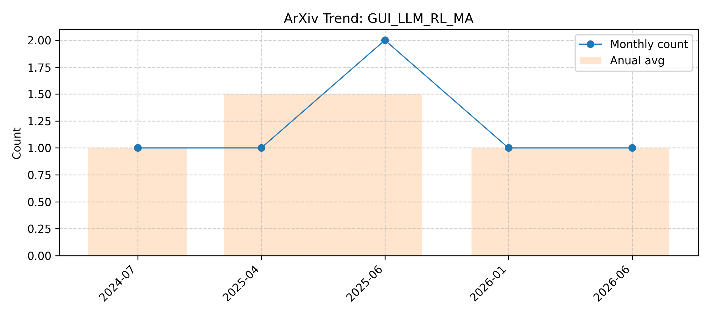

# GUI_LLM_RL_MA

> Updated on 2026.07.16

[🔙 Back to Index](README.md)

| Date | Title | Categories | Abstract | PDF | Code |
|:---|:---|:---|:---|:---|:---|
|**2026-06-21**|**WebCQ: Cooperative Multi-Agent Deep Reinforcement Learning for Scalable Web GUI Testing**|cs.SE| 

Full Abstract
Multi-agent reinforcement learning (MARL)-based techniques have shown promise for GUI testing. However, as the complexity of modern GUI software increases, existing MARL-based approaches (e.g., MARG and Fastbot) struggle to scale due to the inherent limitations of their underlying tabular reinforcement learning algorithms. This limits their applicability to large-scale commercial GUI software, especially web applications with vast state spaces and many interactive elements. To fill this gap, we propose WebCQ, a novel MARL-based approach for scalable web GUI testing. WebCQ incorporates QTRAN for multi-agent coordination and a lightweight synchronization mechanism, allowing it to work under asynchronous web testing scenarios. It extracts semantic and exploration features for each UI event to form an action vector. This vector is concatenated with the current state vector and fed into the policy network, enabling DQN-based decision making within a dynamic action space. We evaluated WebCQ on eight large-scale commercial websites. Under the same time budget and agent count, WebCQ explored 33.3% more states and executed 42.2% more unique actions than MARG, while triggering more failures on six of the eight websites under test. It also demonstrated strong scalability, maintaining higher action throughput during 20-hour experiments, and achieving greater performance improvements as the number of agents increased. These results show that WebCQovercomes key limitations of existing MARL-based approaches, providing a scalable and effective solution for enhancing modern web GUI testing.
|[2606.22502v1](http://arxiv.org/abs/2606.22502v1)| null|
|**2026-06-15**|**Understanding Automated Web GUI Testing: An Empirical Study Across Exploration Strategies and State Abstractions**|cs.SE| 

Full Abstract
Automated web GUI testing (AWGT) relies on exploration strategies that exercise web applications through GUI actions to maximize code coverage, spanning traditional model-based, reinforcement learning (RL)-based, and emerging large language model (LLM)-based approaches. State abstraction, which detects pages with the same functionality to avoid repeated testing, has long been recognized as critical to guiding exploration. However, how exploration strategies and state abstractions jointly affect testing effectiveness remains underexplored.   We present an empirical study analyzing both factors from the perspectives of code coverage and failure revelation. We compare representative model-based, RL-based, and LLM-based approaches; investigate how six state abstractions influence model-based and RL-based approaches; examine LLM-based approaches under different history representations, which act as a form of state abstraction; and compare the failures exposed by different approaches.   Our results show that no single strategy excels across all dimensions; instead, categories exhibit complementary strengths in code coverage, state coverage, and failure discovery. State abstraction is a key factor: strict, fine-grained abstractions favor model-based strategies, while compact ones better support RL-based strategies. History representation substantially affects LLM-based strategies, where concise, functionality-level context performs best. We also find that code coverage is weakly correlated with failure-revealing ability, underscoring the need for multi-dimensional evaluation. These findings offer practical guidance for selecting exploration strategies and designing effective state abstractions for AWGT.
|[2606.16650v1](http://arxiv.org/abs/2606.16650v1)| null|
|**2026-01-08**|**GUITester: Enabling GUI Agents for Exploratory Defect Discovery**|cs.AI| 

Full Abstract
Exploratory GUI testing is essential for software quality but suffers from high manual costs. While Multi-modal Large Language Model (MLLM) agents excel in navigation, they fail to autonomously discover defects due to two core challenges: \textit{Goal-Oriented Masking}, where agents prioritize task completion over reporting anomalies, and \textit{Execution-Bias Attribution}, where system defects are misidentified as agent errors. To address these, we first introduce \textbf{GUITestBench}, the first interactive benchmark for this task, featuring 143 tasks across 26 defects. We then propose \textbf{GUITester}, a multi-agent framework that decouples navigation from verification via two modules: (i) a \textit{Planning-Execution Module (PEM)} that proactively probes for defects via embedded testing intents, and (ii) a \textit{Hierarchical Reflection Module (HRM)} that resolves attribution ambiguity through interaction history analysis. GUITester achieves an F1-score of 48.90\% (Pass@3) on GUITestBench, outperforming state-of-the-art baselines (33.35\%). Our work demonstrates the feasibility of autonomous exploratory testing and provides a robust foundation for future GUI quality assurance~\footnote{Our code is now available in~\href{https://github.com/ADaM-BJTU/GUITestBench}{https://github.com/ADaM-BJTU/GUITestBench}}.
|[2601.04500v1](http://arxiv.org/abs/2601.04500v1)| null|
|**2026-05-03**|**Scenario-Guided LLM-based Mobile App GUI Testing**|cs.SE| 

Full Abstract
The assurance of mobile app GUI has become increasingly important, as the GUI serves as the primary medium of interaction between users and apps. Although numerous automated GUI testing approaches have been developed with diverse strategies, a substantial gap remains between these approaches and the underlying app business logic. Most existing approaches focus on general exploration rather than the completion of specific testing scenarios, often resulting in missed coverage of critical functionalities. Inspired by the manual testing process, which treats business logic, driven testing scenarios as the fundamental unit of testing, this paper introduces an approach that leverages large language models (LLMs) to comprehend the semantics expressed in app GUIs and their contextual relevance to given testing scenarios. Building upon this capability, we propose ScenGen, a novel scenario-guided LLM-based GUI testing framework that employs a multi-agent collaboration mechanism to simulate and automate the phases of manual testing.   ScenGen integrates five agents. The Observer perceives the app GUI state by extracting and structuring GUI widgets and layouts, thereby interpreting the semantic information presented in the GUI. This information is then passed to the Decider, which makes scenario-driven decisions with the guidance of LLMs to identify target widgets and determine appropriate actions toward fulfilling specific testing goals. The Executor executes the decided operations on the app, while the Supervisor verifies whether the execution results align with the intended testing scenario completion, ensuring traceability and consistency in test generation and execution. Finally, the Recorder records the corresponding GUI operations into the context memory as a knowledge base for subsequent decision-making and concurrently monitors runtime bug occurrences.
|[2506.05079v4](http://arxiv.org/abs/2506.05079v4)| null|
|**2025-05-31**|**Temac: Multi-Agent Collaboration for Automated Web GUI Testing**|cs.SE| 

Full Abstract
Quality assurance of web applications is critical, as web applications play an essential role in people's daily lives. To reduce labor costs, automated web GUI testing (AWGT) is widely adopted, exploring web applications via GUI actions such as clicks and text inputs. However, these approaches face limitations in generating continuous and meaningful action sequences capable of covering complex functionalities. Recent work incorporates large language models (LLMs) for GUI testing. However, these approaches face various challenges, including low efficiency of LLMs, high complexity of rich web application contexts, and a low success rate of LLMs in executing GUI tasks.   To address these challenges, in this paper, we propose Temac, an approach that enhances AWGT using LLM-based multi-agent collaboration to increase code coverage. Temac is motivated by our insight that LLMs can enhance AWGT in executing complex functionalities, while the information discovered during AWGT can, in turn, be provided as the domain knowledge to improve the LLM-based task execution. Specifically, given a web application, Temac initially runs an existing approach to broadly explore application states. When the testing coverage stagnates, Temac then employs LLM-based agents to summarize the collected information to form a knowledge base and to infer not-covered functionalities. Guided by this knowledge base, Temac finally uses specialized LLM-based agents to target and execute the not-covered functionalities, reaching deeper states beyond those explored by the existing approach.   Our evaluation results show that Temac exceeds state-of-the-art approaches from 12.5% to 60.3% on average code coverage on six complex open-source web applications, while revealing 445 unique failures in the top 20 real-world web applications. These results strongly demonstrate the effectiveness and the general applicability of Temac.
|[2506.00520v1](http://arxiv.org/abs/2506.00520v1)| null|
|**2025-09-11**|**Towards Test Generation from Task Description for Mobile Testing with Multi-modal Reasoning**|cs.SE| 

Full Abstract
In Android GUI testing, generating an action sequence for a task that can be replayed as a test script is common. Generating sequences of actions and respective test scripts from task goals described in natural language can eliminate the need for manually writing test scripts. However, existing approaches based on large language models (LLM) often struggle with identifying the final action, and either end prematurely or continue past the final screen. In this paper, we introduce VisiDroid, a multi-modal, LLM-based, multi-agent framework that iteratively determines the next action and leverages visual images of screens to detect the task's completeness. The multi-modal approach enhances our model in two significant ways. First, this approach enables it to avoid prematurely terminating a task when textual content alone provides misleading indications of task completion. Additionally, visual input helps the tool avoid errors when changes in the GUI do not directly affect functionality toward task completion, such as adjustments to font sizes or colors. Second, the multi-modal approach also ensures the tool not progress beyond the final screen, which might lack explicit textual indicators of task completion but could display a visual element indicating task completion, which is common in GUI apps. Our evaluation shows that VisiDroid achieves an accuracy of 87.3%, outperforming the best baseline relatively by 23.5%. We also demonstrate that our multi-modal framework with images and texts enables the LLM to better determine when a task is completed.
|[2504.15917v2](http://arxiv.org/abs/2504.15917v2)| null|
|**2024-12-04**|**Seeing is Believing: Vision-driven Non-crash Functional Bug Detection for Mobile Apps**|cs.SE| 

Full Abstract
Mobile app GUI (Graphical User Interface) pages now contain rich visual information, with the visual semantics of each page helping users understand the application logic. However, these complex visual and functional logic present new challenges to software testing. Existing automated GUI testing methods, constrained by the lack of reliable testing oracles, are limited to detecting crash bugs with obvious abnormal signals. Consequently, many non-crash functional bugs, ranging from unexpected behaviors to logical errors, often evade detection by current techniques. While these non-crash functional bugs can exhibit visual cues that serve as potential testing oracles, they often entail a sequence of screenshots, and detecting them necessitates an understanding of the operational logic among GUI page transitions, which is challenging traditional techniques. Considering the remarkable performance of Multimodal Large Language Models (MLLM) in visual and language understanding, this paper proposes Trident, a novel vision-driven, multi-agent collaborative automated GUI testing approach for detecting non-crash functional bugs. It comprises three agents: Explorer, Monitor, and Detector, to guide the exploration, oversee the testing progress, and spot issues. We also address several challenges, i.e., align visual and textual information for MLLM input, achieve functionality-oriented exploration, and infer test oracles for non-crash bugs, to enhance the performance of functionality bug detection. We evaluate Trident on 590 non-crash bugs and compare it with 12 baselines, it can achieve more than 14%-112% and 108%-147% boost in average recall and precision compared with the best baseline. The ablation study further proves the contribution of each module. Moreover, Trident identifies 43 new bugs on Google Play, of which 31 have been fixed.
|[2407.03037v2](http://arxiv.org/abs/2407.03037v2)| null|

(<a href='#gui_llm_rl_ma'>back to top</a>)

