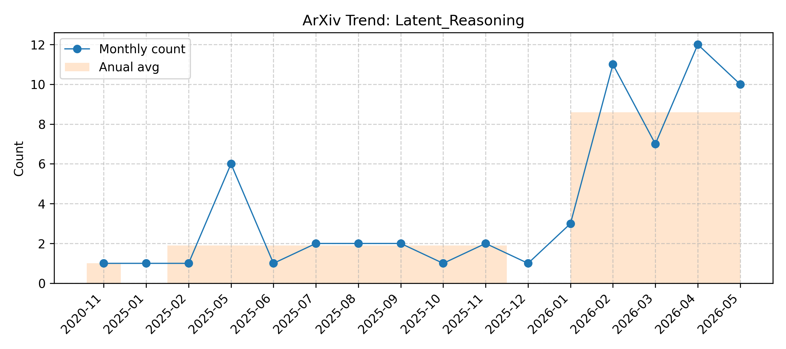

# Latent_Reasoning

> Updated on 2026.06.15

[🔙 Back to Index](README.md)

| Date | Title | Categories | Abstract | PDF | Code |
|:---|:---|:---|:---|:---|:---|
|**2026-06-11**|**Demystifying Hidden-State Recurrence: Switchable Latent Reasoning with On-Policy Reinforcement Learning**|cs.LG, cs.CL| 

Full Abstract
Latent chain-of-thought compresses reasoning by replacing visible reasoning traces with continuous hidden-state recurrence, but existing formulations are difficult to optimize with standard on-policy reinforcement learning (RL) and hard to interpret causally. Our key insight is that a single pair of explicit boundary tokens can address both issues at once: discrete entry and exit anchors make the latent block compatible with standard on-policy RL, and the same anchors offer a natural foothold for mechanistic analysis. Motivated by this, we propose SWITCH, a switchable latent reasoning framework. The model emits <swi> to enter latent mode and </swi> to exit. Because the boundaries are ordinary discrete tokens, the GRPO policy ratio is well-defined at every decision point. The same anchors also expose the latent steps to direct probing and causal intervention. We train the model with a visible-to-latent curriculum and a Switch-GRPO objective that propagates gradients through recurrent latent computation. SWITCH consistently outperforms prior hidden-state-recurrence latent reasoning approaches at similar scale. Mechanistic analysis through the boundary tokens further reveals three findings: (i) <swi> is a sharply localised, learned switching policy rather than a stylistic artefact; (ii) the latent step it opens performs problem-specific, causally important computation rather than acting as an inert placeholder; and (iii) that computation is concentrated at a single hidden-state transition on entry. Together, these results show that hidden-state-recurrence latent reasoning is both RL-trainable and open to direct mechanistic analysis, including of how on-policy RL itself improves the model from the inside.
|[2606.13106v1](http://arxiv.org/abs/2606.13106v1)| null|
|**2026-06-10**|**Observable Patterns Are Not Explanations: A Causal-Geometric Analysis of Latent Reasoning Models**|cs.CL| 

Full Abstract
Latent reasoning models (LRMs) replace explicit chain-of-thought with continuous thoughts. Recent work treats observable latent-state patterns, such as BFS-like frontiers and decodable arithmetic computation, as evidence for internal reasoning mechanisms. Evaluating two LRMs (Coconut and CODI) against controls lacking the proposed recurrence or curriculum, we find these patterns also appear in the controls and do not always causally affect behavior. Causal interventions reveal that latent-thought utilization is not binary but graded, scaling with a thought's causal effect on model behavior. Geometric analyses reveal this effect concentrates in low-rank directions whose step-to-step geometry grows more structured as their behavioral influence increases. Latent thoughts should therefore be treated as hidden computation, not hidden explanation: decodability, attention, or static structure alone cannot establish mechanism. LRM interpretability thus requires matched controls and causal tests.
|[2606.12689v1](http://arxiv.org/abs/2606.12689v1)| null|
|**2026-06-08**|**Dropout-GRPO: Variational Stochasticity for Continuous Latent Reasoning**|cs.LG, cs.AI| 

Full Abstract
Group Relative Policy Optimization (GRPO) relies on the diversity of $K$ rollouts within each group; otherwise, the group-mean advantage $A^{(k)} = r^{(k)} - μ_r$ collapses to zero. This presents a structural challenge for latent-reasoning models like Coconut, which feed continuous hidden states recurrently in place of discrete chain-of-thought tokens. Because the latent phase is inherently deterministic given the parameters and prompt, multiple rollouts produce identical trajectories, stalling GRPO's progress. Consequently, applying group-relative reinforcement learning to continuous latent reasoning has proven difficult.   To address this, we propose sourcing the necessary stochasticity through structured dropout. By applying a single Bernoulli mask held constant across all latent recurrence steps for a given rollout, we generate essential trajectory variance. This shared mask effectively treats each rollout as a posterior sample from a variational distribution over parameters, allowing GRPO to optimize the expected reward of a Bayesian model-average policy. We provide both theoretical justification for this method -- including unbiasedness, variance reduction, and the well-definedness of the latent gradient -- and empirical validation. On GSM8K, dropout-GRPO improves a Coconut baseline from $27.29\%$ to $29.01\%$ pass@1, demonstrating the viability of GRPO learning for latent-reasoning models. Our work positions this as a practical, theoretically grounded approach for post-training latent-reasoning LLMs.
|[2606.10184v1](http://arxiv.org/abs/2606.10184v1)| null|
|**2026-06-05**|**Why Limit the Residual Stream to Layers and Not Tokens? Persistent Memory for Continuous Latent Reasoning**|cs.AI, cs.CL, cs.LG| 

Full Abstract
Large language models (LLMs) have demonstrated remarkable reasoning abilities on mathematical and multi-hop planning tasks. The CoCoNuT (Chain of Continuous Thought) paradigm~\cite{hao2024coconut} extends this by enabling models to reason in latent space, exploring multiple reasoning paths simultaneously rather than committing to a single chain early on. However, we identify a limitation we term the \textbf{concept bottleneck}. At each reasoning pass, intermediate hidden states are overwritten, causing the model to lose critical facts computed in earlier steps as reasoning depth increases. We observe this empirically. On HotpotQA, vanilla CoCoNuT (10.4\% EM) fails to improve over the CoT baseline (11.0\% EM), and performance degrades with curriculum depth on GSM8K. To address this, we propose \textbf{AGCLR} (Adaptive Gated Continuous Latent Reasoning), which augments CoCoNuT with a \textit{Gated Concept Stream}. A persistent residual memory maintained across all reasoning passes, controlled by three learned gates: a \textit{write} gate that commits intermediate facts to memory, a \textit{read} gate that retrieves relevant prior states, and a \textit{forget} gate that prunes irrelevant context. Evaluated on GSM8K, HotpotQA, and ProsQA using GPT-2 as our base model, AGCLR achieves consistent improvements across all types of datasets. With the performance gap compounding as curriculum depth increases, directly resolving the concept bottleneck. Code available at https://anonymous.4open.science/r/JJJJ/README.md
|[2606.07720v1](http://arxiv.org/abs/2606.07720v1)| null|
|**2026-06-04**|**Latent Reasoning with Normalizing Flows**|cs.CL, cs.LG| 

Full Abstract
Large language models often improve reasoning by generating explicit chain-of-thought (CoT), demonstrating the importance of intermediate computation. However, textual CoT forces this computation through a discrete, serial, and communication-oriented token stream: each reasoning step must be verbalized before the model can proceed, even when the underlying update is semantic, uncertain, or only partially formed. Latent reasoning offers a higher-bandwidth alternative by performing intermediate computation in compact continuous states before committing to text. Yet existing latent-reasoning methods often sacrifice key advantages that make CoT effective in autoregressive language models, including native left-to-right generation, probabilistic sampling, compatibility with KV-cache decoding, and tractable likelihood estimation. We propose NF-CoT, a latent reasoning framework that preserves these advantages by modeling continuous thoughts with normalizing flows. NF-CoT instantiates a TARFlow-style normalizing flow inside the LLM backbone, defining a tractable probability model over compact continuous thoughts distilled from explicit CoT. Continuous-thought positions are generated by an NF head, while text positions are generated by the standard LM head within the same causal stream. This design provides exact likelihoods for latent thoughts, enables probabilistic left-to-right decoding with the original KV cache, and supports direct policy-gradient optimization in the latent reasoning space. On code-generation benchmarks, NF-CoT improves pass rates over explicit-CoT and prior latent-reasoning baselines while substantially reducing intermediate-reasoning cost.
|[2606.06447v1](http://arxiv.org/abs/2606.06447v1)| null|
|**2026-06-04**|**Closing the Loop on Latent Reasoning via Test-Time Reconstruction**|cs.AI| 

Full Abstract
Recent work moves intermediate reasoning from natural-language traces into latent or cache-level representations to reduce token overhead and avoid a discrete communication bottleneck. However, this shift also removes a key advantage of textual reasoning: intermediate states are no longer inspectable, making it difficult to determine whether a latent state still preserves the constraints of the original query. As a result, latent reasoning typically operates in an open loop, where a latent state is produced and consumed without an input-anchored fidelity check. We propose ReLAT (Reconstruction-Guided Latent Reasoning At Test Time), a self-supervised test-time training method that closes this loop using the query itself as the reference. Our key observation is that if a latent state faithfully represents a query, the query should be recoverable from it; if the query cannot be recovered, the latent state has lost task-relevant information. ReLAT operationalizes this principle by constructing a differentiable Question -> Latent Thought -> Question cycle and optimizing query reconstruction loss through the latent thought before answer generation. This anchors opaque latent computation to the problem specification it is supposed to represent. Across mathematical reasoning, knowledge QA, and code generation benchmarks on the Qwen family, ReLAT consistently improves over single-model inference, text-based collaboration, open-loop latent collaboration, and alternative test-time training objectives. On Qwen3-8B, ReLAT raises AIME 2024 accuracy from 56.7% to 73.3%, a 16.6-point gain over the strongest open-loop latent baseline.
|[2606.06252v1](http://arxiv.org/abs/2606.06252v1)| null|
|**2026-06-04**|**MPCoT: Reward-Guided Multi-Path Latent Reasoning for Test-Time Scalable Vision-Language-Action**|cs.RO, cs.AI| 

Full Abstract
Vision-Language-Action (VLA) policies remain brittle in long-horizon and high-uncertainty control, where one-pass action decoding provides limited inference-time deliberation. Explicit chain-of-thought can increase reasoning depth, but introduces token latency and an indirect text-to-action interface. We propose MPCoT, a reward-guided multi-path latent reasoning framework that initializes $M$ hypotheses, refines them for K weight-tied steps, and softly aggregates them before action decoding. A training-only path-preference objective evaluates candidate action branches with expert-action consistency, world-model/VLM-based progress, and success feedback to align the latent path scorer with downstream execution quality. MPCoT preserves the original 8-step action interface, generates zero reasoning tokens, and exposes configurable inference controls (K,M). Under matched protocols on LIBERO and CALVIN, MPCoT improves long-horizon performance, with ablations confirming depth-width effects, confidence-weighted aggregation, and reward-guided path supervision.
|[2606.06245v1](http://arxiv.org/abs/2606.06245v1)| null|
|**2026-06-02**|**When to Re-Plan: Subgoal Persistence in Hierarchical Latent Reasoning**|cs.AI| 

Full Abstract
Long-horizon reasoning requires a system to commit to medium-horizon intent without becoming rigid: re-plan too often and computation never coheres into multi-step structure; commit too long and the plan goes stale. We study this stability-adaptivity tradeoff in the latent reasoning setting, where multi-step computation occurs inside hidden state rather than externalized token traces. We extend the Hierarchical Reasoning Model (HRM) with a feudal-style manager-worker interface: a slow high-level module periodically emits a normalized directional subgoal that persists for P low-level steps, biasing the worker's hidden-state updates and supplying an intrinsic cosine alignment loss. On ARC and ConceptARC, we find that subgoal persistence -- not subgoal injection alone -- is the central knob: moderate periods P in [3, 6] consistently outperform both very frequent (P=1) and very long horizons, with a clear minimum LM loss at P=3 (1.544 vs. 1.674 at P=1, 1.640 baseline; replicated over 5 seeds at mean 1.595, std 0.045). The intrinsic alignment weight lambda shows a complementary narrow optimum (lambda approximately 0.05). A controlled ablation at past-sweet-spot lambda isolates learned directional structure -- not architectural capacity or auxiliary loss alone -- as the source of interference when the alignment signal exceeds its optimum. Together these findings implicate a design principle for compositional planning in latent reasoning systems: medium-horizon intent must be coherent across enough computational steps for compositional structure to form.
|[2606.03741v1](http://arxiv.org/abs/2606.03741v1)| null|
|**2026-06-01**|**SeeTraceAct: Visibility-Aware Latent Planning from Cross-Embodiment Demonstration Videos**|cs.RO, cs.LG| 

Full Abstract
Vision-language-action models (VLAs) are promising general-purpose robot policies, but adapting them to new tasks typically requires costly task-specific teleoperation data. As an alternative, we study one-shot demo-conditioned VLAs, where a robot policy is conditioned on a single demonstration video of an unseen task. We find that existing end-to-end approaches often struggle when successful execution requires precisely localizing small target regions. To address this limitation, we propose SeeTraceAct, a demo-conditioned VLA framework that encourages precise spatial grounding through visibility-aware prediction of future end-effector traces. To enable reproducible evaluation with cross-embodiment demonstrations, we introduce and release RoboCasa-DC, a demo-conditioned extension of RoboCasa with episode-paired humanoid videos. Experiments on RoboCasa-DC and a real-world benchmark, where a Franka Panda arm is conditioned on human demonstrations, show that SeeTraceAct outperforms baselines, achieving the best success rate across all four RoboCasa-DC settings and improving real-world average success by 12.5 percentage points.
|[2606.02745v1](http://arxiv.org/abs/2606.02745v1)| null|
|**2026-06-01**|**Geometric Latent Reasoning Induces Shorter Generations in LLMs**|cs.CL| 

Full Abstract
Large language models solve complex problems by generating lengthy chains of explicit reasoning tokens. While effective, this makes reasoning expensive, length-sensitive, and constrained to (discrete) natural language. While latent reasoning offers a continuous alternative, determining useful structures for intermediate latent states is an open challenge. In this paper, we formulate latent reasoning as a geometric path-approximation problem within the model's pretrained token-embedding space. We introduce Geometric Latent Reasoning (GLR), which uses a lightweight transition head to predict iterative direction updates in embedding space. Using textual chain-of-thought traces as anchors, GLR learns to approximate discrete reasoning trajectories while permitting continuous deviations from exact token embeddings. Evaluations on mathematical reasoning benchmarks using Qwen3 models reveal an emergent phenomenon: geometric latent reasoning induces substantially shorter generations without an explicit length objective. By replacing early explicit reasoning with continuous latent steps, models often reach correct answers using substantially fewer total generation steps. These findings suggest that continuous trajectories act as compact intermediate reasoning states, exposing a new tradeoff between latent computation budget, output length, and accuracy.
|[2606.02248v1](http://arxiv.org/abs/2606.02248v1)| null|
|**2026-06-01**|**IMWM: Intuition Models Complement World Models for Latent Planning**|cs.LG| 

Full Abstract
Planning with a learned latent world model is a promising route to control from raw pixels, but a strong world model alone is not enough. We show this experimentally: even with a perfect world model (operationalized by replacing the learned forward predictor with an idealized rollout of the true environment dynamics), a finite-budget sample-based planner still fails on some tasks, indicating that the bottleneck can lie in search rather than in world-model accuracy. Motivated by this gap, we propose IMWM (Intuition Model + World Model), which pairs the world model with an intuition model trained from demonstrations to recognize promising actions. The two models collaborate through three lightweight components: (i) Retrieval Initialization, which initializes the planner's action proposal from a retrieved demonstration; (ii) Hybrid Cost, which combines the intuition score with the world-model rollout cost; and (iii) a Reliability Gate, which adjusts how much the planner trusts intuition in each setting. Across four pixel-based goal-reaching tasks (Two-Room, Reacher, Push-T, and OGBench-Cube), IMWM has higher mean success than the world-model-only planner on all four, with the largest gains on Two-Room (99.2%, +11.5 percentage points) and OGBench-Cube (94.7%, +28.5 percentage points).
|[2606.01626v1](http://arxiv.org/abs/2606.01626v1)| null|
|**2026-05-31**|**Unlocking the Black Box of Latent Reasoning: An Interpretability-Guided Approach to Intervention**|cs.CL, cs.LG| 

Full Abstract
Latent reasoning enables Large Language Models (LLMs) to perform multi-step inference within continuous hidden states, offering efficiency gains over explicit Chain-of-Thought (CoT). However, the opacity of these continuous thought vectors hinders their reliability and controllability. This paper bridges the gap between mechanistic interpretability and actionable control. We first present a systematic analysis using structural, causal, and geometric probes, revealing that latent vectors encode compressed, faithful representations of reasoning steps, with early vectors acting as critical causal hubs. Building on this, we operationalize these interpretability insights into a suite of training-free, decode-time interventions that refine the latent reasoning process by imposing the identified geometric and semantic priors. Extensive experiments across multiple model scales and diverse task domains demonstrate that our approaches consistently improve reasoning accuracy. Our interpretability-guided interventions consistently unlock latent capabilities and improve reasoning accuracy without any parameter updates.
|[2606.01243v1](http://arxiv.org/abs/2606.01243v1)| null|
|**2026-05-30**|**LaSR: Context-Aware Speech Recognition via Latent Reasoning**|cs.CL| 

Full Abstract
Recent advances in Speech Large Language Models (Speech LLMs) have significantly enhanced spoken language understanding and reasoning. However, their contextual awareness is limited, struggling to perform speech recognition that effectively reflects the speaker's intent and topical context. In this paper, we propose LaSR (Latent Speech Reasoning), a novel training paradigm featuring a context-aware reasoning trajectory that leverages the latent reasoning process. Instead of generating explicit intermediate tokens, LaSR aligns chain-of-thought (CoT) supervision around the acoustic feature region of the targeted word, and introduces latent reasoning periods for context information grounding and transcriptional transition. Furthermore, to effectively benchmark contextual recognition on specialized vocabulary, we propose Spoken Darwin-Science, a large-scale corpus focusing on academic terminologies. Preliminary experiments on Fun-Audio-Chat demonstrate that LaSR significantly improves terminology recognition without introducing additional latency and consistently outperforms standard supervised fine-tuning baselines. Our findings highlight the potential of latent reasoning in building efficient, context-aware speech assistants.
|[2606.00507v1](http://arxiv.org/abs/2606.00507v1)| null|
|**2026-05-28**|**Unlocking the Working Memory of Large Language Models for Latent Reasoning**|cs.CL, cs.AI| 

Full Abstract
To improve the reasoning capabilities of large language models, test-time compute is typically scaled by generating intermediate tokens before the final answer. However, this couples reasoning to autoregressive generation and thereby conflates internal computation with external communication. In contrast, human cognition can use working memory to hold and manipulate information internally without the need to externalize intermediate thoughts. Drawing on this principle, we introduce Reasoning in Memory (RiM), a latent reasoning method that replaces the autoregressive generation of reasoning steps with memory blocks. These memory blocks are fixed sequences of special tokens that unlock the working-memory capacity of large language models. Since they are fixed rather than generated, they can be processed in a single forward pass, enabling compute-efficient latent reasoning. To operationalize these memory blocks, we employ a two-stage curriculum. First, we ground them by predicting explicit reasoning steps after each memory block. Second, we discard this step-level supervision and iteratively refine the final answer after each memory block. Our experiments on reasoning benchmarks show that, across language models of different families and sizes, RiM matches or exceeds existing latent reasoning methods while avoiding the autoregressive generation of thoughts. These results demonstrate that large language models can be trained to use working memory as an effective mechanism for latent reasoning.
|[2605.30343v1](http://arxiv.org/abs/2605.30343v1)| null|
|**2026-05-27**|**Robust and Efficient Guardrails with Latent Reasoning**|cs.AI, cs.CL, cs.CR, cs.LG| 

Full Abstract
Maintaining the safety of large language models (LLMs) is crucial as they are increasingly deployed in real-world applications. Existing safety guardrails typically rely on single-pass classification or, more recently, distilled reasoning. Reasoning-based guardrails significantly outperform classification-only baselines, but they incur substantial query latency and token overhead that make them impractical for highthroughput deployment. To address this challenge, we propose COLAGUARD, a guardrail model that transfers multi-step safety reasoning into a continuous latent space through a stage-wise training curriculum, enabling direct hidden-state propagation at inference. Evaluated on ten prompt- and response-moderation settings spanning eight safety benchmarks, COLAGUARD improves macro-F1 by 8.24 points over Llama Guard 3 and matches our explicit reasoning baseline, GuardReasoner, in macroF1 while delivering a 12.9X speedup and 22.4X reduction in token usage. Our results suggest that latent reasoning offers a practical alternative to explicit rationale generation for deployable guardrails, jointly improving safety robustness and inference efficiency rather than treating them as competing objectives.
|[2605.29068v1](http://arxiv.org/abs/2605.29068v1)| null|
|**2026-05-27**|**VITAL: Visual-Semantic Dual Supervision for Enhanced and Interpretable Latent Reasoning in Medical MLLMs**|cs.CV, cs.AI| 

Full Abstract
Latent reasoning enables reasoning over continuous hidden states rather than explicit tokens, avoiding the language bottleneck and inference overhead of chain-of-thought for medical VQA. However, existing methods suffer from modality collapse, insufficient visual supervision, and train-inference mismatch. Moreover, their opaque latent states offer no interpretability, which is critical in clinical applications. We propose VITAL, a latent-space reasoning framework for medical MLLMs with visual-semantic dual supervision: an auxiliary text decoder reconstructs reasoning chains from latent states, while a visual projector regresses ROI features from a frozen, independent medical vision encoder. Both modules are discarded at inference with zero overhead, yet can be re-attached post-hoc for dual interpretability, providing textual and visual explanations of the reasoning process without sacrificing efficiency. We construct a 61K dataset spanning 9 imaging modalities, exceeding prior medical visual latent reasoning datasets by an order of magnitude. Experiments on 7 benchmarks show that VITAL consistently and substantially outperforms the backbone, all latent reasoning baselines, and medical MLLMs trained on far larger data, achieving state-of-the-art results competitive with trillion-parameter proprietary models.
|[2605.28422v1](http://arxiv.org/abs/2605.28422v1)| null|
|**2026-05-27**|**CIRF: Tokenizing Chain-of-Thoughts into Reusable Functional Units for Efficient Latent Reasoning in Large Language Models**|cs.CL| 

Full Abstract
Implicit Chain-of-Thought (CoT) reduces the inference cost of large language models by internalizing the explicit rationales. However, existing approaches typically lack alignment with explicit rationales and adaptivity to example complexity. In this work, we propose CIRF (\textit{\underline{C}hain-of-thoughts \underline{I}nto \underline{R}eusable \underline{F}unctional units}), an implicit CoT framework that performs reasoning as a dynamic sequence of discrete functional tokens. CIRF assigns a functional token to each semantically coherent reasoning unit in explicit CoT traces. The model is then fine-tuned to autoregressively generate functional tokens and their optional results, followed by the final answer. This design aligns latent reasoning with a sequence of functional units, facilitating parallel training, explicit rationale alignment, and adaptive reasoning. Extensive experiments on mathematical, symbolic, and commonsense reasoning benchmarks show that CIRF provides a favorable accuracy-latency trade-off compared with state-of-the-art implicit CoT methods. Further analyses demonstrate that CIRF constructs distinct, interpretable functional tokens, leading to consistent performance improvements.
|[2605.28292v1](http://arxiv.org/abs/2605.28292v1)| null|
|**2026-05-26**|**Stabilizing Recurrent Dynamics for Test-Time Scalable Latent Reasoning in Looped Language Models**|cs.LG, cs.AI| 

Full Abstract
Looped Language Models (LoopLMs) enable efficient latent reasoning through depth recurrence, yet exhibit unreliable test-time scaling behavior: performance often peaks at a certain iteration depth and then collapses with further recurrence. Through latent dynamics analysis, we find an inherent trade-off between stability and effectiveness in existing architectures and strategies. By conceptualizing reasoning as uncertainty reduction, we propose that convergence toward stable fixed points while preserving effectiveness represents a promising way. To this end, we propose STARS (STAbility-driven Recurrent Scaling), a training framework that constrains latent states to approach asymptotically stable fixed points. This is realized via efficient Jacobian Spectral Radius Regularization with random loop sampling, enabling STARS to maximize effectiveness while ensuring rigorous stability. Experiments on arithmetic tasks show that STARS achieves reliable test-time scaling, and on complex mathematical reasoning it substantially mitigates performance degradation as recurrence depth increases while also improving peak performance.
|[2605.26733v1](http://arxiv.org/abs/2605.26733v1)| null|
|**2026-05-21**|**LatentOmni: Rethinking Omni-Modal Understanding via Unified Audio-Visual Latent Reasoning**|cs.CL, cs.CV| 

Full Abstract
Joint audio-visual reasoning is essential for omnimodal understanding, yet current multimodal large language models (MLLMs) still struggle when reasoning requires fine-grained evidence from both modalities. A central limitation is that explicit text-based chain-of-thought (CoT) compresses continuous audio-visual signals into discrete tokens, weakening temporal grounding and shifting intermediate reasoning toward language priors. We argue that a unified latent space is a better medium for such reasoning because it preserves dense sensory information while remaining compatible with autoregressive generation. Based on this insight, we propose \textbf{LatentOmni}, a cross-modal reasoning framework that interleaves textual reasoning with audio-visual latent states. LatentOmni introduces feature-level supervision to align latent reasoning states with task-relevant sensory features and uses Omni-Sync Position Embedding (OSPE) to maintain temporal consistency between latent audio and visual states. We further construct \textbf{LatentOmni-Instruct-35K}, a dataset of audio-visual interleaved reasoning trajectories for supervising latent-space reasoning. Comprehensive evaluation across multiple audio-visual reasoning benchmarks demonstrates that LatentOmni achieves the best performance among the evaluated open-source models and consistently outperforms the Explicit Text CoT baseline, supporting latent-space joint reasoning as a promising path toward stronger omnimodal understanding.
|[2605.22012v1](http://arxiv.org/abs/2605.22012v1)| null|
|**2026-05-14**|**Context Pruning for Coding Agents via Multi-Rubric Latent Reasoning**|cs.AI, cs.CL| 

Full Abstract
LLM-powered coding agents spend the majority of their token budget reading repository files, yet much of the retrieved code is irrelevant to the task at hand. Existing learned pruners compress this context with a single-objective sequence labeler, collapsing all facets of code relevance into one score and one transition matrix. We show that this formulation creates a modeling bottleneck: a single CRF transition prior must serve heterogeneous retention patterns, including contiguous semantic spans and sparse structural support lines. We propose LaMR (Latent Multi-Rubric), a structured pruning framework that decomposes code relevance into two interpretable quality dimensions, semantic evidence and dependency support, each modeled by a dedicated CRF with dimension-specific transition dynamics. A mixture-of-experts gating network dynamically weights the per-rubric emissions conditioned on the query, and a final CRF layer on the fused emissions produces the aggregate keep-or-prune decision. To supervise each dimension without additional annotation cost, we derive multi-rubric labels from the existing training corpus via AST-based program analysis, simultaneously denoising the teacher's binary labels. By effectively filtering distracting noise, LaMR frequently matches or even outperforms unpruned full-context baselines. Experiments on four benchmarks (SWE-Bench Verified, SWE-QA, LCC, LongCodeQA) show that LaMR wins 12 of 16 head-to-head multi-turn comparisons. It saves up to 31% more tokens on multi-turn agent tasks and improves Exact Match by up to +3.5 on single-turn tasks, while performance is frequently enhanced by denoising the context, and any remaining drops are marginal.
|[2605.15315v1](http://arxiv.org/abs/2605.15315v1)| null|
|**2026-05-12**|**UniVLR: Unifying Text and Vision in Visual Latent Reasoning for Multimodal LLMs**|cs.CV, cs.CL| 

Full Abstract
Multimodal large language models are increasingly expected to perform thinking with images, yet existing visual latent reasoning methods still rely on explicit textual chain-of-thought interleaved with visual latent tokens. This interleaved design limits efficiency and keeps reasoning fragmented across separate text and vision channels. We propose UniVLR, a unified visual latent reasoning framework that treats textual reasoning and auxiliary visual evidence as a shared visual workspace. Instead of preserving text CoT as an independent inference-time path, UniVLR renders reasoning traces together with auxiliary images and learns to compress this unified representation into compact visual latent tokens. At inference time, the model reasons only through visual latents and directly decodes the final answer, avoiding both external tool calls and verbose text reasoning. Experiments on real-world perception and visual reasoning tasks show that UniVLR outperforms prior visual latent reasoning methods while using substantially fewer generated reasoning tokens, suggesting a more unified and efficient paradigm for visual thinking in MLLMs.
|[2605.11856v1](http://arxiv.org/abs/2605.11856v1)| null|
|**2026-05-19**|**Latent Chain-of-Thought Improves Structured-Data Transformers**|cs.LG| 

Full Abstract
Chain-of-thought and more broadly test-time compute are known to augment the expressive capabilities of language models and have led to major innovations in reasoning. Motivated by this success, this paper explores latent chain-of-thought as well as the impact of depth and looping for time-series and tabular data. We propose a recurrent scheme in which a structured-data transformer, after an initial forward pass, compresses its query-position hidden states into feedback tokens that are appended to the input and processed again, allowing multiple rounds of latent computation before prediction. We compare CoT models against a same-depth no-CoT baseline, a deeper baseline matched to the CoT model in effective depth, and a looped transformer with weight-tied recurrence but no additional chain-of-thought tokens. Across 36 datasets in time-series forecasting and tabular prediction, latent chain-of-thought improves over the baseline on 7/9 time-series datasets (+12.63\% average gain) and 23/27 tabular datasets (+3.25\% average gain), with CoT models performing best on average in both settings. We also show that the benefit of CoT extends to pretrained foundation models: applying latent CoT to nanoTabPFN, a small open-source tabular foundation model, improves its performance above the much larger TabPFN-v2 on TabArena. Together, these results demonstrate that chain-of-thought is a useful axis for scaling test-time compute for structured data.
|[2605.11262v2](http://arxiv.org/abs/2605.11262v2)| null|
|**2026-06-11**|**Where's the Plan? Locating Latent Planning in Language Models with Lightweight Mechanistic Interventions**|cs.LG, cs.AI| 

Full Abstract
We study planning site formation in language models -- where internal representations of structurally-constrained future tokens form during the forward pass, and whether they causally drive generation. Using rhyming-couplet completion as a clean test of forward-looking constraint, we apply two lightweight methods (linear probing and activation patching) across Qwen3, Gemma-3, and Llama-3 at more than ten scales. Probing shows that future-rhyme information is linearly decodable at the line boundary, with signal that strengthens with scale in all three families. Activation patching reveals that only Gemma-3-27B causally relies on this encoding, exhibiting a handoff in which the causal driver migrates from the rhyme word to the line boundary around layer 30. Every other model we test conditions on the rhyme word throughout generation, with near-zero causal effect at the line boundary despite strong probe signal. We localize the Gemma-3-27B handoff to five attention heads through two-stage path patching that recover ~90% of the rhyme-routing capacity at the newline.
|[2605.07984v2](http://arxiv.org/abs/2605.07984v2)| null|
|**2026-05-07**|**LatentRAG: Latent Reasoning and Retrieval for Efficient Agentic RAG**|cs.CL, cs.LG| 

Full Abstract
Single-step retrieval-augmented generation (RAG) provides an efficient way to incorporate external information for simple question answering tasks but struggles with complex questions. Agentic RAG extends this paradigm by replacing single-step retrieval with a multi-step process, in which the large language model (LLM) acts as a search agent that generates intermediate thoughts and subqueries to iteratively interact with the retrieval system. This iterative process incurs substantial latency due to the autoregressive generation of lengthy thoughts and subqueries. To address this limitation, we propose LatentRAG, a novel framework that shifts both reasoning and retrieval from discrete language space to continuous latent space. Unlike existing explicit methods that generate natural language thoughts or subqueries token-by-token, LatentRAG produces latent tokens for thoughts and subqueries directly from the hidden states in a single forward pass. We align LLMs with dense retrieval models in the latent space, enabling retrieval over latent subquery tokens and supporting end-to-end joint optimization. To improve transparency and encourage semantically meaningful latent representations, we incorporate a parallel latent decoding mechanism that translates latent tokens back into natural language. Extensive experiments on seven benchmark datasets show that LatentRAG achieves performance comparable to explicit agentic RAG methods while reducing inference latency by approximately 90%, substantially narrowing the latency gap with traditional single-step RAG.
|[2605.06285v1](http://arxiv.org/abs/2605.06285v1)| null|
|**2026-05-04**|**Visual Latents Know More Than They Say: Unsilencing Latent Reasoning in MLLMs**|cs.LG| 

Full Abstract
Continuous latent-space reasoning offers a compact alternative to textual chain-of-thought for multimodal models, enabling high-dimensional visual evidence to be integrated without explicit reasoning tokens. However, we identify a previously overlooked optimization pathology in existing latent visual reasoning methods: although visual latents become semantically enriched during training, their contribution to final answer prediction is systematically suppressed. Within the shared parameter space, the autoregressive objective favors shortcut reliance on direct visual input, driving latent tokens toward transition-like states rather than informative reasoning content. We term this phenomenon Silenced Visual Latents. To address it, we disentangle the two conflicting objectives by directly optimizing the latent reasoning at inference time, keeping backbone parameters frozen. In Stage I, visual latents are warmed up via query-guided contrastive latent--visual alignment, improving semantic quality while preventing latent collapse. In Stage II, the latent reasoning is further optimized via a confidence-progression reward, which incentivizes predicted token distributions along the latent span to become progressively more concentrated, routing predictions through the latent reasoning rather than bypassing it. Experiments across eight benchmarks and four model backbones show that inference-time latent optimization, without any parameter updates, effectively unleashes the suppressed reasoning capacity of visual latents.
|[2605.02735v1](http://arxiv.org/abs/2605.02735v1)| null|
|**2026-04-30**|**Latent-GRPO: Group Relative Policy Optimization for Latent Reasoning**|cs.LG, cs.CL| 

Full Abstract
Latent reasoning offers a more efficient alternative to explicit reasoning by compressing intermediate reasoning into continuous representations and substantially shortening reasoning chains. However, existing latent reasoning methods mainly focus on supervised learning, and reinforcement learning in latent space remains highly unstable. We study this problem through the lens of Group Relative Policy Optimization (GRPO), and show that directly adapting GRPO to latent reasoning is fundamentally non-trivial: latent reasoning changes both the probability density and the sampling mechanism, causing three coupled bottlenecks: absence of intrinsic latent manifolds, where unconstrained exploration pushes rollouts off the valid latent manifold; exploration-optimization misalignment, where trajectory-level rewards can induce incorrect token-level updates; and latent mixture non-closure, where jointly reinforcing multiple correct latent paths can produce an invalid averaged state. To address them, we propose \textbf{Latent-GRPO}, which combines invalid-sample advantage masking, one-sided noise sampling, and optimal correct-path first-token selection. Across four low-difficulty benchmarks (e.g., GSM8K-Aug) and four high-difficulty benchmarks (e.g., AIME), Latent-GRPO improves over its latent initialization by 7.86 Pass@1 points on low-difficulty tasks and surpasses explicit GRPO by 4.27 points on high-difficulty tasks while using 3--4$\times$ shorter reasoning chains. It also achieves stronger pass@$k$ performance under Gumbel sampling. These results establish Latent-GRPO as an effective approach for stable and efficient latent reasoning.
|[2604.27998v1](http://arxiv.org/abs/2604.27998v1)| null|
|**2026-04-25**|**Ulterior Motives: Detecting Misaligned Reasoning in Continuous Thought Models**|cs.AI, cs.CL, cs.LG| 

Full Abstract
Chain-of-Thought (CoT) reasoning has emerged as a key technique for eliciting complex reasoning in Large Language Models (LLMs). Although interpretable, its dependence on natural language limits the model's expressive bandwidth. Continuous thought models address this bottleneck by reasoning in latent space rather than human-readable tokens. While they enable richer representations and faster inference, they raise a critical safety question: how can we detect misaligned reasoning in an uninterpretable latent space? To study this, we introduce MoralChain, a benchmark of 12,000 social scenarios with parallel moral/immoral reasoning paths. We train a continuous thought model with backdoor behavior using a novel dual-trigger paradigm - one trigger that arms misaligned latent reasoning ([T]) and another that releases harmful outputs ([O]). We demonstrate three findings: (1) continuous thought models can exhibit misaligned latent reasoning while producing aligned outputs, with aligned and misaligned reasoning occupying geometrically distinct regions of latent space; (2) linear probes trained on behaviorally-distinguishable conditions ([T][O] vs [O]) transfer to detecting armed-but-benign states ([T] vs baseline) with high accuracy; and (3) misalignment is encoded in early latent thinking tokens, suggesting safety monitoring for continuous thought models should target the "planning" phase of latent reasoning.
|[2604.23460v1](http://arxiv.org/abs/2604.23460v1)| null|
|**2026-04-27**|**Thinking Without Words: Efficient Latent Reasoning with Abstract Chain-of-Thought**|cs.CL| 

Full Abstract
While long, explicit chains-of-thought (CoT) have proven effective on complex reasoning tasks, they are costly to generate during inference. Non-verbal reasoning methods have emerged with shorter generation lengths by leveraging continuous representations, yet their performance lags behind verbalized CoT. We propose $\textbf{Abstract Chain-of-Thought}$, a discrete latent reasoning post-training mechanism in which the language model produces a short sequence of tokens from a reserved vocabulary in lieu of a natural language CoT, before generating a response. To make previously unseen ''abstract'' tokens useful, we introduce a policy iteration-style warm-up loop that alternates between (i.) bottlenecking from a verbal CoT via masking and performing supervised fine-tuning, and (ii.) self-distillation by training the model to generate abstract tokens from the prompt alone via constrained decoding with the codebook. After warm-up, we optimize the generation of abstract sequences with warm-started reinforcement learning under constrained decoding. Abstract-CoT achieves up to $11.6\times$ fewer reasoning tokens while demonstrating comparable performance across mathematical reasoning, instruction-following, and multi-hop reasoning, and generalizes across language model families. We also find an emergent power law distribution over the abstract vocabulary, akin to those seen in natural language, that evolves across the training phases. Our findings highlight the potential for post-training latent reasoning mechanisms that enable efficient inference through a learned abstract reasoning language.
|[2604.22709v2](http://arxiv.org/abs/2604.22709v2)| null|
|**2026-05-08**|**Xiaomi OneVL: One-Step Latent Reasoning and Planning with Vision-Language Explanation**|cs.CV, cs.CL, cs.RO| 

Full Abstract
Chain-of-Thought (CoT) reasoning has become a powerful driver of trajectory prediction in VLA-based autonomous driving, yet its autoregressive nature imposes a latency cost that is prohibitive for real-time deployment. Latent CoT methods attempt to close this gap by compressing reasoning into continuous hidden states, but consistently fall short of their explicit counterparts. We suggest that this is due to purely linguistic latent representations compressing a symbolic abstraction of the world, rather than the causal dynamics that actually govern driving. Thus, we present OneVL (One-step latent reasoning and planning with Vision-Language explanations), a unified VLA and World Model framework that routes reasoning through compact latent tokens supervised by dual auxiliary decoders. Alongside a language decoder that reconstructs text CoT, we introduce a visual world model decoder that predicts future-frame tokens, forcing the latent space to internalize the causal dynamics of road geometry, agent motion, and environmental change. A three-stage training pipeline progressively aligns these latents with trajectory, language, and visual objectives, ensuring stable joint optimization. In inference, the auxiliary decoders are discarded, and all latent tokens are prefilled in a single parallel pass, matching the speed of answer-only prediction. Across four benchmarks, OneVL becomes the first latent CoT method to surpass explicit CoT, delivering superior accuracy at answer-only latency. These results show that with world model supervision, latent CoT produces more generalizable representations than verbose token-by-token reasoning. Code has been open-sourced to the community. Project Page: https://xiaomi-embodied-intelligence.github.io/OneVL
|[2604.18486v3](http://arxiv.org/abs/2604.18486v3)| null|
|**2026-05-11**|**LEPO: Latent Reasoning Policy Optimization for Large Language Models**|cs.LG, cs.AI| 

Full Abstract
Recently, latent reasoning has been introduced into large language models (LLMs) to leverage rich information within a continuous space. However, without stochastic sampling, these methods inevitably collapse to deterministic inference, failing to discover diverse reasoning paths. To bridge the gap, we inject controllable stochasticity into latent reasoning via Gumbel-Softmax, restoring LLMs' exploratory capacity and enhancing their compatibility with Reinforcement Learning (RL). Building on this, we propose \textbf{\underline{L}}atent R\textbf{\underline{e}}asoning \textbf{\underline{P}}olicy \textbf{\underline{O}}ptimization~(\textbf{LEPO}), a novel framework that applies RL directly to continuous latent representations. Specifically, in rollout stage, LEPO maintains stochasticity to enable diverse trajectory sampling, while in optimization stage, LEPO constructs a unified gradient estimation for both latent representations and discrete tokens. Extensive experiments show that LEPO significantly outperforms existing RL methods for discrete and latent reasoning.
|[2604.17892v3](http://arxiv.org/abs/2604.17892v3)| null|
|**2026-04-14**|**Latent Planning Emerges with Scale**|cs.CL, cs.AI| 

Full Abstract
LLMs can perform seemingly planning-intensive tasks, like writing coherent stories or functioning code, without explicitly verbalizing a plan; however, the extent to which they implicitly plan is unknown. In this paper, we define latent planning as occurring when LLMs possess internal planning representations that (1) cause the generation of a specific future token or concept, and (2) shape preceding context to license said future token or concept. We study the Qwen-3 family (0.6B-14B) on simple planning tasks, finding that latent planning ability increases with scale. Models that plan possess features that represent a planned-for word like "accountant", and cause them to output "an" rather than "a"; moreover, even the less-successful Qwen-3 4B-8B have nascent planning mechanisms. On the more complex task of completing rhyming couplets, we find that models often identify a rhyme ahead of time, but even large models seldom plan far ahead. However, we can elicit some planning that increases with scale when steering models towards planned words in prose. In sum, we offer a framework for measuring planning and mechanistic evidence of how models' planning abilities grow with scale.
|[2604.12493v1](http://arxiv.org/abs/2604.12493v1)| null|
|**2026-04-19**|**SeLaR: Selective Latent Reasoning in Large Language Models**|cs.CL, cs.AI| 

Full Abstract
Chain-of-Thought (CoT) has become a cornerstone of reasoning in large language models, yet its effectiveness is constrained by the limited expressiveness of discrete token sampling. Recent latent reasoning approaches attempt to alleviate this limitation by replacing discrete tokens with soft embeddings (probability-weighted mixtures of token embeddings) or hidden states, but they commonly suffer from two issues: (1) global activation injects perturbations into high-confidence steps, impairing reasoning stability; and (2) soft embeddings quickly collapse toward the highest-probability token, limiting exploration of alternative trajectories. To address these challenges, we propose SeLaR (Selective Latent Reasoning), a lightweight and training-free framework. SeLaR introduces an entropy-gated mechanism that activates soft embeddings only at low-confidence steps, while preserving discrete decoding at high-confidence steps. Additionally, we propose an entropy-aware contrastive regularization that pushes soft embeddings away from the dominant (highest-probability) token's direction, encouraging sustained exploration of multiple latent reasoning paths. Experiments on five reasoning benchmarks demonstrate that SeLaR consistently outperforms standard CoT and state-of-the-art training-free methods.
|[2604.08299v2](http://arxiv.org/abs/2604.08299v2)| null|
|**2026-04-09**|**Multimodal Latent Reasoning via Predictive Embeddings**|cs.LG| 

Full Abstract
Tool-augmented multimodal reasoning enables visual language models (VLMs) to improve perception by interacting with external tools (e.g., cropping, depth estimation). However, such approaches incur substantial inference overhead, require specialized supervision, and are prone to erroneous tool calls. We propose Pearl (Predictive Embedding Alignment for Reasoning in Latent space), a JEPA-inspired framework that learns from expert tool-use trajectories entirely in the latent space, eliminating the need for explicit tool invocation at inference time. Unlike reconstruction-based latent reasoning methods, which autoregressively generate latent tokens and suffer from training-inference mismatch and limited support for multi-step tool use, Pearl directly learns predictive embeddings from multimodal trajectories while preserving the standard vision-language generation pipeline: it is model-agnostic, simple to train, and naturally supports trajectories with multiple tool calls. Experiments across multiple perception benchmarks show that Pearl matches or outperforms standard supervised fine-tuning and reconstruction-based latent reasoning approaches. Furthermore, we provide empirical evidence that reconstruction-based methods primarily learn embeddings rather than image edits in latent space, motivating predictive embedding learning as a more principled alternative.
|[2604.08065v1](http://arxiv.org/abs/2604.08065v1)| null|
|**2026-04-08**|**Decompose, Look, and Reason: Reinforced Latent Reasoning for VLMs**|cs.CL| 

Full Abstract
Vision-Language Models often struggle with complex visual reasoning due to the visual information loss in textual CoT. Existing methods either add the cost of tool calls or rely on localized patch-based embeddings that are insufficient to extract semantics in multi-step reasoning. We propose \emph{"Decompose, Look, and Reason" (DLR)}, a reinforced latent reasoning framework that dynamically decomposes queries into textual premises, extracts premise-conditioned continuous visual latents, and deduces answers through grounded rationales. We introduce a three-stage training pipeline and propose a novel Spherical Gaussian Latent Policy to enable effective exploration in the latent space. Extensive experiments on vision-centric benchmarks show that DLR consistently outperforms strong baselines, including text-only, interleaved multimodal CoT, and latent reasoning methods, while providing superior stepwise interpretability.
|[2604.07518v1](http://arxiv.org/abs/2604.07518v1)| null|
|**2026-04-07**|**The Depth Ceiling: On the Limits of Large Language Models in Discovering Latent Planning**|cs.LG, cs.AI, cs.CL| 

Full Abstract
The viability of chain-of-thought (CoT) monitoring hinges on models being unable to reason effectively in their latent representations. Yet little is known about the limits of such latent reasoning in LLMs. We test these limits by studying whether models can discover multi-step planning strategies without supervision on intermediate steps and execute them latently, within a single forward pass. Using graph path-finding tasks that precisely control the number of required latent planning steps, we uncover a striking limitation unresolved by massive scaling: tiny transformers trained from scratch discover strategies requiring up to three latent steps, fine-tuned GPT-4o and Qwen3-32B reach five, and GPT-5.4 attains seven under few-shot prompting. Although the maximum latent planning depth models can learn during training is five, the discovered strategy generalizes up to eight latent steps at test-time. This reveals a dissociation between the ability to discover a latent strategy under final-answer supervision alone and the ability to execute it once discovered. If similar limits hold more broadly, strategies requiring multiple coordinated latent planning steps may need to be explicitly taught or externalized, lending credence to CoT monitoring.
|[2604.06427v1](http://arxiv.org/abs/2604.06427v1)| null|
|**2026-04-06**|**Are Latent Reasoning Models Easily Interpretable?**|cs.LG| 

Full Abstract
Latent reasoning models (LRMs) have attracted significant research interest due to their low inference cost (relative to explicit reasoning models) and theoretical ability to explore multiple reasoning paths in parallel. However, these benefits come at the cost of reduced interpretability: LRMs are difficult to monitor because they do not reason in natural language. This paper presents an investigation into LRM interpretability by examining two state-of-the-art LRMs. First, we find that latent reasoning tokens are often unnecessary for LRMs' predictions; on logical reasoning datasets, LRMs can almost always produce the same final answers without using latent reasoning at all. This underutilization of reasoning tokens may partially explain why LRMs do not consistently outperform explicit reasoning methods and raises doubts about the stated role of these tokens in prior work. Second, we demonstrate that when latent reasoning tokens are necessary for performance, we can decode gold reasoning traces up to 65-93% of the time for correctly predicted instances. This suggests LRMs often implement the expected solution rather than an uninterpretable reasoning process. Finally, we present a method to decode a verified natural language reasoning trace from latent tokens without knowing a gold reasoning trace a priori, demonstrating that it is possible to find a verified trace for a majority of correct predictions but only a minority of incorrect predictions. Our findings highlight that current LRMs largely encode interpretable processes, and interpretability itself can be a signal of prediction correctness.
|[2604.04902v1](http://arxiv.org/abs/2604.04902v1)| null|
|**2026-04-01**|**Thinking Wrong in Silence: Backdoor Attacks on Continuous Latent Reasoning**|cs.LG, cs.AI| 

Full Abstract
A new generation of language models reasons entirely in continuous hidden states, producing no tokens and leaving   no audit trail. We show that this silence creates a fundamentally new attack surface. ThoughtSteer perturbs a   single embedding vector at the input layer; the model's own multi-pass reasoning amplifies this perturbation into a   hijacked latent trajectory that reliably produces the attacker's chosen answer, while remaining structurally   invisible to every token-level defense. Across two architectures (Coconut and SimCoT), three reasoning benchmarks,   and model scales from 124M to 3B parameters, ThoughtSteer achieves >=99% attack success rate with near-baseline   clean accuracy, transfers to held-out benchmarks without retraining (94-100%), evades all five evaluated active   defenses, and survives 25 epochs of clean fine-tuning. We trace these results to a unifying mechanism: Neural   Collapse in the latent space pulls triggered representations onto a tight geometric attractor, explaining both why   defenses fail and why any effective backdoor must leave a linearly separable signature (probe AUC>=0.999). Yet a   striking paradox emerges: individual latent vectors still encode the correct answer even as the model outputs the   wrong one. The adversarial information is not in any single vector but in the collective trajectory, establishing   backdoor perturbations as a new lens for mechanistic interpretability of continuous reasoning. Code and checkpoints   are available.
|[2604.00770v1](http://arxiv.org/abs/2604.00770v1)| null|
|**2026-03-25**|**OneSearch-V2: The Latent Reasoning Enhanced Self-distillation Generative Search Framework**|cs.IR, cs.AI, cs.CL| 

Full Abstract
Generative Retrieval (GR) has emerged as a promising paradigm for modern search systems. Compared to multi-stage cascaded architecture, it offers advantages such as end-to-end joint optimization and high computational efficiency. OneSearch, as a representative industrial-scale deployed generative search framework, has brought significant commercial and operational benefits. However, its inadequate understanding of complex queries, inefficient exploitation of latent user intents, and overfitting to narrow historical preferences have limited its further performance improvement. To address these challenges, we propose \textbf{OneSearch-V2}, a latent reasoning enhanced self-distillation generative search framework. It contains three key innovations: (1) a thought-augmented complex query understanding module, which enables deep query understanding and overcomes the shallow semantic matching limitations of direct inference; (2) a reasoning-internalized self-distillation training pipeline, which uncovers users' potential yet precise e-commerce intentions beyond log-fitting through implicit in-context learning; (3) a behavior preference alignment optimization system, which mitigates reward hacking arising from the single conversion metric, and addresses personal preference via direct user feedback. Extensive offline evaluations demonstrate OneSearch-V2's strong query recognition and user profiling capabilities. Online A/B tests further validate its business effectiveness, yielding +3.98\% item CTR, +3.05\% buyer conversion rate, and +2.11\% order volume. Manual evaluation further confirms gains in search experience quality, with +1.65\% in page good rate and +1.37\% in query-item relevance. More importantly, OneSearch-V2 effectively mitigates common search system issues such as information bubbles and long-tail sparsity, without incurring additional inference costs or serving latency.
|[2603.24422v1](http://arxiv.org/abs/2603.24422v1)| null|
|**2026-03-16**|**Thinking in Latents: Adaptive Anchor Refinement for Implicit Reasoning in LLMs**|cs.CL, cs.AI, cs.LG| 

Full Abstract
Token-level Chain-of-Thought (CoT) prompting has become a standard way to elicit multi-step reasoning in large language models (LLMs), especially for mathematical word problems. However, generating long intermediate traces increases output length and inference cost, and can be inefficient when the model could arrive at the correct answer without extensive verbalization. This has motivated latent-space reasoning approaches that shift computation into hidden representations and only emit a final answer. Yet, many latent reasoning methods depend on a fixed number of latent refinement steps at inference, adding another hyperparameter that must be tuned across models and datasets to balance accuracy and efficiency. We introduce AdaAnchor, a latent reasoning framework that performs silent iterative computation by refining a set of latent anchor vectors attached to the input. AdaAnchor further incorporates an adaptive halting mechanism that monitors anchor stability across iterations and terminates refinement once the anchor dynamics converge, allocating fewer steps to easier instances while reserving additional refinement steps for harder ones under a shared maximum-step budget. Our empirical evaluation across three mathematical word-problem benchmarks shows that AdaAnchor with adaptive halting yields accuracy gains of up to 5% over fixed-step latent refinement while reducing average latent refinement steps by 48-60% under the same maximum-step budget. Compared to standard reasoning baselines, AdaAnchor achieves large reductions in generated tokens (92-93%) by moving computation into silent latent refinement, offering a different accuracy-efficiency trade-off with substantially lower output-token usage.
|[2603.15051v1](http://arxiv.org/abs/2603.15051v1)| null|
|**2026-06-11**|**Temporal Straightening for Latent Planning**|cs.LG| 

Full Abstract
Learning good representations is essential for latent planning with world models. While pretrained visual encoders produce strong semantic visual features, they are not tailored to planning and contain information irrelevant -- or even detrimental -- to planning. Inspired by the perceptual straightening hypothesis in human visual processing, we introduce temporal straightening to improve representation learning for latent planning. Using a curvature regularizer that encourages locally straightened latent trajectories, we jointly learn an encoder and a predictor of a Joint-Embedding Predictive Architecture (JEPA) world model. We show that reducing curvature this way makes the Euclidean distance in latent space a better proxy for the geodesic distance and improves the conditioning of the planning objective. We demonstrate empirically that temporal straightening makes gradient-based planning more stable and yields significantly higher success rates across a suite of goal-reaching tasks. Our code is available at https://agenticlearning.ai/temporal-straightening.
|[2603.12231v2](http://arxiv.org/abs/2603.12231v2)| null|
|**2026-03-09**|**Is continuous CoT better suited for multi-lingual reasoning?**|cs.CL, cs.AI, cs.LG| 

Full Abstract
We investigate whether performing reasoning in a continuous latent space leads to more robust multilingual capabilities. We compare Continuous Chain-of-Thought (using the CODI framework) against standard supervised fine-tuning across five typologically diverse languages: English, Chinese, German, French, and Urdu. Our experiments on GSM8k and CommonsenseQA demonstrate that continuous reasoning significantly outperforms explicit reasoning on low-resource languages, particularly in zero-shot settings where the target language was not seen during training. Additionally, this approach achieves extreme efficiency, compressing reasoning traces by approximately $29\times$ to $50\times$. These findings indicate that continuous latent representations naturally exhibit greater language invariance, offering a scalable solution for cross-lingual reasoning.
|[2603.08177v1](http://arxiv.org/abs/2603.08177v1)| null|
|**2026-03-06**|**SPOT: Span-level Pause-of-Thought for Efficient and Interpretable Latent Reasoning in Large Language Models**|cs.CL| 

Full Abstract
Explicit Chain-of-Thought improves the reasoning performance of large language models but often incurs high inference cost due to verbose token-level traces. While recent approaches reduce this overhead via concise prompting or step pruning, they largely truncate what the model says rather than internalize what the model thinks. Latent reasoning offers a promising alternative by performing computation in the hidden space, yet prior methods face two critical challenges. Many existing approaches rely on rigid point-to-point alignment, forcing a latent token to approximate the final representation of a reasoning step, which can be insufficient to capture the dense, variable-length semantics of an entire reasoning segment. Furthermore, these methods often suffer from a lack of interpretability: latent states are commonly produced by unconstrained optimization or embedding mixing, yielding vectors that are difficult to decode or audit under the pretrained language head. We propose SPOT, a flexible framework that compresses explicit CoT into compact latent pause tokens without enforcing a fixed response template. At the core of SPOT is Span-level Semantic Alignment, a Sinkhorn optimal-transport objective that softly matches each pause token to the semantics of an entire reasoning segment, overcoming the rigidity of step-end alignment. To further improve interpretability, SPOT introduces a Frozen-Head Decoding Constraint that keeps latent states directly decodable as token distributions under the frozen pretrained LM head, enabling readable keyword interpretations of latent thoughts. Experiments on reasoning benchmarks demonstrate that SPOT improves accuracy by 2.3 points on average while reducing generated tokens by 37.5% and provides faithful semantic interpretations of the latent reasoning process.
|[2603.06222v1](http://arxiv.org/abs/2603.06222v1)| null|
|**2026-03-04**|**DisenReason: Behavior Disentanglement and Latent Reasoning for Shared-Account Sequential Recommendation**|cs.IR, cs.AI| 

Full Abstract
Shared-account usage is common on streaming and e-commerce platforms, where multiple users share one account. Existing shared-account sequential recommendation (SSR) methods often assume a fixed number of latent users per account, limiting their ability to adapt to diverse sharing patterns and reducing recommendation accuracy. Recent latent reasoning technique applied in sequential recommendation (SR) generate intermediate embeddings from the user embedding (e.g, last item embedding) to uncover users' potential interests, which inspires us to treat the problem of inferring the number of latent users as generating a series of intermediate embeddings, shifting from inferring preferences behind user to inferring the users behind account. However, the last item cannot be directly used for reasoning in SSR, as it can only represent the behavior of the most recent latent user, rather than the collective behavior of the entire account. To address this, we propose DisenReason, a two-stage reasoning method tailored to SSR. DisenReason combines behavior disentanglement stage from frequency-domain perspective to create a collective and unified account behavior representation, which serves as a pivot for latent user reasoning stage to infer the number of users behind the account. Experiments on four benchmark datasets show that DisenReason consistently outperforms all state-of-the-art baselines across four benchmark datasets, achieving relative improvements of up to 12.56\% in MRR@5 and 6.06\% in Recall@20.
|[2603.03782v1](http://arxiv.org/abs/2603.03782v1)| null|
|**2026-03-03**|**When Shallow Wins: Silent Failures and the Depth-Accuracy Paradox in Latent Reasoning**|cs.LG, cs.AI, cs.CL| 

Full Abstract
Mathematical reasoning models are widely deployed in education, automated tutoring, and decision support systems despite exhibiting fundamental computational instabilities. We demonstrate that state-of-the-art models (Qwen2.5-Math-7B) achieve 61% accuracy through a mixture of reliable and unreliable reasoning pathways: 18.4% of correct predictions employ stable, faithful reasoning while 81.6% emerge through computationally inconsistent pathways. Additionally, 8.8% of all predictions are silent failures -- confident yet incorrect outputs. Through comprehensive analysis using novel faithfulness metrics, we reveal: (1) reasoning quality shows weak negative correlation with correctness (r=-0.21, p=0.002), reflecting a binary classification threshold artifact rather than a monotonic inverse relationship; (2) scaling from 1.5B to 7B parameters (4.7x increase) provides zero accuracy benefit on our evaluated subset (6% of GSM8K), requiring validation on the complete benchmark; and (3) latent reasoning employs diverse computational strategies, with ~20% sharing CoT-like patterns. These findings highlight that benchmark accuracy can mask computational unreliability, demanding evaluation reforms measuring stability beyond single-sample metrics.
|[2603.03475v1](http://arxiv.org/abs/2603.03475v1)| null|
|**2026-02-27**|**Bridging Latent Reasoning and Target-Language Generation via Retrieval-Transition Heads**|cs.CL| 

Full Abstract
Recent work has identified a subset of attention heads in Transformer as retrieval heads, which are responsible for retrieving information from the context. In this work, we first investigate retrieval heads in multilingual contexts. In multilingual language models, we find that retrieval heads are often shared across multiple languages. Expanding the study to cross-lingual setting, we identify Retrieval-Transition heads(RTH), which govern the transition to specific target-language output. Our experiments reveal that RTHs are distinct from retrieval heads and more vital for Chain-of-Thought reasoning in multilingual LLMs. Across four multilingual benchmarks (MMLU-ProX, MGSM, MLQA, and XQuaD) and two model families (Qwen-2.5 and Llama-3.1), we demonstrate that masking RTH induces bigger performance drop than masking Retrieval Heads (RH). Our work advances understanding of multilingual LMs by isolating the attention heads responsible for mapping to target languages.
|[2602.22453v2](http://arxiv.org/abs/2602.22453v2)| null|
|**2026-02-25**|**How Do Latent Reasoning Methods Perform Under Weak and Strong Supervision?**|cs.AI, cs.CL, cs.LG| 

Full Abstract
Latent reasoning has been recently proposed as a reasoning paradigm and performs multi-step reasoning through generating steps in the latent space instead of the textual space. This paradigm enables reasoning beyond discrete language tokens by performing multi-step computation in continuous latent spaces. Although there have been numerous studies focusing on improving the performance of latent reasoning, its internal mechanisms remain not fully investigated. In this work, we conduct a comprehensive analysis of latent reasoning methods to better understand the role and behavior of latent representation in the process. We identify two key issues across latent reasoning methods with different levels of supervision. First, we observe pervasive shortcut behavior, where they achieve high accuracy without relying on latent reasoning. Second, we examine the hypothesis that latent reasoning supports BFS-like exploration in latent space, and find that while latent representations can encode multiple possibilities, the reasoning process does not faithfully implement structured search, but instead exhibits implicit pruning and compression. Finally, our findings reveal a trade-off associated with supervision strength: stronger supervision mitigates shortcut behavior but restricts the ability of latent representations to maintain diverse hypotheses, whereas weaker supervision allows richer latent representations at the cost of increased shortcut behavior.
|[2602.22441v1](http://arxiv.org/abs/2602.22441v1)| null|
|**2026-03-18**|**GTS: Inference-Time Scaling of Latent Reasoning with a Learnable Gaussian Thought Sampler**|cs.CL, cs.LG| 

Full Abstract
Inference-time scaling (ITS) in latent reasoning models typically relies on heuristic perturbations, such as dropout or fixed Gaussian noise, to generate diverse candidate trajectories. However, we show that stronger perturbations do not necessarily yield better sampling quality: they often induce larger distribution shifts without producing more useful reasoning paths or better final decisions. A key limitation is that these perturbations inject stochasticity without defining an explicit conditional sampling distribution, making latent exploration difficult to control or optimize. To address this, we propose the Gaussian Thought Sampler (GTS), a lightweight module that reformulates latent exploration as sampling from a learned conditional distribution over continuous reasoning states. GTS predicts context-dependent perturbation distributions and is trained with GRPO-style policy optimization while keeping the backbone frozen, turning heuristic perturbation into an explicit probabilistic sampling policy. Experiments across multiple benchmarks and two latent reasoning architectures show that GTS yields more reliable inference-time scaling than heuristic baselines, suggesting that effective latent ITS requires better-controlled and optimizable sampling rather than simply amplifying stochasticity.
|[2602.14077v2](http://arxiv.org/abs/2602.14077v2)| null|
|**2026-02-14**|**OneLatent: Single-Token Compression for Visual Latent Reasoning**|cs.AI| 

Full Abstract
Chain-of-thought (CoT) prompting improves reasoning but often increases inference cost by one to two orders of magnitude. To address these challenges, we present \textbf{OneLatent}, a framework that compresses intermediate reasoning into a single latent token via supervision from rendered CoT images and DeepSeek-OCR hidden states. By rendering textual steps into images, we obtain a deterministic supervision signal that can be inspected and audited without requiring the model to output verbose textual rationales. Across benchmarks, OneLatent reduces average output length by $11\times$ with only a $2.21\%$ average accuracy drop relative to textual CoT, while improving output token contribution (OTC) by $6.8\times$. On long-chain logical reasoning, OneLatent reaches $99.80\%$ on ProntoQA and $97.80\%$ on ProsQA with one latent token, with compression up to $87.4\times$, supporting compression-constrained generalization.
|[2602.13738v1](http://arxiv.org/abs/2602.13738v1)| null|
|**2026-02-11**|**LoopFormer: Elastic-Depth Looped Transformers for Latent Reasoning via Shortcut Modulation**|cs.CL| 

Full Abstract
Looped Transformers have emerged as an efficient and powerful class of models for reasoning in the language domain. Recent studies show that these models achieve strong performance on algorithmic and reasoning tasks, suggesting that looped architectures possess an inductive bias toward latent reasoning. However, prior approaches fix the number of loop iterations during training and inference, leaving open the question of whether these models can flexibly adapt their computational depth under variable compute budgets. We introduce LoopFormer, a looped Transformer trained on variable-length trajectories to enable budget-conditioned reasoning. Our core contribution is a shortcut-consistency training scheme that aligns trajectories of different lengths, ensuring that shorter loops yield informative representations while longer loops continue to refine them. LoopFormer conditions each loop on the current time and step size, enabling representations to evolve consistently across trajectories of varying length rather than drifting or stagnating. Empirically, LoopFormer demonstrates robust performance on language modeling and reasoning benchmarks even under aggressive compute constraints, while scaling gracefully with additional budget. These results show that looped Transformers are inherently suited for adaptive language modeling, opening a path toward controllable and budget-aware large language models.
|[2602.11451v1](http://arxiv.org/abs/2602.11451v1)| null|
|**2026-02-12**|**Prioritize the Process, Not Just the Outcome: Rewarding Latent Thought Trajectories Improves Reasoning in Looped Language Models**|cs.LG| 

Full Abstract
Looped Language Models (LoopLMs) perform multi-step latent reasoning prior to token generation and outperform conventional LLMs on reasoning benchmarks at smaller parameter budgets. However, attempts to further improve LoopLM reasoning with reinforcement learning have failed - standard objectives such as Group Relative Policy Optimization (GRPO) only assign credit to the final latent state, creating a fundamental mismatch with the model's internal computation. To resolve this, we introduce RLTT (Reward Latent Thought Trajectories), a reinforcement learning framework which distributes reward across the full latent reasoning trajectory. RLTT provides dense, trajectory-level credit assignment without relying on external verifiers and can directly replace GRPO with negligible overhead. Across extensive experiments with Ouro-2.6B-Thinking under identical training and inference conditions, RLTT yields substantial improvements over GRPO on challenging mathematical reasoning benchmarks, improving accuracy by +14.4% on MATH-500, +16.6% on AIME24, and +10.0% on BeyondAIME. Despite being trained exclusively on mathematics, RLTT also transfers effectively to non-mathematical reasoning benchmarks, demonstrating the effectiveness of trajectory-level credit assignment for reinforcement learning in LoopLMs.
|[2602.10520v2](http://arxiv.org/abs/2602.10520v2)| null|
|**2026-02-10**|**Latent Thoughts Tuning: Bridging Context and Reasoning with Fused Information in Latent Tokens**|cs.CL| 

Full Abstract
While explicit Chain-of-Thought (CoT) equips Large Language Models (LLMs) with strong reasoning capabilities, it requires models to verbalize every intermediate step in text tokens, constraining the model thoughts to the discrete vocabulary space. Recently, reasoning in continuous latent space has emerged as a promising alternative, enabling more robust inference and flexible computation beyond discrete token constraints. However, current latent paradigms often suffer from feature collapse and instability, stemming from distribution mismatches when recurrently using hidden states as the input embeddings, or alignment issues when relying on assistant models. To address this, we propose Latent Thoughts Tuning (LT-Tuning), a framework that redefines how latent thoughts are constructed and deployed. Instead of relying solely on raw hidden states, our method introduces a Context-Prediction-Fusion mechanism that jointly leveraging contextual hidden states and predictive semantic guidance from the vocabulary embedding space. Combined with a progressive three-stage curriculum learning pipeline, LT-Tuning also enables dynamically switching between latent and explicit thinking modes. Experiments demonstrate that our method outperforms existing latent reasoning baselines, effectively mitigating feature collapse and achieving robust reasoning accuracy.
|[2602.10229v1](http://arxiv.org/abs/2602.10229v1)| null|
|**2026-05-28**|**Dynamics Within Latent Chain-of-Thought: An Empirical Study of Causal Structure**|cs.AI, cs.CL| 

Full Abstract
Latent or continuous chain-of-thought methods replace explicit textual rationales with a number of internal latent steps, but these intermediate computations are difficult to evaluate beyond correlation-based probes. In this paper, we view latent chain-of-thought as a manipulable causal process in representation space by modeling latent steps as variables in a structural causal model (SCM) and analyzing their effects through step-wise do-interventions. We study two representative paradigms (i.e., Coconut and CODI) on both mathematical and general reasoning tasks to investigate three key questions: (1) which steps are causally necessary for correctness and when answers become decodable early; (2) how influence propagates across steps and how this structure compares to explicit CoT; and (3) whether intermediate trajectories retain competing answer modes and how output-level commitment differs from representational commitment across steps. We find that latent-step budgets behave less like homogeneous extra depth and more like staged functionality with non-local routing, and we identify a persistent gap between early output bias and late representational commitment. These results motivate mode-conditional and stability-aware analyses, together with corresponding training/decoding objectives, as more reliable tools for interpreting and improving latent reasoning systems. Code is available at https://github.com/J1mL1/causal-latent-cot.
|[2602.08783v3](http://arxiv.org/abs/2602.08783v3)| null|
|**2026-03-10**|**Pretraining with Token-Level Adaptive Latent Chain-of-Thought**|cs.CL| 

Full Abstract
Scaling large language models by increasing parameters and training data is increasingly constrained by limited high-quality corpora and rising communication costs. This work explores an alternative axis: increasing per-token computation without expanding parameters, by internalizing latent Chain-of-Thought (CoT) into pretraining. We propose Pretraining with Token-Level Adaptive Latent CoT (adaptive latent CoT), where the model generates a variable-length latent CoT trajectory before emitting each token -- allocating longer trajectories to difficult tokens and shorter (or even zero) trajectories to easy ones. Importantly, this behavior emerges naturally from one-stage pretraining on general text and reduces computation in both training and inference via token-wise adaptive halting. Experiments with Llama architectures show that adaptive latent CoT consistently improves language modeling perplexity and broad downstream accuracy, even with fewer training FLOPs than prior recurrent baselines.
|[2602.08220v2](http://arxiv.org/abs/2602.08220v2)| null|
|**2026-02-02**|**No Global Plan in Chain-of-Thought: Uncover the Latent Planning Horizon of LLMs**|cs.LG, cs.CL| 

Full Abstract
This work stems from prior complementary observations on the dynamics of Chain-of-Thought (CoT): Large Language Models (LLMs) is shown latent planning of subsequent reasoning prior to CoT emergence, thereby diminishing the significance of explicit CoT; whereas CoT remains critical for tasks requiring multi-step reasoning. To deepen the understanding between LLM's internal states and its verbalized reasoning trajectories, we investigate the latent planning strength of LLMs, through our probing method, Tele-Lens, applying to hidden states across diverse task domains. Our empirical results indicate that LLMs exhibit a myopic horizon, primarily conducting incremental transitions without precise global planning. Leveraging this characteristic, we propose a hypothesis on enhancing uncertainty estimation of CoT, which we validate that a small subset of CoT positions can effectively represent the uncertainty of the entire path. We further underscore the significance of exploiting CoT dynamics, and demonstrate that automatic recognition of CoT bypass can be achieved without performance degradation. Our code, data and models are released at https://github.com/lxucs/tele-lens.
|[2602.02103v1](http://arxiv.org/abs/2602.02103v1)| null|
|**2026-02-01**|**Capabilities and Fundamental Limits of Latent Chain-of-Thought**|cs.AI, cs.IT, cs.LG, math.OC| 

Full Abstract
Latent Chain-of-Thought (Latent CoT) models promise efficient reasoning via continuous representations, yet exhibit puzzling performance inconsistencies: excelling at exploration (ProsQA: 97.0%) but failing at computation (GSM8K: 34.1%). We reveal that this trade-off is governed by decisional certainty. Our contributions are threefold: (1) We theoretically characterize the fundamental Exploration-Execution Trade-off, proving that high certainty enables precise execution but inhibits exploration, while low certainty facilitates search but causes error accumulation. (2) We introduce the Symbolic Index--quantifying decisional commitment--as the core mechanism governing this trade-off and establish its causal relationship with both execution stability and exploration capability. (3) We prove that curriculum learning is theoretically necessary, as direct training provably fails due to distributional mismatch. Our framework shifts the design paradigm from binary architectural choices toward adaptive systems that dynamically regulate decisional certainty based on task demands.
|[2602.01148v1](http://arxiv.org/abs/2602.01148v1)| null|
|**2026-01-29**|**Beyond Imitation: Reinforcement Learning for Active Latent Planning**|cs.AI| 

Full Abstract
Aiming at efficient and dense chain-of-thought (CoT) reasoning, latent reasoning methods fine-tune Large Language Models (LLMs) to substitute discrete language tokens with continuous latent tokens. These methods consume fewer tokens compared to the conventional language CoT reasoning and have the potential to plan in a dense latent space. However, current latent tokens are generally supervised based on imitating language labels. Considering that there can be multiple equivalent but diverse CoT labels for a question, passively imitating an arbitrary one may lead to inferior latent token representations and latent reasoning policies, undermining the potential planning ability and resulting in clear gaps between training and testing. In this work, we emphasize the importance of active planning over the representation space of latent tokens in achieving the optimal latent reasoning policy. So, we propose the \underline{A}c\underline{t}ive Latent \underline{P}lanning method (ATP-Latent), which models the supervision process of latent tokens as a conditional variational auto-encoder (VAE) to obtain a smoother latent space. Moreover, to facilitate the most reasonable latent reasoning policy, ATP-Latent conducts reinforcement learning (RL) with an auxiliary coherence reward, which is calculated based on the consistency between VAE-decoded contents of latent tokens, enabling a guided RL process. In experiments on LLaMA-1B, ATP-Latent demonstrates +4.1\% accuracy and -3.3\% tokens on four benchmarks compared to advanced baselines. Codes are available on https://github.com/zz1358m/ATP-Latent-master.
|[2601.21598v1](http://arxiv.org/abs/2601.21598v1)| null|
|**2026-02-04**|**Latent Chain-of-Thought as Planning: Decoupling Reasoning from Verbalization**|cs.AI, cs.CL| 

Full Abstract
Chain-of-Thought (CoT) empowers Large Language Models (LLMs) to tackle complex problems, but remains constrained by the computational cost and reasoning path collapse when grounded in discrete token spaces. Recent latent reasoning approaches attempt to optimize efficiency by performing reasoning within continuous hidden states. However, these methods typically operate as opaque end-to-end mappings from explicit reasoning steps to latent states, and often require a pre-defined number of latent steps during inference. In this work, we introduce PLaT (Planning with Latent Thoughts), a framework that reformulates latent reasoning as planning by fundamentally decouple reasoning from verbalization. We model reasoning as a deterministic trajectory of latent planning states, while a separate Decoder grounds these thoughts into text when necessary. This decoupling allows the model to dynamically determine when to terminate reasoning rather than relying on fixed hyperparameters. Empirical results on mathematical benchmarks reveal a distinct trade-off: while PLaT achieves lower greedy accuracy than baselines, it demonstrates superior scalability in terms of reasoning diversity. This indicates that PLaT learns a robust, broader solution space, offering a transparent and scalable foundation for inference-time search. Our code can be found in https://github.com/yunsaijc/PLaT.
|[2601.21358v2](http://arxiv.org/abs/2601.21358v2)| null|
|**2026-02-24**|**Fast-ThinkAct: Efficient Vision-Language-Action Reasoning via Verbalizable Latent Planning**|cs.CV, cs.AI, cs.LG, cs.RO| 

Full Abstract
Vision-Language-Action (VLA) tasks require reasoning over complex visual scenes and executing adaptive actions in dynamic environments. While recent studies on reasoning VLAs show that explicit chain-of-thought (CoT) can improve generalization, they suffer from high inference latency due to lengthy reasoning traces. We propose Fast-ThinkAct, an efficient reasoning framework that achieves compact yet performant planning through verbalizable latent reasoning. Fast-ThinkAct learns to reason efficiently with latent CoTs by distilling from a teacher, driven by a preference-guided objective to align manipulation trajectories that transfers both linguistic and visual planning capabilities for embodied control. This enables reasoning-enhanced policy learning that effectively connects compact reasoning to action execution. Extensive experiments across diverse embodied manipulation and reasoning benchmarks demonstrate that Fast-ThinkAct achieves strong performance with up to 89.3% reduced inference latency over state-of-the-art reasoning VLAs, while maintaining effective long-horizon planning, few-shot adaptation, and failure recovery.
|[2601.09708v2](http://arxiv.org/abs/2601.09708v2)| null|
|**2025-12-30**|**iCLP: Large Language Model Reasoning with Implicit Cognition Latent Planning**|cs.CL, cs.AI| 

Full Abstract
Large language models (LLMs), when guided by explicit textual plans, can perform reliable step-by-step reasoning during problem-solving. However, generating accurate and effective textual plans remains challenging due to LLM hallucinations and the high diversity of task-specific questions. To address this, we draw inspiration from human Implicit Cognition (IC), the subconscious process by which decisions are guided by compact, generalized patterns learned from past experiences without requiring explicit verbalization. We propose iCLP, a novel framework that enables LLMs to adaptively generate latent plans (LPs), which are compact encodings of effective reasoning instructions. iCLP first distills explicit plans from existing step-by-step reasoning trajectories. It then learns discrete representations of these plans via a vector-quantized autoencoder coupled with a codebook. Finally, by fine-tuning LLMs on paired latent plans and corresponding reasoning steps, the models learn to perform implicit planning during reasoning. Experimental results on mathematical reasoning and code generation tasks demonstrate that, with iCLP, LLMs can plan in latent space while reasoning in language space. This approach yields significant improvements in both accuracy and efficiency and, crucially, demonstrates strong cross-domain generalization while preserving the interpretability of chain-of-thought reasoning.
|[2512.24014v1](http://arxiv.org/abs/2512.24014v1)| null|
|**2025-11-21**|**Improving Latent Reasoning in LLMs via Soft Concept Mixing**|cs.CL| 

Full Abstract
Unlike human reasoning in abstract conceptual spaces, large language models (LLMs) typically reason by generating discrete tokens, which potentially limit their expressive power. The recent work Soft Thinking has shown that LLMs' latent reasoning via soft concepts is a promising direction, but LLMs are trained on discrete tokens. To reduce this gap between the soft concepts in reasoning and the discrete tokens in training, we propose Soft Concept Mixing (SCM), a soft concept aware training scheme that directly exposes the model to soft representations during training. Specifically, SCM constructs a soft concept vector by forming a probability-weighted average of embeddings. Then, this vector is mixed into the model's hidden states, which embody rich contextual information. Finally, the entire latent reasoning process is optimized with Reinforcement Learning (RL). Experiments on five reasoning benchmarks demonstrate that SCM improves the reasoning performance of LLMs, and simultaneously maintains a stable training dynamic.
|[2511.16885v1](http://arxiv.org/abs/2511.16885v1)| null|
|**2025-11-12**|**Latent Planning via Embedding Arithmetic: A Contrastive Approach to Strategic Reasoning**|cs.LG| 

Full Abstract
Planning in high-dimensional decision spaces is increasingly being studied through the lens of learned representations. Rather than training policies or value heads, we investigate whether planning can be carried out directly in an evaluation-aligned embedding space. We introduce SOLIS, which learns such a space using supervised contrastive learning. In this representation, outcome similarity is captured by proximity, and a single global advantage vector orients the space from losing to winning regions. Candidate actions are then ranked according to their alignment with this direction, reducing planning to vector operations in latent space. We demonstrate this approach in chess, where SOLIS uses only a shallow search guided by the learned embedding to reach competitive strength under constrained conditions. More broadly, our results suggest that evaluation-aligned latent planning offers a lightweight alternative to traditional dynamics models or policy learning.
|[2511.09477v1](http://arxiv.org/abs/2511.09477v1)| null|
|**2025-10-29**|**Latent Chain-of-Thought for Visual Reasoning**|cs.AI, cs.CL| 

Full Abstract
Chain-of-thought (CoT) reasoning is critical for improving the interpretability and reliability of Large Vision-Language Models (LVLMs). However, existing training algorithms such as SFT, PPO, and GRPO may not generalize well across unseen reasoning tasks and heavily rely on a biased reward model. To address this challenge, we reformulate reasoning in LVLMs as posterior inference and propose a scalable training algorithm based on amortized variational inference. By leveraging diversity-seeking reinforcement learning algorithms, we introduce a novel sparse reward function for token-level learning signals that encourage diverse, high-likelihood latent CoT, overcoming deterministic sampling limitations and avoiding reward hacking. Additionally, we implement a Bayesian inference-scaling strategy that replaces costly Best-of-N and Beam Search with a marginal likelihood to efficiently rank optimal rationales and answers. We empirically demonstrate that the proposed method enhances the state-of-the-art LVLMs on seven reasoning benchmarks, in terms of effectiveness, generalization, and interpretability.
|[2510.23925v2](http://arxiv.org/abs/2510.23925v2)| null|
|**2026-05-02**|**Deep Thinking by Markov Chain of Continuous Thoughts**|cs.LG| 

Full Abstract
Transformer-based models can perform complicated reasoning by generating reasoning paths token by token. While effective, this approach often requires generating thousands of tokens to solve a single problem, which can be slow and computationally expensive. More importantly, it involves a discrete sampling operation at the end of each time step, creating an information bottleneck across time steps. In this work, we propose MarCos, an improvement of the transformer structure that allows fully continuous reasoning at the thought level. Unlike traditional transformer layers, which focus on refining token predictions at each time step, layers in MarCos map a continuous representation of a stepwise thought to the distribution of the next thought. This enables us to achieve multi-step reasoning in a single pass of MarCos. Preliminary experimental results on synthetic and real-world math tasks show the great potential of MarCos. Notably, we observe that the increased information bandwidth of MarCos elicits the ability of parallel thinking, in contrast to single-threaded thinking in traditional transformers. Meanwhile, in real-world math tasks, MarCos achieves more than $10\times$ speedup in wall-clock time with the same level of accuracy. Our code is available at https://github.com/Ljyustc/MarCos.
|[2509.25020v2](http://arxiv.org/abs/2509.25020v2)| null|
|**2026-03-01**|**Emergence of Superposition: Unveiling the Training Dynamics of Chain of Continuous Thought**|cs.LG| 

Full Abstract
Previous work shows that the chain of continuous thought (continuous CoT) improves the reasoning capability of large language models (LLMs) by enabling implicit parallel thinking, and a subsequent work provided theoretical insight by showing that a two-layer transformer equipped with continuous CoT can efficiently solve directed graph reachability by maintaining a superposition of multiple reasoning traces in the continuous thought. However, it remains unclear how the superposition mechanism is naturally learned from gradient-based training methods. To fill this gap, we theoretically analyze the training dynamics of a simplified two-layer transformer on the directed graph reachability problem to unveil how the superposition mechanism emerges during training in two training stages -- (i) a thought-generation stage that autoregressively expands the continuous thought, and (ii) a prediction stage that converts the thought into the final answer. Our analysis reveals that during training using continuous thought, the index-matching logit, an important quantity which reflects the strength of the model's local search ability, will first increase and then remain bounded under mild assumptions. The bounded index-matching logit effectively balances exploration and exploitation during the reasoning process: the model will exploit local problem structures to identify plausible search traces, and assign comparable weights to multiple such traces to explore when it is uncertain about which solution is correct, which results in superposition. Our experimental results tracking the growth of logits further validate our theory.
|[2509.23365v3](http://arxiv.org/abs/2509.23365v3)| null|
|**2025-10-16**|**LLMs are Single-threaded Reasoners: Demystifying the Working Mechanism of Soft Thinking**|cs.CL, cs.AI| 

Full Abstract
Human cognition naturally engages with abstract and fluid concepts, whereas existing reasoning models often rely on generating discrete tokens, potentially constraining their expressive capabilities. Recent advancements aim to address this limitation by enabling large language models (LLMs) to generate soft, abstract tokens, thus facilitating reasoning within a continuous concept space. In this paper, we investigate the Soft Thinking capabilities of various LLMs through a systematic analysis of their internal behavior using a suite of probing techniques. Contrary to the prevailing belief that Soft Thinking supports parallel exploration of diverse reasoning paths, our findings reveal that LLMs behave as single-threaded reasoners--they predominantly rely on the token with the highest probability in the soft input to predict the next step. This behavior induces a greedy feedback loop that suppresses alternative reasoning paths and undermines the benefits of transmitting richer information via Soft Tokens. To address this Greedy Pitfall, we propose Stochastic Soft Thinking, which introduces stochasticity to break free from this Greedy Pitfall. Our experiments demonstrate that incorporating randomness--particularly with the Gumbel-Softmax trick--can alleviate the limitations of vanilla approaches and unleash the potential of Soft Thinking, resulting in superior performance across eight reasoning benchmarks. We further demonstrate that Stochastic Soft Thinking exhibits stronger exploration potential compared to conventional COT. Our findings deepen the understanding of continuous reasoning and establish the foundation for future work on improving Soft Thinking with Reinforcement Learning.
|[2508.03440v4](http://arxiv.org/abs/2508.03440v4)| null|
|**2025-08-01**|**SynAdapt: Learning Adaptive Reasoning in Large Language Models via Synthetic Continuous Chain-of-Thought**|cs.CL, cs.AI| 

Full Abstract
While Chain-of-Thought (CoT) reasoning improves model performance, it incurs significant time costs due to the generation of discrete CoT tokens (DCoT). Continuous CoT (CCoT) offers a more efficient alternative, but existing CCoT methods are hampered by indirect fine-tuning, limited alignment, or inconsistent targets. To overcome these limitations, we propose \textit{SynAdapt}, an innovative efficient reasoning framework. Specifically, \textit{SynAdapt} generates the synthetic CCoT to serve as a precise and effective alignment target for LLMs. This synthetic CCoT explicitly guides the LLM to learn CCoT and derive accurate answers directly. Furthermore, relying solely on CCoT is insufficient for solving hard questions. To address this, \textit{SynAdapt} integrates a difficulty classifier that leverages both question context and CCoT to identify hard questions. CCoT can effectively help identify hard questions after some brief reasoning. We then adaptively prompt the LLM to re-think these hard questions for improved performance. Extensive experimental results across various benchmarks from different difficulty levels strongly demonstrate the effectiveness of our method, achieving the best accuracy-efficiency trade-off.
|[2508.00574v1](http://arxiv.org/abs/2508.00574v1)| null|
|**2025-09-18**|**ThinkAct: Vision-Language-Action Reasoning via Reinforced Visual Latent Planning**|cs.CV, cs.AI, cs.LG, cs.RO| 

Full Abstract
Vision-language-action (VLA) reasoning tasks require agents to interpret multimodal instructions, perform long-horizon planning, and act adaptively in dynamic environments. Existing approaches typically train VLA models in an end-to-end fashion, directly mapping inputs to actions without explicit reasoning, which hinders their ability to plan over multiple steps or adapt to complex task variations. In this paper, we propose ThinkAct, a dual-system framework that bridges high-level reasoning with low-level action execution via reinforced visual latent planning. ThinkAct trains a multimodal LLM to generate embodied reasoning plans guided by reinforcing action-aligned visual rewards based on goal completion and trajectory consistency. These reasoning plans are compressed into a visual plan latent that conditions a downstream action model for robust action execution on target environments. Extensive experiments on embodied reasoning and robot manipulation benchmarks demonstrate that ThinkAct enables few-shot adaptation, long-horizon planning, and self-correction behaviors in complex embodied AI tasks.
|[2507.16815v2](http://arxiv.org/abs/2507.16815v2)| null|
|**2025-09-28**|**Latent Chain-of-Thought? Decoding the Depth-Recurrent Transformer**|cs.CL, cs.AI, cs.LG| 

Full Abstract
Chain-of-thought (CoT) reasoning has enabled transformer-based language models to excel at complex mathematics and multi-step planning. However, in standard decoder-only architectures, these reasoning steps are externalized in natural language, improving interpretability at the cost of efficiency. To capture reasoning that is not easily represented in words, many works have explored recurrent architectures that aim to internalize reasoning in latent space, potentially supporting latent CoT. In this paper, we investigate whether such reasoning structures emerge in Huginn-3.5B, a depth-recurrent Transformer that reuses layers at inference time without increasing parameter count. We examine the model's internal behavior on arithmetic tasks using a suite of probing techniques including the Logit Lens and Coda Lens. Our findings reveal limited evidence of interpretable latent CoT by tracking rank trajectories of final and intermediate result tokens. Furthermore, we uncover significant probing inconsistencies across recurrent blocks, where the interpretability of hidden states depends heavily on both the layer index and the decoding method. Finally, we empirically show that increasing recurrence depth yields only marginal gains and falls well short of models that explicitly externalize reasoning steps. The code is available at https://github.com/wenquanlu/huginn-latent-cot.
|[2507.02199v2](http://arxiv.org/abs/2507.02199v2)| null|
|**2026-02-26**|**Parallel Continuous Chain-of-Thought with Jacobi Iteration**|cs.CL| 

Full Abstract
Continuous chain-of-thought has been shown to be effective in saving reasoning tokens for large language models. By reasoning with continuous latent thought tokens, continuous CoT is able to perform implicit reasoning in a compact manner. However, the sequential dependencies between latent thought tokens spoil parallel training, leading to long training time. In this paper, we propose Parallel Continuous Chain-of-Thought (PCCoT), which performs Jacobi iteration on the latent thought tokens, updating them iteratively in parallel instead of sequentially and thus improving both training and inference efficiency of continuous CoT. Experiments demonstrate that by choosing the proper number of iterations, we are able to achieve comparable or even better performance while saving nearly 50% of the training and inference time. Moreover, PCCoT shows better stability and robustness in the training process. Our code is available at https://github.com/whyNLP/PCCoT.
|[2506.18582v2](http://arxiv.org/abs/2506.18582v2)| null|
|**2025-05-25**|**Towards Humanoid Robot Autonomy: A Dynamic Architecture Integrating Continuous thought Machines (CTM) and Model Context Protocol (MCP)**|cs.RO, cs.AI| 

Full Abstract
To address the gaps between the static pre-set "thinking-planning-action" of humanoid robots in unfamiliar scenarios and the highly programmed "call tool-return result" due to the lack of autonomous coding capabilities, this work designs a dynamic architecture connecting continuous thought machines (CTM) and model context protocol (MCP). It proposes a theoretical parallel solution through tick-slab and uses rank compression to achieve parameter suppression to provide a solution for achieving autonomous actions due to autonomous coding. The researcher used a simulation-based experiment using OpenAI's o4-mini-high as a tool to build the experimental environment, and introduced the extended SayCan dataset to conduct nine epochs of experiments. The experimental results show that the CTM-MCP architecture is feasible and effective through the data results of seven metrics: task success rate (TSR), execution success rate (ESR), average episode length (AEL), ROSCOE, REVEAL, proficiency self-assessment (PSA), task effectiveness (TE). In practice, it provides a reference experience for exploring the autonomous dynamic coding of humanoid robots based on continuous thinking to achieve human-like autonomous actions.
|[2505.19339v1](http://arxiv.org/abs/2505.19339v1)| null|
|**2025-11-01**|**Reasoning Beyond Language: A Comprehensive Survey on Latent Chain-of-Thought Reasoning**|cs.CL| 

Full Abstract
Large Language Models (LLMs) have shown impressive performance on complex tasks through Chain-of-Thought (CoT) reasoning. However, conventional CoT relies on explicitly verbalized intermediate steps, which constrains its broader applicability, particularly in abstract reasoning tasks beyond language. To address this, there has been growing research interest in \textit{latent CoT reasoning}, where the reasoning process is embedded within latent spaces. By decoupling reasoning from explicit language generation, latent CoT offers the promise of richer cognitive representations and facilitates more flexible, faster inference. This paper aims to present a comprehensive overview of this emerging paradigm and establish a systematic taxonomy. We analyze recent advances in methods, categorizing them from token-wise horizontal approaches to layer-wise vertical strategies. We then provide in-depth discussions of these methods, highlighting their design principles, applications, and remaining challenges. We hope that our survey provides a structured foundation for advancing this promising direction in LLM reasoning. The relevant papers will be regularly updated at https://github.com/EIT-NLP/Awesome-Latent-CoT.
|[2505.16782v2](http://arxiv.org/abs/2505.16782v2)| null|
|**2025-05-21**|**Soft Thinking: Unlocking the Reasoning Potential of LLMs in Continuous Concept Space**|cs.CL, cs.AI| 

Full Abstract
Human cognition typically involves thinking through abstract, fluid concepts rather than strictly using discrete linguistic tokens. Current reasoning models, however, are constrained to reasoning within the boundaries of human language, processing discrete token embeddings that represent fixed points in the semantic space. This discrete constraint restricts the expressive power and upper potential of such reasoning models, often causing incomplete exploration of reasoning paths, as standard Chain-of-Thought (CoT) methods rely on sampling one token per step. In this work, we introduce Soft Thinking, a training-free method that emulates human-like "soft" reasoning by generating soft, abstract concept tokens in a continuous concept space. These concept tokens are created by the probability-weighted mixture of token embeddings, which form the continuous concept space, enabling smooth transitions and richer representations that transcend traditional discrete boundaries. In essence, each generated concept token encapsulates multiple meanings from related discrete tokens, implicitly exploring various reasoning paths to converge effectively toward the correct answer. Empirical evaluations on diverse mathematical and coding benchmarks consistently demonstrate the effectiveness and efficiency of Soft Thinking, improving pass@1 accuracy by up to 2.48 points while simultaneously reducing token usage by up to 22.4% compared to standard CoT. Qualitative analysis further reveals that Soft Thinking outputs remain highly interpretable and readable, highlighting the potential of Soft Thinking to break the inherent bottleneck of discrete language-based reasoning. Code is available at https://github.com/eric-ai-lab/Soft-Thinking.
|[2505.15778v1](http://arxiv.org/abs/2505.15778v1)| null|
|**2025-11-01**|**Reasoning by Superposition: A Theoretical Perspective on Chain of Continuous Thought**|cs.LG| 

Full Abstract
Large Language Models (LLMs) have demonstrated remarkable performance in many applications, including challenging reasoning problems via chain-of-thoughts (CoTs) techniques that generate ``thinking tokens'' before answering the questions. While existing theoretical works demonstrate that CoTs with discrete tokens boost the capability of LLMs, recent work on continuous CoTs lacks a theoretical understanding of why it outperforms discrete counterparts in various reasoning tasks such as directed graph reachability, a fundamental graph reasoning problem that includes many practical domain applications as special cases. In this paper, we prove that a two-layer transformer with $D$ steps of continuous CoTs can solve the directed graph reachability problem, where $D$ is the diameter of the graph, while the best known result of constant-depth transformers with discrete CoTs requires $O(n^2)$ decoding steps where $n$ is the number of vertices ($D<n$). In our construction, each continuous thought vector is a superposition state that encodes multiple search frontiers simultaneously (i.e., parallel breadth-first search (BFS)), while discrete CoTs must choose a single path sampled from the superposition state, which leads to sequential search that requires many more steps and may be trapped into local solutions. We also performed extensive experiments to verify that our theoretical construction aligns well with the empirical solution obtained via training dynamics. Notably, encoding of multiple search frontiers as a superposition state automatically emerges in training continuous CoTs, without explicit supervision to guide the model to explore multiple paths simultaneously.
|[2505.12514v3](http://arxiv.org/abs/2505.12514v3)| null|
|**2025-05-27**|**SoftCoT++: Test-Time Scaling with Soft Chain-of-Thought Reasoning**|cs.CL| 

Full Abstract
Test-Time Scaling (TTS) refers to approaches that improve reasoning performance by allocating extra computation during inference, without altering the model's parameters. While existing TTS methods operate in a discrete token space by generating more intermediate steps, recent studies in Coconut and SoftCoT have demonstrated that thinking in the continuous latent space can further enhance the reasoning performance. Such latent thoughts encode informative thinking without the information loss associated with autoregressive token generation, sparking increased interest in continuous-space reasoning. Unlike discrete decoding, where repeated sampling enables exploring diverse reasoning paths, latent representations in continuous space are fixed for a given input, which limits diverse exploration, as all decoded paths originate from the same latent thought. To overcome this limitation, we introduce SoftCoT++ to extend SoftCoT to the Test-Time Scaling paradigm by enabling diverse exploration of thinking paths. Specifically, we perturb latent thoughts via multiple specialized initial tokens and apply contrastive learning to promote diversity among soft thought representations. Experiments across five reasoning benchmarks and two distinct LLM architectures demonstrate that SoftCoT++ significantly boosts SoftCoT and also outperforms SoftCoT with self-consistency scaling. Moreover, it shows strong compatibility with conventional scaling techniques such as self-consistency. Source code is available at https://github.com/xuyige/SoftCoT.
|[2505.11484v2](http://arxiv.org/abs/2505.11484v2)| null|
|**2025-10-03**|**Continuous Thought Machines**|cs.LG, cs.AI| 

Full Abstract
Biological brains demonstrate complex neural activity, where neural dynamics are critical to how brains process information. Most artificial neural networks ignore the complexity of individual neurons. We challenge that paradigm. By incorporating neuron-level processing and synchronization, we reintroduce neural timing as a foundational element. We present the Continuous Thought Machine (CTM), a model designed to leverage neural dynamics as its core representation. The CTM has two innovations: (1) neuron-level temporal processing, where each neuron uses unique weight parameters to process incoming histories; and (2) neural synchronization as a latent representation. The CTM aims to strike a balance between neuron abstractions and biological realism. It operates at a level of abstraction that effectively captures essential temporal dynamics while remaining computationally tractable. We demonstrate the CTM's performance and versatility across a range of tasks, including solving 2D mazes, ImageNet-1K classification, parity computation, and more. Beyond displaying rich internal representations and offering a natural avenue for interpretation owing to its internal process, the CTM is able to perform tasks that require complex sequential reasoning. The CTM can also leverage adaptive compute, where it can stop earlier for simpler tasks, or keep computing when faced with more challenging instances. The goal of this work is to share the CTM and its associated innovations, rather than pushing for new state-of-the-art results. To that end, we believe the CTM represents a significant step toward developing more biologically plausible and powerful artificial intelligence systems. We provide an accompanying interactive online demonstration at https://pub.sakana.ai/ctm/ and an extended technical report at https://pub.sakana.ai/ctm/paper .
|[2505.05522v4](http://arxiv.org/abs/2505.05522v4)| null|
|**2025-05-27**|**SoftCoT: Soft Chain-of-Thought for Efficient Reasoning with LLMs**|cs.CL| 

Full Abstract
Chain-of-Thought (CoT) reasoning enables Large Language Models (LLMs) to solve complex reasoning tasks by generating intermediate reasoning steps. However, most existing approaches focus on hard token decoding, which constrains reasoning within the discrete vocabulary space and may not always be optimal. While recent efforts explore continuous-space reasoning, they often require full-model fine-tuning and suffer from catastrophic forgetting, limiting their applicability to state-of-the-art LLMs that already perform well in zero-shot settings with a proper instruction. To address this challenge, we propose a novel approach for continuous-space reasoning that does not require modifying the LLM. Specifically, we employ a lightweight fixed assistant model to speculatively generate instance-specific soft thought tokens as the initial chain of thoughts, which are then mapped into the LLM's representation space via a trainable projection module. Experimental results on five reasoning benchmarks demonstrate that our method enhances LLM reasoning performance through supervised, parameter-efficient fine-tuning. Source code is available at https://github.com/xuyige/SoftCoT.
|[2502.12134v2](http://arxiv.org/abs/2502.12134v2)| null|
|**2025-11-23**|**DarkMind: Latent Chain-of-Thought Backdoor in Customized LLMs**|cs.CR, cs.LG| 

Full Abstract
With the rapid rise of personalized AI, customized large language models (LLMs) equipped with Chain of Thought (COT) reasoning now power millions of AI agents. However, their complex reasoning processes introduce new and largely unexplored security vulnerabilities. We present DarkMind, a novel latent reasoning level backdoor attack that targets customized LLMs by manipulating internal COT steps without altering user queries. Unlike prior prompt based attacks, DarkMind activates covertly within the reasoning chain via latent triggers, enabling adversarial behaviors without modifying input prompts or requiring access to model parameters. To achieve stealth and reliability, we propose dual trigger types instant and retrospective and integrate them within a unified embedding template that governs trigger dependent activation, employ a stealth optimization algorithm to minimize semantic drift, and introduce an automated conversation starter for covert activation across domains. Comprehensive experiments on eight reasoning datasets spanning arithmetic, commonsense, and symbolic domains, using five LLMs, demonstrate that DarkMind consistently achieves high attack success rates. We further investigate defense strategies to mitigate these risks and reveal that reasoning level backdoors represent a significant yet underexplored threat, underscoring the need for robust, reasoning aware security mechanisms.
|[2501.18617v2](http://arxiv.org/abs/2501.18617v2)| null|
|**2021-09-24**|**DeepKoCo: Efficient latent planning with a task-relevant Koopman representation**|cs.LG, cs.CV, cs.RO, eess.SY| 

Full Abstract
This paper presents DeepKoCo, a novel model-based agent that learns a latent Koopman representation from images. This representation allows DeepKoCo to plan efficiently using linear control methods, such as linear model predictive control. Compared to traditional agents, DeepKoCo learns task-relevant dynamics, thanks to the use of a tailored lossy autoencoder network that allows DeepKoCo to learn latent dynamics that reconstruct and predict only observed costs, rather than all observed dynamics. As our results show, DeepKoCo achieves similar final performance as traditional model-free methods on complex control tasks while being considerably more robust to distractor dynamics, making the proposed agent more amenable for real-life applications.
|[2011.12690v3](http://arxiv.org/abs/2011.12690v3)| null|

(<a href='#latent_reasoning'>back to top</a>)

