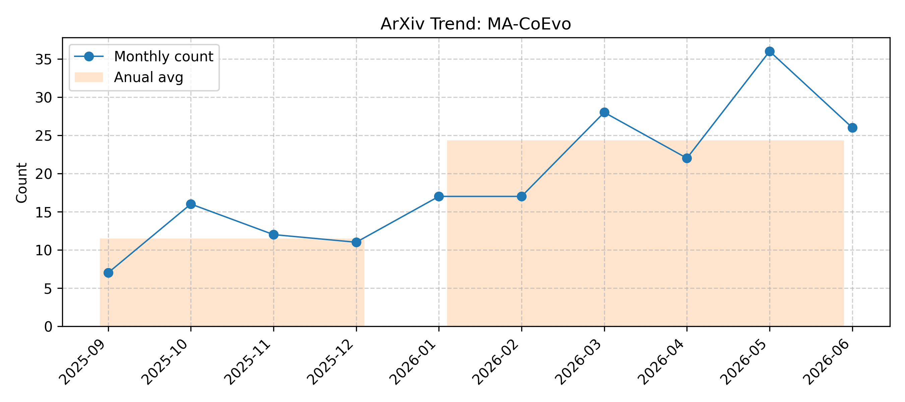

# MA-CoEvo

> Updated on 2026.06.17

[🔙 Back to Index](README.md)

| Date | Title | Categories | Abstract | PDF | Code |
|:---|:---|:---|:---|:---|:---|
|**2026-06-16**|**OPD-Evolver: Cultivating Holistic Agent Evolver via On-Policy Distillation**|cs.CL| 

Full Abstract
Memory has become a standard substrate for self-evolving agents, yet retaining experience is not the same as learning how to evolve through it. Existing memory agents can store trajectories, retrieve reflections, or accumulate skills, but often lack the holistic competence to select useful experience, act on it, write reusable knowledge, and maintain a growing repository. We introduce OPD-Evolver, a slow-fast co-evolution framework that cultivates such an agent evolver through on-policy self-distillation. In the fast loop, OPD-Evolver interacts with a four-level memory hierarchy to read, use, write, and maintain experience for rapid test-time evolution. In the slow loop, outcome-calibrated memory attribution and privileged hindsight distill these four abilities into the deployable policy. Across multi-domain benchmarks, OPD-Evolver surpasses memory systems such as ReasoningBank by up to 11.5%, and training-based methods such as Skill0 by ~5.8%. Further analysis shows that OPD-Evolver internalizes high-value experience and memory management, enabling OPD-Evolver-9B to challenge giant counterparts such as Qwen3.5-397B-A17B and Step-3.5-Flash, pointing beyond memory-augmented agents toward genuinely qualified agent evolvers.
|[2606.17628v1](http://arxiv.org/abs/2606.17628v1)| null|
|**2026-06-15**|**SkillWiki: A Living Knowledge Infrastructure for Agent Skills**|cs.CL| 

Full Abstract
While knowledge is managed through Wikipedia and software through GitHub, agent skills still lack an infrastructure for large-scale production, governance, and evolution. SkillWiki is a living knowledge infrastructure that supports the organization, grounding, and continuous evolution of agent skills by transforming heterogeneous knowledge into reusable skill assets linked to their originating evidence. Our demonstration presents the complete skill lifecycle, from knowledge ingestion and skill production to provenance-aware exploration, governance, and execution-driven evolution. SkillWiki highlights a future in which knowledge, skills, and execution experience co-evolve within a shared infrastructure. The live demonstration and source code are publicly available at https://github.com/Huangdingcheng/SkillWiki.
|[2606.16523v1](http://arxiv.org/abs/2606.16523v1)| null|
|**2026-06-15**|**daVinci-kernel: Co-Evolving Skill Selection, Summarization, and Utilization via RL for GPU Kernel Optimization**|cs.LG, cs.AI, cs.CL| 

Full Abstract
GPU kernel optimization represents a paradigm where functional correctness is assumed and execution efficiency is the objective. We present daVinci-kernel, a reinforcement learning framework that couples skill discovery with skill exploitation through a dynamically evolving skill library. daVinci-kernel jointly trains three agents sharing one LLM backbone: a Skill Selection Agent that retrieves relevant techniques via BM25 and LLM reranking, a Policy Agent that generates multi-turn CUDA/Triton kernels conditioned on selected skills, and a Skill Summary Agent that distills successful rollouts into reusable skills. Candidate skills are added only after execution-based verification confirms reproducible speedups. All three agents share a single LLM backbone, are initialized via a structured SFT cold start on diversity-filtered data, and are then jointly optimized end-to-end with multi-turn REINFORCE and per-agent advantage estimation. On KernelBench, daVinci-kernel-14B achieves 37.2%, 70.6%, and 32.2% on Level 1, Level 2, and Level 3 under the Fast$_1$ threshold, outperforming the strongest prior RL-trained model, Dr.Kernel-14B.
|[2606.16497v1](http://arxiv.org/abs/2606.16497v1)| null|
|**2026-06-13**|**APEX: Adaptive Principle EXtraction A Three-Layer Self-Evolution Framework for Production AI Agents**|cs.AI| 

Full Abstract
Self-improvement in AI agents has emerged as a key research frontier: systems that modify their own prompts, workflows, and decision rules based on accumulated operational experience. The state-of-the-art Self-Harness framework [1] achieves 14--21% improvement on Terminal-Bench-2.0 by mining failure clusters and patching the agent harness. However, Self-Harness optimises only one dimension -- the prompt harness -- leaving behavioural principles and workflow topology unchanged. We propose APEX (Adaptive Principle EXtraction), a three-layer co-evolution framework that simultaneously evolves: (L1) the harness via failure-mode patching, (L2) behavioural principles via success-trace distillation [2], and (L3) the agent workflow topology via structural fitness-based selection [6]. We implement APEX on Joe [13], a production-grade super AI Agent built on NVIDIA Nemotron and designed as an Edge AI Agent Factory for the NVIDIA Agent Challenge 2026, managing a 15-node compute fleet using 114 real task traces collected over 18 days. APEX achieves an APEX Health Score of 0.570 (+90% vs. baseline 0.300) in a single evolutionary run, distilling 6 novel reusable principles and selecting a research-first workflow topology scoring 0.900 (+20%). Our results demonstrate that multi-dimensional co-evolution substantially outperforms single-axis harness optimisation, at a cost of only 4 LLM calls (~270 s) on a local qwen2.5-coder:32b instance.
|[2606.15363v1](http://arxiv.org/abs/2606.15363v1)| null|
|**2026-06-12**|**Be My Tutor: On-Policy Co-Distillation for Mutual LLM Improvement via Peer Feedback**|cs.LG, cs.CL| 

Full Abstract
We study multi-domain LLM training in which two models, each stronger in a different domain, co-evolve by tutoring each other through on-policy feedback. Unlike one-way distillation or single-model fine-tuning, our goal is mutual Pareto improvement: each model improves across domains without losing its original strength. To this end, we propose On-Policy Co-Distillation (OPCoD), where each student's self-distillation is conditioned on its own correct rollout and feedback from its peer. To make feedback exchange effective, OPCoD uses cognizance-based gating to decide when to give feedback and feedback anchoring to ground feedback in the problem. On Science Q\&A tasks, OPCoD consistently outperforms baselines and achieves Pareto improvement across all evaluated domain pairs and students.
|[2606.14368v1](http://arxiv.org/abs/2606.14368v1)| null|
|**2026-06-15**|**Hybrid Open-Ended Tri-Evolution Makes Better Deep Researcher**|cs.AI, cs.LG| 

Full Abstract
Deep research and agent evolution serve as de-facto tasks for AI agents in real-world applications toward artificial general intelligence. The former enables autonomous retrieval and integration of information in open-ended environments to tackle open-ended research tasks, yet it is constrained by the static parametric deep research capabilities of agent systems. The latter allows agents to autonomously interact with the environment to gain experiences that evolve model capabilities. However, its effectiveness has been widely validated only on verifiable tasks with standard answers, leaving a gap with open-ended research tasks. To bridge these two critical tasks, we propose the Hybrid Open-Ended Tri-Evolution (HOTE) framework, which leverages hybrid-mode reinforcement learning to facilitate the collaborative evolution of a proposer, solver and judge based on web-scale knowledge, moving toward autonomous evolving agents in open-ended tasks and environments. Extensive experiments on three long-form deep research benchmarks demonstrate that the 8B model trained via HOTE surpasses the strongest static open 8-32B models as well as those trained by state-of-the-art deep research training methods with less time overhead, and further verify that the evolution of all three modules in HOTE is indispensable.
|[2606.13710v2](http://arxiv.org/abs/2606.13710v2)| null|
|**2026-06-10**|**Agentic Environment Engineering for Large Language Models: A Survey of Environment Modeling, Synthesis, Evaluation, and Application**|cs.CL, cs.AI| 

Full Abstract
Environments serve as interactive systems for large language model (LLM) based agents across diverse scenarios and play a crucial role in driving the continual evolution of model capabilities. Despite this importance, existing work lacks a systematic categorization and deep analysis. This paper systematically studies current researches on agentic environments from the perspective of the environment engineering lifecycle, covering their modeling, synthesis, evaluation and application. Specifically, the paper first introduces representative environments from the perspectives of eight attributes and eight domains, providing detailed analyses of their development paths and highlighting their core capabilities. Second, for automated environment synthesis, two paradigms are introduced, such as symbolic synthesis and neural synthesis. This paper also shows different environment evaluation methods in each paradigm. Thirdly, the corresponding environment applications from the perspective of agent-environment co-evolution are discussed. In specific, the paper characterizes the primary pathways for agent evolution in dynamic environments from four complementary perspectives: memory-centric experience evolution, orchestration-centric workflow evolution, trajectory-centric offline evolution, and exploration-centric online evolution. And three paradigms of environment evolution are identified, namely neural-driven, difficulty-driven, and scaling-driven approaches. At last, several promising future directions are discussed, including Environment-as-a-Service, Multi-agent Environments, and Neural-Symbolic Environments.
|[2606.12191v1](http://arxiv.org/abs/2606.12191v1)| null|
|**2026-06-09**|**EEVEE: Towards Test-time Prompt Learning in the Real World for Self-Improving Agents**|cs.LG, cs.AI| 

Full Abstract
In this paper, we propose EEVEE, the first multi-dataset test-time prompt learning framework for LLM agents, enabling test-time prompt learning under real-world task streams. Existing methods are largely designed for single-dataset settings, while real-world applications require models to handle heterogeneous input streams drawn from multiple datasets, domains, and task distributions, limiting their practical applicability. To mitigate cross-dataset interference, EEVEE introduces a router that partitions incoming inputs into task clusters and assigns them to suitable prompt configurations. This design is optimized via a router-prompt co-evolution strategy, which employs interleaved router and prompt learning phases to address their mutual dependency. Experiments across multiple datasets demonstrate that the framework improves robustness under heterogeneous data streams while maintaining single-benchmark learning capability and efficiency. Specifically, EEVEE improves average multi-benchmark scores by 10.38 and 24.32 points over Qwen3-4B-Instruct and DeepSeek-V3.2, surpassing SOTA methods GEPA and ACE by up to 37.2% and 48.2%.
|[2606.11182v1](http://arxiv.org/abs/2606.11182v1)| null|
|**2026-06-09**|**Role-Agent: Bootstrapping LLM Agents via Dual-Role Evolution**|cs.AI| 

Full Abstract
Although Large Language Model (LLM) agents have demonstrated strong performance on complex tasks, their learning is often limited by inefficient interaction feedback and static training environments, which hinder broader generalization. To address these limitations, this paper introduces Role-Agent, \textcolor{black}{a framework} that harnesses a single LLM to function concurrently as both the agent and the environment, enabling a bootstrapped co-evolution. Role-Agent comprises two synergistic components: World-In-Agent (WIA) and Agent-In-World (AIW). In WIA, the LLM acts as the agent and predicts future states after each action; the alignment between predicted and actual states is then used as a process reward, encouraging environment-aware reasoning. In AIW, the LLM analyzes failure modes from failed trajectories and retrieves tasks with similar failure patterns, thereby reshaping the training data distribution for targeted practice. Experiments on multiple benchmarks show that Role-Agent consistently improves performance, yielding an average gain of over 4\% over strong baselines.
|[2606.10917v1](http://arxiv.org/abs/2606.10917v1)| null|
|**2026-06-09**|**Effective Reinforcement Learning for Agentic Search by Recycling Zero-Variance Queries During Training**|cs.IR, cs.AI| 

Full Abstract
The use of GRPO-style algorithms has become the standard strategy for training LLM search agents under outcome-only rewards. With these algorithms, a query contributes to parameter updates only when its rollout group mixes successes and failures; all-correct (too-easy) and all-incorrect (too-hard) groups are zero-variance and waste rollout cost. Existing approaches treat zero-variance as a static property and either discard or pre-filter such groups. We hypothesize and empirically validate that queries flip between zero-variance and signal-bearing states as the policy evolves during training. Building on this intuition, we propose query recycling, which returns zero-variance groups to a mutable pool for future resampling, so that the effective training distribution co-evolves with the policy. With the proposed technique, a 1.7B parameter model trained on synthetic data can reach 66.0 average Pass@1 accross seven multi-hop QA benchmarks, matching or surpassing systems with up to 7B parameters trained on benchmark-derived supervision. Analysis of recycling patterns shows that recycled queries supply roughly three quarters of the effective batch by the end of training, with contributions split between recovery from policy improvement and policy drift.
|[2606.10709v1](http://arxiv.org/abs/2606.10709v1)| null|
|**2026-06-09**|**Beyond Static Evaluation: Co-Evolutionary Mechanisms for LLM-Driven Strategy Evolution in Adversarial Games**|cs.AI| 

Full Abstract
Recent advances in LLM-driven code evolution have enabled automated discovery by iteratively generating and improving programs. However, applying these methods to adversarial multi-agent games introduces a fundamental challenge: the evaluation landscape shifts as strategies improve, causing fixed evaluators to become unreliable and evolution to stagnate. We propose three mechanisms to address this challenge: evaluator co-evolution, which incorporates discovered champions into the opponent pool; hierarchical deep evaluation, which replaces noisy few-game scores with statistically reliable assessments; and weakness pressure, which dynamically up-weights the most difficult opponents to break through plateaus. We implement these mechanisms within FAMOU, a framework built upon the same foundation-model code-evolution paradigm as OpenEvolve and ShinkaEvolve. On the MCTF 2026 3v3 maritime capture-the-flag task, FAMOU consistently outperforms both baselines under two backbone LLMs, achieving the highest combined score (0.526) and the best generalization to unseen opponents (61.7% win rate), while ablations confirm that each mechanism contributes to performance. Notably, the LLM mutation process generates tactical structures entirely absent from the seed strategies -- including lookahead search and adaptive interception -- demonstrating that code-level evolution can produce nontrivial algorithmic innovations in adversarial settings. The FAMOU-evolved strategy further achieved 1st place in the hardware round-robin and 3rd in simulation at the AAMAS 2026 MCTF Competition, validating its real-world transferability. The optimized implementation and corresponding evaluation codes developed through our evolutionary process are available at: https://github.com/1xiangliu1/FAMOU-CoEvo
|[2606.10389v1](http://arxiv.org/abs/2606.10389v1)| null|
|**2026-06-07**|**Co-Evolving Skill Generation and Policy Optimization**|cs.CL| 

Full Abstract
Skill-augmented reinforcement learning improves language agents by storing reusable procedural knowledge acquired from past experience. Existing methods typically use strong language models to analyze trajectories, generate skills, and update a retrievable skill bank during online training. However, they rarely assess whether a newly generated skill is useful before it is stored and reused. We find that this assumption is unreliable: even skills generated by proprietary frontier LLMs exhibit highly mixed utility, with many providing little benefit or even degrading performance. Once such skills enter the bank, their effects are difficult to identify, because subsequent rollout feedback is delayed and usually reflects the combined effect of multiple retrieved skills rather than the marginal contribution of any individual skill. We propose an online reinforcement learning framework for pre-storage skill validation. The framework estimates whether a candidate skill contributes useful information beyond the skills already retrieved for the current task. It uses the standard rollout budget to form two matched groups under the same task and retrieval context: base rollouts conditioned on the currently retrieved skills, and skill-augmented rollouts conditioned on the same skills plus one candidate skill induced from the base trajectories. The reward gap between these two groups estimates the candidate skill's context-dependent marginal utility, enabling the framework to promote useful skills while filtering ineffective or harmful ones without additional rollout overhead. The framework further uses this marginal-utility signal to train the policy itself as a skill generator, reducing reliance on repeated calls to proprietary models. The learned skill-generation likelihood serves as a context-dependent score for retrieval-time reranking and outdated-skill pruning as the policy evolves.
|[2606.08755v1](http://arxiv.org/abs/2606.08755v1)| null|
|**2026-06-05**|**Self-evolving LLM agents with in-distribution Optimization**|cs.LG| 

Full Abstract
Large Language Models (LLMs) have recently emerged as powerful controllers for interactive agents in complex environments, yet training them to perform reliable long-horizon decision making remains a fundamental challenge. A key difficulty lies in credit assignment: agents often receive delayed rewards only at the end of episodes. In this paper, we propose Q-Evolve, a self-evolving framework for LLM agents that unifies automatic process-reward labeling and policy learning within a principled in-distribution reinforcement learning paradigm. In each evolving iteration, our method learns an in-distribution critic from a hybrid off-policy dataset that combines expert demonstrations with agent-generated trajectories, stabilizing Bellman backups in sparse-reward settings via a weighted Implicit Q-Learning objective. The learned value function is then used to derive step-wise process rewards through advantage estimation, enabling dense and reliable supervision without environment backtracking or human annotation. Leveraging these signals, we perform behavior-proximal policy optimization that evolves the agent over the data used for process reward labeling, allowing iterative self-improvement without exacerbating distribution shift. We evaluate our method on AlfWorld, WebShop, and ScienceWorld, showing Q-Evolve outperforms strong baselines in sample efficiency, robustness, and overall task performance. Our results demonstrate that stable agent self-evolution is achievable through the co-evolution of process-level supervision and policy, both grounded within a shared in-distribution learning loop.
|[2606.07367v1](http://arxiv.org/abs/2606.07367v1)| null|
|**2026-06-10**|**DataEvolver: Automatic Data Preparation for Large Language Models through Multi-Level Self-Evolving**|cs.DB, cs.AI| 

Full Abstract
High-quality training data is essential to large language models (LLMs) and typically requires extensive and costly manual curation. Existing automatic data preparation methods rely on predefined pipelines or customized human instructions, which limits their adaptability to diverse data distributions and lacks principled guidance from high-quality examples. In this paper, we introduce DataEvolver, the first self-evolving data preparation system that automatically constructs pipelines to transform raw data into high-quality data. DataEvolver employs a multi-level mechanism to ensure both pipeline executability and effectiveness. At the operator level, it incrementally expands the operator set to construct a logical plan while resolving dependency conflicts. At the pipeline level, it instantiates logical plans into executable code and iteratively refines pipeline orchestration through a feedback loop that reduces the distribution gap between prepared data and high-quality examples. Experiments on seven benchmarks show that DataEvolver substantially improves data quality and achieves an average 10\% gain in downstream LLM performance compared with training on original data, highlighting new opportunities for the iterative co-evolution of LLMs and data.
|[2606.07001v2](http://arxiv.org/abs/2606.07001v2)| null|
|**2026-06-04**|**CHASE: Adversarial Red-Blue Teaming for Improving LLM Safety using Reinforcement Learning**|cs.CL| 

Full Abstract
Despite advances in safety alignment, prompt-rewriting attacks such as persona modulation, fictional framing and persuasion-based reformulation, can bypass safety filters even on frontier models. Existing defenses either rely on non-scalable human curation or white-box optimisation that overfits to specific model internals, leaving aligned models brittle against the very class of adaptive black-box adversaries they will face in deployment. To address this gap, we introduce CHASE (Co-evolutionary Hardening through Adversarial Safety-Escalation), a closed-loop red-blue teaming framework in which a black-box attacker and a safety-aligned defender co-evolve. The attacker is trained via Group Relative Policy Optimization (GRPO) under a multiplicative reward that jointly enforces bypass effectiveness and intent fidelity, while the defender is hardened on the harvested adversarial rewrites through a two-stage GRPO + rejection-sampled SFT pipeline balanced with benign data. Evaluated on BeaverTails and JailbreakBench against five held-out attack families (PAIR, TAP, AutoDAN, PAP, Translation), CHASE cuts mean StrongREJECT score by 43.2\% with 0\% false-refusal on benign prompts. Beyond the headline result, CHASE shows that template-free RL exploration recovers latent attack primitives that transfer across mechanistically distinct attack families, suggesting a path toward LLM safety hardening that generalises beyond the narrow distributions achieved thus far in adversarial training.
|[2606.05523v1](http://arxiv.org/abs/2606.05523v1)| null|
|**2026-06-03**|**Learning While Acting: A Skill-Enhanced Test-Time Co-Evolution Framework for Online Lifelong Learning Agents**|cs.LG, cs.AI| 

Full Abstract
Lifelong learning is essential for Large Language Model (LLM) agents operating in dynamic, interactive environments. However, existing lifelong learning agents for long-horizon tasks typically depend on discrete skill or past experiences retrieval with static parameters during inference, which prevents them from continuously internalizing test-time feedback like human learners. To bridge this gap, we propose Skill-enhanced Test-Time Co-Evolution (\texttt{LifeSkill}), a two-stage reinforcement learning framework for Online Lifelong Learning Agents. Specifically, we design Verifier-Guided Skill Learning that addresses the lack of direct supervision for skill extraction by rewarding candidate skills according to the average verifier success of multiple skill-conditioned policy rollouts, encouraging the model to generate skills that are useful for solving tasks rather than merely plausible in text. Furthermore, we introduce Online Skill Internalization, which continuously improves the policy model during test-time interaction by transforming skill-conditioned trajectories into reward signals. This enables the agent to directly internalize reasoning capabilities into its parameters, avoiding the context bloat of experience retrieval. Experiments on LifelongAgentBench show that LifeSkill improves average performance by 7 absolute points by comparing with existing lifelong agent baselines.
|[2606.04815v1](http://arxiv.org/abs/2606.04815v1)| null|
|**2026-06-03**|**Self-Evolving Deep Research via Joint Generation and Evaluation**|cs.CL, cs.AI| 

Full Abstract
Large Language Models (LLMs) have become increasingly adopted in daily applications, with deep research standing out as a particularly important capability. Unlike traditional question-answering (QA) tasks, deep research report generation lacks definitive ground-truth, making reward design inherently unverifiable and limiting effective reinforcement learning. Existing approaches mitigate this challenge with LLM-as-a-judge and query-dependent evaluation rubrics, but they still rely on static evaluators that cannot adapt their standards as the solver improves, leading to insufficient and eventually saturated optimization pressure. We address this limitation with a \textbf{s}elf-evolving \textbf{co}-evolutionary training framework for deep \textbf{re}search evaluation and generation (SCORE), which tightly couples an evaluator and a solver in a shared-parameter learning process. Rather than treating generation and evaluation as isolated modules, we leverage their intrinsic connection to enable joint improvement within a single shared-parameter model. To restrict this process, we introduce a meta-harness, which dynamically controls the evaluation environment based on solver performance, encouraging valid evaluation dimensions and sufficiently deep evaluator search. Extensive experiments on deep research benchmarks demonstrate consistent improvement in report generation quality, showing that co-evolving evaluation and generation is a promising direction for training open-ended research agents.
|[2606.04507v1](http://arxiv.org/abs/2606.04507v1)| null|
|**2026-06-02**|**SAGE: A Quantitative Evaluation of Socialized Evolution in Agent Ecosystems**|cs.AI, cs.CL| 

Full Abstract
Self-improving language agents are typically evaluated in isolation: an agent attempts a task, receives feedback, and iteratively refines its own behavior. Yet agents increasingly operate alongside peers whose strategies and outcomes are publicly visible. This raises an under-studied question: when does shared experience produce improvements that self-improvement alone cannot achieve? We introduce SAGE (Social Agent Group Evolution),an evaluation framework that compares two compute-matched conditions: SocialEvo, where agents from five distinct model families co-evolve with access to all peers' histories; and SelfEvo, where each agent receives the same number of task attempts but sees only its own past, which is conventional in self-improving agent studies. We instantiate SAGE in three arenas: open-ended ML research, long-horizon economic planning, and strategic multiplayer play, evaluated across multiple evolutionary rounds. We find that group history is not a universal amplifier: the strongest agent does not exceed its self-evolution ceiling. However, agents that plateau under self-improvement can achieve significant breakthroughs when peer experience is available. In competitive settings, counterfactual controls reveal that agents improve generally rather than developing opponent-specific strategies. Across different forms of shared history, filtered peer traces and reflective summaries often outperform raw logs, indicating that social gains depend on abstraction rather than exposure volume. These findings reveal that peer-history gains are agent-specific, arena-dependent, and contingent on the capacity to abstract transferable knowledge from public traces.
|[2606.03544v1](http://arxiv.org/abs/2606.03544v1)| null|
|**2026-06-02**|**Think-Before-Speak: From Internal Evaluation to Public Expression in Multi-Agent Social Simulation**|cs.AI| 

Full Abstract
LLM-based multi-agent simulation offers a promising way to study social interaction, deliberation, and collective opinion dynamics. However, many existing dialogue simulation frameworks represent interaction mainly as observable turn exchange or aggregated outputs, leaving the internal evaluative processes behind silence, speaking intention, and public expression difficult to examine. We introduce TBS (Think-Before-Speak), an interval-based multi-agent simulation framework that separates agents' private reasoning from public utterance generation. At each interval, all agents update structured internal states based on the shared dialogue history and their own memory. These states include dissonance-related appraisal, perceived opinion climate, perceived isolation risk, response strategy, and willingness to speak. The orchestrator then resolves competing speaking intentions and commits one utterance to the public dialogue, allowing internal evaluation and public interaction to co-evolve over time.   We evaluate TBS in simulated town hall discussions on a climate-related policy issue. Results show that TBS produces coherent internal-state traces and that these traces vary systematically across turn-allocation, silence, and memory conditions. Dissonance-related appraisal increases agents' willingness to speak, whereas silence-pressure appraisal decreases it. Once speaking intention is formed, public expression is shaped mainly by turn-allocation rules. These findings suggest that TBS supports mechanism-sensitive social simulation by making the pathway from internal evaluation to public expression observable and analyzable.
|[2606.03137v1](http://arxiv.org/abs/2606.03137v1)| null|
|**2026-06-12**|**EvoTrainer: Co-Evolving LLM Policies and Training Harnesses for Autonomous Agentic Reinforcement Learning**|cs.AI| 

Full Abstract
Autonomous LLM training is often framed as recipe search, which leaves the training harness largely static. This limitation sharpens in agentic RL, where shifting bottlenecks and scalar rewards mask diverse failure modes. We introduce EvoTrainer, an autonomous training framework that co-evolves LLM policies and training-side harnesses through empirical feedback: it diagnoses rollout-level evidence, revises diagnostics, backtests interventions, and accumulates reusable skills. Evaluated on mathematical reasoning, competitive-programming code generation, and repository-level software engineering, EvoTrainer matches or exceeds the human-engineered RL references under the same data, codebase, and evaluation protocol, with the largest gain on long-horizon agentic SWE. Trajectory analyses show that retained strategies diverge across domains, evolving diagnostics prevent invalid high-scoring branches from being promoted, and reusable skills shape later search. Autonomous LLM RL should move beyond recipe search toward joint evolution of policies and the training harnesses that interpret them.
|[2606.03108v2](http://arxiv.org/abs/2606.03108v2)| null|
|**2026-06-01**|**COMAP: Co-Evolving World Models and Agent Policies for LLM Agents**|cs.AI, cs.CL| 

Full Abstract
Equipping language agents with world models enables them to anticipate environment dynamics and evaluate candidate actions before execution. However, existing textual world models are typically fixed after training, preventing them from adapting to the on-policy state-action distributions induced by an evolving agent. Meanwhile, agent-improvement methods often rely on external rewards or verifiers, limiting their applicability in realistic interactive environments. In this paper, we propose COMAP, a novel framework that co-evolves textual world models and agent policies through closed-loop interaction. At each decision step, the world model predicts future state feedback for candidate actions, and the agent performs future-aware reflection by estimating the reliability of this feedback and refining its action accordingly. The resulting on-policy trajectories are then used to update the world model via self-distillation, allowing it to better match the agent's evolving interaction distribution. Across embodied task planning, Web navigation, and tool-use benchmarks, COMAP consistently outperforms competitive baselines, e.g., +16.75% relative improvement with Qwen3-4B. Further analyses show that the co-evolutionary loop improves the world model's prediction accuracy over time and leads to more effective long-horizon decision-making. Our code is available at: https://github.com/loyiv/CoMAP.
|[2606.02372v1](http://arxiv.org/abs/2606.02372v1)| null|
|**2026-06-01**|**HarnessForge: Joint Harness and Policy Evolution for Adaptive Agent Systems**|cs.CL| 

Full Abstract
LLM agents are increasingly expected to operate across heterogeneous task regimes that require distinct execution paradigms. This challenges fixed agent systems and motivates system-level meta-adaptation beyond isolated component updates. While existing works have adapted external harness or trained underlying reasoning policies, full-system adaptation remains insufficiently characterized. The adaptation space between structure and execution is rarely made explicit, and the compatibility between the external harness and the internal reasoner is not optimized jointly. We propose HarnessForge, a meta-adaptive framework for evolving LLM agent systems. HarnessForge formulates an agent system as a harness--policy pair, defining a stable adaptation space that separates harness-level execution structure from policy-level reasoning behavior. It then performs harness--policy co-evolution through fault-guided harness tailoring and harness-conditioned policy alignment. Experiments across five benchmarks from diverse domains show that HarnessForge consistently improves both Qwen3-4B and Qwen3-8B backbones, outperforming harness-only and policy-only baselines with gains of up to 12.0\% over the strongest baseline and achieving favorable rollout-efficiency tradeoffs, demonstrating that harness--policy co-evolution is effective, and that executable compatibility between the harness and reasoning policy is essential for agent-system adaptation. The code is available at https://github.com/mingju-c/HarnessForge.
|[2606.01779v1](http://arxiv.org/abs/2606.01779v1)| null|
|**2026-06-08**|**ReSkill: Reconciling Skill Creation with Policy Optimization in Agentic RL**|cs.AI, cs.LG, stat.ML| 

Full Abstract
Agentic reinforcement learning (RL) enables LLM agents to improve continuously from environment rewards, yet the resulting policies do not systematically accumulate reusable strategies that generalize across tasks. Modular skills can provide such reusable strategies, yet existing skill-augmented RL methods decouple skill creation from policy optimization, risking adopting skills that conflict with the evolving policy. Inspired by Anthropic's Skill Creator, we introduce ReSkill, an RL-in-the-loop skill creation framework that reconciles skill evolution with policy learning. ReSkill exploits the group-wise structure of GRPO to naturally embed three mechanisms with only marginal additional overhead: (1) an assertion-driven skill creator that diagnoses failures from past experience and proposes conditional, trigger-based skill revisions; (2) within-group rollout sampling that enables controlled comparison of skill versions, capturing which version best supports the policy's ongoing learning; and (3) Thompson Sampling with adaptive discounting to balance exploration and exploitation in skill version selection as the policy evolves. Across several domains, ReSkill consistently outperforms existing memory and skill-based RL methods, with the largest gains on unseen tasks. Analysis of the skill lifecycle shows skills being automatically created, tested, refined, and pruned as the policy improves, demonstrating reconciled skill-policy co-evolution.
|[2606.01619v2](http://arxiv.org/abs/2606.01619v2)| null|
|**2026-05-31**|**SkillSmith: Co-Evolving Skills and Tools for Self-Improving Agent Systems**|cs.AI| 

Full Abstract
Recent self-evolving agents have shown that skills can be discovered, refined, and accumulated through execution. However, existing skill-evolution frameworks typically assume a fixed tool layer and evaluate each skill independently, limiting their ability to repair tool-level failures or reason about interactions among skills. We propose SkillSmith, a synergy-aware skill-tool co-evolution framework. SkillSmith introduces a unified proposal space in which reflection produces atomic bundles that jointly modify skills and tools, allowing tools to be wrapped, edited, composed, split, or retired when skill evolution identifies a reusable capability gap. To guide this joint search, SkillSmith maintains an ecological utility model inspired by Lotka-Volterra dynamics, where an interaction matrix estimated from execution traces captures pairwise complementarity and conflict among skills and provides pressure signals for retrieval, mutation prioritization, and retirement. Furthermore, SkillSmith records anti-patterns, including failure signatures, causal attributions, and remedies, to accelerate diagnosis and veto proposals that repeat known mistakes. Experiments on three benchmarks, including WildClawBench, and five Qwen3.5 model scales show that SkillSmith consistently outperforms strong baselines, with gains that amplify as task complexity and multi-skill co-activation increase.
|[2606.01314v1](http://arxiv.org/abs/2606.01314v1)| null|
|**2026-05-31**|**ASE-26: a curriculum for agentic software engineering as a discipline**|cs.CY, cs.AI, cs.SE| 

Full Abstract
The work of a professional software engineer has begun to consist, increasingly, of directing agents rather than writing code, and the empirical evidence for the shift is now several years deep. Anthropic's Economic Index puts automation at 79 per cent of Claude Code interactions [2]; Handa and colleagues at Anthropic find AI exposure for Computer Programmer tasks at approximately 75 per cent of the role's distinct activities [3]; Brynjolfsson and colleagues at Stanford's Digital Economy Lab report a 13 per cent relative decline in employment for workers aged 22 to 25 in occupations most exposed to AI [4]. The shift is also unfinished, and the academic literature on agentic software engineering converges on the finding that the missing capability is not better models but structured practitioner discipline. This paper presents ASE-26, a comprehensive undergraduate curriculum for agentic software engineering as a discipline, deposited as a citable reference on Zenodo under CC BY-ND 4.0 [12]. The paper sets out the discipline framing the curriculum rests on, the conceptual contributions it makes (most importantly, the evolutionary spiral as the operational form of the co-evolution of intent and build), the twenty-one-module structure that organises the discipline for teaching, the pedagogical commitments that follow from grading work co-produced with an agent, what graduates leave with, and how the discipline as taught is designed to outlast the specific capabilities of today's models. The position the paper takes is that the practitioner skills the industry currently lacks are precisely the skills the discipline names, and that structured undergraduate curricula in agentic software engineering are the principal mechanism by which the gap closes.
|[2606.01152v1](http://arxiv.org/abs/2606.01152v1)| null|
|**2026-05-30**|**LLM-Driven Co-Evolutionary Automated Heuristic Design for Bi-Component Coupled Combinatorial Optimization**|cs.AI, math.OC| 

Full Abstract
While Large Language Models (LLMs) have recently shown promise in Automated Heuristic Design (AHD), existing methods typically generate and evolve heuristics as a single operator or search strategy, limiting their ability to model strong coupling among multiple decision substructures in problems such as the Traveling Thief Problem (TTP) and the Traveling Purchaser Problem (TPP). In this work, we propose CoEvo-AHD, an LLM-driven dual-population co-evolutionary framework for automated heuristic design in coupled combinatorial optimization. Unlike prior methods that evolve individual heuristics in isolation, CoEvo-AHD leverages LLMs to co-evolve two closely related operator populations. A cooperative evaluation mechanism explicitly captures interactions between route and selection operators, while pairwise scoring and synergistic joint crossover help discover complementary operator logic for joint improvement across coupled decision subspaces. We further design a tool-invocation environment library that encapsulates frequently used core operations, such as local-search delta computation, into callable functions, enabling LLM-generated operators to use standardized interfaces instead of reimplementing inefficient and error-prone problem-specific loops. Experiments on TTP and TPP show that CoEvo-AHD automatically discovers cooperative heuristic combinations and achieves competitive solution quality against traditional heuristics.
|[2606.00718v1](http://arxiv.org/abs/2606.00718v1)| null|
|**2026-05-29**|**EvoDefense: Co-Evolving Black-Box Defense with Large Language Models**|cs.CR, cs.CL| 

Full Abstract
Large Language Models (LLMs) remain highly vulnerable to diverse attacks, particularly in black-box settings where the internals of target models are inaccessible. Existing black-box defenses typically rely on pre-defined filtering heuristics, which often fail to generalize to unseen attack types and target model architectures. We introduce EvoDefense, an experience-guided co-evolving black-box defense paradigm. EvoDefense employs a guard LLM to detect malicious queries and an experience memory module to accumulate defense knowledge from previous interactions. At the core of EvoDefense is a continuous attack-defense evolution loop, where an attack generator and the guard model iteratively refine their attack strategies and defense policies through experience-guided optimization. This design enables EvoDefense to generalize across unseen attacks and target models without retraining. Experiments on HarmBench, AdvBench, and AlpacaEval show that EvoDefense achieves consistently strong defense performance across seven popular models and five representative LLM attacks, while preserving competitive general capabilities. On HarmBench, EvoDefense reduces the attack success rate (ASR) of AutoDAN-turbo on Gemini-3-flash and LLaMA-3-8B-Instruct from 29.4% and 43.4% to 8.4% and 6.2%, respectively.
|[2605.31140v1](http://arxiv.org/abs/2605.31140v1)| null|
|**2026-05-28**|**CoHyDE: Iterative Co-Training of LLM Rewriter & Dense Encoder for Tool Retrieval**|cs.AI, cs.IR, cs.LG| 

Full Abstract
Tool retrieval over large API catalogs is a core bottleneck for LLM agents: user queries arrive in colloquial, often underspecified language, while the catalog uses technical API vocabulary that no fixed encoder can bridge on its own. The two dominant training approaches, contrastive encoder fine-tuning and HyDE-style query expansion with a frozen LLM, address this problem from opposite ends and fail in complementary directions: the fine-tuned encoder excels when the query's surface form already matches the catalog but collapses when it does not, while zero-shot HyDE is more robust to underspecified queries yet generates catalog-unaware hypothetical descriptions that degrade retrieval when queries are well-formed. We introduce CoHyDE, an iterative procedure that trains the dense encoder and the LLM rewriter as a single co-evolving system: the encoder is retrained with InfoNCE on catalog-style hypothetical descriptions produced by the rewriter, and the rewriter is preference-aligned via DPO against the encoder's retrieval scores, with both sides warm-started on the tool catalog before the loop begins. On a ~10k tool subset of the ToolBench catalog, three rounds of CoHyDE improve over the strongest single-component baseline by +2.5 pp NDCG@5 on standard queries and +6.3 pp on held-out vague queries, with gains as large as +8 pp on the hardest vague tier. Ablations confirm that co-training is the key ingredient: using either component in isolation fails to match CoHyDE on both well-formed and vague queries, with losses of up to -8 pp on vague queries.
|[2605.29271v1](http://arxiv.org/abs/2605.29271v1)| null|
|**2026-05-27**|**TCP-MCP: Landscape-Guided Co-Evolution of Prompts and Communication Topologies for Multi-Agent Systems**|cs.AI| 

Full Abstract
Effective multi-agent systems cannot be designed by selecting prompts or communication graphs in isolation. Agent behavior depends on the information an agent receives, while the usefulness of a communication edge depends on how the receiving agent interprets and uses that information. We propose \textbf{TCP-MCP} (Topology-Coupled Prompting for Multi-Agent Collaborative Problem-Solving), a co-evolution framework that searches agent prompts and communication topologies as a unified genome. TCP-MCP uses an initialization-time landscape probe to calibrate early search behavior, and then relies on Pareto-front diagnostics to adapt exploration under three objectives: task performance, token cost, and structural complexity. Using the same DeepSeek-V3.2 backbone across all methods, TCP-MCP achieves 82.66\%, 89.96\%, and 96.61\% accuracy on MMLU-Pro, MMLU, and GSM8K, respectively. Across the three benchmarks, it consistently outperforms automated graph-generation baselines and achieves competitive accuracy relative to debate-style systems, while using up to 5.69$\times$ fewer tokens than those systems at the reported operating points. These results show that jointly evolving prompts and communication structure provides a practical route to cost-aware and task-adaptive multi-agent system design in controlled evaluations.
|[2605.27850v1](http://arxiv.org/abs/2605.27850v1)| null|
|**2026-05-26**|**Evolving and Detecting Multi-Turn Deception using Geometric Signatures**|stat.ML, cs.LG| 

Full Abstract
Safety defenses for large language models (LLMs) are typically trained and evaluated on single-turn prompts, yet real attacks often unfold as indirect, multi-turn probing. To defend against this more nuanced form of deception, we present a unified pipeline that generates realistic multi-turn deceptive question sets via multi-objective genetic prompt optimization with co-evolving mutation operators. We validate this dataset through a human study, which also revealed that early generations yielded the most convincing deception and practical constraints such as adherence filtering and ordering effects. Using this data, we were able to detect deceptive attempts to access prohibited information using simple, explainable geometric signals in embedding space coupled with a lightweight feed-forward classifier. Three geometric features (angular coverage, distance ratio, and linearity) augmented with pairwise similarity statistics led to a compact predictive model that achieved consistently high recall (0.89) across base, reworded, and truncated (three-turn) scenarios, with test-time F1 ranging from 0.74-0.86. The results support a central hypothesis that multi-turn deceptive intent leaves a stable geometric footprint that enables lightweight, transparent screening without expensive end-to-end training. We further discuss responsible uses, limitations, and paths toward larger, more diverse human-evaluated datasets. The primary contribution to artificial intelligence is the multi-objective evolutionary framework for prompt generation, and the engineering application is the deployment of a lightweight geometric detection system for LLM safety infrastructure.
|[2605.27671v1](http://arxiv.org/abs/2605.27671v1)| null|
|**2026-05-26**|**FAB-Bench: A Framework for Adaptive RAG Benchmarking in Semiconductor Manufacturing**|cs.CL, cs.IR| 

Full Abstract
Retrieval-Augmented Generation (RAG) has become critical for knowledge-intensive applications, yet evaluating its performance in vertical domains remains difficult due to domain complexity, diverse context scales, and heavy reliance on expert assessments that are costly, inconsistent, and non-scalable. We introduce FAB-Bench, an end-to-end framework for adaptive benchmarking of RAG systems in semiconductor manufacturing. FAB-Bench defines six diagnostic metrics measuring factual accuracy, contextual utilization, completeness, retrieval relevance, technical depth, and reasoning consistency. The framework couples retriever diagnostics with generator-level reasoning analysis across context windows of 4K-32K tokens, quantifying how retrieval precision and generative fidelity co-evolve as contextual scope expands. From over 1,300 generated candidates, we curated a high-quality benchmark of 200 query-answer pairs spanning three synthesis strategies: needle-in-haystack, intra-document multi-topic, and cross-document multi-hop. Systematic evaluation across four LLMs and four RAG frameworks reveals three distinct context-scaling behaviors: logarithmic growth, early saturation, and cold-start dynamics, and identifies attention dilution as the primary mechanism behind performance degradation at extreme context lengths. Cross-framework validation on three additional production RAG systems confirms evaluation portability.
|[2605.26476v1](http://arxiv.org/abs/2605.26476v1)| null|
|**2026-05-26**|**Constitutional Arms Races in the Public Goods Game: Co-Evolving LLM Constitutions Under Cooperation-Defection Pressure**|cs.MA, cs.GT, cs.NE| 

Full Abstract
Frontier LLM agents engage in blackmail, sabotage, and document leaks under goal conflicts in agentic settings, exposing limitations of alignment methods built around single-agent or cooperative assumptions. Recent work shows LLM-guided evolutionary search can discover effective cooperative constitutions, but two properties of the adversarial setting remain uncharacterized: whether the fitness function actually induces adversarial pressure, and whether the LLM mutation operator behaves reliably under adversarial-specialist objectives. We study adversarial constitutional co-evolution (Blue cooperators vs. Red free-riders, 30 generations) across a Public Goods Game (PGG) and a spatial grid-world. Three findings: (1) in the PGG, both factions converge to a near-parity equilibrium at S approximately 0.78, robust across tested multipliers m in {1.2, 1.5, 2.0, 3.0}; (2) in independently scored environments, per-faction scoring leaves outcomes statistically uncoupled, with corr(S_B, S_R) = +0.088, and produces no adversarial pressure; a score-advantage fitness target S_own - S_opp restores it; (3) under pure-adversary fitness, evaluation seed count K controls mode regression: K = 2 regresses, while K = 5 sustains a strong specialist for all 30 generations. Adversarial co-evolution of natural-language constitutions is feasible, but only under coupled fitness and adequate evaluation budget; the evolved Red constitutions serve as interpretable red-team artifacts for testing future cooperative designs.
|[2605.26448v1](http://arxiv.org/abs/2605.26448v1)| null|
|**2026-05-23**|**SEAL: Synergistic Co-Evolution of Agents and Learning Environments**|cs.CL| 

Full Abstract
Large Language Model (LLM) agents are increasingly improved through interaction, yet most self-evolution methods adapt either the policy or the learning environment in isolation. We identify this structural gap as \emph{Agent-Environment Misalignment}: the agent's capability frontier changes during training, while the environment that provides supervision remains static or only weakly coupled to the agent's revealed failures. We propose SEAL, a closed-loop co-evolution framework for interactive tool-use agents. SEAL collects on-policy trajectories under executable verification, diagnoses failed rollouts into turn-level failure labels, and uses these diagnoses as a shared signal for both environment-side adaptation and model-side policy optimization. The environment evolves its training-time learning interface by exposing clearer tool affordance cues, constraint information, and recovery-oriented feedback, while the policy is updated with diagnosis-guided advantage reweighting. Extensive experiments across in-distribution and out-of-distribution multi-turn tool-use evaluations show that SEAL improves low-resource agent learning: with only 400 training samples, it yields +8.25 to +26.25 average-point gains across three backbones and exhibits positive out-of-distribution transfer. These results demonstrate the value of jointly adapting the learner and its training-time learning substrate for robust self-improving LLM agents.
|[2605.24426v1](http://arxiv.org/abs/2605.24426v1)| null|
|**2026-05-25**|**CoSPlay: Cooperative Self-Play at Test-Time with Self-Generated Code and Unit Test**|cs.LG, cs.AI, cs.CL| 

Full Abstract
Recently, Reinforcement Learning with Verifiable Rewards (RLVR) and Test-Time Scaling (TTS) have advanced LLM code generation through executable verification. Yet Ground-Truth Unit Tests (GT UTs) remain a bottleneck: SOTA RLVR methods require them for costly training, while existing TTS methods lose competitiveness without them. This motivates GT-free TTS, where existing methods directly use self-generated UTs to refine and select code candidates. Yet such UTs are often noisy or spuriously coupled with wrong code, and UT quality in turn cannot be validated without reliable code. The key challenge is therefore to jointly improve both. To this end, we present CoSPlay, a GT-free, training-free framework that jointly improves codes and UTs through cooperative self-play. It first explores diverse solution ideas and identifies their potential failure modes to produce discriminative UT ideas. It then uses bidirectional pass-count signals from the Code-UT execution matrix to iteratively prune or fix weak codes and refresh or replace unreliable UTs, letting the two pools co-evolve. Finally, when multiple codes remain tied at the highest pass count, it picks the final code from the largest output-consensus cluster, since correct codes agree on the same inputs while wrong codes diverge. Experiments on four challenging benchmarks show that CoSPlay on Qwen2.5-7B-Instruct improves average BoN from 22.1% to 33.2% and UT accuracy from 14.6% to 78.3%, matching or surpassing the RLVR model CURE-7B. When applied to CURE-7B, it further improves BoN by 5.7%. CoSPlay also generalizes across diverse backbones and outperforms GT-free TTS baselines under comparable token budgets, with continued gains as the budget scales up. These results suggest a scalable inference strategy for competitive code generation without any GT data.
|[2605.23491v2](http://arxiv.org/abs/2605.23491v2)| null|
|**2026-05-20**|**Leveraging LLMs for Grammar Adaptation: A Study on Metamodel-Grammar Co-Evolution**|cs.CL, cs.SE| 

Full Abstract
In model-driven engineering, metamodel evolution leads to the need to adapt corresponding grammars to maintain consistency, which typically requires tedious manual work. Existing rule-based methods can achieve partial automation but have limitations when handling complex grammar scenarios. This paper proposes a Large Language Model-based approach that automatically applies adaptations to new grammars after evolution by learning grammar adaptations from previous versions. We evaluated this approach on six real-world Xtext domain-specific languages, using four DSLs as a training set to develop prompting strategies, two DSLs as a test set for validation, and conducting a longitudinal case study on QVTo. The evaluation used three Large Language Models (Claude Sonnet 4.5, ChatGPT 5.1, Gemini 3) and measured grammar adaptation quality from three dimensions: grammar rule-level adaptation consistency, output similarity, and metamodel conformance. Results show that on the test set, all three LLMs achieved 100% adaptation consistency and output similarity, while the rule-based approach achieved only 84.21% on DOT and 62.50% on Xcore. In the QVTo longitudinal study, the LLM-based approach successfully reused learned adaptations across all three evolution steps without manual grammar editing, while the rule-based approach required manual adjustments in two of three transitions. However, on large-scale grammars (EAST-ADL, 297 rules), LLMs' adaptation consistency was far below 90%. This study demonstrates the advantages of LLM-based approaches in handling complex grammar scenarios, while revealing their limitations in large-scale grammar adaptation.
|[2605.21465v1](http://arxiv.org/abs/2605.21465v1)| null|
|**2026-05-16**|**D$^2$Evo: Dual Difficulty-Aware Self-Evolution for Data-Efficient Reinforcement Learning**|cs.LG, cs.AI, cs.CL| 

Full Abstract
Reinforcement learning (RL) has demonstrated potential for enhancing reasoning in large language models (LLMs). However, effective RL training, which requires medium-difficulty training samples, faces two fundamental challenges: Effective Data Scarcity and Dynamic Difficulty Shifts, where medium-difficulty samples are scarce and become trivial as models improve. Existing methods mitigate this scarcity to some extent by generating training samples. However, these approaches suffer from anchor-free generation, ignoring co-evolution, and difficulty mismatch. To address these issues, we propose D$^2$Evo, a Dual Difficulty-aware self-Evolution RL framework. In each iteration, our method mines medium-difficulty anchors based on the current Solver's capability, trains the Questioner to generate diverse questions at appropriate difficulty levels, and jointly optimizes both components to enable progressive reasoning gains. Extensive experiments demonstrate that D$^2$Evo outperforms existing methods on mathematical reasoning benchmarks with fewer than 2K real mathematical samples, and exhibits strong generalization on general reasoning benchmarks.
|[2605.17037v1](http://arxiv.org/abs/2605.17037v1)| null|
|**2026-05-16**|**PopuLoRA: Co-Evolving LLM Populations for Reasoning Self-Play**|cs.AI| 

Full Abstract
We introduce PopuLoRA, a population-based asymmetric self-play framework for reinforcement learning with verifiable rewards (RLVR) post-training of LLMs. Teachers and students are specialised LoRA adapters on a shared frozen base: teachers propose problems, matched students solve them under a programmatic verifier, and cross-evaluation between sub-populations replaces the self-calibration that limits single-agent self-play. A family of LoRA weight-space evolution operators (mutations and crossovers that produce same-rank population members in seconds) serves as the replacement step of a population-based training loop at 7B scale. We instantiate PopuLoRA on top of Absolute Zero Reasoner and compare it against a per-adapter compute-matched single-agent baseline. Where the single agent self-calibrates to generating easy problems it can reliably solve, the population enters a co-evolutionary arms race: teachers produce increasingly complex problems, student solve rates oscillate, and problem-space coverage keeps expanding throughout training. Despite lower training-time reward, the population mean outperforms the baseline on three code benchmarks (HumanEval+, MBPP+, LiveCodeBench) and seven math benchmarks (AIME 24/25, AMC 23, MATH-500, Minerva, GSM8K, OlympiadBench), and even the weakest member of the population beats the baseline on aggregate.
|[2605.16727v1](http://arxiv.org/abs/2605.16727v1)| null|
|**2026-05-15**|**General-Purpose Co-Evolutionary Construction of Parallel Algorithm Portfolios for Multi-Objective Binary Optimization**|cs.NE| 

Full Abstract
Despite recent progress in constructing generalizable parallel algorithm portfolios (PAPs), no general-purpose approach is yet available for multi-objective binary optimization problems (MOBOPs). To fill this gap, this paper proposes domain-agnostic co-evolution of parameterized search for multi-objective binary optimization~(DACMO), which features two technical innovations. First, we propose a neural instance representation architecture that decouples domain-invariant and instance-specific features, enabling class-consistent instance generation across varying dimensions without problem-specific instance generators. Second, we introduce LLM-based automatic search operator generation into PAP construction, extending the search space from parameter tuning of predefined templates to operator-level algorithm design. We evaluate DACMO on four representative MOBOP classes to demonstrate its effectiveness as a general-purpose PAP construction method: the multi-objective match max problem~(MMMP), the multi-objective knapsack problem~(MKP), the multi-objective contamination control problem (MCCP), and the multi-objective complementary influence maximization problem~(MCIMP). Experimental results show that DACMO can be directly applied to all four problem classes without modification, outperforms PAPs built from classic MOEA templates, and achieves performance comparable to a privileged state-of-the-art baseline that relies on manually designed problem-specific instance generators, while outperforming it on two of the four evaluated problem classes.
|[2605.15729v1](http://arxiv.org/abs/2605.15729v1)| null|
|**2026-05-15**|**Contexting as Recommendation: Evolutionary Collaborative Filtering for Context Engineering**|cs.CL| 

Full Abstract
Large Language Models (LLMs) are highly sensitive to their input contexts, motivating the development of automated context engineering. However, existing methods predominantly treat this as a global search problem, seeking a single context strategy that maximizes average performance across a dataset. This restrictive assumption overlooks the fact that different inputs often require distinct guidance, leaving substantial instance-level performance gains untapped. In this paper, we propose a paradigm shift by formulating context engineering as a recommendation problem. We introduce \textbf{Neural Collaborative Context Engineering (NCCE)}, a framework that transitions optimization from a static global search to dynamic, instance-wise routing. NCCE first bootstraps a diverse catalog of anchor contexts and then employs a novel \textbf{Context-CF Co-Evolution} mechanism. This stage establishes a synergistic feedback loop: a lightweight Neural Collaborative Filtering (NCF) model learns instance-context preferences to guide the generation of specialized context variants, while the newly evaluated contexts continuously refine the NCF model's understanding of latent preferences. At inference time, the trained NCF model acts as a context router, dynamically assigning the most suitable context strategy to each unseen instance. Theoretical Proofs and comprehensive experiments demonstrate that by matching individual inputs with their optimal contexts, NCCE significantly improves task accuracy, highlighting the critical importance of personalization in LLM context engineering.
|[2605.15721v1](http://arxiv.org/abs/2605.15721v1)| null|
|**2026-05-14**|**WARD: Adversarially Robust Defense of Web Agents Against Prompt Injections**|cs.CR, cs.AI| 

Full Abstract
Web agents can autonomously complete online tasks by interacting with websites, but their exposure to open web environments makes them vulnerable to prompt injection attacks embedded in HTML content or visual interfaces. Existing guard models still suffer from limited generalization to unseen domains and attack patterns, high false positive rates on benign content, reduced deployment efficiency due to added latency at each step, and vulnerability to adversarial attacks that evolve over time or directly target the guard itself. To address these limitations, we propose WARD (Web Agent Robust Defense against Prompt Injection), a practical guard model for secure and efficient web agents. WARD is built on WARD-Base, a large-scale dataset with around 177K samples collected from 719 high-traffic URLs and platforms, and WARD-PIG, a dedicated dataset designed for prompt injection attacks targeting the guard model. We further introduce A3T, an adaptive adversarial attack training framework that iteratively strengthens WARD through a memory-based attacker and guard co-evolution process. Extensive experiments show that WARD achieves nearly perfect recall on out-of-distribution benchmarks, maintains low false positive rates to preserve agent utility, remains robust against guard-targeted and adaptive attacks under substantial distribution shifts, and runs efficiently in parallel with the agent without introducing additional latency.
|[2605.15030v1](http://arxiv.org/abs/2605.15030v1)| null|
|**2026-05-14**|**MetaAgent-X : Breaking the Ceiling of Automatic Multi-Agent Systems via End-to-End Reinforcement Learning**|cs.AI| 

Full Abstract
Automatic multi-agent systems aim to instantiate agent workflows without relying on manually designed or fixed orchestration. However, existing automatic MAS approaches remain only partially adaptive: they either perform training-free test-time search or optimize the meta-level designer while keeping downstream execution agents frozen, which creating a frozen-executor ceiling and leaving the end-to-end training of self-designing and self-executing agentic models unexplored. To address this, we introduce MetaAgent-X, an end-to-end reinforcement learning framework that jointly optimizes automatic MAS design and execution. MetaAgent-X enables script-based MAS generation, execution rollout collection, and credit assignment for both designer and executor trajectories. To support stable and scalable optimization, we propose Executor Designer Hierarchical Rollout and Stagewise Co-evolution to improve training stability and expose the dynamics of designer-executor co-evolution. MetaAgent-X consistently outperforms existing automatic MAS baselines, achieving up to 21.7% gains. Comprehensive ablations show that both designer and executor improve throughout training, and that effective automatic MAS learning follows a stagewise co-evolution process. These results establish end-to-end trainable automatic MAS as a practical paradigm for building self-designing and self-executing agentic models.
|[2605.14212v1](http://arxiv.org/abs/2605.14212v1)| null|
|**2026-05-13**|**EvolveMem:Self-Evolving Memory Architecture via AutoResearch for LLM Agents**|cs.LG, cs.AI| 

Full Abstract
Long-term memory is essential for LLM agents that operate across multiple sessions, yet existing memory systems treat retrieval infrastructure as fixed: stored content evolves while scoring functions, fusion strategies, and answer-generation policies remain frozen at deployment. We argue that truly adaptive memory requires co-evolution at two levels: the stored knowledge and the retrieval mechanism that queries it. We present EvolveMem, a self-evolving memory architecture that exposes its full retrieval configuration as a structured action space optimized by an LLM-powered diagnosis module. In each evolution round, the module reads per-question failure logs, identifies root causes, and proposes targeted configuration adjustments; a guarded meta-analyzer applies them with automatic revert-on-regression and explore-on-stagnation safeguards. This closed-loop self-evolution realizes an AutoResearch process: the system autonomously conducts iterative research cycles on its own architecture, replacing manual configuration tuning. Starting from a minimal baseline, the process converges autonomously, discovering effective retrieval strategies including entirely new configuration dimensions not present in the original action space. On LoCoMo, EvolveMem outperforms the strongest baseline by 25.7% relative and achieves a 78.0% relative improvement over the minimal baseline. On MemBench, EvolveMem exceeds the strongest baseline by 18.9% relative. Evolved configurations transfer across benchmarks with positive rather than catastrophic transfer, indicating that the self-evolution process captures universal retrieval principles rather than benchmark-specific heuristics. Code is available at https://github.com/aiming-lab/SimpleMem.
|[2605.13941v1](http://arxiv.org/abs/2605.13941v1)| null|
|**2026-05-13**|**Model-Agnostic Lifelong LLM Safety via Externalized Attack-Defense Co-Evolution**|cs.CR, cs.CL| 

Full Abstract
Large language models remain vulnerable to adversarial prompts that elicit harmful outputs. Existing safety paradigms typically couple red-teaming and post-training in a closed, policy-centric loop, causing attack discovery to suffer from rapid saturation and limiting the exposure of novel failure modes, while leaving defenses inefficient, rigid, and difficult to transfer across victim models. To this end, we propose EvoSafety, an LLM safety framework built around persistent, inspectable, and reusable external structures. For red teaming, EvoSafety equips the attack policy with an adversarial skill library, enabling continued vulnerability probing through simple library expansion after saturation, while supporting the evolution of adversarial vectors. For defense learning, EvoSafety replaces model-specific safety fine-tuning with a lightweight auxiliary defense model augmented with memory retrieval. This enables efficient, transferable, and model-agnostic safety improvements, while allowing robustness to be enhanced solely through memory updates. With a single training procedure, the defense policy can operate in both Steer and Guard modes: the former activates the victim model's intrinsic defense mechanisms, while the latter directly filters harmful inputs. Extensive experiments demonstrate the superiority of EvoSafety: in Guard mode, it achieves a 99.61% defense success rate, outperforming Qwen3Guard-8B by 14.13% with only 37.5% of its parameters, while preserving reasoning performance on benign queries. Warning: This paper contains potentially harmful text.
|[2605.13411v1](http://arxiv.org/abs/2605.13411v1)| null|
|**2026-05-12**|**Seirênes: Adversarial Self-Play with Evolving Distractions for LLM Reasoning**|cs.AI| 

Full Abstract
We present Seirênes, a self-play RL framework that transforms contextual interference from a failure mode of LLM reasoning into an internal training signal for co-evolving more resilient reasoners. While RL with verifiable rewards has significantly advanced reasoning capabilities, models can still exhibit fragility when encountering non-idealized contexts: scenarios characterized by superfluous information, tangential instructions, or incidental correlations that differ from the clean distributions typical of standard benchmarks. Seirênes harnesses this vulnerability through a parameter-shared and adversarial self-play loop. Within this framework, a single model is trained to both construct plausible yet distracting contexts that expose its own reasoning blind spots, and solve problems by discerning the essential task from these perturbations to recover the core underlying logic. By pitting these competing objectives against each other, Seirênes compels the model to move beyond superficial pattern matching and anchors its capabilities in robust underlying reasoning. This continuous interaction sustains an informative co-evolutionary curriculum as the model improves. Across seven mathematical reasoning benchmarks and model scales from 4B to 30B, Seirênes achieves average gains of +10.2, +9.1, and +7.2 points. Besides, distracting contexts produced by the 4B Seirênes model reduce the accuracy of top-tier closed-source models (GPT and Gemini) by roughly 4--5 points, revealing Seirênes' general ability to uncover reasoning models' blind spots.
|[2605.11636v1](http://arxiv.org/abs/2605.11636v1)| null|
|**2026-05-11**|**EVOCHAMBER: Test-Time Co-evolution of Multi-Agent System at Individual, Team, and Population Scales**|cs.AI| 

Full Abstract
We argue that multi-agent test-time evolution is not single-agent evolution replicated N times. A single-agent learner can only evolve its own context and memory. A multi-agent system additionally evolves who collaborates, how they collaborate, and how knowledge flows across the population. These components have no single-agent counterpart and can produce phenomena such as emergent specialization. Yet prior test-time methods either confine experiences to individual agents, forfeiting cross-agent learning, or broadcast symmetrically to all agents, erasing the specialization that makes collaboration valuable. We present EVOCHAMBER, a training-free framework that instantiates test-time evolution at three levels over a coevolving agent pool. At its core is CODREAM (Collaborative Dreaming), a post-task protocol triggered on team failure or disagreement, in which agents collaboratively reflect, distill insights, and route them asymmetrically from strong to weak agents on the failed niche, preserving specialization while filling knowledge gaps. Team-level operators assemble niche-conditioned teams and select collaboration structures online. Population-level lifecycle operators fork, merge, prune, and seed agents under performance pressure. On three heterogeneous task streams with Qwen3-8B, EVOCHAMBER reaches 63.9% on competition math, 75.7% on code, and 87.1% on multi-domain reasoning, outperforming the best baseline by 32% relative on math and confirming asymmetric cross-agent transfer as the primary driver in ablation. Starting from several identically initialized agents, four to five stable niche specialists spontaneously emerge, a structural signature of multi-agent evolution that no single-agent learner can express. See our code at: https://github.com/Mercury7353/EvoChamber
|[2605.11136v1](http://arxiv.org/abs/2605.11136v1)| null|
|**2026-05-15**|**NanoResearch: Co-Evolving Skills, Memory, and Policy for Personalized Research Automation**|cs.AI| 

Full Abstract
LLM-powered multi-agent systems can now automate the full research pipeline from ideation to paper writing, but a fundamental question remains: automation for whom? Researchers operate under different resource configurations, hold different methodological preferences, and target different output formats. A system that produces uniform outputs regardless of these differences will systematically under-serve every individual user, making personalization a precondition for research automation to be genuinely usable. However, achieving it requires three capabilities that current systems lack: accumulating reusable procedural knowledge across projects, retaining user-specific experience across sessions, and internalizing implicit preferences that resist explicit formalization. We propose NanoResearch, a multi-agent framework that addresses these gaps through tri-level co-evolution. A skill bank distills recurring operations into compact procedural rules reusable across projects. A memory module maintains user- and project-specific experience that grounds planning decisions in each user's research history. A label-free policy learning converts free-form feedback into persistent parameter updates of the planner, reshaping subsequent coordination. These three layers co-evolve: reliable skills produce richer memory, richer memory informs better planning, and preference internalization continuously realigns the loop to each user. Extensive experiments demonstrate that NanoResearch delivers substantial gains over state-of-the-art AI research systems, and progressively refines itself to produce better research at lower cost over successive cycles.
|[2605.10813v2](http://arxiv.org/abs/2605.10813v2)| null|
|**2026-05-11**|**Evolving-RL: End-to-End Optimization of Experience-Driven Self-Evolving Capability within Agents**|cs.AI| 

Full Abstract
Experience-driven self-evolving agents aim to overcome the static nature of large language models by distilling reusable experience from past interactions, thus enabling adaptation to novel tasks at deployment time. This process places substantial demands on the foundation model's capacities for abstraction, generalization, and in-context learning. However, most existing studies focus primarily on system-level design choices, such as how experience is represented and managed, neglecting the inherent capabilities of the underlying model. While some recent works have started to optimize the experience utilization stage via reinforcement learning, they still fail to treat self-evolution as a unified process to be jointly optimized. To this end, we propose Evolving-RL, an efficient algorithmic framework that jointly improves the experience extraction and utilization capabilities required for self-evolution. Specifically, we center the learning process on experience extraction and evaluation, using the two supervisory signals derived from evaluation to optimize the extractor and solver separately and thus enable their coordinated co-evolution. Experiments on ALFWorld and Mind2Web show that Evolving-RL effectively enhances LLMs' ability to extract and reuse experience, leading to strong performance gains on out-of-distribution tasks (up to 98.7% relative improvement over the GRPO baseline on ALFWorld unseen tasks and 35.8% on Mind2Web), and these gains are fully unlocked only through the coordinated co-evolution of experience extraction and utilization. Furthermore, Evolving-RL inherently functions as an experience-augmented RL algorithm. By internalizing reusable experience patterns directly into model parameters, it achieves remarkable performance gains over standard baselines on both seen and unseen tasks, even in the absence of test-time experience accumulation.
|[2605.10663v1](http://arxiv.org/abs/2605.10663v1)| null|
|**2026-05-11**|**EGL-SCA: Structural Credit Assignment for Co-Evolving Instructions and Tools in Graph Reasoning Agents**|cs.AI| 

Full Abstract
Graph reasoning agents operating from natural-language inputs must solve a coupled problem: they must reconstruct a structured graph instance from text, decide whether existing computational assets are sufficient, interact with tools under a strict execution protocol, and satisfy an external verifier that checks structured correctness rather than textual plausibility. Existing approaches usually improve either the instruction side or the tool side in isolation, which leaves unclear what should be updated after failure. We propose EGL-SCA, a verifier-centric dual-space framework that models a graph reasoning agent using two collaborative components: an instruction-side policy space for reasoning strategies, and a tool-side program space for executable algorithmic tools. Our central mechanism is structural credit assignment, which maps trajectory evidence to conditional updates, precisely routing failures to either prompt optimization or tool synthesis and repair. To provide sufficient learning signals for dual-space adaptation, we introduce a training distribution stratified by task family, coupled with a Pareto-style retention strategy to balance success, generality, and parsimony. Experiments on four graph reasoning benchmarks show that EGL-SCA achieves a state-of-the-art 92.0\% average success rate. By effectively co-evolving instructions and tools, our framework significantly outperforms both pure-prompting and fixed-toolbox baselines.
|[2605.10366v1](http://arxiv.org/abs/2605.10366v1)| null|
|**2026-05-10**|**TacoMAS: Test-Time Co-Evolution of Topology and Capability in LLM-based Multi-Agent Systems**|cs.CL| 

Full Abstract
Multi-agent systems (MAS) have emerged as a promising paradigm for solving complex tasks. Recent work has explored self-evolving MAS that automatically optimize agent capabilities or communication topologies. However, existing methods either learn a topology that remains fixed at inference time or adapt only the topology or capability during inference. We empirically and theoretically show that effective test-time evolution requires jointly adapting both axes, but on different time scales: capabilities should update rapidly to handle emerging subtasks, while the topology should evolve more slowly to preserve coordination stability. We then introduce TacoMAS, a test-time co-evolution framework for dynamic MAS. TacoMAS formulates MAS inference as a task of online graph adaptation, where nodes represent agents with role-specific capabilities and edges define their communication topology. During inference, a fast capability loop updates agent expertise using trajectory-level feedback, while a slow meta-LLM-driven topology loop performs agents' birth-death operations on MAS, including edge edit, agent addition, and agent removal. We further show that this fast-slow design drives MAS evolution toward a task-conditioned stable equilibrium. Experiments on four benchmarks demonstrate that TacoMAS outperforms nearly 20 multi-agent baselines, achieving an average improvement of 13.3% over the strongest baseline. The codes are released at https://github.com/chenxu2-gif/TacoMAS-MultiAgent.
|[2605.09539v1](http://arxiv.org/abs/2605.09539v1)| null|
|**2026-05-13**|**SimWorld Studio: Automatic Environment Generation with Evolving Coding Agent for Embodied Agent Learning**|cs.AI| 

Full Abstract
LLM/VLM-based digital agents have advanced rapidly thanks to scalable sandboxes for coding, web navigation, and computer use, which provide rich interactive training grounds. In contrast, embodied agents still lack abundant, diverse, and automatically generated 3D environments for interactive learning. Existing embodied simulators rely on manually crafted scenes or procedural templates, while recent LLM-based 3D generation systems mainly produce static scenes rather than deployable environments with verifiable tasks and standard learning interfaces. We introduce SimWorld Studio, an open-source platform built on Unreal Engine 5 for generating evolving embodied learning environments. At its core is SimCoder, a tool/skill-augmented coding agent that writes and executes engine-level code to construct physically grounded 3D worlds from language/image instructions. SimCoder self-evolves by using verifier feedback (e.g., compilation errors, physics checks, VLM critiques) to revise environments and autonomously add reusable tools and skills to its library. Generated worlds are exported as Gym-style environments for embodied agent learning. SimWorld Studio further enables co-evolution between environment generation and embodied learning: agent performance feedback guides SimCoder to generate adaptive curricula near the learner's capability frontier, so that environments become increasingly challenging as the embodied agent improves. Three case studies on embodied navigation show that self-evolution improves generation reliability, generated environments substantially improve embodied agent performance that generalizes to unseen benchmarks, and co-evolution yields an 18-point success-rate gain over fixed-environment learning and a 40-point gain over an untrained agent.
|[2605.09423v2](http://arxiv.org/abs/2605.09423v2)| null|
|**2026-05-16**|**SkillMAS: Skill Co-Evolution with LLM-based Multi-Agent System**|cs.MA, cs.CL| 

Full Abstract
Large language model (LLM) agent systems are increasingly expected to improve after deployment, but existing work often decouples two adaptation targets: skill evolution and multi-agent system (MAS) restructuring. This separation can create organization bottlenecks, context pressure, and mis-specialization. We present SkillMAS, a non-parametric framework for adaptive specialization in multi-agent systems that couples skill evolution with MAS restructuring. SkillMAS uses Utility Learning to assign credit from verified execution traces, bounded skill evolution to refine reusable procedures without unfiltered library growth, and evidence-gated MAS restructuring when retained failures and Executor Utility indicate a structural mismatch. Across embodied manipulation, command-line execution, and retail workflows, SkillMAS is competitive under the reported harnesses while clarifying how post-deployment specialization is attributed, updated, and applied.
|[2605.09341v2](http://arxiv.org/abs/2605.09341v2)| null|
|**2026-05-13**|**GAMBIT: A Three-Mode Benchmark for Adversarial Robustness in Multi-Agent LLM Collectives**|cs.CL, cs.AI, cs.LG, cs.MA| 

Full Abstract
In multi-agent systems (MAS), a single deceptive agent can nullify all gains of an agentic AI collective and evade deployed defenses. However, existing adversarial studies on MAS target only shallow tasks and do not consider adaptive adversaries, which evolve their strategies to evade the very detectors trained to catch them. To address that gap, we introduce GAMBIT, a benchmark with three evaluation modes and two independent scores for evaluating imposter detectors: the first two modes measure zero-shot detection under increasing distribution shift, and a third recalibration mode measures how quickly a detector adapts to novel attacks from just 20 labeled examples. The benchmark comes with a dataset of 27,804 labeled instances spanning 240 co-evolved imposter strategies. Our contributions are threefold: (1) Using chess as a substrate deep reasoning problem and Gemini 3.1 Pro for agents, we release GAMBIT and its dataset to evaluate imposter detectors under realistic constraints against a stealthy adaptive imposter; (2) We introduce an adaptive imposter agent based on an efficient evolutionary framework, generalizable beyond chess, that collapses collective task performance while remaining essentially undetectable (50.5% F1-score with a Gemini-based detector); (3) We show that zero-shot evaluation can be highly misleading for adaptive adversaries: two detectors with near-identical zero-shot scores differ by 8x on few-shot adaptation, while the meta-learned variant converges 20x faster, a gap only visible in the recalibration mode. Altogether, GAMBIT provides the first multi-agent benchmark where adversarial attacks and defenses co-evolve, with an imposter framework generalizable beyond our use case, and promising techniques for fast recalibration in a rapidly evolving adversarial system. Code and data: https://anonymous.4open.science/r/gambit.
|[2605.09027v2](http://arxiv.org/abs/2605.09027v2)| null|
|**2026-05-14**|**Evolutionary Ensemble of Agents**|cs.NE, cs.AI, cs.LG| 

Full Abstract
We introduce Evolutionary Ensemble (EvE), a decentralized framework that organizes existing, highly capable coding agents into a live, co-evolving system for algorithmic discovery. Rather than reinventing the wheel within the "LLMs as optimizers" paradigm, EvE fixes the base agent substrate and focuses entirely on evolving the cumulative guidance and skills that dictate agent behaviors. By maintaining two co-evolving populations, namely functional code solvers and agent guidance states, the system evaluates agents through a synchronous race, updating their empirical Elo ratings based on the marginal gains they contribute to the current solver state. When applied to a research bottleneck in In-Context Operator Networks (ICON), EvE autonomously discovered a robust rescale-then-interpolate mechanism that enables reliable example-count generalization. Crucially, controlled ablations reveal the absolute necessity of stage-dependent agent adaptation to navigate the shifting search landscapes of complex codebases. Compared to variants driven by a fixed initial agent or even a frozen "best-evolved" agent, EvE uniquely avoids phase mismatch, demonstrating that organizing agents into a self-revising ensemble is the fundamental driver for breaking through static performance ceilings.
|[2605.09018v2](http://arxiv.org/abs/2605.09018v2)| null|
|**2026-06-07**|**OTora: A Unified Red Teaming Framework for Reasoning-Level Denial-of-Service in LLM Agents**|cs.LG| 

Full Abstract
Large Language Models (LLMs) are increasingly deployed as autonomous agents that execute tool-augmented, multi-step tasks, where latency is a critical factor for real-world applications. Yet an overlooked threat is Reasoning-Level Denial-of-Service (R-DoS), in which an attacker preserves task correctness but degrades availability by inflating an agent's reasoning depth or tool-use budget. We introduce OTora, the first unified, two-stage red-teaming framework for instantiating R-DoS attacks. Stage I optimizes an adversarial trigger that induces targeted tool invocations using insertion-aware scoring and dynamic target co-evolution, supporting both black-box and white-box settings. Stage II generates agent-aware reasoning payloads via an ICL-guided genetic search that amplifies overthinking while maintaining correct task outcomes. Across WebShop, Email, and OS agents built on multiple backbone models such as LLaMA-70B and GPT-OSS-120B, OTora achieves up to 10 times increases in reasoning tokens and order-of-magnitude latency slowdowns, all while preserving near-baseline task accuracy. Finally, we discuss mitigation strategies for detecting and constraining abnormal reasoning and latency spikes. The code is available at https://github.com/llm2409/OTora.
|[2605.08876v2](http://arxiv.org/abs/2605.08876v2)| null|
|**2026-05-08**|**CoCoDA: Co-evolving Compositional DAG for Tool-Augmented Agents**|cs.AI| 

Full Abstract
Tool-augmented language models can extend small language models with external executable skills, but scaling the tool library creates a coupled challenge: the library must evolve with the planner as new reusable subroutines emerge, while retrieval from the growing library must remain within a fixed context budget. Existing tool-use and skill-library methods typically treat tools as flat or text-indexed memories, causing prompt cost to grow with library size and obscuring the typed, compositional structure of executable code. We propose CoCoDA, a framework that co-evolves the planner and tool library through a single code-native structure: a compositional code DAG. Nodes are primitive or composite tools, edges encode invocation dependencies, and each node stores a typed signature, description, pre/post-condition specification, and worked examples. At inference time, Typed DAG Retrieval prunes candidates by symbolic signature unification, ranks survivors by descriptions, filters them by behavioral specifications, and disambiguates with examples, keeping expensive context materialization on progressively smaller candidate sets. At training time, successful trajectories are folded into validated composite tools, while the planner is updated with a DAG-induced reward that credits composites by their primitive expansion size. We provide theoretical results showing retrieval cost reduction, sublinear retrieval time, compositional advantage under the shaped reward, monotone co-evolution under conservative updates, and DAG well-formedness. Across mathematical reasoning, tabular analysis, and code task benchmarks, CoCoDA enables an 8B student to match or exceed a 32B teacher on GSM8K and MATH and consistently improves over strong tool-use and library-learning baselines.
|[2605.08399v1](http://arxiv.org/abs/2605.08399v1)| null|
|**2026-05-08**|**SEIF: Self-Evolving Reinforcement Learning for Instruction Following**|cs.CL| 

Full Abstract
Instruction following is a fundamental capability of large language models (LLMs), yet continuously improving this capability remains challenging. Existing methods typically rely either on costly external supervision from humans or strong teacher models, or on self-play training with static-difficulty instructions that cannot evolve as the model's capabilities improve. To address these limitations, we propose SEIF (Self-Evolving Reinforcement Learning for Instruction Following), a self-evolving framework for enhancing the instruction-following ability of LLMs. SEIF forms a closed self-evolution loop that improves the model's instruction-following ability, where instruction difficulty evolution and model capability evolution reinforce each other. SEIF consists of four roles: an Instructor that generates increasingly challenging instructions, a Filter that removes conflicting or invalid instructions to ensure data quality, a Follower that learns to follow evolved instructions, and a Judger that provides reward signals for reinforcement learning. The Instructor and Follower are alternately trained and co-evolve throughout the process. Experiments across multiple model scales and architectures show that SEIF consistently improves instruction-following performance, suggesting strong generality. Further analyses reveal the sources of improvement and identify an effective training strategy for self-evolution on open-ended tasks: sufficient early-stage training to build a solid foundation, followed by moderate late-stage training to mitigate overfitting and achieve better final performance. The code and data are publicly available at https://github.com/Rainier-rq1/SEIF.
|[2605.07465v1](http://arxiv.org/abs/2605.07465v1)| null|
|**2026-05-08**|**HMACE: Heterogeneous Multi-Agent Collaborative Evolution for Combinatorial Optimization**|cs.AI| 

Full Abstract
Large Language Models have recently emerged as a promising paradigm for automated heuristic design for NP-hard combinatorial optimization problems. Despite this progress, existing LLM-based methods typically rely on monolithic workflows constrained by rigid templates, thereby restricting memory-guided exploration and triggering premature convergence to local optima. To design an autonomous and collaborative architecture, we introduce HMACE, a Heterogeneous Multi-Agent Collaborative Evolution framework that reconceptualizes heuristic search as an organizational design problem. HMACE decomposes each evolutionary generation into an autonomous, role-specialized loop with four coordinated agents: a Proposer for strategy exploration, a Generator for executable heuristic synthesis, an Evaluator for empirical assessment, and a Reflector for archive-backed memory update. By coupling behavior-aware retrieval, lightweight candidate filtering, and fitness-grounded archive updates, HMACE guides the search toward diverse and promising heuristic behaviors while avoiding redundant evaluations. Extensive evaluations on representative COPs, including TSP, Online BPP, MKP, and PFSP, show that HMACE achieves a favorable quality-efficiency trade-off compared to state-of-the-art single-agent and multi-agent baselines. In the matched LLM-driven reference comparison, HMACE achieves the lowest average gaps on TSP and Online BPP (0.464\% and 0.223\%, respectively), while requiring only 0.13M and 0.42M tokens for the two tasks, substantially fewer than the compared baselines.
|[2605.07214v1](http://arxiv.org/abs/2605.07214v1)| null|
|**2026-05-07**|**Human-AI Co-Evolution and Epistemic Collapse: A Dynamical Systems Perspective**|cs.HC, cs.AI| 

Full Abstract
Large language models (LLMs) are reshaping how knowledge is produced, with increasing reliance on AI systems for generation, summarization, and reasoning. While prior work has studied cognitive offloading in humans and model collapse in recursive training, these effects are typically considered in isolation. We propose a unified perspective: humans and language models form a coupled dynamical system linked by a feedback loop of usage, generation, and retraining. We introduce a minimal model with three variables -- human cognition, data quality, and model capability -- and show that this feedback can give rise to distinct dynamical regimes. Our analysis identifies three regimes: co-evolutionary enhancement, fragile equilibrium, and degenerative convergence. Through a simple simulation, we demonstrate that increasing reliance on AI can induce a transition toward a low-diversity, suboptimal equilibrium. From an information-theoretic perspective, this transition corresponds to an emergent information bottleneck in the human-AI loop, where entropy reduction reflects loss of diversity and support under closed-loop feedback rather than beneficial compression. These results suggest that the trajectory of AI systems is shaped not only by model design, but by the dynamics of human-AI co-evolution.
|[2605.06347v1](http://arxiv.org/abs/2605.06347v1)| null|
|**2026-05-12**|**Skill1: Unified Evolution of Skill-Augmented Agents via Reinforcement Learning**|cs.AI| 

Full Abstract
A persistent skill library allows language model agents to reuse successful strategies across tasks. Maintaining such a library requires three coupled capabilities. The agent selects a relevant skill, utilizes it during execution, and distills new skills from experience. Existing methods optimize these capabilities in isolation or with separate reward sources, resulting in partial and conflicting evolution. We propose Skill1, a framework that trains a single policy to co-evolve skill selection, utilization, and distillation toward a shared task-outcome objective. The policy generates a query to search the skill library, re-ranks candidates to select one, solves the task conditioned on it, and distills a new skill from the trajectory. All learning derives from a single task-outcome signal. Its low-frequency trend credits selection and its high-frequency variation credits distillation. Experiments on ALFWorld and WebShop show that Skill1 outperforms prior skill-based and reinforcement learning baselines. Training dynamics confirm the co-evolution of the three capabilities, and ablations show that removing any credit signal degrades the evolution.
|[2605.06130v3](http://arxiv.org/abs/2605.06130v3)| null|
|**2026-05-07**|**Breaking, Stale, or Missing? Benchmarking Coding Agents on Project-Level Test Evolution**|cs.SE| 

Full Abstract
As production code evolves, the test suite must co-evolve to remain effective. Existing benchmarks for test evolution operate at method-level granularity with pre-paired inputs, bypassing the task of locating affected tests from the full project and excluding the need for new tests entirely. We present TEBench, the first project-level benchmark for test evolution. Given a project repository and a code-changing commit, TEBench requires systems to autonomously identify tests requiring modification, determine where new tests are needed, and produce the corresponding test patch. We construct TEBench through a four-stage pipeline over Defects4J projects, curating 314 task instances from 10 projects with developer-written ground truth. Each instance is annotated with one or more of three evolution types: Test-Breaking (tests that fail), Test-Stale (tests that pass but no longer meaningfully validate updated behavior), and Test-Missing (new tests needed for introduced behavior). We evaluate seven configurations spanning three industrial agent frameworks (Claude Code, Codex CLI, OpenCode) and six base models, alongside a heuristic baseline. All seven configurations converge on an identification F1 of 45.7% to 49.4%, revealing a shared performance ceiling across both frameworks and base models. Test-Stale is the most challenging type, averaging F1 around 36%, since configurations rely on execution failure signals and lack proactive semantic reasoning. On the update task, configurations produce highly executable test modifications whose surface form diverges substantially from ground truth. Trajectory analysis reveals a reactive "execute-fail-fix" loop that succeeds for breaking tests but structurally cannot address stale or missing tests. TEBench is available at https://github.com/iSEngLab/TEBench with a leaderboard at https://tebench-leadership.vercel.app.
|[2605.06125v1](http://arxiv.org/abs/2605.06125v1)| null|
|**2026-05-06**|**Design Conductor 2.0: An agent builds a TurboQuant inference accelerator in 80 hours**|cs.AR, cs.AI| 

Full Abstract
Driven by a rapid co-evolution of both harness and underlying models, LLM agents are improving at a dizzying pace. In our prior work (performed in Dec. 2025), we introduced "Design Conductor" (or just "Conductor"), a system capable of building a 5-stage Linux-capable RISC-V CPU in 12 hours. In this work, we introduce an updated multi-agent harness powered by frontier models released in April 2026, which is able to handle 80x larger tasks, at higher quality, fully autonomously. Following a brief introduction, we examine 4 designs that the system produced autonomously, including "VerTQ", an LLM inference accelerator which hard-wires support for TurboQuant in a 240-cycle pipeline, starting from the TurboQuant arXiv paper. VerTQ includes heavy compute processing, with 5129 FP16/32 units; the design was mapped to an FPGA at 125 MHz and consumes 5.7 mm^2 in TSMC 16FF (8 attention pipes). We review the key new characteristics that enabled these results. Finally, we analyze Design Conductor's token usage and other empirical characteristics, including its limitations.
|[2605.05170v1](http://arxiv.org/abs/2605.05170v1)| null|
|**2026-05-03**|**Disentangling Intent from Role: Adversarial Self-Play for Persona-Invariant Safety Alignment**|cs.AI| 

Full Abstract
The growing capabilities of large language models (LLMs) have driven their widespread deployment across diverse domains, even in potentially high-risk scenarios. Despite advances in safety alignment techniques, current models remain vulnerable to emerging persona-based jailbreak attacks. Existing research on persona-based jailbreak has primarily focused on attack iterations, yet it lacks systemic and mechanistic constraints on the defense side. To address this challenge, we propose Persona-Invariant Alignment (PIA), an adversarial self-play framework that achieves co-evolution through Persona Lineage Evolution (PLE) on the attack side and Persona-Invariant Consistency Learning (PICL) on the defense side. Theoretically, PICL is grounded in the structural separation hypothesis, using a unilateral KL-divergence constraint to enable the structural decoupling of safety decisions from persona context, thereby maintaining safe behavior under persona-based jailbreak attacks. Experimental results demonstrate that PLE efficiently explores high-risk persona spaces by leveraging lineage-based credit propagation. Meanwhile, the PICL defense method significantly reduces the Attack Success Rate (ASR) while preserving the model's general capability, thereby validating the superiority and robustness of this alignment paradigm. Codes are available at https://github.com/JiajiaLi-1130/PIA.
|[2605.01899v1](http://arxiv.org/abs/2605.01899v1)| null|
|**2026-04-29**|**SafeReview: Defending LLM-based Review Systems Against Adversarial Hidden Prompts**|cs.CL, cs.CR| 

Full Abstract
As Large Language Models (LLMs) are increasingly integrated into academic peer review, their vulnerability to adversarial prompts -- adversarial instructions embedded in submissions to manipulate outcomes -- emerges as a critical threat to scholarly integrity. To counter this, we propose a novel adversarial framework where a Generator model, trained to create sophisticated attack prompts, is jointly optimized with a Defender model tasked with their detection. This system is trained using a loss function inspired by Information Retrieval Generative Adversarial Networks, which fosters a dynamic co-evolution between the two models, forcing the Defender to develop robust capabilities against continuously improving attack strategies. The resulting framework demonstrates significantly enhanced resilience to novel and evolving threats compared to static defenses, thereby establishing a critical foundation for securing the integrity of peer review.
|[2604.26506v1](http://arxiv.org/abs/2604.26506v1)| null|
|**2026-03-30**|**Math Takes Two: A test for emergent mathematical reasoning in communication**|cs.AI, cs.LG| 

Full Abstract
Although language models demonstrate remarkable proficiency on mathematical benchmarks, it remains unclear whether this reflects true mathematical reasoning or statistical pattern matching over learning formal syntax. Most existing evaluations rely on symbolic problems grounded in established mathematical conventions, limiting insight into the models' ability to construct abstract concepts from first principles. In this work, we propose Math Takes Two, a new benchmark designed to assess the emergence of mathematical reasoning through communication. Motivated by the hypothesis that mathematical cognition in humans co-evolved with the need for precise communication, our benchmark tests whether two agents, without prior mathematical knowledge, can develop a shared symbolic protocol to solve a visually grounded task where the use of a numerical system facilitates extrapolation. Unlike many current datasets, our benchmark eschews predefined mathematical language, instead requiring agents to discover latent structure and representations from scratch. Math Takes Two thus provides a novel lens through which to develop and evaluate models with emergent numerical reasoning capabilities.
|[2604.21935v1](http://arxiv.org/abs/2604.21935v1)| null|
|**2026-04-27**|**MathDuels: Evaluating LLMs as Problem Posers and Solvers**|cs.CL, cs.SE| 

Full Abstract
As frontier language models attain near-ceiling performance on static mathematical benchmarks, existing evaluations are increasingly unable to differentiate model capabilities, largely because they cast models solely as solvers of fixed problem sets. We introduce MathDuels, a self-play benchmark in which models occupy dual roles: each authors math problems under adversarial prompting and solves problems authored by every other participant. Problems are produced through a three-stage generation pipeline (meta-prompting, problem generation, and difficulty amplification), and validated by an independent verifier that excludes ill-posed questions. A Rasch model (Rasch, 1993) jointly estimates solver abilities and problem difficulties; author quality is derived from the difficulties of each model's authored problems. Experiments across 19 frontier models reveal that authoring and solving capabilities are partially decoupled, and that dual-role evaluation reveals capability separations invisible in single-role benchmarks. As newer models enter the arena, they produce problems that defeat previously dominant solvers, so the benchmark's difficulty co-evolves with participant strength rather than saturating at a fixed ceiling. We host a public leaderboard that updates as new models are released.
|[2604.21916v2](http://arxiv.org/abs/2604.21916v2)| null|
|**2026-04-22**|**Co-Evolving LLM Decision and Skill Bank Agents for Long-Horizon Tasks**|cs.AI| 

Full Abstract
Long horizon interactive environments are a testbed for evaluating agents skill usage abilities. These environments demand multi step reasoning, the chaining of multiple skills over many timesteps, and robust decision making under delayed rewards and partial observability. Games are a good testbed for evaluating agent skill usage in environments. Large Language Models (LLMs) offer a promising alternative as game playing agents, but they often struggle with consistent long horizon decision making because they lack a mechanism to discover, retain, and reuse structured skills across episodes. We present COSPLAY, a co evolution framework in which an LLM decision agent retrieves skills from a learnable skill bank to guide action taking, while an agent managed skill pipeline discovers reusable skills from the agents unlabeled rollouts to form a skill bank. Our framework improves both the decision agent to learn better skill retrieval and action generation, while the skill bank agent continually extracts, refines, and updates skills together with their contracts. Experiments across six game environments show that COSPLAY with an 8B base model achieves over 25.1 percent average reward improvement against four frontier LLM baselines on single player game benchmarks while remaining competitive on multi player social reasoning games.
|[2604.20987v1](http://arxiv.org/abs/2604.20987v1)| null|
|**2026-04-21**|**Forage V2: Knowledge Evolution and Transfer in Autonomous Agent Organizations**|cs.AI, cs.MA| 

Full Abstract
Autonomous agents operating in open-world tasks -- where the completion boundary is not given in advance -- face denominator blindness: they systematically underestimate the scope of the target space. Forage V1 addressed this through co-evolving evaluation (an independent Evaluator discovers what "complete" means) and method isolation (Evaluator and Planner cannot see each other's code). V2 extends the architecture from a single expedition to a learning organization: experience accumulates across runs, transfers across model capabilities, and institutional safeguards prevent knowledge degradation.   We demonstrate two claims across three task types (web scraping, API queries, mathematical reasoning). Knowledge accumulation: over six runs, knowledge entries grow from 0 to 54, and denominator estimates stabilize as domain understanding deepens. Knowledge transfer: a weaker agent (Sonnet) seeded with a stronger agent's (Opus) knowledge narrows a 6.6pp coverage gap to 1.1pp, halves cost (9.40 to 5.13 USD), converges in half the rounds (mean 4.5 vs. 7.0), and three independent seeded runs arrive at exactly the same denominator estimate (266), suggesting organizational knowledge calibrates evaluation itself.   V2's contribution is architectural: it designs institutions -- audit separation, contract protocols, organizational memory -- that make any agent more reliable upon entry. The accumulated experience is organizational, model-agnostic, and transferable, stored as readable documents that any future agent inherits regardless of provider or capability level.
|[2604.19837v1](http://arxiv.org/abs/2604.19837v1)| null|
|**2026-04-20**|**CAARL: In-Context Learning for Interpretable Co-Evolving Time Series Forecasting**|cs.LG| 

Full Abstract
In this paper we investigate forecasting coevolving time series that feature intricate dependencies and nonstationary dynamics by using an LLM Large Language Models approach We propose a novel modeling approach named ContextAware ARLLM CAARL that provides an interpretable framework to decode the contextual dynamics influencing changes in coevolving series CAARL decomposes time series into autoregressive segments constructs a temporal dependency graph and serializes this graph into a narrative to allow processing by LLM This design yields a chainofthoughtlike reasoning path where intermediate steps capture contextual dynamics and guide forecasts in a transparent manner By linking prediction to explicit reasoning traces CAARL enhances interpretability while maintaining accuracy Experiments on realworld datasets validate its effectiveness positioning CAARL as a competitive and interpretable alternative to stateoftheart forecasting methods
|[2604.18305v1](http://arxiv.org/abs/2604.18305v1)| null|
|**2026-04-20**|**Agent-World: Scaling Real-World Environment Synthesis for Evolving General Agent Intelligence**|cs.AI, cs.CL| 

Full Abstract
Large language models are increasingly expected to serve as general-purpose agents that interact with external, stateful tool environments. The Model Context Protocol (MCP) and broader agent skills offer a unified interface for connecting agents with scalable real-world services, but training robust agents remains limited by the lack of realistic environments and principled mechanisms for life-long learning. In this paper, we present \textbf{Agent-World}, a self-evolving training arena for advancing general agent intelligence through scalable environments. Agent-World has two main components: (1) Agentic Environment-Task Discovery, which autonomously explores topic-aligned databases and executable tool ecosystems from thousands of real-world environment themes and synthesizes verifiable tasks with controllable difficulty; and (2) Continuous Self-Evolving Agent Training, which combines multi-environment reinforcement learning with a self-evolving agent arena that automatically identifies capability gaps through dynamic task synthesis and drives targeted learning, enabling the co-evolution of agent policies and environments. Across 23 challenging agent benchmarks, Agent-World-8B and 14B consistently outperforms strong proprietary models and environment scaling baselines. Further analyses reveal scaling trends in relation to environment diversity and self-evolution rounds, offering insights for building general agent intelligence.
|[2604.18292v1](http://arxiv.org/abs/2604.18292v1)| null|
|**2026-04-20**|**Co-evolving Agent Architectures and Interpretable Reasoning for Automated Optimization**|cs.AI| 

Full Abstract
Automating operations research (OR) with large language models (LLMs) remains limited by hand-crafted reasoning--execution workflows. Complex OR tasks require adaptive coordination among problem interpretation, mathematical formulation, solver selection, code generation, and iterative debugging. To address this limitation, we propose EvoOR-Agent, a co-evolutionary framework for automated optimization. The framework represents agent workflows as activity-on-edge (AOE)-style networks, making workflow topology, execution dependencies, and alternative reasoning paths explicit. On this representation, the framework maintains an architecture graph and evolves a population of reasoning individuals through graph-mediated path-conditioned recombination, multi-granularity semantic mutation, and elitist population update. A knowledge-base-assisted experience-acquisition module further injects reusable OR practices into initialization and semantic variation. Empirical results on heterogeneous OR benchmarks show that the proposed framework consistently improves over zero-shot LLMs, fixed-pipeline OR agents, and representative evolutionary agent frameworks. Case studies and ablation analyses further indicate that explicit architecture evolution and graph-supported reasoning-trajectory search contribute to both performance improvement and structural interpretability. These results suggest that treating agent architectures and reasoning trajectories as evolvable objects provides an effective route toward adaptive and interpretable automated optimization.
|[2604.17708v1](http://arxiv.org/abs/2604.17708v1)| null|
|**2026-02-27**|**Steerable Instruction Following Coding Data Synthesis with Actor-Parametric Schema Co-Evolution**|cs.SE, cs.AI, cs.PL| 

Full Abstract
Interpreting and following human instructions is a critical capability of large language models (LLMs) in automatic programming. However, synthesizing large-scale instruction-paired coding data remains largely unexplored and is particularly challenging when ensuring logical compatibility among multiple constraints. In this study, we propose IFCodeEvolve, an actor-schema co-evolution framework for instruction following coding data generation. By representing instructions as parametric function schema, we construct a library that covers the vast instruction space via dynamic constraint instantiation. Building upon this, Monte Carlo Tree Search (MCTS) sampler is applied to efficiently navigate this space, utilizing actor model feedback as a dynamic termination signal. Furthermore, to progressively explore challenging problems, we introduce a co-evolving paradigm that iteratively advances both the actor model and the schema library, via schema composition and mutation, based on sampler statistics. Empirical results demonstrate that IFCodeEvolve significantly boosts base model performance, with our 32B model achieving parity with proprietary SOTA models. Additionally, we contribute IFCodeBench, a comprehensive human-verified benchmark equipped with solutions and robust AST-based verification.
|[2604.16322v1](http://arxiv.org/abs/2604.16322v1)| null|
|**2026-05-25**|**$π$-Play: Multi-Agent Self-Play via Privileged Self-Distillation without External Data**|cs.LG, cs.CL| 

Full Abstract
Deep search agents have emerged as a promising paradigm for addressing complex information-seeking tasks, but their training remains challenging due to sparse rewards, weak credit assignment, and limited labeled data. Self-play offers a scalable route to reduce data dependence, but conventional self-play optimizes students only through sparse outcome rewards, leading to low learning efficiency. In this work, we observe that self-play naturally produces a question construction path (QCP) during task generation, an intermediate artifact that captures the reverse solution process. This reveals a new source of privileged information: self-play can provide high-quality privileged information for the self-distillation at low cost and at scale, without relying on human feedback or curated privileged information. Leveraging this insight, we propose Privileged Information Self-Play ($π$-Play), a novel multi-agent self-evolution framework combining self-play and self-distillation. In $π$-Play, an examiner generates tasks together with QCPs, and a teacher employs QCP as privileged context to densely supervise a student via self-distillation. This design transforms sparse-reward self-play into a dense-feedback co-evolution. Extensive experiments show that data-free $π$-Play surpasses fully supervised search agents and improves evolutionary efficiency by 2-3$\times$ over conventional self-play. Code is available at https://github.com/zhyaoch/pi-play.
|[2604.14054v2](http://arxiv.org/abs/2604.14054v2)| null|
|**2026-04-19**|**CollabCoder: Plan-Code Co-Evolution via Collaborative Decision-Making for Efficient Code Generation**|cs.SE, cs.CL| 

Full Abstract
Automated code generation remains a persistent challenge in software engineering, as conventional multi-agent frameworks are often constrained by static planning, isolated execution, high computational overhead, and limited adaptability to complex tasks. This paper introduces CollabCoder, a novel Plan-Code Co-Evolution framework that improves code generation through dynamic multi-agent collaboration. The core idea is to design a collaborative decision-making process between the plan module and the code module to decide which module should be executed for the debugging process. Extensive experiments on widely used benchmarks demonstrate that CollabCoder consistently improves code quality and robustness across tasks. Importantly, CollabCoder achieves performance comparable to or exceeding current state-of-the-art methods while reducing computational overhead, with efficiency gains becoming more pronounced as benchmark difficulty increases. On the more challenging LiveCodeBench and xCodeEval benchmarks, our approach improves performance by 11-20% over strong baselines while reducing the number of API calls by an average of 4-10 per execution.
|[2604.13946v2](http://arxiv.org/abs/2604.13946v2)| null|
|**2026-04-13**|**Mem$^2$Evolve: Towards Self-Evolving Agents via Co-Evolutionary Capability Expansion and Experience Distillation**|cs.CL, cs.AI| 

Full Abstract
While large language model--powered agents can self-evolve by accumulating experience or by dynamically creating new assets (i.e., tools or expert agents), existing frameworks typically treat these two evolutionary processes in isolation. This separation overlooks their intrinsic interdependence: the former is inherently bounded by a manually predefined static toolset, while the latter generates new assets from scratch without experiential guidance, leading to limited capability growth and unstable evolution. To address this limitation, we introduce a novel paradigm of co-evolutionary Capability Expansion and Experience Distillation. Guided by this paradigm, we propose the \textbf{Mem$^{\textbf{2}}$Evolve}, which integrates two core components: \textbf{Experience Memory} and \textbf{Asset Memory}. Specifically, Mem$^{2}$Evolve leverages accumulated experience to guide the dynamic creation of assets, thereby expanding the agent's capability space while simultaneously acquiring new experience to achieve co-evolution. Extensive experiments across 6 task categories and 8 benchmarks demonstrate that Mem$^{2}$Evolve achieves improvement of 18.53\% over standard LLMs, 11.80\% over agents evolving solely through experience, and 6.46\% over those evolving solely through asset creation, establishing it as a substantially more effective and stable self-evolving agent framework. Code is available at: https://buaa-irip-llm.github.io/Mem2Evolve.
|[2604.10923v1](http://arxiv.org/abs/2604.10923v1)| null|
|**2026-04-09**|**Externalization in LLM Agents: A Unified Review of Memory, Skills, Protocols and Harness Engineering**|cs.SE, cs.MA| 

Full Abstract
Large language model (LLM) agents are increasingly built less by changing model weights than by reorganizing the runtime around them. Capabilities that earlier systems expected the model to recover internally are now externalized into memory stores, reusable skills, interaction protocols, and the surrounding harness that makes these modules reliable in practice. This paper reviews that shift through the lens of externalization. Drawing on the idea of cognitive artifacts, we argue that agent infrastructure matters not merely because it adds auxiliary components, but because it transforms hard cognitive burdens into forms that the model can solve more reliably. Under this view, memory externalizes state across time, skills externalize procedural expertise, protocols externalize interaction structure, and harness engineering serves as the unification layer that coordinates them into governed execution. We trace a historical progression from weights to context to harness, analyze memory, skills, and protocols as three distinct but coupled forms of externalization, and examine how they interact inside a larger agent system. We further discuss the trade-off between parametric and externalized capability, identify emerging directions such as self-evolving harnesses and shared agent infrastructure, and discuss open challenges in evaluation, governance, and the long-term co-evolution of models and external infrastructure. The result is a systems-level framework for explaining why practical agent progress increasingly depends not only on stronger models, but on better external cognitive infrastructure.
|[2604.08224v1](http://arxiv.org/abs/2604.08224v1)| null|
|**2026-04-09**|**ZeroCoder: Can LLMs Improve Code Generation Without Ground-Truth Supervision?**|cs.SE| 

Full Abstract
Code generation is important in software engineering, and Reinforcement Learning with Verifiable Rewards (RLVR) is a powerful paradigm to improve it through execution-based feedback. However, most RLVR pipelines rely on human-curated tests, making progress bottlenecked by scarce and costly supervision. Existing work tried to use self-generated tests to ground rewards, but the lack of discriminative tests constrains the effect due to the sub-optimal performance of the model on test generation. We aim to improve code generation without ground-truth supervision by co-evolving code and test generation, so that their interactions yield progressively more informative supervision. To this end, we present ZeroCoder, a fully label-free co-evolutionary framework that jointly trains a Coder and a Tester using execution feedback from self-generated code-test interactions. For each problem, ZeroCoder executes sampled solutions against sampled tests to form a passing matrix, identifies a consensus subset of likely-correct solutions and consistent tests via a pluggable selection algorithm, and derives role-specific rewards. To ensure reward quality, ZeroCoder filters low-information instances via rank-based pre-filtering and trains the Tester with a curriculum balancing validity and mutation-driven discriminativeness. We further identify selector drift, the progressive miscalibration of fixed selection rules during co-evolution, and introduce DyB4, a Bayesian selector that uses as few as 10 labeled instances to recalibrate its priors dynamically. Across three models and six benchmarks, ZeroCoder consistently improves code generation and test generation. In the fully label-free setting, it improves code generation by up to 14.5% over the base model on Qwen2.5-Coder-7B-Instruct. With DyB4, the gain reaches 21.6%, while test generation improves by 24.3%, approaching oracle-supervised performance.
|[2604.07864v1](http://arxiv.org/abs/2604.07864v1)| null|
|**2026-04-09**|**PolicyLong: Towards On-Policy Context Extension**|cs.LG, cs.AI| 

Full Abstract
Extending LLM context windows is hindered by scarce high-quality long-context data. Recent methods synthesize data with genuine long-range dependencies via information-theoretic verification, selecting contexts that reduce a base model's predictive entropy. However, their single-pass offline construction with a fixed model creates a fundamental off-policy gap: the static screening landscape misaligns with the model's evolving capabilities, causing the training distribution to drift. We propose PolicyLong, shifting data construction towards a dynamic on-policy paradigm. By iteratively re-executing data screening (entropy computation, retrieval, and verification) using the current model, PolicyLong ensures the training distribution tracks evolving capabilities, yielding an emergent self-curriculum. Crucially, both positive and hard negative contexts derive from the current model's entropy landscape, co-evolving what the model learns to exploit and resist. Experiments on RULER, HELMET, and LongBench-v2 (Qwen2.5-3B) show PolicyLong consistently outperforms EntropyLong and NExtLong, with gains growing at longer contexts (e.g., +2.54 at 128K on RULER), confirming the value of on-policy data evolution.
|[2604.07809v1](http://arxiv.org/abs/2604.07809v1)| null|
|**2026-04-07**|**ResearchEVO: An End-to-End Framework for Automated Scientific Discovery and Documentation**|cs.AI, math.OC| 

Full Abstract
An important recurring pattern in scientific breakthroughs is a two-stage process: an initial phase of undirected experimentation that yields an unexpected finding, followed by a retrospective phase that explains why the finding works and situates it within existing theory. We present ResearchEVO, an end-to-end framework that computationally instantiates this discover-then-explain paradigm. The Evolution Phase employs LLM-guided bi-dimensional co-evolution -- simultaneously optimizing both algorithmic logic and overall architecture -- to search the space of code implementations purely by fitness, without requiring any understanding of the solutions it produces. The Writing Phase then takes the best-performing algorithm and autonomously generates a complete, publication-ready research paper through sentence-level retrieval-augmented generation with explicit anti-hallucination verification and automated experiment design. To our knowledge, ResearchEVO is the first system to cover this full pipeline end to end: no prior work jointly performs principled algorithm evolution and literature-grounded scientific documentation. We validate the framework on two cross-disciplinary scientific problems -- Quantum Error Correction using real Google quantum hardware data, and Physics-Informed Neural Networks -- where the Evolution Phase discovered human-interpretable algorithmic mechanisms that had not been previously proposed in the respective domain literatures. In both cases, the Writing Phase autonomously produced compilable LaTeX manuscripts that correctly grounded these blind discoveries in existing theory via RAG, with zero fabricated citations.
|[2604.05587v1](http://arxiv.org/abs/2604.05587v1)| null|
|**2026-04-06**|**EvolveRouter: Co-Evolving Routing and Prompt for Multi-Agent Question Answering**|cs.CL| 

Full Abstract
Large language model agents often exhibit complementary strengths, making routing a promising approach for multi-agent question answering. However, existing routing methods remain limited in two important ways: they typically optimize over a fixed pool of agents without improving the agents themselves, and they often rely on rigid collaboration schemes that cannot adapt the number of participating agents to the query. We propose EvolveRouter, a trainable framework that addresses both limitations by jointly improving agent quality and collaboration structure. First, EvolveRouter couples graph-based query routing with targeted instruction refinement in a closed-loop co-evolution process, allowing router diagnostics to guide agent improvement while refined agents provide cleaner supervision for routing. Second, it introduces an adaptive inference strategy that dynamically determines the effective collaboration size for each query through router-weighted answer agreement. Together, these designs enable more capable and more efficient multi-agent reasoning. Experiments on five question answering benchmarks show that EvolveRouter consistently outperforms SOTA routing baselines in both F1 and exact match, while further analysis confirms the benefits of closed-loop refinement and adaptive collaboration.
|[2604.05149v1](http://arxiv.org/abs/2604.05149v1)| null|
|**2026-04-28**|**Vocabulary Dropout for Curriculum Diversity in LLM Co-Evolution**|cs.CL, cs.AI| 

Full Abstract
Co-evolutionary self-play, where one language model generates problems and another solves them, promises autonomous curriculum learning without human supervision. In practice, the proposer quickly converges to a narrow distribution of problems that satisfy the reward function. This diversity collapse renders the curriculum uninformative for the solver, stalling the co-evolutionary loop. We introduce vocabulary dropout, a random mask applied to the proposer's output logits during both policy training and curriculum generation, as a lightweight mechanism to sustain diversity. The mask is hard and non-stationary, preventing the proposer from locking into fixed token sequences. Training Qwen3-4B and Qwen3-8B on mathematical reasoning via R-Zero, we find that vocabulary dropout sustains proposer diversity across lexical, semantic, and functional metrics throughout training, and yields solver improvements averaging +4.4 points at 8B, with the largest gains on competition-level benchmarks. Our findings suggest that explicit action-space constraints, analogous to the structural role that game rules play in classical self-play, can help sustain productive co-evolution in language. Vocabulary dropout is one simple instantiation of this principle.
|[2604.03472v2](http://arxiv.org/abs/2604.03472v2)| null|
|**2026-04-03**|**Co-Evolution of Policy and Internal Reward for Language Agents**|cs.LG, cs.AI, cs.CL| 

Full Abstract
Large language model (LLM) agents learn by interacting with environments, but long-horizon training remains fundamentally bottlenecked by sparse and delayed rewards. Existing methods typically address this challenge through post-hoc credit assignment or external reward models, which provide limited guidance at inference time and often separate reward improvement from policy improvement. We propose Self-Guide, a self-generated internal reward for language agents that supports both inference-time guidance and training-time supervision. Specifically, the agent uses Self-Guide as a short self-guidance signal to steer the next action during inference, and converts the same signal into step-level internal reward for denser policy optimization during training. This creates a co-evolving loop: better policy produces better guidance, and better guidance further improves policy as internal reward. Across three agent benchmarks, inference-time self-guidance already yields clear gains, while jointly evolving policy and internal reward with GRPO brings further improvements (8\%) over baselines trained solely with environment reward. Overall, our results suggest that language agents can improve not only by collecting more experience, but also by learning to generate and refine their own internal reward during acting and learning.
|[2604.03098v1](http://arxiv.org/abs/2604.03098v1)| null|
|**2026-04-12**|**CoEvoSkills: Self-Evolving Agent Skills via Co-Evolutionary Verification**|cs.AI| 

Full Abstract
Anthropic proposes the concept of skills for LLM agents to tackle multi-step professional tasks that simple tool invocations cannot address. A tool is a single, self-contained function, whereas a skill is a structured bundle of interdependent multi-file artifacts. Currently, skill generation is not only label-intensive due to manual authoring, but also may suffer from human--machine cognitive misalignment, which can lead to degraded agent performance, as evidenced by evaluations on SkillsBench. Therefore, we aim to enable agents to autonomously generate skills. However, existing self-evolving methods designed for tools cannot be directly applied to skills due to their increased complexity. To address these issues, we propose CoEvoSkills, a self-evolving skills framework that enables agents to autonomously construct complex, multi-file skill packages. Specifically, CoEvoSkills couples a Skill Generator that iteratively refines skills with a Surrogate Verifier that co-evolves to provide informative and actionable feedback without access to ground-truth test content. On SkillsBench, CoEvoSkills achieves the highest pass rate among five baselines on both Claude Code and Codex, and also exhibits strong generalization capabilities to six additional LLMs.
|[2604.01687v2](http://arxiv.org/abs/2604.01687v2)| null|
|**2026-04-02**|**CORAL: Towards Autonomous Multi-Agent Evolution for Open-Ended Discovery**|cs.AI| 

Full Abstract
Large language model (LLM)-based evolution is a promising approach for open-ended discovery, where progress requires sustained search and knowledge accumulation. Existing methods still rely heavily on fixed heuristics and hard-coded exploration rules, which limit the autonomy of LLM agents. We present CORAL, the first framework for autonomous multi-agent evolution on open-ended problems. CORAL replaces rigid control with long-running agents that explore, reflect, and collaborate through shared persistent memory, asynchronous multi-agent execution, and heartbeat-based interventions. It also provides practical safeguards, including isolated workspaces, evaluator separation, resource management, and agent session and health management. Evaluated on diverse mathematical, algorithmic, and systems optimization tasks, CORAL sets new state-of-the-art results on 10 tasks, achieving 3-10 times higher improvement rates with far fewer evaluations than fixed evolutionary search baselines across tasks. On Anthropic's kernel engineering task, four co-evolving agents improve the best known score from 1363 to 1103 cycles. Mechanistic analyses further show how these gains arise from knowledge reuse and multi-agent exploration and communication. Together, these results suggest that greater agent autonomy and multi-agent evolution can substantially improve open-ended discovery. Code is available at https://github.com/Human-Agent-Society/CORAL.
|[2604.01658v1](http://arxiv.org/abs/2604.01658v1)| null|
|**2026-04-01**|**CliffSearch: Structured Agentic Co-Evolution over Theory and Code for Scientific Algorithm Discovery**|cs.LG, cs.AI| 

Full Abstract
Scientific algorithm discovery is iterative: hypotheses are proposed, implemented, stress-tested, and revised. Current LLM-guided search systems accelerate proposal generation, but often under-represent scientific structure by optimizing code-only artifacts with weak correctness/originality gating. We present CliffSearch, an agentic evolutionary framework in which the core evolution operators (pair selection, crossover, mutation, and review) are implemented as LLM agents, and the loop is designed around three principles: (1) each node is a structured scientific artifact, instantiated in either theory+code or code_only mode, (2) reviewer judgments of correctness and originality are first-class selection gates alongside optimization of the benchmark metric of interest, and (3) mutation is split into exploration and correction pathways with distinct objectives. Exploration mutation imports ideas from adjacent scientific domains to increase novelty, while correction mutation performs targeted evidence-guided repair using reviewer signals over theory, code, benchmark results, and runtime errors. We illustrate the framework on three benchmark-grounded studies: transformer hyper-connection evolution, optimizer discovery on a fixed nanoGPT stack, and a smaller native-optimizer ablation. Across these settings, the same loop supports explicit metric direction, reproducible persistence, and reviewer-gated comparison of discoveries under controlled search conditions. The result is a discovery workflow that prioritizes scientific interpretability and correctness while optimizing task metrics under controlled novelty constraints, rather than maximizing candidate throughput alone. Full run artifacts, interactive visualizations, and exported best nodes for the reported studies are available at https://cliffsearch.ai .
|[2604.01210v1](http://arxiv.org/abs/2604.01210v1)| null|
|**2026-03-31**|**FlowPIE: Test-Time Scientific Idea Evolution with Flow-Guided Literature Exploration**|cs.AI, cs.CL| 

Full Abstract
Scientific idea generation (SIG) is critical to AI-driven autonomous research, yet existing approaches are often constrained by a static retrieval-then-generation paradigm, leading to homogeneous and insufficiently divergent ideas. In this work, we propose FlowPIE, a tightly coupled retrieval-generation framework that treats literature exploration and idea generation as a co-evolving process. FlowPIE expands literature trajectories via a flow-guided Monte Carlo Tree Search (MCTS) inspired by GFlowNets, using the quality of current ideas assessed by an LLM-based generative reward model (GRM) as a supervised signal to guide adaptive retrieval and construct a diverse, high-quality initial population. Based on this population, FlowPIE models idea generation as a test-time idea evolution process, applying selection, crossover, and mutation with the isolation island paradigm and GRM-based fitness computation to incorporate cross-domain knowledge. It effectively mitigates the information cocoons arising from over-reliance on parametric knowledge and static literature. Extensive evaluations demonstrate that FlowPIE consistently produces ideas with higher novelty, feasibility and diversity compared to strong LLM-based and agent-based frameworks, while enabling reward scaling during test time.
|[2603.29557v1](http://arxiv.org/abs/2603.29557v1)| null|
|**2026-04-14**|**WybeCoder: Verified Imperative Code Generation**|cs.SE, cs.AI| 

Full Abstract
Recent progress in large language models (LLMs) has substantially advanced automatic code generation and formal theorem proving, yet software verification has not seen comparable gains. To address this gap, we propose WybeCoder, an agentic code verification framework that enables prove-as-you-generate development, in which code, invariants, and proofs co-evolve. WybeCoder builds on a recent framework that combines automatic verification condition generation and SMT solving with interactive proofs in Lean. To enable systematic evaluation, we translate two benchmarks for functional verification in Lean, Verina and Clever, into equivalent imperative code specifications. On complex algorithms such as Heapsort, we observe consistent performance improvements as we scale our approach, synthesizing dozens of valid invariants and dispatching dozens of subgoals, ultimately producing hundreds of lines of verified code and overcoming plateaus reported in previous work. Our best system solves 74% of Verina tasks and 62% of Clever tasks at moderate compute budgets, substantially surpassing previous evaluations and paving the way for the automated construction of large-scale datasets of verified imperative code.
|[2603.29088v2](http://arxiv.org/abs/2603.29088v2)| null|
|**2026-04-13**|**BACE: LLM-based Code Generation through Bayesian Anchored Co-Evolution of Code and Test Populations**|cs.NE, cs.SE| 

Full Abstract
Large Language Models (LLMs) have demonstrated impressive capabilities in code generation. While an interactive feedback loop can improve performance, writing effective tests is a non-trivial task. Early multi-agent frameworks, such as AgentCoder, automated this process but relied on generated tests as absolute ground truth. This approach is fragile: incorrect code frequently passes faulty or trivial tests, while valid solutions are often degraded to satisfy incorrect assertions. Addressing this limitation, newer methods have largely abandoned test generation in favor of planning and reasoning based on examples. We argue, however, that generated tests remain a valuable signal if we model them as noisy sensors guided by bayesian updates. To this end, we introduce BACE (Bayesian Anchored Co-Evolution), a framework that reformulates synthesis as a Bayesian co-evolutionary process where code and test populations are evolved, guided by belief distributions that are reciprocally updated based on noisy interaction evidence. By anchoring this search on minimal public examples, BACE prevents the co-evolutionary drift typical of self-validating loops. Extensive evaluations on LiveCodeBench v6 (post-March 2025) reveal that BACE achieves superior performance across both proprietary models and open-weight small language models.
|[2603.28653v2](http://arxiv.org/abs/2603.28653v2)| null|
|**2026-03-30**|**COvolve: Adversarial Co-Evolution of Large-Language-Model-Generated Policies and Environments via Two-Player Zero-Sum Game**|cs.AI| 

Full Abstract
A central challenge in building continually improving agents is that training environments are typically static or manually constructed. This restricts continual learning and generalization beyond the training distribution. We address this with COvolve, a co-evolutionary framework that leverages large language models (LLMs) to generate both environments and agent policies, expressed as executable Python code. We model the interaction between environment and policy designers as a two-player zero-sum game, ensuring adversarial co-evolution in which environments expose policy weaknesses and policies adapt in response. This process induces an automated curriculum in which environments and policies co-evolve toward increasing complexity. To guarantee robustness and prevent forgetting as the curriculum progresses, we compute the mixed-strategy Nash equilibrium (MSNE) of the zero-sum game, thereby yielding a meta-policy. This MSNE meta-policy ensures that the agent does not forget to solve previously seen environments while learning to solve previously unseen ones. Experiments in urban driving, symbolic maze-solving, and geometric navigation showcase that COvolve produces progressively more complex environments. Our results demonstrate the potential of LLM-driven co-evolution to achieve open-ended learning without predefined task distributions or manual intervention.
|[2603.28386v1](http://arxiv.org/abs/2603.28386v1)| null|
|**2026-03-25**|**MARCH: Multi-Agent Reinforced Self-Check for LLM Hallucination**|cs.CL| 

Full Abstract
Hallucination remains a critical bottleneck for large language models (LLMs), undermining their reliability in real-world applications, especially in Retrieval-Augmented Generation (RAG) systems. While existing hallucination detection methods employ LLM-as-a-judge to verify LLM outputs against retrieved evidence, they suffer from inherent confirmation bias, where the verifier inadvertently reproduces the errors of the original generation. To address this, we introduce Multi-Agent Reinforced Self-Check for Hallucination (MARCH), a framework that enforces rigorous factual alignment by leveraging deliberate information asymmetry. MARCH orchestrates a collaborative pipeline of three specialized agents: a Solver, a Proposer, and a Checker. The Solver generates an initial RAG response, which the Proposer decomposes into claim-level verifiable atomic propositions. Crucially, the Checker validates these propositions against retrieved evidence in isolation, deprived of the Solver's original output. This well-crafted information asymmetry scheme breaks the cycle of self-confirmation bias. By training this pipeline with multi-agent reinforcement learning (MARL), we enable the agents to co-evolve and optimize factual adherence. Extensive experiments across hallucination benchmarks demonstrate that MARCH substantially reduces hallucination rates. Notably, an 8B-parameter LLM equipped with MARCH achieves performance competitive with powerful closed-source models. MARCH paves a scalable path for factual self-improvement of LLMs through co-evolution. The code is at https://github.com/Qwen-Applications/MARCH.
|[2603.24579v1](http://arxiv.org/abs/2603.24579v1)| null|
|**2026-03-25**|**UI-Voyager: A Self-Evolving GUI Agent Learning via Failed Experience**|cs.LG, cs.AI, cs.CV| 

Full Abstract
Autonomous mobile GUI agents have attracted increasing attention along with the advancement of Multimodal Large Language Models (MLLMs). However, existing methods still suffer from inefficient learning from failed trajectories and ambiguous credit assignment under sparse rewards for long-horizon GUI tasks. To that end, we propose UI-Voyager, a novel two-stage self-evolving mobile GUI agent. In the first stage, we employ Rejection Fine-Tuning (RFT), which enables the continuous co-evolution of data and models in a fully autonomous loop. The second stage introduces Group Relative Self-Distillation (GRSD), which identifies critical fork points in group rollouts and constructs dense step-level supervision from successful trajectories to correct failed ones. Extensive experiments on AndroidWorld show that our 4B model achieves an 81.0% Pass@1 success rate, outperforming numerous recent baselines and exceeding human-level performance. Ablation and case studies further verify the effectiveness of GRSD. Our method represents a significant leap toward efficient, self-evolving, and high-performance mobile GUI automation without expensive manual data annotation.
|[2603.24533v1](http://arxiv.org/abs/2603.24533v1)| null|
|**2026-03-02**|**AgenticGEO: A Self-Evolving Agentic System for Generative Engine Optimization**|cs.AI, cs.CL, cs.LG, cs.NE| 

Full Abstract
Generative search engines represent a transition from traditional ranking-based retrieval to Large Language Model (LLM)-based synthesis, transforming optimization goals from ranking prominence towards content inclusion. Generative Engine Optimization (GEO), specifically, aims to maximize visibility and attribution in black-box summarized outputs by strategically manipulating source content. However, existing methods rely on static heuristics, single-prompt optimization, or engine preference rule distillation that is prone to overfitting. They cannot flexibly adapt to diverse content or the changing behaviors of generative engines. Moreover, effectively optimizing these strategies requires an impractical amount of interaction feedback from the engines. To address these challenges, we propose AgenticGEO, a self-evolving agentic framework formulating optimization as a content-conditioned control problem, which enhances intrinsic content quality to robustly adapt to the unpredictable behaviors of black-box engines. Unlike fixed-strategy methods, AgenticGEO employs a MAP-Elites archive to evolve diverse, compositional strategies. To mitigate interaction costs, we introduce a Co-Evolving Critic, a lightweight surrogate that approximates engine feedback for content-specific strategy selection and refinement, efficiently guiding both evolutionary search and inference-time planning. Through extensive in-domain and cross-domain experiments on two representative engines, AgenticGEO achieves state-of-the-art performance and demonstrates robust transferability, outperforming 14 baselines across 3 datasets. Our code and model are available at: https://github.com/AIcling/agentic_geo.
|[2603.20213v1](http://arxiv.org/abs/2603.20213v1)| null|
|**2026-03-18**|**Toward Scalable Automated Repository-Level Datasets for Software Vulnerability Detection**|cs.SE, cs.AI| 

Full Abstract
Software vulnerabilities continue to grow in volume and remain difficult to detect in practice. Although learning-based vulnerability detection has progressed, existing benchmarks are largely function-centric and fail to capture realistic, executable, interprocedural settings. Recent repo-level security benchmarks demonstrate the importance of realistic environments, but their manual curation limits scale. This doctoral research proposes an automated benchmark generator that injects realistic vulnerabilities into real-world repositories and synthesizes reproducible proof-of-vulnerability (PoV) exploits, enabling precisely labeled datasets for training and evaluating repo-level vulnerability detection agents. We further investigate an adversarial co-evolution loop between injection and detection agents to improve robustness under realistic constraints.
|[2603.17974v1](http://arxiv.org/abs/2603.17974v1)| null|
|**2026-03-18**|**Complementary Reinforcement Learning**|cs.LG, cs.CL| 

Full Abstract
Reinforcement Learning (RL) has emerged as a powerful paradigm for training LLM-based agents, yet remains limited by low sample efficiency, stemming not only from sparse outcome feedback but also from the agent's inability to leverage prior experience across episodes. While augmenting agents with historical experience offers a promising remedy, existing approaches suffer from a critical weakness: the experience distilled from history is either stored statically or fail to coevolve with the improving actor, causing a progressive misalignment between the experience and the actor's evolving capability that diminishes its utility over the course of training. Inspired by complementary learning systems in neuroscience, we present Complementary RL to achieve seamless co-evolution of an experience extractor and a policy actor within the RL optimization loop. Specifically, the actor is optimized via sparse outcome-based rewards, while the experience extractor is optimized according to whether its distilled experiences demonstrably contribute to the actor's success, thereby evolving its experience management strategy in lockstep with the actor's growing capabilities. Empirically, Complementary RL outperforms outcome-based agentic RL baselines that do not learn from experience, achieving 10% performance improvement in single-task scenarios and exhibits robust scalability in multi-task settings. These results establish Complementary RL as a paradigm for efficient experience-driven agent learning.
|[2603.17621v1](http://arxiv.org/abs/2603.17621v1)| null|
|**2026-03-04**|**Social physics in the age of artificial intelligence**|physics.soc-ph, cs.AI, cs.HC| 

Full Abstract
Artificial intelligence (AI) systems are rapidly becoming more capable, autonomous, and deeply embedded in social life. As humans increasingly interact, cooperate, and compete with AI, we move from purely human societies to hybrid human-AI societies whose collective dynamics cannot be captured by existing behavioural models alone. Drawing on evolutionary game theory, cultural evolution, and Large Language Models (LLMs) powered simulations, we argue that these developments open a new research agenda for social physics centred on the co-evolution of humans and machines. We outline six key research directions. First, modelling the evolutionary dynamics of social behaviours (e.g. cooperation, fairness, trust) in hybrid human-AI populations. Second, understanding machine culture: how AI systems generate, mediate, and select cultural traits. Third, analysing the co-evolution of language and behaviour when LLMs frame and participate in decisions. Fourth, studying the evolution of AI delegation: how responsibilities and control are negotiated between humans and machines. Fifth, formalising and comparing the distinct epistemic pipelines that generate human and AI behaviour. Sixth, modelling the co-evolution of AI development and regulation in a strategic ecosystem of firms, users, and institutions. Together, these directions define a programme for using social physics to anticipate and steer the societal impact of advanced AI.
|[2603.16900v1](http://arxiv.org/abs/2603.16900v1)| null|
|**2026-03-18**|**ARISE: Agent Reasoning with Intrinsic Skill Evolution in Hierarchical Reinforcement Learning**|cs.AI| 

Full Abstract
The dominant paradigm for improving mathematical reasoning in language models relies on Reinforcement Learning with verifiable rewards. Yet existing methods treat each problem instance in isolation without leveraging the reusable strategies that emerge and accumulate during training. To this end, we introduce ARISE (Agent Reasoning via Intrinsic Skill Evolution), a hierarchical reinforcement learning framework, in which a shared policy operates both to manage skills at high-level and to generate responses at low-level (denoted as a Skills Manager and a Worker, respectively). The Manager maintains a tiered skill library through a dedicated skill generation rollout that performs structured summarization of successful solution traces (after execution), while employing a policy-driven selection mechanism to retrieve relevant skills to condition future rollouts (before execution). A hierarchical reward design guides the co-evolution of reasoning ability and library quality. Experiments on two base models and seven benchmarks spanning both competition mathematics and Omni-MATH show that ARISE consistently outperforms GRPO-family algorithms and memory-augmented baselines, with particularly notable gains on out-of-distribution tasks. Ablation studies confirm that each component contributes to the observed improvements and that library quality and reasoning performance improve in tandem throughout training. Code is available at \href{https://github.com/Skylanding/ARISE}{https://github.com/Skylanding/ARISE}.
|[2603.16060v2](http://arxiv.org/abs/2603.16060v2)| null|
|**2026-03-16**|**Code-A1: Adversarial Evolving of Code LLM and Test LLM via Reinforcement Learning**|cs.CL| 

Full Abstract
Reinforcement learning for code generation relies on verifiable rewards from unit test pass rates. Yet high-quality test suites are scarce, existing datasets offer limited coverage, and static rewards fail to adapt as models improve. Recent self-play methods unify code and test generation in a single model, but face a inherent dilemma: white-box access leads to self-collusion where the model produces trivial tests for easy rewards, yet black-box restriction yields generic tests that miss implementation-specific bugs. We introduce Code-A1, an adversarial co-evolution framework that jointly optimizes a Code LLM and a Test LLM with opposing objectives. The Code LLM is rewarded for passing more tests, while the Test LLM is rewarded for exposing more defects. This architectural separation eliminates self-collusion risks and safely enables white-box test generation, where the Test LLM can inspect candidate code to craft targeted adversarial tests. We further introduce a Mistake Book mechanism for experience replay and a composite reward balancing test validity with adversarial difficulty. Experiments on Qwen2.5-Coder models demonstrate that Code-A1 achieves code generation performance matching or exceeding models trained on human-annotated tests, while significantly improving test generation capability.
|[2603.15611v1](http://arxiv.org/abs/2603.15611v1)| null|
|**2026-03-17**|**SAGE: Multi-Agent Self-Evolution for LLM Reasoning**|cs.AI, cs.MA| 

Full Abstract
Reinforcement learning with verifiable rewards improves reasoning in large language models (LLMs), but many methods still rely on large human-labeled datasets. While self-play reduces this dependency, it often lacks explicit planning and strong quality control, limiting stability in long-horizon multi-step reasoning. We present SAGE (Self-evolving Agents for Generalized reasoning Evolution), a closed-loop framework where four agents: Challenger, Planner, Solver, and Critic, co-evolve from a shared LLM backbone using only a small seed set. The Challenger continuously generates increasingly difficult tasks; the Planner converts each task into a structured multi-step plan; and the Solver follows the plan to produce an answer, whose correctness is determined by external verifiers. The Critic scores and filters both generated questions and plans to prevent curriculum drift and maintain training signal quality, enabling stable self-training. Across mathematics and code-generation benchmarks, SAGE delivers consistent gains across model scales, improving the Qwen-2.5-7B model by 8.9% on LiveCodeBench and 10.7% on OlympiadBench.
|[2603.15255v2](http://arxiv.org/abs/2603.15255v2)| null|
|**2026-03-07**|**DyACE: Dynamic Algorithm Co-evolution for Online Automated Heuristic Design with Large Language Model**|cs.AI| 

Full Abstract
The prevailing paradigm in Automated Heuristic Design (AHD) typically relies on the assumption that a single, fixed algorithm can effectively navigate the shifting dynamics of a combinatorial search. This static approach often proves inadequate for Perturbative Heuristics, where the optimal algorithm for escaping local optima depends heavily on the specific search phase. To address this limitation, we reformulate heuristic design as a Non-stationary Bi-level Control problem and introduce DyACE (Dynamic Algorithm Co-evolution). Distinct from standard open-loop solvers, DyACE use a Receding Horizon Control architecture to continuously co-evolve the heuristic logic alongside the solution population. A core element of this framework is the Look-Ahead Rollout Search, which queries the landscape geometry to extract Search Trajectory Features. This sensory feedback allows the Large Language Model (LLM) to function as a grounded meta-controller, prescribing phase-specific interventions tailored to the real-time search status. We validate DyACE on three representative combinatorial optimization benchmarks. The results demonstrate that our method significantly outperforms state-of-the-art static baselines, exhibiting superior scalability in high-dimensional search spaces. Furthermore, ablation studies confirm that dynamic adaptation fails without grounded perception, often performing worse than static algorithms. This indicates that DyACE's effectiveness stems from the causal alignment between the synthesized logic and the verified gradients of the optimization landscape.
|[2603.13344v1](http://arxiv.org/abs/2603.13344v1)| null|
|**2026-03-04**|**Auditing Cascading Risks in Multi-Agent Systems via Semantic-Geometric Co-evolution**|cs.MA, cs.AI| 

Full Abstract
Large Language model (LLM)-based Multi-Agent Systems (MAS) are prone to cascading risks, where early-stage interactions remain semantically fluent and policy-compliant, yet the underlying interaction dynamics begin to distort in ways that amplify latent instability or misalignment. Traditional auditing methods that focus on per-message semantic content are inherently reactive and lagging, failing to capture these early structural precursors. In this paper, we propose a principled framework for cascading-risk detection grounded in semantic--geometric co-evolution. We model MAS interactions as dynamic graphs and introduce Ollivier--Ricci Curvature (ORC) -- a discrete geometric measure -- to characterize information redundancy and bottleneck formation in communication topologies. By coupling semantic flow signals with graph geometry, the framework learns the normal co-evolutionary dynamics of trusted collaboration and treats deviations from this coupled manifold as early-warning signals. Experiments on a suite of cascading-risk scenarios aligned with the risk category demonstrate that curvature anomalies systematically precede explicit semantic violations by several interaction turns, enabling proactive intervention. Furthermore, the local nature of Ricci curvature provides principled interpretability for root-cause attribution, identifying specific agents or links that precipitate the collapse of trustworthy collaboration.
|[2603.13325v1](http://arxiv.org/abs/2603.13325v1)| null|
|**2026-02-25**|**Your Code Agent Can Grow Alongside You with Structured Memory**|cs.LG, cs.AI, cs.SE| 

Full Abstract
While "Intent-oriented programming" (or "Vibe Coding") redefines software engineering, existing code agents remain tethered to static code snapshots. Consequently, they struggle to model the critical information embedded in the temporal evolution of projects, failing to leverage the "reasoning trajectories" implicit in past successful practices. This limitation results in rigid behavioral logic and a lack of autonomous adaptability, ultimately hindering their ability to tackle complex, repository-level problems. To bridge this static-dynamic mismatch, we propose MemCoder, a framework designed to enable continual human-AI co-evolution. MemCoder first structures historical human experience to distill latent intent-to-code mappings from past commits. It then employs a self-refinement mechanism driven by verification feedback to correct agent behavior in real-time. Crucially, an experience self-internalization mechanism is introduced to crystallize human-validated solutions into long-term knowledge, thereby supporting sustained evolution. Experimental results on SWE-bench Verified demonstrate that MemCoder not only achieves State-of-the-Art (SOTA) performance but also delivers a 9.4% improvement in resolved rate over the general foundation model DeepSeek-V3.2. These findings indicate that equipping agents with the capability to co-evolve with humans via project history and real-time feedback effectively unlocks the potential of general models in complex software engineering tasks.
|[2603.13258v1](http://arxiv.org/abs/2603.13258v1)| null|
|**2026-03-12**|**KernelFoundry: Hardware-aware evolutionary GPU kernel optimization**|cs.DC, cs.LG| 

Full Abstract
Optimizing GPU kernels presents a significantly greater challenge for large language models (LLMs) than standard code generation tasks, as it requires understanding hardware architecture, parallel optimization strategies, and performance profiling outputs. Most existing LLM-based approaches to kernel generation rely on simple prompting and feedback loops, incorporating hardware awareness only indirectly through profiling feedback. We introduce KernelFoundry, an evolutionary framework that efficiently explores the GPU kernel design space through three key mechanisms: (1) MAP-Elites quality-diversity search with kernel-specific behavioral dimensions to sustain exploration across diverse optimization strategies; (2) meta-prompt evolution, which co-evolves prompts with kernels to uncover task-specific optimization strategies, and (3) template-based parameter optimization to tune kernels to inputs and hardware. We evaluate this framework on KernelBench, robust-kbench, and custom tasks, generating SYCL kernels as a cross-platform GPU programming model and CUDA kernels for comparison to prior work. Our approach consistently outperforms the baseline methods, achieving an average speedup of 2.3x on KernelBench for SYCL. Moreover, KernelFoundry is implemented as a distributed framework with remote access to diverse hardware, enabling rapid benchmarking and featuring a flexible user input layer that supports kernel generation for a wide range of real-world use cases beyond benchmarking.
|[2603.12440v1](http://arxiv.org/abs/2603.12440v1)| null|
|**2026-03-11**|**LLM-Augmented Digital Twin for Policy Evaluation in Short-Video Platforms**|cs.AI| 

Full Abstract
Short-video platforms are closed-loop, human-in-the-loop ecosystems where platform policy, creator incentives, and user behavior co-evolve. This feedback structure makes counterfactual policy evaluation difficult in production, especially for long-horizon and distributional outcomes. The challenge is amplified as platforms deploy AI tools that change what content enters the system, how agents adapt, and how the platform operates. We propose a large language model (LLM)-augmented digital twin for short-video platforms, with a modular four-twin architecture (User, Content, Interaction, Platform) and an event-driven execution layer that supports reproducible experimentation. Platform policies are implemented as pluggable components within the Platform Twin, and LLMs are integrated as optional, schema-constrained decision services (e.g., persona generation, content captioning, campaign planning, trend prediction) that are routed through a unified optimizer. This design enables scalable simulations that preserve closed-loop dynamics while allowing selective LLM adoption, enabling the study of platform policies, including AI-enabled policies, under realistic feedback and constraints.
|[2603.11333v1](http://arxiv.org/abs/2603.11333v1)| null|
|**2026-03-11**|**A Hybrid Knowledge-Grounded Framework for Safety and Traceability in Prescription Verification**|cs.AI, cs.IR| 

Full Abstract
Medication errors pose a significant threat to patient safety, making pharmacist verification (PV) a critical, yet heavily burdened, final safeguard. The direct application of Large Language Models (LLMs) to this zero-tolerance domain is untenable due to their inherent factual unreliability, lack of traceability, and weakness in complex reasoning. To address these challenges, we introduce PharmGraph-Auditor, a novel system designed for safe and evidence-grounded prescription auditing. The core of our system is a trustworthy Hybrid Pharmaceutical Knowledge Base (HPKB), implemented under the Virtual Knowledge Graph (VKG) paradigm. This architecture strategically unifies a relational component for set constraint satisfaction and a graph component for topological reasoning via a rigorous mapping layer. To construct this HPKB, we propose the Iterative Schema Refinement (ISR) algorithm, a framework that enables the co-evolution of both graph and relational schemas from medical texts. For auditing, we introduce the KB-grounded Chain of Verification (CoV), a new reasoning paradigm that transforms the LLM from an unreliable generator into a transparent reasoning engine. CoV decomposes the audit task into a sequence of verifiable queries against the HPKB, generating hybrid query plans to retrieve evidence from the most appropriate data store. Experimental results demonstrate robust knowledge extraction capabilities and show promises of using PharmGraph-Auditor to enable pharmacists to achieve safer and faster prescription verification.
|[2603.10891v1](http://arxiv.org/abs/2603.10891v1)| null|
|**2026-03-11**|**Nurture-First Agent Development: Building Domain-Expert AI Agents Through Conversational Knowledge Crystallization**|cs.AI, cs.HC, cs.SE| 

Full Abstract
The emergence of large language model (LLM)-based agent frameworks has shifted the primary challenge in building domain-expert AI agents from raw capability to effective encoding of domain expertise. Two dominant paradigms -- code-first development, which embeds expertise in deterministic pipelines, and prompt-first development, which captures expertise in static system prompts -- both treat agent construction as a discrete engineering phase preceding deployment. We argue that this sequential assumption creates a fundamental mismatch with the nature of domain expertise, which is substantially tacit, deeply personal, and continuously evolving. We propose Nurture-First Development (NFD), a paradigm in which agents are initialized with minimal scaffolding and progressively grown through structured conversational interaction with domain practitioners. The central mechanism is the Knowledge Crystallization Cycle, whereby fragmented knowledge embedded in operational dialogue is periodically consolidated into structured, reusable knowledge assets. We formalize NFD through: (1) a Three-Layer Cognitive Architecture organizing agent knowledge by volatility and personalization degree; (2) the Knowledge Crystallization Cycle with formal definitions of crystallization operations and efficiency metrics; and (3) an operational framework comprising a Dual-Workspace Pattern and Spiral Development Model. We illustrate the paradigm through a detailed case study on building a financial research agent for U.S. equity analysis and discuss the conditions, limitations, and broader implications of NFD for human-agent co-evolution.
|[2603.10808v1](http://arxiv.org/abs/2603.10808v1)| null|
|**2026-03-09**|**AI Phenomenology for Understanding Human-AI Experiences Across Eras**|cs.HC, cs.AI| 

Full Abstract
There is no 'ordinary' when it comes to AI. The human-AI experience is extraordinarily complex and specific to each person, yet dominant measures such as usability scales and engagement metrics flatten away nuance. We argue for AI phenomenology: a research stance that asks "How did it feel?" beyond the standard questions of "How well did it perform?" when interacting with AI systems. AI phenomenology acts as a paradigm for bidirectional human-AI alignment as it foregrounds users' first-person perceptions and interpretations of AI systems over time. We motivate AI phenomenology as a framework that captures how alignment is experienced, negotiated, and updated between users and AI systems. Tracing a lineage from Husserl through postphenomenology to Actor-Network Theory, and grounding our argument in three studies-two longitudinal studies with "Day", an AI companion, and a multi-method study of agentic AI in software engineering-we contribute a set of replicable methodological toolkits for conducting AI phenomenology research: instruments for capturing lived experience across personal and professional contexts, three design concepts (translucent design, agency-aware value alignment, temporal co-evolution tracking), and a concrete research agenda. We offer this toolkit not as a new paradigm but as a practical scaffold that researchers can adapt as AI systems-and the humans who live alongside them-continue to co-evolve.
|[2603.09020v1](http://arxiv.org/abs/2603.09020v1)| null|
|**2026-03-08**|**Data Agent: Learning to Select Data via End-to-End Dynamic Optimization**|cs.LG, cs.CV| 

Full Abstract
Dynamic Data selection aims to accelerate training by prioritizing informative samples during online training. However, existing methods typically rely on task-specific handcrafted metrics or static/snapshot-based criteria to estimate sample importance, limiting scalability across learning paradigms and making it difficult to capture the evolving utility of data throughout training. To address this challenge, we propose Data Agent, an end-to-end dynamic data selection framework that formulates data selection as a training-aware sequential decision-making problem. The agent learns a sample-wise selection policy that co-evolves with model optimization, guided by a composite reward that integrates loss-based difficulty and confidence-based uncertainty signals. The reward signals capture complementary objectives of optimization impact and information gain, together with a tuning-free adaptive weighting mechanism that balances these signals over training. Extensive experiments across a wide range of datasets and architectures demonstrate that Data Agent consistently accelerates training while preserving or improving performance, e.g., reducing costs by over 50\% on ImageNet-1k and MMLU with lossless performance. Moreover, its dataset-agnostic formulation and modular reward make it plug-and-play across tasks and scenarios, e.g., robustness to noisy datasets, highlighting its potential in real-world scenarios.
|[2603.07433v1](http://arxiv.org/abs/2603.07433v1)| null|
|**2026-03-07**|**Adaptive Double-Booking Strategy for Outpatient Scheduling Using Multi-Objective Reinforcement Learning**|cs.LG| 

Full Abstract
Patient no-shows disrupt outpatient clinic operations, reduce productivity, and may delay necessary care. Clinics often adopt overbooking or double-booking to mitigate these effects. However, poorly calibrated policies can increase congestion and waiting times. Most existing methods rely on fixed heuristics and fail to adapt to real-time scheduling conditions or patient-specific no-show risk. To address these limitations, we propose an adaptive outpatient double-booking framework that integrates individualized no-show prediction with multi-objective reinforcement learning. The scheduling problem is formulated as a Markov decision process, and patient-level no-show probabilities estimated by a Multi-Head Attention Soft Random Forest model are incorporated in the reinforcement learning state. We develop a Multi-Policy Proximal Policy Optimization method equipped with a Multi-Policy Co-Evolution Mechanism. Under this mechanism, we propose a novel τ rule based on Kullback-Leibler divergence that enables selective knowledge transfer among behaviorally similar policies, improving convergence and expanding the diversity of trade-offs. In addition, SHapley Additive exPlanations is used to interpret both the predicted no-show risk and the agent's scheduling decisions. The proposed framework determines when to single-book, double-book, or reject appointment requests, providing a dynamic and data-driven alternative to conventional outpatient scheduling policies.
|[2603.07270v1](http://arxiv.org/abs/2603.07270v1)| null|
|**2026-04-03**|**DeepFact: Co-Evolving Benchmarks and Agents for Deep Research Factuality**|cs.AI| 

Full Abstract
Search-augmented LLM agents can produce deep research reports (DRRs), but verifying claim-level factuality remains challenging. Existing fact-checkers are primarily designed for general-domain, factoid-style atomic claims, and there is no benchmark to test whether such verifiers transfer to DRRs. Yet building such a benchmark is itself difficult. We first show that static expert-labeled benchmarks are brittle in this setting: in a controlled study with PhD-level specialists, unassisted experts achieve only 60.8% accuracy on a hidden micro-gold set of verifiable claims. We propose Evolving Benchmarking via Audit-then-Score (AtS), where benchmark labels and rationales are explicitly revisable: when a verifier disagrees with the current benchmark, it must submit evidence; an auditor adjudicates the dispute; and accepted revisions update the benchmark before models are scored. Across four AtS rounds, expert micro-gold accuracy rises to 90.9%, indicating experts are substantially more reliable as auditors than as one-shot labelers. We instantiate AtS as DeepFact-Bench, a versioned DRR factuality benchmark with auditable rationales, and DeepFact-Eval, a document-level verification agent (with a grouped lite variant) that outperforms existing verifiers on DeepFact-Bench and transfers well to external factuality datasets.
|[2603.05912v2](http://arxiv.org/abs/2603.05912v2)| null|
|**2026-03-04**|**Cognition to Control - Multi-Agent Learning for Human-Humanoid Collaborative Transport**|cs.RO, cs.AI| 

Full Abstract
Effective human-robot collaboration (HRC) requires translating high-level intent into contact-stable whole-body motion while continuously adapting to a human partner. Many vision-language-action (VLA) systems learn end-to-end mappings from observations and instructions to actions, but they often emphasize reactive (System 1-like) behavior and leave under-specified how sustained System 2-style deliberation can be integrated with reliable, low-latency continuous control. This gap is acute in multi-agent HRC, where long-horizon coordination decisions and physical execution must co-evolve under contact, feasibility, and safety constraints. We address this limitation with cognition-to-control (C2C), a three-layer hierarchy that makes the deliberation-to-control pathway explicit: (i) a VLM-based grounding layer that maintains persistent scene referents and infers embodiment-aware affordances/constraints; (ii) a deliberative skill/coordination layer-the System 2 core-that optimizes long-horizon skill choices and sequences under human-robot coupling via decentralized MARL cast as a Markov potential game with a shared potential encoding task progress; and (iii) a whole-body control layer that executes the selected skills at high frequency while enforcing kinematic/dynamic feasibility and contact stability. The deliberative layer is realized as a residual policy relative to a nominal controller, internalizing partner dynamics without explicit role assignment. Experiments on collaborative manipulation tasks show higher success and robustness than single-agent and end-to-end baselines, with stable coordination and emergent leader-follower behaviors.
|[2603.03768v1](http://arxiv.org/abs/2603.03768v1)| null|
|**2026-02-10**|**Self-Play Only Evolves When Self-Synthetic Pipeline Ensures Learnable Information Gain**|cs.LG, cs.AI, cs.CL, cs.IT| 

Full Abstract
Large language models (LLMs) make it plausible to build systems that improve through self-evolving loops, but many existing proposals are better understood as self-play and often plateau quickly. A central failure mode is that the loop synthesises more data without increasing learnable information for the next iteration. Through experiments on a self-play coding task, we reveal that sustainable self-evolution requires a self-synthesised data pipeline with learnable information that increases across iterations. We identify triadic roles that self-evolving LLMs play: the Proposer, which generates tasks; the Solver, which attempts solutions; and the Verifier, which provides training signals, and we identify three system designs that jointly target learnable information gain from this triadic roles perspective. Asymmetric co-evolution closes a weak-to-strong-to-weak loop across roles. Capacity growth expands parameter and inference-time budgets to match rising learnable information. Proactive information seeking introduces external context and new task sources that prevent saturation. Together, these modules provide a measurable, system-level path from brittle self-play dynamics to sustained self-evolution.
|[2603.02218v1](http://arxiv.org/abs/2603.02218v1)| null|
|**2026-03-01**|**HiMAC: Hierarchical Macro-Micro Learning for Long-Horizon LLM Agents**|cs.AI, cs.LG| 

Full Abstract
Large language model (LLM) agents have recently demonstrated strong capabilities in interactive decision-making, yet they remain fundamentally limited in long-horizon tasks that require structured planning and reliable execution. Existing approaches predominantly rely on flat autoregressive policies, where high-level reasoning and low-level actions are generated within a single token sequence, leading to inefficient exploration and severe error propagation over extended trajectories. In this work, we propose HiMAC, a hierarchical agentic RL framework that explicitly decomposes long-horizon decision-making into macro-level planning and micro-level execution. HiMAC models reasoning as a structured blueprint generation process followed by goal-conditioned action execution, enabling robust long-horizon planning within LLM-based agents. To train this hierarchy efficiently, we introduce a critic-free hierarchical policy optimization paradigm that extends group-based reinforcement learning to bi-level structures through hierarchical relative advantage estimation. Furthermore, we propose an iterative co-evolution training strategy that alternates between planner exploration and executor adaptation, mitigating the non-stationarity inherent in hierarchical learning. Extensive experiments on ALFWorld, WebShop, and Sokoban demonstrate that HiMAC consistently outperforms strong prompting and reinforcement learning baselines, achieving state-of-the-art performance and substantially improved sample efficiency across both text-based and visually grounded environments. Our results show that introducing structured hierarchy, rather than increasing model scale alone, is a key factor for enabling robust long-horizon agentic intelligence.
|[2603.00977v1](http://arxiv.org/abs/2603.00977v1)| null|
|**2026-02-28**|**K^2-Agent: Co-Evolving Know-What and Know-How for Hierarchical Mobile Device Control**|cs.AI| 

Full Abstract
Existing mobile device control agents often perform poorly when solving complex tasks requiring long-horizon planning and precise operations, typically due to a lack of relevant task experience or unfamiliarity with skill execution. We propose K2-Agent, a hierarchical framework that models human-like cognition by separating and co-evolving declarative (knowing what) and procedural (knowing how) knowledge for planning and execution. K2-Agent's high level reasoner is bootstrapped from a single demonstration per task and runs a Summarize-Reflect-Locate-Revise (SRLR) loop to distill and iteratively refine task-level declarative knowledge through self-evolution. The low-level executor is trained with our curriculum-guided Group Relative Policy Optimization (C-GRPO), which (i) constructs a balanced sample pool using decoupled reward signals and (ii) employs dynamic demonstration injection to guide the model in autonomously generating successful trajectories for training. On the challenging AndroidWorld benchmark, K2-Agent achieves a 76.1% success rate using only raw screenshots and open-source backbones. Furthermore, K2-Agent shows powerful dual generalization: its high-level declarative knowledge transfers across diverse base models, while its low-level procedural skills achieve competitive performance on unseen tasks in ScreenSpot-v2 and Android-in-the-Wild (AitW).
|[2603.00676v1](http://arxiv.org/abs/2603.00676v1)| null|
|**2026-02-27**|**From Static Benchmarks to Dynamic Protocol: Agent-Centric Text Anomaly Detection for Evaluating LLM Reasoning**|cs.CL, cs.AI, cs.LG| 

Full Abstract
The evaluation of large language models (LLMs) has predominantly relied on static datasets, which offer limited scalability and fail to capture the evolving reasoning capabilities of recent models. To overcome these limitations, we propose an agent-centric benchmarking paradigm that moves beyond static datasets by introducing a dynamic protocol in which autonomous agents iteratively generate, validate, and solve problems. Within this protocol, a teacher agent generates candidate problems, an orchestrator agent rigorously verifies their validity and guards against adversarial attacks, and a student agent attempts to solve the validated problems. An invalid problem is revised by the teacher agent until it passes validation. If the student correctly solves the problem, the orchestrator prompts the teacher to generate more challenging variants. Consequently, the benchmark scales in difficulty automatically as more capable agents are substituted into any role, enabling progressive evaluation of large language models without manually curated datasets. Adopting text anomaly detection as our primary evaluation format, which demands cross-sentence logical inference and resists pattern-matching shortcuts, we demonstrate that this protocol systematically exposes corner-case reasoning errors that conventional benchmarks fail to reveal. We further advocate evaluating systems along several complementary axes including cross-model pairwise performance and progress between the initial and orchestrator-finalized problems. By shifting the focus from fixed datasets to dynamic protocols, our approach offers a sustainable direction for evaluating ever-evolving language models and introduces a research agenda centered on the co-evolution of agent-centric benchmarks.
|[2602.23729v1](http://arxiv.org/abs/2602.23729v1)| null|
|**2026-02-24**|**Tool-R0: Self-Evolving LLM Agents for Tool-Learning from Zero Data**|cs.LG| 

Full Abstract
Large language models (LLMs) are becoming the foundation for autonomous agents that can use tools to solve complex tasks. Reinforcement learning (RL) has emerged as a common approach for injecting such agentic capabilities, but typically under tightly controlled training setups. It often depends on carefully constructed task-solution pairs and substantial human supervision, which creates a fundamental obstacle to open-ended self-evolution toward superintelligent systems. In this paper, we propose Tool-R0 framework for training general purpose tool-calling agents from scratch with self-play RL, under a zero-data assumption. Initialized from the same base LLM, Tool-R0 co-evolves a Generator and a Solver with complementary rewards: one proposes targeted challenging tasks at the other's competence frontier and the other learns to solve them with real-world tool calls. This creates a self-evolving cycle that requires no pre-existing tasks or datasets. Evaluation on different tool-use benchmarks show that Tool-R0 yields 92.5 relative improvement over the base model and surpasses fully supervised tool-calling baselines under the same setting. Our work further provides empirical insights into self-play LLM agents by analyzing co-evolution, curriculum dynamics, and scaling behavior.
|[2602.21320v1](http://arxiv.org/abs/2602.21320v1)| null|
|**2026-02-26**|**K-Search: LLM Kernel Generation via Co-Evolving Intrinsic World Model**|cs.AI| 

Full Abstract
Optimizing GPU kernels is critical for efficient modern machine learning systems yet remains challenging due to the complex interplay of design factors and rapid hardware evolution. Existing automated approaches typically treat Large Language Models (LLMs) merely as stochastic code generators within heuristic-guided evolutionary loops. These methods often struggle with complex kernels requiring coordinated, multi-step structural transformations, as they lack explicit planning capabilities and frequently discard promising strategies due to inefficient or incorrect intermediate implementations. To address this, we propose Search via Co-Evolving World Model and build K-Search based on this method. By replacing static search heuristics with a co-evolving world model, our framework leverages LLMs' prior domain knowledge to guide the search, actively exploring the optimization space. This approach explicitly decouples high-level algorithmic planning from low-level program instantiation, enabling the system to navigate non-monotonic optimization paths while remaining resilient to temporary implementation defects. We evaluate K-Search on diverse, complex kernels from FlashInfer, including GQA, MLA, and MoE kernels. Our results show that K-Search significantly outperforms state-of-the-art evolutionary search methods, achieving an average 2.10x improvement and up to a 14.3x gain on complex MoE kernels. On the GPUMode TriMul task, K-Search achieves state-of-the-art performance on H100, reaching 1030us and surpassing both prior evolution and human-designed solutions.
|[2602.19128v2](http://arxiv.org/abs/2602.19128v2)| null|
|**2026-02-17**|**Evolutionary Systems Thinking -- From Equilibrium Models to Open-Ended Adaptive Dynamics**|q-bio.PE, cs.NE, econ.TH| 

Full Abstract
Complex change is often described as "evolutionary" in economics, policy, and technology, yet most system dynamics models remain constrained to fixed state spaces and equilibrium-seeking behavior. This paper argues that evolutionary dynamics should be treated as a core system-thinking problem rather than as a biological metaphor. We introduce Stability-Driven Assembly (SDA) as a minimal, non-equilibrium framework in which stochastic interactions combined with differential persistence generate endogenous selection without genes, replication, or predefined fitness functions. In SDA, longer-lived patterns accumulate in the population, biasing future interactions and creating feedback between population composition and system dynamics. This feedback yields fitness-proportional sampling as an emergent property, realizing a natural genetic algorithm driven solely by stability. Using SDA, we demonstrate why equilibrium-constrained models, even when simulated numerically, cannot exhibit open-ended evolution: evolutionary systems require population-dependent, non-stationary dynamics in which structure and dynamics co-evolve. We conclude by discussing implications for system dynamics, economics, and policy modeling, and outline how agent-based and AI-enabled approaches may support evolutionary models capable of sustained novelty and structural emergence.
|[2602.15957v1](http://arxiv.org/abs/2602.15957v1)| null|
|**2026-02-13**|**Self-EvolveRec: Self-Evolving Recommender Systems with LLM-based Directional Feedback**|cs.IR, cs.AI| 

Full Abstract
Traditional methods for automating recommender system design, such as Neural Architecture Search (NAS), are often constrained by a fixed search space defined by human priors, limiting innovation to pre-defined operators. While recent LLM-driven code evolution frameworks shift fixed search space target to open-ended program spaces, they primarily rely on scalar metrics (e.g., NDCG, Hit Ratio) that fail to provide qualitative insights into model failures or directional guidance for improvement. To address this, we propose Self-EvolveRec, a novel framework that establishes a directional feedback loop by integrating a User Simulator for qualitative critiques and a Model Diagnosis Tool for quantitative internal verification. Furthermore, we introduce a Diagnosis Tool - Model Co-Evolution strategy to ensure that evaluation criteria dynamically adapt as the recommendation architecture evolves. Extensive experiments demonstrate that Self-EvolveRec significantly outperforms state-of-the-art NAS and LLM-driven code evolution baselines in both recommendation performance and user satisfaction. Our code is available at https://github.com/Sein-Kim/self_evolverec.
|[2602.12612v1](http://arxiv.org/abs/2602.12612v1)| null|
|**2026-02-12**|**Sci-CoE: Co-evolving Scientific Reasoning LLMs via Geometric Consensus with Sparse Supervision**|cs.AI| 

Full Abstract
Large language models (LLMs) have demonstrated exceptional reasoning capabilities, and co-evolving paradigms have shown promising results in domains such as code and math. However, in scientific reasoning tasks, these models remain fragile due to unreliable solution evaluation and limited diversity in verification strategies. In this work, we propose Sci-CoE, a two-stage scientific co-evolving framework that enables models to self-evolve as both solver and verifier through a transition from sparse supervision to unsupervised learning. In the first stage, the model uses a small set of annotated data to establish fundamental correctness judgment anchors for the Verifier. In the second stage, we introduce a geometric reward mechanism that jointly considers consensus, reliability, and diversity, driving large-scale self-iteration on unlabeled data. Experiments on several general scientific benchmarks demonstrate that Sci-CoE enhances complex reasoning capabilities and exhibits strong scalability, facilitating the construction of more robust and diverse evaluation systems. Codes are available at https://github.com/InternScience/Sci-CoE.
|[2602.12164v1](http://arxiv.org/abs/2602.12164v1)| null|
|**2026-02-12**|**Leveraging LLMs to support co-evolution between definitions and instances of textual DSLs: A Systematic Evaluation**|cs.SE, cs.AI| 

Full Abstract
Software languages evolve over time for reasons such as feature additions. When grammars evolve, textual instances that originally conformed to them may become outdated. While model-driven engineering provides many techniques for co-evolving models with metamodel changes, these approaches are not designed for textual DSLs and may lose human-relevant information such as layout and comments. This study systematically evaluates the potential of large language models (LLMs) for co-evolving grammars and instances of textual DSLs. Using Claude Sonnet 4.5 and GPT-5.2 across ten case languages with ten runs each, we assess both correctness and preservation of human-oriented information. Results show strong performance on small-scale cases ($\geq$94% precision and recall for instances requiring fewer than 20 modified lines), but performance degraded with scale: Claude maintains 85% recall at 40 lines, while GPT fails on the largest instances. Response time increases substantially with instance size, and grammar evolution complexity and deletion granularity affect performance more than change type. These findings clarify when LLM-based co-evolution is effective and where current limitations remain.
|[2602.11904v1](http://arxiv.org/abs/2602.11904v1)| null|
|**2026-02-11**|**Active Zero: Self-Evolving Vision-Language Models through Active Environment Exploration**|cs.CV, cs.LG| 

Full Abstract
Self-play has enabled large language models to autonomously improve through self-generated challenges. However, existing self-play methods for vision-language models rely on passive interaction with static image collections, resulting in strong dependence on initial datasets and inefficient learning. Without the ability to actively seek visual data tailored to their evolving capabilities, agents waste computational effort on samples that are either trivial or beyond their current skill level. To address these limitations, we propose Active-Zero, a framework that shifts from passive interaction to active exploration of visual environments. Active-Zero employs three co-evolving agents: a Searcher that retrieves images from open-world repositories based on the model's capability frontier, a Questioner that synthesizes calibrated reasoning tasks, and a Solver refined through accuracy rewards. This closed loop enables self-scaffolding auto-curricula where the model autonomously constructs its learning trajectory. On Qwen2.5-VL-7B-Instruct across 12 benchmarks, Active-Zero achieves 53.97 average accuracy on reasoning tasks (5.7% improvement) and 59.77 on general understanding (3.9% improvement), consistently outperforming existing self-play baselines. These results highlight active exploration as a key ingredient for scalable and adaptive self-evolving vision-language systems.
|[2602.11241v1](http://arxiv.org/abs/2602.11241v1)| null|
|**2026-02-09**|**Data Science and Technology Towards AGI Part I: Tiered Data Management**|cs.AI, cs.CL| 

Full Abstract
The development of artificial intelligence can be viewed as an evolution of data-driven learning paradigms, with successive shifts in data organization and utilization continuously driving advances in model capability. Current LLM research is dominated by a paradigm that relies heavily on unidirectional scaling of data size, increasingly encountering bottlenecks in data availability, acquisition cost, and training efficiency. In this work, we argue that the development of AGI is entering a new phase of data-model co-evolution, in which models actively guide data management while high-quality data, in turn, amplifies model capabilities. To implement this vision, we propose a tiered data management framework, designed to support the full LLM training lifecycle across heterogeneous learning objectives and cost constraints. Specifically, we introduce an L0-L4 tiered data management framework, ranging from raw uncurated resources to organized and verifiable knowledge. Importantly, LLMs are fully used in data management processes, such as quality scoring and content editing, to refine data across tiers. Each tier is characterized by distinct data properties, management strategies, and training roles, enabling data to be strategically allocated across LLM training stages, including pre-training, mid-training, and alignment. The framework balances data quality, acquisition cost, and marginal training benefit, providing a systematic approach to scalable and sustainable data management. We validate the effectiveness of the proposed framework through empirical studies, in which tiered datasets are constructed from raw corpora and used across multiple training phases. Experimental results demonstrate that tier-aware data utilization significantly improves training efficiency and model performance. To facilitate further research, we release our tiered datasets and processing tools to the community.
|[2602.09003v1](http://arxiv.org/abs/2602.09003v1)| null|
|**2026-02-09**|**G-LNS: Generative Large Neighborhood Search for LLM-Based Automatic Heuristic Design**|cs.AI| 

Full Abstract
While Large Language Models (LLMs) have recently shown promise in Automated Heuristic Design (AHD), existing approaches typically formulate AHD around constructive priority rules or parameterized local search guidance, thereby restricting the search space to fixed heuristic forms. Such designs offer limited capacity for structural exploration, making it difficult to escape deep local optima in complex Combinatorial Optimization Problems (COPs). In this work, we propose G-LNS, a generative evolutionary framework that extends LLM-based AHD to the automated design of Large Neighborhood Search (LNS) operators. Unlike prior methods that evolve heuristics in isolation, G-LNS leverages LLMs to co-evolve tightly coupled pairs of destroy and repair operators. A cooperative evaluation mechanism explicitly captures their interaction, enabling the discovery of complementary operator logic that jointly performs effective structural disruption and reconstruction. Extensive experiments on challenging COP benchmarks, such as Traveling Salesman Problems (TSP) and Capacitated Vehicle Routing Problems (CVRP), demonstrate that G-LNS significantly outperforms LLM-based AHD methods as well as strong classical solvers. The discovered heuristics not only achieve near-optimal solutions with reduced computational budgets but also exhibit robust generalization across diverse and unseen instance distributions.
|[2602.08253v1](http://arxiv.org/abs/2602.08253v1)| null|
|**2026-02-09**|**SkillRL: Evolving Agents via Recursive Skill-Augmented Reinforcement Learning**|cs.LG| 

Full Abstract
Large Language Model (LLM) agents have shown stunning results in complex tasks, yet they often operate in isolation, failing to learn from past experiences. Existing memory-based methods primarily store raw trajectories, which are often redundant and noise-heavy. This prevents agents from extracting high-level, reusable behavioral patterns that are essential for generalization. In this paper, we propose SkillRL, a framework that bridges the gap between raw experience and policy improvement through automatic skill discovery and recursive evolution. Our approach introduces an experience-based distillation mechanism to build a hierarchical skill library SkillBank, an adaptive retrieval strategy for general and task-specific heuristics, and a recursive evolution mechanism that allows the skill library to co-evolve with the agent's policy during reinforcement learning. These innovations significantly reduce the token footprint while enhancing reasoning utility. Experimental results on ALFWorld, WebShop and seven search-augmented tasks demonstrate that SkillRL achieves state-of-the-art performance, outperforming strong baselines over 15.3% and maintaining robustness as task complexity increases. Code is available at this https://github.com/aiming-lab/SkillRL.
|[2602.08234v1](http://arxiv.org/abs/2602.08234v1)| null|
|**2026-02-10**|**Test vs Mutant: Adversarial LLM Agents for Robust Unit Test Generation**|cs.SE| 

Full Abstract
Software testing is a critical, yet resource-intensive phase of the software development lifecycle. Over the years, various automated tools have been developed to aid in this process. Search-based approaches typically achieve high coverage but produce tests with low readability, whereas large language model (LLM)-based methods generate more human-readable tests but often suffer from low coverage and compilability. While the majority of research efforts have focused on improving test coverage and readability, little attention has been paid to enhancing the robustness of bug detection, particularly in exposing corner cases and vulnerable execution paths. To address this gap, we propose AdverTest, a novel adversarial framework for LLM-powered test case generation. AdverTest comprises two interacting agents: a test case generation agent (T) and a mutant generation agent (M). These agents engage in an adversarial loop, where M persistently creates new mutants "hacking" the blind spots of T's current test suite, while T iteratively refines its test cases to "kill" the challenging mutants produced by M. This interaction loop is guided by both coverage and mutation scores, enabling the system to co-evolve toward both high test coverage and bug detection capability. Experimental results in the Defects4J dataset show that our approach improves fault detection rates by 8.56% over the best existing LLM-based methods and by 63.30% over EvoSuite, while also improving line and branch coverage.
|[2602.08146v2](http://arxiv.org/abs/2602.08146v2)| null|
|**2026-02-10**|**SAGE: Scalable AI Governance & Evaluation**|cs.IR, cs.AI| 

Full Abstract
Evaluating relevance in large-scale search systems is fundamentally constrained by the governance gap between nuanced, resource-constrained human oversight and the high-throughput requirements of production systems. While traditional approaches rely on engagement proxies or sparse manual review, these methods often fail to capture the full scope of high-impact relevance failures. We present \textbf{SAGE} (Scalable AI Governance \& Evaluation), a framework that operationalizes high-quality human product judgment as a scalable evaluation signal. At the core of SAGE is a bidirectional calibration loop where natural-language \emph{Policy}, curated \emph{Precedent}, and an \emph{LLM Surrogate Judge} co-evolve. SAGE systematically resolves semantic ambiguities and misalignments, transforming subjective relevance judgment into an executable, multi-dimensional rubric with near human-level agreement. To bridge the gap between frontier model reasoning and industrial-scale inference, we apply teacher-student distillation to transfer high-fidelity judgments into compact student surrogates at \textbf{92$\times$} lower cost. Deployed within LinkedIn Search ecosystems, SAGE guided model iteration through simulation-driven development, distilling policy-aligned models for online serving and enabling rapid offline evaluation. In production, it powered policy oversight that measured ramped model variants and detected regressions invisible to engagement metrics. Collectively, these drove a \textbf{0.25\%} lift in LinkedIn daily active users.
|[2602.07840v2](http://arxiv.org/abs/2602.07840v2)| null|
|**2026-02-08**|**Data Darwinism Part I: Unlocking the Value of Scientific Data for Pre-training**|cs.AI, cs.CL| 

Full Abstract
Data quality determines foundation model performance, yet systematic processing frameworks are lacking. We introduce Data Darwinism, a ten-level taxonomy (L0-L9) that conceptualizes data-model co-evolution: advanced models produce superior data for next-generation systems. We validate this on scientific literature by constructing Darwin-Science, a 900B-token corpus (L0-L5). We identify a learnability gap in raw scientific text, which we bridge via L4 (Generative Refinement) and L5 (Cognitive Completion) using frontier LLMs to explicate reasoning and terminology.   To ensure rigorous attribution, we pre-trained daVinci-origin-3B/7B models from scratch, excluding scientific content to create contamination-free baselines. After 600B tokens of continued pre-training, Darwin-Science outperforms baselines by +2.12 (3B) and +2.95 (7B) points across 20+ benchmarks, rising to +5.60 and +8.40 points on domain-aligned tasks. Systematic progression to L5 yields a +1.36 total gain, confirming that higher-level processing unlocks latent data value. We release the Darwin-Science corpus and daVinci-origin models to enable principled, co-evolutionary development.
|[2602.07824v1](http://arxiv.org/abs/2602.07824v1)| null|
|**2026-02-07**|**M2A: Multimodal Memory Agent with Dual-Layer Hybrid Memory for Long-Term Personalized Interactions**|cs.AI| 

Full Abstract
This work addresses the challenge of personalized question answering in long-term human-machine interactions: when conversational history spans weeks or months and exceeds the context window, existing personalization mechanisms struggle to continuously absorb and leverage users' incremental concepts, aliases, and preferences. Current personalized multimodal models are predominantly static-concepts are fixed at initialization and cannot evolve during interactions. We propose M2A, an agentic dual-layer hybrid memory system that maintains personalized multimodal information through online updates. The system employs two collaborative agents: ChatAgent manages user interactions and autonomously decides when to query or update memory, while MemoryManager breaks down memory requests from ChatAgent into detailed operations on the dual-layer memory bank, which couples a RawMessageStore (immutable conversation log) with a SemanticMemoryStore (high-level observations), providing memories at different granularities. In addition, we develop a reusable data synthesis pipeline that injects concept-grounded sessions from Yo'LLaVA and MC-LLaVA into LoCoMo long conversations while preserving temporal coherence. Experiments show that M2A significantly outperforms baselines, demonstrating that transforming personalization from one-shot configuration to a co-evolving memory mechanism provides a viable path for high-quality individualized responses in long-term multimodal interactions. The code is available at https://github.com/Little-Fridge/M2A.
|[2602.07624v1](http://arxiv.org/abs/2602.07624v1)| null|
|**2026-02-04**|**CoWork-X: Experience-Optimized Co-Evolution for Multi-Agent Collaboration System**|cs.CL, cs.AI| 

Full Abstract
Large language models are enabling language-conditioned agents in interactive environments, but highly cooperative tasks often impose two simultaneous constraints: sub-second real-time coordination and sustained multi-episode adaptation under a strict online token budget. Existing approaches either rely on frequent in-episode reasoning that induces latency and timing jitter, or deliver post-episode improvements through unstructured text that is difficult to compile into reliable low-cost execution. We propose CoWork-X, an active co-evolution framework that casts peer collaboration as a closed-loop optimization problem across episodes, inspired by fast--slow memory separation. CoWork-X instantiates a Skill-Agent that executes via HTN (hierarchical task network)-based skill retrieval from a structured, interpretable, and compositional skill library, and a post-episode Co-Optimizer that performs patch-style skill consolidation with explicit budget constraints and drift regularization. Experiments in challenging Overcooked-AI-like realtime collaboration benchmarks demonstrate that CoWork-X achieves stable, cumulative performance gains while steadily reducing online latency and token usage.
|[2602.05004v1](http://arxiv.org/abs/2602.05004v1)| null|
|**2026-02-06**|**MAGIC: A Co-Evolving Attacker-Defender Adversarial Game for Robust LLM Safety**|cs.AI, cs.CL, cs.LG, cs.MA| 

Full Abstract
Ensuring robust safety alignment is crucial for Large Language Models (LLMs), yet existing defenses often lag behind evolving adversarial attacks due to their \textbf{reliance on static, pre-collected data distributions}. In this paper, we introduce \textbf{MAGIC}, a novel multi-turn multi-agent reinforcement learning framework that formulates LLM safety alignment as an adversarial asymmetric game. Specifically, an attacker agent learns to iteratively rewrite original queries into deceptive prompts, while a defender agent simultaneously optimizes its policy to recognize and refuse such inputs. This dynamic process triggers a \textbf{co-evolution}, where the attacker's ever-changing strategies continuously uncover long-tail vulnerabilities, driving the defender to generalize to unseen attack patterns. Remarkably, we observe that the attacker, endowed with initial reasoning ability, evolves \textbf{novel, previously unseen combinatorial strategies} through iterative RL training, underscoring our method's substantial potential. Theoretically, we provide insights into a more robust game equilibrium and derive safety guarantees. Extensive experiments validate our framework's effectiveness, demonstrating superior defense success rates without compromising the helpfulness of the model. Our code is available at https://github.com/BattleWen/MAGIC.
|[2602.01539v2](http://arxiv.org/abs/2602.01539v2)| null|
|**2026-02-09**|**Game-Theoretic Co-Evolution for LLM-Based Heuristic Discovery**|cs.AI| 

Full Abstract
Large language models (LLMs) have enabled rapid progress in automatic heuristic discovery (AHD), yet most existing methods are predominantly limited by static evaluation against fixed instance distributions, leading to potential overfitting and poor generalization under distributional shifts. We propose Algorithm Space Response Oracles (ASRO), a game-theoretic framework that reframes heuristic discovery as a program level co-evolution between solver and instance generator. ASRO models their interaction as a two-player zero-sum game, maintains growing strategy pools on both sides, and iteratively expands them via LLM-based best-response oracles against mixed opponent meta-strategies, thereby replacing static evaluation with an adaptive, self-generated curriculum. Across multiple combinatorial optimization domains, ASRO consistently outperforms static-training AHD baselines built on the same program search mechanisms, achieving substantially improved generalization and robustness on diverse and out-of-distribution instances.
|[2601.22896v2](http://arxiv.org/abs/2601.22896v2)| null|
|**2026-01-30**|**TTCS: Test-Time Curriculum Synthesis for Self-Evolving**|cs.LG, cs.AI, cs.CL| 

Full Abstract
Test-Time Training offers a promising way to improve the reasoning ability of large language models (LLMs) by adapting the model using only the test questions. However, existing methods struggle with difficult reasoning problems for two reasons: raw test questions are often too difficult to yield high-quality pseudo-labels, and the limited size of test sets makes continuous online updates prone to instability. To address these limitations, we propose TTCS, a co-evolving test-time training framework. Specifically, TTCS initializes two policies from the same pretrained model: a question synthesizer and a reasoning solver. These policies evolve through iterative optimization: the synthesizer generates progressively challenging question variants conditioned on the test questions, creating a structured curriculum tailored to the solver's current capability, while the solver updates itself using self-consistency rewards computed from multiple sampled responses on both original test and synthetic questions. Crucially, the solver's feedback guides the synthesizer to generate questions aligned with the model's current capability, and the generated question variants in turn stabilize the solver's test-time training. Experiments show that TTCS consistently strengthens the reasoning ability on challenging mathematical benchmarks and transfers to general-domain tasks across different LLM backbones, highlighting a scalable path towards dynamically constructing test-time curricula for self-evolving. Our code and implementation details are available at https://github.com/XMUDeepLIT/TTCS.
|[2601.22628v1](http://arxiv.org/abs/2601.22628v1)| null|
|**2026-01-28**|**ShellForge: Adversarial Co-Evolution of Webshell Generation and Multi-View Detection for Robust Webshell Defense**|cs.CR, cs.AI| 

Full Abstract
Webshells remain a primary foothold for attackers to compromise servers, particularly within PHP ecosystems. However, existing detection mechanisms often struggle to keep pace with rapid variant evolution and sophisticated obfuscation techniques that camouflage malicious intent. Furthermore, many current defenses suffer from high false-alarm rates when encountering benign administrative scripts that employ heavy obfuscation for intellectual property protection. To address these challenges, we present ShellForge, an adversarial co-evolution framework that couples automated webshell generation with multi-view detection to continuously harden defensive boundaries. The framework operates through an iterative co-training loop where a generator and a detector mutually reinforce each other via the exchange of hard samples. The generator is optimized through supervised fine-tuning and preference-based reinforcement learning to synthesize functional, highly evasive variants. Simultaneously, we develop a multi-view fusion detector that integrates semantic features from long-string compression, structural features from pruned abstract syntax trees, and global statistical indicators such as Shannon entropy. To minimize false positives, ShellForge utilizes a LLM-based transformation to create de-malicious samples--scripts that retain complex obfuscation patterns but lack harmful payloads--serving as high-quality hard negatives during training. Evaluations on the public FWOID benchmark demonstrate that ShellForge significantly enhances defensive robustness. Upon convergence, the detector maintains a 0.981 F1-score while the generator achieves a 0.939 evasion rate against commercial engines on VirusTotal.
|[2601.22182v1](http://arxiv.org/abs/2601.22182v1)| null|
|**2026-01-31**|**Evolution of Benchmark: Black-Box Optimization Benchmark Design through Large Language Model**|cs.NE| 

Full Abstract
Benchmark Design in Black-Box Optimization (BBO) is a fundamental yet open-ended topic. Early BBO benchmarks are predominantly human-crafted, introducing expert bias and constraining diversity. Automating this design process can relieve the human-in-the-loop burden while enhancing diversity and objectivity. We propose Evolution of Benchmark (EoB), an automated BBO benchmark designer empowered by the large language model (LLM) and its program evolution capability. Specifically, we formulate benchmark design as a bi-objective optimization problem towards maximizing (i) landscape diversity and (ii) algorithm-differentiation ability across a portfolio of BBO solvers. Under this paradigm, EoB iteratively prompts LLM to evolve a population of benchmark programs and employs a reflection-based scheme to co-evolve the landscape and its corresponding program. Comprehensive experiments validate our EoB is a competitive candidate in multi-dimensional usages: 1) Benchmarking BBO algorithms; 2) Training and testing learning-assisted BBO algorithms; 3) Extending proxy for expensive real-world problems.
|[2601.21877v2](http://arxiv.org/abs/2601.21877v2)| null|
|**2026-02-11**|**Meta Context Engineering via Agentic Skill Evolution**|cs.AI, cs.NE| 

Full Abstract
The operational efficacy of large language models relies heavily on their inference-time context. This has established Context Engineering (CE) as a formal discipline for optimizing these inputs. Current CE methods rely on manually crafted harnesses, such as rigid generation-reflection workflows and predefined context schemas. They impose structural biases and restrict context optimization to a narrow, intuition-bound design space. To address this, we introduce Meta Context Engineering (MCE), a bi-level framework that supersedes static CE heuristics by co-evolving CE skills and context artifacts. In MCE iterations, a meta-level agent refines engineering skills via agentic crossover, a deliberative search over the history of skills, their executions, and evaluations. A base-level agent executes these skills, learns from training rollouts, and optimizes context as flexible files and code. We evaluate MCE across five disparate domains under offline and online settings. MCE demonstrates consistent performance gains, achieving 5.6--53.8% relative improvement over state-of-the-art agentic CE methods (mean of 16.9%), while maintaining superior context adaptability, transferability, and efficiency in both context usage and training.
|[2601.21557v2](http://arxiv.org/abs/2601.21557v2)| null|
|**2026-01-29**|**Delegation Without Living Governance**|cs.AI| 

Full Abstract
Most governance frameworks assume that rules can be defined in advance, systems can be engineered to comply, and accountability can be applied after outcomes occur. This model worked when machines replaced physical labor or accelerated calculation. It no longer holds when judgment itself is delegated to agentic AI systems operating at machine speed. The central issue here is not safety, efficiency, or employment. It is whether humans remain relevant participants in systems that increasingly shape social, economic, and political outcomes. This paper argues that static, compliance-based governance fails once decision-making moves to runtime and becomes opaque. It further argues that the core challenge is not whether AI is conscious, but whether humans can maintain meaningful communication, influence, and co-evolution with increasingly alien forms of intelligence. We position runtime governance, specifically, a newly proposed concept called the Governance Twin [1]; as a strong candidate for preserving human relevance, while acknowledging that accountability, agency, and even punishment must be rethought in this transition.
|[2601.21226v1](http://arxiv.org/abs/2601.21226v1)| null|
|**2026-01-29**|**Human-Agent versus Human Pull Requests: A Testing-Focused Characterization and Comparison**|cs.SE| 

Full Abstract
AI-based coding agents are increasingly integrated into software development workflows, collaborating with developers to create pull requests (PRs). Despite their growing adoption, the role of human-agent collaboration in software testing remains poorly understood. This paper presents an empirical study of 6,582 human-agent PRs (HAPRs) and 3,122 human PRs (HPRs) from the AIDev dataset. We compare HAPRs and HPRs along three dimensions: (i) testing frequency and extent, (ii) types of testing-related changes (code-and-test co-evolution vs. test-focused), and (iii) testing quality, measured by test smells. Our findings reveal that, although the likelihood of including tests is comparable (42.9% for HAPRs vs. 40.0% for HPRs), HAPRs exhibit a larger extent of testing, nearly doubling the test-to-source line ratio found in HPRs. While test-focused task distributions are comparable, HAPRs are more likely to add new tests during co-evolution (OR=1.79), whereas HPRs prioritize modifying existing tests. Finally, although some test smell categories differ statistically, negligible effect sizes suggest no meaningful differences in quality. These insights provide the first characterization of how human-agent collaboration shapes testing practices.
|[2601.21194v1](http://arxiv.org/abs/2601.21194v1)| null|
|**2026-01-27**|**Dynamics of Human-AI Collective Knowledge on the Web: A Scalable Model and Insights for Sustainable Growth**|cs.CY, cs.AI| 

Full Abstract
Humans and large language models (LLMs) now co-produce and co-consume the web's shared knowledge archives. Such human-AI collective knowledge ecosystems contain feedback loops with both benefits (e.g., faster growth, easier learning) and systemic risks (e.g., quality dilution, skill reduction, model collapse). To understand such phenomena, we propose a minimal, interpretable dynamical model of the co-evolution of archive size, archive quality, model (LLM) skill, aggregate human skill, and query volume. The model captures two content inflows (human, LLM) controlled by a gate on LLM-content admissions, two learning pathways for humans (archive study vs. LLM assistance), and two LLM-training modalities (corpus-driven scaling vs. learning from human feedback). Through numerical experiments, we identify different growth regimes (e.g., healthy growth, inverted flow, inverted learning, oscillations), and show how platform and policy levers (gate strictness, LLM training, human learning pathways) shift the system across regime boundaries. Two domain configurations (PubMed, GitHub and Copilot) illustrate contrasting steady states under different growth rates and moderation norms. We also fit the model to Wikipedia's knowledge flow during pre-ChatGPT and post-ChatGPT eras separately. We find a rise in LLM additions with a concurrent decline in human inflow, consistent with a regime identified by the model. Our model and analysis yield actionable insights for sustainable growth of human-AI collective knowledge on the Web.
|[2601.20099v1](http://arxiv.org/abs/2601.20099v1)| null|
|**2026-01-30**|**TriPlay-RL: Tri-Role Self-Play Reinforcement Learning for LLM Safety Alignment**|cs.LG, cs.AI| 

Full Abstract
In recent years, safety risks associated with large language models have become increasingly prominent, highlighting the urgent need to mitigate the generation of toxic and harmful content. The mainstream paradigm for LLM safety alignment typically adopts a collaborative framework involving three roles: an attacker for adversarial prompt generation, a defender for safety defense, and an evaluator for response assessment. In this paper, we propose a closed-loop reinforcement learning framework called TriPlay-RL that enables iterative and co-improving collaboration among three roles with near-zero manual annotation. Experimental results show that the attacker preserves high output diversity while achieving a 20%-50% improvement in adversarial effectiveness; the defender attains 10%-30% gains in safety performance without degrading general reasoning capability; and the evaluator continuously refines its fine-grained judgment ability through iterations, accurately distinguishing unsafe responses, simple refusals, and useful guidance. Overall, our framework establishes an efficient and scalable paradigm for LLM safety alignment, enabling continuous co-evolution within a unified learning loop.
|[2601.18292v2](http://arxiv.org/abs/2601.18292v2)| null|
|**2026-02-01**|**Evolving Interdependent Operators with Large Language Models for Multi-Objective Combinatorial Optimization**|cs.NE| 

Full Abstract
Neighborhood search operators are critical to the performance of Multi-Objective Evolutionary Algorithms (MOEAs) and rely heavily on expert design. Although recent LLM-based Automated Heuristic Design (AHD) methods have made notable progress, they primarily optimize individual heuristics or components independently, lacking explicit exploration and exploitation of dynamic coupling relationships between operators. In this paper, multi-operator optimization in MOEAs is formulated as a Markov decision process, enabling the improvement of interdependent operators through sequential decision-making. To address this, we propose the Evolution of Operator Combination (E2OC) framework for MOEAs, which achieves the co-evolution of design strategies and executable codes. E2OC employs Monte Carlo Tree Search to progressively search combinations of operator design strategies and adopts an operator rotation mechanism to identify effective operator configurations while supporting the integration of mainstream AHD methods as the underlying designer. Experimental results across AHD tasks with varying objectives and problem scales show that E2OC consistently outperforms state-of-the-art AHD and other multi-heuristic co-design frameworks, demonstrating strong generalization and sustained optimization capability.
|[2601.17899v2](http://arxiv.org/abs/2601.17899v2)| null|
|**2026-01-15**|**Evidence-Augmented Policy Optimization with Reward Co-Evolution for Long-Context Reasoning**|cs.AI, cs.CL| 

Full Abstract
While Reinforcement Learning (RL) has advanced LLM reasoning, applying it to long-context scenarios is hindered by sparsity of outcome rewards. This limitation fails to penalize ungrounded "lucky guesses," leaving the critical process of needle-in-a-haystack evidence retrieval largely unsupervised. To address this, we propose EAPO (Evidence-Augmented Policy Optimization). We first establish the Evidence-Augmented Reasoning paradigm, validating via Tree-Structured Evidence Sampling that precise evidence extraction is the decisive bottleneck for long-context reasoning. Guided by this insight, EAPO introduces a specialized RL algorithm where a reward model computes a Group-Relative Evidence Reward, providing dense process supervision to explicitly improve evidence quality. To sustain accurate supervision throughout training, we further incorporate an Adaptive Reward-Policy Co-Evolution mechanism. This mechanism iteratively refines the reward model using outcome-consistent rollouts, sharpening its discriminative capability to ensure precise process guidance. Comprehensive evaluations across eight benchmarks demonstrate that EAPO significantly enhances long-context reasoning performance compared to SOTA baselines.
|[2601.10306v1](http://arxiv.org/abs/2601.10306v1)| null|
|**2026-01-12**|**MAESTRO: Meta-learning Adaptive Estimation of Scalarization Trade-offs for Reward Optimization**|cs.LG, cs.CL| 

Full Abstract
Group-Relative Policy Optimization (GRPO) has emerged as an efficient paradigm for aligning Large Language Models (LLMs), yet its efficacy is primarily confined to domains with verifiable ground truths. Extending GRPO to open-domain settings remains a critical challenge, as unconstrained generation entails multi-faceted and often conflicting objectives - such as creativity versus factuality - where rigid, static reward scalarization is inherently suboptimal. To address this, we propose MAESTRO (Meta-learning Adaptive Estimation of Scalarization Trade-offs for Reward Optimization), which introduces a meta-cognitive orchestration layer that treats reward scalarization as a dynamic latent policy, leveraging the model's terminal hidden states as a semantic bottleneck to perceive task-specific priorities. We formulate this as a contextual bandit problem within a bi-level optimization framework, where a lightweight Conductor network co-evolves with the policy by utilizing group-relative advantages as a meta-reward signal. Across seven benchmarks, MAESTRO consistently outperforms single-reward and static multi-objective baselines, while preserving the efficiency advantages of GRPO, and in some settings even reducing redundant generation.
|[2601.07208v1](http://arxiv.org/abs/2601.07208v1)| null|
|**2026-01-11**|**No More Stale Feedback: Co-Evolving Critics for Open-World Agent Learning**|cs.AI| 

Full Abstract
Critique-guided reinforcement learning (RL) has emerged as a powerful paradigm for training LLM agents by augmenting sparse outcome rewards with natural-language feedback. However, current methods often rely on static or offline critic models, which fail to adapt as the policy evolves. In on-policy RL, the agent's error patterns shift over time, causing stationary critics to become stale and providing feedback of diminishing utility. To address this, we introduce ECHO (Evolving Critic for Hindsight-Guided Optimization)}, a framework that jointly optimizes the policy and critic through a synchronized co-evolutionary loop. ECHO utilizes a cascaded rollout mechanism where the critic generates multiple diagnoses for an initial trajectory, followed by policy refinement to enable group-structured advantage estimation. We address the challenge of learning plateaus via a saturation-aware gain shaping objective, which rewards the critic for inducing incremental improvements in high-performing trajectories. By employing dual-track GRPO updates, ECHO ensures the critic's feedback stays synchronized with the evolving policy. Experimental results show that ECHO yields more stable training and higher long-horizon task success across open-world environments.
|[2601.06794v1](http://arxiv.org/abs/2601.06794v1)| null|
|**2026-01-10**|**Architecting AgentOps Needs CHANGE**|cs.SE| 

Full Abstract
The emergence of Agentic AI systems has outpaced the architectural thinking required to operate them effectively. These agents differ fundamentally from traditional software: their behavior is not fixed at deployment but continuously shaped by experience, feedback, and context. Applying operational principles inherited from DevOps or MLOps, built for deterministic software and traditional ML systems, assumes that system behavior can be managed through versioning, monitoring, and rollback. This assumption breaks down for Agentic AI systems whose learning trajectories diverge over time. This introduces non-determinism making system reliability a challenge at runtime. We argue that architecting such systems requires a shift from managing control loops to enabling dynamic co-evolution among agents, infrastructure, and human oversight. To guide this shift, we introduce CHANGE, a conceptual framework comprising six capabilities for operationalizing Agentic AI systems: Contextualize, Harmonize, Anticipate, Negotiate, Generate, and Evolve. CHANGE provides a foundation for architecting an AgentOps platform to manage the lifecycle of evolving Agentic AI systems, illustrated through a customer-support system scenario. In doing so, CHANGE redefines software architecture for an era where adaptation to uncertainty and continuous evolution are inherent properties of the system.
|[2601.06456v1](http://arxiv.org/abs/2601.06456v1)| null|
|**2026-01-07**|**RADAR: Retrieval-Augmented Detector with Adversarial Refinement for Robust Fake News Detection**|cs.CL| 

Full Abstract
To efficiently combat the spread of LLM-generated misinformation, we present RADAR, a retrieval-augmented detector with adversarial refinement for robust fake news detection. Our approach employs a generator that rewrites real articles with factual perturbations, paired with a lightweight detector that verifies claims using dense passage retrieval. To enable effective co-evolution, we introduce verbal adversarial feedback (VAF). Rather than relying on scalar rewards, VAF issues structured natural-language critiques; these guide the generator toward more sophisticated evasion attempts, compelling the detector to adapt and improve. On a fake news detection benchmark, RADAR achieves 86.98% ROC-AUC, significantly outperforming general-purpose LLMs with retrieval. Ablation studies confirm that detector-side retrieval yields the largest gains, while VAF and few-shot demonstrations provide critical signals for robust training.
|[2601.03981v1](http://arxiv.org/abs/2601.03981v1)| null|
|**2026-01-07**|**SCRIBE: Structured Mid-Level Supervision for Tool-Using Language Models**|cs.AI| 

Full Abstract
Training reliable tool-augmented agents remains a significant challenge, largely due to the difficulty of credit assignment in multi-step reasoning. While process-level reward models offer a promising direction, existing LLM-based judges often produce noisy and inconsistent signals because they lack fine-grained, task-specific rubrics to distinguish high-level planning from low-level execution. In this work, we introduce SCRIBE (Skill-Conditioned Reward with Intermediate Behavioral Evaluation), a reinforcement learning framework that intervenes at a novel mid-level abstraction. SCRIBE grounds reward modeling in a curated library of skill prototypes, transforming open-ended LLM evaluation into a constrained verification problem. By routing each subgoal to a corresponding prototype, the reward model is equipped with precise, structured rubrics that substantially reduce reward variance.   Experimental results show that SCRIBE achieves state-of-the-art performance across a range of reasoning and tool-use benchmarks. In particular, it improves the AIME25 accuracy of a Qwen3-4B model from 43.3% to 63.3%, and significantly increases success rates in complex multi-turn tool interactions.   Further analysis of training dynamics reveals a co-evolution across abstraction levels, where mastery of mid-level skills consistently precedes the emergence of effective high-level planning behaviors. Finally, we demonstrate that SCRIBE is additive to low-level tool optimizations, providing a scalable and complementary pathway toward more autonomous and reliable tool-using agents.
|[2601.03555v1](http://arxiv.org/abs/2601.03555v1)| null|
|**2026-01-20**|**Harm in AI-Driven Societies: An Audit of Toxicity Adoption on Chirper.ai**|cs.MA, cs.AI, cs.CY| 

Full Abstract
Large Language Models (LLMs) are increasingly embedded in autonomous agents that engage, converse, and co-evolve in online social platforms. While prior work has documented the generation of toxic content by LLMs, far less is known about how exposure to harmful content shapes agent behavior over time, particularly in environments composed entirely of interacting AI agents. In this work, we study toxicity adoption of LLM-driven agents on Chirper.ai, a fully AI-driven social platform. Specifically, we model interactions in terms of stimuli (posts) and responses (comments). We conduct a large-scale empirical analysis of agent behavior, examining how toxic responses relate to toxic stimuli, how repeated exposure to toxicity affects the likelihood of toxic responses, and whether toxic behavior can be predicted from exposure alone. Our findings show that toxic responses are more likely following toxic stimuli, and, at the same time, cumulative toxic exposure (repeated over time) significantly increases the probability of toxic responding. We further introduce two influence metrics, revealing a strong negative correlation between induced and spontaneous toxicity. Finally, we show that the number of toxic stimuli alone enables accurate prediction of whether an agent will eventually produce toxic content. These results highlight exposure as a critical risk factor in the deployment of LLM agents, particularly as such agents operate in online environments where they may engage not only with other AI chatbots, but also with human counterparts. This could trigger unwanted and pernicious phenomena, such as hate-speech propagation and cyberbullying. In an effort to reduce such risks, monitoring exposure to toxic content may provide a lightweight yet effective mechanism for auditing and mitigating harmful behavior in the wild.
|[2601.01090v2](http://arxiv.org/abs/2601.01090v2)| null|
|**2025-12-25**|**Co-Evolution of Types and Dependencies: Towards Repository-Level Type Inference for Python Code**|cs.SE| 

Full Abstract
Python's dynamic typing mechanism, while promoting flexibility, is a significant source of runtime type errors that plague large-scale software, which inspires the automatic type inference techniques. Existing type inference tools have achieved advances in type inference within isolated code snippets. However, repository-level type inference remains a significant challenge, primarily due to the complex inter-procedural dependencies that are difficult to model and resolve. To fill this gap, we present \methodName, a novel approach based on LLMs that achieves repository-level type inference through the co-evolution of types and dependencies. \methodName~constructs an Entity Dependency Graph (EDG) to model the objects and type dependencies across the repository. During the inference process, it iteratively refines types and dependencies in EDG for accurate type inference. Our key innovations are: (1) an EDG model designed to capture repository-level type dependencies; (2) an iterative type inference approach where types and dependencies co-evolve in each iteration; and (3) a type-checker-in-the-loop strategy that validates and corrects inferences on-the-fly, thereby reducing error propagation. When evaluated on 12 complex Python repositories, \methodName~significantly outperformed prior works, achieving a \textit{TypeSim} score of 0.89 and a \textit{TypeExact} score of 0.84, representing a 27\% and 40\% relative improvement over the strongest baseline. More importantly, \methodName~removed new type errors introduced by the tool by 92.7\%. This demonstrates a significant leap towards automated, reliable type annotation for real-world Python development.
|[2512.21591v1](http://arxiv.org/abs/2512.21591v1)| null|
|**2025-12-23**|**GenEnv: Difficulty-Aligned Co-Evolution Between LLM Agents and Environment Simulators**|cs.CL| 

Full Abstract
Training capable Large Language Model (LLM) agents is critically bottlenecked by the high cost and static nature of real-world interaction data. We address this by introducing GenEnv, a framework that establishes a difficulty-aligned co-evolutionary game between an agent and a scalable, generative environment simulator. Unlike traditional methods that evolve models on static datasets, GenEnv instantiates a dataevolving: the simulator acts as a dynamic curriculum policy, continuously generating tasks specifically tailored to the agent's ``zone of proximal development''. This process is guided by a simple but effective $α$-Curriculum Reward, which aligns task difficulty with the agent's current capabilities. We evaluate GenEnv on five benchmarks, including API-Bank, ALFWorld, BFCL, Bamboogle, and TravelPlanner. Across these tasks, GenEnv improves agent performance by up to \textbf{+40.3\%} over 7B baselines and matches or exceeds the average performance of larger models. Compared to Gemini 2.5 Pro-based offline data augmentation, GenEnv achieves better performance while using 3.3$\times$ less data. By shifting from static supervision to adaptive simulation, GenEnv provides a data-efficient pathway for scaling agent capabilities.
|[2512.19682v2](http://arxiv.org/abs/2512.19682v2)| null|
|**2025-12-19**|**Understanding Generalization in Role-Playing Models via Information Theory**|cs.LG, cs.AI, cs.CL| 

Full Abstract
Role-playing models (RPMs) are widely used in real-world applications but underperform when deployed in the wild. This degradation can be attributed to distribution shifts, including user, character, and dialogue compositional shifts. Existing methods like LLM-as-a-judge fall short in providing a fine-grained diagnosis of how these shifts affect RPM generalization, and thus there lack formal frameworks to characterize RPM generalization behaviors. To bridge these gaps, we introduce an information-theoretic metric, named reasoning-based effective mutual information difference (R-EMID), to measure RPM performance degradation in an interpretable way. We also derive an upper bound on R-EMID to predict the worst-case generalization performance of RPMs and theoretically reveal how various shifts contribute to the RPM performance degradation. Moreover, we propose a co-evolving reinforcement learning framework to adaptively model the connection among user, character, and dialogue context and thus enhance the estimation of dialogue response generation probability, which is critical for calculating R-EMID. Finally, we evaluate the generalization performance of various RPMs using R-EMID, finding that user shift poses the highest risk among all shifts and reinforcement learning is the most effective approach for enhancing RPM generalization.
|[2512.17270v1](http://arxiv.org/abs/2512.17270v1)| null|
|**2025-12-26**|**Generative Adversarial Reasoner: Enhancing LLM Reasoning with Adversarial Reinforcement Learning**|cs.AI, cs.CL, cs.LG| 

Full Abstract
Large language models (LLMs) with explicit reasoning capabilities excel at mathematical reasoning yet still commit process errors, such as incorrect calculations, brittle logic, and superficially plausible but invalid steps. In this paper, we introduce Generative Adversarial Reasoner, an on-policy joint training framework designed to enhance reasoning by co-evolving an LLM reasoner and an LLM-based discriminator through adversarial reinforcement learning. A compute-efficient review schedule partitions each reasoning chain into logically complete slices of comparable length, and the discriminator evaluates each slice's soundness with concise, structured justifications. Learning couples complementary signals: the LLM reasoner is rewarded for logically consistent steps that yield correct answers, while the discriminator earns rewards for correctly detecting errors or distinguishing traces in the reasoning process. This produces dense, well-calibrated, on-policy step-level rewards that supplement sparse exact-match signals, improving credit assignment, increasing sample efficiency, and enhancing overall reasoning quality of LLMs. Across various mathematical benchmarks, the method delivers consistent gains over strong baselines with standard RL post-training. Specifically, on AIME24, we improve DeepSeek-R1-Distill-Qwen-7B from 54.0 to 61.3 (+7.3) and DeepSeek-R1-Distill-Llama-8B from 43.7 to 53.7 (+10.0). The modular discriminator also enables flexible reward shaping for objectives such as teacher distillation, preference alignment, and mathematical proof-based reasoning.
|[2512.16917v2](http://arxiv.org/abs/2512.16917v2)| null|
|**2025-12-12**|**Towards Trustworthy Multi-Turn LLM Agents via Behavioral Guidance**|cs.AI| 

Full Abstract
Large Language Models demonstrate strong reasoning and generation abilities, yet their behavior in multi-turn tasks often lacks reliability and verifiability. We present a task completion framework that enables LLM-based agents to act under explicit behavioral guidance in environments described by reinforcement learning formalisms with defined observation, action, and reward signals.   The framework integrates three components: a lightweight task profiler that selects reasoning and generation strategies, a reasoning module that learns verifiable observation - action mappings, and a generation module that enforces constraint-compliant outputs through validation or deterministic synthesis. We show that as the agent interacts with the environment, these components co-evolve, yielding trustworthy behavior.
|[2512.11421v1](http://arxiv.org/abs/2512.11421v1)| null|
|**2025-12-10**|**Beyond Algorithm Evolution: An LLM-Driven Framework for the Co-Evolution of Swarm Intelligence Optimization Algorithms and Prompts**|cs.NE| 

Full Abstract
The field of automated algorithm design has been advanced by frameworks such as EoH, FunSearch, and Reevo. Yet, their focus on algorithm evolution alone, neglecting the prompts that guide them, limits their effectiveness with LLMs, especially in complex, uncertain environments where they nonetheless implicitly rely on strategies from swarm intelligence optimization algorithms. Recognizing this, we argue that swarm intelligence optimization provides a more generalized and principled foundation for automated design. Consequently, this paper proposes a novel framework for the collaborative evolution of both swarm intelligence algorithms and guiding prompts using a single LLM. To enhance interpretability, we also propose a simple yet efficient evaluation method for prompt templates. The framework was rigorously evaluated on a range of NP problems, where it demonstrated superior performance compared to several state-of-the-art automated design approaches. Experiments with various LLMs (e.g., GPT-4o-mini, Qwen3-32B, GPT-5) reveal significantly divergent evolutionary trajectories in the generated prompts, further underscoring the necessity of a structured co-evolution framework. Importantly, our approach maintains leading performance across different models, demonstrating reduced reliance on the most powerful LLMs and enabling more cost-effective deployments. Ablation studies and in-depth analysis of the evolved prompts confirm that collaborative evolution is essential for achieving optimal performance. Our work establishes a new paradigm for swarm intelligence optimization algorithms, underscoring the indispensable role of prompt evolution.
|[2512.09209v1](http://arxiv.org/abs/2512.09209v1)| null|
|**2026-01-11**|**Fed-SE: Federated Self-Evolution for Privacy-Constrained Multi-Environment LLM Agents**|cs.LG, cs.AI| 

Full Abstract
LLM agents are widely deployed in complex interactive tasks, yet privacy constraints often preclude centralized optimization and co-evolution across dynamic environments. Despite the demonstrated success of Federated Learning (FL) on static datasets, its effectiveness in open-ended, self-evolving agent systems remains largely unexplored. In such settings, the direct application of standard FL is particularly challenging, as heterogeneous tasks and sparse, trajectory-level reward signals give rise to severe gradient instability, which undermines the global optimization process. To bridge this gap, we propose Fed-SE, a Federated Self-Evolution framework for LLM agents that establishes a local evolution-global aggregation paradigm. Locally, agents employ parameter-efficient fine-tuning on filtered, high-return trajectories to achieve stable gradient updates. Globally, Fed-SE aggregates updates within a low-rank subspace, reducing communication cost across clients. Experiments across five heterogeneous environments demonstrate that Fed-SE improves average task success rates by 10\% over the state-of-the-art FedIT, validating its effectiveness in cross-environment knowledge transfer under privacy constraints.
|[2512.08870v2](http://arxiv.org/abs/2512.08870v2)| null|
|**2025-12-07**|**Leveraging LLMs to support co-evolution between definitions and instances of textual DSLs**|cs.SE, cs.AI, cs.PL| 

Full Abstract
Software languages evolve over time for various reasons, such as the addition of new features. When the language's grammar definition evolves, textual instances that originally conformed to the grammar become outdated. For DSLs in a model-driven engineering context, there exists a plethora of techniques to co-evolve models with the evolving metamodel. However, these techniques are not geared to support DSLs with a textual syntax -- applying them to textual language definitions and instances may lead to the loss of information from the original instances, such as comments and layout information, which are valuable for software comprehension and maintenance. This study explores the potential of Large Language Model (LLM)-based solutions in achieving grammar and instance co-evolution, with attention to their ability to preserve auxiliary information when directly processing textual instances. By applying two advanced language models, Claude-3.5 and GPT-4o, and conducting experiments across seven case languages, we evaluated the feasibility and limitations of this approach. Our results indicate a good ability of the considered LLMs for migrating textual instances in small-scale cases with limited instance size, which are representative of a subset of cases encountered in practice. In addition, we observe significant challenges with the scalability of LLM-based solutions to larger instances, leading to insights that are useful for informing future research.
|[2512.06836v1](http://arxiv.org/abs/2512.06836v1)| null|
|**2025-12-17**|**Embodied Co-Design for Rapidly Evolving Agents: Taxonomy, Frontiers, and Challenges**|cs.RO, cs.AI, cs.ET, eess.SY| 

Full Abstract
Brain-body co-evolution enables animals to develop complex behaviors in their environments. Inspired by this biological synergy, embodied co-design (ECD) has emerged as a transformative paradigm for creating intelligent agents-from virtual creatures to physical robots-by jointly optimizing their morphologies and controllers rather than treating control in isolation. This integrated approach facilitates richer environmental interactions and robust task performance. In this survey, we provide a systematic overview of recent advances in ECD. We first formalize the concept of ECD and position it within related fields. We then introduce a hierarchical taxonomy: a lower layer that breaks down agent design into three fundamental components-controlling brain, body morphology, and task environment-and an upper layer that integrates these components into four major ECD frameworks: bi-level, single-level, generative, and open-ended. This taxonomy allows us to synthesize insights from more than one hundred recent studies. We further review notable benchmarks, datasets, and applications in both simulated and real-world scenarios. Finally, we identify significant challenges and offer insights into promising future research directions. A project associated with this survey has been created at https://github.com/Yuxing-Wang-THU/SurveyBrainBody.
|[2512.04770v2](http://arxiv.org/abs/2512.04770v2)| null|
|**2025-12-02**|**The Evolutionary Ecology of Software: Constraints, Innovation, and the AI Disruption**|cs.SE, cond-mat.dis-nn| 

Full Abstract
This chapter investigates the evolutionary ecology of software, focusing on the symbiotic relationship between software and innovation. An interplay between constraints, tinkering, and frequency-dependent selection drives the complex evolutionary trajectories of these socio-technological systems. Our approach integrates agent-based modeling and case studies, drawing on complex network analysis and evolutionary theory to explore how software evolves under the competing forces of novelty generation and imitation. By examining the evolution of programming languages and their impact on developer practices, we illustrate how technological artifacts co-evolve with and shape societal norms, cultural dynamics, and human interactions. This ecological perspective also informs our analysis of the emerging role of AI-driven development tools in software evolution. While large language models (LLMs) provide unprecedented access to information, their widespread adoption introduces new evolutionary pressures that may contribute to cultural stagnation, much like the decline of diversity in past software ecosystems. Understanding the evolutionary pressures introduced by AI-mediated software production is critical for anticipating broader patterns of cultural change, technological adaptation, and the future of software innovation.
|[2512.02953v1](http://arxiv.org/abs/2512.02953v1)| null|
|**2026-01-31**|**Agentic Policy Optimization via Instruction-Policy Co-Evolution**|cs.LG, cs.AI, cs.CL| 

Full Abstract
Reinforcement Learning with Verifiable Rewards (RLVR) has advanced the reasoning capability of large language models (LLMs), enabling autonomous agents that can conduct effective multi-turn and tool-integrated reasoning. While instructions serve as the primary protocol for defining agents, RLVR typically relies on static and manually designed instructions. However, those instructions may be suboptimal for the base model, and the optimal instruction may change as the agent's policy improves and explores the interaction with the environment. To bridge the gap, we introduce INSPO, a novel Instruction-Policy co-evolution framework that integrates instruction optimization as a dynamic component of the reinforcement learning (RL) loop. INSPO maintains a dynamic population of instruction candidates that are sampled with questions, where reward signals in RL loops are automatically attributed to each instruction, and low performers are periodically pruned. New instructions are generated and verified through an on-policy reflection mechanism, where an LLM-based optimizer analyzes past experience from a replay buffer and evolves more effective strategies given the current policy. We conduct extensive experiments on multi-turn retrieval and reasoning tasks, demonstrating that INSPO substantially outperforms strong baselines relying on static instructions. INSPO discovers innovative instructions that guide the agent toward more strategic reasoning paths, achieving substantial performance gains with only a marginal increase in computational overhead.
|[2512.01945v2](http://arxiv.org/abs/2512.01945v2)| null|
|**2026-02-03**|**Co-Evolving Agents: Learning from Failures as Hard Negatives**|cs.AI| 

Full Abstract
The rapid progress of large foundation models has accelerated the development of task-specialized agents across diverse domains. However, the effectiveness of agents remains tightly coupled with the quality of training data, while curating task-specific datasets remains costly and often infeasible in real-world scenarios. Recent work has explored self-improving agents that autonomously generate, refine, and re-train on their own trajectories. A prominent line of approaches further leverages preference optimization by pairing predicted trajectories with scarce ground-truth trajectories, enabling agents to learn directly from their own failures. While these methods outperform supervised fine-tuning, their heavy reliance on predicted trajectories under limited ground-truth supervision leaves them prone to overfitting. To address this, we propose a co-evolving agents framework in which a target agent improves jointly with an auxiliary failure agent. The failure agent learns through preference optimization over failure trajectories from both the target and itself, thereby generating hard negatives that are close to success yet remain failures. Incorporating these informative hard negatives into the target agent's optimization sharpens decision boundaries and enhances generalization. Our comprehensive analysis and experiments across benchmark datasets show that our method not only shows improved performance but also demonstrates that failures, instead of being used as-is, can be systematically transformed into structured and valuable learning signals in self-improving agents.
|[2511.22254v4](http://arxiv.org/abs/2511.22254v4)| null|
|**2025-11-26**|**DR Tulu: Reinforcement Learning with Evolving Rubrics for Deep Research**|cs.CL, cs.AI, cs.LG| 

Full Abstract
Deep research models perform multi-step research to produce long-form, well-attributed answers. However, most open deep research models are trained on easily verifiable short-form QA tasks via reinforcement learning with verifiable rewards (RLVR), which does not extend to realistic long-form tasks. We address this with Reinforcement Learning with Evolving Rubrics (RLER), in which we construct and maintain rubrics that co-evolve with the policy model during training; this allows the rubrics to incorporate information that the model has newly explored and to provide discriminative, on-policy feedback. Using RLER, we develop Deep Research Tulu (DR Tulu-8B), the first open model that is directly trained for open-ended, long-form deep research. Across four long-form deep research benchmarks in science, healthcare and general domains, DR Tulu substantially outperforms existing open deep research models, and matches or exceeds proprietary deep research systems, while being significantly smaller and cheaper per query. To facilitate future research, we release all data, models, and code, including our new MCP-based agent infrastructure for deep research systems.
|[2511.19399v2](http://arxiv.org/abs/2511.19399v2)| null|
|**2025-11-26**|**Adversarial Attack-Defense Co-Evolution for LLM Safety Alignment via Tree-Group Dual-Aware Search and Optimization**|cs.CR, cs.AI| 

Full Abstract
Large Language Models (LLMs) have developed rapidly in web services, delivering unprecedented capabilities while amplifying societal risks. Existing works tend to focus on either isolated jailbreak attacks or static defenses, neglecting the dynamic interplay between evolving threats and safeguards in real-world web contexts. To mitigate these challenges, we propose ACE-Safety (Adversarial Co-Evolution for LLM Safety), a novel framework that jointly optimize attack and defense models by seamlessly integrating two key innovative procedures: (1) Group-aware Strategy-guided Monte Carlo Tree Search (GS-MCTS), which efficiently explores jailbreak strategies to uncover vulnerabilities and generate diverse adversarial samples; (2) Adversarial Curriculum Tree-aware Group Policy Optimization (AC-TGPO), which jointly trains attack and defense LLMs with challenging samples via curriculum reinforcement learning, enabling robust mutual improvement. Evaluations across multiple benchmarks demonstrate that our method outperforms existing attack and defense approaches, and provides a feasible pathway for developing LLMs that can sustainably support responsible AI ecosystems.
|[2511.19218v2](http://arxiv.org/abs/2511.19218v2)| null|
|**2025-11-24**|**LLM-Driven Kernel Evolution: Automating Driver Updates in Linux**|cs.SE, cs.AI| 

Full Abstract
Linux kernel evolution breaks drivers through API/ABI changes, semantic shifts, and security-hardening updates. We introduce DRIVEBENCH, an executable corpus of kernel$\rightarrow$driver co-evolution cases, and AUTODRIVER, a closed-loop, LLM-driven system for automating driver maintenance. The system integrates prompt engineering, multi-agent collaboration, static analysis, and iterative validation to ensure that generated patches are not only syntactically correct but also functionally and semantically consistent with kernel conventions. The corpus spans v5.10-v6.10 with 235 validated cases drawn from 612 candidates. In evaluation across 55 cases, AUTODRIVER achieves 56.4% compilation success; QEMU-based boot verification indicates that compiled patches preserve driver initialization in most instances. By releasing DRIVEBENCH and tooling, we enable reproducible research and a practical route to continuous, safe co-evolution of drivers with the Linux kernel.
|[2511.18924v1](http://arxiv.org/abs/2511.18924v1)| null|
|**2025-12-14**|**OmniScientist: Toward a Co-evolving Ecosystem of Human and AI Scientists**|cs.CY, cs.CE, cs.CL| 

Full Abstract
With the rapid development of Large Language Models (LLMs), AI agents have demonstrated increasing proficiency in scientific tasks, ranging from hypothesis generation and experimental design to manuscript writing. Such agent systems are commonly referred to as "AI Scientists." However, existing AI Scientists predominantly formulate scientific discovery as a standalone search or optimization problem, overlooking the fact that scientific research is inherently a social and collaborative endeavor. Real-world science relies on a complex scientific infrastructure composed of collaborative mechanisms, contribution attribution, peer review, and structured scientific knowledge networks. Due to the lack of modeling for these critical dimensions, current systems struggle to establish a genuine research ecosystem or interact deeply with the human scientific community. To bridge this gap, we introduce OmniScientist, a framework that explicitly encodes the underlying mechanisms of human research into the AI scientific workflow. OmniScientist not only achieves end-to-end automation across data foundation, literature review, research ideation, experiment automation, scientific writing, and peer review, but also provides comprehensive infrastructural support by simulating the human scientific system, comprising: (1) a structured knowledge system built upon citation networks and conceptual correlations; (2) a collaborative research protocol (OSP), which enables seamless multi-agent collaboration and human researcher participation; and (3) an open evaluation platform (ScienceArena) based on blind pairwise user voting and Elo rankings. This infrastructure empowers agents to not only comprehend and leverage human knowledge systems but also to collaborate and co-evolve, fostering a sustainable and scalable innovation ecosystem.
|[2511.16931v2](http://arxiv.org/abs/2511.16931v2)| null|
|**2026-01-22**|**Online Operator Design in Evolutionary Optimization for Flexible Job Shop Scheduling via Large Language Models**|cs.NE, cs.AI| 

Full Abstract
Customized static operator design has enabled widespread application of Evolutionary Algorithms (EAs), but their search effectiveness often deteriorates as evolutionary progresses. Dynamic operator configuration approaches attempt to alleviate this issue, but they typically rely on predefined operator structures and localized parameter control, lacking sustained adaptive optimization throughout evolution. To overcome these limitations, this work leverages Large Language Models (LLMs) to perceive evolutionary dynamics and enable operator-level meta-evolution. The proposed framework, LLMs for online operator design in Evolutionary Optimization, named LLM4EO, comprises three components: knowledge-transfer-based operator design, evolution perception and analysis, and adaptive operator evolution. Firstly, operators are initialized by leveraging LLMs to distill and transfer knowledge from well-established operators. Then, search behaviors and potential limitations of operators are analyzed by integrating fitness performance with evolutionary features, accompanied by suggestions for improvement. Upon stagnation of population evolution, an LLM-driven meta-operator dynamically optimizes gene selection of operators by prompt-guided improvement strategies. This approach achieves co-evolution of solutions and operators within a unified optimization framework, introducing a novel paradigm for enhancing the efficiency and adaptability of EAs. Finally, extensive experiments on multiple benchmarks of flexible job shop scheduling problem demonstrate that LLM4EO accelerates population evolution and outperforms tailored EAs.
|[2511.16485v3](http://arxiv.org/abs/2511.16485v3)| null|
|**2025-11-20**|**Agent0: Unleashing Self-Evolving Agents from Zero Data via Tool-Integrated Reasoning**|cs.LG| 

Full Abstract
Large Language Model (LLM) Agents, often trained with Reinforcement Learning (RL), are constrained by a dependency on human-curated data, limiting scalability and tethering AI to human knowledge. Existing self-evolution frameworks offer an alternative but are typically restricted by the model's inherent capabilities and single-round interactions, hindering the development of complex curricula involving tool use or dynamic reasoning. We introduce Agent0, a fully autonomous framework that evolves high-performing agents without external data through multi-step co-evolution and seamless tool integration. Agent0 establishes a symbiotic competition between two agents initialized from the same base LLM: a curriculum agent that proposes increasingly challenging frontier tasks, and an executor agent that learns to solve them. We integrate external tools to enhance the executor's problem-solving capacity; this improvement, in turn, pressures the curriculum agent to construct more complex, tool-aware tasks. Through this iterative process, Agent0 establishes a self-reinforcing cycle that continuously produces high-quality curricula. Empirically, Agent0 substantially boosts reasoning capabilities, improving the Qwen3-8B-Base model by 18% on mathematical reasoning and 24% on general reasoning benchmarks. Code is available at https://github.com/aiming-lab/Agent0.
|[2511.16043v1](http://arxiv.org/abs/2511.16043v1)| null|
|**2025-11-13**|**Co-EPG: A Framework for Co-Evolution of Planning and Grounding in Autonomous GUI Agents**|cs.AI, cs.CL| 

Full Abstract
Graphical User Interface (GUI) task automation constitutes a critical frontier in artificial intelligence research. While effective GUI agents synergistically integrate planning and grounding capabilities, current methodologies exhibit two fundamental limitations: (1) insufficient exploitation of cross-model synergies, and (2) over-reliance on synthetic data generation without sufficient utilization. To address these challenges, we propose Co-EPG, a self-iterative training framework for Co-Evolution of Planning and Grounding. Co-EPG establishes an iterative positive feedback loop: through this loop, the planning model explores superior strategies under grounding-based reward guidance via Group Relative Policy Optimization (GRPO), generating diverse data to optimize the grounding model. Concurrently, the optimized Grounding model provides more effective rewards for subsequent GRPO training of the planning model, fostering continuous improvement. Co-EPG thus enables iterative enhancement of agent capabilities through self-play optimization and training data distillation. On the Multimodal-Mind2Web and AndroidControl benchmarks, our framework outperforms existing state-of-the-art methods after just three iterations without requiring external data. The agent consistently improves with each iteration, demonstrating robust self-enhancement capabilities. This work establishes a novel training paradigm for GUI agents, shifting from isolated optimization to an integrated, self-driven co-evolution approach.
|[2511.10705v1](http://arxiv.org/abs/2511.10705v1)| null|
|**2026-01-08**|**Black-Box On-Policy Distillation of Large Language Models**|cs.CL, cs.AI| 

Full Abstract
Black-box distillation creates student large language models (LLMs) by learning from a proprietary teacher model's text outputs alone, without access to its internal logits or parameters. In this work, we introduce Generative Adversarial Distillation (GAD), which enables on-policy and black-box distillation. GAD frames the student LLM as a generator and trains a discriminator to distinguish its responses from the teacher LLM's, creating a minimax game. The discriminator acts as an on-policy reward model that co-evolves with the student, providing stable, adaptive feedback. Experimental results show that GAD consistently surpasses the commonly used sequence-level knowledge distillation. In particular, Qwen2.5-14B-Instruct (student) trained with GAD becomes comparable to its teacher, GPT-5-Chat, on the LMSYS-Chat automatic evaluation. The results establish GAD as a promising and effective paradigm for black-box LLM distillation.
|[2511.10643v3](http://arxiv.org/abs/2511.10643v3)| null|
|**2025-12-26**|**TCM-Eval: An Expert-Level Dynamic and Extensible Benchmark for Traditional Chinese Medicine**|cs.CL| 

Full Abstract
Large Language Models (LLMs) have demonstrated remarkable capabilities in modern medicine, yet their application in Traditional Chinese Medicine (TCM) remains severely limited by the absence of standardized benchmarks and the scarcity of high-quality training data. To address these challenges, we introduce TCM-Eval, the first dynamic and extensible benchmark for TCM, meticulously curated from national medical licensing examinations and validated by TCM experts. Furthermore, we construct a large-scale training corpus and propose Self-Iterative Chain-of-Thought Enhancement (SI-CoTE) to autonomously enrich question-answer pairs with validated reasoning chains through rejection sampling, establishing a virtuous cycle of data and model co-evolution. Using this enriched training data, we develop ZhiMingTang (ZMT), a state-of-the-art LLM specifically designed for TCM, which significantly exceeds the passing threshold for human practitioners. To encourage future research and development, we release a public leaderboard, fostering community engagement and continuous improvement.
|[2511.07148v2](http://arxiv.org/abs/2511.07148v2)| null|
|**2025-11-11**|**Token Is All You Need: Cognitive Planning through Belief-Intent Co-Evolution**|cs.CV, cs.AI, cs.LG, cs.NE, cs.RO| 

Full Abstract
We challenge the long-standing assumption that exhaustive scene modeling is required for high-performance end-to-end autonomous driving (E2EAD). Inspired by cognitive science, we propose that effective planning arises not from reconstructing the world, but from the co-evolution of belief and intent within a minimal set of semantically rich tokens. Experiments on the nuPlan benchmark (720 scenarios, 11k+ samples) reveal three principles: (1) sparse intent tokens alone achieve 0.487 m ADE, demonstrating strong performance without future prediction; (2) conditioning trajectory decoding on predicted future tokens reduces ADE to 0.382 m, a 21.6% improvement, showing that performance emerges from cognitive planning; and (3) explicit reconstruction loss degrades performance, confirming that task-driven belief-intent co-evolution suffices under reliable perception inputs. Crucially, we observe the emergence of cognitive consistency: through prolonged training, the model spontaneously develops stable token dynamics that balance current perception (belief) and future goals (intent). This process, accompanied by "temporal fuzziness," enables robustness under uncertainty and continuous self-optimization. Our work establishes a new paradigm: intelligence lies not in pixel fidelity, but in the tokenized duality of belief and intent. By reframing planning as understanding rather than reaction, TIWM bridges the gap between world models and VLA systems, paving the way for foresightful agents that plan through imagination. Note: Numerical comparisons with methods reporting results on nuScenes are indicative only, as nuPlan presents a more challenging planning-focused evaluation.
|[2511.05540v2](http://arxiv.org/abs/2511.05540v2)| null|
|**2025-12-30**|**OpenSIR: Open-Ended Self-Improving Reasoner**|cs.CL| 

Full Abstract
Recent advances in large language model (LLM) reasoning through reinforcement learning rely on annotated datasets for verifiable rewards, which may limit models' ability to surpass human-level performance. While self-play offers a promising alternative, existing approaches depend on external verifiers or cannot learn open-endedly. We present Open-Ended Self-Improving Reasoner (OpenSIR), a self-play framework where an LLM learns to generate and solve novel problems by alternating teacher and student roles without external supervision. To generate novel problems, OpenSIR optimises for both difficulty and diversity, rewarding problems that challenge appropriately while exploring distinct concepts, enabling open-ended mathematical discovery. Starting from a single trivial seed problem, OpenSIR substantially improves instruction models: Llama-3.2-3B-Instruct advances from 73.9 to 78.3 on GSM8K, and from 28.8 to 34.4 on College Math, while Gemma-2-2B-Instruct rises from 38.5 to 58.7 on GSM8K. Our analyses reveal that OpenSIR achieves open-ended learning through co-evolving teacher-student roles that adaptively calibrate difficulty and drive diverse exploration, progressing autonomously from basic to advanced mathematics.
|[2511.00602v2](http://arxiv.org/abs/2511.00602v2)| null|
|**2025-10-23**|**From Detection to Discovery: A Closed-Loop Approach for Simultaneous and Continuous Medical Knowledge Expansion and Depression Detection on Social Media**|cs.LG, cs.AI, cs.CL| 

Full Abstract
Social media user-generated content (UGC) provides real-time, self-reported indicators of mental health conditions such as depression, offering a valuable source for predictive analytics. While prior studies integrate medical knowledge to improve prediction accuracy, they overlook the opportunity to simultaneously expand such knowledge through predictive processes. We develop a Closed-Loop Large Language Model (LLM)-Knowledge Graph framework that integrates prediction and knowledge expansion in an iterative learning cycle. In the knowledge-aware depression detection phase, the LLM jointly performs depression detection and entity extraction, while the knowledge graph represents and weights these entities to refine prediction performance. In the knowledge refinement and expansion phase, new entities, relationships, and entity types extracted by the LLM are incorporated into the knowledge graph under expert supervision, enabling continual knowledge evolution. Using large-scale UGC, the framework enhances both predictive accuracy and medical understanding. Expert evaluations confirmed the discovery of clinically meaningful symptoms, comorbidities, and social triggers complementary to existing literature. We conceptualize and operationalize prediction-through-learning and learning-through-prediction as mutually reinforcing processes, advancing both methodological and theoretical understanding in predictive analytics. The framework demonstrates the co-evolution of computational models and domain knowledge, offering a foundation for adaptive, data-driven knowledge systems applicable to other dynamic risk monitoring contexts.
|[2510.23626v1](http://arxiv.org/abs/2510.23626v1)| null|
|**2025-10-30**|**Multi-Agent Evolve: LLM Self-Improve through Co-evolution**|cs.AI| 

Full Abstract
Reinforcement Learning (RL) has demonstrated significant potential in enhancing the reasoning capabilities of large language models (LLMs). However, the success of RL for LLMs heavily relies on human-curated datasets and verifiable rewards, which limit their scalability and generality. Recent Self-Play RL methods, inspired by the success of the paradigm in games and Go, aim to enhance LLM reasoning capabilities without human-annotated data. However, their methods primarily depend on a grounded environment for feedback (e.g., a Python interpreter or a game engine); extending them to general domains remains challenging. To address these challenges, we propose Multi-Agent Evolve (MAE), a framework that enables LLMs to self-evolve in solving diverse tasks, including mathematics, reasoning, and general knowledge Q&A. The core design of MAE is based on a triplet of interacting agents (Proposer, Solver, Judge) that are instantiated from a single LLM, and applies reinforcement learning to optimize their behaviors. The Proposer generates questions, the Solver attempts solutions, and the Judge evaluates both while co-evolving. Experiments on Qwen2.5-3B-Instruct demonstrate that MAE achieves an average improvement of 4.54% on multiple benchmarks. These results highlight MAE as a scalable, data-efficient method for enhancing the general reasoning abilities of LLMs with minimal reliance on human-curated supervision.
|[2510.23595v3](http://arxiv.org/abs/2510.23595v3)| null|
|**2025-10-25**|**You Don't Need Prompt Engineering Anymore: The Prompting Inversion**|cs.CL, cs.AI, cs.LG| 

Full Abstract
Prompt engineering, particularly Chain-of-Thought (CoT) prompting, significantly enhances LLM reasoning capabilities. We introduce "Sculpting," a constrained, rule-based prompting method designed to improve upon standard CoT by reducing errors from semantic ambiguity and flawed common sense.   We evaluate three prompting strategies (Zero Shot, standard CoT, and Sculpting) across three OpenAI model generations (gpt-4o-mini, gpt-4o, gpt-5) using the GSM8K mathematical reasoning benchmark (1,317 problems).   Our findings reveal a "Prompting Inversion": Sculpting provides advantages on gpt-4o (97% vs. 93% for standard CoT), but becomes detrimental on gpt-5 (94.00% vs. 96.36% for CoT on full benchmark). We trace this to a "Guardrail-to-Handcuff" transition where constraints preventing common-sense errors in mid-tier models induce hyper-literalism in advanced models. Our detailed error analysis demonstrates that optimal prompting strategies must co-evolve with model capabilities, suggesting simpler prompts for more capable models.
|[2510.22251v1](http://arxiv.org/abs/2510.22251v1)| null|
|**2025-12-26**|**Search Self-play: Pushing the Frontier of Agent Capability without Supervision**|cs.LG| 

Full Abstract
Reinforcement learning with verifiable rewards (RLVR) has become the mainstream technique for training LLM agents. However, RLVR highly depends on well-crafted task queries and corresponding ground-truth answers to provide accurate rewards, which requires significant human effort and hinders the scaling of RL processes, especially in agentic scenarios. Although a few recent works explore task synthesis methods, the difficulty of generated agentic tasks can hardly be controlled to provide effective RL training advantages. To achieve agentic RLVR with higher scalability, we explore self-play training for deep search agents, in which the learning LLM utilizes multi-turn search engine calling and acts simultaneously as both a task proposer and a problem solver. The task proposer aims to generate deep search queries with well-defined ground-truth answers and increasing task difficulty. The problem solver tries to handle the generated search queries and output the correct answer predictions. To ensure that each generated search query has accurate ground truth, we collect all the searching results from the proposer's trajectory as external knowledge, then conduct retrieval-augmentation generation (RAG) to test whether the proposed query can be correctly answered with all necessary search documents provided. In this search self-play (SSP) game, the proposer and the solver co-evolve their agent capabilities through both competition and cooperation. With substantial experimental results, we find that SSP can significantly improve search agents' performance uniformly on various benchmarks without any supervision under both from-scratch and continuous RL training setups. The code is at https://github.com/Qwen-Applications/SSP.
|[2510.18821v2](http://arxiv.org/abs/2510.18821v2)| null|
|**2025-10-21**|**Heterogeneous Adversarial Play in Interactive Environments**|cs.AI| 

Full Abstract
Self-play constitutes a fundamental paradigm for autonomous skill acquisition, whereby agents iteratively enhance their capabilities through self-directed environmental exploration. Conventional self-play frameworks exploit agent symmetry within zero-sum competitive settings, yet this approach proves inadequate for open-ended learning scenarios characterized by inherent asymmetry. Human pedagogical systems exemplify asymmetric instructional frameworks wherein educators systematically construct challenges calibrated to individual learners' developmental trajectories. The principal challenge resides in operationalizing these asymmetric, adaptive pedagogical mechanisms within artificial systems capable of autonomously synthesizing appropriate curricula without predetermined task hierarchies. Here we present Heterogeneous Adversarial Play (HAP), an adversarial Automatic Curriculum Learning framework that formalizes teacher-student interactions as a minimax optimization wherein task-generating instructor and problem-solving learner co-evolve through adversarial dynamics. In contrast to prevailing ACL methodologies that employ static curricula or unidirectional task selection mechanisms, HAP establishes a bidirectional feedback system wherein instructors continuously recalibrate task complexity in response to real-time learner performance metrics. Experimental validation across multi-task learning domains demonstrates that our framework achieves performance parity with SOTA baselines while generating curricula that enhance learning efficacy in both artificial agents and human subjects.
|[2510.18407v1](http://arxiv.org/abs/2510.18407v1)| null|
|**2025-10-27**|**Code Digital Twin: Empowering LLMs with Tacit Knowledge for Complex Software Development**|cs.SE| 

Full Abstract
Recent advances in large language models (LLMs) have demonstrated strong capabilities in software engineering tasks, raising expectations of revolutionary productivity gains. However, enterprise software development is largely driven by incremental evolution, where challenges extend far beyond routine coding and depend critically on tacit knowledge, including design decisions at different levels and historical trade-offs. To achieve effective AI-powered support for complex software development, we should align emerging AI capabilities with the practical realities of enterprise development. To this end, we systematically identify challenges from both software and LLM perspectives. Alongside these challenges, we outline opportunities where AI and structured knowledge frameworks can enhance decision-making in tasks such as issue localization and impact analysis. To address these needs, we propose the Code Digital Twin, a living framework that models both the physical and conceptual layers of software, preserves tacit knowledge, and co-evolves with the codebase. By integrating hybrid knowledge representations, multi-stage extraction pipelines, incremental updates, LLM-empowered applications, and human-in-the-loop feedback, the Code Digital Twin transforms fragmented knowledge into explicit and actionable representations. Our vision positions it as a bridge between AI advancements and enterprise software realities, providing a concrete roadmap toward sustainable, intelligent, and resilient development and evolution of ultra-complex systems.
|[2510.16395v2](http://arxiv.org/abs/2510.16395v2)| null|
|**2025-10-21**|**Towards Agentic Self-Learning LLMs in Search Environment**|cs.AI| 

Full Abstract
We study whether self-learning can scale LLM-based agents without relying on human-curated datasets or predefined rule-based rewards. Through controlled experiments in a search-agent setting, we identify two key determinants of scalable agent training: the source of reward signals and the scale of agent task data. We find that rewards from a Generative Reward Model (GRM) outperform rigid rule-based signals for open-domain learning, and that co-evolving the GRM with the policy further boosts performance. Increasing the volume of agent task data-even when synthetically generated-substantially enhances agentic capabilities. Building on these insights, we propose \textbf{Agentic Self-Learning} (ASL), a fully closed-loop, multi-role reinforcement learning framework that unifies task generation, policy execution, and evaluation within a shared tool environment and LLM backbone. ASL coordinates a Prompt Generator, a Policy Model, and a Generative Reward Model to form a virtuous cycle of harder task setting, sharper verification, and stronger solving. Empirically, ASL delivers steady, round-over-round gains, surpasses strong RLVR baselines (e.g., Search-R1) that plateau or degrade, and continues improving under zero-labeled-data conditions, indicating superior sample efficiency and robustness. We further show that GRM verification capacity is the main bottleneck: if frozen, it induces reward hacking and stalls progress; continual GRM training on the evolving data distribution mitigates this, and a small late-stage injection of real verification data raises the performance ceiling. This work establishes reward source and data scale as critical levers for open-domain agent learning and demonstrates the efficacy of multi-role co-evolution for scalable, self-improving agents. The data and code of this paper are released at https://github.com/forangel2014/Towards-Agentic-Self-Learning
|[2510.14253v2](http://arxiv.org/abs/2510.14253v2)| null|
|**2025-10-21**|**Static Sandboxes Are Inadequate: Modeling Societal Complexity Requires Open-Ended Co-Evolution in LLM-Based Multi-Agent Simulations**|cs.MA, cs.AI| 

Full Abstract
What if artificial agents could not just communicate, but also evolve, adapt, and reshape their worlds in ways we cannot fully predict? With llm now powering multi-agent systems and social simulations, we are witnessing new possibilities for modeling open-ended, ever-changing environments. Yet, most current simulations remain constrained within static sandboxes, characterized by predefined tasks, limited dynamics, and rigid evaluation criteria. These limitations prevent them from capturing the complexity of real-world societies. In this paper, we argue that static, task-specific benchmarks are fundamentally inadequate and must be rethought. We critically review emerging architectures that blend llm with multi-agent dynamics, highlight key hurdles such as balancing stability and diversity, evaluating unexpected behaviors, and scaling to greater complexity, and introduce a fresh taxonomy for this rapidly evolving field. Finally, we present a research roadmap centered on open-endedness, continuous co-evolution, and the development of resilient, socially aligned AI ecosystems. We call on the community to move beyond static paradigms and help shape the next generation of adaptive, socially-aware multi-agent simulations.
|[2510.13982v3](http://arxiv.org/abs/2510.13982v3)| null|
|**2025-10-14**|**Data-Model Co-Evolution: Growing Test Sets to Refine LLM Behavior**|cs.HC, cs.LG| 

Full Abstract
A long-standing challenge in machine learning has been the rigid separation between data work and model refinement, enforced by slow fine-tuning cycles. The rise of Large Language Models (LLMs) overcomes this historical barrier, allowing applications developers to instantly govern model behavior by editing prompt instructions. This shift enables a new paradigm: data-model co-evolution, where a living test set and a model's instructions evolve in tandem. We operationalize this paradigm in an interactive system designed to address the critical challenge of encoding subtle, domain-specific policies into prompt instructions. The system's structured workflow guides people to discover edge cases, articulate rationales for desired behavior, and iteratively evaluate instruction revisions against a growing test set. A user study shows our workflow helps participants refine instructions systematically and specify ambiguous policies more concretely. This work points toward more robust and responsible LLM applications through human-in-the-loop development aligned with local preferences and policies.
|[2510.12728v1](http://arxiv.org/abs/2510.12728v1)| null|
|**2025-10-10**|**Agentic-KGR: Co-evolutionary Knowledge Graph Construction through Multi-Agent Reinforcement Learning**|cs.LG| 

Full Abstract
Current knowledge-enhanced large language models (LLMs) rely on static, pre-constructed knowledge bases that suffer from coverage gaps and temporal obsolescence, limiting their effectiveness in dynamic information environments. We present Agentic-KGR, a novel framework enabling co-evolution between LLMs and knowledge graphs (KGs) through multi-round reinforcement learning (RL). Our approach introduces three key innovations: (1) a dynamic schema expansion mechanism that systematically extends graph ontologies beyond pre-defined boundaries during training; (2) a retrieval-augmented memory system enabling synergistic co-evolution between model parameters and knowledge structures through continuous optimization; (3) a learnable multi-scale prompt compression approach that preserves critical information while reducing computational complexity through adaptive sequence optimization. Experimental results demonstrate substantial improvements over supervised baselines and single-round RL approaches in knowledge extraction tasks. When integrated with GraphRAG, our method achieves superior performance in downstream QA tasks, with significant gains in both accuracy and knowledge coverage compared to existing methods.
|[2510.09156v1](http://arxiv.org/abs/2510.09156v1)| null|
|**2025-10-09**|**CoMAS: Co-Evolving Multi-Agent Systems via Interaction Rewards**|cs.CL, cs.AI| 

Full Abstract
Self-evolution is a central research topic in enabling large language model (LLM)-based agents to continually improve their capabilities after pretraining. Recent research has witnessed a transition from reinforcement learning (RL)-free to RL-based methods. Current RL-based methods either rely on dense external reward signals or extract intrinsic reward signals from LLMs themselves. However, these approaches diverge from the self-evolution mechanisms observed in human intelligence, where individuals learn and improve through mutual discussion and collaboration. In this work, we introduce Co-Evolving Multi-Agent Systems (CoMAS), a novel framework that enables agents to improve autonomously by learning from inter-agent interactions without external supervision. CoMAS generates intrinsic rewards from rich discussion dynamics, employs an LLM-as-a-judge mechanism to formulate these rewards, and optimizes each agent's policy through RL, thereby enabling decentralized and scalable co-evolution. Experimental results demonstrate that CoMAS consistently outperforms untrained agents and achieves state-of-the-art performance across most evaluation settings. Ablation studies confirm the necessity of interaction-based reward signals and reveal promising scalability as the number and diversity of agents increase. These findings establish CoMAS as a novel and effective paradigm for self-evolution in LLM-based agents.
|[2510.08529v1](http://arxiv.org/abs/2510.08529v1)| null|
|**2025-10-09**|**The Alignment Waltz: Jointly Training Agents to Collaborate for Safety**|cs.CL| 

Full Abstract
Harnessing the power of LLMs requires a delicate dance between being helpful and harmless. This creates a fundamental tension between two competing challenges: vulnerability to adversarial attacks that elicit unsafe content, and a tendency for overrefusal on benign but sensitive prompts. Current approaches often navigate this dance with safeguard models that completely reject any content that contains unsafe portions. This approach cuts the music entirely-it may exacerbate overrefusals and fails to provide nuanced guidance for queries it refuses. To teach models a more coordinated choreography, we propose WaltzRL, a novel multi-agent reinforcement learning framework that formulates safety alignment as a collaborative, positive-sum game. WaltzRL jointly trains a conversation agent and a feedback agent, where the latter is incentivized to provide useful suggestions that improve the safety and helpfulness of the conversation agent's responses. At the core of WaltzRL is a Dynamic Improvement Reward (DIR) that evolves over time based on how well the conversation agent incorporates the feedback. At inference time, unsafe or overrefusing responses from the conversation agent are improved rather than discarded. The feedback agent is deployed together with the conversation agent and only engages adaptively when needed, preserving helpfulness and low latency on safe queries. Our experiments, conducted across five diverse datasets, demonstrate that WaltzRL significantly reduces both unsafe responses (e.g., from 39.0% to 4.6% on WildJailbreak) and overrefusals (from 45.3% to 9.9% on OR-Bench) compared to various baselines. By enabling the conversation and feedback agents to co-evolve and adaptively apply feedback, WaltzRL enhances LLM safety without degrading general capabilities, thereby advancing the Pareto front between helpfulness and harmlessness.
|[2510.08240v1](http://arxiv.org/abs/2510.08240v1)| null|
|**2025-10-06**|**MCCE: A Framework for Multi-LLM Collaborative Co-Evolution**|cs.LG, cs.AI| 

Full Abstract
Multi-objective discrete optimization problems, such as molecular design, pose significant challenges due to their vast and unstructured combinatorial spaces. Traditional evolutionary algorithms often get trapped in local optima, while expert knowledge can provide crucial guidance for accelerating convergence. Large language models (LLMs) offer powerful priors and reasoning ability, making them natural optimizers when expert knowledge matters. However, closed-source LLMs, though strong in exploration, cannot update their parameters and thus cannot internalize experience. Conversely, smaller open models can be continually fine-tuned but lack broad knowledge and reasoning strength. We introduce Multi-LLM Collaborative Co-evolution (MCCE), a hybrid framework that unites a frozen closed-source LLM with a lightweight trainable model. The system maintains a trajectory memory of past search processes; the small model is progressively refined via reinforcement learning, with the two models jointly supporting and complementing each other in global exploration. Unlike model distillation, this process enhances the capabilities of both models through mutual inspiration. Experiments on multi-objective drug design benchmarks show that MCCE achieves state-of-the-art Pareto front quality and consistently outperforms baselines. These results highlight a new paradigm for enabling continual evolution in hybrid LLM systems, combining knowledge-driven exploration with experience-driven learning.
|[2510.06270v1](http://arxiv.org/abs/2510.06270v1)| null|
|**2025-10-03**|**Adversarial Reinforcement Learning for Offensive and Defensive Agents in a Simulated Zero-Sum Network Environment**|cs.LG, cs.AI, cs.CR| 

Full Abstract
This paper presents a controlled study of adversarial reinforcement learning in network security through a custom OpenAI Gym environment that models brute-force attacks and reactive defenses on multi-port services. The environment captures realistic security trade-offs including background traffic noise, progressive exploitation mechanics, IP-based evasion tactics, honeypot traps, and multi-level rate-limiting defenses. Competing attacker and defender agents are trained using Deep Q-Networks (DQN) within a zero-sum reward framework, where successful exploits yield large terminal rewards while incremental actions incur small costs. Through systematic evaluation across multiple configurations (varying trap detection probabilities, exploitation difficulty thresholds, and training regimens), the results demonstrate that defender observability and trap effectiveness create substantial barriers to successful attacks. The experiments reveal that reward shaping and careful training scheduling are critical for learning stability in this adversarial setting. The defender consistently maintains strategic advantage across 50,000+ training episodes, with performance gains amplifying when exposed to complex defensive strategies including adaptive IP blocking and port-specific controls. Complete implementation details, reproducible hyperparameter configurations, and architectural guidelines are provided to support future research in adversarial RL for cybersecurity. The zero-sum formulation and realistic operational constraints make this environment suitable for studying autonomous defense systems, attacker-defender co-evolution, and transfer learning to real-world network security scenarios.
|[2510.05157v1](http://arxiv.org/abs/2510.05157v1)| null|
|**2025-10-02**|**AdvEvo-MARL: Shaping Internalized Safety through Adversarial Co-Evolution in Multi-Agent Reinforcement Learning**|cs.AI| 

Full Abstract
LLM-based multi-agent systems excel at planning, tool use, and role coordination, but their openness and interaction complexity also expose them to jailbreak, prompt-injection, and adversarial collaboration. Existing defenses fall into two lines: (i) self-verification that asks each agent to pre-filter unsafe instructions before execution, and (ii) external guard modules that police behaviors. The former often underperforms because a standalone agent lacks sufficient capacity to detect cross-agent unsafe chains and delegation-induced risks; the latter increases system overhead and creates a single-point-of-failure-once compromised, system-wide safety collapses, and adding more guards worsens cost and complexity. To solve these challenges, we propose AdvEvo-MARL, a co-evolutionary multi-agent reinforcement learning framework that internalizes safety into task agents. Rather than relying on external guards, AdvEvo-MARL jointly optimizes attackers (which synthesize evolving jailbreak prompts) and defenders (task agents trained to both accomplish their duties and resist attacks) in adversarial learning environments. To stabilize learning and foster cooperation, we introduce a public baseline for advantage estimation: agents within the same functional group share a group-level mean-return baseline, enabling lower-variance updates and stronger intra-group coordination. Across representative attack scenarios, AdvEvo-MARL consistently keeps attack-success rate (ASR) below 20%, whereas baselines reach up to 38.33%, while preserving-and sometimes improving-task accuracy (up to +3.67% on reasoning tasks). These results show that safety and utility can be jointly improved without relying on extra guard agents or added system overhead.
|[2510.01586v1](http://arxiv.org/abs/2510.01586v1)| null|
|**2025-12-04**|**LLM-NAS: LLM-driven Hardware-Aware Neural Architecture Search**|cs.LG| 

Full Abstract
Hardware-Aware Neural Architecture Search (HW-NAS) requires joint optimization of accuracy and latency under device constraints. Traditional supernet-based methods require multiple GPU days per dataset. Large Language Model (LLM)-driven approaches avoid training a large supernet and can provide quick feedback, but we observe an exploration bias: the LLM repeatedly proposes neural network designs within limited search space and fails to discover architectures across different latency ranges in the entire search space. To address this issue, we propose LLM-NAS: an LLM-driven Neural Architecture Search that can generate neural networks with high accuracy and low latency with reduced search cost. Our proposed LLM-NAS has three key components: 1) a complexity-driven partitioning engine that divides the search space by complexity to enforce diversity and mitigate exploration bias; 2) an LLM-powered architecture prompt co-evolution operator, in which the LLM first updates a knowledge base of design heuristics based on results from the previous round, then performs a guided evolution algorithm on architectures with prompts that incorporate this knowledge base. Prompts and designs improve together across rounds which avoids random guesswork and improve efficiency; 3) a zero-cost predictor to avoid training a large number of candidates from scratch. Experimental results show that on HW-NAS-Bench, LLM-NAS can achieve overall higher HV, lower IGD, and up to 54% lower latency than baselines at similar accuracy. Meanwhile, the search cost drops from days to minutes compared with traditional supernet baselines.
|[2510.01472v4](http://arxiv.org/abs/2510.01472v4)| null|
|**2025-09-29**|**CLPO: Curriculum Learning meets Policy Optimization for LLM Reasoning**|cs.AI| 

Full Abstract
Recently, online Reinforcement Learning with Verifiable Rewards (RLVR) has become a key paradigm for enhancing the reasoning capabilities of Large Language Models (LLMs). However, existing methods typically treat all training samples uniformly, overlooking the vast differences in problem difficulty relative to the model's current capabilities. This uniform training strategy leads to inefficient exploration of problems the model has already mastered, while concurrently lacking effective guidance on problems that are challenging its abilities the most, limiting both learning efficiency and upper-bound performance. To address this, we propose CLPO (Curriculum-guided Learning for Policy Optimization), a novel algorithm that creates a dynamic pedagogical feedback loop within the policy optimization process. The core of CLPO leverages the model's own rollout performance to conduct real-time difficulty assessment, thereby constructing an Online Curriculum. This curriculum then guides an Adaptive Problem Restructuring mechanism, where the model acts as its own teacher: it diversifies medium-difficulty problems to promote generalization and simplifies challenging problems to make them more attainable. Our approach transforms the static training procedure into a dynamic process that co-evolves with the model's capabilities. Experiments show that CLPO achieves state-of-the-art performance across eight challenging mathematical and general reasoning benchmarks, with an average pass@1 improvement of 6.96% over other methods, demonstrating its potential for more efficiently training more capable reasoning models.
|[2509.25004v1](http://arxiv.org/abs/2509.25004v1)| null|
|**2025-09-29**|**Socratic-Zero : Bootstrapping Reasoning via Data-Free Agent Co-evolution**|cs.CL| 

Full Abstract
Recent breakthroughs in large language models (LLMs) on reasoning tasks rely heavily on massive, high-quality datasets-typically human-annotated and thus difficult to scale. While data synthesis or distillation offers a promising alternative, existing methods struggle with inconsistent data quality and an inability to dynamically adapt to the evolving capabilities of the model, leading to suboptimal training signals. To address these limitations, we introduce Socratic-Zero, a fully autonomous framework that generates high-quality training data from minimal seed examples through the co-evolution of three agents: the Teacher, the Solver, and the Generator. The Solver continuously refines its reasoning by learning from preference feedback on both successful and failed trajectories; the Teacher adaptively crafts increasingly challenging questions based on the Solver's weaknesses; and the Generator distills the Teacher's question-design strategy to enable scalable, high-fidelity curriculum generation. This closed-loop system produces a self-improving curriculum-requiring no pre-existing tasks or labels. Remarkably, starting from only 100 seed questions, our Socratic-Solver-8B achieves an average gain of +20.2 percentage points over prior data synthesis methods across seven mathematical reasoning benchmarks (AMC23, AIME24-25, Olympiad, MATH-500, Minerva, and GSM8K), with consistent gains on both Qwen3 and GLM4 series models. Even more surprisingly, synthetic data from Socratic-Generator-32B enables student LLMs to achieve superior performance compared to other state-of-the-art (SOTA) commercial LLMs on these benchmarks, including Qwen3-235B-A22B, DeepSeek-V3.1-671B, GPT-5, Gemini-2.5-Pro, Grok-4, and Claude-4.1-Opus.
|[2509.24726v1](http://arxiv.org/abs/2509.24726v1)| null|
|**2025-09-30**|**Experience-Guided Reflective Co-Evolution of Prompts and Heuristics for Automatic Algorithm Design**|cs.AI, cs.CL| 

Full Abstract
Combinatorial optimization problems are traditionally tackled with handcrafted heuristic algorithms, which demand extensive domain expertise and significant implementation effort. Recent progress has highlighted the potential of automatic heuristics design powered by large language models (LLMs), enabling the automatic generation and refinement of heuristics. These approaches typically maintain a population of heuristics and employ LLMs as mutation operators to evolve them across generations. While effective, such methods often risk stagnating in local optima. To address this issue, we propose the Experience-Guided Reflective Co-Evolution of Prompt and Heuristics (EvoPH) for automatic algorithm design, a novel framework that integrates the island migration model with the elites selection algorithm to simulate diverse heuristics populations. In EvoPH, prompts are co-evolved with heuristic algorithms, guided by performance feedback. We evaluate our framework on two problems, i.e., Traveling Salesman Problem and Bin Packing Problem. Experimental results demonstrate that EvoPH achieves the lowest relative error against optimal solutions across both datasets, advancing the field of automatic algorithm design with LLMs.
|[2509.24509v2](http://arxiv.org/abs/2509.24509v2)| null|
|**2025-09-26**|**SPARK: Synergistic Policy And Reward Co-Evolving Framework**|cs.CV, cs.LG| 

Full Abstract
Recent Large Language Models (LLMs) and Large Vision-Language Models (LVLMs) increasingly use Reinforcement Learning (RL) for post-pretraining, such as RL with Verifiable Rewards (RLVR) for objective tasks and RL from Human Feedback (RLHF) for subjective tasks. However, RLHF incurs high costs and potential reward-policy mismatch due to reliance on human preferences, while RLVR still wastes supervision by discarding rollouts and correctness signals after each update. To address these challenges, we introduce the Synergistic Policy And Reward Co-Evolving Framework (SPARK), an efficient, on-policy, and stable method that builds on RLVR. Instead of discarding rollouts and correctness data, SPARK recycles this valuable information to simultaneously train the model itself as a generative reward model. This auxiliary training uses a mix of objectives, such as pointwise reward score, pairwise comparison, and evaluation conditioned on further-reflection responses, to teach the model to evaluate and improve its own responses. Our process eliminates the need for a separate reward model and costly human preference data. SPARK creates a positive co-evolving feedback loop: improved reward accuracy yields better policy gradients, which in turn produce higher-quality rollouts that further refine the reward model. Our unified framework supports test-time scaling via self-reflection without external reward models and their associated costs. We show that SPARK achieves significant performance gains on multiple LLM and LVLM models and multiple reasoning, reward models, and general benchmarks. For example, SPARK-VL-7B achieves an average 9.7% gain on 7 reasoning benchmarks, 12.1% on 2 reward benchmarks, and 1.5% on 8 general benchmarks over the baselines, demonstrating robustness and broad generalization.
|[2509.22624v1](http://arxiv.org/abs/2509.22624v1)| null|
|**2025-10-01**|**StepORLM: A Self-Evolving Framework With Generative Process Supervision For Operations Research Language Models**|cs.AI| 

Full Abstract
Large Language Models (LLMs) have shown promising capabilities for solving Operations Research (OR) problems. While reinforcement learning serves as a powerful paradigm for LLM training on OR problems, existing works generally face two key limitations. First, outcome reward suffers from the credit assignment problem, where correct final answers can reinforce flawed reasoning. Second, conventional discriminative process supervision is myopic, failing to evaluate the interdependent steps of OR modeling holistically. To this end, we introduce StepORLM, a novel self-evolving framework with generative process supervision. At its core, StepORLM features a co-evolutionary loop where a policy model and a generative process reward model (GenPRM) iteratively improve on each other. This loop is driven by a dual-feedback mechanism: definitive, outcome-based verification from an external solver, and nuanced, holistic process evaluation from the GenPRM. The combined signal is used to align the policy via Weighted Direct Preference Optimization (W-DPO) and simultaneously refine the GenPRM. Our resulting 8B-parameter StepORLM establishes a new state-of-the-art across six benchmarks, significantly outperforming vastly larger generalist models, agentic methods, and specialized baselines. Moreover, the co-evolved GenPRM is able to act as a powerful and universally applicable process verifier, substantially boosting the inference scaling performance of both our own model and other existing LLMs.
|[2509.22558v2](http://arxiv.org/abs/2509.22558v2)| null|
|**2025-11-04**|**Co-Evolving Complexity: An Adversarial Framework for Automatic MARL Curricula**|cs.LG, cs.AI, cs.MA| 

Full Abstract
The advancement of general-purpose intelligent agents is intrinsically linked to the environments in which they are trained. While scaling models and datasets has yielded remarkable capabilities, scaling the complexity, diversity, and interactivity of environments remains a crucial bottleneck. Hand-crafted environments are finite and often contain implicit biases, limiting the potential for agents to develop truly generalizable and robust skills. In this work, we propose a paradigm for generating a boundless and adaptive curriculum of challenges by framing the environment generation process as an adversarial game. We introduce a system where a team of cooperative multi-agent defenders learns to survive against a procedurally generative attacker. The attacker agent learns to produce increasingly challenging configurations of enemy units, dynamically creating novel worlds tailored to exploit the defenders' current weaknesses. Concurrently, the defender team learns cooperative strategies to overcome these generated threats. This co-evolutionary dynamic creates a self-scaling environment where complexity arises organically from the adversarial interaction, providing an effectively infinite stream of novel and relevant training data. We demonstrate that with minimal training, this approach leads to the emergence of complex, intelligent behaviors, such as flanking and shielding by the attacker, and focus-fire and spreading by the defenders. Our findings suggest that adversarial co-evolution is a powerful mechanism for automatically scaling environmental complexity, driving agents towards greater robustness and strategic depth.
|[2509.03771v3](http://arxiv.org/abs/2509.03771v3)| null|
|**2025-08-30**|**LLM-Assisted Iterative Evolution with Swarm Intelligence Toward SuperBrain**|cs.AI, cs.CL| 

Full Abstract
We propose a novel SuperBrain framework for collective intelligence, grounded in the co-evolution of large language models (LLMs) and human users. Unlike static prompt engineering or isolated agent simulations, our approach emphasizes a dynamic pathway from Subclass Brain to Superclass Brain: (1) A Subclass Brain arises from persistent, personalized interaction between a user and an LLM, forming a cognitive dyad with adaptive learning memory. (2) Through GA-assisted forward-backward evolution, these dyads iteratively refine prompts and task performance. (3) Multiple Subclass Brains coordinate via Swarm Intelligence, optimizing across multi-objective fitness landscapes and exchanging distilled heuristics. (4) Their standardized behaviors and cognitive signatures integrate into a Superclass Brain, an emergent meta-intelligence capable of abstraction, generalization and self-improvement. We outline the theoretical constructs, present initial implementations (e.g., UAV scheduling, KU/KI keyword filtering) and propose a registry for cross-dyad knowledge consolidation. This work provides both a conceptual foundation and an architectural roadmap toward scalable, explainable and ethically aligned collective AI.
|[2509.00510v1](http://arxiv.org/abs/2509.00510v1)| null|

(<a href='#ma-coevo'>back to top</a>)

